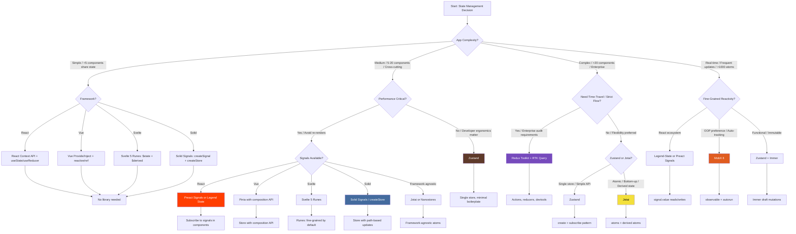

# State Management Selection Decision Tree

> **Scope:** Choosing the optimal state management solution for JavaScript/TypeScript applications in 2025-2026.
> **Target Audience:** Frontend architects and senior developers evaluating Context API, Zustand, Redux, Jotai, Signals (Solid/Vue/Preact), and MobX.

---

## 1. Executive Summary

State management in 2025-2026 has converged around a clear spectrum: **built-in React primitives** (Context + useState) for simple cases, **atomic stores** (Zustand, Jotai) for moderate complexity, **signals** (Solid, Preact, Vue Pinia with reactivity) for fine-grained performance, and **Redux** for complex enterprise applications requiring time-travel debugging and strict action-driven architecture. MobX remains viable for teams preferring OOP patterns and automatic dependency tracking.

The dominant trend is the **shift away from Redux for new projects** unless specific enterprise constraints exist, and the **rise of signals-based reactivity** across all frameworks—not just SolidJS.

---

## 2. Mermaid Decision Flowchart

---

## 3. Deep-Dive Comparison Matrix

| Dimension | React Context | Zustand 5 | Redux Toolkit | Jotai 2 | MobX 6 | Signals (Solid/Preact) | Legend-State |
|---|---|---|---|---|---|---|---|
| **Mental Model** | Top-down prop drilling | Single store, hooks | Actions → Reducers → Store | Atomic, bottom-up | Observable objects, auto-tracking | Fine-grained subscriptions | Observable objects |
| **Boilerplate** | Low | Very Low | Medium (RTK reduces it) | Low | Low | Very Low | Very Low |
| **Bundle Size** | 0 (built-in) | ~1 KB | ~11 KB (RTK) | ~5 KB | ~18 KB | ~2 KB (Preact) / ~7 KB (Solid) | ~3 KB |
| **TypeScript Support** | Good | Excellent | Excellent | Excellent | Good | Excellent | Excellent |
| **DevTools** | React DevTools | Redux DevTools (via middleware) | Redux DevTools (first-class) | React DevTools + Jotai DevTools | MobX DevTools | Solid DevTools | React DevTools |
| **Async Logic** | useEffect | Middleware or thunks | RTK Query / createAsyncThunk | Atoms with async read | flow / runInAction | createResource | Built-in async |
| **Derived State** | useMemo | selectors or derive middleware | createSelector (RTK) | derived atoms | computed | createMemo | computed |
| **Server Components** | Works but limited | Needs client boundary | Needs client boundary | Needs client boundary | Needs client boundary | N/A (Solid) | Needs client boundary |
| **Persistence** | Manual | Middleware (persist) | Middleware | atomWithStorage | spy / reaction | createStorage | Built-in persist |
| **Middleware Ecosystem** | None | Small | Massive | Small | Small | None | Small |
| **Learning Curve** | Low | Very Low | Medium | Low | Medium | Low (React devs: medium) | Low |
| **Re-renders** | All consumers | Subscribers only | Subscribers only | Atom subscribers only | Tracked components | Subscribed expressions only | Tracked properties |
| **Framework Lock-in** | React-only | React (vanilla variant exists) | React (vanilla variant exists) | React-only | Any (react-mobx binding) | Solid/Preact/Vue | React-only |
| **2025 Maturity** | Stable | Mature, actively maintained | Mature, stable | Mature, stable | Mature, stable | Rapidly evolving | Growing adoption |

---

## 4. "If X Then Y" Recommendation Logic

### Application Complexity

**If your application has <5 components sharing state (e.g., theme toggle, user auth, modal visibility),** use your framework's built-in primitives:

- React: Context API + `useState`/`useReducer`
- Vue: `provide`/`inject` + `reactive`
- Svelte: `$state` + `$derived` Runes
- Solid: `createSignal` + `createContext`

Adding a library here is premature optimization and increases bundle size unnecessarily.

**If your application has 5-20 components sharing state, with moderate cross-cutting concerns (e.g., shopping cart, filters, form state),** choose **Zustand**. Its single-store model with selector-based subscriptions provides excellent ergonomics with minimal boilerplate.

**If your application has >20 components, complex derived state, or needs atomic updates from anywhere,** choose **Jotai** or **MobX**.

- Use **Jotai** if you prefer functional programming, atomic composition, and React-first patterns.
- Use **MobX** if you prefer OOP patterns, automatic dependency tracking, and class-based stores.

**If your application is an enterprise dashboard with strict audit requirements, undo/redo, or complex async workflows,** choose **Redux Toolkit + RTK Query**. The action-driven architecture makes every state change traceable and reproducible.

### Performance Requirements

**If you have >1000 reactive values updating at 60fps (real-time data, spreadsheets, canvas apps),** choose **Signals** (Solid's `createSignal`, Preact Signals, or Legend-State for React). Fine-grained reactivity updates only the DOM nodes that changed, not entire components.

**If you have moderate update frequency but want to minimize unnecessary re-renders,** Zustand with shallow equality selectors or Jotai's atom-level subscriptions are sufficient.

**If you are using React and want signal-like performance without leaving the ecosystem,** use **Legend-State** or **Preact Signals** (via `@preact/signals-react`). Both integrate with React's concurrent features while providing fine-grained updates.

### Developer Experience & Team Background

**If your team is new to state management and wants the shortest learning curve,** choose **Zustand** or **Jotai**. Both have APIs that can be learned in under 30 minutes.

**If your team comes from an OOP background (Java, C#) and prefers class-based models,** choose **MobX**. Its `observable` / `action` / `computed` decorators feel familiar to developers coming from MVVM frameworks.

**If your team is already trained in Redux and has existing middleware/tooling,** stick with **Redux Toolkit**. The migration from legacy Redux to RTK is straightforward and preserves your investment.

**If your team is using Vue 3,** use **Pinia**. It is the official recommendation, type-safe, and integrates with Vue's composition API and DevTools.

### Server-Side Rendering & React Server Components

**If you are using Next.js 15 App Router with React Server Components,** be aware that most state management libraries require `"use client"` boundaries.

- For global state that must be shared across Server and Client Components, lift state to URL params (via `nuqs` or `useSearchParams`) or use a server-side cache (React `cache()`, Redis).
- For client-only state, **Zustand** and **Jotai** work well within client boundaries.
- For form state that spans server and client, consider **React Server Actions** + form state (React 19's `useActionState`) before reaching for a library.

**If you are using SolidStart or SvelteKit,** signals and Runes work seamlessly across server and client because the frameworks were designed with reactivity as a first-class primitive.

---

## 5. 2025-2026 Trends & Future-Proofing

### Signals Everywhere

By 2025, signals have moved beyond SolidJS. Preact Signals are widely used in React apps. Vue's reactivity system is signal-like under the hood. Angular 18+ has adopted signals. Even React's future (React Compiler / React Forget) aims to achieve signal-like granularity automatically. The key trend: **fine-grained reactivity is becoming the default mental model**.

### Redux Toolkit Remains Enterprise King

Despite the hype around lighter alternatives, Redux Toolkit remains the safest choice for large enterprise applications. Its ecosystem (RTK Query, Redux Persist, Redux Logger, Redux Saga) and the guarantee of predictable state updates make it indispensable for regulated industries.

### Zustand's Dominance in New React Projects

Zustand has become the de facto default for new React projects that need more than Context. Its ~1 KB bundle size, hooks-based API, and excellent TypeScript support make it the sweet spot for 80% of applications.

### Jotai for Atomic Composition

Jotai shines in applications where state is naturally atomic (forms with many independent fields, configuration panels, feature flags). Its bottom-up composition model scales better than top-down stores for certain architectures.

### Legend-State for Observable State

Legend-State (2024-2025) is gaining traction as a React-specific observable state library. It provides MobX-like automatic tracking with a modern React hooks API and excellent performance.

### React 19's `use` and `useActionState`

React 19 introduces `use` for reading promises/context and `useActionState` for form actions. These built-in primitives reduce the need for state libraries in form-heavy applications. Before adding Zustand for form state, try React 19's built-in solutions.

---

## 6. Common Pitfalls and Anti-Patterns

### Pitfall 1: Using Redux for Simple State

Adding Redux with its 11 KB bundle, action/reducer boilerplate, and middleware configuration for a todo app or theme toggle is over-engineering.

**Anti-pattern:** Writing `INCREMENT_COUNTER` actions and reducers for a simple counter.
**Better approach:** Use React Context + `useReducer` for simple cases; Zustand for anything slightly more complex.

### Pitfall 2: Context API for High-Frequency Updates

React Context re-renders all consumers on every update. Using it for high-frequency state (mouse position, scroll position, animation state) causes performance degradation.

**Anti-pattern:** Storing `scrollY` in Context and consuming it in 20 components.
**Better approach:** Use Zustand with selectors, Jotai atoms, or a signals library for high-frequency updates. For scroll/resize, use direct DOM refs or `useSyncExternalStore`.

### Pitfall 3: Mutating Zustand State Directly

Zustand encourages immutable updates. Direct mutation bypasses subscription notifications and breaks DevTools time-travel.

**Anti-pattern:** `useStore().count++`
**Better approach:** Use `set(state => ({ count: state.count + 1 }))` or enable Immer middleware for draft mutations.

### Pitfall 4: Creating a New Store Per Component

Zustand stores are singletons by default. Creating a store inside a component creates a new instance per mount, breaking state sharing.

**Anti-pattern:** `const useStore = create(...) inside a component`
**Better approach:** Define stores at module level. For component-scoped state, use React's `useState`.

### Pitfall 5: Over-Using Jotai Atoms for Everything

Jotai's atomic model is powerful but can lead to "atom soup"—hundreds of tiny atoms with complex dependency graphs that are hard to trace.

**Anti-pattern:** Creating a separate atom for every form field, every UI flag, and every derived value without grouping.
**Better approach:** Group related atoms into objects or use Zustand slices for cohesive state domains. Reserve atoms for truly independent state.

### Pitfall 6: Ignoring Server/Client Boundaries with State Libraries

In Next.js App Router, importing Zustand/Jotai/MobX into a Server Component throws an error or forces the entire page to be client-rendered.

**Anti-pattern:** Importing `useStore` at the top of a page that should be server-rendered.
**Better approach:** Keep state libraries in leaf Client Components. Lift server-fetchable state into Server Components and pass it down as props. Use URL state for shareable client state.

### Pitfall 7: Using MobX Without Understanding Proxies

MobX relies on Proxies for observation. Destructuring observable objects or spreading them breaks reactivity.

**Anti-pattern:** `const { name } = store.user` and expecting `name` to update.
**Better approach:** Access properties directly through the observable object or use MobX's `toJS` for snapshots.

---

## 7. Decision Checklist

Before choosing a state management solution, verify:

- [ ] **Complexity audit:** How many components share state? How deeply nested?
- [ ] **Update frequency:** Is this high-frequency (animation, real-time) or event-driven (clicks, form submits)?
- [ ] **Derived state:** How much computed state exists? Is it memoizable?
- [ ] **Async requirements:** Do you need caching, deduplication, or background refetching?
- [ ] **DevTools needs:** Is time-travel debugging required? Is Redux DevTools already in use?
- [ ] **Team familiarity:** What does the team already know?
- [ ] **Bundle budget:** Is every kilobyte critical (mobile) or acceptable (desktop admin)?
- [ ] **SSR/RSC compatibility:** Are you using Next.js App Router or another server-first framework?
- [ ] **Persistence needs:** Should state survive page reloads? (localStorage, URL, IndexedDB)
- [ ] **Framework lock-in:** Are you likely to switch frameworks in the next 2 years?

---

## 8. Quick Reference: Solution by Use Case

| Use Case | Recommended | Runner-up | Avoid |
|---|---|---|---|
| Theme / Auth / Modal (simple global) | React Context | Zustand | Redux |
| Shopping cart / filters / wizard | Zustand | Jotai | Context |
| Enterprise dashboard / audit trail | Redux Toolkit | Zustand + Immer | Context |
| Real-time trading / data grid | Solid Signals / Legend-State | Jotai | Redux, Context |
| Form-heavy app (many fields) | Jotai | React 19 useActionState | Redux |
| Vue 3 application | Pinia | Vuex 4 | Redux |
| OOP team / class-based | MobX | Zustand | Jotai |
| Cross-framework (React + Vue + Svelte) | Nanostores | RxJS | Framework-specific |
| Next.js App Router + RSC | Zustand (client islands) | Jotai | Redux (client-only) |

---

*Last updated: 2025-06. The state management landscape is stabilizing around signals and atomic stores—re-evaluate if React Compiler significantly changes the landscape.*
