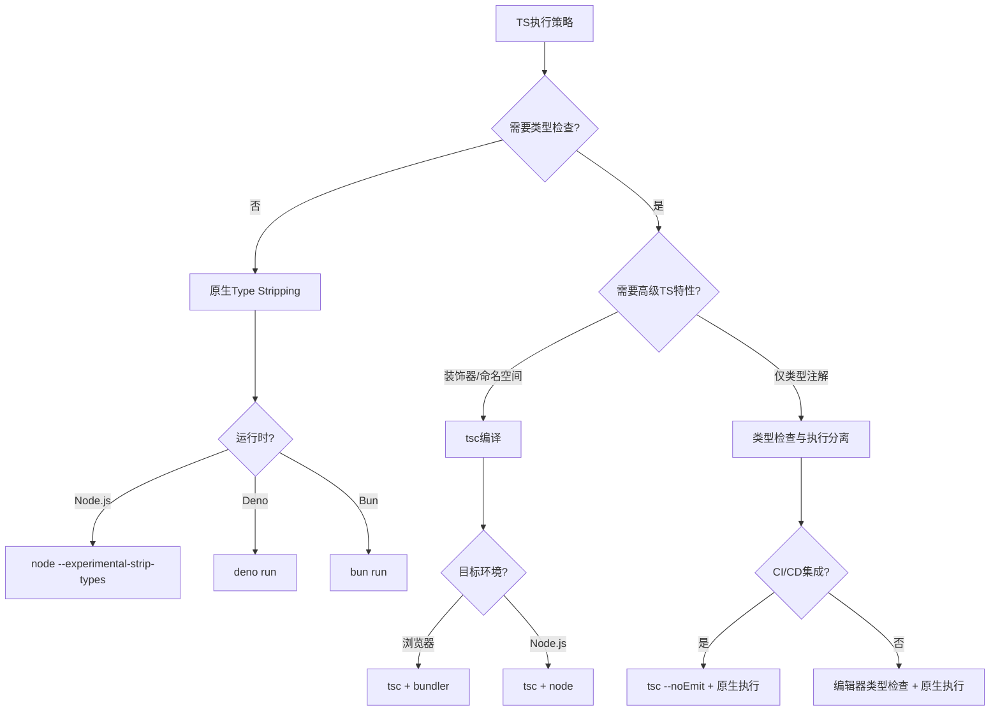

# 决策树：Type Stripping 策略选择

> **定位**：`30-knowledge-base/30.4-decision-trees/`
> **新增**：2026-04

---

## 背景

2026 年，JavaScript 运行时开始原生支持 TypeScript：

- **Node.js 24+**：`--experimental-strip-types`
- **Deno 2.7+**：原生执行，类型检查分离
- **Bun 1.3+**：内置超快转译器

**Type Stripping** 指运行时直接移除类型注解执行 TS 代码，不进行类型检查或转译。

---

## 决策树



---

## 策略对比

| 策略 | 工具 | 编译时间 | 类型安全 | 适用场景 |
|------|------|---------|---------|---------|
| **tsc 全编译** | `tsc` | 慢 | 完整 | 库开发、复杂类型 |
| **类型检查分离** | `tsc --noEmit` + `tsx` | 中等 | 完整 | 应用开发 |
| **Type Stripping** | `node --experimental-strip-types` | 极快 | 无运行时检查 | 脚本、快速原型 |
| **SWC/esbuild** | `tsx` / `ts-node --swc` | 快 | 无 | 开发环境 |

---

## Type Stripping 方式深度对比

| 方式 | 配置示例 | 保留 `import type` | 保留类型导入语句 | 输出规范 | 适用构建目标 |
|------|----------|-------------------|------------------|----------|-------------|
| **`verbatimModuleSyntax`** | `tsconfig.json` 设置 `"verbatimModuleSyntax": true` | ✅ 必须显式使用 `import type` | ✅ 仅值导入保留 | 符合 ESM 规范 | 库（需要严格区分类型与值导入） |
| **Bundler 模式** | `"moduleResolution": "bundler"` | ❌ 自动擦除未使用导入 | ⚠️ 由打包器决定 tree-shake | 依赖打包器 | 应用（Vite、Webpack、Rollup） |
| **Node.js 原生** | `node --experimental-strip-types` | ✅ 自动剥离 `import type` | ✅ 自动删除类型注解 | 纯 JS | 服务端脚本、简单工具 |
| **Deno 原生** | `deno run` | ✅ 编译时剥离 | ✅ 编译时剥离 | 纯 JS | Deno 生态全栈 |
| **Bun 原生** | `bun run` | ✅ 编译时剥离 | ✅ 编译时剥离 | 纯 JS | 高性能服务端 |

### 关键差异：`verbatimModuleSyntax` vs Bundler

```typescript
// ===== 使用 verbatimModuleSyntax =====
// tsconfig.json: { "verbatimModuleSyntax": true }

// ❌ 错误：值导入仅用于类型，会被保留为运行时导入（可能破坏 ESM）
import { SomeType } from './types';

// ✅ 正确：显式声明类型导入，编译后完全移除
import type { SomeType } from './types';

// ✅ 正确：值导入保留到运行时
import { util } from './utils';

// ===== Bundler 模式（moduleResolution: bundler） =====
// 打包器会自动 tree-shake 未使用的值导入，
// 因此即使 import { SomeType } 没有 type 前缀，最终 bundle 也不会包含它。
// 但原生运行时（Node.js/Deno/Bun）执行时，未使用的值导入可能导致「模块未找到」错误。

// ✅ 推荐：在库代码中始终使用 verbatimModuleSyntax，确保 ESM 兼容性
// ✅ 推荐：在应用代码中使用 Bundler 模式，配合 Vite/Rollup 进行 tree-shaking
```

---

## 代码示例：多运行时 Type Stripping

```typescript
// math.ts — 纯类型注解，无高级 TS 特性
export function add(a: number, b: number): number {
  return a + b;
}

export type Point = { x: number; y: number };

// main.ts
import { add, type Point } from './math.ts'; // .ts 扩展名在 Node.js 24+ 支持

const p: Point = { x: 1, y: 2 };
console.log(add(p.x, p.y));
```

**执行方式对比**：

```bash
# Node.js 24+（原生 Type Stripping）
node --experimental-strip-types main.ts

# Deno 2.7+（原生执行，类型检查可选）
deno run --no-check main.ts

# Bun 1.3+（内置超快转译）
bun run main.ts

# 传统方式：tsc 编译后执行
npx tsc --outDir dist && node dist/main.js
```

---

## 权威链接

- [Node.js TypeScript Support (Experimental)](https://nodejs.org/api/typescript.html)
- [Deno TypeScript Compatibility](https://docs.deno.com/runtime/manual/advanced/typescript/)
- [Bun TypeScript Documentation](https://bun.sh/docs/typescript)
- [TypeScript `verbatimModuleSyntax`](https://www.typescriptlang.org/tsconfig/#verbatimModuleSyntax)
- [TypeScript `moduleResolution: bundler`](https://www.typescriptlang.org/tsconfig/#moduleResolution)
- [Node.js 24 Release Notes](https://nodejs.org/en/blog/release/v24.0.0)

---

*本决策树基于 2026 年原生 TS 执行的新格局。*
