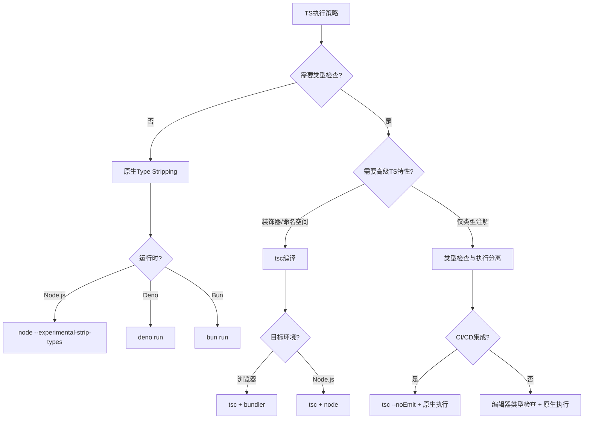

# 决策树：Type Stripping 策略选择

> **定位**：`30-knowledge-base/30.4-decision-trees/`
> **新增**：2026-04

---

## 背景

2026 年，JavaScript 运行时开始原生支持 TypeScript：
- **Node.js 24+**：`--experimental-strip-types`
- **Deno 2.7+**：原生执行，类型检查分离
- **Bun 1.3+**：内置超快转译器

**Type Stripping** 指运行时直接移除类型注解执行 TS 代码，不进行类型检查或转译。

---

## 决策树

---

## 策略对比

| 策略 | 工具 | 编译时间 | 类型安全 | 适用场景 |
|------|------|---------|---------|---------|
| **tsc 全编译** | `tsc` | 慢 | 完整 | 库开发、复杂类型 |
| **类型检查分离** | `tsc --noEmit` + `tsx` | 中等 | 完整 | 应用开发 |
| **Type Stripping** | `node --experimental-strip-types` | 极快 | 无运行时检查 | 脚本、快速原型 |
| **SWC/esbuild** | `tsx` / `ts-node --swc` | 快 | 无 | 开发环境 |

---

*本决策树基于 2026 年原生 TS 执行的新格局。*
