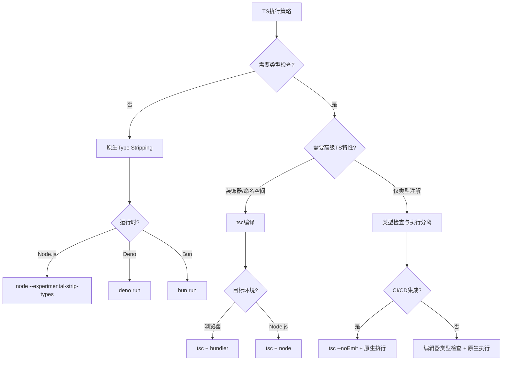

# 决策树：Type Stripping 策略选择

> **定位**：`30-knowledge-base/30.4-decision-trees/`
> **新增**：2026-04

---

## 背景

2026 年，JavaScript 运行时开始原生支持 TypeScript：

- **Node.js 24+**：`--experimental-strip-types`
- **Deno 2.7+**：原生执行，类型检查分离
- **Bun 1.3+**：内置超快转译器

**Type Stripping** 指运行时直接移除类型注解执行 TS 代码，不进行类型检查或转译。

---

## 决策树



---

## 策略对比

| 策略 | 工具 | 编译时间 | 类型安全 | 适用场景 |
|------|------|---------|---------|---------|
| **tsc 全编译** | `tsc` | 慢 | 完整 | 库开发、复杂类型 |
| **类型检查分离** | `tsc --noEmit` + `tsx` | 中等 | 完整 | 应用开发 |
| **Type Stripping** | `node --experimental-strip-types` | 极快 | 无运行时检查 | 脚本、快速原型 |
| **SWC/esbuild** | `tsx` / `ts-node --swc` | 快 | 无 | 开发环境 |

---

## Type Stripping 方式深度对比

| 方式 | 配置示例 | 保留 `import type` | 保留类型导入语句 | 输出规范 | 适用构建目标 |
|------|----------|-------------------|------------------|----------|-------------|
| **`verbatimModuleSyntax`** | `tsconfig.json` 设置 `"verbatimModuleSyntax": true` | ✅ 必须显式使用 `import type` | ✅ 仅值导入保留 | 符合 ESM 规范 | 库（需要严格区分类型与值导入） |
| **Bundler 模式** | `"moduleResolution": "bundler"` | ❌ 自动擦除未使用导入 | ⚠️ 由打包器决定 tree-shake | 依赖打包器 | 应用（Vite、Webpack、Rollup） |
| **Node.js 原生** | `node --experimental-strip-types` | ✅ 自动剥离 `import type` | ✅ 自动删除类型注解 | 纯 JS | 服务端脚本、简单工具 |
| **Deno 原生** | `deno run` | ✅ 编译时剥离 | ✅ 编译时剥离 | 纯 JS | Deno 生态全栈 |
| **Bun 原生** | `bun run` | ✅ 编译时剥离 | ✅ 编译时剥离 | 纯 JS | 高性能服务端 |

### 关键差异：`verbatimModuleSyntax` vs Bundler

```typescript
// ===== 使用 verbatimModuleSyntax =====
// tsconfig.json: { "verbatimModuleSyntax": true }

// ❌ 错误：值导入仅用于类型，会被保留为运行时导入（可能破坏 ESM）
import { SomeType } from './types';

// ✅ 正确：显式声明类型导入，编译后完全移除
import type { SomeType } from './types';

// ✅ 正确：值导入保留到运行时
import { util } from './utils';

// ===== Bundler 模式（moduleResolution: bundler） =====
// 打包器会自动 tree-shake 未使用的值导入，
// 因此即使 import { SomeType } 没有 type 前缀，最终 bundle 也不会包含它。
// 但原生运行时（Node.js/Deno/Bun）执行时，未使用的值导入可能导致「模块未找到」错误。

// ✅ 推荐：在库代码中始终使用 verbatimModuleSyntax，确保 ESM 兼容性
// ✅ 推荐：在应用代码中使用 Bundler 模式，配合 Vite/Rollup 进行 tree-shaking
```

### 完整 tsconfig.json 示例（Node.js 24+ Type Stripping）

```json
{
  "compilerOptions": {
    "target": "ES2024",
    "module": "NodeNext",
    "moduleResolution": "NodeNext",
    "verbatimModuleSyntax": true,
    "erasableSyntaxOnly": true,
    "strict": true,
    "esModuleInterop": true,
    "skipLibCheck": true,
    "outDir": "./dist",
    "rootDir": "./src"
  },
  "include": ["src/**/*"],
  "exclude": ["node_modules", "dist"]
}
```

> `erasableSyntaxOnly`（TypeScript 5.8+）确保仅使用可被擦除的语法（如类型注解、接口），禁止装饰器等需要转译的特性。

---

## 代码示例：多运行时 Type Stripping

```typescript
// math.ts — 纯类型注解，无高级 TS 特性
export function add(a: number, b: number): number {
  return a + b;
}

export type Point = { x: number; y: number };

// main.ts
import { add, type Point } from './math.ts'; // .ts 扩展名在 Node.js 24+ 支持

const p: Point = { x: 1, y: 2 };
console.log(add(p.x, p.y));
```

**执行方式对比**：

```bash
# Node.js 24+（原生 Type Stripping）
node --experimental-strip-types main.ts

# Deno 2.7+（原生执行，类型检查可选）
deno run --no-check main.ts

# Bun 1.3+（内置超快转译）
bun run main.ts

# 传统方式：tsc 编译后执行
npx tsc --outDir dist && node dist/main.js
```

### CI/CD 流水线：类型检查与执行分离

```yaml
# .github/workflows/ci.yml
name: CI
on: [push]
jobs:
  typecheck-and-test:
    runs-on: ubuntu-latest
    steps:
      - uses: actions/checkout@v4
      - uses: actions/setup-node@v4
        with:
          node-version: '24'
      - run: npm ci
      # 阶段 1：类型检查（无 emit）
      - run: npx tsc --noEmit
      # 阶段 2：原生执行测试（跳过类型检查）
      - run: node --experimental-strip-types --test src/**/*.test.ts
      # 阶段 3：运行时 benchmark
      - run: node --experimental-strip-types scripts/bench.ts
```

### tsx / ts-node 对比脚本

```bash
# tsx（基于 esbuild，极快）
npx tsx watch src/main.ts

# ts-node SWC 模式（较快，支持类型检查）
npx ts-node --swc src/main.ts

# Node.js 原生（最快，无转译开销）
node --experimental-strip-types src/main.ts
```

---

## 代码示例：package.json 脚本组合策略

```json
{
  "name": "my-ts-app",
  "type": "module",
  "engines": { "node": ">=24.0.0" },
  "scripts": {
    "dev": "node --experimental-strip-types --watch src/main.ts",
    "build": "tsc --noEmit && echo 'Type check passed'",
    "start": "node --experimental-strip-types src/main.ts",
    "test": "node --experimental-strip-types --test src/**/*.test.ts",
    "test:types": "tsc --noEmit",
    "test:coverage": "c8 node --experimental-strip-types --test src/**/*.test.ts",
    "lint": "eslint src --ext .ts",
    "format": "prettier --write 'src/**/*.ts'"
  },
  "devDependencies": {
    "@types/node": "^22.0.0",
    "typescript": "^5.8.0",
    "eslint": "^9.0.0",
    "prettier": "^3.5.0",
    "c8": "^10.0.0"
  }
}
```

---

## 代码示例：tsx 程序化 API（自定义脚本执行）

```typescript
// scripts/run-with-tsx.ts
// 当需要更复杂的构建前逻辑时使用 tsx 的编程 API

import { tsx } from 'tsx/api';
import { spawn } from 'node:child_process';
import { watch } from 'node:fs';

async function devServer(entry: string) {
  // tsx 自动处理 TypeScript，无需预编译
  const child = spawn('npx', ['tsx', 'watch', entry], {
    stdio: 'inherit',
    shell: true,
  });

  // 额外：监听 .env 变更重启
  watch('.env', () => {
    console.log('.env changed, restarting...');
    child.kill('SIGTERM');
  });
}

devServer('./src/server.ts');
```

---

## 权威链接

- [Node.js TypeScript Support (Experimental)](https://nodejs.org/api/typescript.html)
- [Deno TypeScript Compatibility](https://docs.deno.com/runtime/manual/advanced/typescript/)
- [Bun TypeScript Documentation](https://bun.sh/docs/typescript)
- [TypeScript `verbatimModuleSyntax`](https://www.typescriptlang.org/tsconfig/#verbatimModuleSyntax)
- [TypeScript `moduleResolution: bundler`](https://www.typescriptlang.org/tsconfig/#moduleResolution)
- [TypeScript `erasableSyntaxOnly`](https://www.typescriptlang.org/tsconfig/#erasableSyntaxOnly)
- [Node.js 24 Release Notes](https://nodejs.org/en/blog/release/v24.0.0)
- [tsx — TypeScript Execute](https://github.com/privatenumber/tsx)
- [SWC Documentation](https://swc.rs/docs/usage/core)
- [esbuild Documentation](https://esbuild.github.io/)
- [TypeScript Handbook — ESM/CJS Interop](https://www.typescriptlang.org/docs/handbook/modules/reference.html)
- [GitHub Actions — setup-node](https://github.com/actions/setup-node)
- [Node.js — Watch Mode](https://nodejs.org/api/cli.html#--watch)
- [Node.js — Test Runner](https://nodejs.org/api/test.html)
- [TypeScript 5.8 Release Notes](https://devblogs.microsoft.com/typescript/announcing-typescript-5-8/)
- [Deno 2.0 Migration Guide](https://docs.deno.com/runtime/manual/advanced/migrate_to_deno/)
- [Bun Bundler Documentation](https://bun.sh/docs/bundler)
- [tc39/proposal-type-annotations](https://github.com/tc39/proposal-type-annotations)
- [MDN — JavaScript Modules](https://developer.mozilla.org/en-US/docs/Web/JavaScript/Guide/Modules)

---

*本决策树基于 2026 年原生 TS 执行的新格局。*
