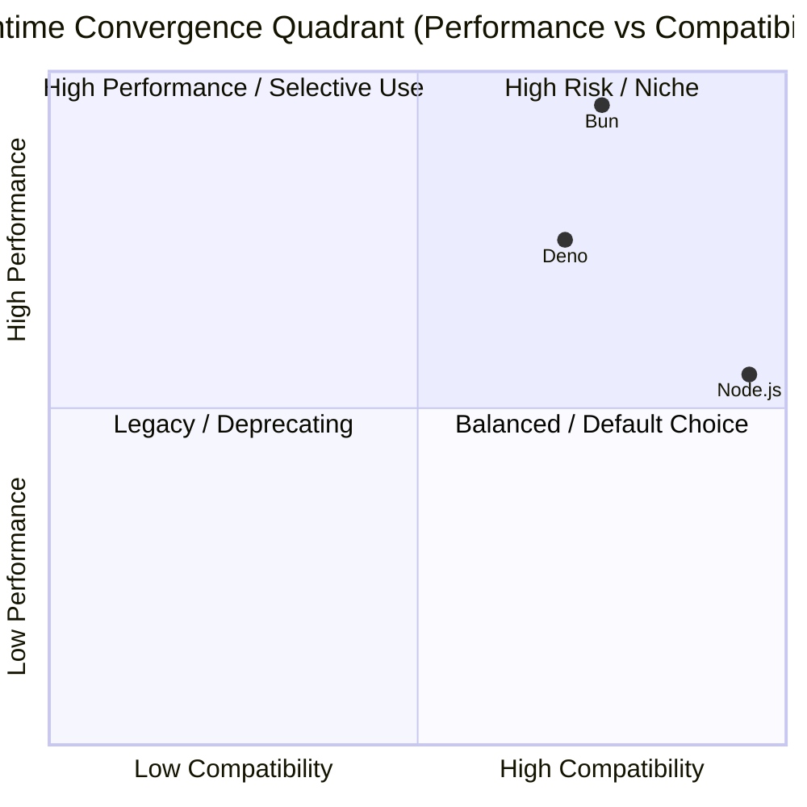
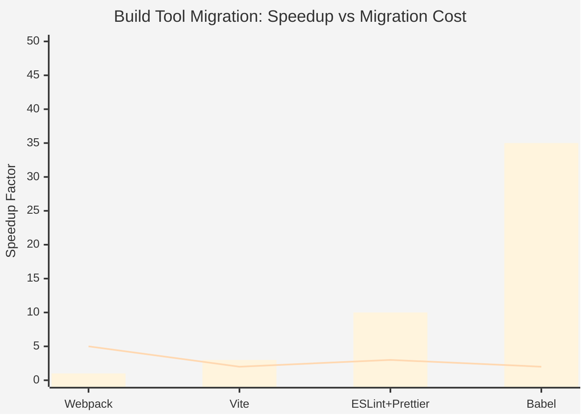

# 多维矩阵可视化索引

> **定位**：`30-knowledge-base/30.5-diagrams/matrices/`
> **关联**：`30-knowledge-base/30.3-comparison-matrices/`

---

## 概述

矩阵是知识体系中**多属性权衡决策**的核心表征形式。与文字叙述相比，矩阵通过正交维度将复杂对象的属性并置呈现，使读者能够在单一视图中完成横向对比与纵向归纳。

本目录计划将 `30.3-comparison-matrices/` 中的所有对比矩阵转化为 **Mermaid 矩阵图** 或 **增强型 Markdown 表格**，以支持文档站点的交互式渲染与导出。

---

## 已有对比矩阵源文件

### 1. 运行时对比矩阵

- **源文件**: `30-knowledge-base/30.3-comparison-matrices/runtime-compare.md`
- **主题**: Node.js (v24+) vs Bun (v2.0+) vs Deno (v2.0+)
- **维度**: JS 引擎、TS 支持、Web API 标准、安全模型、冷启动、HTTP 吞吐量、npm 兼容性、边缘部署
- **关联定理**: **T3** 运行时收敛定理
- **建议矩阵图**: `matrices/runtime-comparison.mmd`
  - 使用 Mermaid `quadrantChart` 或增强表格展示性能/兼容性/安全/生态四象限

### 2. 构建工具对比矩阵

- **源文件**: `30-knowledge-base/30.3-comparison-matrices/build-tools-compare.md`
- **主题**: Vite 8 vs Rspack v2 vs Rolldown 1.0 vs Oxc vs esbuild
- **维度**: Bundler 类型、实现语言、Dev Server、HMR、Tree Shaking、CSS 处理、TypeScript、启动时间、生态插件
- **关联趋势**: Rust 重写 JS 工具链迁移
- **建议矩阵图**: `matrices/build-tools-comparison.mmd`
  - 使用 Mermaid 流程图展示「从旧工具到新工具」的迁移路径与收益权重

---

## 建议生成的 Mermaid 矩阵图

### 运行时四象限矩阵 (`runtime-comparison.mmd`)

### 构建工具迁移矩阵 (`build-tools-comparison.mmd`)

> **注意**: Mermaid 的矩阵/图表语法持续演进，上述示例为推荐草案。实际渲染前请在 [Mermaid Live Editor](https://mermaid.live) 验证兼容性。

---

## 扩展建议矩阵主题

以下主题目前以文字形式存在于知识库中，建议未来升级为矩阵可视化：

| # | 矩阵主题 | 建议维度 | 来源文档 |
|---|---------|---------|---------|
| 1 | **状态管理方案矩阵** | 更新粒度 / 心智模型 / 生态成熟度 / 调试体验 | `docs/categories/05-state-management.md` |
| 2 | **边缘数据库选型矩阵** | 一致性模型 / 平台锁定 / 容量限制 / 定价模式 | `30.2-categories/30-edge-databases.md` |
| 3 | **前端框架 Signals 实现矩阵** | 编译时优化 / 运行时开销 / 学习曲线 / 生态兼容 | `20.5-frontend-frameworks/signals-patterns/` |
| 4 | **TypeScript 类型严格度矩阵** | 安全性 / 迁移成本 / 团队规模 / 构建速度 | `10.2-type-system/` |
| 5 | **安全防御层级矩阵** | 防御深度 / 实施成本 / 性能影响 / 覆盖范围 | `jit-security-tension-theorem.md` |
| 6 | **CSS 方案矩阵（2026）** | 运行时开销 / 开发体验 / 包体积 / 原子化能力 | `30.6-patterns/` |
| 7 | **测试策略矩阵** | 反馈速度 / 置信度 / 维护成本 / 覆盖率 | `20.7-testing/` |

---

## 矩阵设计规范

1. **维度正交性**: 每个维度必须与其他维度独立，避免信息重复
2. **可量化优先**: 优先使用数值或等级（✅/⚠️/❌），减少主观描述
3. **四象限法则**: 当比较对象为 2-4 个时，优先使用 quadrantChart 展示战略定位
4. **颜色语义**: 绿色（优势）/ 黄色（权衡）/ 红色（劣势）保持一致
5. **来源标注**: 每个数据单元格需标注数据来源或基准版本

---

*矩阵的本质是将多维决策空间压缩为二维可读视图。一个好的矩阵，胜过千言万语的权衡分析。*
