# JavaScript/TypeScript 并发模型深度解析

> 本文档从形式化角度深入剖析 JavaScript/TypeScript 的并发机制，涵盖 Event Loop、Promise、Worker Threads、内存模型等核心概念。

## 目录

- [JavaScript/TypeScript 并发模型深度解析](#javascripttypescript-并发模型深度解析)
  - [目录](#目录)
  - [1. Event Loop 的形式化模型](#1-event-loop-的形式化模型)
    - [1.1 形式化定义](#11-形式化定义)
    - [1.2 HTML 规范 vs Node.js libuv](#12-html-规范-vs-nodejs-libuv)
    - [1.3 时序图：浏览器 Event Loop](#13-时序图浏览器-event-loop)
    - [1.4 代码示例](#14-代码示例)
    - [1.5 常见陷阱](#15-常见陷阱)
  - [2. Task Queue 与 Microtask Queue 的数学模型](#2-task-queue-与-microtask-queue-的数学模型)
    - [2.1 形式化定义](#21-形式化定义)
    - [2.2 数学模型](#22-数学模型)
    - [2.3 时序图：队列优先级](#23-时序图队列优先级)
    - [2.4 代码示例](#24-代码示例)
    - [2.5 常见陷阱](#25-常见陷阱)
  - [3. Promise 的状态机形式化](#3-promise-的状态机形式化)
    - [3.1 形式化定义](#31-形式化定义)
    - [3.2 状态转移表](#32-状态转移表)
    - [3.3 时序图：Promise 链式调用](#33-时序图promise-链式调用)
    - [3.4 代码示例](#34-代码示例)
    - [3.5 常见陷阱](#35-常见陷阱)
  - [4. async/await 的转换语义](#4-asyncawait-的转换语义)
    - [4.1 形式化定义](#41-形式化定义)
    - [4.2 时序图：async/await 执行流程](#42-时序图asyncawait-执行流程)
    - [4.3 代码示例](#43-代码示例)
    - [4.4 常见陷阱](#44-常见陷阱)
  - [5. Worker Threads 的隔离语义](#5-worker-threads-的隔离语义)
    - [5.1 形式化定义](#51-形式化定义)
    - [5.2 时序图：Worker 通信](#52-时序图worker-通信)
    - [5.3 代码示例](#53-代码示例)
    - [5.4 常见陷阱](#54-常见陷阱)
  - [6. SharedArrayBuffer 和 Atomics 内存模型](#6-sharedarraybuffer-和-atomics-内存模型)
    - [6.1 形式化定义](#61-形式化定义)
    - [6.2 内存模型可视化](#62-内存模型可视化)
    - [6.3 时序图：Atomics 操作序列](#63-时序图atomics-操作序列)
    - [6.4 代码示例](#64-代码示例)
    - [6.5 常见陷阱](#65-常见陷阱)
  - [7. 竞态条件的形式化定义与检测](#7-竞态条件的形式化定义与检测)
    - [7.1 形式化定义](#71-形式化定义)
    - [7.2 竞态条件分类](#72-竞态条件分类)
    - [7.3 时序图：常见竞态模式](#73-时序图常见竞态模式)
    - [7.4 竞态检测工具与代码示例](#74-竞态检测工具与代码示例)
    - [7.5 常见陷阱](#75-常见陷阱)
  - [8. 并发模式模拟实现](#8-并发模式模拟实现)
    - [8.1 锁模式](#81-锁模式)
    - [8.2 信号量](#82-信号量)
    - [8.3 屏障模式](#83-屏障模式)
    - [8.4 时序图：屏障同步](#84-时序图屏障同步)
    - [8.5 常见陷阱](#85-常见陷阱)
  - [9. Streams API 的背压与流动模式](#9-streams-api-的背压与流动模式)
    - [9.1 形式化定义](#91-形式化定义)
    - [9.2 时序图：背压处理](#92-时序图背压处理)
    - [9.3 代码示例](#93-代码示例)
    - [9.4 常见陷阱](#94-常见陷阱)
  - [10. 并发性能优化理论](#10-并发性能优化理论)
    - [10.1 Amdahl 定律与 Gustafson 定律](#101-amdahl-定律与-gustafson-定律)
    - [10.2 性能模型](#102-性能模型)
    - [10.3 代码示例](#103-代码示例)
    - [10.4 性能优化检查清单](#104-性能优化检查清单)
    - [10.5 常见陷阱](#105-常见陷阱)
  - [附录：形式化符号参考](#附录形式化符号参考)
  - [参考资源](#参考资源)

---

## 1. Event Loop 的形式化模型

### 1.1 形式化定义

**定义 1.1 (Event Loop)**
Event Loop 是一个六元组 $E = (S, T, M, W, R, \delta)$，其中：

- $S$：执行上下文栈（Call Stack）
- $T$：任务队列（Task Queue / Macrotask Queue）
- $M$：微任务队列（Microtask Queue）
- $W$：Web APIs / 异步操作集合
- $R$：渲染步骤（Rendering Steps）
- $\delta$：状态转移函数 $\delta: (S, T, M, W) \rightarrow (S', T', M', W')$

### 1.2 HTML 规范 vs Node.js libuv

| 特性 | HTML 规范 (浏览器) | Node.js (libuv) |
|------|-------------------|-----------------|
| 任务队列数量 | 1个任务队列 + 1个微任务队列 | 6个阶段队列 (Timers → I/O Callbacks → Idle → Poll → Check → Close) |
| 微任务执行时机 | 每个任务后 | 每个阶段后 |
| 优先级 | 宏任务 → 微任务 → 渲染 | Timers → Pending → Poll → Check |
| 特殊处理 | `requestAnimationFrame` | `process.nextTick` (更高优先级) |

### 1.3 时序图：浏览器 Event Loop

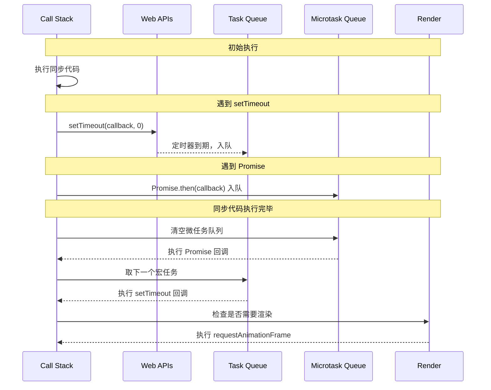

### 1.4 代码示例

```javascript
console.log('1. 同步代码开始');

setTimeout(() => console.log('2. 宏任务 (setTimeout)'), 0);

Promise.resolve().then(() => {
    console.log('3. 微任务 1');
    Promise.resolve().then(() => console.log('4. 嵌套微任务'));
});

Promise.resolve().then(() => console.log('5. 微任务 2'));

console.log('6. 同步代码结束');

// 输出顺序：
// 1. 同步代码开始
// 6. 同步代码结束
// 3. 微任务 1
// 5. 微任务 2
// 4. 嵌套微任务
// 2. 宏任务 (setTimeout)
```

### 1.5 常见陷阱

```javascript
// 陷阱 1：微任务饥饿
function starveMacrotasks() {
    Promise.resolve().then(() => {
        console.log('微任务执行');
        starveMacrotasks(); // 递归添加微任务
    });
}
// setTimeout 永远不会执行！

// 陷阱 2：Node.js 中的 nextTick 优先级
process.nextTick(() => console.log('nextTick'));
Promise.resolve().then(() => console.log('Promise'));
// 输出：nextTick → Promise (nextTick 优先级高于 Promise)

// 陷阱 3：渲染阻塞
function blockRender() {
    const start = Date.now();
    while (Date.now() - start < 1000) {
        // 阻塞 1 秒
    }
    requestAnimationFrame(blockRender);
}
// UI 将完全冻结
```

---

## 2. Task Queue 与 Microtask Queue 的数学模型

### 2.1 形式化定义

**定义 2.1 (任务队列)**
任务队列是一个先进先出（FIFO）的序列：
$$Q = \langle t_1, t_2, \ldots, t_n \rangle, \quad n \geq 0$$

其中每个任务 $t_i = (f_i, c_i, p_i)$，包含：

- $f_i$：任务函数
- $c_i$：执行上下文
- $p_i$：优先级

**定义 2.2 (队列操作)**

- 入队：$\text{enqueue}(Q, t) = Q \frown \langle t \rangle$
- 出队：$\text{dequeue}(\langle t \rangle \frown Q) = (t, Q)$
- 队首：$\text{head}(Q) = t_1$

### 2.2 数学模型

**模型 2.1 (Event Loop 状态机)**
$$\text{State} = (S, T, M, P)$$

状态转移规则：
$$\frac{M \neq \emptyset}{(S, T, M, P) \xrightarrow{\text{micro}} (S \oplus \text{head}(M), T, \text{tail}(M), P)}$$

$$\frac{M = \emptyset \land T \neq \emptyset}{(S, T, M, P) \xrightarrow{\text{macro}} (S \oplus \text{head}(T), \text{tail}(T), M, P)}$$

$$\frac{M = \emptyset \land T = \emptyset \land P \neq \emptyset}{(S, T, M, P) \xrightarrow{\text{render}} (S, T, M, \text{tail}(P))}$$

### 2.3 时序图：队列优先级

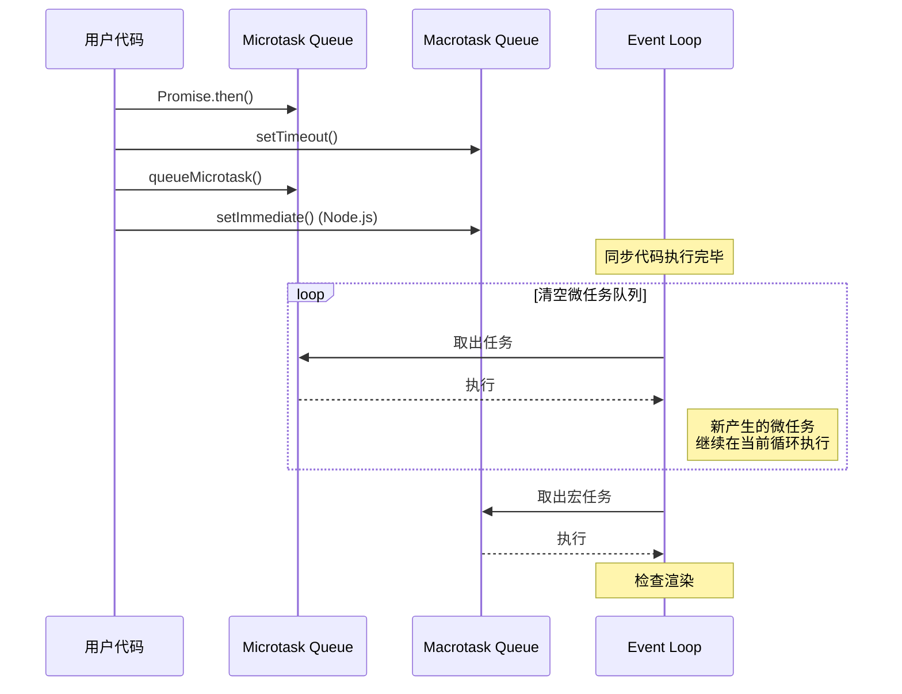

### 2.4 代码示例

```javascript
// 微任务队列演示
class MicrotaskScheduler {
    constructor() {
        this.microtasks = [];
        this.isProcessing = false;
    }

    schedule(callback) {
        this.microtasks.push(callback);
        if (!this.isProcessing) {
            this.process();
        }
    }

    async process() {
        this.isProcessing = true;
        while (this.microtasks.length > 0) {
            const task = this.microtasks.shift();
            await task();
        }
        this.isProcessing = false;
    }
}

// 使用示例
const scheduler = new MicrotaskScheduler();
scheduler.schedule(() => console.log('微任务 1'));
scheduler.schedule(() => console.log('微任务 2'));
```

### 2.5 常见陷阱

```javascript
// 陷阱 1：微任务递归导致栈溢出（概念上）
let count = 0;
function recursiveMicrotask() {
    count++;
    if (count < 10000) {
        Promise.resolve().then(recursiveMicrotask);
    }
}
recursiveMicrotask();
// 虽然不会真正栈溢出，但会阻塞宏任务

// 陷阱 2：MutationObserver 作为微任务 Hack
const observer = new MutationObserver(() => {
    console.log('MutationObserver 微任务');
});
observer.observe(document.body, { childList: true });
document.body.appendChild(document.createElement('div'));
// 比 Promise 更旧的微任务方式

// 陷阱 3：队列优先级混淆
setTimeout(() => console.log('timeout 1'), 0);
setTimeout(() => console.log('timeout 2'), 0);
Promise.resolve().then(() => console.log('promise'));
// 输出：promise → timeout 1 → timeout 2
```

---

## 3. Promise 的状态机形式化

### 3.1 形式化定义

**定义 3.1 (Promise 状态机)**
Promise 状态机是一个三元组 $P = (S, \Sigma, \delta)$，其中：

- 状态集 $S = \{Pending, Fulfilled, Rejected\}$
- 输入字母表 $\Sigma = \{resolve(v), reject(r), then(onF, onR), catch(onR)\}$
- 转移函数 $\delta: S \times \Sigma \rightarrow S$

### 3.2 状态转移表

| 当前状态 | 输入 | 下一状态 | 动作 |
|---------|------|---------|------|
| Pending | resolve(v) | Fulfilled(v) | 执行 onF 回调 |
| Pending | reject(r) | Rejected(r) | 执行 onR 回调 |
| Fulfilled(v) | then(onF, _) | Fulfilled(v') | onF(v) → v' |
| Rejected(r) | catch(onR) | Fulfilled(v') | onR(r) → v' |
| Fulfilled(v) | reject(_) | Fulfilled(v) | 忽略（不可变） |
| Rejected(r) | resolve(_) | Rejected(r) | 忽略（不可变） |

### 3.3 时序图：Promise 链式调用

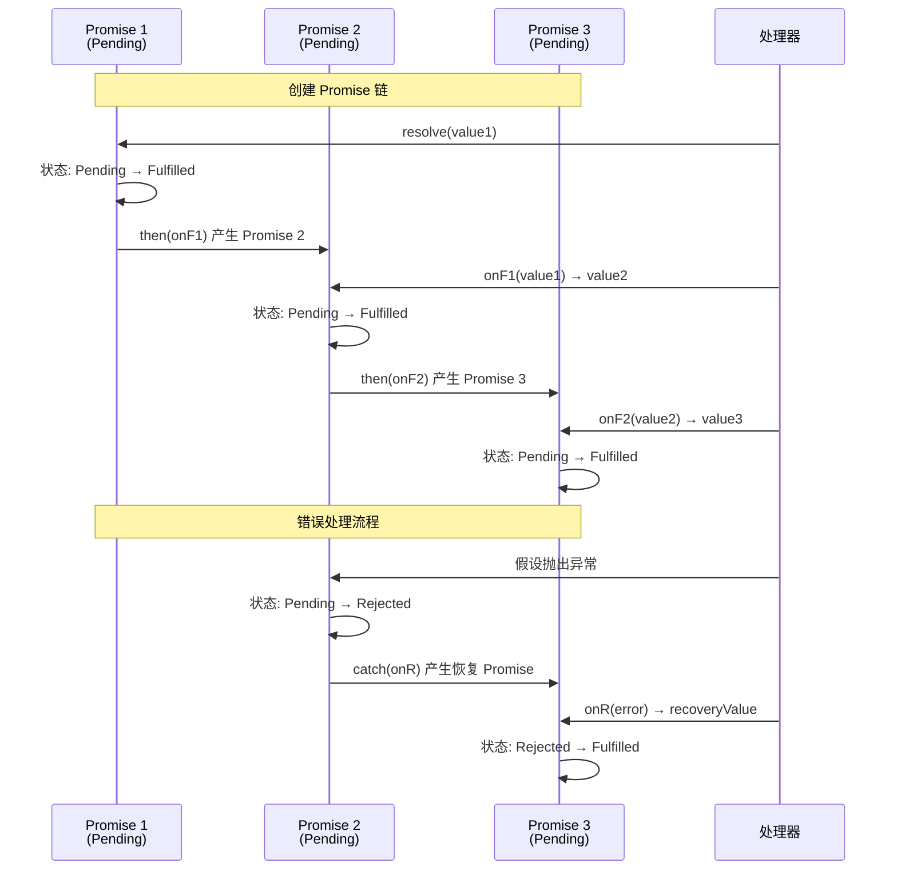

### 3.4 代码示例

```typescript
// Promise 状态机的 TypeScript 实现
enum PromiseState {
    Pending = 'pending',
    Fulfilled = 'fulfilled',
    Rejected = 'rejected'
}

interface PromiseExecutor<T> {
    (resolve: (value: T) => void, reject: (reason: any) => void): void;
}

class FormalPromise<T> {
    private state: PromiseState = PromiseState.Pending;
    private value?: T;
    private reason?: any;
    private onFulfilledCallbacks: Array<(value: T) => void> = [];
    private onRejectedCallbacks: Array<(reason: any) => void> = [];

    constructor(executor: PromiseExecutor<T>) {
        const resolve = (value: T) => {
            if (this.state === PromiseState.Pending) {
                this.state = PromiseState.Fulfilled;
                this.value = value;
                this.onFulfilledCallbacks.forEach(cb => cb(value));
            }
        };

        const reject = (reason: any) => {
            if (this.state === PromiseState.Pending) {
                this.state = PromiseState.Rejected;
                this.reason = reason;
                this.onRejectedCallbacks.forEach(cb => cb(reason));
            }
        };

        try {
            executor(resolve, reject);
        } catch (error) {
            reject(error);
        }
    }

    then<U>(
        onFulfilled?: (value: T) => U | PromiseLike<U>,
        onRejected?: (reason: any) => U | PromiseLike<U>
    ): FormalPromise<U> {
        return new FormalPromise((resolve, reject) => {
            const fulfilledHandler = (value: T) => {
                try {
                    if (!onFulfilled) {
                        resolve(value as unknown as U);
                    } else {
                        resolve(onFulfilled(value));
                    }
                } catch (error) {
                    reject(error);
                }
            };

            const rejectedHandler = (reason: any) => {
                try {
                    if (!onRejected) {
                        reject(reason);
                    } else {
                        resolve(onRejected(reason));
                    }
                } catch (error) {
                    reject(error);
                }
            };

            switch (this.state) {
                case PromiseState.Pending:
                    this.onFulfilledCallbacks.push(fulfilledHandler);
                    this.onRejectedCallbacks.push(rejectedHandler);
                    break;
                case PromiseState.Fulfilled:
                    queueMicrotask(() => fulfilledHandler(this.value!));
                    break;
                case PromiseState.Rejected:
                    queueMicrotask(() => rejectedHandler(this.reason));
                    break;
            }
        });
    }

    getState(): PromiseState {
        return this.state;
    }
}

// 使用示例
const p = new FormalPromise<number>((resolve) => {
    setTimeout(() => resolve(42), 100);
});

p.then(value => value * 2)
 .then(value => console.log(`结果: ${value}`)); // 结果: 84
```

### 3.5 常见陷阱

```javascript
// 陷阱 1：状态不可变性
const p = Promise.resolve(1);
p.then(v => console.log(v)); // 1
p.then(v => console.log(v * 2)); // 2
// Promise 是不可变的，多次 then 互不影响

// 陷阱 2：then 中的异常传播
Promise.resolve(1)
    .then(v => { throw new Error('Oops'); })
    .then(v => console.log('不会执行'))
    .catch(e => console.log('捕获:', e.message));

// 陷阱 3：Promise 构造函数中的同步异常
new Promise(() => {
    throw new Error('同步错误');
}).catch(e => console.log('捕获到:', e.message));

// 陷阱 4：延迟解决（thenable 攻击）
const evil = {
    then(resolve, reject) {
        // 可以多次调用 resolve 或 reject
        resolve(1);
        resolve(2); // 被忽略
        reject(new Error('Oops')); // 被忽略
    }
};
Promise.resolve(evil).then(v => console.log(v)); // 1

// 陷阱 5：微任务顺序
Promise.resolve().then(() => console.log(1));
Promise.resolve().then(() => console.log(2));
Promise.resolve().then(() => console.log(3));
// 输出：1, 2, 3（按注册顺序）
```

---

## 4. async/await 的转换语义

### 4.1 形式化定义

**定义 4.1 (async/await 状态机)**
async/await 可以形式化为一个**生成器状态机**，其中：

- 每个 `await` 点对应一个状态
- 状态转移由 Promise 的 resolution 触发

**转换规则**：

```
async function f() {
    const a = await expr1;  // State 0 → State 1
    const b = await expr2;  // State 1 → State 2
    return result;          // State 2 → Final
}
```

等价于：

```
function f() {
    return new Promise((resolve, reject) => {
        let state = 0;
        const step = (value) => {
            try {
                switch(state) {
                    case 0: state = 1; expr1.then(step, reject); return;
                    case 1: a = value; state = 2; expr2.then(step, reject); return;
                    case 2: b = value; resolve(result); return;
                }
            } catch(e) { reject(e); }
        };
        step();
    });
}
```

### 4.2 时序图：async/await 执行流程

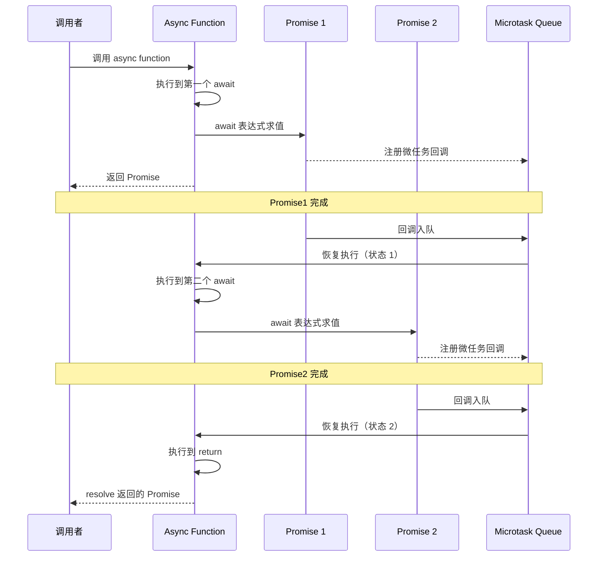

### 4.3 代码示例

```typescript
// async/await 的 Babel 转换示例
// 源代码
async function fetchUserData(userId: number) {
    const response = await fetch(`/api/users/${userId}`);
    const data = await response.json();
    return data;
}

// 转换后的状态机（简化版）
function fetchUserData(userId: number) {
    return new Promise((resolve, reject) => {
        // 状态机变量
        let state = 0;
        let response: Response;

        // 状态机执行器
        const step = (value?: any) => {
            while (true) {
                try {
                    switch (state) {
                        case 0:
                            // await fetch(...)
                            state = 1;
                            fetch(`/api/users/${userId}`).then(
                                val => step(val),
                                err => reject(err)
                            );
                            return;

                        case 1:
                            // 保存 response，执行 await response.json()
                            response = value;
                            state = 2;
                            response.json().then(
                                val => step(val),
                                err => reject(err)
                            );
                            return;

                        case 2:
                            // return data
                            resolve(value);
                            return;
                    }
                } catch (error) {
                    reject(error);
                    return;
                }
            }
        };

        step();
    });
}

// 并发的 async/await 模式
class AsyncPatterns {
    // 顺序执行
    async sequential(urls: string[]) {
        const results = [];
        for (const url of urls) {
            results.push(await fetch(url));
        }
        return results;
    }

    // 并行执行
    async parallel(urls: string[]) {
        const promises = urls.map(url => fetch(url));
        return await Promise.all(promises);
    }

    // 限制并发数
    async limitedConcurrency<T>(
        tasks: (() => Promise<T>)[],
        limit: number
    ): Promise<T[]> {
        const results: T[] = new Array(tasks.length);
        const executing: Promise<void>[] = [];

        for (let i = 0; i < tasks.length; i++) {
            const task = tasks[i];
            const p = task().then(result => {
                results[i] = result;
            });

            executing.push(p);

            if (executing.length >= limit) {
                await Promise.race(executing);
                executing.splice(
                    executing.findIndex(ep => ep === p),
                    1
                );
            }
        }

        await Promise.all(executing);
        return results;
    }
}
```

### 4.4 常见陷阱

```javascript
// 陷阱 1：在普通函数中使用 await
function normalFunction() {
    const data = await fetchData(); // SyntaxError
}

// 陷阱 2：串行执行 vs 并行执行
// 串行（慢）
async function slow() {
    const a = await fetchA();
    const b = await fetchB(); // 等待 fetchA 完成
    return [a, b];
}

// 并行（快）
async function fast() {
    const [a, b] = await Promise.all([
        fetchA(),
        fetchB()  // 同时执行
    ]);
    return [a, b];
}

// 陷阱 3：循环中的 async/await
// 错误：不会等待
items.forEach(async (item) => {
    await process(item);
});
console.log('完成'); // 不会等待所有 process

// 正确：使用 for...of
for (const item of items) {
    await process(item);
}
console.log('完成');

// 陷阱 4：try/catch 与 await
async function risky() {
    try {
        return await Promise.reject(new Error('Oops'));
    } catch (e) {
        // 会捕获
        return 'recovered';
    }
}

// 等价但微妙不同
async function subtle() {
    try {
        return Promise.reject(new Error('Oops'));
    } catch (e) {
        // 不会捕获！因为还没 await
        return 'recovered';
    }
}

// 陷阱 5：finally 的执行时机
async function demo() {
    try {
        return 'value';
    } finally {
        console.log('finally');
    }
}
// finally 在 return 值被包装为 Promise 后执行
```

---

## 5. Worker Threads 的隔离语义

### 5.1 形式化定义

**定义 5.1 (Worker 隔离模型)**
Worker 是一个独立的执行环境，形式化为：
$$W = (H_W, E_W, C_W, P_W)$$

其中：

- $H_W$：独立的堆内存（Heap）
- $E_W$：独立的全局环境（Global Environment）
- $C_W$：执行上下文（Execution Context）
- $P_W$：与父线程的通信端口（Message Port）

**定义 5.2 (结构化克隆算法)**
消息传递使用结构化克隆，支持的数据类型集合：
$$S_{clone} = \{\text{primitive}\} \cup \{\text{TypedArray}\} \cup \{\text{ArrayBuffer}\} \cup \{\text{Error}\} \cup \{\text{Map}\} \cup \{\text{Set}\} \cup \ldots$$

不支持：函数、DOM 节点、父线程中的对象引用

### 5.2 时序图：Worker 通信

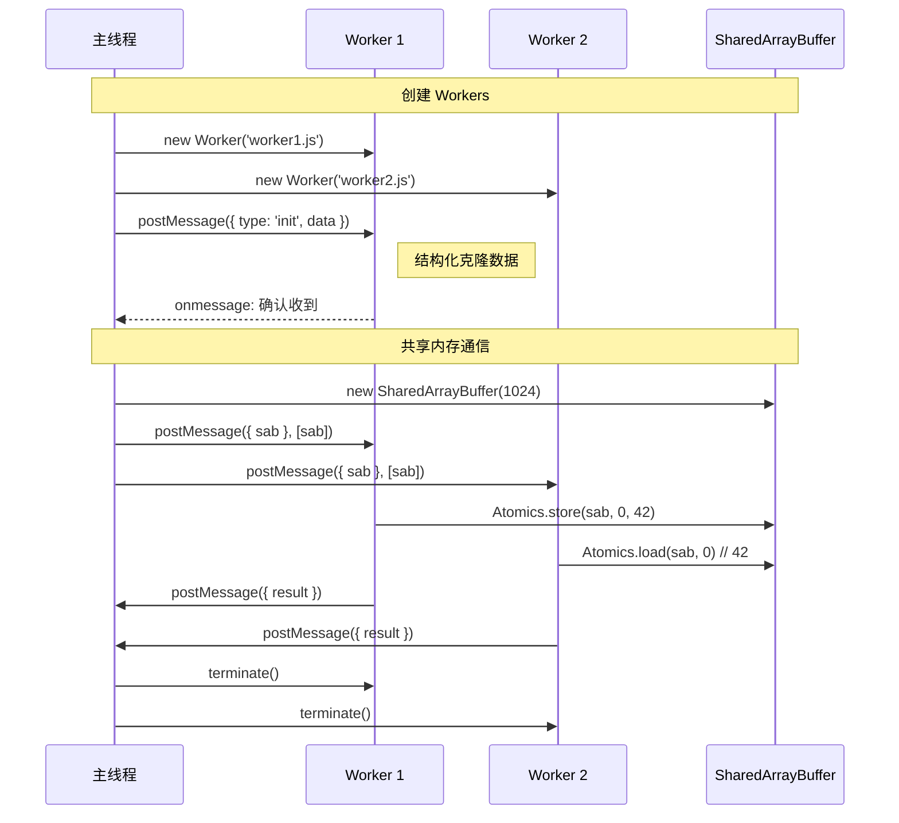

### 5.3 代码示例

```typescript
// worker.ts - Worker 线程代码
import { parentPort, workerData } from 'worker_threads';

interface WorkerInput {
    taskId: number;
    data: number[];
    operation: 'sum' | 'multiply';
}

interface WorkerOutput {
    taskId: number;
    result: number;
    executionTime: number;
}

// 处理消息
parentPort?.on('message', (input: WorkerInput) => {
    const start = performance.now();

    let result: number;
    switch (input.operation) {
        case 'sum':
            result = input.data.reduce((a, b) => a + b, 0);
            break;
        case 'multiply':
            result = input.data.reduce((a, b) => a * b, 1);
            break;
        default:
            throw new Error(`Unknown operation: ${input.operation}`);
    }

    const output: WorkerOutput = {
        taskId: input.taskId,
        result,
        executionTime: performance.now() - start
    };

    parentPort?.postMessage(output);
});

// 使用 Worker Pool
import { Worker } from 'worker_threads';
import * as os from 'os';

class WorkerPool {
    private workers: Worker[] = [];
    private queue: Array<{
        task: any;
        resolve: (value: any) => void;
        reject: (reason: any) => void;
    }> = [];
    private availableWorkers: Set<Worker> = new Set();

    constructor(
        private workerScript: string,
        poolSize: number = os.cpus().length
    ) {
        for (let i = 0; i < poolSize; i++) {
            this.createWorker();
        }
    }

    private createWorker() {
        const worker = new Worker(this.workerScript);

        worker.on('message', (result) => {
            const taskInfo = (worker as any).currentTask;
            if (taskInfo) {
                taskInfo.resolve(result);
                (worker as any).currentTask = null;
                this.availableWorkers.add(worker);
                this.processQueue();
            }
        });

        worker.on('error', (error) => {
            const taskInfo = (worker as any).currentTask;
            if (taskInfo) {
                taskInfo.reject(error);
                (worker as any).currentTask = null;
            }
            // 重启 worker
            this.workers = this.workers.filter(w => w !== worker);
            this.createWorker();
        });

        this.workers.push(worker);
        this.availableWorkers.add(worker);
    }

    execute(task: any): Promise<any> {
        return new Promise((resolve, reject) => {
            this.queue.push({ task, resolve, reject });
            this.processQueue();
        });
    }

    private processQueue() {
        while (this.queue.length > 0 && this.availableWorkers.size > 0) {
            const worker = this.availableWorkers.values().next().value;
            this.availableWorkers.delete(worker);

            const { task, resolve, reject } = this.queue.shift()!;
            (worker as any).currentTask = { resolve, reject };
            worker.postMessage(task);
        }
    }

    terminate() {
        return Promise.all(
            this.workers.map(w => w.terminate())
        );
    }
}

// 使用示例
async function main() {
    const pool = new WorkerPool('./worker.js', 4);

    const tasks = Array.from({ length: 10 }, (_, i) => ({
        taskId: i,
        data: [1, 2, 3, 4, 5],
        operation: 'sum' as const
    }));

    const results = await Promise.all(
        tasks.map(task => pool.execute(task))
    );

    console.log(results);
    await pool.terminate();
}
```

### 5.4 常见陷阱

```javascript
// 陷阱 1：共享状态（错误示范）
// main.js
const counter = { value: 0 };
worker.postMessage({ counter }); // 结构化克隆会复制 counter
// worker.js 中修改不会影响 main.js

// 陷阱 2：传递不可序列化的数据
worker.postMessage({
    fn: () => console.log('hello') // 错误！函数不能被克隆
});

// 陷阱 3：SharedArrayBuffer 的所有权转移
const sab = new SharedArrayBuffer(1024);
worker.postMessage(sab); // 错误！SAB 不能被转移
worker.postMessage({ sab }, [sab]); // 正确！但需要第二个参数

// 陷阱 4：Worker 中的全局对象不同
// 主线程：window 或 globalThis
// Worker：self 或 globalThis
// 没有 document, window 对象

// 陷阱 5：错误的错误处理
const worker = new Worker('worker.js');
worker.onerror = (e) => {
    console.log('Worker error:', e);
    // 注意：e 不包含堆栈跟踪！
};

// 更好的方式：在 Worker 内部捕获并发送
// worker.js
try {
    riskyOperation();
} catch (error) {
    parentPort.postMessage({
        error: {
            message: error.message,
            stack: error.stack
        }
    });
}

// 陷阱 6：Worker 内存泄漏
// 创建大量 Worker 但不终止
for (let i = 0; i < 1000; i++) {
    const w = new Worker('./task.js');
    w.postMessage(data);
    // 忘记 w.terminate()
}
```

---

## 6. SharedArrayBuffer 和 Atomics 内存模型

### 6.1 形式化定义

**定义 6.1 (Shared Memory Model)**
共享内存是一个字节序列：
$$M = \langle b_0, b_1, \ldots, b_{n-1} \rangle, \quad b_i \in \{0, 1\}^8$$

**定义 6.2 (内存序 - Memory Order)**

- **Sequentially Consistent (SEQ_CST)**: 所有线程看到的操作顺序一致
- **Acquire-Release**: 配对同步，保证 happens-before 关系
- **Relaxed**: 仅保证原子性，不保证顺序

**Happens-Before 关系**：
$$A \xrightarrow{hb} B \iff A \text{ 在 } B \text{ 之前执行且可见}$$

### 6.2 内存模型可视化

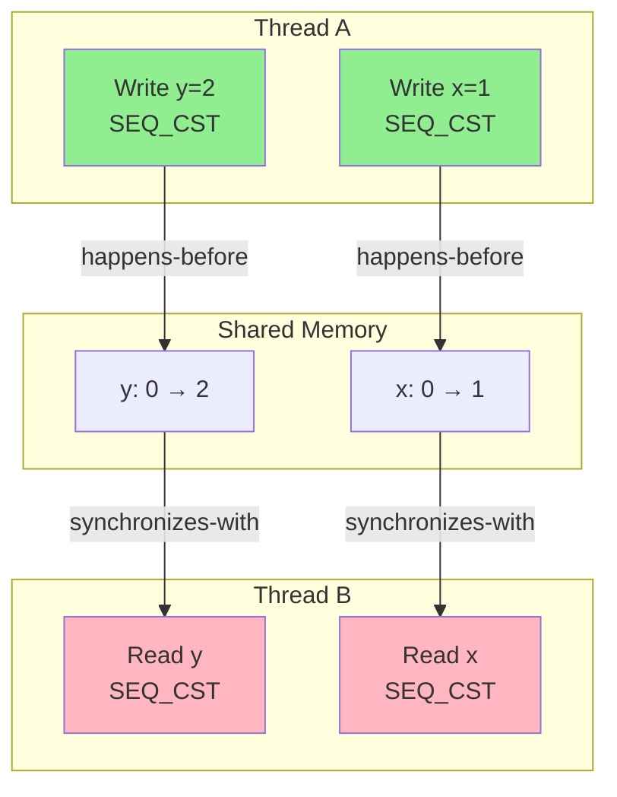

### 6.3 时序图：Atomics 操作序列

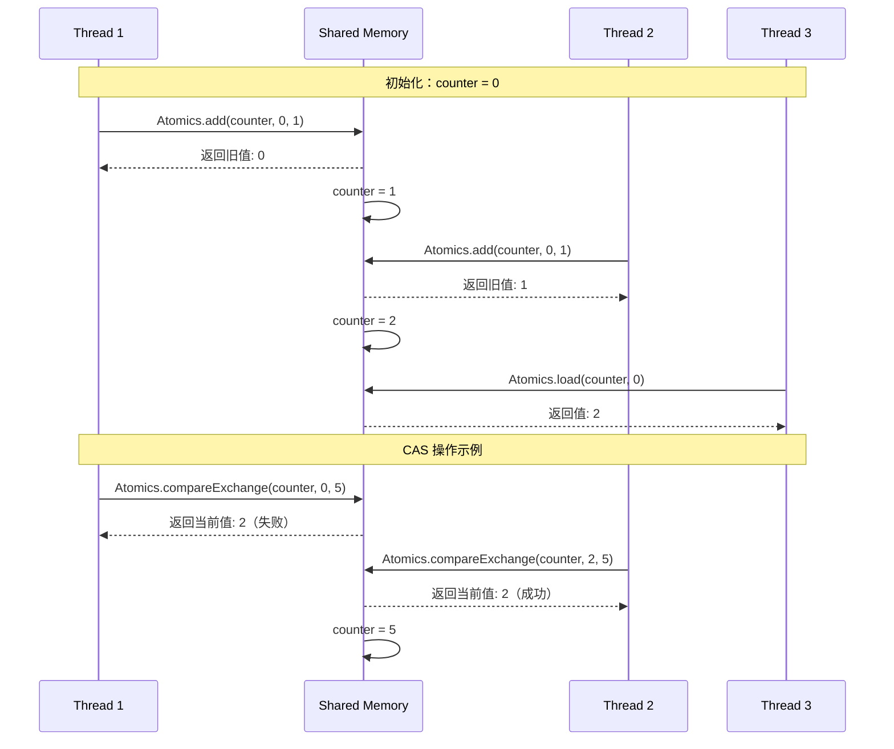

### 6.4 代码示例

```typescript
// 基于 SharedArrayBuffer 的并发数据结构

class AtomicCounter {
    private buffer: SharedArrayBuffer;
    private view: Int32Array;

    constructor(initialValue: number = 0) {
        this.buffer = new SharedArrayBuffer(4); // 4 bytes for Int32
        this.view = new Int32Array(this.buffer);
        Atomics.store(this.view, 0, initialValue);
    }

    increment(): number {
        return Atomics.add(this.view, 0, 1);
    }

    decrement(): number {
        return Atomics.sub(this.view, 0, 1);
    }

    get(): number {
        return Atomics.load(this.view, 0);
    }

    compareExchange(expected: number, replacement: number): number {
        return Atomics.compareExchange(this.view, 0, expected, replacement);
    }

    getBuffer(): SharedArrayBuffer {
        return this.buffer;
    }
}

// 基于 SAB 的无锁队列
class LockFreeQueue<T> {
    private buffer: SharedArrayBuffer;
    private head: Int32Array;
    private tail: Int32Array;
    private data: Int32Array;
    private capacity: number;

    constructor(capacity: number) {
        this.capacity = capacity;
        // head(4) + tail(4) + data(capacity * 4)
        this.buffer = new SharedArrayBuffer(8 + capacity * 4);
        this.head = new Int32Array(this.buffer, 0, 1);
        this.tail = new Int32Array(this.buffer, 4, 1);
        this.data = new Int32Array(this.buffer, 8, capacity);

        Atomics.store(this.head, 0, 0);
        Atomics.store(this.tail, 0, 0);
    }

    enqueue(value: number): boolean {
        const currentTail = Atomics.load(this.tail, 0);
        const nextTail = (currentTail + 1) % this.capacity;

        // 检查队列是否已满
        if (nextTail === Atomics.load(this.head, 0)) {
            return false; // 队列已满
        }

        // 存储数据
        Atomics.store(this.data, currentTail, value);
        // 更新 tail
        Atomics.store(this.tail, 0, nextTail);

        return true;
    }

    dequeue(): number | null {
        const currentHead = Atomics.load(this.head, 0);

        // 检查队列是否为空
        if (currentHead === Atomics.load(this.tail, 0)) {
            return null; // 队列空
        }

        const value = Atomics.load(this.data, currentHead);
        Atomics.store(this.head, 0, (currentHead + 1) % this.capacity);

        return value;
    }
}

// 读写锁的模拟实现
class ReadWriteLock {
    private state: Int32Array;  // 正数：读者数，-1：写者持有
    private writerWaiting: Int32Array;

    constructor() {
        const buffer = new SharedArrayBuffer(8);
        this.state = new Int32Array(buffer, 0, 1);
        this.writerWaiting = new Int32Array(buffer, 4, 1);
    }

    readLock(): void {
        while (true) {
            const current = Atomics.load(this.state, 0);
            if (current < 0 || Atomics.load(this.writerWaiting, 0) > 0) {
                Atomics.wait(this.state, 0, current);
                continue;
            }
            if (Atomics.compareExchange(this.state, 0, current, current + 1) === current) {
                break;
            }
        }
    }

    readUnlock(): void {
        const newVal = Atomics.sub(this.state, 0, 1) - 1;
        if (newVal === 0) {
            Atomics.notify(this.state, 0, 1);
        }
    }

    writeLock(): void {
        Atomics.add(this.writerWaiting, 0, 1);
        while (true) {
            const current = Atomics.load(this.state, 0);
            if (current !== 0) {
                Atomics.wait(this.state, 0, current);
                continue;
            }
            if (Atomics.compareExchange(this.state, 0, 0, -1) === 0) {
                break;
            }
        }
        Atomics.sub(this.writerWaiting, 0, 1);
    }

    writeUnlock(): void {
        Atomics.store(this.state, 0, 0);
        Atomics.notify(this.state, 0, Infinity);
    }
}

// 使用示例
async function demoSharedMemory() {
    const counter = new AtomicCounter(0);

    const workerCode = `
        const { parentPort, workerData } = require('worker_threads');
        const { buffer } = workerData;

        const view = new Int32Array(buffer);

        for (let i = 0; i < 1000; i++) {
            Atomics.add(view, 0, 1);
        }

        parentPort.postMessage('done');
    `;

    const { Worker } = require('worker_threads');
    const workers = [];

    for (let i = 0; i < 4; i++) {
        workers.push(new Worker(workerCode, {
            eval: true,
            workerData: { buffer: counter.getBuffer() }
        }));
    }

    await Promise.all(workers.map(w =>
        new Promise(resolve => w.on('message', resolve))
    ));

    console.log(`Final counter: ${counter.get()}`); // 4000
}
```

### 6.5 常见陷阱

```javascript
// 陷阱 1：非原子操作导致竞态条件
const sab = new SharedArrayBuffer(4);
const view = new Int32Array(sab);

// 错误：非原子递增
view[0]++; // 读-改-写不是原子的！

// 正确：原子操作
Atomics.add(view, 0, 1);

// 陷阱 2：编译器重排
// 错误：假设代码按顺序执行
Atomics.store(view, 0, 1);
Atomics.store(view, 1, 2);
// 可能的重排：view[1] 先写入

// 正确：使用内存屏障
Atomics.store(view, 0, 1);
Atomics.exchange(view, 0, Atomics.load(view, 0)); // 内存屏障
Atomics.store(view, 1, 2);

// 陷阱 3：错误的等待/通知模式
// 错误：等待和通知使用不同索引
Atomics.wait(view, 0, expectedValue);
Atomics.notify(view, 1, 1); // 错误！应该是索引 0

// 陷阱 4：ABA 问题
// 场景：
// 1. 线程 A 读取值 X
// 2. 线程 B 将值改为 Y，再改回 X
// 3. 线程 A 的 CAS 成功，但值已被修改过

// 解决方案：使用版本号（TAG 指针）
class VersionedPointer {
    // 高 32 位：版本号，低 32 位：指针
    // 或使用 128 位 CAS（如果硬件支持）
}

// 陷阱 5：忘记处理 false sharing
// 错误：多个原子变量在同一缓存行
const sab = new SharedArrayBuffer(64);
const counter1 = new Int32Array(sab, 0, 1);
const counter2 = new Int32Array(sab, 4, 1);
// 两个线程分别修改 counter1 和 counter2，但会在缓存行上竞争

// 正确：填充到不同缓存行
const sab = new SharedArrayBuffer(128);
const counter1 = new Int32Array(sab, 0, 1);      // 缓存行 0
const counter2 = new Int32Array(sab, 64, 1);     // 缓存行 1
```

---

## 7. 竞态条件的形式化定义与检测

### 7.1 形式化定义

**定义 7.1 (竞态条件)**
给定两个并发操作 $O_1$ 和 $O_2$ 访问共享资源 $R$：
$$Race(O_1, O_2, R) \iff (O_1 \parallel O_2) \land (Access(O_1, R) \land Access(O_2, R)) \land (Write(O_1, R) \lor Write(O_2, R))$$

其中：

- $O_1 \parallel O_2$：操作并发执行（没有 happens-before 关系）
- $Access(O, R)$：操作 $O$ 访问资源 $R$
- $Write(O, R)$：操作 $O$ 写入资源 $R$

**定义 7.2 (数据竞争)**
$$DataRace(O_1, O_2) \iff Race(O_1, O_2, R) \land \neg Synchronized(O_1, O_2)$$

### 7.2 竞态条件分类

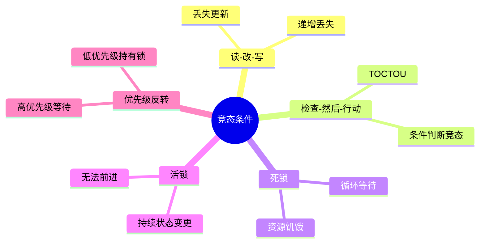

### 7.3 时序图：常见竞态模式

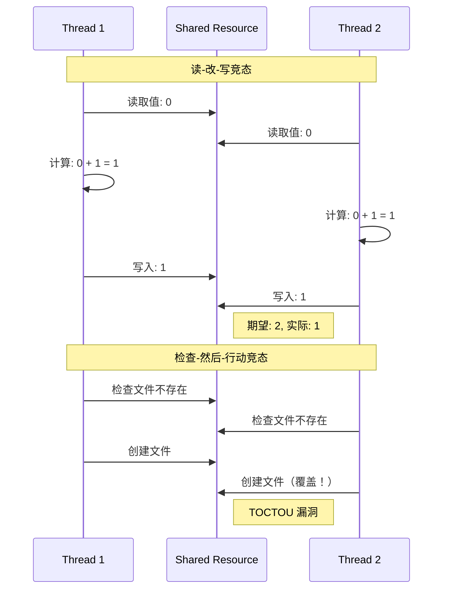

### 7.4 竞态检测工具与代码示例

```typescript
// 竞态条件检测器
class RaceDetector {
    private accesses: Map<string, Array<{
        threadId: number;
        type: 'read' | 'write';
        timestamp: number;
        stack: string;
    }>> = new Map();

    private locks: Map<string, Set<number>> = new Map();

    recordAccess(
        resourceId: string,
        threadId: number,
        type: 'read' | 'write',
        heldLocks: Set<string>
    ) {
        const access = {
            threadId,
            type,
            timestamp: performance.now(),
            stack: new Error().stack || ''
        };

        if (!this.accesses.has(resourceId)) {
            this.accesses.set(resourceId, []);
        }

        const history = this.accesses.get(resourceId)!;

        // 检查与历史访问的竞态
        for (const prev of history) {
            if (prev.threadId !== threadId) {
                // 检查是否有共同锁
                const hasCommonLock = this.haveCommonLock(
                    threadId,
                    prev.threadId,
                    resourceId
                );

                if (!hasCommonLock && (prev.type === 'write' || type === 'write')) {
                    this.reportRace(resourceId, prev, access);
                }
            }
        }

        history.push(access);

        // 限制历史记录大小
        if (history.length > 1000) {
            history.shift();
        }
    }

    private haveCommonLock(
        thread1: number,
        thread2: number,
        resource: string
    ): boolean {
        // 简化实现：检查资源是否被锁定
        const locks = this.locks.get(resource);
        return locks !== undefined && locks.size > 0;
    }

    private reportRace(
        resource: string,
        access1: any,
        access2: any
    ) {
        console.warn(`检测到竞态条件: ${resource}`);
        console.warn(`访问 1 (${access1.type}):`, access1);
        console.warn(`访问 2 (${access2.type}):`, access2);
    }

    acquireLock(resource: string, threadId: number) {
        if (!this.locks.has(resource)) {
            this.locks.set(resource, new Set());
        }
        this.locks.get(resource)!.add(threadId);
    }

    releaseLock(resource: string, threadId: number) {
        this.locks.get(resource)?.delete(threadId);
    }
}

// 线程安全的计数器（修复读-改-写竞态）
class ThreadSafeCounter {
    private value = 0;
    private lock = new Mutex();

    async increment(): Promise<number> {
        await this.lock.acquire();
        try {
            return ++this.value;
        } finally {
            this.lock.release();
        }
    }

    async get(): Promise<number> {
        await this.lock.acquire();
        try {
            return this.value;
        } finally {
            this.lock.release();
        }
    }
}

// 互斥锁实现
class Mutex {
    private locked = false;
    private queue: Array<() => void> = [];

    acquire(): Promise<void> {
        return new Promise(resolve => {
            if (!this.locked) {
                this.locked = true;
                resolve();
            } else {
                this.queue.push(resolve);
            }
        });
    }

    release() {
        if (this.queue.length > 0) {
            const next = this.queue.shift()!;
            next();
        } else {
            this.locked = false;
        }
    }
}

// 死锁检测
class DeadlockDetector {
    private waitFor: Map<number, Set<number>> = new Map();

    recordWait(threadId: number, resourceHeldBy: number) {
        if (!this.waitFor.has(threadId)) {
            this.waitFor.set(threadId, new Set());
        }
        this.waitFor.get(threadId)!.add(resourceHeldBy);

        if (this.detectCycle(threadId)) {
            throw new Error(`死锁检测: 线程 ${threadId} 和 ${resourceHeldBy}`);
        }
    }

    private detectCycle(start: number): boolean {
        const visited = new Set<number>();
        const stack = [start];

        while (stack.length > 0) {
            const current = stack.pop()!;
            if (visited.has(current)) {
                return true; // 发现循环
            }
            visited.add(current);

            const waits = this.waitFor.get(current);
            if (waits) {
                stack.push(...waits);
            }
        }

        return false;
    }

    clearWait(threadId: number) {
        this.waitFor.delete(threadId);
    }
}
```

### 7.5 常见陷阱

```javascript
// 陷阱 1：异步竞态
async function updateUser(userId, data) {
    const user = await db.getUser(userId); // 读取
    // 另一个请求可能在这里修改了 user
    await db.updateUser(userId, { ...user, ...data }); // 写入
    // 丢失更新！
}

// 修复：使用乐观锁
async function updateUserFixed(userId, data) {
    const user = await db.getUser(userId);
    const updated = await db.updateUser(
        userId,
        { ...user, ...data },
        { version: user.version } // 条件更新
    );
    if (!updated) {
        throw new Error('并发修改，请重试');
    }
}

// 陷阱 2：迭代期间的修改
const map = new Map();
// 线程 A
map.forEach((value, key) => {
    map.delete(key); // 在迭代期间修改！
});

// 修复：先收集再删除
const keys = [...map.keys()];
keys.forEach(key => map.delete(key));

// 陷阱 3：Promise 竞态
let request = null;
async function fetchData() {
    if (!request) {
        request = api.call(); // 缓存 Promise
    }
    return request;
}
// 问题：失败时 request 仍为已 reject 的 Promise

// 修复
async function fetchDataFixed() {
    if (!request) {
        request = api.call().finally(() => {
            request = null; // 完成后清除
        });
    }
    return request;
}

// 陷阱 4：数组竞态
const items = [];
// 线程 1
items.push(1);
// 线程 2
const item = items[items.length - 1]; // 可能获取到 undefined

// 陷阱 5：单例模式的竞态
class Singleton {
    static instance = null;
    static async getInstance() {
        if (!Singleton.instance) {
            // 竞态窗口！
            Singleton.instance = await createInstance();
        }
        return Singleton.instance;
    }
}

// 修复：双重检查锁定
class SingletonFixed {
    static instance = null;
    static lock = new Mutex();

    static async getInstance() {
        if (!SingletonFixed.instance) {
            await SingletonFixed.lock.acquire();
            try {
                if (!SingletonFixed.instance) {
                    SingletonFixed.instance = await createInstance();
                }
            } finally {
                SingletonFixed.lock.release();
            }
        }
        return SingletonFixed.instance;
    }
}
```

---

## 8. 并发模式模拟实现

### 8.1 锁模式

```typescript
// 可重入锁
class ReentrantLock {
    private owner: number | null = null;
    private count = 0;
    private queue: Array<() => void> = [];

    async acquire(threadId: number): Promise<void> {
        if (this.owner === threadId) {
            this.count++;
            return;
        }

        return new Promise(resolve => {
            if (this.owner === null) {
                this.owner = threadId;
                this.count = 1;
                resolve();
            } else {
                this.queue.push(() => {
                    this.owner = threadId;
                    this.count = 1;
                    resolve();
                });
            }
        });
    }

    release(threadId: number): void {
        if (this.owner !== threadId) {
            throw new Error('释放未持有的锁');
        }

        this.count--;
        if (this.count === 0) {
            this.owner = null;
            if (this.queue.length > 0) {
                const next = this.queue.shift()!;
                next();
            }
        }
    }
}

// 读写锁
class ReadWriteLock {
    private readers = new Set<number>();
    private writer: number | null = null;
    private writerQueue: Array<() => void> = [];
    private readerQueue: Array<() => void> = [];

    async readLock(threadId: number): Promise<void> {
        return new Promise(resolve => {
            if (this.writer === null && this.writerQueue.length === 0) {
                this.readers.add(threadId);
                resolve();
            } else {
                this.readerQueue.push(() => {
                    this.readers.add(threadId);
                    resolve();
                });
            }
        });
    }

    readUnlock(threadId: number): void {
        this.readers.delete(threadId);
        if (this.readers.size === 0 && this.writerQueue.length > 0) {
            const next = this.writerQueue.shift()!;
            next();
        }
    }

    async writeLock(threadId: number): Promise<void> {
        return new Promise(resolve => {
            if (this.writer === null && this.readers.size === 0) {
                this.writer = threadId;
                resolve();
            } else {
                this.writerQueue.push(() => {
                    this.writer = threadId;
                    resolve();
                });
            }
        });
    }

    writeUnlock(threadId: number): void {
        if (this.writer !== threadId) {
            throw new Error('释放未持有的写锁');
        }
        this.writer = null;

        // 优先唤醒等待的写者（写者优先）
        if (this.writerQueue.length > 0) {
            const next = this.writerQueue.shift()!;
            next();
        } else if (this.readerQueue.length > 0) {
            // 唤醒所有等待的读者
            while (this.readerQueue.length > 0) {
                const next = this.readerQueue.shift()!;
                next();
            }
        }
    }
}
```

### 8.2 信号量

```typescript
// 计数信号量
class Semaphore {
    private permits: number;
    private queue: Array<() => void> = [];

    constructor(permits: number) {
        this.permits = permits;
    }

    async acquire(): Promise<void> {
        return new Promise(resolve => {
            if (this.permits > 0) {
                this.permits--;
                resolve();
            } else {
                this.queue.push(resolve);
            }
        });
    }

    release(): void {
        if (this.queue.length > 0) {
            const next = this.queue.shift()!;
            next(); // 不增加 permits，直接传递
        } else {
            this.permits++;
        }
    }

    drain(): number {
        const drained = this.permits;
        this.permits = 0;
        return drained;
    }
}

// 限流器（基于信号量）
class RateLimiter {
    private semaphore: Semaphore;
    private interval: number;

    constructor(maxConcurrent: number, intervalMs: number) {
        this.semaphore = new Semaphore(maxConcurrent);
        this.interval = intervalMs;
        this.startReplenishment();
    }

    private startReplenishment() {
        setInterval(() => {
            this.semaphore.release();
        }, this.interval / this.semaphore.drain());
    }

    async acquire(): Promise<void> {
        await this.semaphore.acquire();
    }

    release(): void {
        // 限流器自动补充，不需要手动释放
    }
}

// 使用示例：限制并发请求数
class ConcurrentRequestManager {
    private semaphore: Semaphore;

    constructor(maxConcurrent: number) {
        this.semaphore = new Semaphore(maxConcurrent);
    }

    async execute<T>(fn: () => Promise<T>): Promise<T> {
        await this.semaphore.acquire();
        try {
            return await fn();
        } finally {
            this.semaphore.release();
        }
    }
}
```

### 8.3 屏障模式

```typescript
// 循环屏障
class CyclicBarrier {
    private parties: number;
    private count: number;
    private generation = 0;
    private waiting: Array<{
        resolve: () => void;
        action?: () => void;
    }> = [];

    constructor(parties: number, private barrierAction?: () => void) {
        this.parties = parties;
        this.count = parties;
    }

    async await(): Promise<number> {
        const gen = this.generation;

        return new Promise(resolve => {
            this.count--;

            if (this.count === 0) {
                // 最后一个到达的线程
                this.generation++;
                this.count = this.parties;

                // 执行屏障动作
                if (this.barrierAction) {
                    this.barrierAction();
                }

                // 唤醒所有等待的线程
                while (this.waiting.length > 0) {
                    const waiter = this.waiting.shift()!;
                    waiter.resolve();
                }

                resolve(0); // 返回 0 表示触发屏障
            } else {
                // 等待其他线程
                const index = this.count;
                this.waiting.push({
                    resolve: () => resolve(index)
                });
            }
        });
    }

    reset(): void {
        this.generation++;
        this.count = this.parties;
        // 唤醒所有等待的线程（以 BrokenBarrierError）
        while (this.waiting.length > 0) {
            const waiter = this.waiting.shift()!;
            waiter.resolve();
        }
    }
}

// 使用示例：并行计算
async function parallelComputation(data: number[][]): Promise<number[]> {
    const results: number[] = new Array(data.length);
    const barrier = new CyclicBarrier(data.length, () => {
        console.log('所有计算完成，开始汇总');
    });

    await Promise.all(
        data.map(async (chunk, index) => {
            results[index] = await computeChunk(chunk);
            const arrivalIndex = await barrier.await();
            console.log(`线程 ${index} 到达屏障，序号: ${arrivalIndex}`);
        })
    );

    return results;
}

async function computeChunk(chunk: number[]): Promise<number> {
    return chunk.reduce((a, b) => a + b, 0);
}
```

### 8.4 时序图：屏障同步

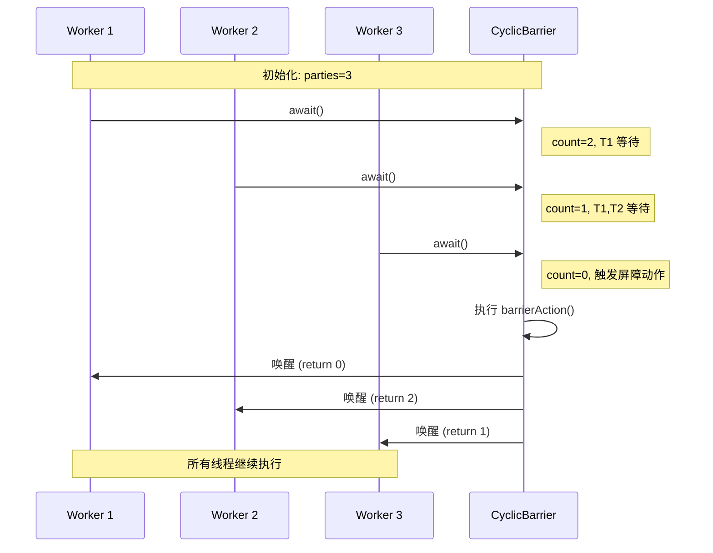

### 8.5 常见陷阱

```javascript
// 陷阱 1：锁的顺序
// 线程 A
await lockA.acquire();
await lockB.acquire(); // 等待 B

// 线程 B
await lockB.acquire();
await lockA.acquire(); // 等待 A
// 死锁！

// 修复：全局锁顺序
const lockOrder = [lockA, lockB];
async function acquireAll() {
    for (const lock of lockOrder.sort()) {
        await lock.acquire();
    }
}

// 陷阱 2：信号量释放过多
const sem = new Semaphore(1);
sem.release();
sem.release();
sem.release(); // 超过初始值！

// 陷阱 3：屏障重置竞态
const barrier = new CyclicBarrier(2);

// 线程 1
await barrier.await();

// 线程 2 还未到达
barrier.reset(); // 重置屏障

// 线程 2 到达旧的屏障，但被错误处理

// 陷阱 4：忘记释放锁
async function risky() {
    await lock.acquire();
    throw new Error('Oops'); // 锁未释放！
    lock.release();
}

// 修复：使用 try/finally
async function safe() {
    await lock.acquire();
    try {
        // 临界区
    } finally {
        lock.release();
    }
}
```

---

## 9. Streams API 的背压与流动模式

### 9.1 形式化定义

**定义 9.1 (背压模型)**
背压是数据生产者和消费者之间的流量控制机制：

$$Backpressure = f(P_{rate}, C_{rate}, B_{size})$$

其中：

- $P_{rate}$：生产者速率
- $C_{rate}$：消费者速率
- $B_{size}$：缓冲区大小

**状态机**：

- **Flowing**：消费者 > 生产者，缓冲区空
- **Buffering**：生产者 > 消费者，缓冲区填充
- **Paused**：缓冲区满，生产者暂停
- **Draining**：消费者追赶，缓冲区清空

### 9.2 时序图：背压处理

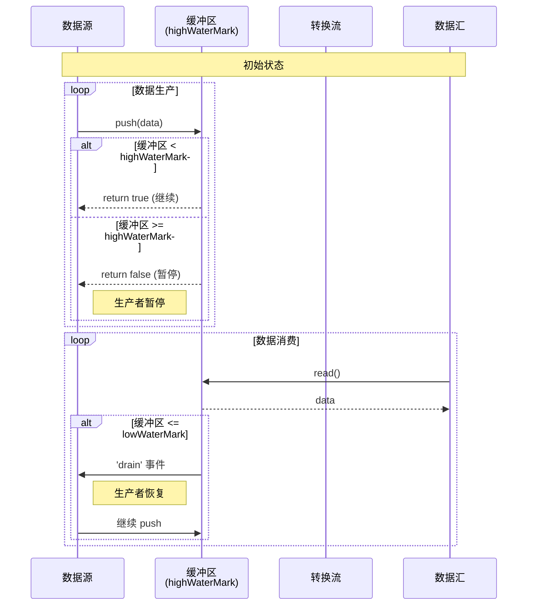

### 9.3 代码示例

```typescript
import { Readable, Writable, Transform, pipeline } from 'stream';
import { promisify } from 'util';

const pipelineAsync = promisify(pipeline);

// 自定义可读流（带背压控制）
class NumberSource extends Readable {
    private current = 0;
    private max: number;

    constructor(max: number, options?: any) {
        super({
            highWaterMark: 16, // 内部缓冲区大小
            objectMode: true,
            ...options
        });
        this.max = max;
    }

    _read(size: number): void {
        // _read 会被反复调用，直到 push 返回 false
        while (this.current < this.max) {
            const chunk = { value: this.current++, timestamp: Date.now() };

            // push 返回 false 表示缓冲区已满
            const canContinue = this.push(chunk);

            if (!canContinue) {
                console.log(`缓冲区满，暂停在 ${this.current}`);
                break;
            }
        }

        if (this.current >= this.max) {
            this.push(null); // 结束流
        }
    }
}

// 自定义转换流（带背压）
class SlowTransform extends Transform {
    private delay: number;

    constructor(delay: number, options?: any) {
        super({ objectMode: true, ...options });
        this.delay = delay;
    }

    _transform(chunk: any, encoding: string, callback: Function): void {
        // 模拟慢速处理
        setTimeout(() => {
            const transformed = {
                ...chunk,
                processed: true,
                processTime: Date.now()
            };

            // callback(err, data)
            // 如果 push 返回 false，callback 会等待 'drain' 事件
            callback(null, transformed);
        }, this.delay);
    }
}

// 自定义可写流（带背压）
class SlowSink extends Writable {
    private delay: number;

    constructor(delay: number, options?: any) {
        super({
            objectMode: true,
            highWaterMark: 4, // 较小的缓冲区制造背压
            ...options
        });
        this.delay = delay;
    }

    _write(chunk: any, encoding: string, callback: Function): void {
        console.log(`处理: ${chunk.value}, 延迟: ${this.delay}ms`);

        setTimeout(() => {
            callback(); // 完成写入
        }, this.delay);
    }
}

// 背压监控
class BackpressureMonitor extends Transform {
    private source: Readable;
    private stats = {
        totalPushed: 0,
        totalRead: 0,
        bufferSize: 0
    };

    constructor(source: Readable) {
        super({ objectMode: true });
        this.source = source;
        this.monitor();
    }

    private monitor() {
        setInterval(() => {
            const readableState = (this.source as any)._readableState;
            console.log(`缓冲区: ${readableState.length}/${readableState.highWaterMark}`);
        }, 1000);
    }

    _transform(chunk: any, encoding: string, callback: Function): void {
        this.stats.totalRead++;
        callback(null, chunk);
    }
}

// 使用示例
async function demoBackpressure() {
    const source = new NumberSource(100);
    const transform = new SlowTransform(100); // 100ms 处理时间
    const sink = new SlowSink(50); // 50ms 写入时间

    try {
        await pipelineAsync(
            source,
            transform,
            sink
        );
        console.log('Pipeline 完成');
    } catch (err) {
        console.error('Pipeline 错误:', err);
    }
}

// Web Streams API 示例
async function demoWebStreams() {
    // 创建可读流
    const readable = new ReadableStream({
        start(controller) {
            let count = 0;
            const interval = setInterval(() => {
                if (count >= 10) {
                    controller.close();
                    clearInterval(interval);
                    return;
                }

                // desiredSize 表示队列剩余空间
                const desiredSize = controller.desiredSize;
                console.log(`desiredSize: ${desiredSize}`);

                if (desiredSize !== null && desiredSize > 0) {
                    controller.enqueue({ data: count++ });
                }
            }, 100);
        },

        pull(controller) {
            // 消费者拉取数据时调用
            console.log('Pull 被调用');
        },

        cancel(reason) {
            console.log('流被取消:', reason);
        }
    }, {
        highWaterMark: 4, // 队列大小
        size(chunk) {
            return 1; // 每个 chunk 的大小
        }
    });

    // 创建转换流
    const transform = new TransformStream({
        transform(chunk, controller) {
            // 模拟慢速处理
            return new Promise(resolve => {
                setTimeout(() => {
                    controller.enqueue({
                        ...chunk,
                        transformed: true
                    });
                    resolve(undefined);
                }, 200);
            });
        }
    });

    // 管道连接
    await readable
        .pipeThrough(transform)
        .pipeTo(new WritableStream({
            write(chunk) {
                console.log('收到:', chunk);
            }
        }));
}
```

### 9.4 常见陷阱

```javascript
// 陷阱 1：忽略背压信号
readable.on('data', (chunk) => {
    writable.write(chunk); // 忽略 write 返回值！
});

// 修复：正确处理背压
readable.on('data', (chunk) => {
    if (!writable.write(chunk)) {
        readable.pause();
        writable.once('drain', () => readable.resume());
    }
});

// 陷阱 2：错误使用 pipe
readable.pipe(writable);
readable.on('data', (chunk) => {
    // 同时消费，数据竞争！
});

// 陷阱 3：未处理错误
readable.pipe(writable);
// 如果 readable 或 writable 出错，pipe 不会自动传播错误

// 修复：使用 pipeline
const { pipeline } = require('stream');
pipeline(readable, transform, writable, (err) => {
    if (err) console.error(err);
});

// 陷阱 4：内存泄漏
const buffers = [];
readable.on('data', (chunk) => {
    buffers.push(chunk); // 无限增长！
});

// 修复：限制缓冲区大小
const MAX_BUFFER_SIZE = 100;
readable.on('data', (chunk) => {
    if (buffers.length >= MAX_BUFFER_SIZE) {
        readable.pause();
    }
    buffers.push(chunk);
});

// 陷阱 5：对象模式与非对象模式混淆
const readable = new Readable({ objectMode: false });
readable.push({ foo: 'bar' }); // 错误！需要 Buffer 或 string

const readableObj = new Readable({ objectMode: true });
readableObj.push({ foo: 'bar' }); // 正确
```

---

## 10. 并发性能优化理论

### 10.1 Amdahl 定律与 Gustafson 定律

**Amdahl 定律**：
$$S_{latency}(s) = \frac{1}{(1-p) + \frac{p}{s}}$$

其中：

- $p$：可并行化的代码比例
- $s$：处理器数量

**Gustafson 定律**：
$$S_{speedup} = (1-p) + p \cdot s$$

### 10.2 性能模型

```mermaid
graph TB
    subgraph "性能优化层次"
        A[算法优化<br/>O(n²) → O(n log n)]
        B[数据结构优化<br/>Array vs Map vs Set]
        C[并发模型优化<br/>Event Loop vs Worker Threads]
        D[内存优化<br/>减少 GC 压力]
        E[I/O 优化<br/>批量 vs 流式]
    end

    A --> B --> C --> D --> E
```

### 10.3 代码示例

```typescript
// 10.1 批处理优化
class Batcher<T, R> {
    private batch: T[] = [];
    private timeout: NodeJS.Timeout | null = null;
    private readonly batchSize: number;
    private readonly flushInterval: number;
    private processor: (batch: T[]) => Promise<R[]>;

    constructor(
        processor: (batch: T[]) => Promise<R[]>,
        batchSize: number = 100,
        flushInterval: number = 50
    ) {
        this.processor = processor;
        this.batchSize = batchSize;
        this.flushInterval = flushInterval;
    }

    async add(item: T): Promise<R> {
        return new Promise((resolve, reject) => {
            const wrapped = { item, resolve, reject };
            this.batch.push(wrapped as any);

            if (this.batch.length >= this.batchSize) {
                this.flush();
            } else if (!this.timeout) {
                this.timeout = setTimeout(() => this.flush(), this.flushInterval);
            }
        });
    }

    private async flush() {
        if (this.batch.length === 0) return;

        if (this.timeout) {
            clearTimeout(this.timeout);
            this.timeout = null;
        }

        const currentBatch = this.batch.splice(0, this.batch.length);

        try {
            const items = currentBatch.map(b => b.item);
            const results = await this.processor(items);

            currentBatch.forEach((b, i) => {
                b.resolve(results[i]);
            });
        } catch (error) {
            currentBatch.forEach(b => b.reject(error));
        }
    }
}

// 10.2 内存池优化
class ObjectPool<T> {
    private pool: T[] = [];
    private create: () => T;
    private reset: (obj: T) => void;
    private maxSize: number;

    constructor(
        create: () => T,
        reset: (obj: T) => void,
        initialSize: number = 10,
        maxSize: number = 100
    ) {
        this.create = create;
        this.reset = reset;
        this.maxSize = maxSize;

        for (let i = 0; i < initialSize; i++) {
            this.pool.push(create());
        }
    }

    acquire(): T {
        if (this.pool.length > 0) {
            return this.pool.pop()!;
        }
        return this.create();
    }

    release(obj: T): void {
        if (this.pool.length < this.maxSize) {
            this.reset(obj);
            this.pool.push(obj);
        }
    }
}

// 使用示例：减少 Buffer 分配
const bufferPool = new ObjectPool<Buffer>(
    () => Buffer.alloc(1024),
    (buf) => buf.fill(0),
    100,
    1000
);

// 10.3 Worker Pool 负载均衡
class LoadBalancedWorkerPool {
    private workers: Array<{
        worker: Worker;
        load: number;
        queue: Array<() => void>;
    }> = [];

    constructor(workerScript: string, poolSize: number) {
        for (let i = 0; i < poolSize; i++) {
            const worker = new Worker(workerScript);
            this.workers.push({
                worker,
                load: 0,
                queue: []
            });

            worker.on('message', () => {
                const workerInfo = this.workers.find(w => w.worker === worker)!;
                workerInfo.load--;
                if (workerInfo.queue.length > 0) {
                    const next = workerInfo.queue.shift()!;
                    next();
                }
            });
        }
    }

    execute(data: any): Promise<any> {
        return new Promise((resolve, reject) => {
            // 选择负载最低的 worker
            const workerInfo = this.workers
                .filter(w => w.queue.length === 0)
                .sort((a, b) => a.load - b.load)[0] ||
                this.workers.sort((a, b) => a.queue.length - b.queue.length)[0];

            const doWork = () => {
                workerInfo.load++;
                const handler = (result: any) => {
                    resolve(result);
                    workerInfo.worker.off('message', handler);
                };
                workerInfo.worker.once('message', handler);
                workerInfo.worker.postMessage(data);
            };

            if (workerInfo.load < 5) {
                doWork();
            } else {
                workerInfo.queue.push(doWork);
            }
        });
    }
}

// 10.4 零拷贝优化
function zeroCopyTransfer() {
    const sab = new SharedArrayBuffer(1024 * 1024);
    const view = new Uint8Array(sab);

    // 填充数据
    for (let i = 0; i < view.length; i++) {
        view[i] = i % 256;
    }

    // 传递给 worker（零拷贝）
    const worker = new Worker('./processor.js');
    worker.postMessage({ buffer: sab }, [sab]);
    // sab 现在已在主线程中不可用
}

// 10.5 缓存优化
class LRUCache<K, V> {
    private cache: Map<K, V>;
    private maxSize: number;

    constructor(maxSize: number) {
        this.maxSize = maxSize;
        this.cache = new Map();
    }

    get(key: K): V | undefined {
        const value = this.cache.get(key);
        if (value !== undefined) {
            // 移动到最近使用
            this.cache.delete(key);
            this.cache.set(key, value);
        }
        return value;
    }

    set(key: K, value: V): void {
        if (this.cache.has(key)) {
            this.cache.delete(key);
        } else if (this.cache.size >= this.maxSize) {
            // 淘汰最久未使用
            const firstKey = this.cache.keys().next().value;
            this.cache.delete(firstKey);
        }
        this.cache.set(key, value);
    }
}

// 10.6 性能监控
class PerformanceMonitor {
    private metrics: Map<string, {
        count: number;
        total: number;
        min: number;
        max: number;
    }> = new Map();

    async measure<T>(name: string, fn: () => Promise<T>): Promise<T> {
        const start = performance.now();
        try {
            return await fn();
        } finally {
            const duration = performance.now() - start;
            this.record(name, duration);
        }
    }

    private record(name: string, duration: number) {
        let metric = this.metrics.get(name);
        if (!metric) {
            metric = { count: 0, total: 0, min: Infinity, max: 0 };
            this.metrics.set(name, metric);
        }
        metric.count++;
        metric.total += duration;
        metric.min = Math.min(metric.min, duration);
        metric.max = Math.max(metric.max, duration);
    }

    report() {
        console.log('性能报告:');
        this.metrics.forEach((metric, name) => {
            const avg = metric.total / metric.count;
            console.log(`${name}: 平均=${avg.toFixed(2)}ms, ` +
                       `最小=${metric.min.toFixed(2)}ms, ` +
                       `最大=${metric.max.toFixed(2)}ms, ` +
                       `次数=${metric.count}`);
        });
    }
}
```

### 10.4 性能优化检查清单

```markdown
## 并发性能优化检查清单

### 1. Event Loop 优化
- [ ] 避免长时间运行的同步代码
- [ ] 使用 setImmediate 分解大任务
- [ ] 避免微任务饥饿
- [ ] 合理使用 requestAnimationFrame

### 2. Worker Threads 优化
- [ ] 使用 Worker Pool 而非频繁创建/销毁
- [ ] 最小化主线程与 Worker 通信
- [ ] 使用 SharedArrayBuffer 减少拷贝
- [ ] 负载均衡分配任务

### 3. 内存优化
- [ ] 使用对象池减少 GC 压力
- [ ] 避免内存泄漏（事件监听器、闭包）
- [ ] 使用 WeakRef 和 FinalizationRegistry
- [ ] 预分配固定大小的数组

### 4. I/O 优化
- [ ] 使用批处理减少 I/O 次数
- [ ] 实现背压处理
- [ ] 使用流而非一次性加载
- [ ] 缓存频繁访问的数据

### 5. 算法优化
- [ ] 选择合适的并发模型（并行 vs 并发）
- [ ] 减少锁粒度
- [ ] 使用无锁数据结构
- [ ] 避免假共享
```

### 10.5 常见陷阱

```javascript
// 陷阱 1：过度并行化
async function overParallel(items) {
    // 创建过多并发 Promise
    return await Promise.all(
        items.map(item => process(item))
    ); // 可能导致内存耗尽！
}

// 修复：限制并发数
async function controlledParallel(items, concurrency = 10) {
    const results = [];
    const executing = [];

    for (const item of items) {
        const p = process(item).then(result => {
            results.push(result);
        });
        executing.push(p);

        if (executing.length >= concurrency) {
            await Promise.race(executing);
        }
    }

    await Promise.all(executing);
    return results;
}

// 陷阱 2：内存泄漏
const cache = new Map();
function leakyProcess(key, data) {
    cache.set(key, data); // 永远增长！
}

// 修复：使用 LRU 缓存
const lruCache = new LRUCache(1000);

// 陷阱 3：热路径上的异步
function hotPath(data) {
    return new Promise(resolve => {
        resolve(processSync(data)); // 不必要的异步！
    });
}

// 修复：保持同步
function hotPath(data) {
    return processSync(data);
}

// 陷阱 4：忽略错误处理
async function unsafeParallel() {
    const results = await Promise.all(promises);
    // 一个失败，全部失败！
}

// 修复：使用 allSettled
async function safeParallel() {
    const results = await Promise.allSettled(promises);
    return results
        .filter(r => r.status === 'fulfilled')
        .map(r => r.value);
}

// 陷阱 5：竞态条件优化
let cachedData = null;
async function getData() {
    if (!cachedData) {
        cachedData = await fetchData(); // 竞态窗口
    }
    return cachedData;
}

// 修复：使用单例模式
const dataPromise = fetchData();
async function getDataFixed() {
    return await dataPromise;
}
```

---

## 附录：形式化符号参考

| 符号 | 含义 |
|------|------|
| $E$ | Event Loop 模型 |
| $S$ | 状态集合 |
| $\delta$ | 状态转移函数 |
| $\rightarrow$ | 状态转移 |
| $\xrightarrow{hb}$ | Happens-before 关系 |
| $\parallel$ | 并行执行 |
| $\emptyset$ | 空集 |
| $\land$ | 逻辑与 |
| $\lor$ | 逻辑或 |
| $\neg$ | 逻辑非 |
| $\forall$ | 全称量词 |
| $\exists$ | 存在量词 |

---

## 参考资源

1. **HTML Standard** - Event Loop 规范
2. **ECMAScript Specification** - Promise 和 async/await 规范
3. **Node.js Documentation** - Worker Threads 和 libuv
4. **JavaScript Concurrency Patterns** - 并发模式最佳实践
5. **The Art of Multiprocessor Programming** - 并发理论基础

---

*文档版本: 1.0*
*最后更新: 2026-04-08*
