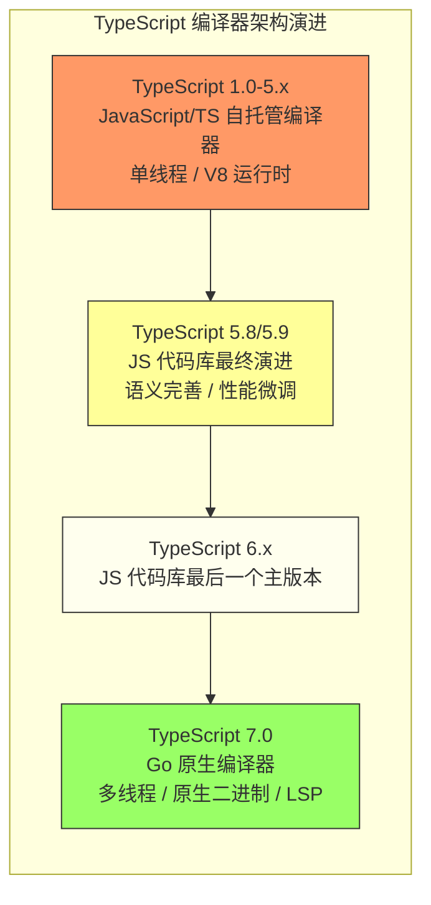

# JavaScript / TypeScript 全景综述 - TypeScript 7.0 原生编译器独立分析

> 基于 2025 年 3 月 11 日微软官方官宣的独立技术分析，聚焦 TypeScript 编译器从 JavaScript 向 Go 语言原生移植的战略意义、技术细节与生态影响。

---

## 1. 背景：大型代码库中的性能瓶颈

自 2012 年发布以来，TypeScript 编译器（`tsc`）始终采用 JavaScript/TypeScript 自托管实现。
这种设计的优势在于迭代速度快、社区贡献门槛低，但随着现代工程规模的指数级增长，基于 JavaScript 的运行时已成为难以逾越的性能瓶颈。

在 VS Code、Angular、Deno 等大型代码库中，开发者普遍面临以下三类核心问题：

| 瓶颈类型 | 具体表现 | 对开发体验的影响 |
|---------|---------|---------------|
| **编辑器启动慢** | 语言服务加载整个编译器（约 30 万行 TS）到 Node.js 中，大型 monorepo 启动可达数秒至十余秒 | 打开项目后需等待进度条才能获得自动补全与类型提示 |
| **构建时间长** | 类型推断遍历巨大 AST，结构化类型比较复杂度无理论上界；单线程模型无法利用多核 CPU | CI/CD 中类型检查成为流水线最大瓶颈 |
| **内存占用高** | V8 GC 在处理超大规模 AST 和类型图时表现不佳，VS Code 级别项目堆内存轻松突破 4 GB | 需手动设置 `--max-old-space-size`，治标不治本 |

---

## 2. TypeScript 6.x 前置语义特性

TypeScript 6.x 作为基于 JavaScript 实现的最后一个主版本系列，不仅是向 7.0 原生编译器过渡的桥梁，还承担着锁定关键语言语义的责任。
以下两项特性——**Temporal API 内置类型声明支持**与 **`import defer` 的编译器语义**——将直接影响 6.x 的类型系统边缘行为，并成为 Go 原生编译器实现兼容性的首批测试用例。

### 2.1 Temporal API 内置类型声明支持

随着 Temporal API 于 2025–2026 年间进入 Stage 4 并被主流引擎实现，TypeScript 需要在标准库（`lib.esnext.d.ts` 及后续版本）中提供**第一方类型声明**。
与社区维护的 `@types/temporal__polyfill` 不同，官方内置声明需要与 ECMA-402 规范保持逐字对齐，同时处理以下类型系统挑战：

- **大整数（`bigint`）纳秒精度**：`Temporal.Instant.epochNanoseconds` 返回 `bigint`，而现有 `Date` 使用 `number`。这要求类型声明精确区分两种数值类型，避免在算术运算中隐式混用。
- **日历系统可扩展性**：`PlainDate` 等类型接受泛型-like 的 `calendar` 选项，但 TypeScript 目前不支持将字符串字面量直接作为类型参数。内置声明采用了重载（overload）与条件类型的组合策略来模拟日历感知型（calendar-aware）API。
- **不可变链式方法的类型推断**：所有 Temporal 实例的方法均返回新实例而非修改自身。内置声明通过 `this` 类型返回与泛型约束，确保 `.add({ days: 1 })` 的返回类型保持原始具体子类型（如 `Temporal.PlainDate` 而非宽泛的 `Temporal.PlainDateTime`）。

**Go 原生编译器支持状态**：截至 2026-04，微软官方表示 Temporal 内置类型声明将**完全在 6.x 中落地**，Go 原生代码库会同步移植这些声明。
由于 Temporal 类型体系庞大（约 8 个核心类、40+ 个方法），它被视为验证 Go 编译器处理复杂 `.d.ts` 文件性能的重要基准[^1]。

### 2.2 `import defer` 的编译器语义与实现

TC39 的 *Deferring Module Evaluation* 提案（Stage 3）引入了 `import defer * as mod from './module.js'` 语法，允许模块在导入时**仅实例化而不执行顶层求值（top-level evaluation）**，直到首次访问其命名空间对象的属性或显式 `await mod` 时才触发求值。TypeScript 6.x 需要为该语法定义清晰的编译器语义：

- **延迟求值的类型可见性**：TypeScript 的类型检查在编译时即需展开模块导出类型，但 `import defer` 的运行时求值被推迟。这意味着**类型信息仍按常规导入处理**，而运行时语义由宿主环境（浏览器/Node.js）负责。编译器仅需确保生成的 JavaScript 保留 `defer` 关键字。
- **与 top-level await 的交互**：若被延迟导入的模块内部包含 `await` 的 top-level 表达式，则首次访问其导出时将隐式返回一个 Promise。TypeScript 6.x 的类型系统需要识别这种"延迟 Promise 化"行为：当编译目标为 ES2022+ 时，对延迟模块的同步属性访问在类型上仍表现为普通值，但运行时可能产生微任务延迟。目前团队倾向于**保持类型层面的普通值签名**，将异步性完全交给运行时语义，以避免过度复杂化类型推断。
- **循环依赖与副作用分析**：`import defer` 可用于打破启动时的模块循环求值链。TypeScript 编译器在此场景下需确保：**即使存在 `defer`，类型引用图仍需完整构建**，不能因运行时延迟而跳过对导出签名的解析。

**Go 原生编译器支持状态**：`import defer` 被微软列为 Go 原生编译器的 **P1 优先级** 特性。由于它涉及模块图（module graph）的构建阶段与求值阶段的分离，Go 编译器需要重新设计模块加载管线，以在并行类型检查的同时保留延迟求值边界。官方路线图预计 **2025 年底的预览版将包含基础支持**，完整兼容目标在 7.0 正式版达成[^1]。

### 2.3 6.x → 7.0 的语义对齐策略

| 特性 | 6.x (JS 编译器) | 7.0 (Go 编译器) | 风险级别 |
|------|----------------|----------------|----------|
| Temporal 内置类型 | 已完整提供 | 同步移植，已支持 | 🟢 低 |
| `import defer` 类型语义 | 定义中（2025 H2） | 2025 年底预览 | 🟡 中 |
| 模块图并行 + 延迟求值 | 不适用（单线程） | 新设计 | 🟡 中 |

---

## 3. 核心变革：Go 原生编译器移植

2025 年 3 月 11 日，微软 TypeScript 团队发布里程碑公告 *A New Era for TypeScript*，正式宣布：**启动将编译器原生移植（Native Port）到 Go 语言**。这不是实验性分支，而是 TypeScript 下一个十年演进的旗舰项目。

关键信号：

- **性能优先**：现有 JS 实现架构已接近优化天花板，要获得数量级提升，必须进行原生重写。
- **10 倍提速目标**：利用 Go 的 goroutine 并行化独立模块的类型推断，消除 JIT 开销。
- **降低内存使用**：Go 的运行时内存管理更可控，AST 与类型图数据结构可设计得更紧凑。
- **完整支持 LSP**：原生语言服务将完全迁移到标准的 Language Server Protocol（LSP）。
- **向下兼容**：目标是"编译结果逐字节一致"，现有配置与类型声明尽可能无缝迁移。

---

## 4. 路线图与版本规划

TypeScript 团队采用"双轨并行"策略，以避免对现有生态造成破坏性冲击。

### 4.1 近期：5.8/5.9（JS 代码基继续演进）

2025 年上半年发布的 5.8/5.9 仍基于现有 JavaScript 代码库，继续完善类型系统语义边缘案例，并为原生编译器积累测试用例。

### 4.2 中期：6.x 系列

TypeScript 6.x 将是基于 JavaScript 实现的**最后一个主版本系列**。期间：

- 完成所有已规划但尚未实现的类型系统特性；
- 保持与 5.x 的高度兼容性；
- 为 7.0 迁移提供前置准备（如统一的诊断消息格式、稳定的 LSP 协议实现）。

6.x 寿命预计持续 12–18 个月，期间会并行收到安全补丁和关键 bug 修复。

### 4.3 远期：TypeScript 7.0（原生代码基成熟后发布）

7.0 的发布标准非常明确：**当原生代码库与当前 JS 实现足够相当时**即可发布，包括：

- 通过现有测试套件的 99.9% 以上；
- 在微软内部至少 3 个超大型项目中无回归运行；
- 语言服务 API 行为与 6.x 完全一致。

**预计时间线：**

| 时间节点 | 里程碑 |
|---------|--------|
| **2025 年中** | 发布命令行类型检查原生实现预览版 |
| **2025 年底** | 实现项目构建与语言服务的完整原生方案 |
| **待原生代码基足够成熟时** | 正式发布 **TypeScript 7.0** |

### 4.4 维护策略

7.0 发布后短期内，微软将**并行维护 6.x 与 7.x**（类似 Node.js LTS 策略），给企业和工具链开发者足够的迁移窗口。长期目标是让版本号尽可能紧密对齐，直到 6.x 最终进入维护模式。

---

## 5. 性能数据（官方基准）

微软基于 VS Code 代码库给出了量化承诺：

| 指标 | 当前 JS 编译器 | Go 原生编译器（目标） | 提升倍数 |
|------|--------------|---------------------|---------|
| 编辑器启动速度 | ~10s | ~1.2s | **8x** |
| 项目构建时间 | ~60s | ~6s | **10x** |
| 内存使用峰值 | ~4.5GB | ~2.2GB | **~50%** |
| 语言服务操作延迟 | ~200ms | ~20ms | **10x** |

*以 VS Code 代码库为基准的性能承诺*

- **编辑器启动速度提升 8 倍**：打开大型项目后几乎立即获得自动补全、跳转到定义和实时错误提示。
- **大部分构建时间减少 10 倍**：对于超大型项目，类型检查从数分钟降至数十秒。
- **内存约为当前的一半**：Go 的 GC 针对长时间运行的服务端程序优化，峰值内存更低。

---

## 6. 生态影响

### 6.1 对现有 `tsc` API 的兼容性策略

TypeScript 团队明确承诺"向下兼容"。原生编译器将完全复现当前 TypeScript 的语义行为，编译结果目标为逐字节一致。npm 分发模式也不会改变：7.0 仍会通过 npm 发布，包内包含对应平台的原生二进制（通过 `optionalDependencies` 或 `postinstall` 下载）。

### 6.2 对自定义编译器插件、类型 Transformer 的影响

Go 实现无法直接调用 JavaScript 插件。深度依赖 `ts.createTransformer` 或自定义编译器 API 的框架（如 Angular、Vue、NestJS）面临迁移压力。短期可能需要在 6.x 兼容模式下运行；长期微软需要设计跨语言插件架构（如 WASM 运行 JS 插件，或基于 JSON/Protobuf 的插件协议）。

### 6.3 对 LSP / Language Server Protocol 的迁移

当前 TypeScript 语言服务通过私有 Node.js 进程与编辑器通信。7.0 将**完全迁移到标准 LSP**：

- **VS Code**：底层从私有协议切换为标准 LSP，性能基线更稳定。
- **Neovim / Emacs / Zed**：无需额外适配层，标准 LSP 客户端即可直接连接。
- **Web IDE**：可通过 WASM 或远程 LSP 代理接入原生编译器。

### 6.4 Node.js Type Stripping 与原生 TS 的协同

Node.js 23.6+ 已支持 `--experimental-strip-types`，允许直接运行符合 `erasableSyntaxOnly` 的 `.ts` 文件。原生编译器与此形成协同：

- **开发阶段**：跳过 transpilation，直接用 Node.js 运行 `.ts`。
- **CI/构建阶段**：原生 `tsc` 以 10 倍速完成类型检查。
- **部署阶段**：仍可用 SWC/esbuild 进行超高速打包。

这种"开发零构建、检查原生加速"的 workflow 可能成为未来标准模式。

---

## 7. 开发者建议：现在需要做什么准备

| 场景 | 行动建议 |
|------|---------|
| **所有项目** | 在 `tsconfig.json` 中启用 `erasableSyntaxOnly: true`，避免使用 `enum`、`namespace`、参数属性等需要转换的语法 |
| **避免内部 API** | 审计工具链中是否依赖未文档化的 `typescript` 内部 API；这些 API 在 7.0 中大概率会改变或消失 |
| **编译器插件/Transform** | 如果使用自定义 Transformer，提前评估向 Babel、SWC 或 esbuild 插件迁移的可行性 |
| **CI/CD 基建** | 将类型检查与构建步骤解耦，建立独立的类型检查 job，为 7.0 快速替换做准备 |
| **关注预览版** | 2025 年中发布 CLI 预览版时，在并行环境中测试性能收益与兼容性 |

---

## 参考文献

1. Microsoft TypeScript Team. *A New Era for TypeScript*. Official Blog, 2025-03-11. <https://devblogs.microsoft.com/typescript/a-new-era-for-typescript/>
2. Microsoft TypeScript Team. *TypeScript 5.8 Release Notes*. <https://devblogs.microsoft.com/typescript/announcing-typescript-5-8/>
3. Node.js Documentation. *Type Stripping*. <https://nodejs.org/api/typescript.html#type-stripping>
4. Language Server Protocol Specification. <https://microsoft.github.io/language-server-protocol/>

---

*本文档创建于 2026-04-02，是对 TypeScript 编译器未来演进方向的独立分析。*
