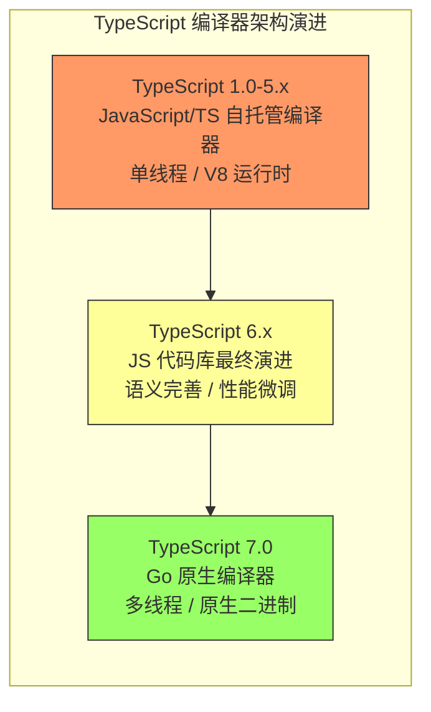

# JavaScript / TypeScript 全景综述 - TypeScript 7.0 原生编译器深度分析

> 面向中高级开发者与架构师的独立技术分析，聚焦 TypeScript 编译器从 JavaScript 向 Go 语言原生移植的战略意义、技术细节与生态影响。

---

## 1. 背景与动机

### 1.1 当前 TypeScript 编译器的性能瓶颈

自 2012 年发布以来，TypeScript 编译器（`tsc`）始终是一个基于 JavaScript/TypeScript 自托管实现的工具。
这种设计的优势在于开发迭代速度快、社区贡献门槛低、语言特性可以"吃自己的狗粮"（dogfooding）。
然而，随着现代前端工程规模的指数级增长，基于 JavaScript 的运行时逐渐成为难以逾越的性能瓶颈。

在大型代码库（如 VS Code、Angular、Deno 等）中，开发者普遍面临以下三类核心问题：

**加载时间（Load Time）**

`tsc` 需要将整个编译器源码（约 30 万行 TypeScript）加载到 Node.js 运行时中。
在大型 monorepo 场景下，程序启动时间可能达到数秒甚至十余秒。
对于依赖类型检查作为前置步骤的 CI/CD 流水线，这种启动开销是纯粹的"死时间"。

**类型检查时间（Type-Checking Time）**

TypeScript 的类型系统具有图灵完备性，这意味着类型推断的复杂度在理论上没有上界。
在大型项目中，类型检查需要遍历巨大的抽象语法树（AST），进行多轮符号解析、控制流分析和结构化类型比较。
当前 JavaScript 实现的单线程模型无法充分利用现代多核 CPU 的并行能力，导致类型检查成为构建流水线的最大瓶颈之一。

**内存占用（Memory Footprint）**

JavaScript 引擎（如 V8）的垃圾回收机制在处理超大规模 AST 和类型图时表现不佳。
在 VS Code 级别的项目中，`tsc` 的堆内存占用轻松突破 4GB，甚至触发 Node.js 的默认内存限制。
开发者不得不通过 `--max-old-space-size` 手动扩容，但这只是治标不治本。

### 1.2 微软官方宣布：原生移植到 Go 语言

2025 年 3 月 11 日，微软 TypeScript 团队在官方博客发布了一篇具有里程碑意义的公告：《A New Era for TypeScript》。
文中正式宣布：**TypeScript 团队正在将编译器原生移植（Native Port）到 Go 语言**。
这不是一个实验性分支，而是 TypeScript 下一个十年演进的旗舰项目。

这篇公告明确传递了几个关键信号：

- **性能优先**：现有 JavaScript 实现的架构已经接近优化天花板，要获得数量级的性能提升，必须进行原生重写。
- **向下兼容**：原生编译器将完全复现当前 TypeScript 的语义行为，目标是"编译结果逐字节一致"。
- **生态延续**：这不是一个 fork 或竞品，而是 TypeScript 本身的演进。现有配置、类型声明和工具链集成将尽可能无缝迁移。

这一消息在前端社区引发了广泛讨论。
毕竟，TypeScript 自诞生以来一直以"用 TypeScript 写 TypeScript"为傲，如今转向 Go 语言，意味着开发范式、贡献门槛和性能基线都将发生根本性转变。

---

## 2. 核心目标与性能承诺

### 2.1 官方性能数据承诺

微软在公告中给出了非常具体的性能目标。
这些数据不是泛泛的"更快"，而是基于真实代码库（主要是 VS Code 仓库）测量的量化承诺：

| 指标 | 当前 JS 编译器 | Go 原生编译器（目标） | 提升倍数 |
|------|--------------|---------------------|---------|
| 编辑器启动速度 | ~10s | ~1.2s | **8x** |
| 项目构建时间 | ~60s | ~6s | **10x** |
| 内存使用峰值 | ~4.5GB | ~2.2GB | **~50%** |
| 语言服务操作延迟 | ~200ms | ~20ms | **10x** |

*表 1：TypeScript 原生编译器性能承诺（以 VS Code 代码库为基准）*

**编辑器启动速度提升 8 倍**

这里的"启动速度"指的是语言服务（Language Service）从 IDE 请求到首次返回类型信息的时间。
对于开发者而言，这意味着打开一个大型项目后，可以几乎立即获得自动补全、跳转到定义和实时错误提示，而不需要等待进度条走完。

**大部分构建时间减少 10 倍**

构建时间的缩短主要来自两个层面：一是原生代码的执行效率（Go 编译为机器码，无 JIT 开销）；二是并发架构的引入（Go 的 goroutine 可以并行处理独立的模块和类型图分支）。
对于动辄数分钟类型检查时间的超大型项目，10 倍加速意味着从 5 分钟降到 30 秒，直接改变开发 workflow。

**内存使用约为当前的一半**

Go 的运行时内存管理相比 V8 更加可控，且原生编译器可以对 AST 和类型图的数据结构进行更紧凑的布局设计。
此外，Go 的垃圾回收器针对长时间运行的服务端程序优化，在处理编译器这种"批处理+长生命周期"任务时，暂停时间更短、峰值内存更低。

**语言服务操作响应速度显著提高**

这涵盖了重命名符号、查找所有引用、重构提取函数等操作的响应时间。
当前这些操作在大型文件中可能需要数百毫秒，导致 IDE 出现可感知的卡顿。
原生编译器的目标是将绝大多数操作降到 20ms 以内，达到"零感知延迟"。

### 2.2 为什么是 Go，而不是 Rust 或 C++？

社区对这一决策最大的疑问是：为什么选 Go，而不是近年来在系统编程和编译器领域大热的 Rust？TypeScript 团队在博客和后续访谈中给出了多维度解释：

**并发模型（Goroutine）**

Go 的 goroutine 和 channel 模型极其适合编译器的任务并行化。TypeScript 的类型检查天然具有模块级别的独立性：不同文件之间的类型推断可以大量并行进行。
Go 的轻量级线程让编写高并发编译器变得直观，而 Rust 的所有权模型虽然也能实现并行，但心智负担和开发周期显著更高。

**垃圾回收与开发速度**

编译器是一个极其复杂的状态机，涉及大量的图遍历、缓存和临时对象。
Rust 的手动内存管理在这些场景下会显著拖慢开发速度。
TypeScript 团队的核心目标是尽快交付一个与现有编译器语义一致的原生实现，GC 语言可以让他们更专注于算法和架构，而不是与借用检查器搏斗。

**团队熟悉度与生态**

微软内部已经有多个团队在使用 Go 构建高性能工具（如 Azure 的部分 CLI 工具、GitHub 的后端服务）。
TypeScript 团队中部分核心成员对 Go 有实际项目经验，这降低了迁移风险。
相比之下，C++ 的开发效率过低，Rust 的人才储备在团队内部相对不足。

**跨平台编译与分发**

Go 的交叉编译能力极强，可以一键生成 Windows、macOS、Linux 的 x64/ARM 二进制文件，且单个静态二进制文件的分发体验对终端用户极为友好。
这对于需要通过 npm 分发原生编译器的 TypeScript 来说至关重要。

| 维度 | Go | Rust | C++ | 评估 |
|------|----|------|-----|------|
| 并发开发效率 | ★★★★★ | ★★★☆☆ | ★★★☆☆ | Go 的 goroutine 极大简化并行编译器实现 |
| 内存安全 | ★★★★☆ | ★★★★★ | ★★☆☆☆ | Rust 最强，但 Go 的 GC 在编译器场景足够安全 |
| 开发速度 | ★★★★★ | ★★★☆☆ | ★★☆☆☆ | Go 最快，符合团队尽快交付的目标 |
| 跨平台编译 | ★★★★★ | ★★★★☆ | ★★★☆☆ | Go 的单二进制静态链接分发体验最佳 |
| 团队熟悉度 | ★★★★★ | ★★★☆☆ | ★★★★☆ | 微软内部 Go 经验丰富 |
| 运行时性能 | ★★★★☆ | ★★★★★ | ★★★★★ | C++/Rust 理论峰值更高，但 Go 已足够达到目标 |

*表 2：TypeScript 原生编译器技术选型决策矩阵*

---

## 3. 版本化路线图与发布策略

TypeScript 团队采用了一种谨慎但坚定的"双轨并行"策略，以避免对现有生态造成破坏性冲击。

### 3.1 TypeScript 5.8/5.9：JS 代码库的继续演进

在 2025 年上半年，TypeScript 5.8 和 5.9 仍基于现有的 JavaScript 代码库发布。
这些版本继续完善类型系统的语义边缘案例，修复长期存在的 bug，并为原生编译器积累测试用例。
对于普通开发者而言，这两个版本是稳定的、可预期的常规升级。

### 3.2 TypeScript 6.x 系列：JS 代码库的最终主版本

TypeScript 6.x 将是基于 JavaScript 实现的最后一个主版本系列。团队承诺在 6.x 中：

- 完成所有已规划但尚未实现的类型系统特性。
- 保持与 5.x 的高度兼容性。
- 为 7.0 的迁移提供尽可能多的前置准备（如统一的诊断消息格式、稳定的 LSP 协议实现）。

6.x 的寿命预计会持续 12-18 个月，期间会并行收到安全补丁和关键 bug 修复。

### 3.3 TypeScript 7.0：原生编译器的预览与正式发布计划

TypeScript 7.0 的发布标准非常明确：**当原生代码库与当前 JavaScript 实现的 TypeScript 足够相当时**，7.0 就会正式发布。这里的"足够相当"包括：

- 通过现有测试套件的 99.9% 以上。
- 在微软内部至少 3 个超大型项目（VS Code、Office Online、Azure Portal）中无回归运行。
- 语言服务（Language Service）的 API 行为与 6.x 完全一致。

**预计时间线：**

- **2025 年中**：发布原生编译器的命令行类型检查预览版（Preview）。开发者可以下载独立二进制体验 10 倍速的类型检查。
- **2025 年底**：实现项目构建（Project Build）和语言服务（Language Service）的完整原生解决方案。
- **2026 年**：TypeScript 7.0 预览版 / 前瞻发布。

### 3.4 双轨维护策略

在 7.0 发布后的短期内，微软会同时维护 6.x（JS 版本）和 7.x（原生版本）两条线。这类似于 Node.js 的 LTS 策略，给企业和工具链开发者足够的迁移窗口。长期目标是让 6.x 和 7.x 的版本号尽可能紧密对齐（例如 6.8 对应 7.8），直到 6.x 最终进入维护模式并停止更新。

---

## 4. 对开发者体验的影响

### 4.1 LSP 迁移与编辑器生态

当前 TypeScript 的语言服务是通过一个私有的 Node.js 进程与编辑器通信的。虽然 VS Code 等编辑器已经将其包装成了事实上的 LSP，但底层协议并非标准 LSP。TypeScript 7.0 的一个重要变化是：**原生语言服务将完全迁移到标准的 Language Server Protocol（LSP）**。

这意味着：

- **VS Code**：将继续获得最优先的支持，但底层通信机制从私有协议切换为标准 LSP，可能带来更稳定的性能基线。
- **Neovim / Emacs / Zed**：这些编辑器将不再需要额外的 TypeScript 插件适配层，标准 LSP 客户端即可直接连接原生语言服务。这对于非 VS Code 用户是重大利好。
- **Web IDE**：浏览器中运行的 IDE（如 GitHub Codespaces、StackBlitz）可以通过 WASM 或远程 LSP 代理的方式接入原生编译器，进一步降低延迟。

### 4.2 npm 分发模式澄清

社区中流传一种误解："TypeScript 7.0 之后，`node_modules` 里就没有 `tsc` 了，必须手动安装二进制。" 这种理解是错误的。TypeScript 团队明确澄清：

**TypeScript 7.0 仍会通过 npm 分发。**

不同之处在于，npm 包内部将包含对应平台的原生二进制文件（通过 `optionalDependencies` 或 `postinstall` 脚本下载）。开发者继续运行 `npm install typescript`，然后使用 `npx tsc` 或 `node_modules/.bin/tsc`，用户体验不会有明显变化。对于不支持原生二进制的平台，可能会保留一个兼容性 fallback（如 WASM 构建）。

### 4.3 与 Node.js Type Stripping 的互动

Node.js 从 23.6 开始支持 `--experimental-strip-types` 标志，允许直接运行包含类型注解的 TypeScript 文件（前提是使用 `erasableSyntaxOnly` 配置，即不使用 `enum`、`namespace` 等需要转换的语法）。

原生编译器的到来与这一趋势形成了有趣的协同：

- **开发阶段**：开发者可以完全跳过 transpilation，直接用 Node.js 运行 `.ts` 文件（类型被运行时忽略）。
- **CI/构建阶段**：当需要类型检查时，原生 `tsc` 以 10 倍速度完成验证，而不需要等待 JS 编译器的慢速检查。
- **部署阶段**：如果需要打包或 tree-shaking，仍可使用 SWC/esbuild 进行超高速 transpilation。

这种"开发零构建、检查原生加速"的 workflow 可能成为未来 TypeScript 项目的标准模式，进一步巩固 TypeScript 作为"带类型的 JavaScript"的地位。

---

## 5. 对工具链生态的冲击

### 5.1 SWC / esbuild：竞争还是共存？

SWC 和 esbuild 是近年来崛起的高速 transpiler，它们的核心卖点是"比 tsc 快 10-20 倍的 JavaScript 转换"。TypeScript 7.0 原生编译器的出现，让许多人猜测：tsc 7.0 会取代 SWC 和 esbuild 吗？

**结论是：短期内不会完全取代，但边界会显著模糊。**

TypeScript 7.0 的首要目标是**类型检查**，而不是 transpilation。原生编译器确实会包含将 TypeScript 转换为 JavaScript 的功能（否则就不是完整编译器），但微软已经暗示，7.0 不会将"超高速 transpilation"作为首要优化目标。SWC 和 esbuild 在代码转换、压缩、source map 生成、插件生态等方面仍有显著优势。

然而，对于以下场景，tsc 7.0 可能会侵蚀 SWC/esbuild 的市场份额：

- **纯类型检查 + 简单构建**：对于不需要复杂转换的项目，一个 `tsc` 就够了，不需要再引入 SWC。
- **库开发**：发布 `.d.ts` 和 `.js` 文件时，tsc 7.0 的高速会让"用 SWC 编译 + 用 tsc 生成类型"的双工具模式失去必要性。
- **CI 类型检查**：之前很多项目用 SWC/esbuild 做构建、用 tsc 做类型检查。如果 tsc 7.0 的构建速度足够快，双工具模式的维护成本可能不再划算。

### 5.2 Babel / ts-node 的转型压力

**Babel** 的 `@babel/preset-typescript` 长期以来被用于"先转义、后检查"的 workflow。随着 TypeScript 原生编译器速度提升和 Node.js Type Stripping 的普及，Babel 在 TypeScript 生态中的必要性将进一步下降。Babel 可能需要更明确地聚焦在"下一代 JavaScript 语法 polyfill"和"自定义 AST transform"的 niche 上。

**ts-node** 是一个让 Node.js 直接运行 TypeScript 的包装器。它的核心痛点就是启动慢（需要初始化 tsc）。TypeScript 7.0 的高性能原生编译器，加上 Node.js 的内置 Type Stripping，让 ts-node 的独立价值面临挑战。ts-node 团队可能需要转型为"类型检查调试工具"或"REPL 增强"，而不是日常运行时的必需品。

### 5.3 CI/CD 构建时间的节省估算

对于大型 monorepo，原生编译器对 CI 时间的影响可以用一个简化模型估算：

假设一个 monorepo 的 CI 流程中：

- 类型检查耗时：180 秒（当前 JS tsc）
- 构建/测试等其他步骤：120 秒
- 每日构建次数：50 次

引入 tsc 7.0 后：

- 类型检查耗时降至 18 秒
- 单次 CI 总时间从 300 秒降至 138 秒
- 每日节省 CI 时间：(180 - 18) × 50 = **8,100 秒（约 2.25 小时）**

如果按 GitHub Actions 的计费标准（Linux 运行器约 $0.008/分钟）计算，一个拥有 5 个并行 job 的 monorepo，每月可节省数百美元的 CI 成本。更重要的是，**开发者反馈循环**从 5 分钟降到 2 分钟，对开发效率的心理影响远超纯粹的金钱节省。

---

## 6. 风险与挑战

尽管原生编译器的前景令人振奋，但任何底层基础设施的迁移都伴随着不可忽视的风险。

### 6.1 插件 API 的兼容性

现有的 TypeScript 编译器支持通过 `ts.createTransformer` 和自定义编译器 API 实现代码转换插件。许多框架（如 Angular、Vue、NestJS）深度依赖这些 API 进行装饰器编译、依赖注入生成和模板类型检查。

原生编译器（Go 实现）无法直接调用 JavaScript 插件。这意味着：

- **短期**：框架需要为 7.0 提供独立的原生插件（如果微软开放 Go 插件 API），或者继续通过 6.x 的兼容模式运行。
- **长期**：TypeScript 团队需要设计一个跨语言的插件架构（如通过 WASM 运行 JS 插件，或基于 JSON/Protobuf 的插件协议），否则将撕裂现有生态。

### 6.2 跨平台二进制分发

Go 的交叉编译虽然强大，但要支持所有 TypeScript 开发者的目标平台仍具挑战：

- **Windows x64 / ARM64**：需要处理签名、杀毒软件误报、MSVC 运行时依赖等问题。
- **macOS x64 / ARM64**：Apple Silicon 的 Rosetta 过渡期已结束，必须提供原生 ARM64 二进制。
- **Linux x64 / ARM64 / Alpine (musl)**：Docker 环境中常见的 Alpine Linux 使用 musl libc，而 Go 的默认构建基于 glibc，需要单独构建 musl 版本。
- **WASM fallback**：对于不常见的平台（如 FreeBSD、RISC-V），可能需要提供 WASM 构建作为 fallback，但性能会大打折扣。

微软需要建立一个自动化的构建和测试矩阵，其复杂度远超当前"只发一个 npm 包"的模式。

### 6.3 自定义编译器 Transform 的迁移成本

许多大型企业维护着私有的 TypeScript 编译器分支或自定义 transform（例如将内部 DSL 编译为可执行代码、自动生成 API 文档、注入埋点代码等）。这些自定义逻辑通常通过 TypeScript 的编译器 API 以 JavaScript 编写。

迁移到 7.0 意味着这些企业需要：

1. 将 transform 逻辑重写为 Go（如果微软提供 Go 插件接口）。
2. 或者继续并行运行 6.x 的 JS 编译器来完成 transform，牺牲一部分性能收益。
3. 或者将 transform 迁移到构建链的其他阶段（如 Babel、SWC、esbuild 插件）。

无论哪种方案，对于拥有海量遗留代码的企业而言，这都是一笔不可小觑的迁移成本。

---

## 7. 决策建议

基于以上分析，以下表格为不同场景下的团队提供具体的应对策略：

| 场景 | 当前建议 | 短期行动（2025） | 长期规划（2026+） |
|------|---------|-----------------|------------------|
| **新项目启动** | 继续使用 TypeScript 5.8/5.9，保持 `erasableSyntaxOnly: true` | 关注 7.0 预览版发布；避免使用 `enum`/`namespace` 等不可擦除语法 | 7.0 GA 后可直接升级；如果项目周期长，可评估是否等待 7.0 再大规模部署类型检查 |
| **现有大型项目** | 升级至 5.8，优化 `tsconfig.json` 的分项目构建 | 审计现有编译器插件和 transform；建立 7.0 兼容性测试流水线 | 在 6.x LTS 期间制定迁移路线图；优先迁移标准项目，复杂 transform 项目暂缓 |
| **工具链/框架开发者** | 跟踪 7.0 的 LSP 和插件 API 设计 | 订阅 TypeScript 团队的 RFC 和社区会议；准备为 7.0 提供原生插件或替代方案 | 如果依赖编译器 API，需评估向 SWC/Babel 插件迁移的可能性 |
| **CI/CD 基础设施团队** | 将类型检查与构建步骤解耦，使用缓存 | 在 CI 中为 7.0 预览版建立并行 job，对比性能收益 | 7.0 GA 后全面替换；重新评估是否需要双工具链（tsc + SWC） |
| **教育培训/内容创作者** | 教学内容继续基于 5.8/6.0 | 开始准备 7.0 相关的前瞻内容和迁移指南 | 将原生编译器、LSP、Type Stripping 整合为新一代教学大纲 |

*表 3：TypeScript 7.0 迁移决策建议矩阵*

---

## 8. 结论

TypeScript 7.0 原生编译器是前端工具链历史上最重要的基础设施变革之一。它不仅仅是"用 Go 重写了一个编译器"，更是对大型项目开发 workflow、编辑器体验、CI/CD 成本以及整个前端生态格局的重新定义。

对于开发者而言，最直观的收益是**快**：启动快 8 倍、构建快 10 倍、内存省一半。对于架构师而言，这意味着 TypeScript 终于摆脱了"慢但好用"的标签，成为与 Rust、Go 等语言工具链同等量级的高性能基础设施。对于工具链开发者而言，这既是一次机遇（新插件生态、新集成模式），也是一次挑战（API 迁移、跨平台分发、兼容性问题）。

在 2025-2026 年的过渡期，保持对 7.0 预览版的关注、避免使用不可擦除的 TypeScript 语法、审计现有的编译器插件依赖，将是每个技术团队最务实的准备工作。TypeScript 的下一个十年，正在从 Go 开始。

---

## 参考文献

1. Microsoft TypeScript Team. *A New Era for TypeScript*. Official Blog, 2025-03-11. <https://devblogs.microsoft.com/typescript/a-new-era-for-typescript/>
2. Microsoft TypeScript Team. *TypeScript 5.8 Release Notes*. <https://devblogs.microsoft.com/typescript/announcing-typescript-5-8/>
3. Node.js Documentation. *Type Stripping*. <https://nodejs.org/api/typescript.html#type-stripping>
4. Go Programming Language Official Site. <https://go.dev/>
5. Language Server Protocol Specification. <https://microsoft.github.io/language-server-protocol/>
6. SWC Project Documentation. <https://swc.rs/>
7. esbuild Documentation. <https://esbuild.github.io/>
8. VS Code Repository. TypeScript integration and performance benchmarks. <https://github.com/microsoft/vscode>

---

*本文档创建于 2026-04-02，是对 TypeScript 编译器未来演进方向的独立分析。*
