# JavaScript / TypeScript 语义模型可视化图表

> 补充的可视化表征，包括架构图、时序图、状态机等

---

## 目录

- [JavaScript / TypeScript 语义模型可视化图表](#javascript--typescript-语义模型可视化图表)
  - [目录](#目录)
  - [1. 类型系统架构图](#1-类型系统架构图)
    - [TypeScript Compiler API 调用示例](#typescript-compiler-api-调用示例)
  - [2. 执行上下文生命周期时序图](#2-执行上下文生命周期时序图)
  - [3. Promise 状态机](#3-promise-状态机)
  - [4. JavaScript 内存模型](#4-javascript-内存模型)
  - [5. ECMAScript 规范算法结构](#5-ecmascript-规范算法结构)
  - [6. TypeScript 类型检查流程](#6-typescript-类型检查流程)
  - [7. 模块加载语义流程](#7-模块加载语义流程)
  - [8. 事件循环详细模型](#8-事件循环详细模型)
  - [9. 对象内部方法调用链](#9-对象内部方法调用链)
  - [10. TypeScript 声明合并语义](#10-typescript-声明合并语义)
  - [11. JavaScript 作用域链可视化](#11-javascript-作用域链可视化)
  - [12. 异步迭代器协议](#12-异步迭代器协议)
  - [13. 装饰器元数据语义（TypeScript 5.2+）](#13-装饰器元数据语义typescript-52)
  - [14. 分布式追踪上下文传播](#14-分布式追踪上下文传播)
  - [15. CI/CD 管道状态机](#15-cicd-管道状态机)
  - [16. 代码示例：Promise 状态机实操](#16-代码示例promise-状态机实操)
  - [17. 代码示例：作用域链与闭包](#17-代码示例作用域链与闭包)
  - [18. 代码示例：事件循环微任务演示](#18-代码示例事件循环微任务演示)
  - [权威参考链接](#权威参考链接)

## 1. 类型系统架构图

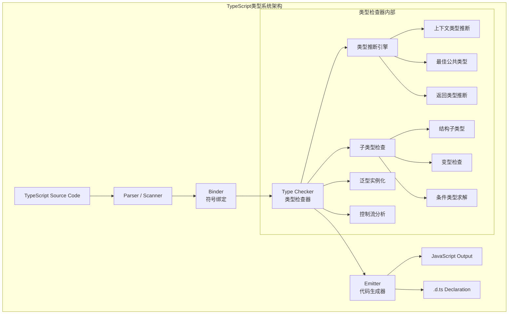

### TypeScript Compiler API 调用示例

```typescript
import * as ts from 'typescript';

// 创建程序实例，触发完整的 Parser → Binder → Checker 流程
const program = ts.createProgram(['src/main.ts'], {
  target: ts.ScriptTarget.ES2024,
  module: ts.ModuleKind.ESNext,
  strict: true,
});

// 获取类型检查器（对应 Checker 节点）
const checker = program.getTypeChecker();

// 遍历源文件的 AST（Parser 输出）
for (const sourceFile of program.getSourceFiles()) {
  if (!sourceFile.isDeclarationFile) {
    ts.forEachChild(sourceFile, (node) => {
      if (ts.isFunctionDeclaration(node) && node.name) {
        const symbol = checker.getSymbolAtLocation(node.name);
        console.log(`Function: ${symbol?.name}`);
      }
    });
  }
}
```

---

## 2. 执行上下文生命周期时序图

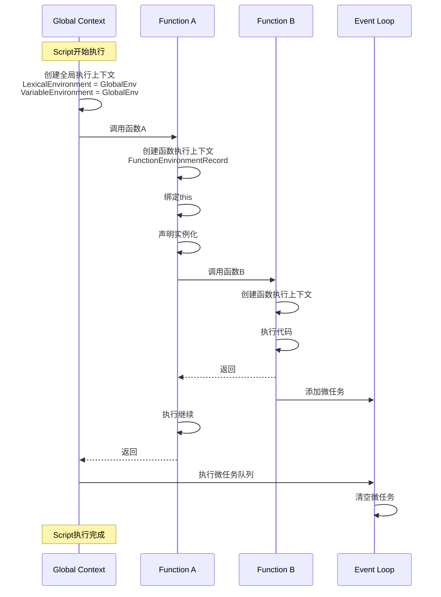

---

## 3. Promise 状态机

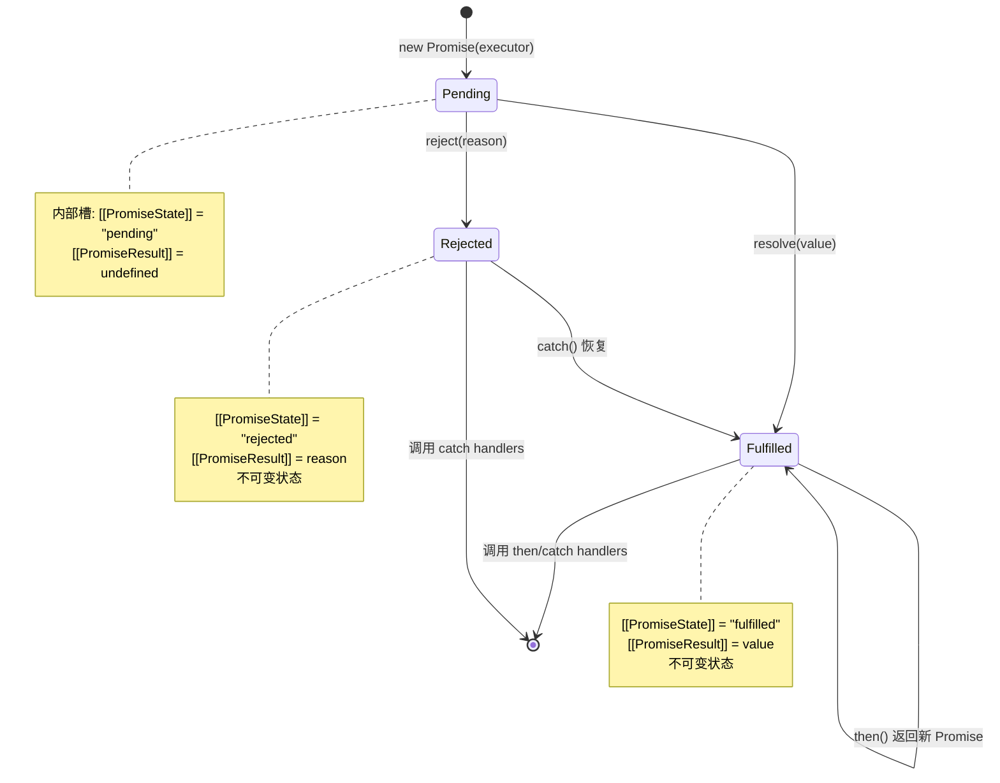

---

## 4. JavaScript 内存模型

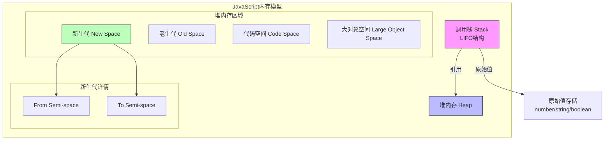

---

## 5. ECMAScript 规范算法结构

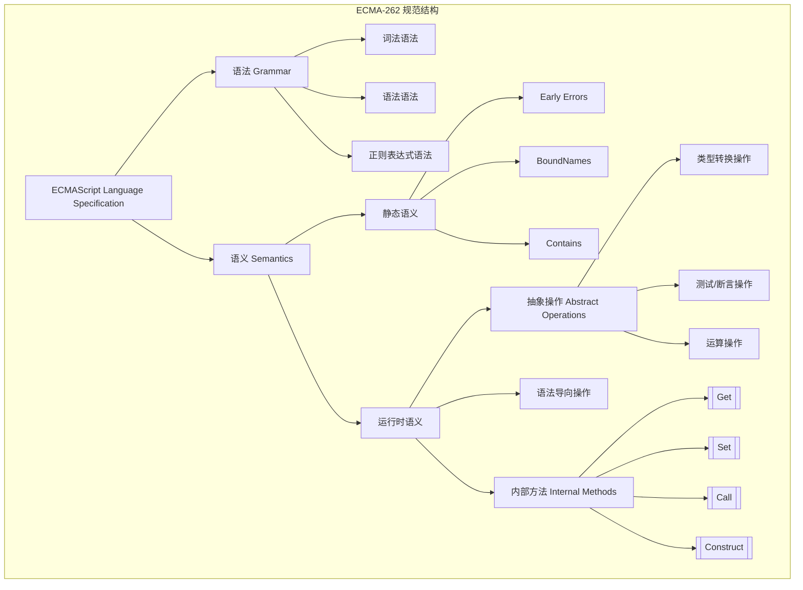

---

## 6. TypeScript 类型检查流程

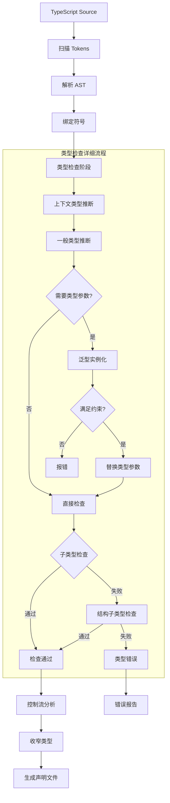

---

## 7. 模块加载语义流程

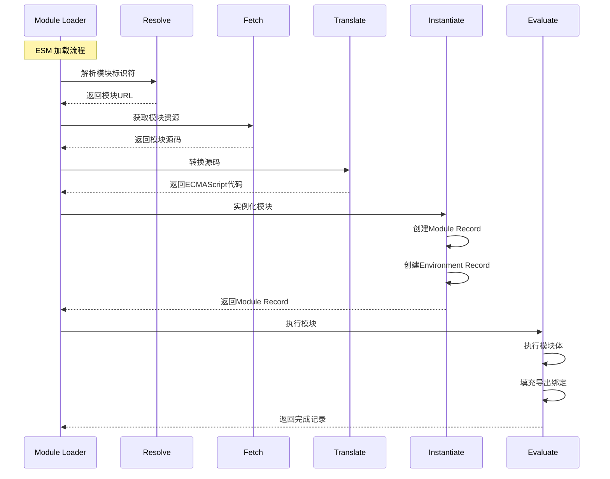

---

## 8. 事件循环详细模型

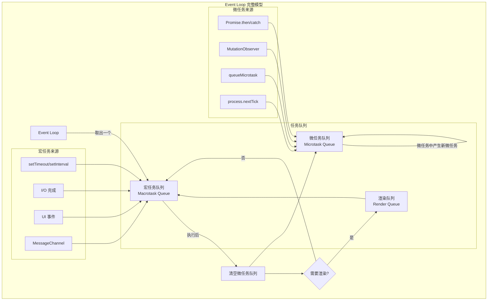

---

## 9. 对象内部方法调用链

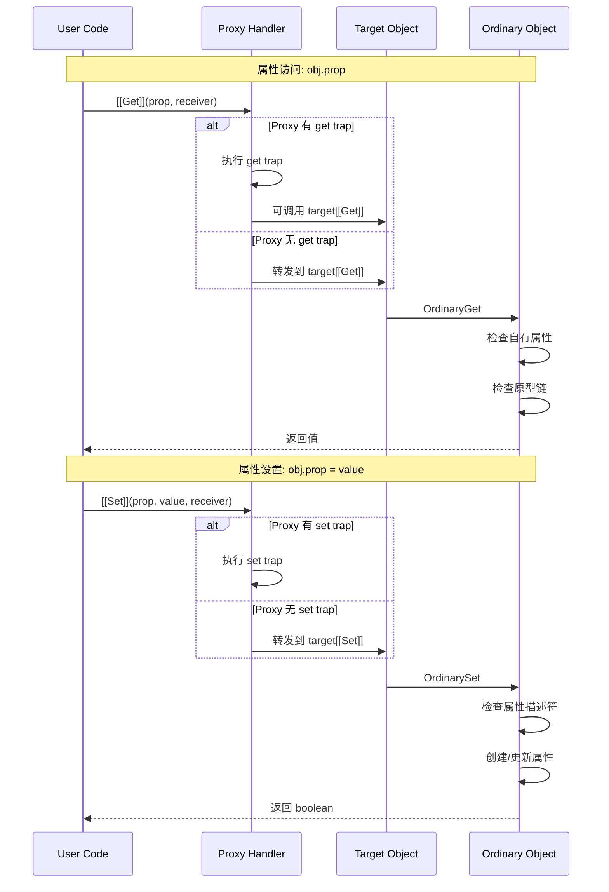

---

## 10. TypeScript 声明合并语义

```mermaid
graph TB
    subgraph "TypeScript 声明合并"
        D1[接口声明
        interface User {
          name: string
        }]

        D2[接口声明
        interface User {
          age: number
        }]

        D3[命名空间声明
        namespace User {
          export function create()
        }]

        D4[类声明
        class User {
          constructor() {}
        }]

        D5[函数声明
        function User() {}
        ]

        subgraph "合并结果"
            R1[合并后的 User 接口:
            {
              name: string
              age: number
            }]

            R2[User 命名空间
            包含静态方法 create]

            R3[User 构造函数
            包含实例方法和静态成员]
        end
    end

    D1 -->|合并| R1
    D2 -->|合并| R1
    D3 -->|附加| R2
    D4 -->|主体| R3
    D5 -->|主体| R3
    R2 -->|附加到| R3
```

---

## 11. JavaScript 作用域链可视化

```mermaid
graph BT
    subgraph "作用域链示例"
        Global[全局作用域
        globalThis
        ─────────────────
        let globalVar = 1
        function outer() {}]

        Outer[outer 作用域
        ─────────────────
        let outerVar = 2
        function inner() {}]

        Inner[inner 作用域
        ─────────────────
        let innerVar = 3
        console.log(...)]

        Inner -->|outer Environment| Outer
        Outer -->|global Environment| Global
    end

    subgraph "变量查找路径"
        V1[innerVar] -->|找到| Inner
        V2[outerVar] -->|未找到 inner| Inner
        V2 -->|找到 outer| Outer
        V3[globalVar] -->|未找到 inner| Inner
        V3 -->|未找到 outer| Outer
        V3 -->|找到 global| Global
    end
```

---

## 12. 异步迭代器协议

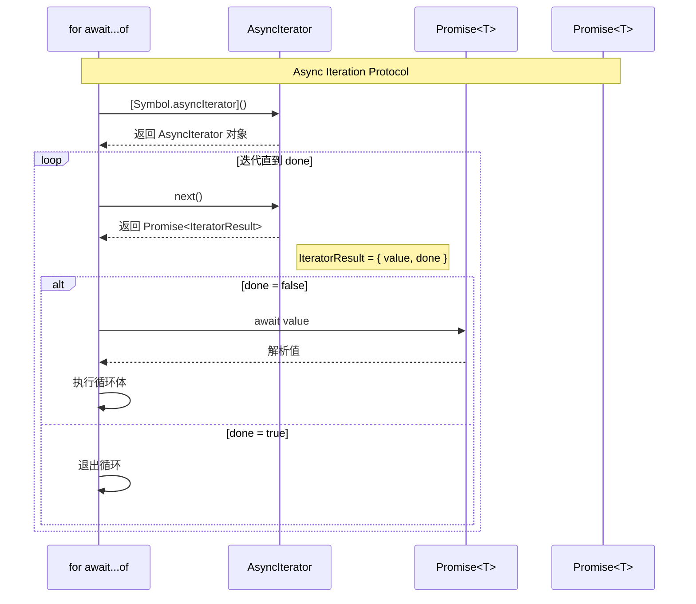

---

## 13. 装饰器元数据语义（TypeScript 5.2+）

```mermaid
flowchart TD
    D[装饰器应用] --> D1[类装饰器]
    D --> D2[方法装饰器]
    D --> D3[访问器装饰器]
    D --> D4[属性装饰器]
    D --> D5[参数装饰器]

    subgraph "元数据API"
        API1[Symbol.metadata]
        API2[context.metadata]
        API3[DecoratorMetadata]
    end

    D1 --> API1
    D2 --> API2
    D3 --> API2
    D4 --> API2
    D5 --> API2

    API2 --> Store[元数据存储
    WeakMap目标 -> 元数据对象]

    Store --> Access[运行时访问
    target[Symbol.metadata]]
```

---

## 14. 分布式追踪上下文传播

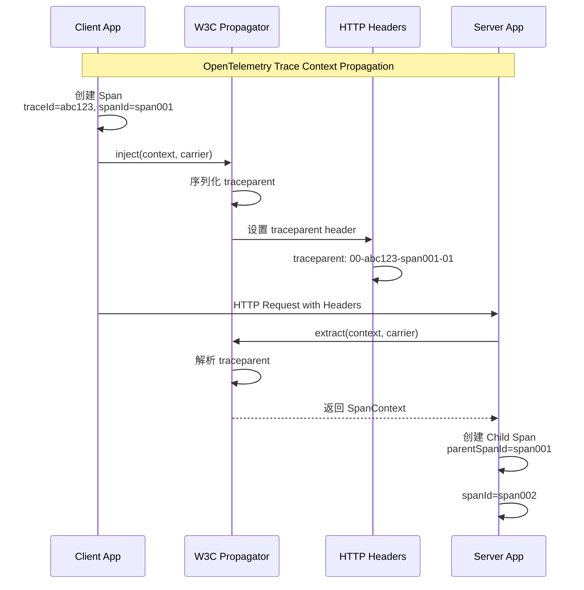

---

## 15. CI/CD 管道状态机

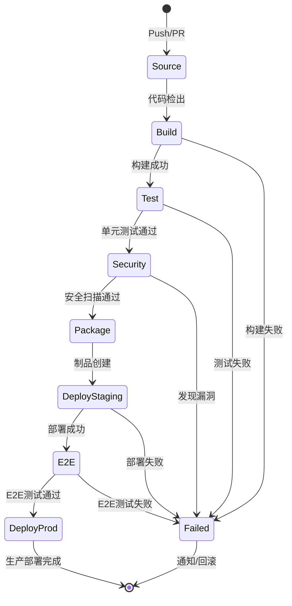

---

## 16. 代码示例：Promise 状态机实操

```javascript
// 演示 Promise 的 Pending → Fulfilled / Rejected 状态转换
const p = new Promise((resolve, reject) => {
  console.log('executor 同步执行'); // PromiseState = "pending"
  setTimeout(() => resolve(42), 100);
});

// then() 返回新的 Promise，形成链式状态机
const p2 = p.then((value) => {
  console.log('Fulfilled:', value); // 42
  return value * 2;
});

// catch() 可将 Rejected 恢复为 Fulfilled
const p3 = Promise.reject('error')
  .catch((reason) => {
    console.log('Recovered from:', reason);
    return 'fallback';
  })
  .then((v) => console.log('Final:', v)); // "fallback"

// Promise.race vs Promise.any 的语义差异
const slow = new Promise((_, reject) => setTimeout(reject, 50, 'slow'));
const fast = new Promise((resolve) => setTimeout(resolve, 100, 'fast'));

Promise.race([slow, fast]).catch((e) => console.log('race:', e)); // "slow"（首个 settle）
Promise.any([slow, fast]).then((v) => console.log('any:', v));     // "fast"（首个 fulfilled）
```

---

## 17. 代码示例：作用域链与闭包

```javascript
// 对应「作用域链可视化」的可运行代码
function outer() {
  let outerVar = 2;

  function inner() {
    let innerVar = 3;
    // 作用域链查找：inner → outer → global
    console.log(innerVar); // 3  (inner)
    console.log(outerVar); // 2  (outer)
    console.log(globalVar); // 1 (global)
  }

  return inner;
}

let globalVar = 1;
const fn = outer();
fn(); // 闭包保留 outer 的词法环境，即使 outer 已执行完毕

// 块级作用域（ES2015+）不会进入作用域链的环境记录
function demoLet() {
  let x = 10;
  if (true) {
    let x = 20; // 独立的块级环境记录
    console.log(x); // 20
  }
  console.log(x); // 10
}
```

---

## 18. 代码示例：事件循环微任务演示

```javascript
// 验证「事件循环详细模型」的行为
console.log('1. Script start');

setTimeout(() => console.log('2. Macrotask (timeout)'), 0);

Promise.resolve().then(() => {
  console.log('3. Microtask 1');
  Promise.resolve().then(() => console.log('4. Microtask 2 (nested)'));
});

queueMicrotask(() => console.log('5. Microtask 3 (queueMicrotask)'));

console.log('6. Script end');

// 输出顺序：
// 1. Script start
// 6. Script end
// 3. Microtask 1
// 5. Microtask 3 (queueMicrotask)
// 4. Microtask 2 (nested)
// 2. Macrotask (timeout)
```

---

## 权威参考链接

- [ECMA-262 §9.2 Execution Contexts](https://tc39.es/ecma262/#sec-execution-contexts) — 执行上下文规范定义
- [ECMA-262 §27.2 Promise Objects](https://tc39.es/ecma262/#sec-promise-objects) — Promise 状态机规范
- [ECMA-262 §6.1.7.2 Object Internal Methods](https://tc39.es/ecma262/#sec-object-internal-methods-and-internal-slots) — 内部方法规范
- [V8 Blog — Ignition + TurboFan](https://v8.dev/blog/ignition-interpreter) — V8 编译管线详解
- [V8 Blog — Memory Management](https://v8.dev/blog/trash-talk) — V8 垃圾回收与内存模型
- [TypeScript Compiler API](https://github.com/microsoft/TypeScript/wiki/Using-the-Compiler-API) — 类型检查器可编程接口
- [TypeScript Handbook — Declaration Merging](https://www.typescriptlang.org/docs/handbook/declaration-merging.html) — 声明合并语义
- [MDN — Event Loop](https://developer.mozilla.org/en-US/docs/Web/JavaScript/Event_loop) — 事件循环模型
- [MDN — Proxy](https://developer.mozilla.org/en-US/docs/Web/JavaScript/Reference/Global_Objects/Proxy) — Proxy 内部方法
- [W3C Trace Context](https://www.w3.org/TR/trace-context/) — 分布式追踪上下文规范
- [OpenTelemetry JS API](https://opentelemetry.io/docs/languages/js/) — 分布式追踪实现
- [HTML Standard — Event Loops](https://html.spec.whatwg.org/multipage/webappapis.html#event-loops) — 浏览器事件循环规范
- [Node.js — Event Loop, Timers, and process.nextTick()](https://nodejs.org/en/learn/asynchronous-work/event-loop-timers-and-nexttick) — Node.js 事件循环官方文档

---

这些可视化图表补充了主分析文档，提供了更详细的架构和流程视角。
