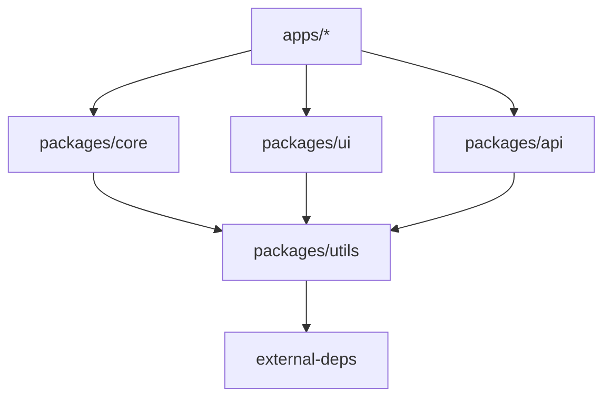
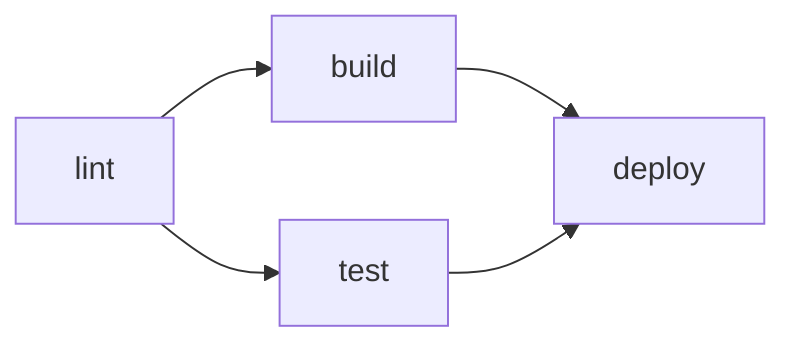

# Monorepo 架构设计与边界划分

> **目标读者**：技术负责人、架构师、负责代码库治理的工程师
> **关联文档**：[`jsts-code-lab/12-package-management/monorepo-workspaces.ts`](../../../20-code-lab/20.1-fundamentals-lab/package-management/monorepo-workspaces.ts)
> **版本**：2026-04
> **字数**：约 5,000 字

---

## 1. Monorepo vs Polyrepo：选型决策

### 1.1 核心差异

| 维度 | Monorepo | Polyrepo |
|------|---------|---------|
| **代码位置** | 单一仓库 | 多仓库 |
| **依赖管理** | 内部依赖直接引用 | 通过 npm registry / git submodule |
| **原子提交** | 跨模块变更一次提交 | 多仓库分别提交 |
| **CI/CD** | 统一编排 | 各仓库独立 |
| **权限控制** | 目录级 | 仓库级 |
| **规模上限** | 需工具支持（>100 模块有挑战） | 理论上无上限 |

### 1.2 何时选择 Monorepo

**选择 Monorepo 的信号**：

- ✅ 多个项目共享核心库（utils、types、UI 组件）
- ✅ 需要原子化的跨模块重构
- ✅ 团队规模 < 200 人（代码库 < 10GB）
- ✅ 重视一致的构建/测试/发布流程

**选择 Polyrepo 的信号**：

- ✅ 各项目技术栈完全不同（如 Python 后端 + JS 前端）
- ✅ 团队完全自治，不希望共享 CI/CD
- ✅ 开源项目，外部贡献者为主
- ✅ 代码库 > 50GB 或历史提交 > 100 万

---

## 2. Monorepo 架构模式

### 2.1 按业务域划分（Domain-Driven）

```
packages/
├── user-domain/          # 用户域
│   ├── user-api/         # 用户 API
│   ├── user-ui/          # 用户界面
│   └── user-shared/      # 共享类型/工具
├── order-domain/         # 订单域
│   ├── order-api/
│   ├── order-ui/
│   └── order-shared/
└── shared/               # 跨域共享
    ├── ui-kit/           # UI 组件库
    ├── utils/            # 通用工具
    └── types/            # 全局类型
```

**优点**：业务边界清晰，团队按域自治。
**缺点**：共享模块可能成为瓶颈。

### 2.2 按技术层划分（Layer-Driven）

```
packages/
├── apps/                 # 应用层
│   ├── web-app/
│   ├── mobile-app/
│   └── admin-panel/
├── libs/                 # 库层
│   ├── ui/               # UI 组件
│   ├── data-access/      # 数据访问
│   └── state/            # 状态管理
└── tools/                # 工具层
    ├── eslint-config/
    ├── ts-config/
    └── test-utils/
```

**优点**：技术一致性高，工具复用充分。
**缺点**：业务逻辑跨层分散。

### 2.3 混合模式（推荐）

```
repo/
├── apps/                 # 可部署的应用
│   ├── web/
│   ├── mobile/
│   └── docs/
├── packages/             # 内部库
│   ├── core/             # 核心业务逻辑
│   ├── ui/               # UI 组件库
│   ├── api/              # API 客户端
│   └── config/           # 共享配置
├── tools/                # 构建工具
└── infra/                # 基础设施（Terraform/Docker）
```

**核心规则**：

- `apps` 可以依赖 `packages`
- `packages` 之间可以依赖，但不能循环依赖
- `tools` 和 `infra` 不依赖业务代码

---

## 3. 边界划分原则

### 3.1 模块依赖方向规则



**禁止**：

- `packages/*` 依赖 `apps/*`
- 循环依赖（A → B → C → A）
- 跨域直接依赖（`user-api` 直接导入 `order-shared`）

### 3.2 版本策略

| 策略 | 描述 | 适用场景 |
|------|------|---------|
| **固定版本** | 所有模块统一版本号 | 小型 Monorepo (<20 模块) |
| **独立版本** | 各模块独立 Semver | 大型 Monorepo，模块对外发布 |
| **锁定版本** | 内部依赖用 `workspace:*` | 内部库不对外发布 |

**pnpm 10 的 catalog 协议**（2026 年最佳实践）：

```yaml
# pnpm-workspace.yaml
catalog:
  react: ^19.0.0
  typescript: ^5.8.0

catalogs:
  legacy:
    react: ^18.3.0
```

```json
// package.json
{
  "dependencies": {
    "react": "catalog:",
    "typescript": "catalog:"
  }
}
```

**优势**：

- 一处修改，全仓库同步
- 支持多 catalog（如 legacy / modern 两套依赖）
- 减少 merge conflict

---

## 4. 工具链选型矩阵

### 4.1 主流工具对比（2026）

| 工具 | 定位 | 构建速度 | 缓存 | 最佳场景 |
|------|------|---------|------|---------|
| **pnpm + Turborepo** | 包管理 + 任务编排 | 快 | 本地 + 远程 | 中小型 Monorepo (<100 包) |
| **Nx** | 全功能平台 | 快 | 本地 + 远程 + 分布式 | 大型 Monorepo，需 graph 分析 |
| **Moon** | Rust 编写 | 极快 | 本地 + 远程 | 性能敏感，Rust 生态 |
| **Bazel** | 企业级构建 | 中 | 极强 | 超大型（Google 级） |
| **Bun Workspaces** | 一体化 | 快 | 本地 | 简单 Monorepo，Bun 生态 |

### 4.2 选型决策树

```
模块数量?
├── < 20 → pnpm + Turborepo
├── 20-100 → Nx 或 Turborepo
└── > 100 → Nx 或 Bazel

是否需要远程缓存?
├── 是 → Nx Cloud / Turborepo Remote Cache
└── 否 → 本地缓存足够

是否跨语言（JS + Python + Go）?
├── 是 → Bazel 或 Nx
└── 否 → JS 生态工具
```

---

## 5. CI/CD 优化

### 5.1 Affected 检测

**原理**：通过 Git 历史分析，只构建和测试受变更影响的模块。

```bash
# Nx
nx affected:test --base=main

# Turborepo
turbo run test --filter=[main...HEAD]
```

**性能提升**：从"全仓库 30 分钟"到"只改一个包 → 2 分钟"。

### 5.2 分布式缓存

**本地缓存**：`node_modules/.cache/turbo`
**远程缓存**：Vercel Remote Cache / Nx Cloud / 自建 S3

**配置示例**（Turborepo）：

```json
{
  "$schema": "https://turbo.build/schema.json",
  "remoteCache": {
    "enabled": true,
    "signature": true
  },
  "pipeline": {
    "build": {
      "dependsOn": ["^build"],
      "outputs": ["dist/**", ".next/**"]
    },
    "test": {
      "dependsOn": ["build"],
      "inputs": ["src/**/*.ts", "tests/**/*.ts"]
    }
  }
}
```

### 5.3 并行任务编排



Turborepo 和 Nx 都能自动识别任务依赖图，最大化并行度。

---

## 6. 实际案例分析

### 6.1 小型团队（<10人）：电商 SaaS

```
repo/
├── apps/
│   ├── storefront/       # Next.js 电商前台
│   └── admin/            # React 管理后台
├── packages/
│   ├── ui/               # shadcn/ui + 自定义组件
│   ├── db/               # Drizzle ORM + schema
│   ├── auth/             # better-auth 配置
│   └── config/           # ESLint / TS / Tailwind 配置
```

**工具**：pnpm + Turborepo
**CI**：GitHub Actions，Affected 检测，Vercel 自动部署

### 6.2 中型团队（50人）：金融科技

```
repo/
├── apps/
│   ├── trading-platform/
│   ├── risk-dashboard/
│   └── mobile-app/
├── packages/
│   ├── core/
│   │   ├── types/        # 全局 TypeScript 类型
│   │   ├── utils/        # 通用工具
│   │   └── constants/    # 业务常量
│   ├── ui/
│   ├── api-clients/
│   └── security/         # 加密/认证
└── infra/
    ├── terraform/
    └── docker/
```

**工具**：Nx（依赖图分析 + 分布式缓存）
**CI**：GitLab CI，Nx Cloud 远程缓存

### 6.3 大型组织（500+人）：跨国电商

**挑战**：

- 模块数量 > 500
- 多语言（Java/Go/JS/Python）
- 合规要求（审计、权限隔离）

**方案**：

- **Bazel** 统一构建系统
- **按业务域拆分子 Monorepo**（非单一仓库）
- **内部 npm registry** 管理跨域依赖
- **自定义工具** 替代通用方案

---

## 7. 反模式与陷阱

### 反模式 1：过度耦合的模块

❌ `packages/utils` 变成万能垃圾堆，所有业务代码都依赖它。
✅ utils 按功能拆分：`packages/date-utils`、`packages/validation`、`packages/crypto`

### 反模式 2：循环依赖

❌ `packages/auth` → `packages/user` → `packages/auth`
✅ 提取共享层：`packages/auth-types`，auth 和 user 都依赖它。

### 反模式 3：巨型包

❌ `packages/core` 包含 10 万行代码，任何人改一行都要全量构建。
✅ 按子功能拆分：`core/domain`、`core/infrastructure`、`core/application`

### 反模式 4：忽视构建性能

❌ 每次提交都构建全仓库，CI 30 分钟。
✅ 启用 Affected 检测 + 远程缓存，只构建变更模块。

### 反模式 5：权限管理缺失

❌ 任何开发者都能修改任何包。
✅ CODEOWNERS + 分支保护 + Nx 的 `enforceModuleBoundaries`

---

## 8. 迁移路径：从 Polyrepo 到 Monorepo

### 8.1 渐进式迁移策略

```
Phase 1: 选择试点项目（2-3 个关联最紧密的仓库）
Phase 2: 合并到一个 Monorepo，保留独立发布
Phase 3: 统一构建工具链（Turborepo / Nx）
Phase 4: 启用 workspace 协议，内部依赖不走 registry
Phase 5: 统一 CI/CD，启用 affected 检测
Phase 6: 逐步合并更多项目
```

### 8.2 保留 Git 历史

```bash
# 将外部仓库合并到 Monorepo 子目录，保留完整历史
git subtree add --prefix=packages/legacy-app git@github.com:org/legacy-app.git main
```

---

## 9. 总结

Monorepo 不是银弹，但在正确的场景下是**工程效率的倍增器**。

**关键成功因素**：

1. **清晰的边界划分**：模块间依赖有明确规则
2. **强大的工具链**：构建缓存、Affected 检测、并行编排
3. **渐进式演进**：从小规模试点开始，逐步扩展
4. **治理机制**：CODEOWNERS、架构决策记录 (ADR)、定期审计

**2026 年推荐栈**：

- 小型：pnpm + Turborepo
- 中型：Nx
- 大型：Nx + Nx Cloud / Bazel

---

## 参考资源

- [Turborepo 文档](https://turbo.build/)
- [Nx 官方文档](https://nx.dev/)
- [Moon 文档](https://moonrepo.dev/)
- [pnpm Workspaces](https://pnpm.io/workspaces)
- [Monorepo Tools 对比](https://monorepo.tools/)
- [Google Monorepo 经验](https://research.google/pubs/pub45424/)
