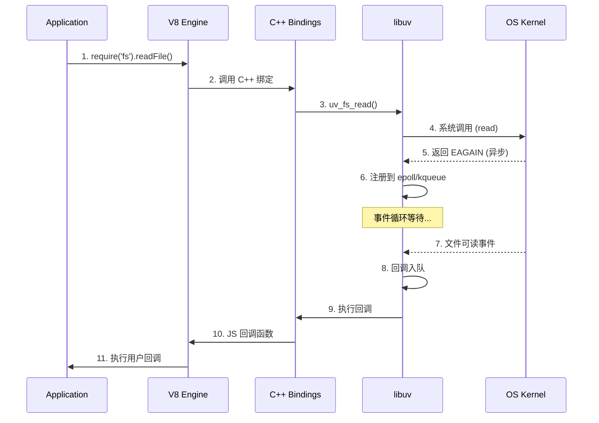

# Node.js 运行时理论深度解析

> 形式化定义、架构分析与性能优化

---

## 目录

- [Node.js 运行时理论深度解析](#nodejs-运行时理论深度解析)
  - [目录](#目录)
  - [1. Node.js 架构](#1-nodejs-架构)
    - [1.1 形式化定义](#11-形式化定义)
    - [1.2 架构图](#12-架构图)
    - [1.3 核心组件关系时序图](#13-核心组件关系时序图)
    - [1.4 代码示例](#14-代码示例)
    - [1.5 性能分析](#15-性能分析)
  - [2. libuv 事件循环](#2-libuv-事件循环)
    - [2.1 形式化定义](#21-形式化定义)
    - [2.2 事件循环架构图](#22-事件循环架构图)
    - [2.3 执行顺序代码示例](#23-执行顺序代码示例)
    - [2.4 性能分析](#24-性能分析)
  - [3. Stream 形式化](#3-stream-形式化)
    - [3.1 形式化定义](#31-形式化定义)
    - [3.2 Stream 架构图](#32-stream-架构图)
    - [3.3 代码示例](#33-代码示例)
    - [3.4 性能分析](#34-性能分析)
  - [4. Buffer 与 TypedArray](#4-buffer-与-typedarray)
    - [4.1 形式化定义](#41-形式化定义)
    - [4.2 内存模型架构图](#42-内存模型架构图)
    - [4.3 代码示例](#43-代码示例)
    - [4.4 性能分析](#44-性能分析)
  - [5. Cluster 负载均衡](#5-cluster-负载均衡)
    - [5.1 形式化定义](#51-形式化定义)
    - [5.2 Cluster 架构图](#52-cluster-架构图)
    - [5.3 代码示例](#53-代码示例)
  - [6. 进程间通信 IPC](#6-进程间通信-ipc)
    - [6.1 形式化定义](#61-形式化定义)
    - [6.2 代码示例](#62-代码示例)
  - [7. 模块系统实现](#7-模块系统实现)
    - [7.1 形式化定义](#71-形式化定义)
    - [7.2 CommonJS vs ESM 对比](#72-commonjs-vs-esm-对比)
    - [7.3 代码示例](#73-代码示例)
  - [8. 文件系统异步 I/O](#8-文件系统异步-io)
    - [8.1 形式化定义](#81-形式化定义)
    - [8.2 代码示例](#82-代码示例)
  - [9. 网络模块并发模型](#9-网络模块并发模型)
    - [9.1 形式化定义](#91-形式化定义)
    - [9.2 代码示例](#92-代码示例)
  - [10. Node.js 性能优化理论](#10-nodejs-性能优化理论)
    - [10.1 形式化定义](#101-形式化定义)
    - [10.2 性能优化架构图](#102-性能优化架构图)
    - [10.3 性能优化代码示例](#103-性能优化代码示例)
    - [10.4 性能优化检查清单](#104-性能优化检查清单)
  - [总结](#总结)

---

## 1. Node.js 架构

### 1.1 形式化定义

```
Node.js 架构 := ⟨V8, libuv, CoreModules, BindingLayer⟩

其中：
- V8 := JavaScript 引擎，负责代码解析、编译与执行
- libuv := 跨平台异步 I/O 库，提供事件循环和线程池
- CoreModules := {fs, net, http, path, crypto, ...}
- BindingLayer := C++ 绑定层，连接 JS 与原生代码
```

### 1.2 架构图

```
┌─────────────────────────────────────────────────────────────┐
│                     Application Layer                        │
│  ┌────────────┐  ┌────────────┐  ┌─────────────────────┐   │
│  │   npm包    │  │  业务代码   │  │     用户模块         │   │
│  └────────────┘  └────────────┘  └─────────────────────┘   │
└─────────────────────────────────────────────────────────────┘
                              │
┌─────────────────────────────────────────────────────────────┐
│                   JavaScript Core Library                    │
│  ┌────────┐ ┌────────┐ ┌────────┐ ┌────────┐ ┌───────────┐ │
│  │ Buffer │ │ Stream │ │ Events │ │  Path  │ │ Utilities │ │
│  └────────┘ └────────┘ └────────┘ └────────┘ └───────────┘ │
└─────────────────────────────────────────────────────────────┘
                              │
┌─────────────────────────────────────────────────────────────┐
│                     Node.js Bindings (C++)                   │
│  ┌────────────┐  ┌────────────┐  ┌──────────────────────┐  │
│  │  process   │  │   buffer   │  │      context         │  │
│  └────────────┘  └────────────┘  └──────────────────────┘  │
└─────────────────────────────────────────────────────────────┘
                              │
┌─────────────────────────────────────────────────────────────┐
│                        libuv Layer                           │
│  ┌────────────────────┐      ┌──────────────────────────┐  │
│  │   Event Loop       │      │      Thread Pool         │  │
│  │  ┌──────────────┐  │      │  ┌────────────────────┐  │  │
│  │  │   7 Phases   │  │      │  │  Worker Threads    │  │  │
│  │  └──────────────┘  │      │  │  (File I/O, DNS)   │  │  │
│  └────────────────────┘      │  └────────────────────┘  │  │
└─────────────────────────────────────────────────────────────┘
                              │
┌─────────────────────────────────────────────────────────────┐
│                    Operating System                          │
│  ┌────────┐ ┌────────┐ ┌────────┐ ┌────────┐ ┌─────────┐   │
│  │  epoll │ │ kqueue │ │ IOCP   │ │  File  │ │ Network │   │
│  │ (Linux)│ │(macOS) │ │(Windows│ │ System │ │  Stack  │   │
│  └────────┘ └────────┘ └────────┘ └────────┘ └─────────┘   │
└─────────────────────────────────────────────────────────────┘
```

### 1.3 核心组件关系时序图



### 1.4 代码示例

```javascript
// 架构交互示例：文件读取的完整调用链
const fs = require('fs');
const path = require('path');

// 1. JavaScript 层调用
console.time('file-read');
fs.readFile(__filename, { encoding: 'utf8' }, (err, data) => {
    // 11. 用户回调执行
    if (err) {
        console.error('读取失败:', err);
        return;
    }
    console.timeEnd('file-read');
    console.log('文件大小:', Buffer.byteLength(data), 'bytes');
});

// 架构层级演示
console.log('=== Node.js 架构层级 ===');
console.log('V8 版本:', process.versions.v8);
console.log('libuv 版本:', process.versions.uv);
console.log('平台:', process.platform);
console.log('架构:', process.arch);
```

### 1.5 性能分析

| 层级 | 延迟量级 | 主要开销 | 优化策略 |
|------|----------|----------|----------|
| JavaScript | < 1μs | V8 编译优化 | 避免反优化、使用 TurboFan |
| C++ Bindings | 1-10μs | 类型转换、API 边界 | 减少跨层调用、批量处理 |
| libuv | 10-100μs | 系统调用、上下文切换 | 使用线程池、批量 I/O |
| OS Kernel | 100μs-10ms | 磁盘/网络延迟 | 预读缓存、异步 I/O |

---

## 2. libuv 事件循环

### 2.1 形式化定义

```
EventLoop := ⟨Phases, Queue, LoopCondition⟩

Phases := ⟨timers, pending, idle, prepare, poll, check, close⟩

Queue := {Event → Callback}

LoopCondition := while (alive > 0) do
    for phase ∈ Phases do
        ExecuteCallbacks(phase)
    end
end

其中各阶段定义：
- timers: {setTimeout, setInterval} 的回调
- pending: 系统操作回调 (如 TCP 错误)
- idle/prepare: 内部使用
- poll: I/O 回调 (epoll_wait/kqueue/IOCP)
- check: setImmediate 回调
- close: 关闭句柄的回调 (socket.on('close'))
```

### 2.2 事件循环架构图

```
┌─────────────────────────────────────────────────────────────┐
│                     Event Loop 7 Phases                      │
│                                                              │
│   ┌──────────┐      ┌──────────┐      ┌──────────┐        │
│   │  timers  │ ───→ │ pending  │ ───→ │  idle    │        │
│   │          │      │ callbacks│      │          │        │
│   └──────────┘      └──────────┘      └──────────┘        │
│        ↑                                   │                 │
│        │                                   ↓                 │
│   ┌──────────┐      ┌──────────┐      ┌──────────┐        │
│   │  close   │ ←─── │  check   │ ←─── │ prepare  │        │
│   │callbacks │      │          │      │          │        │
│   └──────────┘      └──────────┘      └──────────┘        │
│        ↑                                                     │
│        └──────────────────────────────────┐                  │
│                                           │                  │
│                                    ┌──────────┐             │
│                                    │   poll   │ ←────────── │
│                                    │  I/O     │             │
│                                    └──────────┘             │
│                                                              │
└─────────────────────────────────────────────────────────────┘
                              │
                              ↓
┌─────────────────────────────────────────────────────────────┐
│                   Microtasks & NextTick                      │
│  ┌─────────────────────┐    ┌─────────────────────┐        │
│  │ process.nextTick()  │    │  Promise.then()     │        │
│  │   (优先级最高)       │    │   (微任务队列)       │        │
│  └─────────────────────┘    └─────────────────────┘        │
└─────────────────────────────────────────────────────────────┘
```

### 2.3 执行顺序代码示例

```javascript
const fs = require('fs');

console.log('1. 同步代码开始');

// setTimeout - timers 阶段
setTimeout(() => {
    console.log('2. setTimeout (timers 阶段)');
    process.nextTick(() => {
        console.log('3. nextTick in setTimeout');
    });
}, 0);

// setImmediate - check 阶段
setImmediate(() => {
    console.log('4. setImmediate (check 阶段)');
});

// Promise - 微任务
Promise.resolve().then(() => {
    console.log('5. Promise.then (微任务)');
});

// nextTick - 最高优先级
process.nextTick(() => {
    console.log('6. process.nextTick');
});

// I/O 操作 - poll 阶段
fs.readFile(__filename, () => {
    console.log('7. fs.readFile (poll 阶段)');

    setTimeout(() => {
        console.log('8. setTimeout in I/O');
    }, 0);

    setImmediate(() => {
        console.log('9. setImmediate in I/O');
    });
});

console.log('10. 同步代码结束');

// 预期输出顺序：
// 1. 同步代码开始
// 10. 同步代码结束
// 6. process.nextTick
// 5. Promise.then (微任务)
// 2. setTimeout (timers 阶段)
// 3. nextTick in setTimeout
// 4. setImmediate (check 阶段)
// 7. fs.readFile (poll 阶段)
// 9. setImmediate in I/O
// 8. setTimeout in I/O
```

### 2.4 性能分析

```javascript
const { performance } = require('perf_hooks');

// 事件循环延迟分析
class EventLoopMonitor {
    constructor() {
        this.measurements = [];
        this.isRunning = false;
    }

    measure() {
        const start = performance.now();

        setImmediate(() => {
            const latency = performance.now() - start;
            this.measurements.push(latency);

            if (this.isRunning) {
                this.measure();
            }
        });
    }

    start(duration = 5000) {
        this.isRunning = true;
        this.measure();

        setTimeout(() => {
            this.isRunning = false;
            this.report();
        }, duration);
    }

    report() {
        const sorted = [...this.measurements].sort((a, b) => a - b);
        const p50 = sorted[Math.floor(sorted.length * 0.5)];
        const p95 = sorted[Math.floor(sorted.length * 0.95)];
        const p99 = sorted[Math.floor(sorted.length * 0.99)];
        const avg = sorted.reduce((a, b) => a + b, 0) / sorted.length;

        console.log('=== 事件循环延迟分析 ===');
        console.log(`样本数: ${sorted.length}`);
        console.log(`平均延迟: ${avg.toFixed(3)} ms`);
        console.log(`P50: ${p50.toFixed(3)} ms`);
        console.log(`P95: ${p95.toFixed(3)} ms`);
        console.log(`P99: ${p99.toFixed(3)} ms`);
        console.log(`最大值: ${Math.max(...sorted).toFixed(3)} ms`);
    }
}
```

---

## 3. Stream 形式化

### 3.1 形式化定义

```
Stream := ⟨State, Buffer, Mode, EventHandler⟩

State := {flowing, paused, ended, destroyed}
Buffer := ⟨data[], highWaterMark, length⟩
Mode := {readable, writable, duplex, transform}

// 可读流
ReadableStream := ⟨Source, Buffer, Consumer⟩
    Source: () → data | null | EOF
    Consumer: data → void

// 可写流
WritableStream := ⟨Sink, Buffer, Producer⟩
    Sink: data → boolean
    Producer: () → data | null

// 转换流
TransformStream := ⟨Transform, BufferIn, BufferOut⟩
    Transform: chunk → (chunk' | null)

// 背压 (Backpressure) 机制
Backpressure := write(chunk) → boolean
    return buffer.length < highWaterMark
```

### 3.2 Stream 架构图

```
┌─────────────────────────────────────────────────────────────┐
│                      Readable Stream                         │
│                                                              │
│   ┌──────────┐      ┌──────────────────┐      ┌─────────┐ │
│   │  Source  │ ───→ │   Buffer         │ ───→ │Consumer │ │
│   │ (文件/   │      │  ┌────────────┐  │      │         │ │
│   │  网络)   │      │  │ highWater  │  │      │ (data)  │ │
│   └──────────┘      │  │ Mark: 16KB │  │      └─────────┘ │
│                     │  └────────────┘  │                   │
│                     │       ↑↓         │                   │
│                     │   flowing mode   │                   │
│                     └──────────────────┘                   │
└─────────────────────────────────────────────────────────────┘
                              │
                              ↓
┌─────────────────────────────────────────────────────────────┐
│                      Writable Stream                         │
│                                                              │
│   ┌──────────┐      ┌──────────────────┐      ┌─────────┐ │
│   │ Producer │ ───→ │   Buffer         │ ───→ │  Sink   │ │
│   │ (data)   │      │  ┌────────────┐  │      │(文件/   │ │
│   └──────────┘      │  │ highWater  │  │      │ 网络)   │ │
│                     │  │ Mark: 16KB │  │      └─────────┘ │
│                     │  └────────────┘  │                   │
│                     │    needDrain     │                   │
│                     └──────────────────┘                   │
└─────────────────────────────────────────────────────────────┘
                              │
                              ↓
┌─────────────────────────────────────────────────────────────┐
│                    Transform Stream                          │
│                                                              │
│   Input ──→ ┌─────────────────────────────┐ ──→ Output    │
│             │      Transform Function     │               │
│             │  ┌─────────────────────┐    │               │
│             │  │  chunk → transform  │    │               │
│             │  │  → push(chunk')     │    │               │
│             │  └─────────────────────┘    │               │
│             └─────────────────────────────┘               │
└─────────────────────────────────────────────────────────────┘
```

### 3.3 代码示例

```javascript
const fs = require('fs');
const { Transform, pipeline } = require('stream');
const zlib = require('zlib');

// 1. 可读流 - 消费者模式
const readable = fs.createReadStream(__filename, {
    highWaterMark: 1024,
    encoding: 'utf8'
});

// 暂停模式 (Paused Mode)
readable.on('readable', () => {
    let chunk;
    while (null !== (chunk = readable.read(512))) {
        console.log('读取块:', chunk.length, 'bytes');
    }
});

// 2. 可写流 - 生产者模式
const writable = fs.createWriteStream('/tmp/output.txt', {
    highWaterMark: 16384
});

function writeData() {
    let i = 0;
    function write() {
        let ok = true;
        while (i < 1000000 && ok) {
            ok = writable.write(`Line ${i}\n`);
            i++;
        }
        if (i < 1000000) {
            writable.once('drain', write);
        } else {
            writable.end();
        }
    }
    write();
}

// 3. 转换流
const upperCaseTransform = new Transform({
    transform(chunk, encoding, callback) {
        this.push(chunk.toString().toUpperCase());
        callback();
    }
});

// 4. 管道
function demonstratePipeline() {
    pipeline(
        fs.createReadStream('/tmp/large-file.txt'),
        zlib.createGzip(),
        fs.createWriteStream('/tmp/output.txt.gz'),
        (err) => {
            if (err) console.error('管道错误:', err);
            else console.log('Pipeline 完成');
        }
    );
}
```

### 3.4 性能分析

| 操作 | 内存占用 | 吞吐量 | 适用场景 |
|------|----------|--------|----------|
| fs.readFile | 高 (整个文件) | 低 | 小文件 (< 100MB) |
| Stream | 低 (highWaterMark) | 高 | 大文件、实时数据 |
| pipeline | 低 | 高 | 复杂数据处理链 |

---

## 4. Buffer 与 TypedArray

### 4.1 形式化定义

```
Buffer := ⟨Memory, Offset, Length, Encoding⟩
    Memory: ArrayBuffer | SharedArrayBuffer
    Offset: ℕ (字节偏移)
    Length: ℕ (字节长度)
    Encoding: 'utf8' | 'utf16le' | 'latin1' | 'base64' | 'hex' | ...

TypedArray := ⟨BufferView, ElementType, ByteOffset, Length⟩
    ElementType ∈ {Int8, Uint8, Int16, Uint16, Int32, Uint32, Float32, Float64}

内存模型：
ArrayBuffer ──→ 原始内存块 (连续字节)
    │
    ├──→ Uint8Array ──→ 8位无符号整数视图
    ├──→ Uint16Array ──→ 16位无符号整数视图
    └──→ Buffer ──→ Node.js 专用字节缓冲区
```

### 4.2 内存模型架构图

```
┌─────────────────────────────────────────────────────────────┐
│                    ArrayBuffer (8 bytes)                     │
│  ┌────┬────┬────┬────┬────┬────┬────┬────┐                │
│  │ 0x41│ 0x42│ 0x43│ 0x44│ 0x45│ 0x46│ 0x47│ 0x48│          │
│  │'A' │'B' │'C' │'D' │'E' │'F' │'G' │'H' │                │
│  └────┴────┴────┴────┴────┴────┴────┴────┘                │
└─────────────────────────────────────────────────────────────┘
            │         │         │         │
            ↓         ↓         ↓         ↓
┌───────────────┐ ┌───────────────┐ ┌───────────────┐ ┌───────────┐
│   Uint8Array  │ │  Uint16Array  │ │  Uint32Array  │ │  Buffer   │
│   [8 elements]│ │  [4 elements] │ │  [2 elements] │ │ [8 bytes] │
│   [65,66,67...│ │  [16961, ...  │ │  [1145258561] │ │ <Buffer   │
│               │ │  17475, ...]  │ │  [1162233672] │ │ 41 42...> │
└───────────────┘ └───────────────┘ └───────────────┘ └───────────┘
```

### 4.3 代码示例

```javascript
// 创建 Buffer 的不同方法
const buf1 = Buffer.alloc(10);              // 零填充，安全
const buf2 = Buffer.allocUnsafe(10);        // 未初始化，更快
const buf3 = Buffer.from('Hello World');    // 从字符串

// 编码转换
const str = '你好，世界！';
const utf8Buf = Buffer.from(str, 'utf8');
console.log('Base64:', utf8Buf.toString('base64'));
console.log('Hex:', utf8Buf.toString('hex'));

// 共享底层内存
const buffer = new ArrayBuffer(16);
const int32View = new Int32Array(buffer);
const nodeBuffer = Buffer.from(buffer);
int32View[0] = 42;

// Buffer 切片 - 共享内存
const original = Buffer.from('Hello World');
const sliced = original.slice(0, 5);
sliced[0] = 0x68; // 修改会影响原 Buffer

// 二进制数据操作
const dataBuf = Buffer.allocUnsafe(16);
dataBuf.writeUInt8(255, 0);
dataBuf.writeUInt32BE(4294967295, 1);
console.log('UInt32BE:', dataBuf.readUInt32BE(1));
```

### 4.4 性能分析

| 操作 | 时间复杂度 | 内存分配 | 说明 |
|------|------------|----------|------|
| Buffer.alloc | O(n) | 新内存 | 零填充，安全 |
| Buffer.allocUnsafe | O(1) | Pool/新内存 | 快速，可能含旧数据 |
| Buffer.from | O(1) | 共享/复制 | 取决于输入 |
| buf.slice | O(1) | 无 | 共享内存 |

---

## 5. Cluster 负载均衡

### 5.1 形式化定义

```
Cluster := ⟨Master, Workers, Scheduler, IPC⟩

Master := ⟨Server, WorkerPool, SignalHandler⟩
    WorkerPool: PID → WorkerProcess

Worker := ⟨Process, State, Load⟩
    State ∈ {online, listening, dead}
    Load := ⟨connections, cpu, memory⟩

Scheduler := ⟨Strategy, Distribution⟩
    Strategy ∈ {round-robin, shared-socket}

round-robin(workers, request) := workers[request.id mod |workers|]
```

### 5.2 Cluster 架构图

```
┌─────────────────────────────────────────────────────────────┐
│                      Master Process                          │
│  ┌──────────────────────────────────────────────────────┐  │
│  │                  Cluster Scheduler                     │  │
│  │   Strategy: round-robin (默认) / shared-socket        │  │
│  └──────────────────────────────────────────────────────┘  │
│                           │                                  │
│  ┌────────────────────────┼──────────────────────────┐     │
│  │    Worker Management   │   Signal Handling        │     │
│  └────────────────────────┼──────────────────────────┘     │
└───────────────────────────┼─────────────────────────────────┘
                            │ IPC Channel
        ┌───────────────────┼───────────────────┐
        │                   │                   │
┌───────▼──────┐   ┌────────▼────────┐   ┌──────▼───────┐
│  Worker 1    │   │   Worker 2      │   │  Worker N    │
│ ┌──────────┐ │   │  ┌──────────┐   │   │ ┌──────────┐ │
│ │ Express  │ │   │  │ Express  │   │   │ │ Express  │ │
│ │  Server  │ │   │  │  Server  │   │   │ │  Server  │ │
│ └────┬─────┘ │   │  └────┬─────┘   │   │ └────┬─────┘ │
└──────┼───────┘   └───────┼─────────┘   └──────┼───────┘
       └───────────────────┼───────────────────┘
                           │
                    ┌──────▼──────┐
                    │   Client    │
                    └─────────────┘
```

### 5.3 代码示例

```javascript
const cluster = require('cluster');
const http = require('http');
const os = require('os');

const numCPUs = os.cpus().length;

if (cluster.isMaster) {
    console.log(`Master ${process.pid} 正在运行`);

    // Fork workers
    for (let i = 0; i < numCPUs; i++) {
        cluster.fork();
    }

    cluster.on('exit', (worker, code, signal) => {
        console.log(`Worker ${worker.process.pid} 退出`);
        if (code !== 0 && !worker.exitedAfterDisconnect) {
            cluster.fork(); // 自动重启
        }
    });

    // 优雅重启
    process.on('SIGUSR2', () => {
        const workers = Object.values(cluster.workers);
        let index = 0;

        function restartNext() {
            if (index >= workers.length) return;
            const worker = workers[index++];
            const newWorker = cluster.fork();

            newWorker.on('listening', () => {
                worker.disconnect();
                setTimeout(() => {
                    if (!worker.isDead()) worker.kill('SIGTERM');
                }, 5000);
            });
        }
        restartNext();
    });

} else {
    http.createServer((req, res) => {
        res.writeHead(200);
        res.end(`Worker ${process.pid}: Hello World\n`);
    }).listen(8000);
}
```

---

## 6. 进程间通信 IPC

### 6.1 形式化定义

```
IPC := ⟨Channel, Message, Protocol, Serialization⟩

Channel := ⟨fd, type, state⟩
    type ∈ {pipe, socket}

Message := ⟨header, payload⟩
    header := ⟨type, length, timestamp⟩

Serialization := JSON | V8 Serializer
```

### 6.2 代码示例

```javascript
const { fork } = require('child_process');

// 基础 IPC 通信
if (process.argv[2] === 'child') {
    process.on('message', (msg) => {
        console.log(`[Child] 收到:`, msg);
        process.send({ result: msg.data * 2 });
    });
} else {
    const child = fork(__filename, ['child']);

    child.on('message', (msg) => {
        console.log(`[Parent] 结果:`, msg.result);
    });

    child.send({ data: 10 });
}

// 高级 IPC 客户端
class IPCClient {
    constructor(child) {
        this.child = child;
        this.requestId = 0;
        this.pending = new Map();

        this.child.on('message', ({ id, result, error }) => {
            const pending = this.pending.get(id);
            if (pending) {
                this.pending.delete(id);
                if (error) pending.reject(new Error(error));
                else pending.resolve(result);
            }
        });
    }

    send(method, params, timeoutMs = 5000) {
        return new Promise((resolve, reject) => {
            const id = ++this.requestId;
            const timeout = setTimeout(() => {
                this.pending.delete(id);
                reject(new Error('IPC 请求超时'));
            }, timeoutMs);

            this.pending.set(id, { resolve, reject, timeout });
            this.child.send({ id, method, params });
        });
    }
}
```

---

## 7. 模块系统实现

### 7.1 形式化定义

```
ModuleSystem := ⟨Loader, Resolver, Cache, Scope⟩

Loader := ⟨load, compile, execute⟩
    load(id) → source
    compile(source) → function
    execute(fn, exports, require, module, __filename, __dirname)

Resolver := ⟨resolve, extensions, paths⟩
    resolve(id, from) → absolutePath
    extensions := {'.js', '.json', '.node'}

Cache := ⟨Module → Exports⟩

Scope := ⟨exports, require, module, __filename, __dirname⟩
```

### 7.2 CommonJS vs ESM 对比

| 特性 | CommonJS | ESM |
|------|----------|-----|
| 语法 | require/module.exports | import/export |
| 加载方式 | 运行时同步加载 | 解析时静态分析 |
| 执行时机 | 运行时 | 解析阶段 |
| 循环依赖 | 部分导出 | TDZ |
| 动态导入 | 原生支持 | import() 函数 |
| 顶层 await | 不支持 | 支持 |
| 加载性能 | 较慢 | 更快 |

### 7.3 代码示例

```javascript
// 模拟 Module 实现
const fs = require('fs');
const path = require('path');
const vm = require('vm');

class SimpleModule {
    constructor(id) {
        this.id = id;
        this.exports = {};
        this.loaded = false;
    }

    static _cache = {};

    _compile(content, filename) {
        const wrapped = `(function(exports, require, module, __filename, __dirname) {
${content}
});`;

        const dirname = path.dirname(filename);
        const require = (id) => this.require(id);

        const fn = vm.runInThisContext(wrapped, { filename });
        fn.call(this.exports, this.exports, require, this, filename, dirname);

        this.loaded = true;
    }

    require(id) {
        const resolvedPath = this._resolveFilename(id);

        if (SimpleModule._cache[resolvedPath]) {
            return SimpleModule._cache[resolvedPath].exports;
        }

        const module = new SimpleModule(resolvedPath);
        SimpleModule._cache[resolvedPath] = module;

        const content = fs.readFileSync(resolvedPath, 'utf8');
        module._compile(content, resolvedPath);

        return module.exports;
    }

    _resolveFilename(id) {
        if (id.startsWith('./') || id.startsWith('../')) {
            const resolved = path.resolve(path.dirname(this.id), id);
            for (const ext of ['.js', '.json', '.node']) {
                if (fs.existsSync(resolved + ext)) {
                    return resolved + ext;
                }
            }
        }
        throw new Error(`无法找到模块: ${id}`);
    }
}
```

---

## 8. 文件系统异步 I/O

### 8.1 形式化定义

```
FileSystem := ⟨Operations, Callbacks, ThreadPool⟩

Operations := {open, read, write, close, stat, unlink, ...}

AsyncOperation := ⟨fd, offset, length, position, buffer, callback⟩

ThreadPool := ⟨Workers, Queue⟩
    Workers: WorkerThread[] (默认 4 个)
```

### 8.2 代码示例

```javascript
const fs = require('fs').promises;
const { pipeline } = require('stream/promises');
const zlib = require('zlib');

// 文件描述符操作
async function fileDescriptorOperations() {
    const fd = await fs.open('/tmp/test.txt', 'w+');

    const writeBuffer = Buffer.from('Hello, Node.js!');
    await fd.write(writeBuffer, 0, writeBuffer.length, 0);

    const readBuffer = Buffer.alloc(100);
    const { bytesRead } = await fd.read(readBuffer, 0, 100, 0);

    await fd.close();
}

// 批量操作
async function batchFileOperations() {
    // 并行写入 (快)
    const writes = [];
    for (let i = 0; i < 100; i++) {
        writes.push(fs.writeFile(`/tmp/file-${i}.txt`, `Content ${i}`));
    }
    await Promise.all(writes);

    // 流式处理
    await pipeline(
        fs.createReadStream('/tmp/large-file.txt'),
        zlib.createGzip(),
        fs.createWriteStream('/tmp/output.txt.gz')
    );
}
```

---

## 9. 网络模块并发模型

### 9.1 形式化定义

```
Network := ⟨Socket, Protocol, EventLoop, Backlog⟩

Socket := ⟨fd, localAddr, remoteAddr, state⟩
    state ∈ {CONNECTING, CONNECTED, CLOSING, CLOSED}

TCPServer := ⟨bind, listen, accept, backlog⟩
    backlog: 等待连接队列长度 (默认 511)

ConnectionPool := ⟨connections, maxConnections, timeout⟩
```

### 9.2 代码示例

```javascript
const net = require('net');
const http = require('http');

// TCP 服务器
function createTCPServer() {
    const server = net.createServer((socket) => {
        socket.setNoDelay(true);
        socket.setKeepAlive(true, 30000);

        socket.on('data', (data) => {
            socket.write(`Echo: ${data}`);
        });

        console.log(`连接来自: ${socket.remoteAddress}`);
    });

    server.listen(9000);
}

// HTTP 服务器
function createHTTPServer() {
    const server = http.createServer({
        keepAliveTimeout: 5000,
        maxHeadersCount: 2000,
        requestTimeout: 30000
    }, (req, res) => {
        res.setHeader('X-Request-ID', generateId());
        res.writeHead(200);
        res.end('Hello World');
    });

    server.listen(8080);
}

// HTTP Agent 连接池
const httpAgent = new http.Agent({
    keepAlive: true,
    maxSockets: 50,
    maxFreeSockets: 10,
    timeout: 60000
});
```

---

## 10. Node.js 性能优化理论

### 10.1 形式化定义

```
Performance := ⟨Throughput, Latency, ResourceUtilization, Scalability⟩

Optimization := ⟨Identify, Analyze, Implement, Measure⟩

Bottleneck := CPU | Memory | I/O | Network

Strategy :=
    CPU: {code optimization, clustering, worker threads}
    Memory: {object pooling, stream processing, v8 flags}
    I/O: {async patterns, connection pooling, caching}
    Network: {compression, keep-alive, load balancing}
```

### 10.2 性能优化架构图

```
┌─────────────────────────────────────────────────────────────┐
│                  Node.js 性能优化全景图                       │
│                                                              │
│  ┌────────────────────────────────────────────────────────┐ │
│  │                    应用层优化                            │ │
│  │  代码优化  │  算法优化  │  数据结构优化 (对象池)        │ │
│  └────────────────────────────────────────────────────────┘ │
│                              │                               │
│  ┌───────────────────────────▼────────────────────────────┐ │
│  │                   运行时优化                            │ │
│  │  V8 优化(TurboFan)  │  事件循环  │  内存管理(GC 调优)   │ │
│  └────────────────────────────────────────────────────────┘ │
│                              │                               │
│  ┌───────────────────────────▼────────────────────────────┐ │
│  │                   系统层优化                            │ │
│  │  Cluster(多进程)  │  Worker Threads  │  网络优化        │ │
│  └────────────────────────────────────────────────────────┘ │
└─────────────────────────────────────────────────────────────┘
```

### 10.3 性能优化代码示例

```javascript
const { Worker, isMainThread, parentPort } = require('worker_threads');
const os = require('os');

// 1. 对象池模式
class ObjectPool {
    constructor(factory, reset, size = 100) {
        this.factory = factory;
        this.reset = reset;
        this.pool = [];
        this.maxSize = size;

        for (let i = 0; i < size / 2; i++) {
            this.pool.push(this.factory());
        }
    }

    acquire() {
        return this.pool.length > 0 ? this.pool.pop() : this.factory();
    }

    release(obj) {
        if (this.pool.length < this.maxSize) {
            this.reset(obj);
            this.pool.push(obj);
        }
    }
}

// 2. Worker Thread 池
class WorkerPool {
    constructor(script, poolSize = os.cpus().length) {
        this.workers = [];
        this.queue = [];
        this.tasks = new Map();
        let taskId = 0;

        for (let i = 0; i < poolSize; i++) {
            const worker = new Worker(script);
            worker.on('message', ({ id, result, error }) => {
                const task = this.tasks.get(id);
                if (task) {
                    this.tasks.delete(id);
                    error ? task.reject(new Error(error)) : task.resolve(result);
                }
            });
            this.workers.push(worker);
        }

        this.execute = (data) => {
            return new Promise((resolve, reject) => {
                const id = ++taskId;
                this.tasks.set(id, { resolve, reject });
                const worker = this.workers[id % poolSize];
                worker.postMessage({ id, data });
            });
        };
    }

    terminate() {
        return Promise.all(this.workers.map(w => w.terminate()));
    }
}

// 3. LRU 缓存
class LRUCache {
    constructor(capacity) {
        this.capacity = capacity;
        this.cache = new Map();
    }

    get(key) {
        if (!this.cache.has(key)) return undefined;
        const value = this.cache.get(key);
        this.cache.delete(key);
        this.cache.set(key, value);
        return value;
    }

    set(key, value) {
        if (this.cache.has(key)) {
            this.cache.delete(key);
        } else if (this.cache.size >= this.capacity) {
            this.cache.delete(this.cache.keys().next().value);
        }
        this.cache.set(key, value);
    }
}

// 4. 性能监控
class PerformanceMonitor {
    constructor() {
        this.metrics = { requests: 0, latency: [] };

        setInterval(() => {
            const mem = process.memoryUsage();
            console.log(`内存: RSS=${(mem.rss/1024/1024).toFixed(1)}MB, ` +
                       `Heap=${(mem.heapUsed/1024/1024).toFixed(1)}MB`);
        }, 30000);
    }

    recordRequest(latency) {
        this.metrics.requests++;
        this.metrics.latency.push(latency);
    }
}
```

### 10.4 性能优化检查清单

| 优化领域 | 优化策略 | 预期效果 |
|----------|----------|----------|
| **CPU** | 使用 Worker Threads 处理计算 | 利用多核 CPU |
| **内存** | 使用对象池、Stream 处理大文件 | 减少 GC 压力 |
| **I/O** | 使用异步 API、连接池 | 提高吞吐量 |
| **网络** | 启用 Keep-Alive、压缩 | 减少延迟 |
| **缓存** | 使用 LRU 缓存计算结果 | 减少重复计算 |

---

## 总结

本文档深入分析了 Node.js 运行时的核心机制：

1. **架构层面**: V8 + libuv + CoreModules 的分层架构
2. **事件循环**: 7 个阶段的精确执行顺序
3. **Stream**: 背压机制与数据流处理
4. **Buffer**: 内存模型与性能优化
5. **Cluster**: 多进程负载均衡策略
6. **IPC**: 进程间高效通信机制
7. **模块系统**: CommonJS vs ESM 的实现差异
8. **文件系统**: 异步 I/O 与线程池
9. **网络模块**: 并发连接管理与连接池
10. **性能优化**: 全栈性能优化理论与实践

理解这些底层原理对于构建高性能、可扩展的 Node.js 应用至关重要。

---

*文档版本: 1.0*
*最后更新: 2026-04-08*
ENDOFFILE
