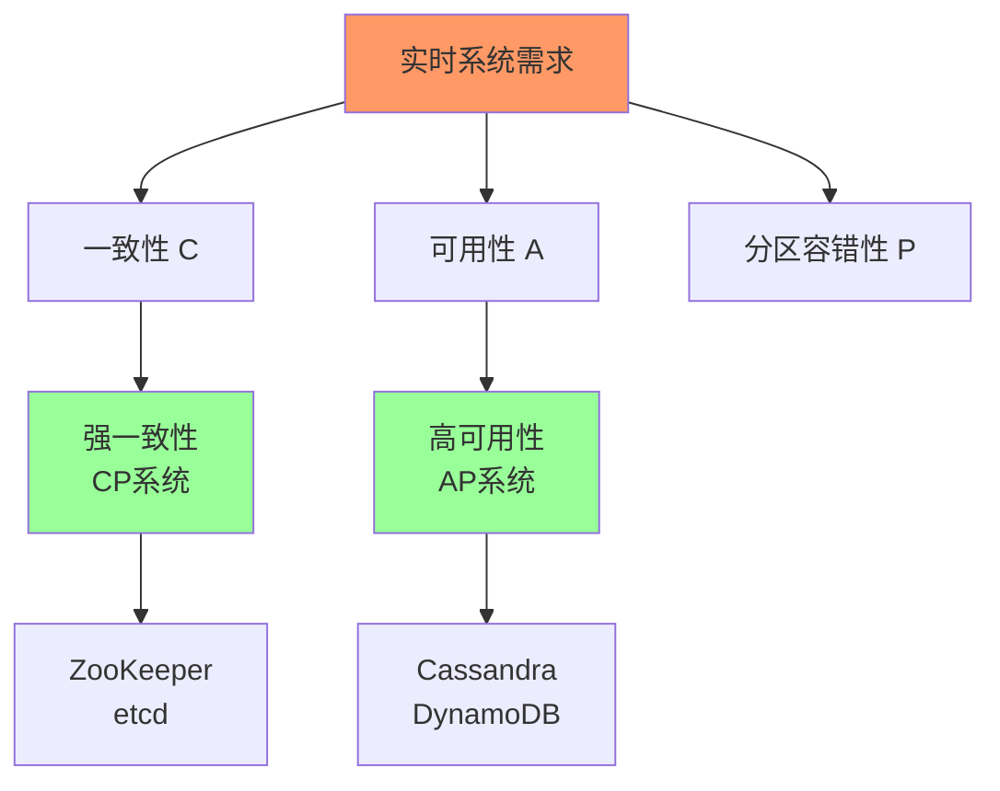
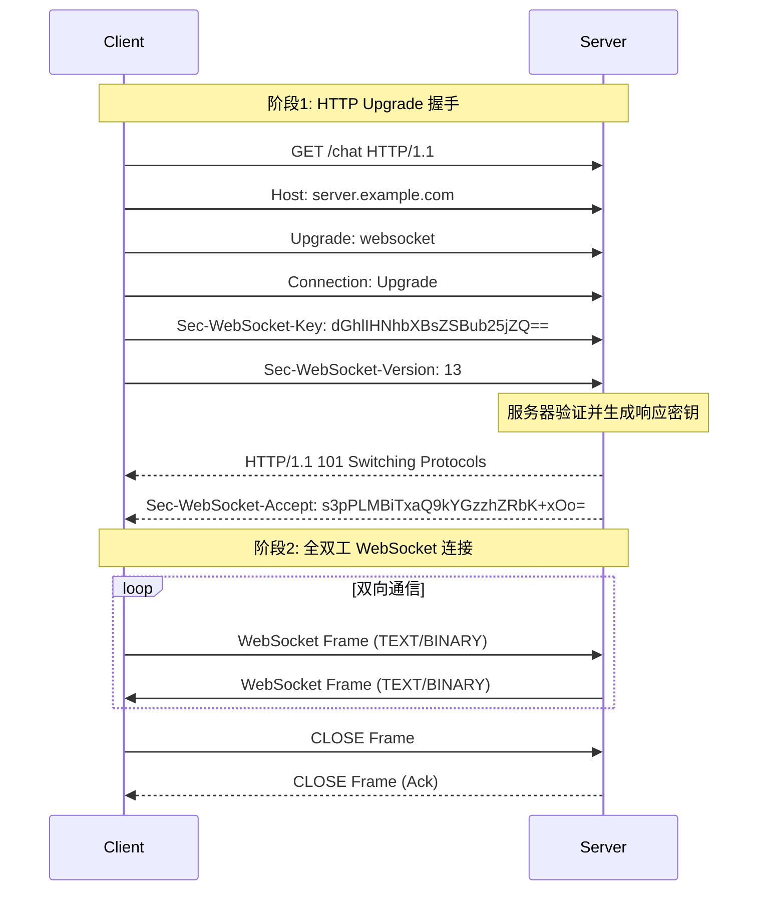
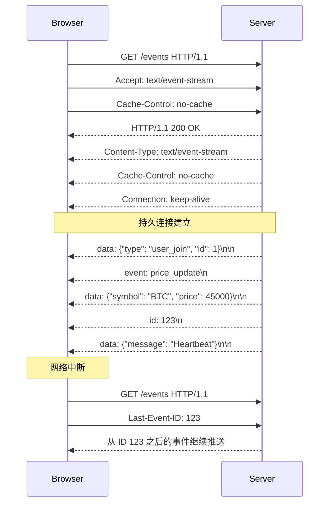
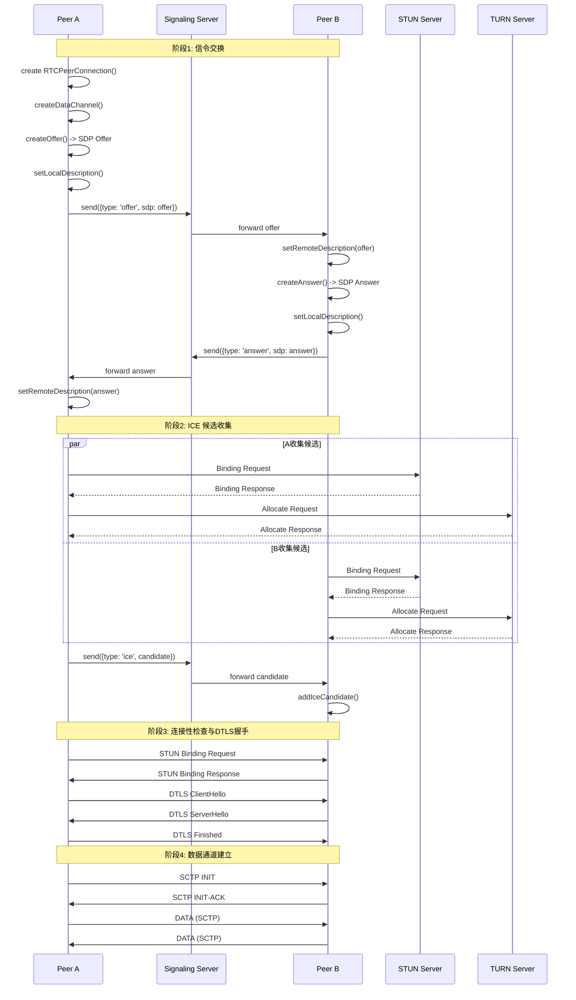
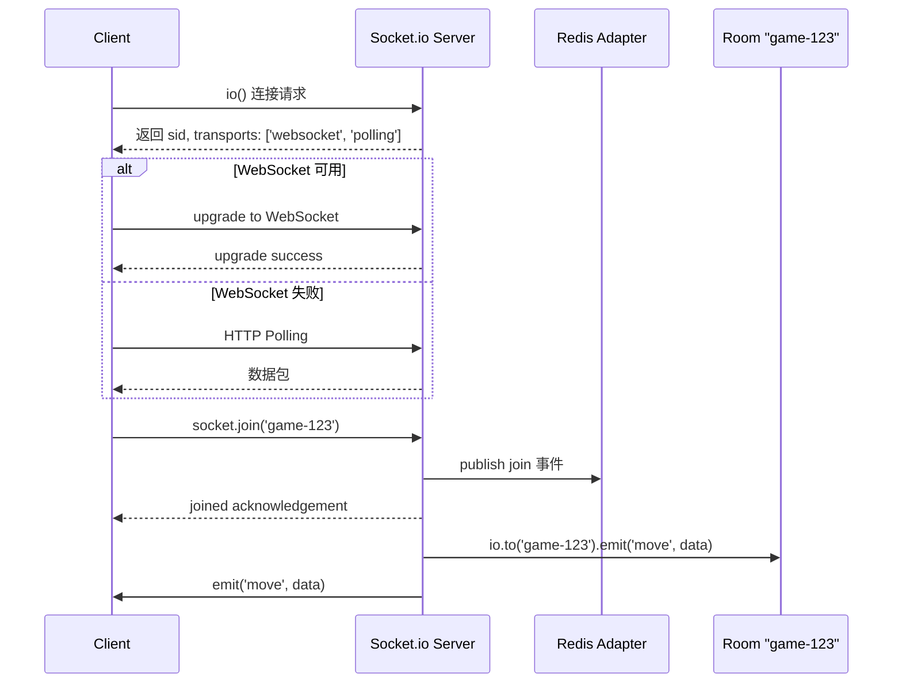
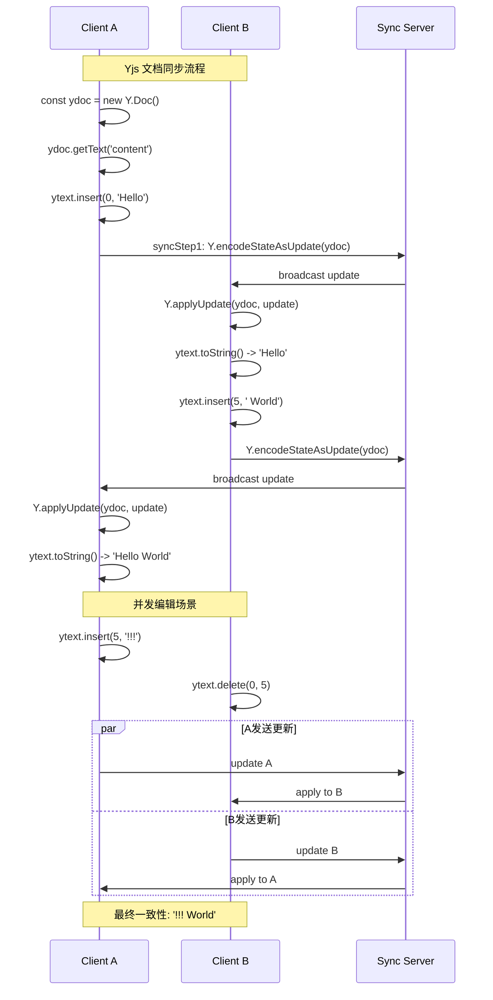
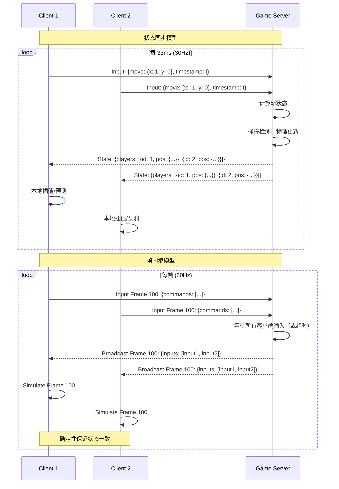
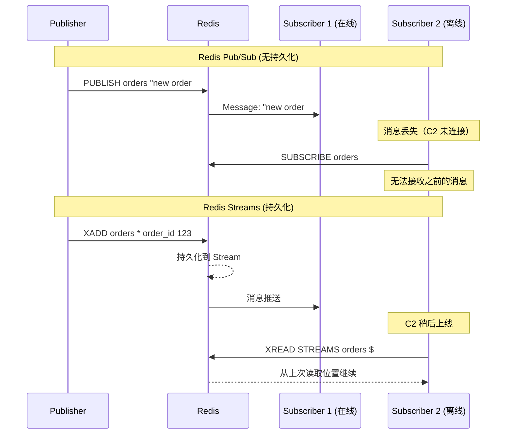

# 实时通信理论完全指南

> **形式化定义、协议分析与工程实践**

---

## 目录

- [实时通信理论完全指南](#实时通信理论完全指南)
  - [目录](#目录)
  - [1. 实时系统的形式化定义](#1-实时系统的形式化定义)
    - [1.1 核心概念形式化](#11-核心概念形式化)
      - [延迟 (Latency) 的形式化定义](#延迟-latency-的形式化定义)
      - [吞吐量 (Throughput) 的形式化定义](#吞吐量-throughput-的形式化定义)
      - [一致性 (Consistency) 的形式化定义](#一致性-consistency-的形式化定义)
    - [1.2 实时系统的 CAP 权衡](#12-实时系统的-cap-权衡)
    - [1.3 形式化规约 TypeScript 实现](#13-形式化规约-typescript-实现)
    - [1.4 性能优化策略](#14-性能优化策略)
  - [2. WebSocket 协议的帧结构和握手过程](#2-websocket-协议的帧结构和握手过程)
    - [2.1 WebSocket 握手协议时序图](#21-websocket-握手协议时序图)
    - [2.2 WebSocket 帧结构形式化](#22-websocket-帧结构形式化)
    - [2.3 WebSocket 帧解析器实现](#23-websocket-帧解析器实现)
    - [2.4 性能优化策略](#24-性能优化策略)
  - [3. Server-Sent Events (SSE) 的推送模型](#3-server-sent-events-sse-的推送模型)
    - [3.1 SSE 协议形式化定义](#31-sse-协议形式化定义)
    - [3.2 SSE 时序图](#32-sse-时序图)
    - [3.3 SSE 服务器实现](#33-sse-服务器实现)
    - [3.4 SSE 性能优化](#34-sse-性能优化)
  - [4. WebRTC 的 P2P 连接建立](#4-webrtc-的-p2p-连接建立)
    - [4.1 WebRTC 架构形式化](#41-webrtc-架构形式化)
    - [4.2 WebRTC 连接建立时序图](#42-webrtc-连接建立时序图)
    - [4.3 WebRTC 核心实现](#43-webrtc-核心实现)
    - [4.4 ICE 候选优先级算法](#44-ice-候选优先级算法)
  - [5. Socket.io 的降级策略和房间模型](#5-socketio-的降级策略和房间模型)
    - [5.1 Socket.io 传输降级形式化](#51-socketio-传输降级形式化)
    - [5.2 Socket.io 架构时序图](#52-socketio-架构时序图)
    - [5.3 Socket.io 服务器实现](#53-socketio-服务器实现)
    - [5.4 性能优化策略](#54-性能优化策略)
  - [6. Yjs 的 CRDT 协同编辑理论](#6-yjs-的-crdt-协同编辑理论)
    - [6.1 CRDT 形式化定义](#61-crdt-形式化定义)
    - [6.2 Yjs 文档结构时序图](#62-yjs-文档结构时序图)
    - [6.3 Yjs 核心实现](#63-yjs-核心实现)
    - [6.4 CRDT 性能优化](#64-crdt-性能优化)
  - [7. 操作转换（OT）算法形式化](#7-操作转换ot算法形式化)
    - [7.1 OT 形式化定义](#71-ot-形式化定义)
    - [7.2 OT 转换函数实现](#72-ot-转换函数实现)
    - [7.3 OT vs CRDT 对比](#73-ot-vs-crdt-对比)
  - [8. 实时游戏的同步模型](#8-实时游戏的同步模型)
    - [8.1 状态同步 vs 帧同步形式化](#81-状态同步-vs-帧同步形式化)
    - [8.2 游戏同步时序图](#82-游戏同步时序图)
    - [8.3 客户端预测与服务器和解](#83-客户端预测与服务器和解)
    - [8.4 延迟补偿（Lag Compensation）](#84-延迟补偿lag-compensation)
    - [8.5 性能优化策略](#85-性能优化策略)
  - [9. 消息队列的实时性](#9-消息队列的实时性)
    - [9.1 Redis Pub/Sub 形式化](#91-redis-pubsub-形式化)
    - [9.2 Redis Pub/Sub 与 Streams 对比时序图](#92-redis-pubsub-与-streams-对比时序图)
    - [9.3 Redis 实时消息实现](#93-redis-实时消息实现)
    - [9.4 消息队列对比](#94-消息队列对比)
  - [10. 实时系统的性能优化](#10-实时系统的性能优化)
    - [10.1 批处理优化](#101-批处理优化)
    - [10.2 压缩优化](#102-压缩优化)
    - [10.3 增量更新](#103-增量更新)
    - [10.4 综合性能优化策略](#104-综合性能优化策略)
  - [总结](#总结)

---

## 1. 实时系统的形式化定义

### 1.1 核心概念形式化

#### 延迟 (Latency) 的形式化定义

```
定义：延迟 L 是消息从发送端到接收端的端到端时间延迟

L = L_network + L_processing + L_queuing

其中：
- L_network = 传输延迟 + 传播延迟 = (数据包大小 / 带宽) + (距离 / 光速)
- L_processing = 序列化时间 + 反序列化时间 + 业务逻辑处理时间
- L_queuing = 发送队列延迟 + 接收队列延迟
```

**延迟分类的数学表达：**

| 延迟类型 | 符号 | 范围 | 适用场景 |
|---------|------|------|----------|
| 硬实时 | L_hard | < 10ms | 高频交易、工业控制 |
| 软实时 | L_soft | 10-100ms | 在线游戏、视频会议 |
| 近实时 | L_near | 100-1000ms | 消息推送、数据同步 |
| 准实时 | L_quasi | 1-10s | 邮件、通知系统 |

#### 吞吐量 (Throughput) 的形式化定义

```
定义：吞吐量 T 是单位时间内成功传输的消息数量或数据量

T = N / Δt

其中：
- N：成功传输的消息数量
- Δt：观测时间窗口

最大理论吞吐量（香农极限）：
C = B × log₂(1 + S/N)

其中：
- C：信道容量 (bits/s)
- B：带宽 (Hz)
- S/N：信噪比
```

#### 一致性 (Consistency) 的形式化定义

```
定义：一致性模型指定了分布式系统中数据副本之间的可见性保证

**线性一致性 (Linearizability)：**
∀ operations op₁, op₂:
  if op₁ completes before op₂ starts
  then ∀ observers: op₁'s effects visible before op₂

**因果一致性 (Causal Consistency)：**
if op₁ → op₂ (happens-before关系)
then ∀ observers: op₁'s effects visible before op₂

**最终一致性 (Eventual Consistency)：**
if no new updates: ∃ t, ∀ t' > t:
  all replicas have identical values
```

### 1.2 实时系统的 CAP 权衡



### 1.3 形式化规约 TypeScript 实现

```typescript
/**
 * 实时系统的形式化规约
 */

// 时间单位类型
type Milliseconds = number & { __brand: 'Milliseconds' };

// 延迟约束
interface LatencyConstraint {
  readonly maxLatency: Milliseconds;
  readonly percentile: 50 | 90 | 95 | 99 | 99.9;
  readonly violationRate: number;
}

// 吞吐量约束
interface ThroughputConstraint {
  readonly messagesPerSecond: number;
  readonly bytesPerSecond: number;
  readonly burstCapacity: number;
}

// 一致性级别
enum ConsistencyLevel {
  STRONG = 'STRONG',
  SEQUENTIAL = 'SEQUENTIAL',
  CAUSAL = 'CAUSAL',
  EVENTUAL = 'EVENTUAL',
}

// 实时系统合约
interface RealtimeSystemContract {
  latency: LatencyConstraint;
  throughput: ThroughputConstraint;
  consistency: ConsistencyLevel;
  verifyLatencyConstraint(actualLatency: Milliseconds): boolean;
  verifyThroughputConstraint(actual: number, window: Milliseconds): boolean;
}

// 金融交易系统实现
const FinancialTradingSystem: RealtimeSystemContract = {
  latency: {
    maxLatency: 10 as Milliseconds,
    percentile: 99.9,
    violationRate: 0.0001,
  },
  throughput: {
    messagesPerSecond: 100000,
    bytesPerSecond: 50 * 1024 * 1024,
    burstCapacity: 2,
  },
  consistency: ConsistencyLevel.STRONG,

  verifyLatencyConstraint(actual: Milliseconds): boolean {
    return actual <= this.latency.maxLatency;
  },

  verifyThroughputConstraint(actual: number, window: Milliseconds): boolean {
    const expected = this.throughput.messagesPerSecond * (window / 1000);
    return actual >= expected;
  },
};
```

### 1.4 性能优化策略

| 优化维度 | 技术策略 | 效果 |
|---------|---------|------|
| 延迟优化 | 内核旁路 (DPDK/RDMA) | 降至微秒级 |
| 延迟优化 | 专用硬件 (FPGA/ASIC) | 亚微秒级延迟 |
| 吞吐量优化 | 零拷贝技术 | 提升 10-100x |
| 吞吐量优化 | 批处理流水线 | 提升 5-10x |
| 一致性优化 | 混合同步策略 | 平衡 CAP |

---

## 2. WebSocket 协议的帧结构和握手过程

### 2.1 WebSocket 握手协议时序图



### 2.2 WebSocket 帧结构形式化

```
WebSocket Frame Format (RFC 6455):

 0                   1                   2                   3
 0 1 2 3 4 5 6 7 8 9 0 1 2 3 4 5 6 7 8 9 0 1 2 3 4 5 6 7 8 9 0 1
+-+-+-+-+-------+-+-------------+-------------------------------+
|F|R|R|R| opcode|M| Payload len |    Extended payload length    |
|I|S|S|S|  (4)  |A|     (7)     |             (16/64)           |
|N|V|V|V|       |S|             |   (if payload len==126/127)   |
| |1|2|3|       |K|             |                               |
+-+-+-+-+-------+-+-------------+ - - - - - - - - - - - - - - - +

FIN (1 bit): 是否为最后一帧
RSV1-3 (3 bits): 保留位
Opcode (4 bits): 帧类型
  0x0: Continuation, 0x1: Text, 0x2: Binary
  0x8: Close, 0x9: Ping, 0xA: Pong
MASK (1 bit): 是否使用掩码
Payload len (7 bits): 负载长度
```

### 2.3 WebSocket 帧解析器实现

```typescript
enum Opcode {
  CONTINUATION = 0x0,
  TEXT = 0x1,
  BINARY = 0x2,
  CLOSE = 0x8,
  PING = 0x9,
  PONG = 0xA,
}

interface WebSocketFrame {
  fin: boolean;
  opcode: Opcode;
  masked: boolean;
  payloadLength: number;
  maskingKey?: Buffer;
  payload: Buffer;
}

class WebSocketFrameParser {
  parseFrame(buffer: Buffer): { frame: WebSocketFrame; bytesConsumed: number } {
    let offset = 0;

    const firstByte = buffer[offset++];
    const fin = (firstByte & 0x80) !== 0;
    const opcode = firstByte & 0x0F;

    const secondByte = buffer[offset++];
    const masked = (secondByte & 0x80) !== 0;
    let payloadLength = secondByte & 0x7F;

    if (payloadLength === 126) {
      payloadLength = buffer.readUInt16BE(offset);
      offset += 2;
    } else if (payloadLength === 127) {
      const high = buffer.readUInt32BE(offset);
      const low = buffer.readUInt32BE(offset + 4);
      if (high !== 0) throw new Error('Payload too large');
      payloadLength = low;
      offset += 8;
    }

    let maskingKey: Buffer | undefined;
    if (masked) {
      maskingKey = buffer.slice(offset, offset + 4);
      offset += 4;
    }

    const payload = buffer.slice(offset, offset + payloadLength);

    if (masked && maskingKey) {
      for (let i = 0; i < payload.length; i++) {
        payload[i] ^= maskingKey[i % 4];
      }
    }

    return {
      frame: { fin, opcode, masked, payloadLength, maskingKey, payload },
      bytesConsumed: offset + payloadLength,
    };
  }
}
```

### 2.4 性能优化策略

```typescript
/**
 * WebSocket 性能优化
 */

// 1. 消息批处理
class BatchedSender {
  private buffer: Buffer[] = [];
  private timer: NodeJS.Timeout | null = null;

  constructor(
    private socket: import('net').Socket,
    private maxBatchSize = 100,
    private flushIntervalMs = 10
  ) {}

  send(message: Buffer): void {
    this.buffer.push(message);
    if (this.buffer.length >= this.maxBatchSize) {
      this.flush();
    } else if (!this.timer) {
      this.timer = setTimeout(() => this.flush(), this.flushIntervalMs);
    }
  }

  private flush(): void {
    if (this.buffer.length === 0) return;
    this.socket.write(Buffer.concat(this.buffer));
    this.buffer = [];
    if (this.timer) {
      clearTimeout(this.timer);
      this.timer = null;
    }
  }
}

// 2. 零拷贝文件传输
async function sendFile(socket: import('net').Socket, filePath: string): Promise<void> {
  const fs = require('fs');
  const stream = fs.createReadStream(filePath);

  for await (const chunk of stream) {
    const frame = createBinaryFrame(chunk);
    socket.write(frame);
  }
}

function createBinaryFrame(payload: Buffer): Buffer {
  const frame = Buffer.allocUnsafe(2 + payload.length);
  frame[0] = 0x82; // FIN + BINARY
  frame[1] = payload.length;
  payload.copy(frame, 2);
  return frame;
}
```

---

## 3. Server-Sent Events (SSE) 的推送模型

### 3.1 SSE 协议形式化定义

```
SSE (Server-Sent Events) 协议定义：
- 传输层: HTTP/1.1 持久连接
- 内容类型: text/event-stream
- 编码: UTF-8
- 方向: 单向服务器推送

消息格式：
  event: <event-type>\n
  data: <message-data>\n
  id: <event-id>\n
  retry: <reconnect-time>\n
  \n
```

### 3.2 SSE 时序图



### 3.3 SSE 服务器实现

```typescript
import { createServer, IncomingMessage, ServerResponse } from 'http';

interface SSEClient {
  id: string;
  response: ServerResponse;
  lastEventId: number;
}

class SSEServer {
  private clients: Map<string, SSEClient> = new Map();
  private eventHistory: Array<{ id: number; data: string }> = [];
  private maxHistorySize = 1000;
  private nextEventId = 1;

  handleConnection(req: IncomingMessage, res: ServerResponse): void {
    const clientId = crypto.randomUUID();
    const lastEventId = req.headers['last-event-id']
      ? parseInt(req.headers['last-event-id'] as string, 10)
      : 0;

    // 设置 SSE 响应头
    res.writeHead(200, {
      'Content-Type': 'text/event-stream',
      'Cache-Control': 'no-cache',
      'Connection': 'keep-alive',
      'X-Accel-Buffering': 'no',
    });

    const client: SSEClient = { id: clientId, response: res, lastEventId };
    this.clients.set(clientId, client);

    // 发送历史事件（断线重连）
    this.sendMissedEvents(client, lastEventId);

    // 发送连接确认
    this.sendEvent(client, { event: 'connected', data: { clientId } });

    // 心跳保持连接
    const heartbeat = setInterval(() => {
      res.write(':heartbeat\n\n');
    }, 30000);

    req.on('close', () => {
      clearInterval(heartbeat);
      this.clients.delete(clientId);
    });
  }

  broadcast(event: string, data: unknown): void {
    const eventId = this.nextEventId++;
    const eventData = JSON.stringify(data);

    this.eventHistory.push({ id: eventId, data: eventData });
    if (this.eventHistory.length > this.maxHistorySize) {
      this.eventHistory.shift();
    }

    const message = `id: ${eventId}\nevent: ${event}\ndata: ${eventData}\n\n`;

    for (const client of this.clients.values()) {
      client.response.write(message);
    }
  }

  private sendMissedEvents(client: SSEClient, lastId: number): void {
    const missed = this.eventHistory.filter(e => e.id > lastId);
    for (const event of missed) {
      client.response.write(`id: ${event.id}\ndata: ${event.data}\n\n`);
    }
  }

  private sendEvent(client: SSEClient, message: { event: string; data: unknown }): void {
    const data = JSON.stringify(message.data);
    client.response.write(`event: ${message.event}\ndata: ${data}\n\n`);
  }
}
```

### 3.4 SSE 性能优化

| 优化策略 | 实现方式 | 效果 |
|---------|---------|------|
| 心跳机制 | 每 30s 发送注释行 | 保持连接，检测死链 |
| 事件重放 | 维护事件历史缓冲区 | 支持断线重连恢复 |
| 压缩传输 | gzip 中间件 | 减少 60-80% 带宽 |
| 连接限制 | 每 IP 最大连接数 | 防止资源耗尽 |

---

## 4. WebRTC 的 P2P 连接建立

### 4.1 WebRTC 架构形式化

```
WebRTC 连接建立形式化定义：

给定：
- Peer A, Peer B: 两个通信端点
- Signal Server S: 信令服务器
- STUN Server: 会话遍历工具
- TURN Server: 转发服务器

目标：建立直接 P2P 数据通道

步骤：
1. 信令交换: A <-> S <-> B
2. ICE 候选收集: A -> STUN/TURN, B -> STUN/TURN
3. 连接性检查: A <-> B (ICE checks)
4. DTLS 握手: A <-> B (加密)
5. SCTP 建立: A <-> B (数据通道)
```

### 4.2 WebRTC 连接建立时序图



### 4.3 WebRTC 核心实现

```typescript
/**
 * WebRTC P2P 连接管理器
 */

interface ICEConfig {
  iceServers: RTCIceServer[];
  iceTransportPolicy: 'all' | 'relay';
  iceCandidatePoolSize: number;
}

class WebRTCManager {
  private pc: RTCPeerConnection | null = null;
  private dataChannel: RTCDataChannel | null = null;
  private signalingSocket: WebSocket;

  private readonly config: ICEConfig = {
    iceServers: [
      { urls: 'stun:stun.l.google.com:19302' },
      {
        urls: 'turn:turn.example.com:3478',
        username: 'user',
        credential: 'pass',
      },
    ],
    iceTransportPolicy: 'all',
    iceCandidatePoolSize: 10,
  };

  constructor(signalingUrl: string) {
    this.signalingSocket = new WebSocket(signalingUrl);
    this.setupSignaling();
  }

  async createConnection(): Promise<void> {
    this.pc = new RTCPeerConnection(this.config);

    this.dataChannel = this.pc.createDataChannel('chat', {
      ordered: true,
      maxRetransmits: 3,
    });

    this.setupDataChannel(this.dataChannel);
    this.setupPeerConnection();

    const offer = await this.pc.createOffer();
    await this.pc.setLocalDescription(offer);
    this.sendSignaling({ type: 'offer', sdp: offer });
  }

  private setupPeerConnection(): void {
    if (!this.pc) return;

    this.pc.onicecandidate = (event) => {
      if (event.candidate) {
        this.sendSignaling({
          type: 'ice-candidate',
          candidate: event.candidate,
        });
      }
    };

    this.pc.onconnectionstatechange = () => {
      console.log('Connection state:', this.pc?.connectionState);
    };
  }

  private setupSignaling(): void {
    this.signalingSocket.onmessage = async (event) => {
      const msg = JSON.parse(event.data);

      switch (msg.type) {
        case 'offer':
          await this.handleOffer(msg.sdp);
          break;
        case 'answer':
          await this.handleAnswer(msg.sdp);
          break;
        case 'ice-candidate':
          await this.handleICECandidate(msg.candidate);
          break;
      }
    };
  }

  private async handleOffer(offer: RTCSessionDescriptionInit): Promise<void> {
    if (!this.pc) {
      this.pc = new RTCPeerConnection(this.config);
    }

    await this.pc.setRemoteDescription(offer);
    const answer = await this.pc.createAnswer();
    await this.pc.setLocalDescription(answer);
    this.sendSignaling({ type: 'answer', sdp: answer });
  }

  private async handleAnswer(answer: RTCSessionDescriptionInit): Promise<void> {
    await this.pc?.setRemoteDescription(answer);
  }

  private async handleICECandidate(candidate: RTCIceCandidateInit): Promise<void> {
    await this.pc?.addIceCandidate(candidate);
  }

  private sendSignaling(message: unknown): void {
    this.signalingSocket.send(JSON.stringify(message));
  }
}
```

### 4.4 ICE 候选优先级算法

```typescript
/**
 * 候选优先级计算 (RFC 5245)
 *
 * priority = (2^24)*(type preference) +
 *            (2^8)*(local preference) +
 *            (2^0)*(256 - component ID)
 */
function calculateCandidatePriority(
  type: 'host' | 'srflx' | 'prflx' | 'relay',
  localPreference: number,
  componentId: number
): number {
  const typePreferences: Record<string, number> = {
    host: 126,
    prflx: 110,
    srflx: 100,
    relay: 0,
  };

  const typePreference = typePreferences[type] || 0;

  return (2 ** 24) * typePreference +
         (2 ** 8) * localPreference +
         (256 - componentId);
}
```

---

## 5. Socket.io 的降级策略和房间模型

### 5.1 Socket.io 传输降级形式化

```
Socket.io 传输层选择算法：

优先顺序: WebSocket -> WebTransport -> HTTP Streaming -> HTTP Polling

选择函数：
  selectTransport(priority, capabilities, network) =
    if capabilities.websocket && network.allowsWebSocket
      then WebSocket
    else if capabilities.webtransport && network.allowsQUIC
      then WebTransport
    else if network.allowsStreaming
      then HTTPStreaming
    else
      HTTPPolling
```

### 5.2 Socket.io 架构时序图



### 5.3 Socket.io 服务器实现

```typescript
import { Server, Socket } from 'socket.io';
import { createAdapter } from '@socket.io/redis-adapter';

class SocketioGameServer {
  private io: Server;
  private rooms: Map<string, RoomState> = new Map();

  constructor(httpServer: import('http').Server) {
    this.io = new Server(httpServer, {
      transports: ['websocket', 'polling'],
      pingTimeout: 60000,
      pingInterval: 25000,
    });

    this.setupAdapter();
    this.setupHandlers();
  }

  private setupHandlers(): void {
    this.io.on('connection', (socket: Socket) => {
      socket.on('join-room', (roomId: string, callback) => {
        this.handleJoinRoom(socket, roomId, callback);
      });

      socket.on('player-move', (data: Move) => {
        this.handlePlayerMove(socket, data);
      });

      socket.on('disconnect', () => {
        this.handleDisconnect(socket);
      });
    });
  }

  private async handleJoinRoom(
    socket: Socket,
    roomId: string,
    callback: Function
  ): Promise<void> {
    const room = this.io.sockets.adapter.rooms.get(roomId);
    const numClients = room ? room.size : 0;

    if (numClients >= 4) {
      callback({ success: false, error: 'Room is full' });
      return;
    }

    await socket.join(roomId);

    socket.to(roomId).emit('player-joined', {
      playerId: socket.id,
      playerCount: numClients + 1,
    });

    callback({ success: true, players: numClients + 1 });
  }

  private handlePlayerMove(socket: Socket, move: Move): void {
    const rooms = Array.from(socket.rooms);
    const gameRoom = rooms.find(r => r !== socket.id);
    if (!gameRoom) return;

    // 广播移动（排除发送者）
    socket.to(gameRoom).emit('player-moved', {
      player: socket.id,
      move: move,
    });
  }
}
```

### 5.4 性能优化策略

```typescript
/**
 * Socket.io 性能优化
 */

class SocketioOptimizer {
  // 1. 二进制数据传输
  sendBinaryData(socket: Socket, data: ArrayBuffer): void {
    socket.emit('binary-data', Buffer.from(data));
  }

  // 2. 消息压缩
  setupCompression(io: Server): void {
    io.use((socket, next) => {
      socket.compress(true);
      next();
    });
  }

  // 3. 批量广播（volatile 允许丢失）
  batchBroadcast(io: Server, room: string, events: unknown[]): void {
    io.volatile.to(room).emit('updates', events);
  }
}
```

---

## 6. Yjs 的 CRDT 协同编辑理论

### 6.1 CRDT 形式化定义

```
CRDT (Conflict-free Replicated Data Type) 定义：

给定：
- 状态集合 S
- 更新操作集合 O
- 查询操作集合 Q
- 合并函数 merge: S x S -> S

性质：
1. 交换律 (Commutativity):
   forall a,b in O: apply(apply(s, a), b) = apply(apply(s, b), a)

2. 结合律 (Associativity):
   forall a,b,c in O: apply(apply(apply(s, a), b), c) = apply(apply(s, a), apply(b, c))

3. 幂等律 (Idempotence):
   forall a in O: apply(apply(s, a), a) = apply(s, a)

CRDT 类型：
- CvRDT (Convergent): 基于状态合并
- CmRDT (Commutative): 基于操作交换
```

### 6.2 Yjs 文档结构时序图



### 6.3 Yjs 核心实现

```typescript
import * as Y from 'yjs';
import { WebsocketProvider } from 'y-websocket';

/**
 * Yjs 协同编辑器
 */
class CollaborativeEditor {
  private ydoc: Y.Doc;
  private ytext: Y.Text;
  private provider: WebsocketProvider;
  private awareness: any;

  constructor(
    roomName: string,
    websocketUrl: string,
    private userId: string,
    private userName: string
  ) {
    // 创建 Yjs 文档
    this.ydoc = new Y.Doc();

    // 创建共享文本类型
    this.ytext = this.ydoc.getText('content');

    // 连接到同步服务器
    this.provider = new WebsocketProvider(
      websocketUrl,
      roomName,
      this.ydoc
    );

    // 设置 Awareness（光标位置、用户状态）
    this.awareness = this.provider.awareness;
    this.setupAwareness();

    // 监听远程变化
    this.setupObservers();
  }

  private setupAwareness(): void {
    this.awareness.setLocalStateField('user', {
      id: this.userId,
      name: this.userName,
      color: this.generateUserColor(),
    });

    // 监听远程用户状态变化
    this.awareness.on('change', () => {
      const states = Array.from(this.awareness.getStates().values());
      this.renderRemoteCursors(states);
    });
  }

  private setupObservers(): void {
    // 监听文本变化
    this.ytext.observe((event) => {
      event.changes.delta.forEach((change) => {
        if (change.insert) {
          this.renderInsert(change.insert, event.target);
        } else if (change.delete) {
          this.renderDelete(change.delete);
        } else if (change.retain) {
          this.moveCursor(change.retain);
        }
      });
    });
  }

  // 本地插入操作
  insert(index: number, text: string, attributes?: Record<string, unknown>): void {
    this.ydoc.transact(() => {
      this.ytext.insert(index, text, attributes);

      // 更新本地光标位置
      this.awareness.setLocalStateField('cursor', {
        index: index + text.length,
        length: 0,
      });
    });
  }

  // 本地删除操作
  delete(index: number, length: number): void {
    this.ydoc.transact(() => {
      this.ytext.delete(index, length);
    });
  }

  // 获取当前内容
  getContent(): string {
    return this.ytext.toString();
  }

  // 导出为结构化数据
  exportState(): Uint8Array {
    return Y.encodeStateAsUpdate(this.ydoc);
  }

  // 导入状态
  importState(state: Uint8Array): void {
    Y.applyUpdate(this.ydoc, state);
  }

  destroy(): void {
    this.provider.destroy();
    this.ydoc.destroy();
  }

  private generateUserColor(): string {
    const hue = Math.floor(Math.random() * 360);
    return `hsl(${hue}, 70%, 50%)`;
  }

  private renderRemoteCursors(states: any[]): void {
    // 渲染远程用户光标
  }

  private renderInsert(text: string, origin: Y.AbstractType<unknown>): void {
    // 渲染插入内容
  }

  private renderDelete(length: number): void {
    // 渲染删除
  }

  private moveCursor(offset: number): void {
    // 移动光标
  }
}
```

### 6.4 CRDT 性能优化

```typescript
/**
 * Yjs 性能优化策略
 */

class YjsOptimizer {
  /**
   * 1. 增量更新传输
   */
  sendIncrementalUpdate(ydoc: Y.Doc, lastSyncState: Uint8Array): Uint8Array {
    // 只发送差异，而非完整状态
    return Y.encodeStateAsUpdate(ydoc, lastSyncState);
  }

  /**
   * 2. 更新压缩
   */
  compressUpdate(update: Uint8Array): Uint8Array {
    // 合并连续的小更新
    return Y.mergeUpdates([update]);
  }

  /**
   * 3. 分片文档（大文档优化）
   */
  createFragmentedDoc(): Y.Doc {
    const ydoc = new Y.Doc({ gc: true });

    // 将大文档拆分为多个共享类型
    const page1 = ydoc.getText('page1');
    const page2 = ydoc.getText('page2');
    const comments = ydoc.getArray('comments');

    return ydoc;
  }
}
```

---

## 7. 操作转换（OT）算法形式化

### 7.1 OT 形式化定义

```
操作转换 (Operational Transformation) 定义：

给定：
- 文档状态空间 D
- 操作集合 Op = {Insert(pos, str), Delete(pos, len), Retain(len)}
- 转换函数 T: Op x Op -> Op x Op

IT (Inclusion Transformation) 规则：
  给定两个并发操作 op1, op2
  定义 op1' = IT(op1, op2)，使得：
  apply(apply(d, op2), op1') = apply(apply(d, op1), op2')

ET (Exclusion Transformation) 规则：
  给定两个操作 op1, op2，其中 op2 在 op1 之后执行
  定义 op1' = ET(op1, op2)，使得：
  apply(apply(d, op1), op2) = apply(apply(d, op2), op1')
```

### 7.2 OT 转换函数实现

```typescript
/**
 * OT (Operational Transformation) 核心实现
 */

type OpType = 'retain' | 'insert' | 'delete';

interface Operation {
  type: OpType;
  length?: number;
  text?: string;
  attributes?: Record<string, unknown>;
}

class OTOperation {
  private ops: Operation[] = [];

  retain(length: number): this {
    if (length > 0) {
      this.ops.push({ type: 'retain', length });
    }
    return this;
  }

  insert(text: string, attributes?: Record<string, unknown>): this {
    this.ops.push({ type: 'insert', text, attributes });
    return this;
  }

  delete(length: number): this {
    if (length > 0) {
      this.ops.push({ type: 'delete', length });
    }
    return this;
  }

  getOps(): Operation[] {
    return this.ops;
  }

  /**
   * 操作变换 (Transform)
   * 解决两个并发操作的冲突
   */
  static transform(op1: OTOperation, op2: OTOperation): [OTOperation, OTOperation] {
    const newOp1 = new OTOperation();
    const newOp2 = new OTOperation();

    const ops1 = [...op1.getOps()];
    const ops2 = [...op2.getOps()];

    let i = 0, j = 0;

    while (i < ops1.length || j < ops2.length) {
      const o1 = ops1[i];
      const o2 = ops2[j];

      if (!o1) {
        newOp2.retain(OTOperation.getLength(o2));
        j++;
        continue;
      }
      if (!o2) {
        newOp1.retain(OTOperation.getLength(o1));
        i++;
        continue;
      }

      // Insert vs Insert: 保持顺序（如按用户ID排序）
      if (o1.type === 'insert' && o2.type === 'insert') {
        if ((o1.text || '') < (o2.text || '')) {
          newOp1.insert(o1.text!, o1.attributes);
          newOp2.retain(o1.text!.length);
          i++;
        } else {
          newOp2.insert(o2.text!, o2.attributes);
          newOp1.retain(o2.text!.length);
          j++;
        }
      }
      // Insert vs Retain/Delete
      else if (o1.type === 'insert') {
        newOp1.insert(o1.text!, o1.attributes);
        newOp2.retain(o1.text!.length);
        i++;
      }
      else if (o2.type === 'insert') {
        newOp2.insert(o2.text!, o2.attributes);
        newOp1.retain(o2.text!.length);
        j++;
      }
      // Delete vs Delete
      else if (o1.type === 'delete' && o2.type === 'delete') {
        const len1 = o1.length || 0;
        const len2 = o2.length || 0;

        if (len1 > len2) {
          o1.length = len1 - len2;
          j++;
        } else if (len1 < len2) {
          o2.length = len2 - len1;
          i++;
        } else {
          i++;
          j++;
        }
      }
      // Delete vs Retain
      else if (o1.type === 'delete') {
        newOp1.delete(o1.length!);
        i++;
      }
      // Retain vs Delete
      else if (o2.type === 'delete') {
        newOp2.delete(o2.length!);
        j++;
      }
      // Retain vs Retain
      else {
        const len1 = o1.length || 0;
        const len2 = o2.length || 0;
        const minLen = Math.min(len1, len2);

        newOp1.retain(minLen);
        newOp2.retain(minLen);

        if (len1 > len2) {
          o1.length = len1 - len2;
          j++;
        } else if (len1 < len2) {
          o2.length = len2 - len1;
          i++;
        } else {
          i++;
          j++;
        }
      }
    }

    return [newOp1, newOp2];
  }

  private static getLength(op: Operation): number {
    if (op.type === 'insert') return op.text?.length || 0;
    if (op.type === 'retain') return op.length || 0;
    return 0;
  }

  /**
   * 应用操作到文档
   */
  apply(document: string): string {
    let result = '';
    let index = 0;

    for (const op of this.ops) {
      switch (op.type) {
        case 'retain':
          result += document.slice(index, index + (op.length || 0));
          index += op.length || 0;
          break;
        case 'insert':
          result += op.text;
          break;
        case 'delete':
          index += op.length || 0;
          break;
      }
    }

    result += document.slice(index);
    return result;
  }
}
```

### 7.3 OT vs CRDT 对比

| 特性 | OT | CRDT |
|------|-----|------|
| 转换复杂度 | 高（需要中心服务器） | 低（无冲突合并） |
| 离线支持 | 有限 | 完全支持 |
| 内存占用 | 较小 | 较大（需要保留 tombstones） |
| 实现难度 | 高 | 中等 |
| 收敛保证 | 依赖服务器 | 天然保证 |
| 代表实现 | Google Docs, CodeMirror | Yjs, Automerge |

---

## 8. 实时游戏的同步模型

### 8.1 状态同步 vs 帧同步形式化

```
实时游戏同步模型定义：

**状态同步 (State Synchronization)：**
- 服务器权威：Server Authoritative
- 同步频率：通常 10-30 Hz
- 带宽占用：较高（传输完整状态）
- 适用类型：MMORPG, FPS

形式化：
  ServerState(t) = f(ServerState(t-Delta t), Inputs(t-Delta t))
  ClientState(t) = interpolate(ServerState(t-k), ServerState(t-k+1))

**帧同步 (Lockstep/Deterministic)：**
- 确定性模拟：Deterministic Simulation
- 同步频率：通常 60 Hz（游戏帧率）
- 带宽占用：较低（仅传输输入）
- 适用类型：RTS, 格斗游戏

形式化：
  forall 客户端 i: State_i(t) = Simulate(State_i(t-1), Inputs_all(t-1))
  约束: State_i(t) = State_j(t), forall i,j
```

### 8.2 游戏同步时序图



### 8.3 客户端预测与服务器和解

```typescript
/**
 * 客户端预测 (Client-Side Prediction)
 * 服务器和解 (Server Reconciliation)
 */

interface PlayerState {
  position: Vector3;
  velocity: Vector3;
  timestamp: number;
}

interface PlayerInput {
  moveDirection: Vector3;
  jump: boolean;
  attack: boolean;
  timestamp: number;
  sequenceNumber: number;
}

class GameClient {
  private playerState: PlayerState;
  private serverState: PlayerState;
  private inputHistory: PlayerInput[] = [];
  private lastProcessedInput: number = 0;

  // 网络参数
  private ping: number = 50;
  private serverTickRate: number = 30;

  // 本地模拟
  private predictedState: PlayerState;

  constructor(initialState: PlayerState) {
    this.playerState = { ...initialState };
    this.serverState = { ...initialState };
    this.predictedState = { ...initialState };
  }

  /**
   * 处理本地输入（客户端预测）
   */
  handleLocalInput(input: PlayerInput): void {
    // 保存输入历史
    this.inputHistory.push(input);

    // 立即应用预测
    this.predictedState = this.simulate(
      this.predictedState,
      input,
      1 / 60
    );

    // 发送输入到服务器
    this.sendToServer(input);

    // 渲染预测状态
    this.render(this.predictedState);
  }

  /**
   * 接收服务器状态（服务器和解）
   */
  receiveServerState(serverState: PlayerState, lastProcessedInput: number): void {
    this.serverState = serverState;
    this.lastProcessedInput = lastProcessedInput;

    // 重新应用服务器未处理的输入
    let state = { ...this.serverState };

    const unprocessedInputs = this.inputHistory.filter(
      input => input.sequenceNumber > this.lastProcessedInput
    );

    for (const input of unprocessedInputs) {
      state = this.simulate(state, input, 1 / 60);
    }

    // 如果预测偏离较大，平滑插值到正确状态
    const drift = this.calculateDrift(this.predictedState, state);

    if (drift > 0.1) {
      this.predictedState = state;
    } else if (drift > 0.01) {
      this.predictedState = this.lerp(this.predictedState, state, 0.3);
    }

    // 清理已确认的输入历史
    this.inputHistory = this.inputHistory.filter(
      input => input.sequenceNumber > this.lastProcessedInput
    );
  }

  /**
   * 实体插值（其他玩家的平滑显示）
   */
  interpolateEntityPosition(
    pastStates: PlayerState[],
    renderTime: number
  ): Vector3 {
    // 找到包围 renderTime 的两个状态
    const newer = pastStates.find(s => s.timestamp >= renderTime);
    const older = pastStates[pastStates.indexOf(newer!) - 1];

    if (!newer || !older) {
      return newer?.position ?? older?.position ?? { x: 0, y: 0, z: 0 };
    }

    // 计算插值比例
    const totalTime = newer.timestamp - older.timestamp;
    const t = (renderTime - older.timestamp) / totalTime;

    return this.lerpVector3(older.position, newer.position, t);
  }

  /**
   * 物理模拟（确定性）
   */
  private simulate(state: PlayerState, input: PlayerInput, deltaTime: number): PlayerState {
    const newState = { ...state };

    // 应用移动输入
    newState.velocity.x += input.moveDirection.x * 10 * deltaTime;
    newState.velocity.z += input.moveDirection.z * 10 * deltaTime;

    // 跳跃
    if (input.jump && this.isGrounded(state)) {
      newState.velocity.y = 10;
    }

    // 重力
    newState.velocity.y -= 20 * deltaTime;

    // 应用速度
    newState.position.x += newState.velocity.x * deltaTime;
    newState.position.y += newState.velocity.y * deltaTime;
    newState.position.z += newState.velocity.z * deltaTime;

    // 地面碰撞
    if (newState.position.y < 0) {
      newState.position.y = 0;
      newState.velocity.y = 0;
    }

    newState.timestamp = input.timestamp;
    return newState;
  }

  private calculateDrift(a: PlayerState, b: PlayerState): number {
    const dx = a.position.x - b.position.x;
    const dy = a.position.y - b.position.y;
    const dz = a.position.z - b.position.z;
    return Math.sqrt(dx * dx + dy * dy + dz * dz);
  }

  private lerp(a: PlayerState, b: PlayerState, t: number): PlayerState {
    return {
      ...a,
      position: this.lerpVector3(a.position, b.position, t),
      velocity: this.lerpVector3(a.velocity, b.velocity, t),
    };
  }

  private lerpVector3(a: Vector3, b: Vector3, t: number): Vector3 {
    return {
      x: a.x + (b.x - a.x) * t,
      y: a.y + (b.y - a.y) * t,
      z: a.z + (b.z - a.z) * t,
    };
  }

  private isGrounded(state: PlayerState): boolean {
    return state.position.y <= 0.01;
  }

  private sendToServer(input: PlayerInput): void {
    // 网络发送实现
  }

  private render(state: PlayerState): void {
    // 渲染实现
  }
}

interface Vector3 {
  x: number;
  y: number;
  z: number;
}
```

### 8.4 延迟补偿（Lag Compensation）

```typescript
/**
 * 延迟补偿算法
 * 用于 FPS 游戏中的射击判定
 */

class LagCompensationSystem {
  private playerHistory: Map<string, PlayerState[]> = new Map();
  private readonly maxHistoryTime: number = 1000; // 1秒历史

  /**
   * 记录玩家状态历史
   */
  recordState(playerId: string, state: PlayerState): void {
    if (!this.playerHistory.has(playerId)) {
      this.playerHistory.set(playerId, []);
    }

    const history = this.playerHistory.get(playerId)!;
    history.push(state);

    // 清理过期历史
    const cutoff = Date.now() - this.maxHistoryTime;
    while (history.length > 0 && history[0].timestamp < cutoff) {
      history.shift();
    }
  }

  /**
   * 执行带延迟补偿的射击检测
   */
  performHitDetection(
    shooterId: string,
    targetId: string,
    shotInfo: {
      origin: Vector3;
      direction: Vector3;
      clientTimestamp: number;
      serverTimestamp: number;
    }
  ): boolean {
    // 计算射击者的 ping
    const rtt = shotInfo.serverTimestamp - shotInfo.clientTimestamp;
    const shooterPing = rtt / 2;

    // 回溯到射击者看到的目标位置
    const targetTime = shotInfo.serverTimestamp - shooterPing;

    // 获取目标在回溯时间点的状态
    const targetState = this.getHistoricalState(targetId, targetTime);

    if (!targetState) {
      return false;
    }

    // 执行射线检测
    return this.raycastHitbox(shotInfo.origin, shotInfo.direction, targetState);
  }

  private getHistoricalState(playerId: string, timestamp: number): PlayerState | null {
    const history = this.playerHistory.get(playerId);
    if (!history || history.length === 0) return null;

    for (let i = history.length - 1; i >= 0; i--) {
      if (history[i].timestamp <= timestamp) {
        return history[i];
      }
    }

    return history[0];
  }

  private raycastHitbox(origin: Vector3, direction: Vector3, target: PlayerState): boolean {
    // 射线与命中框检测实现
    return true;
  }
}
```

### 8.5 性能优化策略

| 优化技术 | 描述 | 效果 |
|---------|------|------|
| 客户端预测 | 立即响应用户输入 | 消除本地延迟感知 |
| 服务器和解 | 纠正预测错误 | 保证一致性 |
| 实体插值 | 平滑其他玩家移动 | 减少抖动 |
| 延迟补偿 | 射击判定回溯 | 公平性提升 |
| 死区重构 | 不重要的状态减少同步频率 | 带宽节省 50%+ |
| 增量压缩 | 只传输变化的状态字段 | 带宽节省 70%+ |

---

## 9. 消息队列的实时性

### 9.1 Redis Pub/Sub 形式化

```
Redis Pub/Sub 语义定义：

发布 (Publish):
  PUBLISH channel message -> 返回接收者数量

订阅 (Subscribe):
  SUBSCRIBE channel [channel ...]

模式订阅:
  PSUBSCRIBE pattern [pattern ...]

消息传递保证:
 - 最多一次 (At-most-once)
 - 无持久化
 - 无消费者确认

时间复杂度:
 - PUBLISH: O(N) N=订阅者数
 - SUBSCRIBE: O(1)
```

### 9.2 Redis Pub/Sub 与 Streams 对比时序图



### 9.3 Redis 实时消息实现

```typescript
import { createClient, RedisClientType } from 'redis';

/**
 * Redis Pub/Sub 实时消息系统
 */
class RedisPubSubSystem {
  private publisher: RedisClientType;
  private subscriber: RedisClientType;
  private handlers: Map<string, Set<(message: string) => void>> = new Map();

  async connect(url: string): Promise<void> {
    this.publisher = createClient({ url });
    this.subscriber = createClient({ url });

    await Promise.all([
      this.publisher.connect(),
      this.subscriber.connect(),
    ]);
  }

  /**
   * 发布消息
   */
  async publish(channel: string, message: unknown): Promise<number> {
    const serialized = JSON.stringify(message);
    return this.publisher.publish(channel, serialized);
  }

  /**
   * 订阅频道
   */
  async subscribe(channel: string, handler: (message: string) => void): Promise<void> {
    if (!this.handlers.has(channel)) {
      this.handlers.set(channel, new Set());
      await this.subscriber.subscribe(channel, (message) => {
        this.handleMessage(channel, message);
      });
    }

    this.handlers.get(channel)!.add(handler);
  }

  private handleMessage(channel: string, message: string): void {
    const handlers = this.handlers.get(channel);
    if (handlers) {
      handlers.forEach(handler => {
        try {
          handler(message);
        } catch (error) {
          console.error('Message handler error:', error);
        }
      });
    }
  }
}

/**
 * Redis Streams 实时流处理
 */
class RedisStreamSystem {
  private client: RedisClientType;
  private consumerGroup: string;

  constructor(url: string, consumerGroup: string) {
    this.client = createClient({ url });
    this.consumerGroup = consumerGroup;
  }

  async connect(): Promise<void> {
    await this.client.connect();
  }

  /**
   * 添加消息到 Stream
   */
  async addMessage(
    streamKey: string,
    data: Record<string, unknown>,
    options: { maxlen?: number } = {}
  ): Promise<string> {
    const { maxlen } = options;

    if (maxlen) {
      return this.client.xAdd(streamKey, '*', data, {
        TRIM: {
          strategy: 'MAXLEN',
          strategyModifier: '~',
          threshold: maxlen,
        },
      });
    }

    return this.client.xAdd(streamKey, '*', data);
  }

  /**
   * 创建消费者组
   */
  async createConsumerGroup(streamKey: string, startId: string = '$'): Promise<void> {
    try {
      await this.client.xGroupCreate(streamKey, this.consumerGroup, startId, {
        MKSTREAM: true,
      });
    } catch (error) {
      if (!(error as Error).message.includes('already exists')) {
        throw error;
      }
    }
  }

  /**
   * 消费消息（消费者组）
   */
  async consumeMessages(
    streamKey: string,
    consumerName: string,
    handler: (message: { id: string; data: Record<string, string> }) => Promise<void>
  ): Promise<void> {
    while (true) {
      const messages = await this.client.xReadGroup(
        this.consumerGroup,
        consumerName,
        { key: streamKey, id: '>' },
        { COUNT: 10, BLOCK: 5000 }
      );

      if (!messages || messages.length === 0) continue;

      for (const stream of messages) {
        for (const message of stream.messages) {
          try {
            await handler({ id: message.id, data: message.message });
            await this.client.xAck(streamKey, this.consumerGroup, message.id);
          } catch (error) {
            console.error('Message processing error:', error);
          }
        }
      }
    }
  }
}
```

### 9.4 消息队列对比

| 特性 | Redis Pub/Sub | Redis Streams | RabbitMQ | Kafka |
|------|---------------|---------------|----------|-------|
| 持久化 | 否 | 是 | 是 | 是 |
| 消息确认 | 无 | 支持 | 支持 | 支持 |
| 消费者组 | 否 | 是 | 是 | 是 |
| 分区 | 否 | 否 | 否 | 是 |
| 延迟 | < 1ms | < 2ms | 1-5ms | 5-20ms |
| 吞吐量 | 100K+/s | 100K+/s | 50K+/s | 1M+/s |
| 适用场景 | 实时通知 | 事件溯源 | 任务队列 | 大数据流 |

---

## 10. 实时系统的性能优化

### 10.1 批处理优化

```
批处理形式化定义：

给定：
- 消息序列 M = [m1, m2, ..., mn]
- 批大小 B
- 超时时间 T

批处理函数：
  batch(M, B, T) =
    if |M| >= B or timeout(T):
      return M[0:B], M[B:]
    else:
      wait and recheck

收益分析：
- 网络开销: O(n) -> O(n/B)
- 吞吐提升: Bx (理想情况)
- 延迟增加: T/2 (平均)
```

### 10.2 压缩优化

```typescript
/**
 * 实时消息压缩策略
 */

import { deflate, inflate } from 'zlib';
import { promisify } from 'util';

const deflateAsync = promisify(deflate);
const inflateAsync = promisify(inflate);

class MessageCompressor {
  /**
   * 选择性压缩
   * 小消息不压缩（压缩开销 > 收益）
   */
  async compress(data: Buffer): Promise<Buffer> {
    const COMPRESSION_THRESHOLD = 1024; // 1KB

    if (data.length < COMPRESSION_THRESHOLD) {
      return Buffer.concat([Buffer.from([0x00]), data]); // 未压缩标记
    }

    const compressed = await deflateAsync(data, { level: 6 });

    // 压缩后更大，使用原始数据
    if (compressed.length >= data.length) {
      return Buffer.concat([Buffer.from([0x00]), data]);
    }

    return Buffer.concat([Buffer.from([0x01]), compressed]); // 压缩标记
  }

  async decompress(data: Buffer): Promise<Buffer> {
    const isCompressed = data[0] === 0x01;
    const payload = data.slice(1);

    if (isCompressed) {
      return inflateAsync(payload);
    }

    return payload;
  }
}
```

### 10.3 增量更新

```typescript
/**
 * JSON 增量更新 (RFC 6902 JSON Patch)
 */

interface JSONPatchOperation {
  op: 'add' | 'remove' | 'replace' | 'move' | 'copy' | 'test';
  path: string;
  value?: unknown;
  from?: string;
}

class IncrementalUpdater {
  /**
   * 生成 diff
   */
  static diff(oldObj: unknown, newObj: unknown): JSONPatchOperation[] {
    const patches: JSONPatchOperation[] = [];
    this.generateDiff(oldObj, newObj, '', patches);
    return patches;
  }

  private static generateDiff(
    oldVal: unknown,
    newVal: unknown,
    path: string,
    patches: JSONPatchOperation[]
  ): void {
    if (JSON.stringify(oldVal) === JSON.stringify(newVal)) {
      return;
    }

    if (typeof oldVal !== typeof newVal ||
        Array.isArray(oldVal) !== Array.isArray(newVal)) {
      patches.push({ op: 'replace', path, value: newVal });
      return;
    }

    if (Array.isArray(oldVal) && Array.isArray(newVal)) {
      // 数组 diff（简化版）
      const maxLen = Math.max(oldVal.length, newVal.length);
      for (let i = 0; i < maxLen; i++) {
        if (i >= oldVal.length) {
          patches.push({ op: 'add', path: `${path}/${i}`, value: newVal[i] });
        } else if (i >= newVal.length) {
          patches.push({ op: 'remove', path: `${path}/${i}` });
        } else {
          this.generateDiff(oldVal[i], newVal[i], `${path}/${i}`, patches);
        }
      }
    } else if (typeof oldVal === 'object' && oldVal !== null) {
      const oldKeys = Object.keys(oldVal as object);
      const newKeys = Object.keys(newVal as object);

      for (const key of newKeys) {
        if (!(key in (oldVal as object))) {
          patches.push({
            op: 'add',
            path: `${path}/${key}`,
            value: (newVal as Record<string, unknown>)[key]
          });
        } else {
          this.generateDiff(
            (oldVal as Record<string, unknown>)[key],
            (newVal as Record<string, unknown>)[key],
            `${path}/${key}`,
            patches
          );
        }
      }

      for (const key of oldKeys) {
        if (!(key in (newVal as object))) {
          patches.push({ op: 'remove', path: `${path}/${key}` });
        }
      }
    } else {
      patches.push({ op: 'replace', path, value: newVal });
    }
  }

  /**
   * 应用 patch
   */
  static apply(obj: unknown, patches: JSONPatchOperation[]): unknown {
    const result = JSON.parse(JSON.stringify(obj));

    for (const patch of patches) {
      const keys = patch.path.split('/').filter(k => k);
      let current: any = result;

      for (let i = 0; i < keys.length - 1; i++) {
        current = current[keys[i]];
      }

      const lastKey = keys[keys.length - 1];

      switch (patch.op) {
        case 'add':
        case 'replace':
          current[lastKey] = patch.value;
          break;
        case 'remove':
          delete current[lastKey];
          break;
      }
    }

    return result;
  }
}
```

### 10.4 综合性能优化策略

| 优化策略 | 适用场景 | 增益 |
|---------|---------|------|
| 消息批处理 | 高吞吐写入 | 5-10x |
| 智能压缩 | 大文本传输 | 60-80% 带宽节省 |
| 增量更新 | 频繁小修改 | 90%+ 带宽节省 |
| 连接复用 | 多请求场景 | 减少握手开销 |
| 零拷贝 | 大文件传输 | 减少内存复制 |
| 预连接池 | 突发流量 | 减少连接建立延迟 |

---

## 总结

本文档系统地介绍了实时通信领域的核心理论与工程实践：

1. **形式化基础**：建立了延迟、吞吐量、一致性的数学模型
2. **协议深度解析**：WebSocket、SSE、WebRTC 的帧结构与握手过程
3. **协同编辑理论**：CRDT 与 OT 两种冲突解决机制
4. **游戏同步模型**：状态同步与帧同步的权衡
5. **消息队列**：不同实时性要求的队列选型
6. **性能优化**：批处理、压缩、增量更新等技术

> **关键原则**：在实时系统中，优化是一个多维度的权衡过程，需要在延迟、吞吐量、一致性、复杂度之间找到适合业务场景的平衡点。
