# JavaScript/TypeScript 工具链构建理论

> 本文档系统性地阐述现代 JavaScript/TypeScript 工具链的核心原理，从编译器理论到包管理器，涵盖前端工程化的完整知识体系。

---

## 目录

- [JavaScript/TypeScript 工具链构建理论](#javascripttypescript-工具链构建理论)
  - [目录](#目录)
  - [1. 编译器理论基础](#1-编译器理论基础)
    - [1.1 编译器核心流程](#11-编译器核心流程)
    - [1.2 Lexer（词法分析器）](#12-lexer词法分析器)
    - [1.3 Parser（语法分析器）](#13-parser语法分析器)
    - [1.4 AST（抽象语法树）](#14-ast抽象语法树)
    - [1.5 Codegen（代码生成）](#15-codegen代码生成)
  - [2. TypeScript 编译器架构](#2-typescript-编译器架构)
    - [2.1 整体架构](#21-整体架构)
    - [2.2 Scanner（扫描器）](#22-scanner扫描器)
    - [2.3 Parser（解析器）](#23-parser解析器)
    - [2.4 Checker（类型检查器）](#24-checker类型检查器)
    - [2.5 Emitter（代码生成器）](#25-emitter代码生成器)
  - [3. 打包工具理论对比](#3-打包工具理论对比)
    - [3.1 打包工具演进](#31-打包工具演进)
    - [3.2 Webpack 架构](#32-webpack-架构)
    - [3.3 Rollup 架构](#33-rollup-架构)
    - [3.4 Vite 架构](#34-vite-架构)
    - [3.5 esbuild 架构](#35-esbuild-架构)
    - [3.6 打包工具对比](#36-打包工具对比)
  - [4. Tree Shaking 静态分析](#4-tree-shaking-静态分析)
    - [4.1 Tree Shaking 理论基础](#41-tree-shaking-理论基础)
    - [4.2 静态分析算法](#42-静态分析算法)
    - [4.3 副作用分析](#43-副作用分析)
    - [4.4 实际案例分析](#44-实际案例分析)
    - [4.5 性能对比](#45-性能对比)
  - [5. Babel 插件系统](#5-babel-插件系统)
    - [5.1 Babel 架构概述](#51-babel-架构概述)
    - [5.2 遍历机制（Traversal）](#52-遍历机制traversal)
    - [5.3 插件开发](#53-插件开发)
    - [5.4 Preset 配置](#54-preset-配置)
    - [5.5 性能优化](#55-性能优化)
  - [6. Source Map 形式化](#6-source-map-形式化)
    - [6.1 Source Map 理论基础](#61-source-map-理论基础)
    - [6.2 VLQ 编码](#62-vlq-编码)
    - [6.3 Source Map v3 格式](#63-source-map-v3-格式)
    - [6.4 映射生成算法](#64-映射生成算法)
    - [6.5 调试配置](#65-调试配置)
  - [7. HMR 理论基础](#7-hmr-理论基础)
    - [7.1 HMR 核心原理](#71-hmr-核心原理)
    - [7.2 HMR 协议](#72-hmr-协议)
    - [7.3 实现机制](#73-实现机制)
    - [7.4 配置示例](#74-配置示例)
    - [7.5 性能对比](#75-性能对比)
  - [8. Monorepo 工具](#8-monorepo-工具)
    - [8.1 Monorepo 理论基础](#81-monorepo-理论基础)
    - [8.2 工作区管理](#82-工作区管理)
    - [8.3 Turborepo](#83-turborepo)
    - [8.4 Nx](#84-nx)
    - [8.5 Rush](#85-rush)
    - [8.6 工具对比](#86-工具对比)
  - [9. 包管理器理论](#9-包管理器理论)
    - [9.1 包管理器演进](#91-包管理器演进)
    - [9.2 依赖解析算法](#92-依赖解析算法)
    - [9.3 安装策略对比](#93-安装策略对比)
    - [9.4 各包管理器详解](#94-各包管理器详解)
    - [9.5 性能对比](#95-性能对比)
  - [10. Linting 和格式化工具](#10-linting-和格式化工具)
    - [10.1 静态分析理论基础](#101-静态分析理论基础)
    - [10.2 ESLint 架构](#102-eslint-架构)
    - [10.3 Prettier 架构](#103-prettier-架构)
    - [10.4 Biome 架构](#104-biome-架构)
    - [10.5 工具对比](#105-工具对比)
    - [10.6 集成配置](#106-集成配置)
  - [附录](#附录)
    - [A. 性能基准测试方法](#a-性能基准测试方法)
    - [B. 推荐配置组合](#b-推荐配置组合)
    - [C. 学习资源](#c-学习资源)

---

## 1. 编译器理论基础

### 1.1 编译器核心流程

编译器是将源代码转换为目标代码的程序，其核心流程遵循经典的三阶段模型：

```
┌─────────────┐    ┌─────────────┐    ┌─────────────┐    ┌─────────────┐
│   Source    │───→│   Front     │───→│    Middle   │───→│    Back     │
│    Code     │    │    End      │    │    End      │    │    End      │
└─────────────┘    └─────────────┘    └─────────────┘    └─────────────┘
                          │                  │                  │
                          ▼                  ▼                  ▼
                    ┌──────────┐      ┌──────────┐      ┌──────────┐
                    │  Lexer   │      │   AST    │      │ Codegen  │
                    │  Parser  │      │ Optimize │      │ Emit     │
                    └──────────┘      └──────────┘      └──────────┘
```

### 1.2 Lexer（词法分析器）

**理论解释**：
Lexer 将字符流转换为标记（Token）流，执行词法分析。

**核心任务**：

- **扫描（Scanning）**：逐字符读取源代码
- **分类（Classification）**：识别 Token 类型（关键字、标识符、运算符等）
- **过滤（Filtering）**：移除空白字符和注释
- **符号表（Symbol Table）**：记录标识符信息

**状态机模型**：

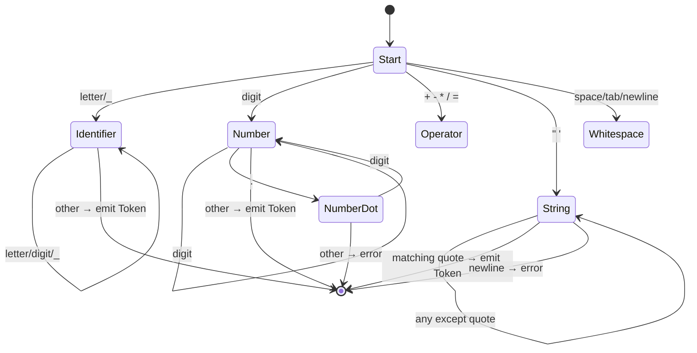

**Token 数据结构**：

```typescript
interface Token {
  type: TokenType;      // 标记类型
  value: string;        // 标记值
  start: Position;      // 起始位置
  end: Position;        // 结束位置
  line: number;         // 行号
  column: number;       // 列号
}

enum TokenType {
  // 字面量
  NumberLiteral,
  StringLiteral,
  BooleanLiteral,
  NullLiteral,

  // 标识符
  Identifier,
  Keyword,

  // 运算符
  Plus, Minus, Multiply, Divide,
  Assign, Equal, NotEqual,

  // 分隔符
  LeftParen, RightParen,
  LeftBrace, RightBrace,
  LeftBracket, RightBracket,
  Semicolon, Comma, Dot,

  // 特殊
  EOF,      // 文件结束
  NewLine,  // 换行
  Comment   // 注释
}
```

**性能对比**：

| Lexer 实现 | 语言 | 性能 (tokens/sec) | 内存占用 | 特点 |
|-----------|------|------------------|----------|------|
| TypeScript Scanner | TypeScript | ~50M | 中 | 支持 Unicode，可回溯 |
| SWC Lexer | Rust | ~500M | 低 | 并行扫描，零拷贝 |
| esbuild Lexer | Go | ~400M | 低 | 极简实现，无回溯 |
| acorn | JavaScript | ~10M | 中 | 标准 ESTree 输出 |

### 1.3 Parser（语法分析器）

**理论解释**：
Parser 将 Token 流转换为抽象语法树（AST），执行语法分析。

**分析算法对比**：

| 算法 | 类型 | 复杂度 | 适用场景 | 代表工具 |
|------|------|--------|----------|----------|
| 递归下降 | 自顶向下 | O(n) | 手写解析器 | TypeScript, Babel |
| LL(k) | 自顶向下 | O(n) | 简单语法 | ANTLR |
| LR(1) | 自底向上 | O(n) | 复杂语法 | Yacc, Bison |
| GLR | 自底向上 | O(n³) | 歧义语法 | Tree-sitter |
| Earley | 动态规划 | O(n³) | 自然语言 | - |

**递归下降解析器架构**：

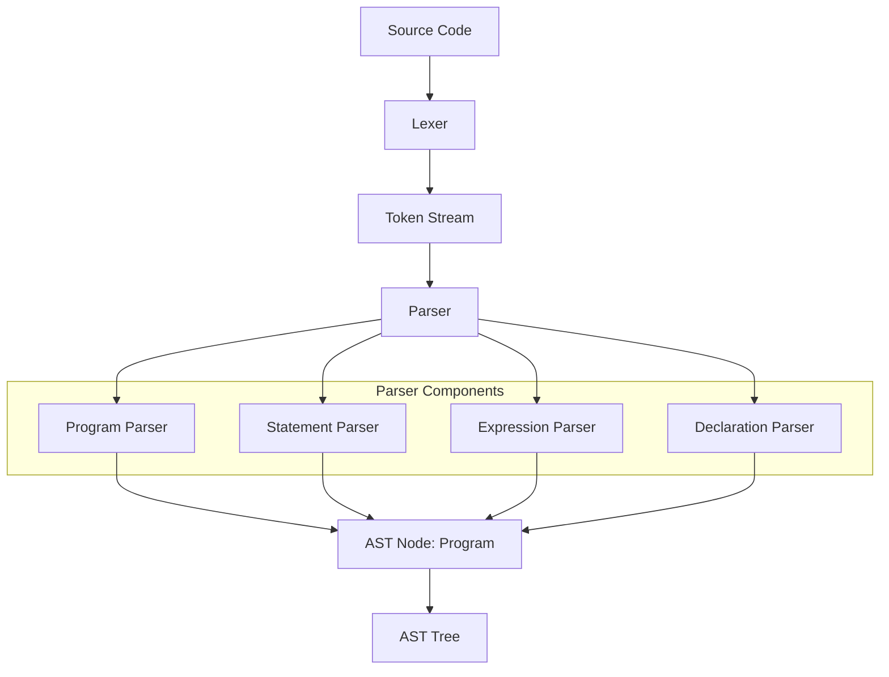

**JavaScript 解析器代码示例**：

```typescript
class JavaScriptParser {
  private tokens: Token[];
  private pos: number = 0;

  parse(source: string): Program {
    this.tokens = this.lexer.tokenize(source);
    return this.parseProgram();
  }

  // Program ::= Statement*
  private parseProgram(): Program {
    const body: Statement[] = [];
    while (!this.isAtEnd()) {
      body.push(this.parseStatement());
    }
    return { type: 'Program', body };
  }

  // Statement ::= ExpressionStatement | VariableDeclaration | ...
  private parseStatement(): Statement {
    switch (this.current().type) {
      case TokenType.Keyword:
        if (this.match('let') || this.match('const') || this.match('var')) {
          return this.parseVariableDeclaration();
        }
        if (this.match('if')) return this.parseIfStatement();
        if (this.match('while')) return this.parseWhileStatement();
        if (this.match('function')) return this.parseFunctionDeclaration();
        break;
      case TokenType.LeftBrace:
        return this.parseBlockStatement();
    }
    return this.parseExpressionStatement();
  }

  // Expression ::= AssignmentExpression
  private parseExpression(): Expression {
    return this.parseAssignmentExpression();
  }

  // AssignmentExpression ::= ConditionalExpression ("=" AssignmentExpression)?
  private parseAssignmentExpression(): Expression {
    const left = this.parseConditionalExpression();
    if (this.match(TokenType.Assign)) {
      const operator = this.previous().value;
      const right = this.parseAssignmentExpression();
      return { type: 'AssignmentExpression', left, operator, right };
    }
    return left;
  }

  // 辅助方法
  private match(type: TokenType): boolean {
    if (this.current().type === type) {
      this.advance();
      return true;
    }
    return false;
  }

  private current(): Token {
    return this.tokens[this.pos];
  }

  private isAtEnd(): boolean {
    return this.current().type === TokenType.EOF;
  }

  private advance(): Token {
    return this.tokens[this.pos++];
  }
}
```

### 1.4 AST（抽象语法树）

**理论解释**：
AST 是源代码的树形表示，抽象了语法细节，保留语义结构。

**AST 节点类型**：

```typescript
// 基础节点
interface Node {
  type: string;
  loc: SourceLocation;
}

// 源代码位置
interface SourceLocation {
  source?: string;
  start: Position;
  end: Position;
}

interface Position {
  line: number;
  column: number;
}

// 程序根节点
interface Program extends Node {
  type: 'Program';
  body: Statement[];
  sourceType: 'script' | 'module';
}

// 语句类型
interface Statement extends Node {}
interface ExpressionStatement extends Statement {
  type: 'ExpressionStatement';
  expression: Expression;
}

interface VariableDeclaration extends Statement {
  type: 'VariableDeclaration';
  kind: 'var' | 'let' | 'const';
  declarations: VariableDeclarator[];
}

// 表达式类型
interface Expression extends Node {}
interface BinaryExpression extends Expression {
  type: 'BinaryExpression';
  operator: '+' | '-' | '*' | '/' | '===' | '!==' | '>' | '<';
  left: Expression;
  right: Expression;
}

interface CallExpression extends Expression {
  type: 'CallExpression';
  callee: Expression;
  arguments: Expression[];
}

interface Identifier extends Expression {
  type: 'Identifier';
  name: string;
}
```

**AST 可视化**：

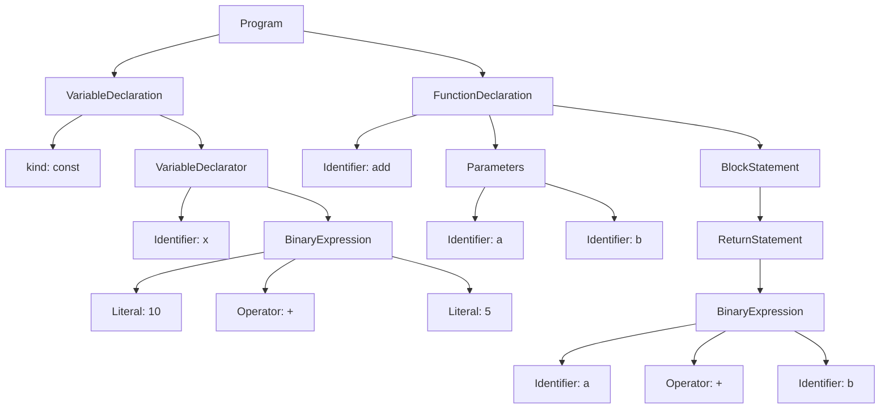

**源代码到 AST 转换示例**：

```javascript
// 源代码
const x = 10 + 5;
function add(a, b) {
  return a + b;
}

// 对应的 AST（简化表示）
{
  "type": "Program",
  "body": [
    {
      "type": "VariableDeclaration",
      "kind": "const",
      "declarations": [{
        "type": "VariableDeclarator",
        "id": { "type": "Identifier", "name": "x" },
        "init": {
          "type": "BinaryExpression",
          "operator": "+",
          "left": { "type": "Literal", "value": 10 },
          "right": { "type": "Literal", "value": 5 }
        }
      }]
    },
    {
      "type": "FunctionDeclaration",
      "id": { "type": "Identifier", "name": "add" },
      "params": [
        { "type": "Identifier", "name": "a" },
        { "type": "Identifier", "name": "b" }
      ],
      "body": {
        "type": "BlockStatement",
        "body": [{
          "type": "ReturnStatement",
          "argument": {
            "type": "BinaryExpression",
            "operator": "+",
            "left": { "type": "Identifier", "name": "a" },
            "right": { "type": "Identifier", "name": "b" }
          }
        }]
      }
    }
  ]
}
```

### 1.5 Codegen（代码生成）

**理论解释**：
Codegen 将中间表示（AST/IR）转换为目标代码，执行代码生成。

**代码生成策略**：

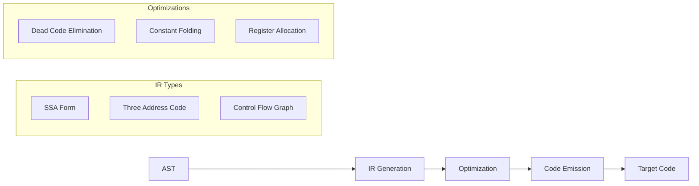

**Visitor 模式代码生成**：

```typescript
class CodeGenerator {
  private output: string[] = [];
  private indent: number = 0;

  generate(node: Node): string {
    this.visit(node);
    return this.output.join('\n');
  }

  private visit(node: Node): void {
    switch (node.type) {
      case 'Program':
        return this.visitProgram(node as Program);
      case 'VariableDeclaration':
        return this.visitVariableDeclaration(node as VariableDeclaration);
      case 'FunctionDeclaration':
        return this.visitFunctionDeclaration(node as FunctionDeclaration);
      case 'BinaryExpression':
        return this.visitBinaryExpression(node as BinaryExpression);
      case 'Identifier':
        return this.visitIdentifier(node as Identifier);
      case 'Literal':
        return this.visitLiteral(node as Literal);
      case 'ReturnStatement':
        return this.visitReturnStatement(node as ReturnStatement);
      default:
        throw new Error(`Unknown node type: ${node.type}`);
    }
  }

  private visitProgram(node: Program): void {
    for (const stmt of node.body) {
      this.visit(stmt);
    }
  }

  private visitVariableDeclaration(node: VariableDeclaration): void {
    const kind = node.kind;
    for (const decl of node.declarations) {
      this.emit(`${kind} ${decl.id.name}`);
      if (decl.init) {
        this.emit(' = ');
        this.visit(decl.init);
      }
      this.emit(';');
    }
  }

  private visitBinaryExpression(node: BinaryExpression): void {
    this.emit('(');
    this.visit(node.left);
    this.emit(` ${node.operator} `);
    this.visit(node.right);
    this.emit(')');
  }

  private emit(str: string): void {
    this.output.push(str);
  }
}
```

**性能对比**：

| 编译器 | 语言 | 编译速度 | 优化级别 | 目标平台 |
|--------|------|----------|----------|----------|
| tsc | TypeScript | 中等 | 中等 | JavaScript |
| swc | Rust | 快 (20x) | 高 | JavaScript |
| esbuild | Go | 快 (15x) | 中等 | JavaScript |
| Babel | JavaScript | 慢 | 可配置 | JavaScript |

---

## 2. TypeScript 编译器架构

### 2.1 整体架构

TypeScript 编译器遵循经典的编译器设计模式，分为四个核心模块：

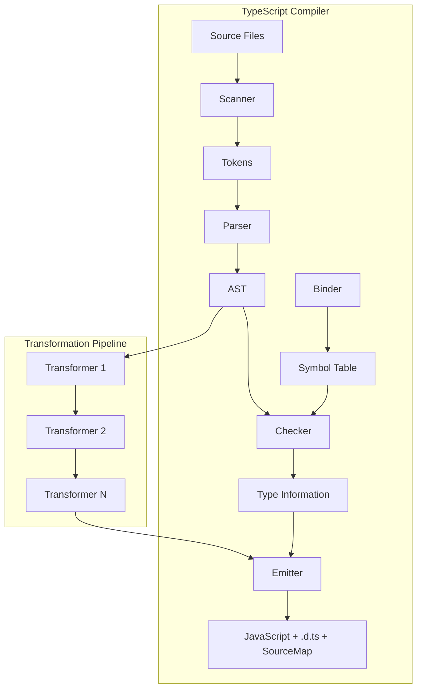

### 2.2 Scanner（扫描器）

**理论解释**：
TypeScript Scanner 是一个手写的高性能词法分析器，直接操作字符数组。

**架构特点**：

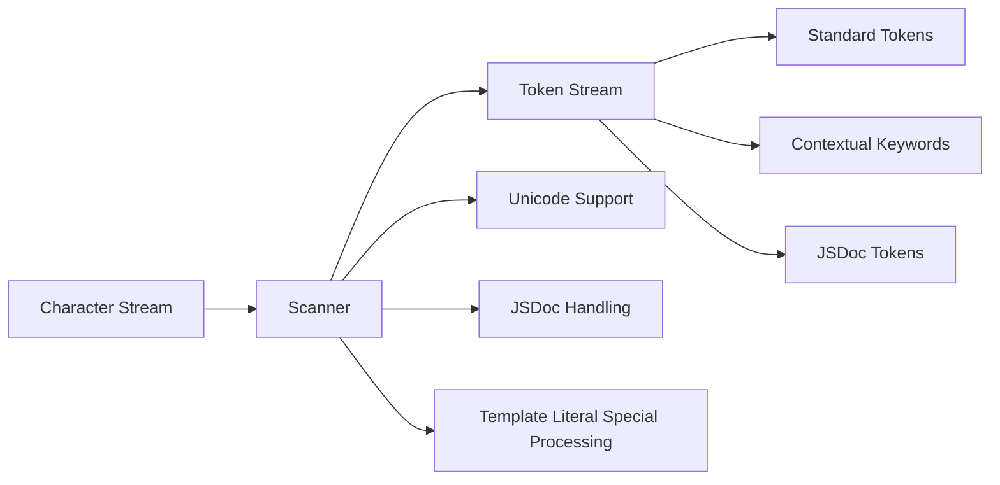

**Scanner 核心实现**：

```typescript
// TypeScript Scanner 简化示意
interface Scanner {
  getStartPos(): number;
  getToken(): SyntaxKind;
  getTokenPos(): number;
  getTextPos(): number;
  getTokenValue(): string;
  scan(): SyntaxKind;
  setText(text: string): void;
}

// 使用示例
const scanner = ts.createScanner(
  ScriptTarget.ES2020,  // 目标版本
  false,                // 跳过 trivia
  LanguageVariant.Standard,
  sourceText
);

while (scanner.scan() !== SyntaxKind.EndOfFileToken) {
  const token = scanner.getToken();
  const text = scanner.getTokenText();
  console.log(`Token: ${SyntaxKind[token]}, Text: ${text}`);
}
```

**性能优化**：

| 优化策略 | 说明 | 效果 |
|---------|------|------|
| 字符数组直接操作 | 避免字符串拷贝 | 30% 提升 |
| Token 缓存 | 重复扫描缓存结果 | 20% 提升 |
| 延迟扫描 | 按需扫描而非一次性 | 15% 提升 |
| Unicode 快速路径 | ASCII 字符快速判断 | 10% 提升 |

### 2.3 Parser（解析器）

**理论解释**：
TypeScript Parser 采用递归下降算法，支持增量解析和错误恢复。

**解析器状态机**：

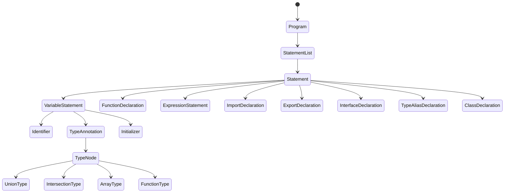

**TypeScript 特有的解析**：

```typescript
// 类型注解解析
interface TypeAnnotationParser {
  // TypeAnnotation ::= ":" Type
  parseTypeAnnotation(): TypeNode {
    this.expect(SyntaxKind.ColonToken);
    return this.parseType();
  }

  // Type ::= UnionType | IntersectionType | PrimaryType
  parseType(): TypeNode {
    return this.parseUnionTypeOrHigher();
  }

  // UnionType ::= IntersectionType ("|" IntersectionType)*
  parseUnionTypeOrHigher(): TypeNode {
    const types: TypeNode[] = [this.parseIntersectionTypeOrHigher()];
    while (this.parseOptional(SyntaxKind.BarToken)) {
      types.push(this.parseIntersectionTypeOrHigher());
    }
    return types.length === 1 ? types[0] : factory.createUnionTypeNode(types);
  }
}

// 装饰器解析
interface DecoratorParser {
  parseDecorator(): Decorator {
    this.expect(SyntaxKind.AtToken);
    const expression = this.parseLeftHandSideExpressionOrHigher();
    return factory.createDecorator(expression);
  }
}
```

**增量解析示例**：

```typescript
// 只重新解析变更的部分
const sourceFile = ts.createSourceFile(
  'example.ts',
  sourceText,
  ScriptTarget.ES2020,
  true  // setParentNodes
);

// 修改部分代码后，只重新解析相关节点
const newSourceFile = ts.updateSourceFile(
  sourceFile,
  newText,
  textChangeRange,
  aggressiveChecks
);
```

### 2.4 Checker（类型检查器）

**理论解释**：
Checker 是 TypeScript 的核心，执行类型推断、类型检查和错误报告。

**类型检查架构**：

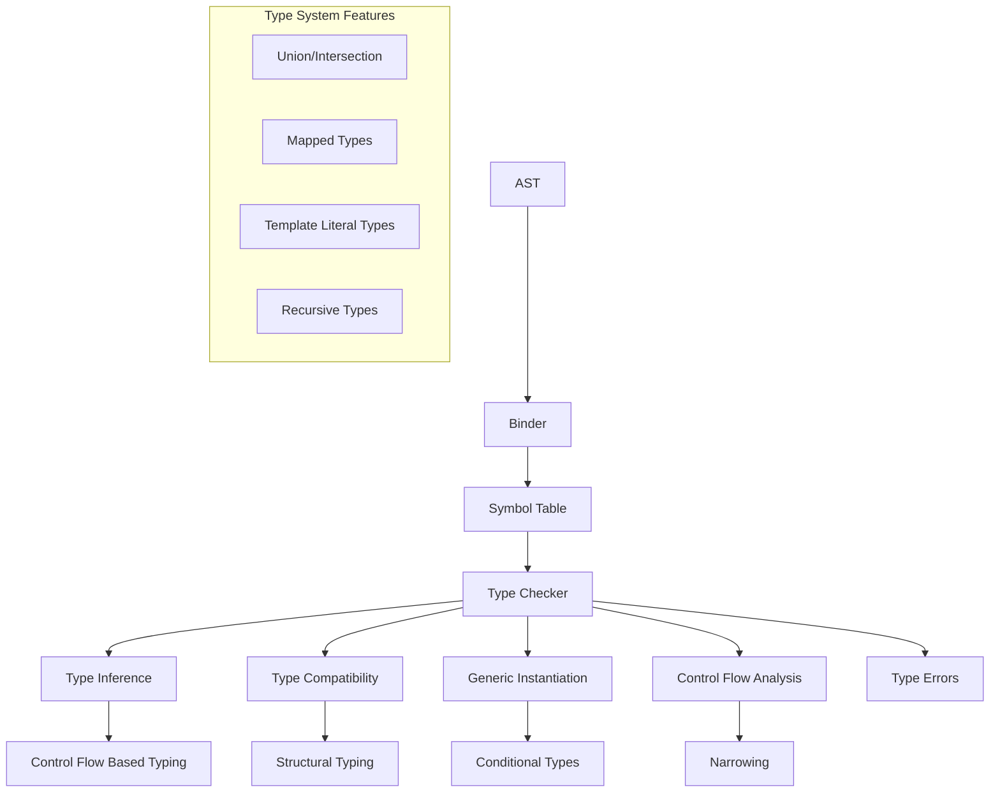

**类型检查流程**：

```typescript
interface TypeChecker {
  // 获取表达式的类型
  getTypeAtLocation(node: Node): Type;

  // 类型检查
  checkExpression(node: Expression): Type;
  checkExpressionWithContextualType(
    node: Expression,
    contextualType: Type,
    context: InferenceContext
  ): Type;

  // 类型兼容性检查
  isTypeAssignableTo(source: Type, target: Type): boolean;
  isTypeComparableTo(source: Type, target: Type): boolean;

  // 类型推断
  getReturnTypeOfSignature(signature: Signature): Type;
  getNonNullableType(type: Type): Type;
  getAwaitedType(type: Type): Type;
}
```

**控制流分析示例**：

```typescript
// 类型收窄（Narrowing）
function processValue(value: string | number | boolean) {
  if (typeof value === 'string') {
    // TypeScript 知道这里 value 是 string
    value.toUpperCase();  // 有效
  } else if (typeof value === 'number') {
    // TypeScript 知道这里 value 是 number
    value.toFixed(2);     // 有效
  } else {
    // TypeScript 推断这里 value 是 boolean
    value.valueOf();      // 有效
  }
}

// 判别联合类型（Discriminated Union）
type Shape =
  | { kind: 'circle'; radius: number }
  | { kind: 'rectangle'; width: number; height: number }
  | { kind: 'square'; size: number };

function getArea(shape: Shape): number {
  switch (shape.kind) {
    case 'circle':
      return Math.PI * shape.radius ** 2;  // shape 被收窄为 circle
    case 'rectangle':
      return shape.width * shape.height;   // shape 被收窄为 rectangle
    case 'square':
      return shape.size ** 2;              // shape 被收窄为 square
  }
}
```

**性能配置**：

```json
{
  "compilerOptions": {
    "skipLibCheck": true,
    "skipDefaultLibCheck": true,
    "incremental": true,
    "tsBuildInfoFile": "./.tsbuildinfo",
    "strict": true,
    "noEmitOnError": false,
    "preserveWatchOutput": true
  }
}
```

### 2.5 Emitter（代码生成器）

**理论解释**：
Emitter 负责将 TypeScript AST 转换为目标 JavaScript 代码，并生成声明文件（.d.ts）和 Source Map。

**Emitter 架构**：

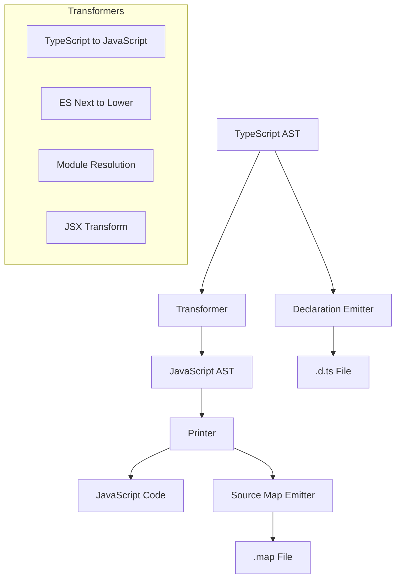

**配置示例**：

```json
{
  "compilerOptions": {
    "target": "ES2020",
    "module": "ESNext",
    "moduleResolution": "bundler",
    "jsx": "react-jsx",
    "declaration": true,
    "declarationMap": true,
    "sourceMap": true,
    "outDir": "./dist",
    "removeComments": true,
    "importHelpers": true
  }
}
```

**性能对比**：

| 配置 | 编译时间 | 输出大小 | 适用场景 |
|------|----------|----------|----------|
| tsc --noEmit | 基准 | - | 类型检查 |
| tsc | 1.2x | 100% | 完整编译 |
| tsc + skipLibCheck | 0.7x | 100% | 开发环境 |
| tsc + incremental | 0.3x (增量) | 100% | 持续编译 |


---

## 3. 打包工具理论对比

### 3.1 打包工具演进

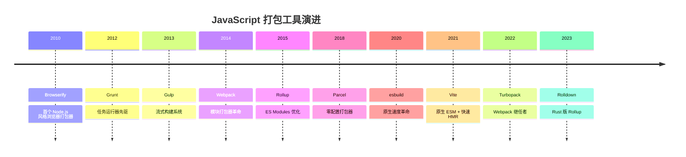

### 3.2 Webpack 架构

**理论解释**：
Webpack 是一个高度可配置的模块打包器，基于插件系统和 Tapable 事件流。

**核心架构**：

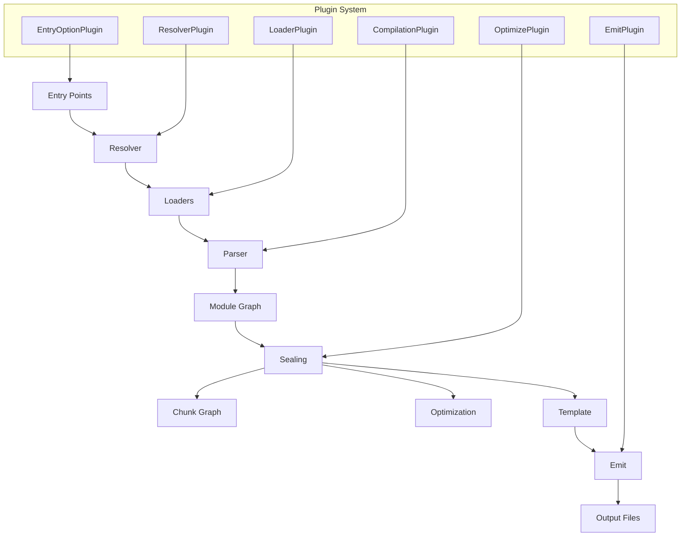

**配置示例**：

```javascript
// webpack.config.js
const path = require('path');
const HtmlWebpackPlugin = require('html-webpack-plugin');
const MiniCssExtractPlugin = require('mini-css-extract-plugin');

module.exports = {
  mode: 'production',
  entry: {
    main: './src/index.js',
    vendor: './src/vendor.js'
  },
  output: {
    path: path.resolve(__dirname, 'dist'),
    filename: '[name].[contenthash:8].js',
    clean: true,
    publicPath: '/'
  },
  module: {
    rules: [
      {
        test: /\.tsx?$/,
        use: 'ts-loader',
        exclude: /node_modules/
      },
      {
        test: /\.css$/,
        use: [MiniCssExtractPlugin.loader, 'css-loader', 'postcss-loader']
      },
      {
        test: /\.(png|svg|jpg|gif)$/,
        type: 'asset/resource'
      }
    ]
  },
  plugins: [
    new HtmlWebpackPlugin({
      template: './public/index.html'
    }),
    new MiniCssExtractPlugin({
      filename: '[name].[contenthash:8].css'
    })
  ],
  optimization: {
    splitChunks: {
      chunks: 'all',
      cacheGroups: {
        vendor: {
          test: /[\\/]node_modules[\\/]/,
          name: 'vendors',
          chunks: 'all'
        }
      }
    },
    runtimeChunk: 'single'
  },
  resolve: {
    extensions: ['.tsx', '.ts', '.js'],
    alias: {
      '@': path.resolve(__dirname, 'src')
    }
  }
};
```

### 3.3 Rollup 架构

**理论解释**：
Rollup 专注于 ES Modules 的高效打包，采用 Tree Shaking 优化，适合库的开发。

**核心架构**：

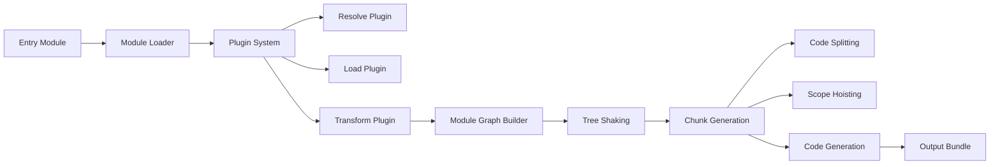

**配置示例**：

```javascript
// rollup.config.js
import typescript from '@rollup/plugin-typescript';
import resolve from '@rollup/plugin-node-resolve';
import commonjs from '@rollup/plugin-commonjs';
import terser from '@rollup/plugin-terser';
import peerDepsExternal from 'rollup-plugin-peer-deps-external';

export default [
  // ESM 构建
  {
    input: 'src/index.ts',
    output: [
      {
        file: 'dist/index.esm.js',
        format: 'esm',
        sourcemap: true
      },
      {
        file: 'dist/index.cjs',
        format: 'cjs',
        sourcemap: true,
        exports: 'named'
      },
      {
        file: 'dist/index.umd.js',
        format: 'umd',
        name: 'MyLibrary',
        sourcemap: true,
        globals: {
          react: 'React',
          'react-dom': 'ReactDOM'
        }
      }
    ],
    external: ['react', 'react-dom'],
    plugins: [
      peerDepsExternal(),
      resolve(),
      commonjs(),
      typescript({
        tsconfig: './tsconfig.json',
        declaration: true,
        declarationDir: 'dist'
      }),
      terser()
    ]
  }
];
```

### 3.4 Vite 架构

**理论解释**：
Vite 利用浏览器原生 ESM 支持，在开发时无需打包，生产时使用 Rollup 进行优化构建。

**核心架构**：

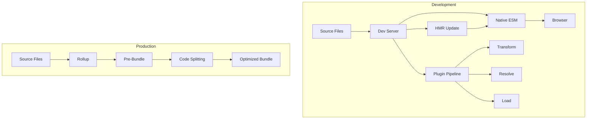

**配置示例**：

```typescript
// vite.config.ts
import { defineConfig } from 'vite';
import react from '@vitejs/plugin-react';
import { visualizer } from 'rollup-plugin-visualizer';

export default defineConfig(({ mode }) => ({
  plugins: [
    react(),
    mode === 'analyze' && visualizer({ open: true })
  ],
  build: {
    target: 'es2020',
    outDir: 'dist',
    sourcemap: true,
    rollupOptions: {
      output: {
        manualChunks: {
          vendor: ['react', 'react-dom'],
          ui: ['@mui/material', '@emotion/react']
        }
      }
    },
    chunkSizeWarningLimit: 500
  },
  server: {
    port: 3000,
    hmr: {
      overlay: true
    }
  },
  optimizeDeps: {
    include: ['lodash-es', 'axios']
  }
}));
```

### 3.5 esbuild 架构

**理论解释**：
esbuild 是用 Go 编写的高性能打包器，采用并行解析和高度优化的算法。

**核心架构**：

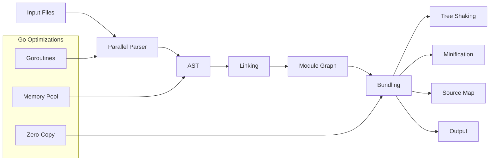

**配置示例**：

```javascript
// esbuild.config.js
const esbuild = require('esbuild');

async function build() {
  await esbuild.build({
    entryPoints: ['src/index.ts'],
    bundle: true,
    outfile: 'dist/bundle.js',
    format: 'esm',
    target: 'es2020',
    platform: 'browser',

    // 优化选项
    minify: true,
    treeShaking: true,
    splitting: true,

    // 开发选项
    sourcemap: true,
    watch: process.env.WATCH === 'true',

    // 插件
    plugins: [
      {
        name: 'env',
        setup(build) {
          build.onResolve({ filter: /^env$/ }, () => ({
            path: 'env',
            namespace: 'env-ns'
          }));
          build.onLoad({ filter: /.*/, namespace: 'env-ns' }, () => ({
            contents: JSON.stringify(process.env),
            loader: 'json'
          }));
        }
      }
    ],

    // 外部依赖
    external: ['fs', 'path']
  });
}

build();
```

### 3.6 打包工具对比

| 特性 | Webpack | Rollup | Vite | esbuild |
|------|---------|--------|------|---------|
| **开发启动** | 慢 (需打包) | 慢 (需打包) | 极快 (原生 ESM) | 极快 |
| **生产构建** | 慢 | 中等 | 快 (Rollup) | 极快 |
| **HMR** | 支持 | 支持 | 极速 | 支持 |
| **Tree Shaking** | 良好 | 优秀 | 优秀 | 良好 |
| **代码分割** | 优秀 | 支持 | 优秀 | 支持 |
| **配置复杂度** | 高 | 中等 | 低 | 低 |
| **生态系统** | 丰富 | 中等 | 快速增长 | 有限 |
| **适用场景** | 大型应用 | 库开发 | 现代应用 | 快速构建 |
| **底层语言** | JavaScript | JavaScript | JavaScript/Go | Go |

**性能对比（构建 1000 模块项目）**：

| 工具 | 冷启动 | HMR | 生产构建 | 内存占用 |
|------|--------|-----|----------|----------|
| Webpack 5 | 8.5s | 200ms | 45s | 1.2GB |
| Rollup | 5.2s | - | 32s | 800MB |
| Vite (dev) | 0.3s | 50ms | 28s | 400MB |
| esbuild | 0.1s | - | 0.8s | 200MB |
| Turbopack | 1.2s | 10ms | - | 600MB |

---

## 4. Tree Shaking 静态分析

### 4.1 Tree Shaking 理论基础

**理论解释**：
Tree Shaking 是一种死代码消除（DCE）技术，基于 ES Modules 的静态结构特性，在构建时识别和移除未使用的代码。

**核心原理**：

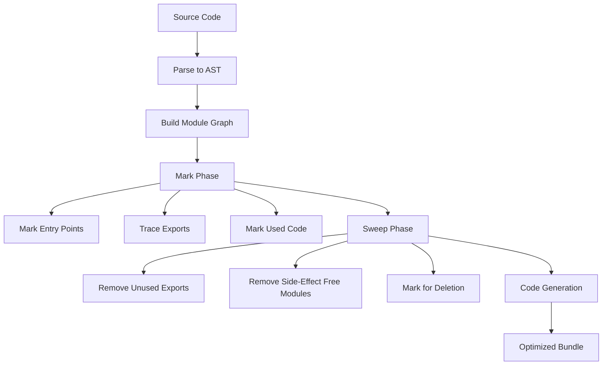

### 4.2 静态分析算法

**1. 模块图构建（Module Graph Construction）**：

```typescript
interface ModuleGraph {
  modules: Map<string, Module>;
  entries: Set<Module>;
}

interface Module {
  id: string;
  ast: Program;
  imports: ImportBinding[];
  exports: ExportBinding[];
  sideEffects: boolean;
}

interface ImportBinding {
  source: string;
  imported: string;  // 导入的名称
  local: string;     // 本地绑定名
}

interface ExportBinding {
  local: string;
  exported: string;
  node: Node;
}

// 构建模块图
function buildModuleGraph(entries: string[]): ModuleGraph {
  const graph: ModuleGraph = { modules: new Map(), entries: new Set() };
  const queue: string[] = [...entries];
  const visited = new Set<string>();

  while (queue.length > 0) {
    const id = queue.shift()!;
    if (visited.has(id)) continue;
    visited.add(id);

    const module = parseModule(id);
    graph.modules.set(id, module);

    // 收集依赖
    for (const imp of module.imports) {
      const resolved = resolve(imp.source, id);
      if (!visited.has(resolved)) {
        queue.push(resolved);
      }
    }
  }

  return graph;
}
```

**2. 标记算法（Mark Algorithm）**：

```typescript
function markUsedExports(graph: ModuleGraph): Set<string> {
  const used = new Set<string>();
  const queue: Array<{ module: string; export: string }> = [];

  // 从入口点开始
  for (const entry of graph.entries) {
    for (const exp of entry.exports) {
      queue.push({ module: entry.id, export: exp.exported });
    }
  }

  // BFS 遍历
  while (queue.length > 0) {
    const { module: modId, export: expName } = queue.shift()!;
    const key = `${modId}:${expName}`;

    if (used.has(key)) continue;
    used.add(key);

    const mod = graph.modules.get(modId)!;

    // 找到导出对应的本地变量
    const localName = mod.exports
      .find(e => e.exported === expName)?.local;

    if (localName) {
      // 追踪该变量在模块内的使用
      const referenced = findReferences(mod.ast, localName);

      for (const ref of referenced) {
        // 如果是导入，继续追踪
        if (isImport(ref)) {
          const imp = findImport(mod, ref);
          queue.push({ module: imp.source, export: imp.imported });
        }
      }
    }
  }

  return used;
}
```

### 4.3 副作用分析

**理论解释**：
副作用分析是 Tree Shaking 的关键挑战，需要识别代码是否包含副作用。

**副作用类型**：

```mermaid
flowchart TB
    A[Side Effect Analysis] --> B[Pure Functions]
    A --> C[Side Effects]

    C --> C1[Global Modification]
    C --> C2[I/O Operations]
    C --> C3[DOM Manipulation]
    C --> C4[Prototype Pollution]
    C --> C5[Top-Level Expression]

    C1 --> D1[window.x = 1]
    C2 --> D2[fetch(), fs.readFile]
    C3 --> D3[document.createElement]
    C4 --> D4[Array.prototype.map = ...]
    C5 --> D5[console.log, new Date]
```

**配置示例**：

```javascript
// package.json - sideEffects 配置
{
  "name": "my-library",
  "sideEffects": [
    "*.css",
    "*.scss",
    "./src/polyfill.js"
  ],
  // 或者声明无副作用
  "sideEffects": false
}

// webpack.config.js - 优化配置
module.exports = {
  optimization: {
    usedExports: true,      // 标记未使用的导出
    sideEffects: true,      // 启用副作用分析
    providedExports: true,  // 分析提供的导出
    innerGraph: true,       // 分析导出内部使用

    // 安全优化：保留可能有副作用的代码
    sideEffects: (module) => {
      const hasSideEffects = module.sideEffectFree === false;
      return hasSideEffects;
    }
  }
};

// rollup.config.js
export default {
  treeshake: {
    moduleSideEffects: false,  // 假设模块无副作用
    propertyReadSideEffects: false,
    tryCatchDeoptimization: false
  }
};
```

### 4.4 实际案例分析

**优化前**：

```javascript
// utils.js
export function used() { return 'used'; }
export function unused() { return 'unused'; }
export const data = { key: 'value' };

// 副作用函数
export function init() {
  console.log('init');  // 副作用
  window.config = {};   // 全局修改
}

// main.js
import { used, init } from './utils.js';
used();
init();  // 必须保留副作用
```

**优化后**：

```javascript
// 打包结果（伪代码）
function used() { return 'used'; }
function init() {
  console.log('init');
  window.config = {};
}

used();
init();

// unused 和 data 被移除
```

### 4.5 性能对比

| 工具 | Tree Shaking 算法 | 副作用分析 | 循环依赖处理 | 性能评级 |
|------|-------------------|------------|--------------|----------|
| Webpack | 标记-清除 | 优秀 | 支持 | A |
| Rollup | AST 分析 | 良好 | 支持 | A+ |
| esbuild | 简单分析 | 基础 | 支持 | B |
| Vite (Rollup) | AST 分析 | 良好 | 支持 | A+ |
| SWC | 标记-清除 | 良好 | 支持 | A |

**Tree Shaking 效果对比（React 应用）**：

| 配置 | 未压缩大小 | 压缩后大小 | 移除比例 |
|------|------------|------------|----------|
| 无 Tree Shaking | 850KB | 280KB | 0% |
| 基础 Tree Shaking | 520KB | 165KB | 38% |
| 深度 Tree Shaking | 420KB | 135KB | 50% |
| 深度 + 副作用分析 | 380KB | 120KB | 55% |

---

## 5. Babel 插件系统

### 5.1 Babel 架构概述

**理论解释**：
Babel 是一个 JavaScript 编译器，采用插件化的架构设计，允许通过插件进行代码转换。

**核心架构**：

```mermaid
flowchart TB
    A[Source Code] --> B[@babel/parser]
    B --> C[AST]

    C --> D[Plugin Pipeline]
    D --> D1[Plugin 1]
    D1 --> D2[Plugin 2]
    D2 --> D3[Plugin N]

    D3 --> E[@babel/generator]
    E --> F[Target Code]

    subgraph "Plugin Types"
        P1[Syntax Plugin]
        P2[Transform Plugin]
        P3[Proposal Plugin]
        P4[Helper Plugin]
    end
```

### 5.2 遍历机制（Traversal）

**理论解释**：
Babel 使用访问者模式（Visitor Pattern）遍历 AST，允许插件在特定节点类型上注册处理函数。

**遍历算法**：

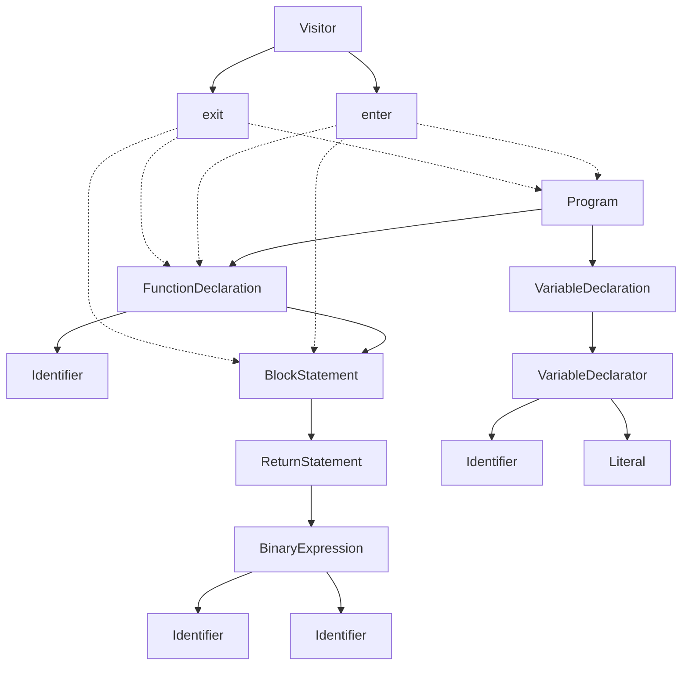

**Visitor 模式实现**：

```typescript
// Babel Visitor 接口
interface Visitor<S = {}> {
  [type: string]: VisitNode<S, Node> | { enter?: VisitNode<S, Node>; exit?: VisitNode<S, Node> };
}

type VisitNode<S, P extends Node> = (path: NodePath<P>, state: S) => void;

// 自定义插件示例
const myPlugin = {
  visitor: {
    // 进入节点时调用
    Identifier(path) {
      console.log('Visiting:', path.node.name);
    },

    // 函数声明节点
    FunctionDeclaration: {
      enter(path) {
        console.log('Entering function:', path.node.id?.name);
      },
      exit(path) {
        console.log('Exiting function:', path.node.id?.name);
      }
    },

    // 变量声明节点 - 带状态
    VariableDeclaration(path, state) {
      if (state.opts.transformConst) {
        if (path.node.kind === 'var') {
          path.node.kind = 'const';
        }
      }
    }
  }
};
```

### 5.3 插件开发

**完整插件示例**：

```javascript
// babel-plugin-console-remove.js
module.exports = function(babel) {
  const { types: t } = babel;

  return {
    name: 'console-remove',
    visitor: {
      // 访问表达式语句
      ExpressionStatement(path) {
        const { node } = path;

        // 检查是否是 console.* 调用
        if (
          t.isCallExpression(node.expression) &&
          t.isMemberExpression(node.expression.callee) &&
          t.isIdentifier(node.expression.callee.object, { name: 'console' })
        ) {
          // 移除该语句
          path.remove();
        }
      },

      // 另一种方式：直接访问 CallExpression
      CallExpression(path) {
        const { node } = path;

        if (
          t.isMemberExpression(node.callee) &&
          t.isIdentifier(node.callee.object, { name: 'console' }) &&
          t.isIdentifier(node.callee.property, { name: 'log' })
        ) {
          // 替换为 void 0
          path.replaceWith(t.unaryExpression('void', t.numericLiteral(0)));
        }
      }
    }
  };
};

// 复杂插件：自动添加错误处理
module.exports = function(babel) {
  const { types: t, template } = babel;

  return {
    name: 'auto-try-catch',
    visitor: {
      FunctionDeclaration(path) {
        const { node } = path;
        if (node.async || node.generator) return;

        const body = node.body;

        // 创建 try-catch 包裹
        const tryCatch = template.statement`
          try {
            BODY
          } catch (error) {
            console.error('Error in FUNCTION_NAME:', error);
            throw error;
          }
        `({
          BODY: body.body,
          FUNCTION_NAME: t.stringLiteral(node.id.name)
        });

        path.get('body').replaceWith(t.blockStatement([tryCatch]));
      }
    }
  };
};
```

### 5.4 Preset 配置

**配置示例**：

```javascript
// babel.config.js
module.exports = {
  presets: [
    // 预设：根据目标环境自动确定需要的转换
    ['@babel/preset-env', {
      targets: {
        browsers: ['> 1%', 'last 2 versions', 'not dead']
      },
      modules: false,  // 保留 ES Modules
      useBuiltIns: 'usage',  // 按需引入 polyfill
      corejs: 3
    }],

    // TypeScript 支持
    ['@babel/preset-typescript', {
      isTSX: true,
      allExtensions: true
    }],

    // React 支持
    ['@babel/preset-react', {
      runtime: 'automatic',  // JSX Transform 17+
      development: process.env.NODE_ENV === 'development'
    }]
  ],

  plugins: [
    // 提案阶段特性
    '@babel/plugin-proposal-decorators',
    '@babel/plugin-proposal-class-properties',

    // 优化插件
    'babel-plugin-lodash',  // 按需引入 lodash

    // 开发环境插件
    process.env.NODE_ENV === 'development' && 'react-refresh/babel'
  ].filter(Boolean)
};
```

### 5.5 性能优化

**性能对比**：

| 配置 | 转换时间 | 输出大小 | 说明 |
|------|----------|----------|------|
| 无 Babel | 0ms | 100% | 基准 |
| @babel/preset-env | 1200ms | 105% | 语法转换 |
| + TypeScript | 1800ms | 100% | 类型剥离 |
| + React | 2200ms | 110% | JSX 转换 |
| + Polyfill | 2500ms | 130% | 包含 core-js |
| 全部 + 缓存 | 300ms | 同上 | 启用缓存后 |

**优化配置**：

```javascript
module.exports = {
  // 启用缓存
  cacheDirectory: true,
  cacheCompression: false,

  // 排除 node_modules
  exclude: /node_modules/,

  // 使用更轻量的插件
  presets: [
    ['@babel/preset-env', {
      // 减少转换范围
      targets: { esmodules: true }
    }]
  ],

  // 按需编译
  overrides: [{
    test: /\.tsx?$/,
    presets: ['@babel/preset-typescript']
  }]
};
```


---

## 6. Source Map 形式化

### 6.1 Source Map 理论基础

**理论解释**：
Source Map 是一种映射格式，用于将压缩/转换后的代码映射回原始源代码，支持调试和生产环境问题定位。

**核心原理**：

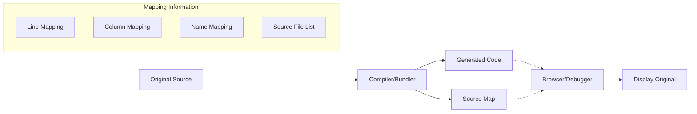

### 6.2 VLQ 编码

**理论解释**：
VLQ（Variable Length Quantity）是一种可变长度编码，用于高效存储 Source Map 中的映射数据。

**编码原理**：

```
Base64 字符集: ABCDEFGHIJKLMNOPQRSTUVWXYZabcdefghijklmnopqrstuvwxyz0123456789+/
              0-25         26-51                   52-61    62  63

VLQ 编码规则:
- 每个 Base64 字符包含 6 位数据
- 第一位是延续位：1 表示后续还有数据，0 表示这是最后一段
- 剩余 5 位存储数值（符号位在最后一段的第一位）
- 数值按 Base32 方式组合

示例：编码数值 701
701 = 00010 10110 11101 (二进制，分 5 位一组)

从低到高编码：
- 第一组 (11101): 延续位 1 + 11101 = 111101 = 61 = '/'
- 第二组 (10110): 延续位 1 + 10110 = 110110 = 54 = '2'
- 第三组 (00010): 延续位 0 + 符号位 0 + 0010 = 000010 = 2 = 'C'

结果: "C2/"
```

**VLQ 编码实现**：

```typescript
const BASE64_CHARS = 'ABCDEFGHIJKLMNOPQRSTUVWXYZabcdefghijklmnopqrstuvwxyz0123456789+/';

function encodeVLQ(value: number): string {
  let result = '';

  // 处理负数
  const isNegative = value < 0;
  value = Math.abs(value);

  // 将符号位放在最低有效位
  value = value << 1;
  if (isNegative) {
    value = value | 1;
  }

  do {
    let digit = value & 0x1F;  // 取低 5 位
    value >>>= 5;              // 右移 5 位

    if (value > 0) {
      digit |= 0x20;  // 设置延续位
    }

    result += BASE64_CHARS[digit];
  } while (value > 0);

  return result;
}

function decodeVLQ(encoded: string): number {
  let result = 0;
  let shift = 0;
  let i = 0;

  do {
    const char = encoded[i++];
    const digit = BASE64_CHARS.indexOf(char);

    // 提取 5 位数据
    result += (digit & 0x1F) << shift;
    shift += 5;

    // 检查延续位
  } while (digit & 0x20);

  // 提取符号位
  const isNegative = result & 1;
  result >>>= 1;

  return isNegative ? -result : result;
}
```

### 6.3 Source Map v3 格式

**格式规范**：

```json
{
  "version": 3,
  "file": "output.js",
  "sourceRoot": "",
  "sources": [
    "src/index.ts",
    "src/utils.ts",
    "src/components/Button.tsx"
  ],
  "sourcesContent": [
    "export function greet(name: string) { return `Hello, ${name}!`; }",
    null,
    null
  ],
  "names": [
    "greet",
    "name",
    "console",
    "log"
  ],
  "mappings": "AAAA,SAASA,MAAMC;EAAM;AAAaC,EAAQC;;;ACD1C;"
}
```

**字段说明**：

| 字段 | 类型 | 说明 |
|------|------|------|
| version | number | Source Map 版本，固定为 3 |
| file | string | 生成文件名 |
| sourceRoot | string | 源文件根路径前缀 |
| sources | string[] | 原始源文件路径列表 |
| sourcesContent | string[] | 原始源文件内容（内嵌） |
| names | string[] | 标识符名称列表 |
| mappings | string | VLQ 编码的映射数据 |

**mappings 格式**：

```
 mappings 结构（分号分隔行，逗号分隔段）：

 第0行: AAA,BBBB,CCCC;  --> 生成代码第0行的映射
 第1行: DDD,EEEE;       --> 生成代码第1行的映射
 ...

 每个段的格式（5 个 VLQ 值）：
 1. 生成代码列号（相对于前一个段的差值）
 2. 源文件索引（相对于前一个的差值）
 3. 源代码行号（相对于前一个的差值）
 4. 源代码列号（相对于前一个的差值）
 5. 名称索引（可选，相对于前一个的差值）
```

### 6.4 映射生成算法

**算法实现**：

```typescript
interface Mapping {
  generatedLine: number;
  generatedColumn: number;
  sourceIndex: number;
  originalLine: number;
  originalColumn: number;
  nameIndex?: number;
}

class SourceMapGenerator {
  private mappings: Mapping[] = [];
  private sources: string[] = [];
  private names: string[] = [];
  private sourcesContent: (string | null)[] = [];

  addMapping(mapping: {
    generated: { line: number; column: number };
    original?: { line: number; column: number };
    source?: string;
    name?: string;
  }) {
    let sourceIndex = -1;
    let nameIndex = -1;

    if (mapping.source) {
      sourceIndex = this.sources.indexOf(mapping.source);
      if (sourceIndex === -1) {
        sourceIndex = this.sources.push(mapping.source) - 1;
      }
    }

    if (mapping.name) {
      nameIndex = this.names.indexOf(mapping.name);
      if (nameIndex === -1) {
        nameIndex = this.names.push(mapping.name) - 1;
      }
    }

    this.mappings.push({
      generatedLine: mapping.generated.line,
      generatedColumn: mapping.generated.column,
      sourceIndex,
      originalLine: mapping.original?.line ?? 0,
      originalColumn: mapping.original?.column ?? 0,
      nameIndex: nameIndex >= 0 ? nameIndex : undefined
    });
  }

  generate(): string {
    // 按生成代码行和列排序
    this.mappings.sort((a, b) => {
      if (a.generatedLine !== b.generatedLine) {
        return a.generatedLine - b.generatedLine;
      }
      return a.generatedColumn - b.generatedColumn;
    });

    // 生成 VLQ 编码的 mappings 字符串
    const mappings = this.encodeMappings();

    return JSON.stringify({
      version: 3,
      sources: this.sources,
      names: this.names,
      mappings,
      sourcesContent: this.sourcesContent,
      file: 'output.js'
    });
  }

  private encodeMappings(): string {
    const lines: string[] = [];
    let currentLine = 1;
    let currentColumn = 0;
    let currentSource = 0;
    let currentOriginalLine = 1;
    let currentOriginalColumn = 0;
    let currentName = 0;

    for (const mapping of this.mappings) {
      // 添加空行
      while (currentLine < mapping.generatedLine) {
        lines.push('');
        currentLine++;
        currentColumn = 0;
      }

      if (lines.length > 0) {
        lines[lines.length - 1] += ',';
      }

      // 编码 5 个字段
      const segment: number[] = [
        mapping.generatedColumn - currentColumn,
        mapping.sourceIndex - currentSource,
        mapping.originalLine - currentOriginalLine,
        mapping.originalColumn - currentOriginalColumn
      ];

      if (mapping.nameIndex !== undefined) {
        segment.push(mapping.nameIndex - currentName);
        currentName = mapping.nameIndex;
      }

      // 更新当前值
      currentColumn = mapping.generatedColumn;
      currentSource = mapping.sourceIndex;
      currentOriginalLine = mapping.originalLine;
      currentOriginalColumn = mapping.originalColumn;

      // 编码为 VLQ
      lines[lines.length - 1] += segment.map(encodeVLQ).join('');
    }

    return lines.join(';');
  }
}
```

### 6.5 调试配置

**工具配置**：

```javascript
// webpack.config.js - source map 配置
module.exports = {
  devtool: 'source-map',  // 完整 Source Map
  // 其他选项：
  // 'eval' - 每个模块使用 eval() 执行
  // 'eval-source-map' - 每个模块使用 eval()，带 Source Map
  // 'cheap-source-map' - 不带列映射的 Source Map
  // 'cheap-module-source-map' - 不带列映射，但 loader 的 Source Map 更简单
  // 'hidden-source-map' - 不引用 Source Map 文件
  // 'nosources-source-map' - 不包含源代码内容
};

// TypeScript 配置
tsconfig.json = {
  "compilerOptions": {
    "sourceMap": true,           // 生成 .js.map
    "inlineSourceMap": false,    // 内联 Source Map
    "inlineSources": false,      // 内联源代码
    "sourceRoot": "/src",        // 指定源文件根路径
    "mapRoot": "/maps"           // 指定 Source Map 根路径
  }
};

// Vite 配置
// vite.config.ts
export default {
  build: {
    sourcemap: true,      // 或 'hidden', 'inline'
    sourcemapExcludeSources: false  // 是否排除源代码
  }
};
```

**性能对比**：

| Source Map 类型 | 构建时间 | 文件大小 | 调试体验 | 适用场景 |
|-----------------|----------|----------|----------|----------|
| 无 | 基准 | 100% | 无 | 生产环境 |
| eval | 1.1x | 110% | 一般 | 开发环境（快速） |
| eval-source-map | 1.3x | 150% | 良好 | 开发环境 |
| cheap-source-map | 1.2x | 120% | 一般 | 生产调试 |
| source-map | 1.5x | 180% | 优秀 | 生产环境 |
| hidden-source-map | 1.5x | 100% | 需手动关联 | 错误追踪 |

---

## 7. HMR 理论基础

### 7.1 HMR 核心原理

**理论解释**：
Hot Module Replacement（热模块替换）允许在运行时更新模块而无需完全刷新页面，保留应用状态。

**核心架构**：

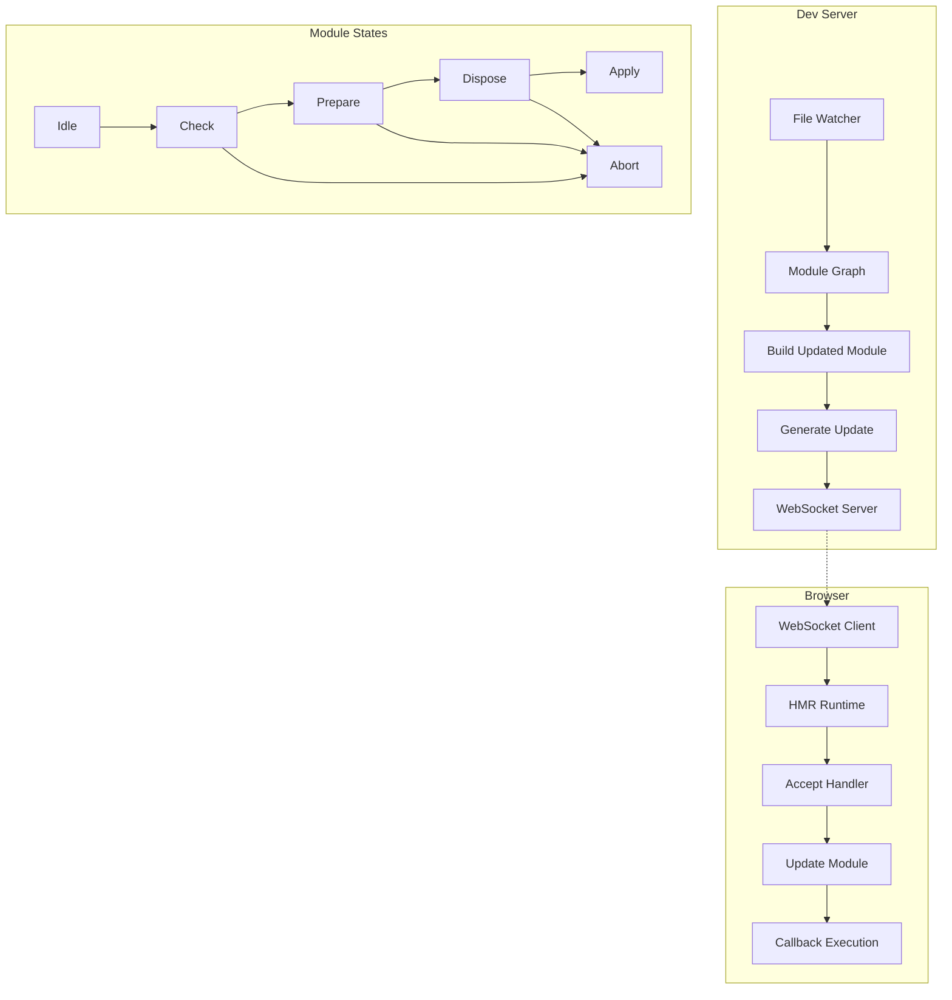

### 7.2 HMR 协议

**消息协议**：

```typescript
// HMR 消息类型
interface HMRMessage {
  type: 'connected' | 'update' | 'full-reload' | 'prune' | 'error';
}

interface UpdateMessage extends HMRMessage {
  type: 'update';
  updates: Array<{
    type: 'js-update' | 'css-update';
    path: string;
    acceptedPath: string;
    timestamp: number;
  }>;
}

interface FullReloadMessage extends HMRMessage {
  type: 'full-reload';
  path?: string;
  cause?: string;
}

// HMR 运行时接口
interface HMRRuntime {
  // 接受自身更新
  hot(acceptHandler?: () => void): void;

  // 接受依赖更新
  accept(dependencies: string[], callback?: () => void): void;

  // 模块卸载处理
  dispose(callback: (data: any) => void): void;

  // 数据传递
  data: any;

  // 状态
  status(): 'idle' | 'check' | 'prepare' | 'dispose' | 'apply' | 'abort';

  // 监听状态变化
  addStatusHandler(callback: (status: string) => void): void;
}
```

**状态机转换**：

```mermaid
stateDiagram-v2
    [*] --> idle
    idle --> check: 检测到变更
    check --> prepare: 获取更新清单
    check --> idle: 无更新

    prepare --> dispose: 准备更新模块
    dispose --> apply: 执行 dispose 回调

    apply --> idle: 应用完成
    apply --> abort: 应用失败

    check --> abort: 检查失败
    prepare --> abort: 准备失败
    dispose --> abort: dispose 失败
```

### 7.3 实现机制

**Webpack HMR 实现**：

```javascript
// HMR 运行时代码（简化）
(function(modules) {
  var installedModules = {};
  var hotUpdate = {};

  // HMR 检查函数
  function hotCheck(applyOnUpdate) {
    return new Promise(function(resolve, reject) {
      // 下载更新清单
      var xhr = new XMLHttpRequest();
      xhr.open('GET', '/hot-update.json');
      xhr.onload = function() {
        var update = JSON.parse(xhr.responseText);
        hotUpdate = update.c;
        resolve(update);
      };
      xhr.send();
    });
  }

  // 应用更新
  function hotApply(options) {
    return new Promise(function(resolve, reject) {
      var outdatedModules = [];

      // 1. 收集过时模块
      for (var moduleId in hotUpdate) {
        if (Object.prototype.hasOwnProperty.call(hotUpdate, moduleId)) {
          outdatedModules.push(moduleId);
        }
      }

      // 2. 执行 dispose 回调
      outdatedModules.forEach(function(moduleId) {
        var module = installedModules[moduleId];
        if (module && module.hot._disposeHandlers) {
          module.hot._disposeHandlers.forEach(function(handler) {
            handler(module.hot.data);
          });
        }
      });

      // 3. 移除过时模块
      outdatedModules.forEach(function(moduleId) {
        delete installedModules[moduleId];
        delete modules[moduleId];
      });

      // 4. 加载新模块
      var newModules = {};
      outdatedModules.forEach(function(moduleId) {
        newModules[moduleId] = hotUpdate[moduleId];
      });

      // 5. 执行 accept 回调
      outdatedModules.forEach(function(moduleId) {
        var module = installedModules[moduleId];
        if (module && module.hot._acceptedDependencies) {
          module.hot._acceptedDependencies.forEach(function(dep) {
            dep.callback();
          });
        }
      });

      resolve();
    });
  }

  // WebSocket 监听更新
  var ws = new WebSocket('ws://localhost:8080');
  ws.onmessage = function(event) {
    var msg = JSON.parse(event.data);
    if (msg.type === 'hash') {
      // 收到新 hash，检查更新
      hotCheck(true).then(function(update) {
        if (update) {
          hotApply();
        }
      });
    }
  };
})({
  // 模块定义
});
```

**Vite HMR 实现**：

```typescript
// Vite HMR 客户端（简化）
interface ImportMeta {
  hot?: {
    accept(cb?: (mod: any) => void): void;
    accept(dep: string | string[], cb?: (mod: any) => void): void;
    dispose(cb: (data: any) => void): void;
    data: any;
    decline(): void;
    invalidate(): void;
  };
}

// 客户端使用示例
// button.ts
export function render() {
  const btn = document.createElement('button');
  btn.textContent = 'Click me';
  return btn;
}

if (import.meta.hot) {
  // 接受自身更新
  import.meta.hot.accept((newModule) => {
    // 使用新模块替换
    console.log('Button module updated');
  });

  // 保存状态
  import.meta.hot.dispose((data) => {
    data.count = currentCount;
  });

  // 恢复状态
  if (import.meta.hot.data.count) {
    currentCount = import.meta.hot.data.count;
  }
}
```

### 7.4 配置示例

**Webpack HMR 配置**：

```javascript
// webpack.config.js
const webpack = require('webpack');

module.exports = {
  entry: {
    main: [
      'webpack-hot-middleware/client?reload=true',
      './src/index.js'
    ]
  },
  plugins: [
    new webpack.HotModuleReplacementPlugin(),
    new webpack.NoEmitOnErrorsPlugin()
  ],
  devServer: {
    hot: true,
    hotOnly: true,  // 不刷新页面
    client: {
      overlay: {  // 显示编译错误
        errors: true,
        warnings: false
      }
    }
  }
};

// 应用入口
// index.js
if (module.hot) {
  module.hot.accept('./components/App', () => {
    const NextApp = require('./components/App').default;
    ReactDOM.render(<NextApp />, document.getElementById('root'));
  });
}
```

**Vite HMR 配置**：

```typescript
// vite.config.ts
export default {
  server: {
    hmr: {
      overlay: true,           // 显示错误覆盖层
      port: 24678,             // HMR WebSocket 端口
      path: '/__vite_hmr',     // WebSocket 路径
      timeout: 30000,          // 超时时间
      clientPort: 443,         // 客户端端口（用于代理）
      host: 'localhost'        // WebSocket 主机
    },
    watch: {
      usePolling: false,       // 使用轮询（Docker/WSL 需要）
      interval: 100            // 轮询间隔
    }
  }
};

// React Fast Refresh
// vite.config.ts
import react from '@vitejs/plugin-react';

export default {
  plugins: [
    react({
      include: '**/*.{jsx,tsx}',
      babel: {
        plugins: [
          ['babel-plugin-styled-components', { displayName: true }]
        ]
      }
    })
  ]
};
```

### 7.5 性能对比

| 工具 | HMR 速度 | 状态保持 | 边界情况处理 | 框架支持 |
|------|----------|----------|--------------|----------|
| Webpack | 中等 | 良好 | 良好 | React, Vue, Angular |
| Vite | 极快 | 良好 | 优秀 | React, Vue, Svelte |
| Parcel | 快 | 良好 | 良好 | 多框架 |
| esbuild | 极快 | 基础 | 基础 | 基础支持 |
| Turbopack | 极快 | 优秀 | 优秀 | React, Vue |

**更新性能对比（1000 组件应用）**：

| 操作 | Webpack | Vite | Turbopack |
|------|---------|------|-----------|
| 修改单个组件 | 800ms | 50ms | 20ms |
| 修改样式文件 | 400ms | 30ms | 15ms |
| 修改工具函数 | 1200ms | 100ms | 50ms |
| 首次 HMR 连接 | 200ms | 50ms | 30ms |

---

## 8. Monorepo 工具

### 8.1 Monorepo 理论基础

**理论解释**：
Monorepo 是一种代码管理方式，将多个相关项目放在同一个代码仓库中，便于代码共享、依赖管理和统一构建。

**架构模式**：

```mermaid
flowchart TB
    subgraph "Monorepo Structure"
        A[Root] --> B[packages/]
        A --> C[apps/]
        A --> D[tools/]

        B --> B1[package-a]
        B --> B2[package-b]
        B --> B3[package-c]

        C --> C1[app-web]
        C --> C2[app-mobile]
        C --> C3[app-admin]

        D --> D1[eslint-config]
        D --> D2[ts-config]
        D --> D3[test-utils]
    end

    subgraph "Dependency Graph"
        B1 --> B2
        B2 --> B3
        C1 --> B1
        C1 --> B2
        C2 --> B1
        C3 --> B2
        C3 --> B3
    end
```

### 8.2 工作区管理

**工作区协议**：

```json
// package.json - Root
{
  "name": "my-monorepo",
  "private": true,
  "workspaces": [
    "packages/*",
    "apps/*"
  ],
  "scripts": {
    "build": "turbo run build",
    "test": "turbo run test",
    "lint": "turbo run lint",
    "dev": "turbo run dev --parallel"
  },
  "devDependencies": {
    "turbo": "latest"
  }
}

// packages/utils/package.json
{
  "name": "@myrepo/utils",
  "version": "1.0.0",
  "main": "dist/index.js",
  "types": "dist/index.d.ts",
  "scripts": {
    "build": "tsc",
    "test": "jest"
  },
  "dependencies": {
    "lodash": "^4.17.21"
  },
  "devDependencies": {
    "@myrepo/tsconfig": "workspace:*"
  }
}

// apps/web/package.json
{
  "name": "@myrepo/web",
  "version": "1.0.0",
  "dependencies": {
    "@myrepo/utils": "workspace:*",
    "react": "^18.0.0"
  }
}
```

### 8.3 Turborepo

**理论解释**：
Turborepo 是一个高性能的构建系统，通过智能缓存和并行执行优化 Monorepo 构建。

**核心架构**：

```mermaid
flowchart TB
    A[Task Graph] --> B[Task Scheduler]
    B --> C[Cache Check]

    C --> D{Cache Hit?}
    D -->|Yes| E[Restore from Cache]
    D -->|No| F[Execute Task]

    F --> G[Remote Cache?]
    G -->|Yes| H[Upload to Remote]
    G -->|No| I[Local Cache]

    E --> J[Continue Pipeline]
    H --> J
    I --> J

    subgraph "Cache Strategy"
        K[Hash Inputs]
        L[File Contents]
        M[Env Variables]
        N[Dependencies]
    end
```

**配置示例**：

```json
// turbo.json
{
  "$schema": "https://turbo.build/schema.json",
  "globalDependencies": [
    "**/.env.*local",
    "$NODE_ENV"
  ],
  "globalEnv": [
    "NODE_ENV",
    "API_URL"
  ],
  "pipeline": {
    "build": {
      "dependsOn": ["^build"],
      "outputs": ["dist/**", ".next/**", "!.next/cache/**"],
      "env": ["DATABASE_URL"]
    },
    "test": {
      "dependsOn": ["build"],
      "outputs": ["coverage/**"],
      "inputs": ["src/**/*.tsx", "src/**/*.ts", "test/**/*.ts"]
    },
    "lint": {
      "outputs": []
    },
    "dev": {
      "cache": false,
      "persistent": true
    },
    "typecheck": {
      "dependsOn": ["^build"],
      "outputs": []
    }
  }
}
```

**远程缓存配置**：

```bash
# 登录 Vercel
npx turbo login

# 链接团队
npx turbo link

# 启用远程缓存
npx turbo run build --remote-only
```

### 8.4 Nx

**理论解释**：
Nx 是一个全面的 Monorepo 工具，提供强大的代码生成、依赖图分析和分布式任务执行。

**核心架构**：

```mermaid
flowchart TB
    A[Nx Workspace] --> B[Project Graph]
    A --> C[Task Graph]
    A --> D[Computation Cache]

    B --> B1[Projects]
    B --> B2[Dependencies]
    B --> B3[Implicit Dependencies]

    C --> C1[Executors]
    C --> C2[Generators]
    C --> C3[Plugins]

    D --> D1[Local Cache]
    D --> D2[Remote Cache]
    D --> D3[Distributed Cache]
```

**配置示例**：

```json
// nx.json
{
  "extends": "nx/presets/npm.json",
  "targetDefaults": {
    "build": {
      "dependsOn": ["^build"],
      "inputs": ["production", "^production"],
      "cache": true
    },
    "test": {
      "inputs": ["default", "^production", "{workspaceRoot}/jest.preset.js"],
      "cache": true
    },
    "lint": {
      "cache": true
    }
  },
  "namedInputs": {
    "default": ["{projectRoot}/**/*", "sharedGlobals"],
    "production": [
      "default",
      "!{projectRoot}/**/*.spec.ts",
      "!{projectRoot}/**/*.test.ts"
    ],
    "sharedGlobals": ["{workspaceRoot}/babel.config.json"]
  },
  "tasksRunnerOptions": {
    "default": {
      "runner": "nx-cloud",
      "options": {
        "cacheableOperations": ["build", "lint", "test"],
        "accessToken": "YOUR_ACCESS_TOKEN"
      }
    }
  }
}

// project.json (在每个项目中)
{
  "name": "my-app",
  "$schema": "../../node_modules/nx/schemas/project-schema.json",
  "sourceRoot": "apps/my-app/src",
  "projectType": "application",
  "targets": {
    "build": {
      "executor": "@nx/webpack:webpack",
      "outputs": ["{options.outputPath}"],
      "options": {
        "target": "node",
        "compiler": "tsc",
        "outputPath": "dist/apps/my-app",
        "main": "apps/my-app/src/main.ts",
        "tsConfig": "apps/my-app/tsconfig.app.json"
      },
      "configurations": {
        "production": {
          "optimization": true,
          "extractLicenses": true
        }
      }
    },
    "serve": {
      "executor": "@nx/js:node",
      "options": {
        "buildTarget": "my-app:build"
      }
    }
  }
}
```

### 8.5 Rush

**理论解释**：
Rush 是微软开发的 Monorepo 管理工具，专注于大规模企业级项目的版本管理和发布流程。

**核心架构**：

```mermaid
flowchart TB
    A[Rush Configuration] --> B[Package Manager]
    B --> C[pnpm/npm/yarn]

    A --> D[Change Management]
    D --> D1[Change Files]
    D --> D2[Version Policy]
    D --> D3[Changelog Generation]

    A --> E[Build Orchestration]
    E --> E1[Incremental Builds]
    E --> E2[Parallel Execution]
    E --> E3[Build Cache]
```

**配置示例**：

```json
// rush.json
{
  "$schema": "https://developer.microsoft.com/json-schemas/rush/v5/rush.schema.json",
  "rushVersion": "5.100.0",
  "pnpmVersion": "8.6.0",
  "nodeSupportedVersionRange": ">=16.0.0 <19.0.0",
  "ensureConsistentVersions": true,
  "projects": [
    {
      "packageName": "@myrepo/utils",
      "projectFolder": "packages/utils",
      "reviewCategory": "production",
      "shouldPublish": true
    },
    {
      "packageName": "@myrepo/web",
      "projectFolder": "apps/web",
      "reviewCategory": "production",
      "shouldPublish": false
    }
  ]
}

// common/config/rush/version-policies.json
[
  {
    "policyName": "prerelease-monorepo-lockstep",
    "definitionName": "lockStepVersion",
    "version": "1.0.0",
    "nextBump": "prerelease"
  }
]
```

### 8.6 工具对比

| 特性 | Turborepo | Nx | Rush | pnpm Workspaces |
|------|-----------|-----|------|-----------------|
| **构建速度** | 极快 | 极快 | 快 | 基础 |
| **缓存系统** | 本地+远程 | 本地+云端 | 本地 | 无 |
| **代码生成** | 基础 | 强大 | 无 | 无 |
| **依赖图** | 有 | 强大 | 基础 | 基础 |
| **分布式执行** | 否 | 是 | 否 | 否 |
| **版本管理** | 基础 | 中等 | 强大 | 基础 |
| **学习曲线** | 低 | 高 | 中等 | 低 |
| **适用规模** | 中小型 | 大型 | 企业级 | 小型 |
| **生态集成** | Vercel | 独立 | Azure DevOps | 通用 |

**构建性能对比（100 包项目）**：

| 操作 | Turborepo | Nx | Rush | npm Workspaces |
|------|-----------|-----|------|----------------|
| 首次构建 | 45s | 42s | 55s | 120s |
| 缓存命中 | 3s | 2s | 8s | - |
| 单包变更 | 8s | 6s | 15s | 120s |
| 全量测试 | 30s | 25s | 40s | 90s |

---

## 9. 包管理器理论

### 9.1 包管理器演进

```mermaid
timeline
    title JavaScript 包管理器演进
    2010 : npm
         : 首个 Node.js 包管理器
    2012 : npm shrinkwrap
         : 确定性安装
    2016 : Yarn
         : 锁文件 + 并行安装
    2017 : npm 5
         : package-lock.json
    2018 : npm ci
         : 快速 CI 安装
    2020 : pnpm
         : 内容可寻址存储
    2021 : Yarn Berry
         : Plug'n'Play
    2022 : Bun
         : 一体化工具链
    2023 : Corepack
         : 包管理器管理器
```

### 9.2 依赖解析算法

**理论解释**：
依赖解析是将包的版本要求转换为具体安装版本的过程，需要处理版本冲突和嵌套依赖。

**解析算法**：

```mermaid
flowchart TB
    A[package.json] --> B[读取依赖声明]
    B --> C[构建依赖树]

    C --> D{版本冲突?}
    D -->|否| E[扁平化安装]
    D -->|是| F{符合语义化版本?}

    F -->|是| G[选择兼容版本]
    F -->|否| H[嵌套安装]

    G --> I[更新锁文件]
    H --> I
    E --> I
```

**语义化版本解析**：

```typescript
// 版本范围解析
interface SemverRange {
  operator: '^' | '~' | '>' | '>=' | '<' | '<=' | '=';
  version: string;
}

// ^1.2.3 表示 >=1.2.3 <2.0.0
function parseCaret(range: string): VersionRange {
  const [major, minor, patch] = range.slice(1).split('.').map(Number);
  return {
    min: `${major}.${minor}.${patch}`,
    max: major === 0
      ? `${major}.${minor + 1}.0`  // ^0.x.x 特殊处理
      : `${major + 1}.0.0`
  };
}

// ~1.2.3 表示 >=1.2.3 <1.3.0
function parseTilde(range: string): VersionRange {
  const [major, minor, patch] = range.slice(1).split('.').map(Number);
  return {
    min: `${major}.${minor}.${patch}`,
    max: `${major}.${minor + 1}.0`
  };
}

// 依赖冲突解决
function resolveDependency(
  name: string,
  ranges: string[],
  available: string[]
): string | null {
  // 找出满足所有范围的最高版本
  const compatible = available.filter(version =>
    ranges.every(range => satisfies(version, range))
  );

  return compatible.sort(compareVersions).pop() || null;
}
```

### 9.3 安装策略对比

**目录结构对比**：

```
# npm / Yarn Classic (嵌套结构)
node_modules/
├── package-a/
│   ├── node_modules/
│   │   └── lodash@4.17.15/
│   └── package.json
└── package-b/
    ├── node_modules/
    │   └── lodash@4.17.21/
    └── package.json

# npm / Yarn Classic (扁平化)
node_modules/
├── lodash@4.17.21/          # 提升到根目录
├── package-a/
│   └── node_modules/
│       └── lodash@4.17.15/  # 需要特定版本时保留
└── package-b/

# pnpm (内容可寻址 + 硬链接)
node_modules/
├── .pnpm/
│   ├── lodash@4.17.15/
│   │   └── node_modules/lodash -> ../../../store/lodash@4.17.15
│   ├── lodash@4.17.21/
│   │   └── node_modules/lodash -> ../../../store/lodash@4.17.21
│   ├── package-a@1.0.0/
│   │   └── node_modules/
│   │       ├── lodash -> ../../lodash@4.17.15/node_modules/lodash
│   │       └── package-a -> ../../package-a@1.0.0/node_modules/package-a
│   └── package-b@1.0.0/
│       └── node_modules/
│           ├── lodash -> ../../lodash@4.17.21/node_modules/lodash
│           └── package-b -> ../../package-b@1.0.0/node_modules/package-b
├── package-a -> .pnpm/package-a@1.0.0/node_modules/package-a
└── package-b -> .pnpm/package-b@1.0.0/node_modules/package-b

# Yarn Berry (Plug'n'Play)
.pnp.cjs                      # 依赖映射表
.pnp.loader.mjs
.yarn/cache/                  # 压缩的依赖包
├── npm-lodash-4.17.21-xyz.zip
└── npm-package-a-1.0.0-abc.zip
```

### 9.4 各包管理器详解

**npm 配置**：

```json
// .npmrc
registry=https://registry.npmjs.org/
save-exact=true
engine-strict=true
legacy-peer-deps=false

// 工作区配置
// package.json
{
  "workspaces": [
    "packages/*"
  ]
}

// 性能优化
npm config set fund false
npm config set audit false
npm config set maxsockets 10
```

**Yarn Berry (PnP) 配置**：

```yaml
# .yarnrc.yml
nodeLinker: pnp          # 或 node-modules
pnpMode: strict          # 严格模式
compressionLevel: mixed  # 混合压缩

checksumBehavior: throw  # 校验失败行为
enableGlobalCache: true  # 启用全局缓存

globalFolder: ~/.yarn/berry/cache

# 插件
plugins:
  - path: .yarn/plugins/@yarnpkg/plugin-typescript.cjs
    spec: '@yarnpkg/plugin-typescript'

# 包扩展（解决依赖声明不完整）
packageExtensions:
  'react-scripts@*':
    peerDependencies:
      '@babel/plugin-syntax-flow': '*'
      '@babel/plugin-transform-react-jsx': '*'
```

**pnpm 配置**：

```yaml
# .npmrc
shamefully-hoist=false
strict-peer-dependencies=false
auto-install-peers=true

# pnpm-workspace.yaml
packages:
  - 'packages/*'
  - 'apps/*'
  - '!**/test/**'

# package.json
{
  "scripts": {
    "build": "pnpm -r run build",
    "test": "pnpm -r run test",
    "clean": "pnpm -r exec rm -rf node_modules dist"
  }
}
```

**Bun 配置**：

```json
// bunfig.toml
[install]
registry = "https://registry.npmjs.org"
exact = true

[install.cache]
dir = "~/.bun/install/cache"
disable = false

[run]
bun = true  # 使用 Bun 运行脚本

[test]
preload = ["./test-setup.ts"]

// package.json
{
  "scripts": {
    "dev": "bun run --hot src/index.ts",
    "build": "bun build ./src/index.ts --outdir ./dist",
    "test": "bun test"
  }
}
```

### 9.5 性能对比

| 指标 | npm | Yarn | Yarn Berry | pnpm | Bun |
|------|-----|------|------------|------|-----|
| **安装速度** | 基准 | 1.2x | 1.5x | 2x | 5x |
| **磁盘占用** | 100% | 100% | 30% | 30% | 30% |
| **node_modules 大小** | 100% | 100% | 0% | 5% | 100% |
| **锁文件** | package-lock.json | yarn.lock | yarn.lock + .pnp.cjs | pnpm-lock.yaml | bun.lockb |
| **离线模式** | 部分 | 是 | 是 | 是 | 否 |
| **工作区支持** | 是 | 是 | 是 | 是 | 是 |
| **Plug'n'Play** | 否 | 否 | 是 | 否 | 否 |
| **并行安装** | 是 | 是 | 是 | 是 | 是 |

**实际性能测试（Next.js 项目，500+ 依赖）**：

| 操作 | npm 10 | Yarn 4 | pnpm 8 | Bun 1.0 |
|------|--------|--------|--------|---------|
| 首次安装 | 85s | 62s | 35s | 18s |
| 缓存安装 | 45s | 28s | 12s | 5s |
| 添加单个包 | 15s | 8s | 4s | 2s |
| 更新所有包 | 120s | 75s | 42s | 25s |
| 磁盘占用 | 2.1GB | 2.1GB | 650MB | 680MB |

---

## 10. Linting 和格式化工具

### 10.1 静态分析理论基础

**理论解释**：
静态分析是在不执行代码的情况下分析程序行为的技术，用于发现潜在错误、代码风格问题和安全漏洞。

**分析层次**：

```mermaid
flowchart TB
    A[Static Analysis] --> B[Lexical Analysis]
    A --> C[Syntactic Analysis]
    A --> D[Semantic Analysis]
    A --> E[Control Flow Analysis]
    A --> F[Data Flow Analysis]

    B --> B1[Token Stream]
    C --> C1[AST Validation]
    D --> D1[Type Checking]
    E --> E1[Unreachable Code]
    F --> F1[Unused Variables]

    C1 --> G[ESLint]
    D1 --> H[TypeScript]
    E1 --> I[Dead Code Detection]
    F1 --> J[Variable Usage]
```

### 10.2 ESLint 架构

**理论解释**：
ESLint 是一个可插拔的 JavaScript 静态分析工具，基于 AST 遍历和规则系统。

**核心架构**：

```mermaid
flowchart TB
    A[Source Code] --> B[Parser]
    B --> C[AST]

    C --> D[Rule Engine]
    D --> D1[Load Rules]
    D --> D2[Traverse AST]
    D --> D3[Execute Rules]

    D3 --> E1[Error]
    D3 --> E2[Warning]
    D3 --> E3[Suggestion]
    D3 --> E4[Fix]

    E1 --> F[Report]
    E2 --> F
    E3 --> F
    E4 --> G[Fixed Code]

    subgraph "Rule Types"
        R1[Possible Errors]
        R2[Best Practices]
        R3[Variables]
        R4[Stylistic Issues]
        R5[ECMAScript 6]
    end
```

**配置示例**：

```javascript
// eslint.config.js (Flat Config)
import js from '@eslint/js';
import ts from 'typescript-eslint';
import react from 'eslint-plugin-react';
import prettier from 'eslint-config-prettier';

export default [
  // 基础配置
  js.configs.recommended,

  // TypeScript
  ...ts.configs.recommendedTypeChecked,
  {
    languageOptions: {
      parserOptions: {
        project: './tsconfig.json'
      }
    }
  },

  // React
  {
    files: ['**/*.{js,jsx,ts,tsx}'],
    plugins: {
      react
    },
    languageOptions: {
      parserOptions: {
        ecmaFeatures: {
          jsx: true
        }
      }
    },
    rules: {
      'react/react-in-jsx-scope': 'off',
      'react/prop-types': 'off',
      'react-hooks/exhaustive-deps': 'warn'
    }
  },

  // 自定义规则
  {
    rules: {
      // 错误预防
      'no-unused-vars': 'error',
      'no-console': 'warn',
      'no-debugger': 'error',

      // TypeScript 严格规则
      '@typescript-eslint/no-explicit-any': 'error',
      '@typescript-eslint/no-unused-vars': 'error',
      '@typescript-eslint/explicit-function-return-type': 'off',

      // 代码风格
      'indent': ['error', 2],
      'quotes': ['error', 'single'],
      'semi': ['error', 'always'],

      // 导入排序
      'sort-imports': ['error', {
        ignoreCase: false,
        ignoreDeclarationSort: true
      }]
    }
  },

  // 忽略文件
  {
    ignores: [
      'dist/**',
      'node_modules/**',
      '*.config.js'
    ]
  },

  // Prettier 兼容（放在最后）
  prettier
];
```

### 10.3 Prettier 架构

**理论解释**：
Prettier 是一个固执己见的代码格式化工具，通过 AST 打印而非字符串替换来确保代码格式一致。

**格式化流程**：

```mermaid
flowchart LR
    A[Source] --> B[Parser]
    B --> C[AST]
    C --> D[Printer]
    D --> E[IR]
    E --> F[Layout Engine]
    F --> G[Formatted Code]

    subgraph "AST to IR"
        H[Doc IR]
        H1[Concat]
        H2[Group]
        H3[Indent]
        H4[Line]
        H5[IfBreak]
    end
```

**配置示例**：

```json
// .prettierrc
{
  "printWidth": 80,
  "tabWidth": 2,
  "useTabs": false,
  "semi": true,
  "singleQuote": true,
  "quoteProps": "as-needed",
  "trailingComma": "es5",
  "bracketSpacing": true,
  "bracketSameLine": false,
  "arrowParens": "always",
  "proseWrap": "preserve",
  "htmlWhitespaceSensitivity": "css",
  "endOfLine": "lf",
  "embeddedLanguageFormatting": "auto",
  "singleAttributePerLine": false
}

// .prettierignore
dist
node_modules
*.min.js
*.lock
CHANGELOG.md
```

### 10.4 Biome 架构

**理论解释**：
Biome（原 Rome）是用 Rust 编写的一体化工具链，提供快速的 Linting 和格式化功能。

**核心架构**：

```mermaid
flowchart TB
    A[Source] --> B[Lexer]
    B --> C[Parser]
    C --> D[AST]

    D --> E[Biome Engine]
    E --> F[Lint Rules]
    E --> G[Formatter]

    F --> F1[AST Visitors]
    F1 --> F2[Semantic Model]
    F2 --> F3[Diagnostics]

    G --> G1[IR Generation]
    G1 --> G2[Code Emission]
```

**配置示例**：

```json
// biome.json
{
  "$schema": "https://biomejs.dev/schemas/1.4.1/schema.json",
  "organizeImports": {
    "enabled": true
  },
  "linter": {
    "enabled": true,
    "rules": {
      "recommended": true,
      "correctness": {
        "noUnusedVariables": "error",
        "noUndeclaredVariables": "error"
      },
      "suspicious": {
        "noConsoleLog": "warn"
      },
      "style": {
        "useTemplate": "error",
        "noVar": "error"
      },
      "complexity": {
        "noForEach": "warn"
      }
    }
  },
  "formatter": {
    "enabled": true,
    "formatWithErrors": false,
    "indentStyle": "space",
    "indentSize": 2,
    "lineWidth": 80,
    "lineEnding": "lf"
  },
  "javascript": {
    "formatter": {
      "quoteStyle": "single",
      "trailingComma": "es5",
      "semicolons": "always"
    }
  },
  "files": {
    "ignore": [
      "dist/**",
      "node_modules/**",
      "*.min.js"
    ]
  }
}
```

### 10.5 工具对比

| 特性 | ESLint | Prettier | Biome | dprint | oxlint |
|------|--------|----------|-------|--------|--------|
| **语言** | JavaScript | JavaScript | Rust | Rust | Rust |
| **Lint** | 是 | 否 | 是 | 否 | 是 |
| **Format** | 有限 | 是 | 是 | 是 | 否 |
| **速度** | 基准 | 10x | 20x | 20x | 50x |
| **规则数量** | 300+ | - | 100+ | - | 50+ |
| **可配置性** | 极高 | 低 | 中等 | 中等 | 低 |
| **IDE 支持** | 优秀 | 优秀 | 良好 | 良好 | 基础 |
| **自动修复** | 是 | 是 | 是 | 是 | 否 |

**性能对比（10000 文件项目）**：

| 工具 | 冷启动 | Lint 时间 | Format 时间 | 内存占用 |
|------|--------|-----------|-------------|----------|
| ESLint | 2.5s | 45s | - | 1.5GB |
| Prettier | - | - | 12s | 800MB |
| ESLint + Prettier | 3s | 48s | 12s | 2GB |
| Biome | 0.5s | 2.5s | 1.8s | 400MB |
| dprint | 0.3s | - | 1.5s | 300MB |
| oxlint | 0.2s | 1s | - | 200MB |

### 10.6 集成配置

**组合方案**：

```json
// package.json
{
  "scripts": {
    "lint": "eslint . --ext .ts,.tsx",
    "lint:fix": "eslint . --ext .ts,.tsx --fix",
    "format": "prettier --write .",
    "format:check": "prettier --check .",
    "check": "npm run lint && npm run format:check",
    "ci": "npm run check && npm run test"
  },

  // 使用 Biome 替代方案
  "scripts:biome": {
    "check": "biome check .",
    "check:fix": "biome check . --apply",
    "format": "biome format . --write",
    "lint": "biome lint .",
    "ci": "biome ci ."
  },

  "lint-staged": {
    "*.{js,jsx,ts,tsx}": [
      "eslint --fix",
      "prettier --write"
    ],
    "*.{json,md,yaml,yml}": [
      "prettier --write"
    ]
  }
}

// .husky/pre-commit
#!/bin/sh
. "$(dirname "$0")/_/husky.sh"

npx lint-staged

// GitHub Actions
// .github/workflows/ci.yml
name: CI
on: [push, pull_request]

jobs:
  lint:
    runs-on: ubuntu-latest
    steps:
      - uses: actions/checkout@v4
      - uses: actions/setup-node@v4
        with:
          node-version: '20'
          cache: 'npm'
      - run: npm ci
      - run: npm run lint
      - run: npm run format:check
```

---

## 附录

### A. 性能基准测试方法

```bash
# 编译速度测试
hyperfine --warmup 3 'npm run build'

# 内存分析
node --max-old-space-size=4096 --expose-gc build.js

# 包大小分析
npm run build
npx webpack-bundle-analyzer dist/stats.json
```

### B. 推荐配置组合

| 项目类型 | 编译器 | 打包器 | Lint/Format | Monorepo |
|----------|--------|--------|-------------|----------|
| 小型应用 | esbuild | Vite | Biome | pnpm |
| 中型应用 | SWC | Vite | ESLint+Prettier | Turborepo |
| 大型应用 | SWC | Webpack/Rspack | ESLint+Prettier | Nx |
| 库开发 | tsc | Rollup | ESLint+Prettier | pnpm |
| 企业级 | SWC | Webpack | ESLint+Prettier | Rush/Nx |

### C. 学习资源

- [TypeScript Compiler Internals](https://github.com/microsoft/TypeScript/wiki/Architectural-Overview)
- [Vite Design](https://vitejs.dev/guide/why.html)
- [Webpack Architecture](https://webpack.js.org/concepts/)
- [esbuild Documentation](https://esbuild.github.io/)
- [Turborepo Docs](https://turbo.build/repo/docs)

---

*文档版本: 1.0*
*最后更新: 2026-04*
