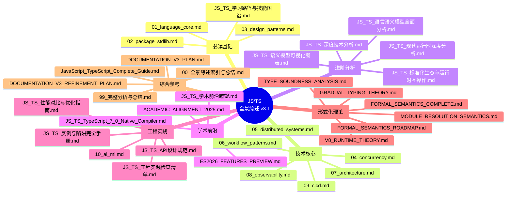
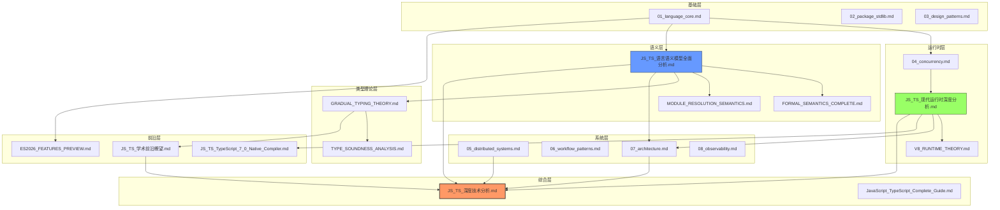

# JavaScript / TypeScript 全景综述 - 总索引与导航

> 完整的文档导航中心，提供结构化学习路径、快速查找表和全文档交叉引用

**最后更新**: 2026-04-17
**文档版本**: v4.0
**总文档数**: 37 篇
**覆盖领域**: 语言核心 -> 编译工程 -> 架构设计 -> 学术前沿

---

## :clipboard: 目录

- [JavaScript / TypeScript 全景综述 - 总索引与导航](#javascript--typescript-全景综述---总索引与导航)
  - [:clipboard: 目录](#-目录)
  - [:rocket: 快速开始](#-快速开始)
    - [我是初学者](#我是初学者)
    - [我是中级开发者](#我是中级开发者)
    - [我是高级开发者/架构师](#我是高级开发者架构师)
    - [我是研究人员](#我是研究人员)
  - [:world_map: 文档全景图](#️-文档全景图)
  - [:books: 按主题分类索引](#-按主题分类索引)
    - [:dart: P0 核心文档（必学）](#-p0-核心文档必学)
    - [:wrench: 工程实践文档](#-工程实践文档)
    - [:classical_building: 架构与系统文档](#️-架构与系统文档)
    - [:mortar_board: 学习与发展文档](#-学习与发展文档)
    - [:microscope: 形式化理论与学术文档](#-形式化理论与学术文档)
    - [:clipboard: 规划与参考文档](#-规划与参考文档)
  - [:railway_track: 学习路径推荐](#️-学习路径推荐)
    - [路径 A：初学者路径（0-6 个月）](#路径-a初学者路径0-6-个月)
    - [路径 B：进阶开发者路径（6-12 个月）](#路径-b进阶开发者路径6-12-个月)
    - [路径 C：架构师路径（12-18 个月）](#路径-c架构师路径12-18-个月)
    - [路径 D：专项专家路径](#路径-d专项专家路径)
      - [类型系统专家](#类型系统专家)
      - [运行时专家](#运行时专家)
      - [性能优化专家](#性能优化专家)
  - [:mag: 快速查找表](#-快速查找表)
    - [按技术领域查找](#按技术领域查找)
    - [按问题类型查找](#按问题类型查找)
    - [按 TC39 提案阶段查找](#按-tc39-提案阶段查找)
    - [按版本查找](#按版本查找)
  - [:spider_web: 文档依赖关系图](#️-文档依赖关系图)
  - [:memo: 更新日志](#-更新日志)
    - [v3.1 (2026-04-08)](#v31-2026-04-08)
    - [v3.0 (2026-04-02)](#v30-2026-04-02)
    - [v2.x (2026-03)](#v2x-2026-03)
  - [:package: 代码速查：常用 CLI 命令](#-代码速查常用-cli-命令)
  - [:microscope: 外部学术资源](#-外部学术资源)
  - [:link: 外部资源链接](#-外部资源链接)
  - [:bulb: 使用建议](#-使用建议)

---

## :rocket: 快速开始

### 我是初学者

:point_right: 从 [01_language_core.md](./01_language_core.md) 开始，建立语言基础
:point_right: 接着阅读 [JS_TS_学习路径与技能图谱.md](./JS_TS_学习路径与技能图谱.md) 的 Stage 1-2
:point_right: 实践 [03_design_patterns.md](./03_design_patterns.md) 中的基础模式

### 我是中级开发者

:point_right: 深入 [04_concurrency.md](./04_concurrency.md) 掌握并发模型
:point_right: 学习 [07_architecture.md](./07_architecture.md) 的系统架构设计
:point_right: 参考 [JS_TS_工程实践检查清单.md](./JS_TS_工程实践检查清单.md) 规范代码质量

### 我是高级开发者/架构师

:point_right: 必读 [JS_TS_深度技术分析.md](./JS_TS_深度技术分析.md) 获取 Executive Summary
:point_right: 研究 [05_distributed_systems.md](./05_distributed_systems.md) 分布式理论
:point_right: 关注 [JS_TS_学术前沿瞭望.md](./JS_TS_学术前沿瞭望.md) 掌握 PL 前沿动态

### 我是研究人员

:point_right: 重点 [JS_TS_语言语义模型全面分析.md](./JS_TS_语言语义模型全面分析.md) 形式化语义
:point_right: 结合 [FORMAL_SEMANTICS_COMPLETE.md](./FORMAL_SEMANTICS_COMPLETE.md) 深入理论
:point_right: 参考 [ACADEMIC_ALIGNMENT_2025.md](./ACADEMIC_ALIGNMENT_2025.md) 学术对齐分析

---

## :world_map: 文档全景图



---

## :books: 按主题分类索引

### :dart: P0 核心文档（必学）

| 文档 | 摘要 | 阅读时长 | 前置要求 |
|------|------|----------|----------|
| [01_language_core.md](./01_language_core.md) | ECMAScript 2025/2026 新特性、TypeScript 5.8-6.0 类型系统深度解析、严格类型配置最佳实践 | 2h | 无 |
| [04_concurrency.md](./04_concurrency.md) | Event Loop 执行模型、Promise 语义、Worker/SharedArrayBuffer、内存模型与 happens-before 关系 | 2.5h | 01_language_core |
| [JS_TS_语言语义模型全面分析.md](./JS_TS_语言语义模型全面分析.md) | 形式化语义三层模型、类型系统 |- 关系、执行上下文与作用域链、模块系统语义 | 3h | 01_language_core, 04_concurrency |
| JS_TS_现代运行时深度分析.md [TODO: 链接待修复] | V8 Turbolev 编译器、Node.js 24 Type Stripping、Deno/Bun 架构对比、WasmGC | 2.5h | 04_concurrency |
| [JS_TS_标准化生态与运行时互操作.md](./JS_TS_标准化生态与运行时互操作.md) | WinterTC/TC55 标准、Minimum Common Web API、跨运行时兼容性策略 | 1.5h | JS_TS_现代运行时深度分析 |
| [JS_TS_学术前沿瞭望.md](./JS_TS_学术前沿瞭望.md) | Guarded Domain Theory、Type-Constrained LLM、Relaxed Memory 验证、Structs 提案 | 2h | JS_TS_语言语义模型全面分析 |
| [JS_TS_深度技术分析.md](./JS_TS_深度技术分析.md) | Executive Summary：关键结论、决策矩阵、风险清单、2026 配置推荐 | 1h | 上述所有 |

### :wrench: 工程实践文档

| 文档 | 摘要 | 适用场景 |
|------|------|----------|
| [02_package_stdlib.md](./02_package_stdlib.md) | npm/yarn/pnpm/Bun 对比、ECMAScript 标准库、Web APIs 全面梳理 | 技术选型、包管理 |
| [03_design_patterns.md](./03_design_patterns.md) | GoF 23 种模式 JS/TS 实现、SOLID 原则、前端特有模式 | 代码设计、重构 |
| [JS_TS_工程实践检查清单.md](./JS_TS_工程实践检查清单.md) | 代码质量、安全、性能、可测试性、可维护性 8 大维度检查清单 | Code Review、项目交付 |
| [JS_TS_反例与陷阱完全手册.md](./JS_TS_反例与陷阱完全手册.md) | 常见反模式、TypeScript 陷阱、性能误区、安全漏洞案例 | 避坑指南、团队培训 |
| [JS_TS_性能对比与优化指南.md](./JS_TS_性能对比与优化指南.md) | 运行时性能对比、内存优化、启动优化、渲染优化策略 | 性能调优 |
| [JS_TS_API设计规范.md](./JS_TS_API设计规范.md) | RESTful/GraphQL/gRPC 设计规范、版本控制、文档化最佳实践 | API 设计 |

### :classical_building: 架构与系统文档

| 文档 | 摘要 | 目标读者 |
|------|------|----------|
| [05_distributed_systems.md](./05_distributed_systems.md) | CAP 定理形式化证明、一致性模型、微服务架构模式、事件驱动架构 | 后端架构师 |
| [06_workflow_patterns.md](./06_workflow_patterns.md) | 43 种工作流模式、可判断性分析、BPMN 建模、状态机实现 | 业务架构师 |
| [07_architecture.md](./07_architecture.md) | 分层/六边形/洋葱/清洁架构、前端架构演进、微前端、Serverless | 全栈架构师 |
| [08_observability.md](./08_observability.md) | OpenTelemetry 标准、分布式追踪、Metrics/Logs/Traces 三支柱 | SRE、平台工程师 |
| [09_cicd.md](./09_cicd.md) | GitHub Actions/GitLab CI 最佳实践、部署策略、流水线优化 | DevOps 工程师 |
| [10_ai_ml.md](./10_ai_ml.md) | TensorFlow.js、LLM 集成、RAG 架构、MLOps 实践 | AI 应用开发者 |

### :mortar_board: 学习与发展文档

| 文档 | 摘要 | 使用方式 |
|------|------|----------|
| [JS_TS_学习路径与技能图谱.md](./JS_TS_学习路径与技能图谱.md) | 4 阶段学习路径、专项技能图谱（类型系统/性能/架构）、技能评估标准 | 制定学习计划 |
| [JavaScript_TypeScript_Complete_Guide.md](./JavaScript_TypeScript_Complete_Guide.md) | 所有主题的索引汇总、快速参考手册、概念速查 | 日常查阅 |
| [JS_TS_语义模型可视化图表.md](./JS_TS_语义模型可视化图表.md) | Mermaid 架构图、时序图、状态机、流程图集合 | 辅助理解 |

### :microscope: 形式化理论与学术文档

| 文档 | 摘要 | 学术价值 |
|------|------|----------|
| [FORMAL_SEMANTICS_COMPLETE.md](./FORMAL_SEMANTICS_COMPLETE.md) | 操作语义、指称语义、公理语义的完整形式化定义 | PL 理论基础 |
| GRADUAL_TYPING_THEORY.md [TODO: 链接待修复] | 渐进类型系统的数学理论、一致性关系、类型安全证明 | 类型理论研究 |
| [TYPE_SOUNDNESS_ANALYSIS.md](./TYPE_SOUNDNESS_ANALYSIS.md) | TypeScript 类型声音性分析、unsound 行为枚举、改进方向 | 编译器研究 |
| [MODULE_RESOLUTION_SEMANTICS.md](./MODULE_RESOLUTION_SEMANTICS.md) | 模块解析算法的形式化描述、循环依赖处理、树摇优化 | 模块系统研究 |
| V8_RUNTIME_THEORY.md [TODO: 链接待修复] | V8 引擎形式化模型、隐藏类理论、GC 算法正确性 | 运行时研究 |
| [ACADEMIC_ALIGNMENT_2025.md](./ACADEMIC_ALIGNMENT_2025.md) | 2025 年 PL 学术会议与 JS/TS 相关研究对齐分析 | 学术前沿跟踪 |

### :clipboard: 规划与参考文档

| 文档 | 用途 |
|------|------|
| 00_全景综述索引与总结.md [TODO: 链接待修复] | v3 核心文档导读（旧版索引） |
| [99_完整分析与总结.md](./99_完整分析与总结.md) | 完整技术分析总结 |
| [DOCUMENTATION_V3_PLAN.md](./DOCUMENTATION_V3_PLAN.md) | v3 增强计划（P0-P4 任务清单） |
| [DOCUMENTATION_V3_REFINEMENT_PLAN.md](./DOCUMENTATION_V3_REFINEMENT_PLAN.md) | v3 细化执行计划 |
| [FORMAL_SEMANTICS_ROADMAP.md](./FORMAL_SEMANTICS_ROADMAP.md) | 形式化语义发展路线图 |
| [ES2026_FEATURES_PREVIEW.md](./ES2026_FEATURES_PREVIEW.md) | ES2026 特性前瞻 |
| [JS_TS_TypeScript_7_0_Native_Compiler.md](./JS_TS_TypeScript_7_0_Native_Compiler.md) | TypeScript 7.0 Go 原生编译器分析 |

---

## :railway_track: 学习路径推荐

### 路径 A：初学者路径（0-6 个月）

```
阶段 1：语言基础（0-2 个月）
├── 01_language_core.md [核心语法]
├── 02_package_stdlib.md [生态认知]
├── 03_design_patterns.md [基础模式]
└── JS_TS_学习路径与技能图谱.md [Stage 1-2]

阶段 2：工程实践（2-4 个月）
├── 09_cicd.md [工程化]
├── JS_TS_工程实践检查清单.md [质量保证]
├── JS_TS_反例与陷阱完全手册.md [避坑]
└── JS_TS_API设计规范.md [接口设计]

阶段 3：应用开发（4-6 个月）
├── 04_concurrency.md [异步编程]
├── 07_architecture.md [应用架构]
└── 10_ai_ml.md [AI 集成]
```

### 路径 B：进阶开发者路径（6-12 个月）

```
阶段 1：深度理解（6-8 个月）
├── JS_TS_语言语义模型全面分析.md [语义模型]
├── JS_TS_现代运行时深度分析.md [运行时机制]
├── 04_concurrency.md [并发深入]
└── 08_observability.md [可观测性]

阶段 2：系统设计（8-10 个月）
├── 05_distributed_systems.md [分布式理论]
├── 06_workflow_patterns.md [工作流设计]
├── 07_architecture.md [架构模式]
└── JS_TS_性能对比与优化指南.md [性能优化]

阶段 3：技术领导力（10-12 个月）
├── JS_TS_标准化生态与运行时互操作.md [标准化]
├── JS_TS_深度技术分析.md [决策支持]
└── JS_TS_学习路径与技能图谱.md [团队培养]
```

### 路径 C：架构师路径（12-18 个月）

```
阶段 1：理论基础（12-14 个月）
├── FORMAL_SEMANTICS_COMPLETE.md [形式化语义]
├── GRADUAL_TYPING_THEORY.md [类型理论]
├── TYPE_SOUNDNESS_ANALYSIS.md [类型系统]
└── V8_RUNTIME_THEORY.md [运行时理论]

阶段 2：前沿跟踪（14-16 个月）
├── JS_TS_学术前沿瞭望.md [PL 前沿]
├── ES2026_FEATURES_PREVIEW.md [语言演进]
├── JS_TS_TypeScript_7_0_Native_Compiler.md [编译器变革]
└── ACADEMIC_ALIGNMENT_2025.md [学术动态]

阶段 3：技术战略（16-18 个月）
├── JS_TS_深度技术分析.md [技术决策]
├── JS_TS_标准化生态与运行时互操作.md [生态规划]
└── JavaScript_TypeScript_Complete_Guide.md [知识体系]
```

### 路径 D：专项专家路径

#### 类型系统专家

```
01_language_core.md -> JS_TS_语言语义模型全面分析.md
-> TYPE_SOUNDNESS_ANALYSIS.md -> GRADUAL_TYPING_THEORY.md
-> JS_TS_学术前沿瞭望.md [Gradual Typing 章节]
```

#### 运行时专家

```
04_concurrency.md -> JS_TS_现代运行时深度分析.md
-> V8_RUNTIME_THEORY.md -> MODULE_RESOLUTION_SEMANTICS.md
-> JS_TS_TypeScript_7_0_Native_Compiler.md
```

#### 性能优化专家

```
04_concurrency.md -> JS_TS_性能对比与优化指南.md
-> V8_RUNTIME_THEORY.md [GC/编译器章节]
-> JS_TS_现代运行时深度分析.md [性能章节]
-> JS_TS_工程实践检查清单.md [性能检查项]
```

---

## :mag: 快速查找表

### 按技术领域查找

| 技术领域 | 主要文档 | 辅助文档 |
|----------|----------|----------|
| **TypeScript 语言** | 01_language_core.md | TYPE_SOUNDNESS_ANALYSIS.md, JS_TS_TypeScript_7_0_Native_Compiler.md |
| **JavaScript 运行时** | JS_TS_现代运行时深度分析.md | V8_RUNTIME_THEORY.md, 04_concurrency.md |
| **类型系统理论** | GRADUAL_TYPING_THEORY.md | TYPE_SOUNDNESS_ANALYSIS.md, FORMAL_SEMANTICS_COMPLETE.md |
| **并发编程** | 04_concurrency.md | JS_TS_现代运行时深度分析.md [并发章节] |
| **分布式系统** | 05_distributed_systems.md | 07_architecture.md [微服务章节] |
| **架构设计** | 07_architecture.md | 03_design_patterns.md, 06_workflow_patterns.md |
| **性能优化** | JS_TS_性能对比与优化指南.md | JS_TS_现代运行时深度分析.md, V8_RUNTIME_THEORY.md |
| **工程实践** | JS_TS_工程实践检查清单.md | 09_cicd.md, JS_TS_反例与陷阱完全手册.md |
| **标准化** | JS_TS_标准化生态与运行时互操作.md | ES2026_FEATURES_PREVIEW.md |
| **学术前沿** | JS_TS_学术前沿瞭望.md | ACADEMIC_ALIGNMENT_2025.md |

### 按问题类型查找

| 问题类型 | 推荐文档 | 具体章节/条目 |
|----------|----------|---------------|
| TS 配置怎么选？ | JS_TS_深度技术分析.md | "2026 推荐配置" |
| 类型体操不会写？ | JS_TS_学习路径与技能图谱.md | "类型系统专家路径" |
| Event Loop 搞不懂？ | 04_concurrency.md | "执行模型详解" |
| 内存泄漏排查？ | JS_TS_性能对比与优化指南.md | "内存优化章节" |
| API 如何设计？ | JS_TS_API设计规范.md | 全文 |
| 代码审查清单？ | JS_TS_工程实践检查清单.md | 全文 |
| 微服务架构选型？ | 05_distributed_systems.md | "架构模式对比" |
| 分布式追踪实现？ | 08_observability.md | "OpenTelemetry 集成" |
| 模块循环依赖？ | MODULE_RESOLUTION_SEMANTICS.md | "循环依赖处理" |
| LLM 如何集成？ | 10_ai_ml.md | "RAG 架构" |
| TS 7.0 影响评估？ | JS_TS_TypeScript_7_0_Native_Compiler.md | 全文 |
| 形式化语义入门？ | FORMAL_SEMANTICS_COMPLETE.md | "导读章节" |

### 按 TC39 提案阶段查找

| 提案 | 状态 | 相关文档 |
|------|------|----------|
| Temporal API | Stage 4 | 01_language_core.md, ES2026_FEATURES_PREVIEW.md |
| Array.fromAsync | Stage 4 | 01_language_core.md |
| Error.isError | Stage 4 | JS_TS_语言语义模型全面分析.md |
| Promise.try | Stage 4 | 01_language_core.md, ecmascript-features/ES2025_COMPLETE_FEATURES.md |
| RegExp.escape | Stage 4 | 01_language_core.md, ecmascript-features/ES2025_COMPLETE_FEATURES.md |
| Explicit Resource Management (`using`) | Stage 4 | 01_language_core.md |
| Import Attributes | Stage 3 | 01_language_core.md, ecmascript-features/ES2025_COMPLETE_FEATURES.md |
| Decorators | Stage 3 | 03_design_patterns.md |
| Import Defer | Stage 3 | 01_language_core.md, MODULE_RESOLUTION_SEMANTICS.md |
| Atomics.pause | Stage 3 | 01_language_core.md, 04_concurrency.md |
| Joint Iteration | Stage 3 | 01_language_core.md, ES2026_FEATURES_PREVIEW.md |
| Source Phase Imports | Stage 3 | ES2026_FEATURES_PREVIEW.md |
| Async Context | Stage 2 | 04_concurrency.md, JS_TS_学术前沿瞭望.md |
| Structs | Stage 2 | JS_TS_学术前沿瞭望.md, ES2026_FEATURES_PREVIEW.md |

### 按版本查找

| 版本/年份 | 相关文档 |
|-----------|----------|
| TypeScript 6.0 | 01_language_core.md, JS_TS_深度技术分析.md |
| TypeScript 7.0 (预览) | JS_TS_TypeScript_7_0_Native_Compiler.md |
| ES2025 | 01_language_core.md, ES2026_FEATURES_PREVIEW.md |
| ES2026 (预览) | ES2026_FEATURES_PREVIEW.md |
| Node.js 24 | JS_TS_现代运行时深度分析.md |
| WinterTC 2025 | JS_TS_标准化生态与运行时互操作.md |

---

## :spider_web: 文档依赖关系图



---

## :memo: 更新日志

### v3.1 (2026-04-08)

- :white_check_mark: 创建本文档，整合所有 P0/P1 文档索引
- :white_check_mark: 建立三级学习路径（初学者/进阶/架构师/专项）
- :white_check_mark: 添加多维度快速查找表
- :white_check_mark: 绘制文档依赖关系图

### v3.0 (2026-04-02)

- :white_check_mark: 发布 TypeScript 6.0 更新
- :white_check_mark: 新增 JS_TS_标准化生态与运行时互操作.md
- :white_check_mark: 新增 JS_TS_学术前沿瞭望.md
- :white_check_mark: 更新 JS_TS_现代运行时深度分析.md (Node.js 24, V8 Turbolev)

### v2.x (2026-03)

- :white_check_mark: 创建 01-10 核心文档
- :white_check_mark: 创建形式化语义系列文档
- :white_check_mark: 建立基础文档体系

---

## :package: 代码速查：常用 CLI 命令

```bash
# TypeScript 严格检查
npx tsc --noEmit --strict

# Node.js 性能分析
node --prof app.js
node --prof-process isolate-*.log > profile.txt

# V8 垃圾回收追踪
node --trace-gc app.js

# 依赖安全审计
npm audit --audit-level=moderate
pnpm audit --prod

# 包大小分析
npx webpack-bundle-analyzer dist/stats.json
```

### 代码示例：导航文档的自动化生成与校验

```typescript
// navigation-validator.ts — 校验导航链接是否指向真实文件
import { readFileSync, existsSync } from 'node:fs';
import { resolve, dirname } from 'node:path';

interface LinkCheckResult {
  link: string;
  exists: boolean;
  line: number;
}

function extractMarkdownLinks(content: string): Array<{ text: string; href: string; line: number }> {
  const links: Array<{ text: string; href: string; line: number }> = [];
  const lines = content.split('\n');
  const regex = /\[([^\]]+)\]\(([^)]+)\)/g;

  for (let i = 0; i < lines.length; i++) {
    let match: RegExpExecArray | null;
    while ((match = regex.exec(lines[i])) !== null) {
      const href = match[2].split('#')[0]; // 去掉锚点
      if (!href.startsWith('http') && !href.startsWith('#')) {
        links.push({ text: match[1], href, line: i + 1 });
      }
    }
  }
  return links;
}

function validateNavigationFile(navPath: string): LinkCheckResult[] {
  const content = readFileSync(navPath, 'utf-8');
  const baseDir = dirname(navPath);
  const links = extractMarkdownLinks(content);

  return links.map(l => ({
    link: l.href,
    exists: existsSync(resolve(baseDir, l.href)),
    line: l.line,
  }));
}

// 使用示例
const results = validateNavigationFile('./navigation-legacy.md');
const broken = results.filter(r => !r.exists);
if (broken.length) {
  console.error('Broken links found:', broken);
  process.exit(1);
}
```

## :microscope: 外部学术资源

| 资源 | 链接 | 说明 |
|------|------|------|
| ACM Digital Library | <https://dl.acm.org/> | PLDI/POPL/OOPSLA 论文库 |
| arXiv Programming Languages | <https://arxiv.org/cs.PL> | 预印本论文 |
| Google Research -- Programming | <https://research.google/research-areas/programming-languages/> | 工业界研究 |
| Microsoft Research -- TypeScript | <https://www.microsoft.com/en-us/research/research-area/programming-languages-software-engineering/> | 类型系统研究 |
| ICFP Proceedings | <https://dblp.org/db/conf/icfp/index.html> | 函数式编程会议 |
| IEEE Xplore -- Software Engineering | <https://ieeexplore.ieee.org/xpl/RecentIssue.jsp?punumber=32> | IEEE Transactions on Software Engineering |
| SIGPLAN Notices | <https://dl.acm.org/loi/sigplan> | 编程语言 SIG 会刊 |
| HAL Archives Ouvertes | <https://hal.science/> | 法语区学术预印本 |

## :link: 外部资源链接

| 资源 | 链接 | 说明 |
|------|------|------|
| ECMA-262 规范 | <https://tc39.es/ecma262/> | 官方语言规范 |
| TypeScript 文档 | <https://www.typescriptlang.org/docs/> | 官方文档 |
| Node.js 文档 | <https://nodejs.org/docs/> | 运行时文档 |
| WinterTC 标准 | <https://wintertc.org/> | 跨运行时标准 |
| V8 博客 | <https://v8.dev/blog> | 引擎最新动态 |
| PLDI/POPL 论文 | <https://dl.acm.org/> | 学术会议论文 |
| TC39 Proposals | <https://github.com/tc39/proposals> | ECMAScript 提案跟踪 |
| MDN Web Docs | <https://developer.mozilla.org/en-US/> | Web 技术权威文档 |
| Deno 文档 | <https://docs.deno.com/> | Deno 运行时文档 |
| Bun 文档 | <https://bun.sh/docs> | Bun 运行时文档 |
| Web Platform Tests | <https://github.com/web-platform-tests/wpt> | 浏览器兼容性测试基准 |
| OpenJS Foundation | <https://openjsf.org/> | JavaScript 生态基金会 |
| JSConf / TC39 Meeting Notes | <https://github.com/tc39/notes> | 语言标准会议纪要 |
| TypeScript Compiler API | <https://github.com/microsoft/TypeScript/wiki/Using-the-Compiler-API> | 编译器扩展指南 |
| State of JS Survey | <https://stateofjs.com/> | 年度 JS 生态调查 |
| State of TS Survey | <https://stateofts.com/> | 年度 TS 生态调查 |
| Node Weekly | <https://nodeweekly.com/> | Node.js 新闻周刊 |
| Frontend Focus | <https://frontendfoc.us/> | 前端技术周刊 |
| TC39 Meeting Agendas | <https://github.com/tc39/agendas> | 标准化会议议程 |
| JavaScript Weekly | <https://javascriptweekly.com/> | JS 技术周刊 |
| Node.js Design Patterns | <https://nodejs.org/en/learn/> | 官方学习资源 |
| GitHub Trending -- TypeScript | <https://github.com/trending/typescript> | TS 热门仓库 |
| npm Trends | <https://npmtrends.com/> | 包下载量对比 |
| Stack Overflow -- JavaScript | <https://stackoverflow.com/questions/tagged/javascript> | 问答社区 |
| ESLint 官方文档 | <https://eslint.org/docs/latest/> | 代码质量工具 |
| Prettier 官方文档 | <https://prettier.io/docs/en/> | 代码格式化 |
| Rollup 官方文档 | <https://rollupjs.org/> | 模块打包器 |
| esbuild 官方文档 | <https://esbuild.github.io/> | 极速打包器 |
| SWC 官方文档 | <https://swc.rs/> | Rust 编译器 |
| Rome/BIOME 文档 | <https://biomejs.dev/> | 一体化工具链 |
| W3C Web Platform | <https://www.w3.org/standards/> | W3C 标准汇总 |
| IETF HTTP Standards | <https://httpwg.org/specs/> | HTTP 协议标准 |
| WHATWG HTML Living Standard | <https://html.spec.whatwg.org/> | HTML 现行标准 |
| Can I Use | <https://caniuse.com/> | 浏览器特性兼容性查询 |
| WebKit Blog | <https://webkit.org/blog/> | WebKit/Safari 引擎博客 |
| SpiderMonkey Blog | <https://spidermonkey.dev/blog/> | Firefox JS 引擎博客 |

---

## :bulb: 使用建议

1. **首次访问**：阅读本文档的"快速开始"和"学习路径推荐"部分
2. **日常查阅**：使用"按问题类型查找"表快速定位
3. **系统学习**：按照"学习路径推荐"的顺序阅读
4. **深入研究**：参考"文档依赖关系图"理解知识依赖
5. **跟踪更新**：关注"更新日志"和"前沿层"文档

---

*本文档是 JavaScript/TypeScript 全景综述的导航中心，建议收藏并定期回访以获取最新内容。*
