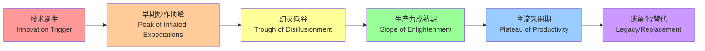
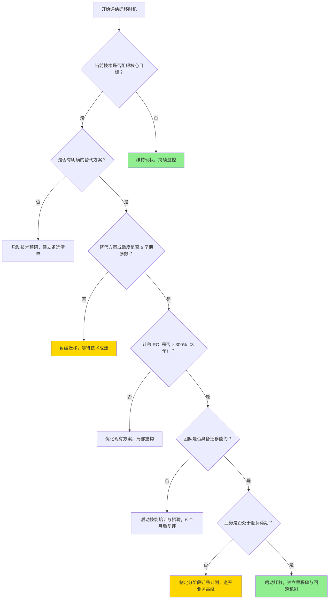

# 技术选型方法论与评估框架

> **文档定位**：战略级理论文档，面向技术决策者、CTO、架构师与技术负责人。
> **目标**：在 JavaScript/TypeScript 生态的极度繁荣与快速迭代中，建立可复用、可量化、可审计的技术选型决策体系。
> **关联文档**：
>
> - 对比矩阵：`docs/comparison-matrices/`
> - 决策树：`docs/decision-trees.md`
> - 代码实验：`jsts-code-lab/` 各模块

---

## 目录

- [技术选型方法论与评估框架](#技术选型方法论与评估框架)
  - [目录](#目录)
  - [1. 技术选型的核心原则](#1-技术选型的核心原则)
    - [1.1 避免「追逐新潮」陷阱](#11-避免追逐新潮陷阱)
    - [1.2 区分「技术可行性」与「组织可行性」](#12-区分技术可行性与组织可行性)
    - [1.3 长期维护成本 \> 初始开发成本](#13-长期维护成本--初始开发成本)
    - [1.4 团队能力边界原则](#14-团队能力边界原则)
  - [2. 技术成熟度评估模型](#2-技术成熟度评估模型)
    - [2.1 Gartner Hype Cycle 的 JS/TS 生态适配版](#21-gartner-hype-cycle-的-jsts-生态适配版)
    - [2.2 技术采用生命周期](#22-技术采用生命周期)
    - [2.3 技术债务风险评估矩阵](#23-技术债务风险评估矩阵)
  - [3. 多维评估框架](#3-多维评估框架)
    - [3.1 维度总览](#31-维度总览)
    - [3.2 各维度详细指标与数据来源](#32-各维度详细指标与数据来源)
      - [维度一：技术成熟度](#维度一技术成熟度)
      - [维度二：性能指标](#维度二性能指标)
      - [维度三：生态健康度](#维度三生态健康度)
      - [维度四：团队适配度](#维度四团队适配度)
      - [维度五：长期可持续性](#维度五长期可持续性)
      - [维度六：AI 辅助友好度（2024 年后新增关键维度）](#维度六ai-辅助友好度2024-年后新增关键维度)
      - [维度七：安全合规](#维度七安全合规)
      - [维度八：成本模型](#维度八成本模型)
  - [4. 量化评分系统](#4-量化评分系统)
    - [4.1 评分标准（1-5 分制）](#41-评分标准1-5-分制)
    - [4.2 权重分配方法](#42-权重分配方法)
    - [4.3 总分计算与决策阈值](#43-总分计算与决策阈值)
    - [4.4 敏感性分析](#44-敏感性分析)
  - [5. 技术债务管理方法论](#5-技术债务管理方法论)
    - [5.1 技术债务识别框架](#51-技术债务识别框架)
    - [5.2 债务优先级评估](#52-债务优先级评估)
    - [5.3 迁移时机判断模型](#53-迁移时机判断模型)
    - [5.4 渐进式迁移 vs 大爆炸式迁移的决策树](#54-渐进式迁移-vs-大爆炸式迁移的决策树)
  - [6. 14 大选型场景的专用评估模板](#6-14-大选型场景的专用评估模板)
    - [6.1 前端框架选型](#61-前端框架选型)
    - [6.2 后端框架选型](#62-后端框架选型)
    - [6.3 构建工具选型](#63-构建工具选型)
    - [6.4 数据库 / ORM 选型](#64-数据库--orm-选型)
    - [6.5 状态管理选型](#65-状态管理选型)
    - [6.6 测试框架选型](#66-测试框架选型)
    - [6.7 部署平台选型](#67-部署平台选型)
    - [6.8 CI/CD 工具选型](#68-cicd-工具选型)
    - [6.9 CSS 方案选型](#69-css-方案选型)
    - [6.10 Monorepo 工具选型](#610-monorepo-工具选型)
    - [6.11 AI 框架选型](#611-ai-框架选型)
    - [6.12 认证方案选型](#612-认证方案选型)
    - [6.13 实时通信选型](#613-实时通信选型)
    - [6.14 包管理器选型](#614-包管理器选型)
  - [7. 反模式与陷阱](#7-反模式与陷阱)
    - [7.1 「大厂在用所以我们也用」谬误](#71-大厂在用所以我们也用谬误)
    - [7.2 「GitHub Stars = 质量」谬误](#72-github-stars--质量谬误)
    - [7.3 「最新版本 = 最佳选择」谬误](#73-最新版本--最佳选择谬误)
    - [7.4 「技术选型是一次性决策」谬误](#74-技术选型是一次性决策谬误)
    - [7.5 「忽略隐性成本」谬误](#75-忽略隐性成本谬误)
  - [8. 实际案例分析](#8-实际案例分析)
    - [案例 1：中型团队从 Webpack 迁移到 Rspack 的决策过程](#案例-1中型团队从-webpack-迁移到-rspack-的决策过程)
    - [案例 2：初创公司选择 Next.js vs Remix 的决策过程](#案例-2初创公司选择-nextjs-vs-remix-的决策过程)
    - [案例 3：企业级团队评估 Signals vs Hooks 的决策过程](#案例-3企业级团队评估-signals-vs-hooks-的决策过程)
  - [附录 A：技术选型评审清单（Checklist）](#附录-a技术选型评审清单checklist)
  - [附录 B：推荐阅读与参考来源](#附录-b推荐阅读与参考来源)

---

## 1. 技术选型的核心原则

技术选型不是「选最好的技术」，而是「选最适合当前组织上下文的技术」。以下四项原则是所有评估活动的元规则。

### 1.1 避免「追逐新潮」陷阱

JS/TS 生态以极高的创新速率著称，npm Registry 每日新增包数量超过 800 个[^1]。这种繁荣带来了严重的「 shiny object syndrome」（新奇事物综合征）。

**判断标准**：

- 新技术是否解决了当前团队切实存在的痛点，而非「可能未来会遇到的」问题？
- 该技术的核心 API 是否已在至少两个大版本中保持稳定？
- 如果明天该技术的核心维护者停止维护，你的团队能否在 2 周内接管核心代码的阅读与修复？

> **实践建议**：建立「技术冷静期」制度。任何引入生产环境的新技术，必须在实验项目（spike project）中运行至少 6-8 周，覆盖完整的开发-测试-部署周期。相关实验记录应归档至 `jsts-code-lab/09-real-world-examples/` 体系。

### 1.2 区分「技术可行性」与「组织可行性」

一项技术在技术层面完全可行，并不意味着组织能够成功吸收。组织可行性包含：

- **认知负载**：团队理解该技术所需的概念模型数量（例如，从 Vue Options API 迁移到 React Server Components，认知负载极高）。
- **流程适配**：现有 CI/CD、Code Review、监控告警流程是否需要重构？
- **决策链长度**：引入该技术需要经过多少层审批？越长，落地阻力越大。

### 1.3 长期维护成本 > 初始开发成本

POC（概念验证）阶段的开发速度具有欺骗性。一个框架在 Day 1 让开发者多写了 20% 的代码不是关键问题；关键是它在 Day 365 是否：

- 仍能及时获得安全补丁
- 升级大版本时是否需要重写核心模块
- 是否因社区分裂导致生态插件停止维护

### 1.4 团队能力边界原则

**任何技术选型决策的最终约束条件都是团队能力边界**，而非技术本身的理论上限。评估团队能力边界时，应考虑：

| 维度 | 评估问题 | 数据来源 |
|------|----------|----------|
| 现有技能深度 | 团队核心成员在该技术栈上的平均经验年限？ | 内部技能矩阵调研 |
| 招聘市场深度 | 当地/远程人才市场中，该技术的合格候选人密度？ | 招聘平台数据、猎头反馈 |
| 培训转化率 | 一名中级开发者从入门到独立负责生产模块，平均需要多久？ | 历史项目复盘 |
| 知识流失风险 | 如果最熟悉该技术栈的 2 人同时离职，剩余团队能否维持系统运转？ | 巴士因子（Bus Factor）分析 |

---

## 2. 技术成熟度评估模型

### 2.1 Gartner Hype Cycle 的 JS/TS 生态适配版

传统 Gartner Hype Cycle 描述的是技术在整个行业中的成熟度曲线。在 JS/TS 生态中，我们需要将其压缩并适配，因为前端技术的周期通常只有 2-4 年，而非传统软件的 5-10 年。



**JS/TS 生态各阶段典型技术（截至 2026 年 Q2）**：

| 阶段 | 典型技术 | 决策建议 |
|------|----------|----------|
| 技术诞生 | TC39 Stage 1 提案、实验性编译器 | 仅用于 R&D 项目，禁止进入生产 |
| 早期炒作顶峰 | AI 原生框架（部分）、边缘 WASM 运行时 | 保持关注，小规模 PoC |
| 幻灭低谷 | 部分微前端方案、过度设计的 Serverless 方案 | 审慎评估，区分「技术不行」与「用错了场景」 |
| 生产力成熟期 | Vite、TypeScript 5.x、Prisma、TanStack Query | **主流推荐阶段**，生态稳定、人才充足 |
| 主流采用期 | React、Vue、Node.js、PostgreSQL + Prisma | 默认选择，除非有明确的差异化需求 |
| 遗留化/替代 | AngularJS、Grunt、Bower、RequireJS | 制定迁移路线图，冻结新功能开发 |

### 2.2 技术采用生命周期

基于 Geoffrey Moore 的《跨越鸿沟》模型[^2]，JS/TS 生态的技术采用生命周期可细分为：

| 采用者类型 | 占比 | 特征 | 适用场景 | 风险等级 |
|------------|------|------|----------|----------|
| 创新者 | 2.5% | 乐于承担风险，关注技术本身 | 技术预研、内部工具 | 🔴 极高 |
| 早期采用者 | 13.5% | 有远见，愿为解决核心痛点承担一定风险 | 新项目、非核心系统 | 🟠 高 |
| 早期多数 | 34% | 务实，等待技术被验证后才采用 | **核心业务系统首选区间** | 🟡 中 |
| 晚期多数 | 34% | 保守，只有在市场主流化后才跟进 | 金融、政务等强合规场景 | 🟢 低 |
| 落后者 | 16% | 抗拒变化，仅在被迫时迁移 | 遗留系统维护 | ⚪ 极稳但受限 |

**决策建议**：

- **初创公司**（追求差异化与融资故事）：可在「早期采用者」阶段选择性入场，但核心基础设施（数据库、认证、部署）应停留在「早期多数」。
- **中型团队**（产品驱动，追求稳定交付）：全部技术栈应处于「早期多数」至「主流采用期」。
- **企业级团队**（强合规、长周期）：核心系统应在「晚期多数」或「主流采用期」，边缘创新可在「早期多数」试点。

### 2.3 技术债务风险评估矩阵

技术债务不是「坏东西」——它是换取交付速度的战略性借贷。但债务必须被计量、被记录、被偿还。

| 债务类型 | 产生原因 | 利息计算方式 | 偿还策略 |
|----------|----------|--------------|----------|
| 审慎债务（Prudent） | 明确知道更好方案，为赶 Deadline 而妥协 | 延迟重构导致的新功能开发阻力 | 在下一个迭代周期预留 20% 容量偿还 |
| 鲁莽债务（Reckless） | 因无知或懒惰而采用次优方案 | 系统崩溃、安全漏洞、招聘困难 | 立即制定止损方案，必要时冻结项目 |
| 有计划债务 | 为验证市场而故意采用的临时方案 | 市场验证成功后重构成本 | 设定明确的「债务到期日」与触发条件 |
| 无计划债务 | 缺乏技术评审流程自然积累 | 随时间指数级增长 | 引入技术雷达（Tech Radar）定期审计 |

---

## 3. 多维评估框架

本框架包含 8 个评估维度，每个维度下设 3-4 个可观测指标。框架设计遵循 **MECE 原则**（Mutually Exclusive, Collectively Exhaustive），确保评估无遗漏、无重叠。

### 3.1 维度总览

```mermaid
graph TD
    A[技术选型多维评估框架] --> B[技术成熟度]
    A --> C[性能指标]
    A --> D[生态健康度]
    A --> E[团队适配度]
    A --> F[长期可持续性]
    A --> G[AI 辅助友好度]
    A --> H[安全合规]
    A --> I[成本模型]

    B --> B1[Stars / 下载量]
    B --> B2[维护活跃度]
    B --> B3[版本稳定性]

    C --> C1[构建时间]
    C --> C2[运行时性能]
    C --> C3[Bundle 大小]
    C --> C4[内存占用]

    D --> D1[插件数量]
    D --> D2[社区活跃度]
    D --> D3[文档质量]
    D --> D4[Issue 响应速度]

    E --> E1[学习曲线]
    E --> E2[现有技能栈]
    E --> E3[招聘难度]
    E --> E4[培训成本]

    F --> F1[维护团队稳定性]
    F --> F2[资金来源]
    F --> F3[路线图清晰度]
    F --> F4[向后兼容性]

    G --> G1[训练数据丰富度]
    G --> G2[AI 生成准确率]
    G --> G3[IDE 支持]

    H --> H1[漏洞响应速度]
    H --> H2[审计记录]
    H --> H3[许可证兼容性]

    I --> I1[基础设施成本]
    I --> I2[人力成本]
    I --> I3[迁移成本]
    I --> I4[机会成本]
```



### 3.2 各维度详细指标与数据来源

#### 维度一：技术成熟度

| 指标 | 评估方法 | 工具/来源 | 优秀基准 |
|------|----------|-----------|----------|
| GitHub Stars | 直接观测，注意区分「历史积累」与「近期增速」 | GitHub API、Star History | ≥ 20k 且近 6 个月增速 > 5% |
| 周下载量 | npm 统计，观察趋势而非绝对值 | npm trends、npmtrends.com | 周下载 ≥ 100k 且趋势平稳或上升 |
| 维护活跃度 | 近 90 天内核心仓库的 commit 频率、PR 合并速度 | GitHub Insights、OpenSSF Scorecard | 每周 ≥ 3 次有意义的 commit |
| 版本稳定性 | 语义化版本遵循度、Breaking Change 频率 | Changelog、Release 历史 | 每年 major 版本 ≤ 1 个 |

#### 维度二：性能指标

| 指标 | 评估方法 | 工具/来源 | 优秀基准 |
|------|----------|-----------|----------|
| 冷启动构建时间 | 清空缓存后的首次构建耗时 | `hyperfine`、`time` | 开发模式 ≤ 500ms；生产模式 ≤ 30s |
| 热更新延迟 | 文件修改到浏览器刷新的端到端延迟 | 浏览器 DevTools Network | ≤ 100ms（感知即时） |
| 生产 Bundle 大小 | gzip 后的核心运行时体积 | `rollup-plugin-visualizer`、Bundlephobia | 与同类工具相比处于前 25% |
| 内存峰值占用 | 构建过程与运行时的 RSS 峰值 | `process.memoryUsage()`、 Clinic.js | 不显著高于同类工具均值 |

#### 维度三：生态健康度

| 指标 | 评估方法 | 工具/来源 | 优秀基准 |
|------|----------|-----------|----------|
| 插件/扩展数量 | 官方 + 社区插件数量 | 官方文档、Awesome 列表 | 覆盖团队所需的 90% 场景 |
| 社区活跃度 | Discord/Slack 在线人数、论坛日发帖量 | 各平台公开数据 | 核心频道日活跃 ≥ 500 人 |
| 文档质量 | 完整性、时效性、示例可运行性 | 人工评审 + 用户调研 | 新开发者可在无帮助情况下 30 分钟完成 Hello World |
| Issue 响应速度 | 非重复 Issue 的首响时间（TTFI, Time to First Interaction） | GitHub API | P0 Issue ≤ 24h；一般 Issue ≤ 7d |

#### 维度四：团队适配度

| 指标 | 评估方法 | 工具/来源 | 优秀基准 |
|------|----------|-----------|----------|
| 学习曲线 | 从入门到生产可用所需的日历时间 | 内部培训实验、A/B 测试 | ≤ 2 周（对团队平均技术水平） |
| 现有技能栈重叠度 | 与团队当前掌握技术的概念重叠比例 | 技能矩阵映射 | ≥ 60% 概念可迁移 |
| 招聘难度 | 该领域合格候选人的市场供需比 | 招聘平台数据、猎头访谈 | 平均招聘周期 ≤ 6 周 |
| 培训成本 | 将一名中级开发者培养至独立贡献所需的直接成本 | 内部财务数据 | 人均 ≤ 2 人/周 |

#### 维度五：长期可持续性

| 指标 | 评估方法 | 工具/来源 | 优秀基准 |
|------|----------|-----------|----------|
| 维护团队稳定性 | 核心维护者在项目中的任职时长 | GitHub 贡献者历史、LinkedIn | 核心维护者 ≥ 2 人，平均任期 ≥ 2 年 |
| 资金来源 | 是否有稳定的商业支持或基金会资助 | 官网 Sponsors、Open Collective | 有明确的可持续资金路径 |
| 路线图清晰度 | 未来 12 个月的公开规划与里程碑 | GitHub Roadmap、RFC 流程 | 有公开 RFC 流程且至少覆盖下一 Major 版本 |
| 向后兼容性策略 | 废弃 API 的 deprecation 周期、codemod 支持 | 官方文档、升级指南 | Breaking Change 提供 ≥ 6 个月的 deprecation 周期 + codemod |

#### 维度六：AI 辅助友好度（2024 年后新增关键维度）

| 指标 | 评估方法 | 工具/来源 | 优秀基准 |
|------|----------|-----------|----------|
| 训练数据丰富度 | 该技术在主流 LLM 训练语料中的出现频率 | 间接评估：AI 生成测试 | AI 能正确生成该技术的常见模式 ≥ 80% |
| AI 生成准确率 | 给定业务需求，AI 生成的代码首次可运行率 | 内部实验、SWE-bench 衍生测试 | ≥ 70% |
| IDE 智能化支持 | LSP 完备度、AI 补全支持（Copilot / Cody 等） | 官方文档、实测 | 语法补全、跳转定义、重构支持完备 |

#### 维度七：安全合规

| 指标 | 评估方法 | 工具/来源 | 优秀基准 |
|------|----------|-----------|----------|
| 漏洞响应速度 | CVE 从公开到补丁发布的平均时间 | Snyk、GitHub Security Advisories | Critical CVE ≤ 72h；High CVE ≤ 14d |
| 审计记录 | 是否有第三方安全审计、依赖供应链透明度 | OpenSSF Scorecard、SLSA 等级 | 供应链安全评分 ≥ 7/10 |
| 许可证兼容性 | 与项目主许可证的法律兼容性 | FOSSA、Snyk License | 无 GPL 传染性风险，与 MIT/Apache-2.0 兼容 |

#### 维度八：成本模型

| 指标 | 评估方法 | 工具/来源 | 优秀基准 |
|------|----------|-----------|----------|
| 基础设施成本 | 运行该技术所需的计算/存储/带宽成本 | 云厂商计算器 | 不显著高于同类方案 |
| 人力成本 | 开发、运维、故障处理的人力投入 | 内部工时统计 | 与现有团队结构匹配，无需新增专职岗位 |
| 迁移成本 | 从当前技术迁移至此技术的全周期成本 | 历史类似迁移复盘 | 迁移 ROI ≥ 300%（3 年内） |
| 机会成本 | 因选择该技术而放弃的其他方案潜在收益 | 场景推演 | 机会成本可控，不阻塞战略方向 |

---

## 4. 量化评分系统

### 4.1 评分标准（1-5 分制）

每个维度按 1-5 分评分，定义如下：

| 分值 | 定义 | 决策含义 |
|------|------|----------|
| 5 | 卓越（Excellent） | 行业标杆水平，可作为核心竞争优势 |
| 4 | 良好（Good） | 满足所有需求，无明显短板 |
| 3 | 合格（Acceptable） | 满足核心需求，存在可管理的缺陷 |
| 2 | 较差（Poor） | 存在明显短板，需要额外投入弥补 |
| 1 | 不可接受（Unacceptable） | 存在致命缺陷，直接否决 |

### 4.2 权重分配方法

不同项目类型对维度的敏感度不同。以下是推荐的默认权重模板，团队应根据实际情况调整。

| 维度 | 初创产品（MVP） | 中型 SaaS | 企业级平台 | 内部工具 |
|------|-----------------|-----------|------------|----------|
| 技术成熟度 | 15% | 20% | 25% | 10% |
| 性能指标 | 15% | 20% | 15% | 10% |
| 生态健康度 | 15% | 15% | 15% | 20% |
| 团队适配度 | **25%** | 15% | 10% | **25%** |
| 长期可持续性 | 5% | 15% | **20%** | 10% |
| AI 辅助友好度 | 10% | 5% | 5% | 10% |
| 安全合规 | 5% | 5% | **15%** | 5% |
| 成本模型 | 10% | 5% | 5% | 10% |

**权重调整原则**：

1. 所有维度权重之和必须为 100%。
2. 任何单一维度权重不应超过 30%，避免单一因素主导决策。
3. 权重调整需经技术委员会评审并记录决策理由。

### 4.3 总分计算与决策阈值

**计算公式**：

```
总分 = Σ(维度得分 × 维度权重)
```

**决策阈值**：

| 总分区间 | 决策建议 | 后续动作 |
|----------|----------|----------|
| 4.5 - 5.0 | **强烈推荐** | 进入标准技术栈清单，新项目默认采用 |
| 3.5 - 4.4 | **条件推荐** | 可采用，但需在技术评审中记录已知风险与缓解措施 |
| 2.5 - 3.4 | **审慎采用** | 仅限实验性项目或特定场景，需 CTO 级别审批 |
| 1.5 - 2.4 | **不推荐** | 禁止用于新项目，现有使用需制定迁移计划 |
| 1.0 - 1.4 | **明确否决** | 立即启动迁移或替换 |

### 4.4 敏感性分析

权重变化对结果的影响必须被量化。采用 **龙卷风图（Tornado Diagram）** 方法：

1. 对每个维度，将其权重在 ±20% 范围内变动（保持其他维度等比例调整）。
2. 记录总分的变化幅度。
3. 变化幅度最大的维度即为该决策的「关键敏感因子」。

**示例**：若某技术方案的评分对「团队适配度」权重极度敏感（权重从 20% 降至 10% 时总分从 4.2 跌至 3.1），则说明该方案的采纳高度依赖于团队现有技能，一旦团队结构发生变化，方案风险将急剧上升。

> **实践建议**：将敏感性分析纳入技术选型文档的固定章节。模板可参考 `docs/comparison-matrices/` 中的现有对比矩阵格式。

---

## 5. 技术债务管理方法论

### 5.1 技术债务识别框架

技术债务的识别不应依赖「感觉」，而应依赖可观测的指标：

| 信号类型 | 具体指标 | 阈值 | 债务等级 |
|----------|----------|------|----------|
| 代码质量 | 测试覆盖率下降速度 | 连续 2 个 Sprint 下降 > 5% | 🟡 低级 |
| 代码质量 | 代码异味（Code Smell）密度 | SonarQube 严重问题 > 10/千行 | 🟠 中级 |
| 依赖健康 | 依赖包已停止维护（last publish > 2 年） | 生产依赖中出现此类包 | 🟠 中级 |
| 依赖健康 | 存在已知 High/Critical CVE 未修复 | Snyk 扫描未通过 | 🔴 高级 |
| 开发效率 | 新功能开发速度连续下降 | 连续 3 个 Sprint 故事点完成率 < 70% | 🟠 中级 |
| 运维稳定性 | 生产事故频率上升 | 月均 P1/P2 事故 > 2 次 | 🔴 高级 |
| 团队士气 | 开发者满意度（eNPS）下降 | 季度 eNPS < 20 | 🟡 低级 |

### 5.2 债务优先级评估

债务修复优先级采用三维矩阵：**影响范围 × 修复成本 × 恶化速度**。

```
优先级分数 = 影响范围(1-5) × 恶化速度(1-5) / 修复成本(1-5)
```

| 优先级分数 | 处理策略 |
|------------|----------|
| ≥ 5.0 | **立即修复**：纳入当前 Sprint，可暂停部分新功能开发 |
| 2.5 - 4.9 | **计划修复**：纳入下一技术迭代周期，分配专项资源 |
| 1.0 - 2.4 | **监控观察**：记录债务清单，定期复查，暂不投入资源 |
| < 1.0 | **接受**：成本收益比不支持修复，文档化即可 |

### 5.3 迁移时机判断模型



### 5.4 渐进式迁移 vs 大爆炸式迁移的决策树

| 评估维度 | 渐进式迁移（推荐） | 大爆炸式迁移（高风险） |
|----------|-------------------|----------------------|
| **适用前提** | 系统可模块化拆分；存在清晰的边界定义 | 系统高度耦合，无法拆分；或技术栈完全不兼容 |
| **时间窗口** | 长（3-12 个月） | 短（数天至数周） |
| **风险特征** | 风险分散，可逐步回滚 | 风险集中，失败影响全局 |
| **资源需求** | 可持续，可与业务开发并行 | 需冻结功能开发，全员投入 |
| **典型案例** | Webpack → Vite 按业务模块逐步替换；Monolith → Micro-frontend | 数据库大版本升级；框架完全不兼容升级（Vue 2 → Vue 3 早期） |
| **成功关键** | 完善的特性开关（Feature Flag）、AB 测试能力、监控覆盖 | 极其详尽的迁移清单、演练充分、回滚窗口明确 |

**决策规则**：

- 如果系统可被拆分为 ≥ 3 个独立模块，且每个模块可在 2 周内完成迁移测试 → **渐进式**
- 如果核心业务指标对故障容忍度极低（如金融交易系统）→ **渐进式**
- 如果技术债务已导致系统濒临崩溃，且没有中间状态可运行 → **大爆炸式（但需最高级别审批）**

---

## 6. 14 大选型场景的专用评估模板

以下每个场景均基于第 3 章的通用框架，但调整了维度权重与关键问题。详细对比数据请参考 `docs/comparison-matrices/` 中对应的矩阵文件。

### 6.1 前端框架选型

**特殊权重调整**：性能指标 +5%，团队适配度 +5%，AI 辅助友好度 +5%（因前端代码 AI 生成率高）。

**关键决策问题**：

1. 产品形态是内容驱动（CMS/博客）还是应用驱动（SaaS/后台）？
2. 团队对「编译时魔法」的接受度如何？（Svelte/Solid vs React/Vue）
3. 是否需要同时支持 Web 与原生应用？（React Native / NativeScript 考量）

**参考矩阵**：`docs/comparison-matrices/frontend-frameworks-compare.md`、`docs/comparison-matrices/ui-libraries-compare.md`

### 6.2 后端框架选型

**特殊权重调整**：长期可持续性 +10%，安全合规 +10%，性能指标 +5%。

**关键决策问题**：

1. IO 密集型还是 CPU 密集型？（Node.js 擅长前者，需评估 Worker Threads 或 Rust 扩展方案）
2. 是否需要严格的类型安全端到端？（tRPC / GraphQL  codegen vs REST）
3. 部署目标是 Serverless、容器还是传统 VM？

**参考矩阵**：`docs/comparison-matrices/backend-frameworks-compare.md`

### 6.3 构建工具选型

**特殊权重调整**：性能指标 +15%（构建速度直接影响开发者体验），生态健康度 +5%。

**关键决策问题**：

1. 项目规模：小型 SPA（< 100 模块）还是大型 Monorepo（> 1000 模块）？
2. 是否需要库打包（Library Mode）？（Rollup / Rslib 考量）
3. 对 Rust 工具链的接受度？（Rspack / Rolldown / Oxc 生态）

**参考矩阵**：`docs/comparison-matrices/build-tools-compare.md`
**代码实验**：`jsts-code-lab/23-toolchain-configuration/`

### 6.4 数据库 / ORM 选型

**特殊权重调整**：长期可持续性 +10%，安全合规 +10%，成本模型 +5%。

**关键决策问题**：

1. 数据关系复杂度：图状关系（图数据库）、文档型（MongoDB）、关系型（PostgreSQL）？
2. 一致性要求：强事务（ACID）还是最终一致（BASE）？
3. ORM 抽象层级：全功能（Prisma）、轻量（Drizzle）、查询构建器（Kysely）？

**参考矩阵**：`docs/comparison-matrices/orm-compare.md`
**代码实验**：`jsts-code-lab/20-database-orm/`

### 6.5 状态管理选型

**特殊权重调整**：团队适配度 +10%，性能指标 +5%，AI 辅助友好度 +5%。

**关键决策问题**：

1. 状态类型：服务端缓存（Server State）vs 客户端状态（Client State）——两者应分离管理[^3]。
2. 更新粒度：组件级细粒度（Signals / Zustand）还是全局统一（Redux）？
3. 是否需要时间旅行调试、状态持久化等高级功能？

**参考矩阵**：`docs/comparison-matrices/state-management-compare.md`
**代码实验**：`jsts-code-lab/18-frontend-frameworks/state-management.ts`

### 6.6 测试框架选型

**特殊权重调整**：生态健康度 +10%，团队适配度 +10%，AI 辅助友好度 +5%。

**关键决策问题**：

1. 测试层级分布：单元测试、集成测试、E2E 测试的占比目标？
2. 测试运行速度要求：是否需要在预提交钩子（pre-commit）中运行？
3. 视觉回归测试需求？（Storybook + Chromatic / Playwright）

**参考矩阵**：`docs/comparison-matrices/testing-compare.md`
**代码实验**：`jsts-code-lab/07-testing/`、`jsts-code-lab/28-testing-advanced/`

### 6.7 部署平台选型

**特殊权重调整**：成本模型 +15%，长期可持续性 +5%，安全合规 +5%。

**关键决策问题**：

1. 流量模式：稳定流量还是剧烈波动（Serverless 按需付费 vs 预留实例）？
2. 合规要求：数据驻留（Data Residency）、SOC2、等保？
3. 边缘计算需求：是否需要全球边缘节点部署？

**参考矩阵**：`docs/comparison-matrices/deployment-platforms-compare.md`
**代码实验**：`jsts-code-lab/22-deployment-devops/`、`jsts-code-lab/93-deployment-edge-lab/`

### 6.8 CI/CD 工具选型

**特殊权重调整**：生态健康度 +10%，成本模型 +10%，团队适配度 +5%。

**关键决策问题**：

1. 自托管 Runner 还是托管服务？（安全性 vs 维护成本）
2. 与现有代码托管平台（GitHub / GitLab / Bitbucket）的集成深度？
3. Monorepo 支持：是否需要任务调度与缓存优化？

**参考矩阵**：`docs/comparison-matrices/ci-cd-tools-compare.md`

### 6.9 CSS 方案选型

**特殊权重调整**：团队适配度 +10%，性能指标 +5%，生态健康度 +5%。

**关键决策问题**：

1. 设计系统成熟度：是否需要原子化 CSS（Tailwind）还是语义化 CSS（BEM / CSS Modules）？
2. 运行时 vs 编译时：接受零运行时开销的约束（Panda CSS / Tailwind）还是追求动态能力（Styled Components）？
3. 设计 Token 管理：是否需要跨平台（Web / iOS / Android）共享样式变量？

### 6.10 Monorepo 工具选型

**特殊权重调整**：性能指标 +15%（大型仓库的操作速度至关重要），生态健康度 +10%。

**关键决策问题**：

1. 仓库规模：预计包数量（< 10、10-50、> 50）？
2. 任务调度需求：是否需要远程缓存（Remote Cache）和分布式任务执行（DTE）？
3. 与现有工具链的兼容性：是否需要零配置迁移？

**参考矩阵**：`docs/comparison-matrices/monorepo-tools-compare.md`

### 6.11 AI 框架选型

**特殊权重调整**：AI 辅助友好度 +15%（元评估），长期可持续性 +10%，安全合规 +10%。

**关键决策问题**：

1. 部署模式：云端 API（OpenAI / Claude）还是本地/边缘推理（Ollama / TensorFlow.js）？
2. 流式响应与实时性要求？
3. 数据隐私：用户数据是否可以出域？

**代码实验**：`jsts-code-lab/33-ai-integration/`、`jsts-code-lab/94-ai-agent-lab/`

### 6.12 认证方案选型

**特殊权重调整**：安全合规 +20%（最高优先级），长期可持续性 +10%。

**关键决策问题**：

1. 身份源：自建用户体系还是 Social Login / SAML / OIDC 企业集成？
2. 合规要求：GDPR、等保、PCI-DSS？
3. 多因素认证（MFA）、无密码（Passkeys）支持需求？

**代码实验**：`jsts-code-lab/21-api-security/`、`jsts-code-lab/95-auth-modern-lab/`

### 6.13 实时通信选型

**特殊权重调整**：性能指标 +15%，成本模型 +10%。

**关键决策问题**：

1. 通信模式：一对一（WebRTC）、广播（SSE）、双向实时（WebSocket）？
2. 消息可靠性要求：允许丢失（游戏状态）还是必须有序送达（金融数据）？
3. 扩展性目标：单节点并发连接数上限？

**代码实验**：`jsts-code-lab/30-real-time-communication/`

### 6.14 包管理器选型

**特殊权重调整**：性能指标 +10%，生态健康度 +10%，长期可持续性 +5%。

**关键决策问题**：

1. Monorepo 工作区支持：Workspaces、Catalog、跨包依赖管理？
2. 磁盘空间与安装速度：全局缓存策略、硬链接/符号链接机制？
3. 锁文件策略：确定性安装、安全审计集成？

**参考矩阵**：`docs/comparison-matrices/package-managers-compare.md`
**代码实验**：`jsts-code-lab/12-package-management/`

---

## 7. 反模式与陷阱

### 7.1 「大厂在用所以我们也用」谬误

**问题本质**：混淆「大厂的约束条件」与「自身的约束条件」。

Google 使用 Angular 并非因为 Angular 是「最好的前端框架」，而是因为：

- Google 有数千名工程师需要严格的代码规范约束；
- Google 有专门的 Angular 团队维护内部版本；
- Google 的应用场景以长期维护的企业级后台为主。

如果你的团队是 10 人的初创公司，追求快速迭代与灵活部署，上述条件均不成立。

**检验方法**：列出该技术在你的组织中需要满足的 5 个具体场景，逐一验证大厂的采用理由是否覆盖这些场景。

### 7.2 「GitHub Stars = 质量」谬误

**问题本质**：Stars 是「关注度」指标，而非「质量」指标。

Stars 易受以下因素扭曲：

- **时间积累效应**：jQuery 的 Stars 仍然很高，但已不适合新项目。
- **营销事件**：某个项目被知名博主推荐后可在一周内获得数万 Stars，但质量未必经过验证。
- **GitHub 变更用途**：部分用户将 Stars 当作「稍后阅读」书签，而非「认可质量」投票。

**更可靠的指标组合**：Stars 增速（近 6 个月）、Issue 关闭率、Contributor 多样性、npm 周下载量、OpenSSF Scorecard。

### 7.3 「最新版本 = 最佳选择」谬误

**问题本质**：混淆「技术先进性」与「生产就绪度」。

在 JS/TS 生态中，Major 版本发布往往伴随未发现的边缘 case。例如：

- Node.js 偶数版本（LTS）vs 奇数版本（Current）：生产环境应始终使用 LTS。
- React 18 的 Concurrent Features 在发布初期存在大量第三方库兼容问题。

**安全采用窗口**：主流开源项目的 Major 版本，建议在其发布 **6 个月后** 再评估生产采用，此时早期 adopter 已帮助发现并修复了大部分严重问题。

### 7.4 「技术选型是一次性决策」谬误

**问题本质**：忽视技术的生命周期管理与动态再评估。

技术选型决策的有效期通常为 **12-18 个月**。超过此期限，应基于以下信号触发再评估：

- 核心维护者离职或项目被收购（如 Faker.js 事件、core-js 资助危机）。
- 社区出现明显分裂（如 Node.js 与 io.js 历史）。
- 性能瓶颈被证实由该技术引起，且无优化路径。

**实践建议**：在团队技术雷达（Tech Radar）中，每项技术标注「最后评估日期」与「下次评估日期」，由架构评审委员会（ARC）定期复审。

### 7.5 「忽略隐性成本」谬误

**问题本质**：只计算直接可见的开发成本，忽视运营与机会成本。

隐性成本清单（以引入新技术为例）：

| 成本类型 | 典型场景 | 估算方法 |
|----------|----------|----------|
| 学习成本 | 团队培训、文档阅读、实验项目 | 人天数 × 人均日成本 |
| 迁移成本 | 旧代码重写、数据迁移、双写期维护 | 历史类似迁移实际花费 |
| 调试成本 | 新技术文档不全导致的排障时间增加 | 观察前 3 个月的平均排障时长变化 |
| 招聘成本 | 市场人才稀缺导致的薪资溢价 | 招聘平台该岗位薪资中位数对比 |
| 机会成本 | 因技术问题导致的上线延迟 | 延迟天数 × 预期日收入 |
| 沉没成本偏见 | 已投入大量学习成本，拒绝承认选型错误 | 定期「归零思考」：如果今天重新选择，是否还会选它？ |

---

## 8. 实际案例分析

### 案例 1：中型团队从 Webpack 迁移到 Rspack 的决策过程

**背景**：某 80 人前端团队，维护一个包含 2000+ 模块的大型 React Monorepo。Webpack 5 生产构建时间 8 分钟，开发模式 HMR 3-5 秒，严重影响开发体验。

**评估过程**：

1. **问题界定**：核心痛点是构建速度，而非功能缺失。Webpack 生态完善，配置复杂但运行稳定。
2. **备选方案生成**：
   - 方案 A：Rspack（Webpack API 兼容，Rust 重写）
   - 方案 B：Vite（ESM 原生，需重构大量配置）
   - 方案 C：Turbopack（Next.js 绑定，独立使用尚不成熟）
   - 方案 D：维持 Webpack，仅优化配置（persistent cache、loader 精简）
3. **量化评分**（基于本章框架，权重偏向性能与迁移成本）：

| 维度 | Rspack | Vite | Turbopack | Webpack 优化 |
|------|--------|------|-----------|--------------|
| 技术成熟度 | 4 | 5 | 2 | 5 |
| 性能指标 | 5 | 5 | 4 | 3 |
| 生态健康度 | 4 | 5 | 3 | 5 |
| 团队适配度 | **5** | 2 | 2 | 5 |
| 长期可持续性 | 4 | 5 | 3 | 4 |
| 迁移成本 | **5** | 2 | 2 | 5 |
| 加权总分 | **4.5** | 3.6 | 2.6 | 4.3 |

1. **关键决策因子**：Rspack 的「团队适配度」和「迁移成本」得分最高，因为它宣称 Webpack API 兼容，理论上可「渐进式替换」。Vite 虽然性能优异，但需重构整个构建配置与测试流程，对 80 人团队而言风险过高。
2. **执行与结果**：
   - 第 1-2 周：选取一个非核心子项目试点，验证 Loader/Plugin 兼容性。
   - 第 3-6 周：发现 3 个内部自定义 Plugin 不兼容，投入 2 人周重写。
   - 第 7-10 周：按业务模块逐步迁移，使用特性开关控制构建工具选择。
   - 最终成果：生产构建时间从 8 分钟降至 45 秒，HMR 降至 200ms 以内。总投入约 6 人周，ROI 在 2 个月内回正。

**经验总结**：

- API 兼容承诺需要实际验证，不能仅凭文档判断。
- 渐进式迁移策略在大中型团队中显著降低风险。
- 迁移过程中保留「回滚到 Webpack」的能力，直至最后一个模块完成迁移。

**参考文档**：`docs/comparison-matrices/build-tools-compare.md`、`jsts-code-lab/23-toolchain-configuration/`

---

### 案例 2：初创公司选择 Next.js vs Remix 的决策过程

**背景**：一家 12 人的初创公司，开发一款面向中小企业的 SaaS 产品。团队核心成员熟悉 React，但缺乏深度后端经验。需要在 3 个月内推出 MVP，同时保证后续可扩展至企业级。

**约束条件**：

- 时间紧迫，无法从零搭建服务端架构。
- 团队无专职 DevOps，需要平台托管方案。
- 产品需要良好的 SEO 支持（Landing Page 驱动获客）。

**评估过程**：

1. **范围缩小**：基于 React 生态，全栈元框架候选为 Next.js（App Router）与 Remix。
2. **差异化分析**：

| 评估维度 | Next.js (App Router) | Remix |
|----------|---------------------|-------|
| 学习曲线 | 中等（RSC 概念较新） | 中等（Web 标准导向） |
| 托管生态 | Vercel 原生，一键部署 | 需自行配置或 Fly.io/Netlify |
| AI 辅助友好度 | **极高**（训练数据极丰富） | 高 |
| 企业级功能 | ISR、Image Opt、Analytics 内置 | 需自行集成 |
| 锁定风险 | 较高（Vercel 特定功能） | 较低（基于 Web 标准） |
| 团队适配度 | 高（社区资料丰富） | 中高 |

1. **决策权衡**：
   - Remix 的「Web 标准」哲学长期更优，锁定风险更低。
   - 但初创公司的核心约束是**时间**与**团队能力**。Next.js + Vercel 的组合可以让一个前端工程师在 1 小时内完成部署、CI/CD、预览环境、性能监控的配置，而 Remix 需要额外的学习曲线与基础设施搭建。
   - 此外，2024 年后 AI 辅助编码的普及使得 Next.js 的代码生成准确率显著高于 Remix（训练数据量差异），进一步降低了开发成本。
2. **最终选择**：Next.js（App Router）+ Vercel。
3. **风险管理措施**：
   - 业务代码严格区分「框架无关逻辑」与「框架特定逻辑」，为未来可能的迁移预留边界。
   - 避免使用 Vercel 专有 API（如 Edge Config），全部使用标准 Web API。
   - 数据层使用 Prisma + PostgreSQL，不绑定任何框架特定的 ORM。

**经验总结**：初创公司的技术选型应优先考虑「速度」与「团队能力边界」，而非理论最优解。通过良好的架构分层，可以在享受框架便利的同时控制锁定风险。

**参考文档**：`docs/comparison-matrices/ssr-metaframeworks-compare.md`

---

### 案例 3：企业级团队评估 Signals vs Hooks 的决策过程

**背景**：某金融科技公司的企业级前端团队（150+ 人），维护一个核心交易系统。当前使用 React Hooks，但随着状态复杂度增加，遇到以下问题：

- 过度渲染导致性能瓶颈，React.memo/useMemo/useCallback 的「优化税」沉重。
- 异步状态管理逻辑散落在各组件中，难以测试与追踪。
- 新开发者频繁陷入闭包陷阱（stale closure）。

**评估对象**：继续使用 React Hooks + 优化，或引入 Signals（以 Preact Signals / MobX 为代表）作为核心状态机制。

**评估过程**：

1. **技术可行性验证**：
   - Preact Signals 可在 React 中运行，提供细粒度订阅，无需虚拟 DOM 级别的重渲染。
   - 实验室环境测试：将交易列表组件从 Hooks 重构为 Signals，渲染性能提升约 40%，代码量减少 25%（去除大量 useMemo/useCallback）。

2. **组织可行性评估**（此案例的决策关键）：

| 组织因素 | 评估结果 | 风险等级 |
|----------|----------|----------|
| 150 人团队同时学习 Signals 的认知负载 | 高。Signals 的心智模型与 Hooks 差异显著 | 🔴 |
| 现有代码库规模（200+ 页面） | 全面迁移需 12-18 个月 | 🔴 |
| 金融合规要求 | 任何重构都需经过完整回归测试，成本极高 | 🔴 |
| 招聘市场 | React Hooks 人才充足；Signals 专家稀缺 | 🟠 |

1. **混合策略制定**（拒绝非此即彼）：
   - **核心交易系统**（性能敏感、状态复杂）：引入 Signals，组建专项小组（5 人）负责架构设计与代码审查。
   - **普通管理后台**（性能不敏感）：维持 Hooks，新功能仍使用 Hooks 开发。
   - **边界协议**：定义清晰的模块边界，Signals 模块与 Hooks 模块通过 Props / Context 交互，禁止混用。
   - **知识管理**：将 Signals 实践沉淀为内部规范，纳入 `jsts-code-lab/18-frontend-frameworks/signals-patterns/`。

2. **试点与扩展**：
   - Phase 1（3 个月）：在交易大盘模块试点，验证生产稳定性。
   - Phase 2（6 个月）：扩展至订单管理模块。
   - Phase 3（12 个月）：根据 Phase 1-2 结果，决定是否推广至更多模块。

**经验总结**：

- 企业级团队的技术选型，**组织可行性往往压倒技术可行性**。
- 混合策略（Hybrid Strategy）是大型组织平衡创新与稳定性的有效手段。
- 任何新技术的引入都应设定明确的「止损条件」——如果试点模块在 3 个月内出现 ≥ 2 次与 Signals 相关的生产故障，则立即回滚并重新评估。

**参考文档**：`jsts-code-lab/18-frontend-frameworks/signals-patterns/`、`docs/comparison-matrices/frontend-frameworks-compare.md`

---

## 附录 A：技术选型评审清单（Checklist）

在将任何技术引入生产环境前，请确认以下检查项已全部完成：

- [ ] 已使用本框架完成 8 维度量化评分，总分 ≥ 3.5
- [ ] 已完成敏感性分析，关键敏感因子已识别并制定缓解措施
- [ ] 已在实验项目（Spike）中运行 ≥ 6 周，覆盖完整开发-测试-部署周期
- [ ] 已阅读该技术的官方文档、升级指南、已知限制（Caveats）
- [ ] 已检查许可证兼容性，法务/合规团队已确认无风险
- [ ] 已评估安全态势：OpenSSF Scorecard、最近 12 个月 CVE 记录
- [ ] 已确认团队至少有 2 名成员能在无外部支持下解决该技术的常见问题
- [ ] 已制定回滚/替换方案，如果该技术在 6 个月内被证实不适合
- [ ] 已在技术雷达（Tech Radar）中登记，设定下次评估日期
- [ ] 已记录决策理由（Architecture Decision Record, ADR），归档至项目文档

---

## 附录 B：推荐阅读与参考来源

1. **技术采用生命周期**：Geoffrey Moore, *Crossing the Chasm*, 1991.
2. **技术债务量化**：Martin Fowler, *Technical Debt Quadrant*, 2009. <https://martinfowler.com/bliki/TechnicalDebtQuadrant.html>
3. **状态分离原则**：React 官方文档 - Server State vs Client State. <https://tanstack.com/query/latest>
4. **OpenSSF Scorecard**：开源安全基金会供应链安全评估工具. <https://github.com/ossf/scorecard>
5. **npm 统计数据**：npm Registry 每日新增包数量统计基于 npm 官方博客与第三方监测平台（2024-2025 年数据）。
6. **Gartner Hype Cycle**：Gartner, *Hype Cycle for Application Development*, 历年报告。
7. **Webpack 至 Rspack 迁移实践**：字节跳动前端团队公开技术分享，2023-2024。
8. **Signals 在 React 中的性能评估**：Preact 官方 Benchmarks、独立第三方测试（如 js-framework-benchmark）。

---

> **文档维护**：本文档为活文档（Living Document），建议每季度由架构评审委员会（ARC）复审一次，根据生态变化更新权重建议与典型案例。
>
> **关联路径**：
>
> - 决策树可视化：`docs/decision-trees.md`
> - 技术对比矩阵：`docs/comparison-matrices/`
> - 代码实验与验证：`jsts-code-lab/` 各模块
