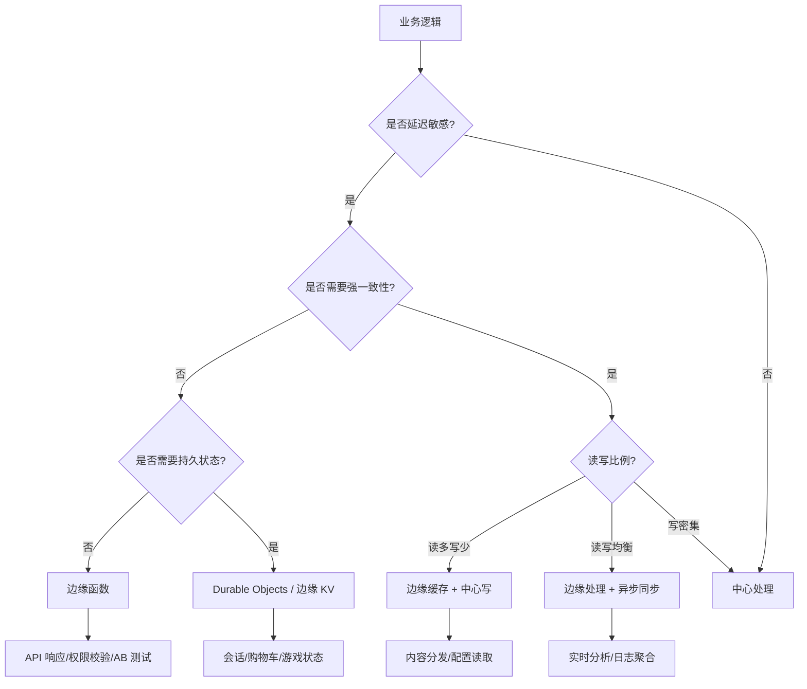

# 边缘优先架构设计方法论

> 分析日期: 2026-04-21
> 目标读者: 云架构师、全栈工程师、DevOps 工程师
> 前置知识: HTTP、CDN、Serverless、TypeScript

---

## 目录

- [边缘优先架构设计方法论](#边缘优先架构设计方法论)
  - [目录](#目录)
  - [1. 什么是边缘优先架构？](#1-什么是边缘优先架构)
    - [1.1 定义](#11-定义)
    - [1.2 为什么需要边缘优先？](#12-为什么需要边缘优先)
  - [2. 边缘计算的技术基础](#2-边缘计算的技术基础)
    - [2.1 V8 Isolates：边缘计算的底层技术](#21-v8-isolates边缘计算的底层技术)
    - [2.2 边缘运行时对比](#22-边缘运行时对比)
    - [2.3 有状态边缘：Durable Objects](#23-有状态边缘durable-objects)
  - [3. 边缘 vs 中心：决策框架](#3-边缘-vs-中心决策框架)
    - [3.1 决策树](#31-决策树)
    - [3.2 场景矩阵](#32-场景矩阵)
  - [4. 架构模式](#4-架构模式)
    - [4.1 边缘渲染 (Edge SSR)](#41-边缘渲染-edge-ssr)
    - [4.2 边缘 API 网关](#42-边缘-api-网关)
    - [4.3 边缘缓存层 (Stale-While-Revalidate)](#43-边缘缓存层-stale-while-revalidate)
    - [4.4 边缘-中心混合架构](#44-边缘-中心混合架构)
  - [5. 数据一致性策略](#5-数据一致性策略)
    - [5.1 边缘数据一致性的挑战](#51-边缘数据一致性的挑战)
    - [5.2 一致性模型选择](#52-一致性模型选择)
    - [5.3 实现模式](#53-实现模式)
  - [6. 安全模型](#6-安全模型)
    - [6.1 边缘安全的多层防御](#61-边缘安全的多层防御)
    - [6.2 密钥管理](#62-密钥管理)
  - [7. 成本模型分析](#7-成本模型分析)
    - [7.1 边缘 vs 中心的 TCO 对比](#71-边缘-vs-中心的-tco-对比)
    - [7.2 冷启动 vs 保持温热的经济账](#72-冷启动-vs-保持温热的经济账)
  - [8. 实施路线图](#8-实施路线图)
    - [阶段 1：边缘缓存（1-2 周）](#阶段-1边缘缓存1-2-周)
    - [阶段 2：边缘函数（2-4 周）](#阶段-2边缘函数2-4-周)
    - [阶段 3：边缘渲染（4-8 周）](#阶段-3边缘渲染4-8-周)
    - [阶段 4：有状态边缘（8-12 周）](#阶段-4有状态边缘8-12-周)
  - [9. 总结](#9-总结)
    - [核心结论](#核心结论)
    - [关键决策原则](#关键决策原则)
  - [参考资源](#参考资源)

---

## 1. 什么是边缘优先架构？

### 1.1 定义

边缘优先架构（Edge-First Architecture）是一种将业务逻辑尽可能推向离用户最近的计算节点的设计哲学。

**核心原则**：

1. **延迟优先**：用户请求应在 50ms 内得到首次响应
2. **状态外置**：边缘节点无状态或仅有缓存状态，持久状态存储在中心
3. **渐进增强**：核心功能在边缘完成，增强功能回退到中心
4. **故障隔离**：单个边缘节点的故障不影响全局服务

### 1.2 为什么需要边缘优先？

**传统架构的问题**：

```
用户 (上海) → DNS → CDN (上海) → 源站 (美西 AWS us-west-2)
                                    ↓
                              往返延迟: ~150ms
```

**边缘优先架构**：

```
用户 (上海) → DNS → CDN (上海) → 边缘函数 (上海) → 边缘缓存/边缘数据库
                                    ↓
                              往返延迟: ~20ms
```

**关键数据**：

- 亚马逊研究：每增加 100ms 延迟，转化率下降 1%
- Google 研究：页面加载时间从 1s 增加到 3s，跳出率增加 32%
- 2025 年数据：边缘函数采用率同比增长 **287%**

---

## 2. 边缘计算的技术基础

### 2.1 V8 Isolates：边缘计算的底层技术

Cloudflare Workers 和 Deno Deploy 使用 V8 Isolates 作为运行沙盒：

| 特性 | V8 Isolates | 容器 (Docker) | VM (AWS EC2) |
|------|-------------|---------------|--------------|
| **启动时间** | <1ms | 100ms-数秒 | 分钟级 |
| **内存隔离** | 进程级 | 操作系统级 | 硬件级 |
| **资源开销** | 极低 | 中 | 高 |
| **多租户** | 单进程多 Isolate | 需编排器 | 需虚拟化 |
| **冷启动** | <5ms | 秒级 | 分钟级 |

**关键洞察**：V8 Isolates 的启动速度比容器快 **100-1000 倍**，这使得「每个请求一个 Isolate」成为可能。

### 2.2 边缘运行时对比

| 平台 | 运行时 | 冷启动 | 持久状态方案 | 定价模型 |
|------|--------|--------|-------------|---------|
| **Cloudflare Workers** | V8 Isolates | <5ms | Durable Objects / D1 / KV | $5/1000万次请求 |
| **Vercel Edge** | Node.js 子集 | ~50ms | KV / Edge Config | 按使用量 |
| **Deno Deploy** | Deno 2 | ~20ms | Deno KV | 按使用量 |
| **Netlify Edge** | Deno | ~30ms | Blob Store | 按使用量 |
| **AWS Lambda@Edge** | Node.js | ~100ms | CloudFront 缓存 | 按请求+时长 |

### 2.3 有状态边缘：Durable Objects

Cloudflare Durable Objects 是边缘计算的突破：

```
传统边缘函数：无状态
  → 每次请求独立处理
  → 无法维护会话、购物车、游戏状态

Durable Objects：有状态边缘
  → 每个 Object 有唯一 ID
  → 状态持久化在边缘（自动复制到 3 个数据中心）
  → 支持 WebSocket（长连接）
```

**使用场景**：

- 实时协作（多人编辑、白板）
- 游戏状态同步
- 聊天室
- 购物车（边缘缓存 + 中心持久化）

---

## 3. 边缘 vs 中心：决策框架

### 3.1 决策树



### 3.2 场景矩阵

| 场景 | 边缘适用性 | 原因 | 推荐方案 |
|------|-----------|------|---------|
| **API 响应组装** | ⭐⭐⭐⭐⭐ | 低延迟、无状态 | 边缘函数 |
| **权限校验 (JWT)** | ⭐⭐⭐⭐⭐ | 计算轻量、延迟敏感 | 边缘中间件 |
| **AB 测试分流** | ⭐⭐⭐⭐⭐ | 需快速决策 | 边缘函数 |
| **内容个性化** | ⭐⭐⭐⭐ | 读多写少 | 边缘缓存 + 函数 |
| **地理定位服务** | ⭐⭐⭐⭐⭐ | 必须在边缘（知道用户位置） | 边缘函数 |
| **图片处理/压缩** | ⭐⭐⭐⭐ | CPU 密集型但延迟敏感 | 边缘函数 |
| **购物车** | ⭐⭐⭐ | 需持久化，但最终一致可接受 | Durable Objects |
| **支付处理** | ⭐ | 强一致性、合规要求 | 中心服务 |
| **数据分析** | ⭐⭐ | 批处理、非延迟敏感 | 中心异步处理 |
| **机器学习推理** | ⭐⭐⭐ | 模型大小限制 | 边缘 WASM / 小型模型 |

---

## 4. 架构模式

### 4.1 边缘渲染 (Edge SSR)

```
用户请求
  → CDN 边缘节点
    → 边缘函数获取用户偏好（语言、主题）
    → 从边缘缓存读取页面模板
    → 组装 HTML（边缘渲染）
    → 返回用户

延迟: 20-50ms（vs 传统 SSR 的 200-500ms）
```

**框架支持**：

- Next.js：Edge SSR + Streaming
- Nuxt：Edge SSR + Nitro
- SvelteKit：Adapter 模式（cloudflare-workers）

### 4.2 边缘 API 网关

```
客户端
  → 边缘函数（API 网关）
    ├── 认证校验 (JWT 验证)
    ├── 速率限制 (Token Bucket)
    ├── 请求路由 (/api/users → 用户服务)
    ├── 请求转换 (GraphQL → REST)
    └── 缓存控制 (Cache-Control 策略)
  → 后端微服务（中心）
```

**优势**：

- 认证在边缘完成，减少后端压力
- 恶意请求在边缘拦截，保护后端
- 缓存命中时直接返回，不穿透到后端

### 4.3 边缘缓存层 (Stale-While-Revalidate)

```
边缘缓存策略:
  Cache-Control: max-age=60, stale-while-revalidate=3600

含义:
  - 60 秒内：直接返回缓存（不接触后端）
  - 60-3660 秒：返回缓存（stale），同时在后台重新验证
  - 超过 3660 秒：等待后端响应
```

**适用场景**：

- 商品详情页（价格变化不频繁）
- 新闻文章（内容不变，评论实时）
- 配置信息（低频更新）

### 4.4 边缘-中心混合架构

```
┌─────────────────────────────────────────┐
│           边缘层 (全球 300+ 节点)         │
│  ┌─────────┐ ┌─────────┐ ┌─────────┐   │
│  │ 边缘函数 │ │ 边缘缓存 │ │ Durable │   │
│  │ (SSR/网关)│ │ (KV/R2) │ │ Objects │   │
│  └────┬────┘ └────┬────┘ └────┬────┘   │
│       └───────────┴───────────┘         │
│                   │                     │
│              边缘→中心同步               │
└───────────────────┬─────────────────────┘
                    │
┌───────────────────▼─────────────────────┐
│           中心层 (2-3 区域)              │
│  ┌─────────┐ ┌─────────┐ ┌─────────┐   │
│  │ API 服务 │ │ 数据库  │ │ 消息队列 │   │
│  │ (业务逻辑)│ │ (PostgreSQL)│ │ (Kafka) │   │
│  └─────────┘ └─────────┘ └─────────┘   │
└─────────────────────────────────────────┘
```

---

## 5. 数据一致性策略

### 5.1 边缘数据一致性的挑战

边缘节点的分布式特性导致数据一致性难题：

```
用户 A (东京) 修改购物车
  → 写入东京边缘节点
  → 异步同步到新加坡、法兰克福

用户 A (切换到新加坡 CDN) 读取购物车
  → 可能读取到旧数据（同步延迟）
```

### 5.2 一致性模型选择

| 模型 | 一致性级别 | 延迟 | 适用场景 |
|------|-----------|------|---------|
| **强一致性** | 读写都等待同步 | 高 | 支付、库存 |
| **最终一致性** | 读取可能旧数据，最终会一致 | 低 | 购物车、评论 |
| **因果一致性** | 相关操作按顺序可见 | 中 | 聊天、协作编辑 |
| **读己之写** | 用户自己的写操作立即可见 | 低 | 个人设置 |

### 5.3 实现模式

**模式 1：边缘写 + 异步中心持久化**

```typescript
// 边缘函数
export async function addToCart(request: Request) {
  const { userId, productId } = await request.json();

  // 1. 写入边缘缓存（立即响应用户）
  await CART_KV.put(`cart:${userId}`, JSON.stringify(cart));

  // 2. 异步发送到中心（不阻塞响应）
  ctx.waitUntil(
    fetch("https://api.center.com/cart", {
      method: "POST",
      body: JSON.stringify({ userId, productId }),
    })
  );

  return new Response("Added", { status: 200 });
}
```

**模式 2：Durable Objects（有状态边缘）**

```typescript
// Durable Object：每个购物车是一个 Object
export class Cart {
  async fetch(request: Request) {
    const url = new URL(request.url);

    if (url.pathname === "/add") {
      const { productId } = await request.json();
      const cart = await this.storage.get("cart") || [];
      cart.push(productId);
      await this.storage.put("cart", cart);
      return new Response(JSON.stringify(cart));
    }

    // 读操作直接从本地状态返回
    const cart = await this.storage.get("cart") || [];
    return new Response(JSON.stringify(cart));
  }
}
```

---

## 6. 安全模型

### 6.1 边缘安全的多层防御

```
第一层: DDoS 防护（Cloudflare/AWS Shield）
  → 边缘网络自动吸收攻击流量

第二层: WAF（Web Application Firewall）
  → 边缘规则拦截 SQL 注入、XSS

第三层: 边缘认证（JWT 验证）
  → 在请求到达后端前验证身份

第四层: 速率限制（Token Bucket）
  → 边缘计数，防止暴力攻击

第五层: 后端服务
  → 最小权限原则，仅接受来自边缘的请求
```

### 6.2 密钥管理

边缘环境中的密钥管理挑战：

**问题**：边缘函数代码部署到全球节点，如何安全存储 API Key？

**解决方案**：

1. **环境变量加密**：平台提供加密的环境变量（Cloudflare Workers Secrets）
2. **短期令牌**：边缘函数从中心获取短期令牌（STS），而非长期 API Key
3. **密钥轮换**：自动轮换密钥，边缘函数透明获取最新密钥

```typescript
// Cloudflare Workers Secrets
const API_KEY = process.env.API_KEY; // 加密存储，仅运行时解密

// 短期令牌模式
async function getTemporaryToken() {
  const response = await fetch("https://auth.center.com/token", {
    headers: { "X-Edge-Secret": process.env.EDGE_SECRET },
  });
  return response.json();
}
```

---

## 7. 成本模型分析

### 7.1 边缘 vs 中心的 TCO 对比

| 成本项 | 传统中心架构 | 边缘优先架构 | 说明 |
|--------|-------------|-------------|------|
| **计算成本** | $50/月 (EC2) | $5/月 (Workers) | 按请求计费，低频请求极便宜 |
| **带宽成本** | $100/月 (出站) | $20/月 (CDN) | 缓存命中减少源站带宽 |
| **运维成本** | 高（服务器维护） | 极低（无服务器） | 无需补丁、扩容、监控 |
| **开发成本** | 中 | 中 | 需要学习边缘编程模型 |
| **总成本** | $150+/月 | $25+/月 | 边缘架构通常更便宜 |

### 7.2 冷启动 vs 保持温热的经济账

**Serverless 的冷启动问题**：

- 边缘函数：冷启动 <5ms，几乎无感知
- 传统 Serverless（Lambda）：冷启动 100ms-数秒

**保持温热的成本**：

- Cloudflare Workers：99.99% 热请求率，无需额外付费
- AWS Lambda：Provisioned Concurrency，$20/月/1GB

**结论**：边缘函数的冷启动成本远低于传统 Serverless。

---

## 8. 实施路线图

### 阶段 1：边缘缓存（1-2 周）

- 为静态资源配置 CDN 缓存策略
- 为 API 响应添加 Cache-Control 头
- **风险**：极低

### 阶段 2：边缘函数（2-4 周）

- 将认证中间件迁移到边缘
- 实现边缘 API 网关（路由、限流）
- **风险**：低

### 阶段 3：边缘渲染（4-8 周）

- 将 SSR 逻辑迁移到边缘函数
- 实现边缘个性化（A/B 测试、地理定位）
- **风险**：中（需处理边缘环境限制）

### 阶段 4：有状态边缘（8-12 周）

- 评估 Durable Objects / Deno KV 的适用场景
- 迁移购物车、会话等状态到边缘
- **风险**：高（数据一致性复杂）

---

## 9. 总结

### 核心结论

1. **边缘优先是延迟驱动的必然选择**：对于延迟敏感的业务，边缘计算不是「可选项」，而是「必选项」
2. **V8 Isolates 使边缘计算成为现实**：<5ms 冷启动让「每个请求一个函数」成为可能
3. **数据一致性是最大挑战**：边缘架构需要接受最终一致性，强一致性场景仍需回退到中心
4. **成本优势显著**：边缘架构的 TCO 通常比传统架构低 50-80%

### 关键决策原则

- **延迟 < 50ms**：必须在边缘
- **50ms < 延迟 < 200ms**：优先边缘，可接受中心回退
- **延迟 > 200ms**：中心处理即可
- **强一致性需求**：回退到中心
- **写密集操作**：评估 Durable Objects 或回退到中心

---

## 参考资源

- [Cloudflare Workers 文档](https://developers.cloudflare.com/workers/)
- [Vercel Edge Functions](https://vercel.com/docs/functions/edge-functions)
- [Deno Deploy](https://deno.com/deploy)
- [The Edge Computing Landscape](https://www.cloudflare.com/learning/serverless/what-is-edge-computing/)
- [Durable Objects 设计模式](https://developers.cloudflare.com/durable-objects/)
