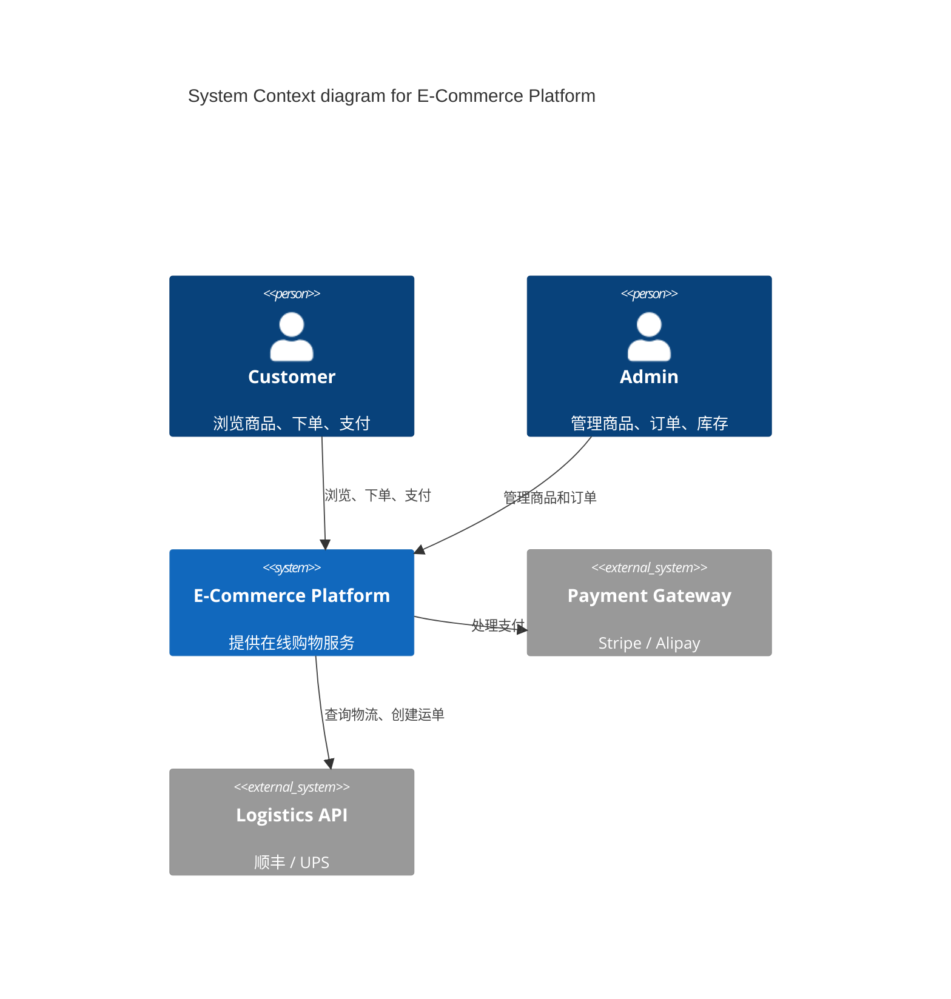

> **四维分类说明**：本路径覆盖「应用领域」和「技术基础设施」的架构设计，包含分布式系统、技术选型 ADR 与大规模生产部署决策。

# 架构师学习路径（已迁移）

> 本文档内容已整合至 [`advanced-path.md`](./advanced-path.md)，作为单一事实来源维护。
> 原 218 行内容已合并到 640 行的完整版本中。

---

## 职业阶段演进表

| 阶段 | 年限 | 核心能力 | 技术广度 | 决策影响范围 | 典型产出 |
|------|------|----------|----------|--------------|----------|
| **Junior Engineer** | 0–2 年 | 编码规范、调试、单元测试 | 1–2 个技术栈 | 模块级 | 功能实现、Bug 修复 |
| **Senior Engineer** | 3–6 年 | 系统设计、性能优化、技术债务管理 | 3–5 个技术栈 | 服务/子系统级 | 技术方案、代码审查、指导 |
| **Staff Engineer** | 7–12 年 | 跨团队技术策略、平台设计、标准化 | 全栈 + 基础设施 | 多团队/部门级 | RFC、平台架构、治理策略 |
| **Principal Engineer** | 12+ 年 | 组织技术愿景、行业影响力、前瞻性研究 | 多领域深度 + 广度 | 公司/行业级 | 技术蓝图、开源项目、专利 |

---

## 架构师能力矩阵

| 能力域 | Junior | Senior | Staff | Principal |
|--------|--------|--------|-------|-----------|
| **分布式系统** | 理解 CAP, 使用现有中间件 | 设计微服务拆分, 处理分区容错 | 设计多活架构, 一致性模型选型 | 定义组织级分布式规范 |
| **性能工程** | 使用 profiler, 修复热点 | 容量规划, 缓存策略设计 | 全局性能预算, SLA/SLO 定义 | 建立性能文化, 自研工具链 |
| **安全架构** | 遵循 OWASP Top 10 | 威胁建模, 安全审查 | 零信任架构, 供应链安全 | 安全标准制定, 漏洞响应体系 |
| **数据架构** | SQL/NoSQL 基础使用 | 分库分表, 索引优化 | 实时数仓, 事件溯源设计 | 数据治理, 隐私计算架构 |
| **组织治理** | 遵守代码规范 | 制定团队规范, 技术分享 | 跨团队标准化, 技术委员会 | 工程文化, 人才梯队建设 |
| **成本优化** | 理解资源计费 | 选型成本分析, 自动扩缩容 | FinOps 实践, 全局预算控制 | 云战略, 混合云成本模型 |

---

## 架构决策记录（ADR）模板

```markdown
# ADR-042: 采用 Kafka 作为事件总线

## 状态
- 提案日期: 2026-04-15
- 决策状态: 已接受
- 负责人: Staff Engineer — 李明

## 上下文
当前系统使用 REST 同步调用进行服务间通信，在订单峰值期间出现级联超时。
需要引入异步消息机制解耦核心链路。

## 决策
采用 Apache Kafka 作为组织级事件总线，替代 RabbitMQ 和自建队列方案。

## 后果
### 正面
- 吞吐量提升至 100K msg/s
- 持久化日志支持事件回放与审计
- 生态成熟，多语言客户端完善

### 负面
- 运维复杂度增加（ZooKeeper/KRaft 集群管理）
- 团队需学习流处理语义（at-least-once / exactly-once）

## 备选方案
| 方案 | 淘汰理由 |
|------|----------|
| RabbitMQ | 吞吐量上限 ~20K msg/s，不满足峰值需求 |
| AWS SQS |  vendor lock-in，本地开发环境难以复现 |
| NATS JetStream | 生态较小，社区中文资料不足 |

## 参考
- [Kafka Documentation](https://kafka.apache.org/documentation/)
- [Confluent — Kafka Design](https://www.confluent.io/blog/kafka-design/)
```

### ADR YAML Frontmatter 模板（自动化追踪）

```yaml
---
adrs:
  - id: "ADR-042"
    title: "采用 Kafka 作为事件总线"
    status: accepted
    date: "2026-04-15"
    owner: "staff-engineer-li"
    tags: ["messaging", "event-driven", "infrastructure"]
    stakeholders: ["platform-team", "backend-team"]
    context: "REST 同步调用导致级联超时"
    decision: "采用 Apache Kafka"
    consequences:
      positive: ["100K msg/s 吞吐", "事件回放", "多语言客户端"]
      negative: ["运维复杂度", "学习成本"]
    alternatives:
      - name: "RabbitMQ"
        reason_rejected: "吞吐不足"
      - name: "AWS SQS"
        reason_rejected: "Vendor lock-in"
    related_adrs: ["ADR-038", "ADR-041"]
    superseded_by: null
---
```

---

## 架构评审检查清单

```typescript
// scripts/arch-review-checklist.ts
interface ArchReviewChecklist {
  scalability: {
    horizontalScaling: boolean        // 是否支持水平扩展
    statelessness: boolean            // 服务是否无状态
    databasePartitioning: boolean     // 数据分片策略
  }
  reliability: {
    circuitBreaker: boolean           // 熔断机制
    retryWithBackoff: boolean         // 退避重试
    gracefulDegradation: boolean      // 优雅降级
  }
  security: {
    inputValidation: boolean          // 输入校验
    leastPrivilege: boolean           // 最小权限原则
    auditLogging: boolean             // 审计日志
  }
  observability: {
    structuredLogging: boolean        // 结构化日志
    distributedTracing: boolean       // 分布式追踪
    healthChecks: boolean             // 健康检查
  }
}

export const defaultChecklist: ArchReviewChecklist = {
  scalability: {
    horizontalScaling: true,
    statelessness: true,
    databasePartitioning: false,
  },
  reliability: {
    circuitBreaker: true,
    retryWithBackoff: true,
    gracefulDegradation: true,
  },
  security: {
    inputValidation: true,
    leastPrivilege: true,
    auditLogging: true,
  },
  observability: {
    structuredLogging: true,
    distributedTracing: true,
    healthChecks: true,
  },
}
```

### 自动化架构评审脚本

```typescript
// scripts/run-arch-review.ts
import { defaultChecklist } from './arch-review-checklist';

interface ReviewResult {
  category: string;
  passed: boolean;
  items: { item: string; passed: boolean; note?: string }[];
}

function runReview(checklist = defaultChecklist): ReviewResult[] {
  return Object.entries(checklist).map(([category, items]) => {
    const itemResults = Object.entries(items).map(([item, passed]) => ({
      item,
      passed,
      note: passed ? undefined : `REQUIRED: ${item} must be addressed`,
    }));

    return {
      category,
      passed: itemResults.every(i => i.passed),
      items: itemResults,
    };
  });
}

// CLI 输出
const results = runReview();
let exitCode = 0;

for (const result of results) {
  const icon = result.passed ? '✅' : '❌';
  console.log(`\n${icon} ${result.category.toUpperCase()}`);
  for (const item of result.items) {
    const mark = item.passed ? '  ✓' : '  ✗';
    console.log(`${mark} ${item.item}${item.note ? ` — ${item.note}` : ''}`);
    if (!item.passed) exitCode = 1;
  }
}

process.exit(exitCode);
```

---

## 系统架构图即代码（Mermaid + Structurizr）

```markdown
# 系统上下文图（C4 Model Level 1）



```

```typescript
// structurizr.dsl — C4 Model as Code
workspace {
  model {
    customer = person "Customer" "浏览商品、下单、支付"
    admin = person "Admin" "管理商品、订单、库存"

    ecommerce = softwareSystem "E-Commerce Platform" {
      webApp = container "Web App" "Next.js" "React 19, TypeScript"
      apiGateway = container "API Gateway" "Kong" "路由、限流、认证"
      orderService = container "Order Service" "Node.js" "业务逻辑"
      paymentWorker = container "Payment Worker" "BullMQ" "异步支付处理"
      database = container "Database" "PostgreSQL" "主数据存储"
      cache = container "Cache" "Redis" "会话、热点数据"
    }

    paymentGateway = softwareSystem "Payment Gateway" "Stripe / Alipay" "External"
    logisticsAPI = softwareSystem "Logistics API" "顺丰 / UPS" "External"

    customer -> webApp "浏览、下单"
    admin -> webApp "管理后台"
    webApp -> apiGateway "API 调用"
    apiGateway -> orderService "转发请求"
    orderService -> database "读写"
    orderService -> cache "缓存"
    orderService -> paymentWorker "触发支付"
    paymentWorker -> paymentGateway "处理支付"
    orderService -> logisticsAPI "查询物流"
  }

  views {
    systemContext ecommerce {
      include *
      autolayout lr
    }
    container ecommerce {
      include *
      autolayout lr
    }
  }
}
```

---

## 推荐资源表

| 阶段 | 类型 | 资源名称 | 链接 | 重点 |
|------|------|----------|------|------|
| Senior→Staff | 书籍 | *Designing Data-Intensive Applications* (Martin Kleppmann) | [Amazon](https://www.amazon.com/Designing-Data-Intensive-Applications-Reliable-Maintainable/dp/1449373321) | 分布式系统理论基石 |
| Senior→Staff | 书籍 | *Building Microservices* (Sam Newman) | [O'Reilly](https://www.oreilly.com/library/view/building-microservices-2nd/9781492034018/) | 微服务设计模式 |
| Senior→Staff | 论文 | Dynamo: Amazon's Highly Available Key-value Store | [ACM](https://dl.acm.org/doi/10.1145/1323293.1294281) | 最终一致性实践 |
| Senior→Staff | 论文 | MapReduce: Simplified Data Processing | [Google Research](https://research.google/pubs/mapreduce-simplified-data-processing-on-large-clusters/) | 批处理范式 |
| Staff→Principal | 书籍 | *Software Architecture: The Hard Parts* (Neal Ford et al.) | [O'Reilly](https://www.oreilly.com/library/view/software-architecture-the/9781492086888/) | 权衡分析与决策 |
| Staff→Principal | 书籍 | *The Architecture of Open Source Applications* | [aosabook.org](http://aosabook.org/en/index.html) | 真实系统架构解剖 |
| Staff→Principal | 课程 | MIT 6.824: Distributed Systems | [MIT OCW](https://pdos.csail.mit.edu/6.824/) | 学术深度 + 工程实践 |
| Staff→Principal | 标准 | AWS Well-Architected Framework | [AWS Docs](https://docs.aws.amazon.com/wellarchitected/latest/framework/welcome.html) | 云架构最佳实践 |
| All Levels | 社区 | System Design Primer (GitHub) | [GitHub](https://github.com/donnemartin/system-design-primer) | 面试与实战结合 |
| All Levels | 博客 | High Scalability | [highscalability.com](http://highscalability.com/) | 大厂架构案例 |
| All Levels | 工具 | ADR (Architecture Decision Records) | [adr.github.io](https://adr.github.io/) | 决策可审计化 |
| All Levels | 认证 | TOGAF / AWS SA Professional / CKA | [TOGAF](https://www.opengroup.org/togaf) / [AWS](https://aws.amazon.com/certification/certified-solutions-architect-professional/) | 体系化知识验证 |

---

## 权威外部链接

- [Martin Fowler — Software Architecture Guide](https://martinfowler.com/architecture/) — 软件架构概念权威解读
- [AWS Well-Architected Framework](https://docs.aws.amazon.com/wellarchitected/latest/framework/welcome.html) — 云架构六大支柱最佳实践
- [Google SRE Book](https://sre.google/sre-book/table-of-contents/) — 站点可靠性工程经典
- [MIT 6.824 Distributed Systems](https://pdos.csail.mit.edu/6.824/) — 分布式系统学术课程
- [Martin Kleppmann — Designing Data-Intensive Applications](https://dataintensive.net/) — DDIA 作者主页
- [Confluent — Kafka Design](https://www.confluent.io/blog/kafka-design/) — Kafka 架构设计权威博客
- [CNCF Cloud Native Trail Map](https://www.cncf.io/trail-map/) — 云原生技术栈全景图
- [DORA — State of DevOps Reports](https://dora.dev/) — DevOps 研究与评估（Google）
- [OWASP Cheat Sheet Series](https://cheatsheetseries.owasp.org/) — 安全架构速查表
- [Azure Architecture Center](https://learn.microsoft.com/en-us/azure/architecture/) — 微软云架构模式库
- [C4 Model for Visualising Software Architecture](https://c4model.com/) — Simon Brown 的软件架构可视化方法
- [Structurizr DSL](https://docs.structurizr.com/dsl) — C4 Model 即代码工具
- [Mermaid Diagrams](https://mermaid.js.org/) — Markdown 原生图表语法
- [Architecture Decision Records (ADR)](https://adr.github.io/) — 架构决策记录方法论
- [ThoughtWorks Technology Radar](https://www.thoughtworks.com/radar) — 技术趋势雷达
- [InfoQ Architecture & Design](https://www.infoq.com/architecture-design/) — 架构设计新闻与案例
- [ACM Queue — System Design](https://queue.acm.org/) — 系统设计与工程实践期刊
- [Google Cloud Architecture Center](https://cloud.google.com/architecture) — GCP 架构最佳实践
- [Kubernetes Documentation](https://kubernetes.io/docs/concepts/architecture/) — K8s 架构概念
- [Istio Service Mesh](https://istio.io/latest/docs/concepts/what-is-istio/) — 服务网格架构
- [AWS Architecture Icons](https://aws.amazon.com/architecture/icons/) — 官方架构图标
- [The Twelve-Factor App](https://12factor.net/) — 云原生应用方法论
- [Domain-Driven Design Reference](https://domainlanguage.com/wp-content/uploads/2016/05/DDD_Reference_2015-03.pdf) — Eric Evans DDD 参考
- [Event Storming](https://www.eventstorming.com/) — 领域事件风暴工作坊
- [Team Topologies](https://teamtopologies.com/) — 团队拓扑与组织设计

---

## 快速导航

- [分布式系统理论](./advanced-path.md#第一阶段分布式系统理论-3-周)
- [微服务与云原生](./advanced-path.md#第二阶段微服务与云原生-2-周)
- [形式化验证](./advanced-path.md#第三阶段形式化验证-2-周)
- [前沿技术](./advanced-path.md#第四阶段前沿技术-3-周)
- [架构师思维](./advanced-path.md#第五阶段架构师思维-2-周)
- [里程碑验证机制](./advanced-path.md#里程碑验证机制)

---

> 📦 归档说明：本文档作为兼容性入口保留，不再独立更新。所有架构师路径内容请访问上述链接。
