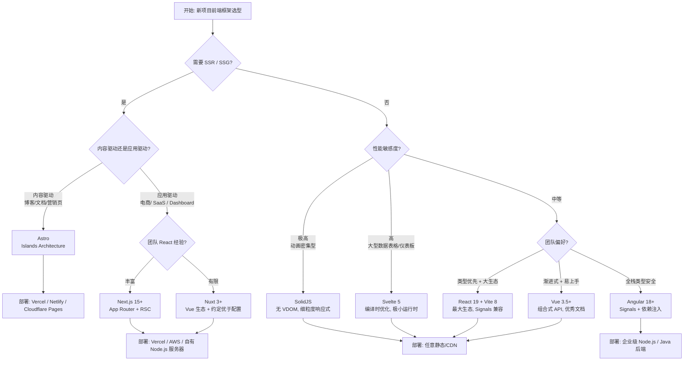
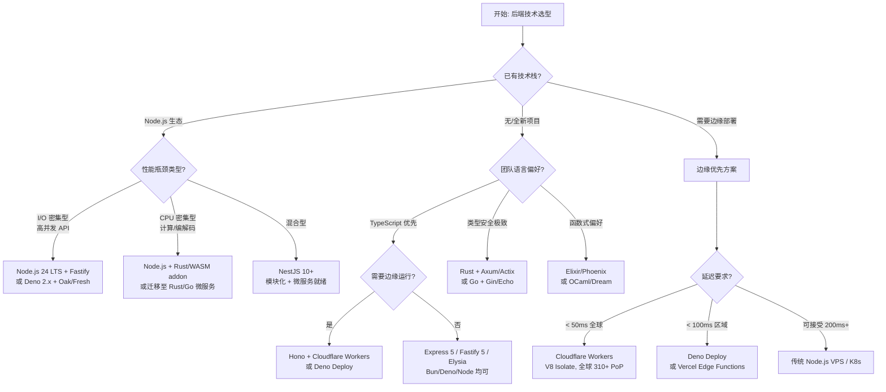
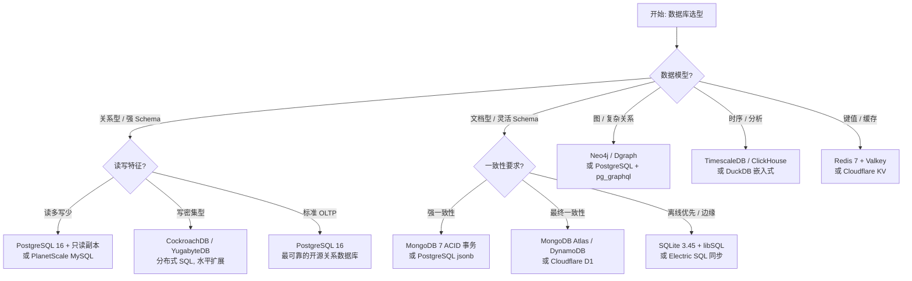
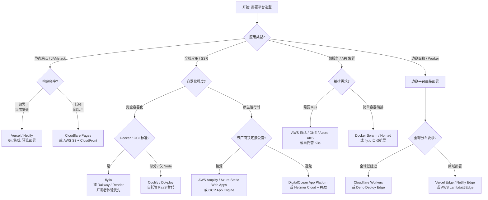

# 决策树总览

> 技术选型决策树的顶层导航与可视化决策流程。

---

## 决策树分类

| 类别 | 位置 | 决策维度 | 更新状态 |
|------|------|---------|---------|
| **前端框架** | `30.1-guides/decision-trees.md` | 应用类型、团队规模、性能要求、生态成熟度 | 2026-Q2 |
| **状态管理** | `30.2-categories/04-state-management.md` | 应用规模、持久化需求、跨平台需求、调试需求 | 2026-Q2 |
| **构建工具** | `30.3-comparison-matrices/js-ts-compilers-compare.md` | 项目规模、兼容性要求、CI 速度、插件生态 | 2026-Q2 |
| **部署平台** | `30.2-categories/09-deployment-platforms.md` | 流量模式、合规要求、预算、团队运维能力 | 2026-Q2 |
| **包管理器** | `30.2-categories/07-package-managers.md` | 工作区支持、磁盘效率、锁文件策略、生态兼容性 | 2026-Q2 |

---

## 1. 前端框架选型决策树

### 关键决策因子权重

| 因子 | Astro | Next.js | Nuxt | SolidJS | Svelte | React 19 | Vue 3.5 | Angular |
|------|-------|---------|------|---------|--------|----------|---------|---------|
| 学习曲线 (低=优) | ★★★★★ | ★★★☆☆ | ★★★★☆ | ★★★☆☆ | ★★★★★ | ★★★☆☆ | ★★★★★ | ★★☆☆☆ |
| SSR/SSG 能力 | ★★★★★ | ★★★★★ | ★★★★★ | ★★★☆☆ | ★★★★☆ | ★★★★★ | ★★★★☆ | ★★★★☆ |
| 运行时性能 | ★★★★★ | ★★★★☆ | ★★★★☆ | ★★★★★ | ★★★★★ | ★★★☆☆ | ★★★★☆ | ★★★☆☆ |
| 生态成熟度 | ★★★★☆ | ★★★★★ | ★★★★☆ | ★★☆☆☆ | ★★★★☆ | ★★★★★ | ★★★★★ | ★★★★☆ |
| TypeScript 集成 | ★★★★☆ | ★★★★★ | ★★★★★ | ★★★★★ | ★★★★★ | ★★★★★ | ★★★★★ | ★★★★★ |

---

## 2. 后端运行时与框架选型决策树

### 后端方案对比表

| 场景 | 推荐方案 | 吞吐量 (req/s) | 冷启动 | 适用规模 |
|------|---------|---------------|--------|---------|
| 高并发 REST API | Node.js 24 + Fastify | ~80k | N/A | 中-大 |
| 全栈 TypeScript | NestJS 10 + Prisma | ~30k | N/A | 大-企业 |
| 边缘 API / 中间件 | Hono + Cloudflare Workers | ~50k | ~0ms | 小-大 |
| 极致性能服务 | Rust + Axum | ~120k | N/A | 中-大 |
| Serverless 函数 | AWS Lambda + Node 22 | ~视并发而定 | ~150ms | 小-中 |
| 实时/WebSocket | Deno 2 + native WS | ~60k | N/A | 中 |

---

## 3. 数据库选型决策树

### 数据库选型矩阵

| 需求 | PostgreSQL | MySQL/PlanetScale | MongoDB | SQLite | Redis | CockroachDB |
|------|-----------|-------------------|---------|--------|-------|-------------|
| 复杂查询 | ★★★★★ | ★★★★☆ | ★★★☆☆ | ★★★★☆ | ★☆☆☆☆ | ★★★★☆ |
| 水平扩展 | ★★★☆☆ | ★★★★☆ | ★★★★★ | ★☆☆☆☆ | ★★★★★ | ★★★★★ |
| 边缘/嵌入式 | ★★☆☆☆ | ★☆☆☆☆ | ★☆☆☆☆ | ★★★★★ | ★★☆☆☆ | ★☆☆☆☆ |
| JSON 灵活性 | ★★★★★ | ★★★☆☆ | ★★★★★ | ★★★☆☆ | ★★★☆☆ | ★★★★☆ |
| 全托管方案 | Supabase / Neon | PlanetScale | MongoDB Atlas | Cloudflare D1 | Upstash | CockroachCloud |

---

## 4. 部署与托管平台决策树

### 平台选型成本对比 (月度估算, 中小型项目)

| 平台 | 免费 tier | 起步成本 | 扩展成本 | 全球 CDN | 最佳场景 |
|------|----------|---------|---------|---------|---------|
| **Vercel** |  generous | $20/月 | 按带宽 | 自动 | Next.js SSR, 预览部署 |
| **Netlify** |  generous | $19/月 | 按带宽 | 自动 | 静态站点, 表单处理 |
| **Cloudflare Pages** |  unlimited 请求 | $5/月 | 按 Worker 调用 | 全球 310+ PoP | 边缘渲染, 高流量静态 |
| **fly.io** |  $5/月 credit | ~$2/月/VM | 按 VM + 带宽 | 可选 | Docker 容器, 全球部署 |
| **Railway** |  $5/月 credit | ~$5/月 | 按资源 | 无 | 快速原型, PostgreSQL 内置 |
| **Render** |  generous | $7/月 | 按实例 | 无 | 全栈应用, 后台 Worker |
| **AWS Amplify** |  12 个月免费 | 按用量 | 按用量 | CloudFront | AWS 生态集成 |
| **Hetzner Cloud** |  无 | €5/月 | 线性 | 无 | 成本敏感, 自管理 |

---

## 权威链接

- [ThoughtWorks Technology Radar 2026](https://www.thoughtworks.com/radar) — 企业技术选型趋势权威参考。
- [State of JS 2025](https://stateofjs.com/) — 全球开发者框架与工具采用率调查。
- [State of DevOps Report](https://dora.dev/) — Google DORA 团队发布的 DevOps 效能研究。
- [DB-Engines Ranking](https://db-engines.com/en/ranking) — 数据库流行度月度排名。
- [Cloudflare Radar](https://radar.cloudflare.com/) — 全球互联网趋势与边缘部署洞察。
- [Web Framework Benchmarks](https://www.techempower.com/benchmarks/) — TechEmpower 后端框架性能基准测试。
- [JS Framework Benchmark](https://krausest.github.io/js-framework-benchmark/) — 前端框架运行时性能对比。
- [StackShare Trends](https://stackshare.io/trending/tools) — 企业技术栈实际采用趋势。
- [Serverless Patterns](https://serverlessland.com/patterns) — AWS 无服务器架构模式库。

---

*最后更新: 2026-04-29*
