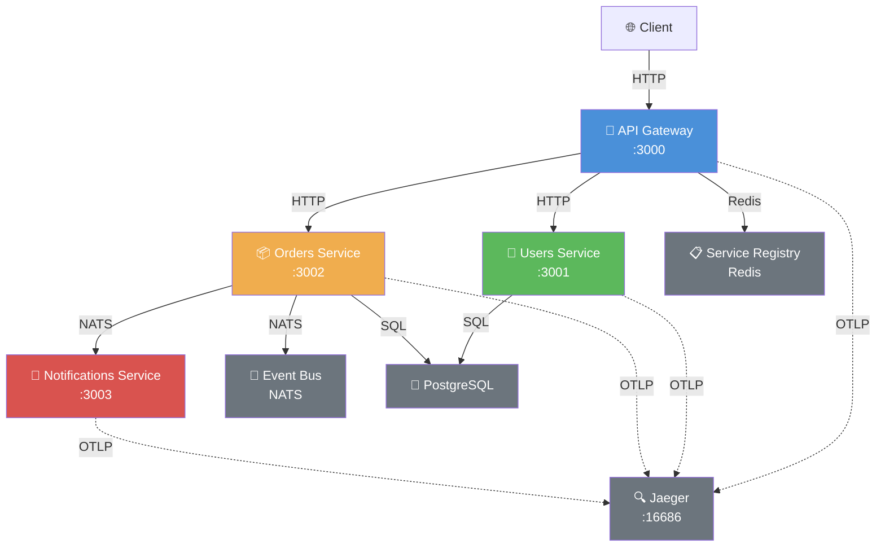

# Intermediate Microservice Workshop

> 中级开发者进阶实战：从零构建 Node.js/TypeScript 微服务系统

## 🎯 教学目标

本工作坊通过 **4 个渐进式里程碑**，帮助中级开发者掌握分布式系统核心概念：

1. **API Gateway** — 路由聚合、统一认证、速率限制
2. **Service Discovery** — 基于 Redis 的服务注册与动态发现
3. **Event Bus** — NATS 发布订阅、事件持久化、死信队列
4. **Distributed Tracing** — OpenTelemetry 全链路追踪

## 🏗️ 系统架构总览



## 📋 端口分配表

| 服务 | 端口 | 说明 |
|------|------|------|
| API Gateway | 3000 | 统一入口，路由聚合 |
| Users Service | 3001 | 用户管理 |
| Orders Service | 3002 | 订单管理 |
| Notifications Service | 3003 | 通知服务 |
| Redis | 6379 | 服务注册、缓存 |
| PostgreSQL | 5432 | 业务数据 |
| NATS | 4222 / 8222 | 消息总线 / 监控 |
| Jaeger UI | 16686 | 链路追踪可视化 |
| Jaeger OTLP | 4318 | Trace 接收端点 |

## 🚀 快速启动

### 前置要求

- Node.js >= 20
- Docker + Docker Compose
- pnpm 或 npm

### 1. 启动基础设施

```bash
# 启动 NATS、Redis、PostgreSQL、Jaeger
docker-compose up -d

# 验证状态
docker-compose ps
```

### 2. 运行各里程碑

```bash
# Milestone 1: API Gateway + 下游服务
npm run m1

# Milestone 2: 加入服务发现
npm run m2

# Milestone 3: 加入事件总线
npm run m3

# Milestone 4: 加入分布式追踪
npm run m4
```

### 3. 验证

| 里程碑 | 测试命令 |
|--------|----------|
| M1 | `curl http://localhost:3000/health` |
| M2 | `curl http://localhost:3000/users`（动态路由） |
| M3 | `curl -X POST http://localhost:3000/orders` |
| M4 | 打开 <http://localhost:16686> 查看链路 |

## 📁 项目结构

```
examples/intermediate-microservice-workshop/
├── README.md                     # 本文件：系统总览
├── MILESTONES.md                 # 里程碑学习指南
├── docker-compose.yml            # 基础设施编排
├── package.json                  # 根项目配置
├── tsconfig.json                 # TypeScript 配置
├── .env.example                  # 环境变量模板
├── milestone-01-api-gateway/     # 里程碑 1
├── milestone-02-service-discovery/  # 里程碑 2
├── milestone-03-event-bus/       # 里程碑 3
└── milestone-04-distributed-tracing/ # 里程碑 4
```

## 🧪 测试

```bash
# 运行所有测试
npm test

# 测试单个里程碑
cd milestone-01-api-gateway && npx vitest
```

## 📚 学习路径建议

| 顺序 | 里程碑 | 核心概念 | 预计耗时 |
|------|--------|----------|----------|
| 1 | API Gateway | 反向代理、中间件、认证授权 | 2h |
| 2 | Service Discovery | 注册中心、心跳、动态负载均衡 | 1.5h |
| 3 | Event Bus | 异步通信、事件驱动、可靠性 | 2h |
| 4 | Distributed Tracing | 可观测性、Span、Trace Context | 1.5h |

## 🔗 相关资源

- [Fastify 官方文档](https://fastify.dev/)
- [NATS 文档](https://docs.nats.io/)
- [OpenTelemetry JS](https://opentelemetry.io/docs/instrumentation/js/)
- [Jaeger 追踪](https://www.jaegertracing.io/)

## 📄 License

MIT — 隶属于 [JavaScript/TypeScript 全景知识库](../../README.md)


---

## 🔗 关联知识库模块

完成本项目后，建议深入以下代码实验室与理论文档：

| 模块 | 路径 | 与本项目的关联 |
|------|------|---------------|
| 架构模式 | `jsts-code-lab/06-architecture-patterns/` | 微服务架构、API Gateway、事件驱动架构 |
| 分布式系统 | `jsts-code-lab/70-distributed-systems/` | CAP 定理、一致性算法、服务发现 |
| 并发模型 | `jsts-code-lab/03-concurrency/` | Event Loop、Worker Threads、异步流控制 |
| 可观测性 | `docs/categories/23-error-monitoring-logging.md` | OpenTelemetry、分布式追踪、结构化日志 |
| 后端框架 | `docs/categories/14-backend-frameworks.md` | Fastify、Express、NestJS 生态对比 |

> 📚 [返回知识库首页](../README.md)
