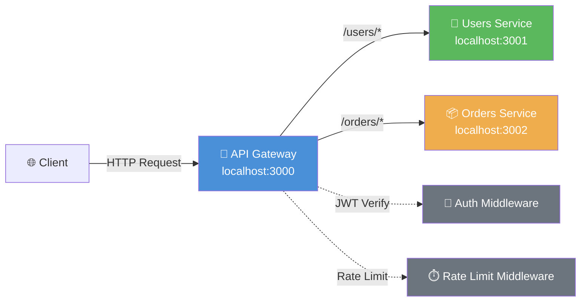

# Milestone 1: API Gateway

> 构建统一入口层：路由聚合、认证、速率限制

## 架构图



## 运行步骤

```bash
# 1. 安装依赖
npm install

# 2. 启动所有服务
npm run dev

# 3. 验证（新终端）
curl http://localhost:3000/health
curl http://localhost:3000/users
curl http://localhost:3000/orders

# 4. 获取 JWT Token
curl -X POST http://localhost:3000/auth/login \
  -H "Content-Type: application/json" \
  -d '{"email":"alice@example.com","password":"secret"}'

# 5. 访问受保护路由
curl http://localhost:3000/users/profile \
  -H "Authorization: Bearer <token>"
```

## 关键设计决策

### 1. 路由聚合策略

- **前缀路由**：`/users/*` → users-service，`/orders/*` → orders-service
- **通配转发**：保留原始 HTTP 方法、Body、Header
- **请求 ID**：每个请求生成 UUID，贯穿全链路（为后续 Tracing 铺垫）

### 2. JWT 验证中间件

- **无状态**：Gateway 本地验证 JWT，无需查询外部认证服务
- **传播**：将认证后的用户信息通过 Header 传播到下游（`x-user-id`, `x-user-role`）
- **降级**：公开路由（health, login）跳过验证

### 3. 速率限制策略

- **分层限流**：认证用户使用 userId，匿名用户使用 IP
- **429 响应**：包含 `Retry-After` 头部，符合 HTTP 规范
- **日志记录**：超限请求记录 WARN 级别日志，便于安全审计

### 4. 错误处理统一

- **集中式**：Fastify `setErrorHandler` 捕获所有未处理异常
- **响应脱敏**：生产环境不暴露堆栈
- **请求 ID**：错误响应包含 requestId，便于日志关联

## 目录结构

```
milestone-01-api-gateway/
├── gateway/
│   └── src/
│       ├── server.ts              # Gateway 入口
│       ├── routes.ts              # 路由定义与代理逻辑
│       ├── config.ts              # 配置管理
│       ├── logger.ts              # Pino 日志实例
│       └── middleware/
│           ├── auth.ts            # JWT 验证
│           └── rateLimit.ts       # 速率限制
└── services/
    ├── users/
    │   └── src/
    │       ├── server.ts          # Users 微服务
    │       └── config.ts
    └── orders/
        └── src/
            ├── server.ts          # Orders 微服务
            └── config.ts
```

## 扩展挑战

1. **添加响应缓存**：为 GET /users 添加 Redis 缓存，TTL=60s
2. **实现断路器**：下游服务不可用时快速失败，避免级联故障
3. **请求/响应转换**：Gateway 层统一 snake_case ↔ camelCase 转换
