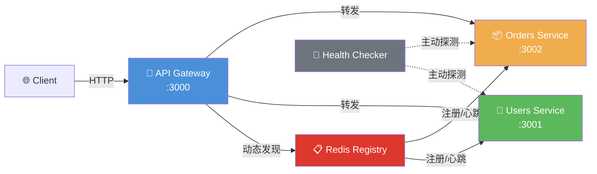

# Milestone 2: Service Discovery

> 基于 Redis 的服务注册与动态发现

## 架构图



## 运行步骤

```bash
# 1. 启动 Redis 基础设施
cd ..
docker-compose up -d redis

# 2. 安装依赖并运行
cd milestone-02-service-discovery
npm install
npm run dev

# 3. 验证注册状态
curl http://localhost:3000/discovery/services

# 4. 动态路由测试
curl http://localhost:3000/users
curl http://localhost:3000/orders
```

## 关键设计决策

### 1. Redis 作为注册中心

- **数据结构**：`service:<name>` → JSON 字符串，包含 host/port/healthEndpoint/metadata
- **TTL 机制**：注册时设置 30s TTL，服务通过心跳每 10s 续期
- **自动剔除**：服务崩溃或网络分区时，Redis TTL 到期自动删除键

### 2. 心跳与重注册

```
服务启动 ──register──► Redis (TTL=30s)
   │                      ▲
   └──heartbeat(10s)──────┘
        失败 → 立即 re-register
```

- **防御性编程**：心跳失败不直接退出，而是尝试重新注册
- **幂等性**：多次注册同一服务名会覆盖旧值，无副作用

### 3. Gateway 动态代理

- **运行时查询**：每次请求前从 Redis 查询目标服务地址
- **缓存优化**（可扩展）：生产环境可引入 1-5s 本地缓存，减少 Redis 压力
- **降级策略**：服务未找到时返回 503，明确告知客户端服务不可用

### 4. 主动健康检查

- **被动依赖 TTL**：Redis TTL 是主要剔除机制
- **主动探测补充**：HealthChecker 周期性探测，仅记录日志和指标
- **分离职责**：注册中心不负责判断健康，只负责存储和过期

## 目录结构

```
milestone-02-service-discovery/
├── discovery/
│   └── src/
│       ├── registry.ts          # Redis 注册/发现/心跳
│       └── healthCheck.ts       # 主动健康探测
├── gateway/
│   └── src/                     # 动态路由版 Gateway
└── services/
    ├── users/
    │   └── src/
    │       ├── server.ts
    │       ├── logger.ts
    │       ├── config.ts
    │       └── register.ts      # 启动注册 + 心跳
    └── orders/
        └── src/
            ├── server.ts
            ├── logger.ts
            ├── config.ts
            └── register.ts
```

## 扩展挑战

1. **本地缓存**：在 Gateway 中实现 5s 本地缓存，减少 Redis RTT
2. **权重路由**：注册信息中加入 weight，支持加权轮询
3. **多实例测试**：启动两个 users-service（不同端口），验证负载分发
