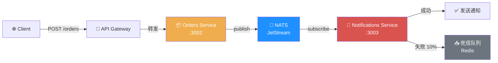

# Milestone 3: Event Bus

> 异步事件驱动通信：发布-订阅、事件持久化、死信队列

## 架构图



## 运行步骤

```bash
# 1. 启动基础设施（NATS + Redis + Postgres）
cd ..
docker-compose up -d nats redis postgres

# 2. 运行 M3
cd milestone-03-event-bus
npm install
npm run dev

# 3. 创建订单（触发事件）
curl -X POST http://localhost:3000/orders \
  -H "Content-Type: application/json" \
  -d '{"userId":"user-1","product":"NATS Book","amount":49.99}'

# 4. 查看通知服务收到的记录
curl http://localhost:3000/notifications

# 5. 查看死信队列（模拟失败累积）
curl http://localhost:3000/dlq
```

## 关键设计决策

### 1. 发布-订阅模式

- **主题**：`order.created` — 单一职责，语义清晰
- **队列组**：`notifications-workers` — 支持多个 notifications-service 实例负载均衡
- **广播 vs 负载均衡**：无 queue group 时广播，有 queue group 时单播

### 2. 事件可靠性

```
Orders Service
    │
    ├──► 业务数据写入 DB（事务）
    ├──► 发布事件到 NATS
    │       └── 失败？记录日志，不阻塞响应
    └──► 返回 201 给客户端
```

- **当前简化版**：先写内存、再发事件。生产环境应使用 **Outbox 模式**：
  1. 业务写入和事件写入同一数据库事务
  2. 后台进程轮询 outbox 表，可靠投递到 NATS

### 3. 死信队列（DLQ）

```
Handler 失败
    │
    ├──► attempt=0, delay=5s  ──► 重试
    ├──► attempt=1, delay=15s ──► 重试
    ├──► attempt=2, delay=60s ──► 重试
    └──► attempt=3 ──► 移入 Redis DLQ
```

- **Redis Sorted Set**：按时间排序，支持定时重试
- **DLQ 查询**：`/dlq` 端点可查看无法处理的事件
- **人工介入**：DLQ 事件需人工分析原因后重新投递或丢弃

### 4. 事件契约

```typescript
interface OrderCreatedEvent {
  orderId: string;
  userId: string;
  product: string;
  amount: number;
  createdAt: string;
}
```

- **Schema 演进**：新增字段是安全的，删除/修改字段需版本化主题（`order.created.v2`）

## 目录结构

```
milestone-03-event-bus/
├── events/
│   └── src/
│       ├── publisher.ts         # NATS 发布封装
│       ├── subscriber.ts        # NATS 订阅封装（含 queue group）
│       └── retry.ts             # 重试调度 + 死信队列
├── services/
│   ├── orders/
│   │   └── src/
│   │       └── server.ts        # 创建订单 + 发布事件
│   └── notifications/
│       └── src/
│           └── server.ts        # 订阅 order.created + 发送通知
└── gateway/                     # 继承 M2 动态发现
```

## 扩展挑战

1. **Outbox 模式**：在 orders-service 中实现 PostgreSQL outbox 表 + 后台投递进程
2. **事件溯源**：为 orders 添加事件溯源存储，重建订单状态
3. **Schema Registry**：引入 JSON Schema 验证事件格式
