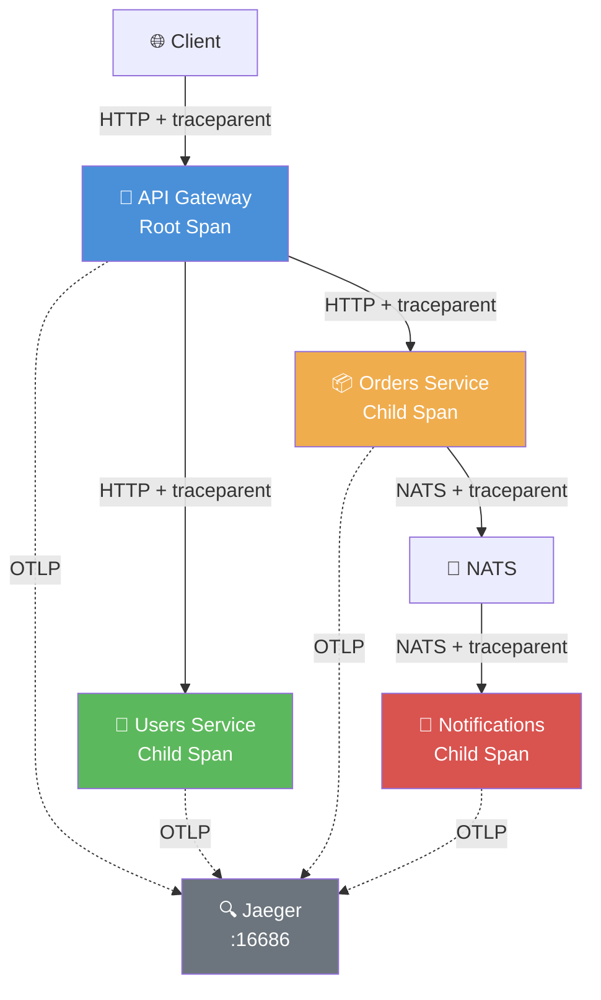

# Milestone 4: Distributed Tracing

> 全链路可观测性：OpenTelemetry + Jaeger 跨服务追踪

## 架构图



## 运行步骤

```bash
# 1. 启动全部基础设施
cd ..
docker-compose up -d

# 2. 运行 M4
cd milestone-04-distributed-tracing
npm install
npm run dev

# 3. 发起跨服务请求
curl -X POST http://localhost:3000/orders \
  -H "Content-Type: application/json" \
  -d '{"userId":"user-1","product":"Tracing Book","amount":59.99}'

# 4. 打开 Jaeger UI
open http://localhost:16686
# Service = "api-gateway" → Find Traces → 查看完整链路
```

## Jaeger UI 查询示例

| 查询条件 | 说明 |
|----------|------|
| Service = `api-gateway` | 查看从 Gateway 进入的所有链路 |
| Service = `orders-service` | 查看订单服务的 Span |
| Operation = `POST /orders/*` | 只看创建订单的链路 |
| Tags = `http.status_code=500` | 筛选错误链路 |
| Duration > 100ms | 筛选慢请求 |

## 关键设计决策

### 1. Trace Context 传播

**HTTP 层（Gateway → Services）**
```
Client Request
  └── traceparent: 00-4bf92f3577b34da6a3ce929d0e0e4736-00f067aa0ba902b7-01

Gateway 提取 → 创建 Root Span
  └── 转发时 inject traceparent 到下游 HTTP Header

Users Service 提取 → 创建 Child Span
```

**NATS 层（Orders → Notifications）**
```
Orders Service 创建订单
  └── inject traceparent 到 NATS Headers

Notifications Service 从 Msg Headers 提取
  └── 创建 Child Span "process-notification"
```

### 2. Span 结构设计

```
Trace: abc123
├── Span: "POST /orders/*" (api-gateway) [ROOT]
│   ├── Span: "POST /" (orders-service)
│   │   └── Span: "publish order.created" (orders-service)
│   └── Span: "process-notification" (notifications-service) [跨消息队列]
```

- **Gateway**：每个 HTTP 请求创建一个 Span
- **Services**：收到请求后创建 Child Span
- **NATS**：消息消费在提取的 Context 下创建 Span

### 3. 自动仪表 vs 手动仪表

- **自动**：NodeSDK + auto-instrumentations 自动捕获 HTTP、DNS 调用
- **手动**：NATS 消息处理、业务逻辑（如 "process-notification"）需手动创建 Span
- **最佳实践**：自动覆盖框架层，手动覆盖业务语义

### 4. 日志与 Trace 关联

```typescript
// 日志中注入 traceId，便于从日志跳转到 Jaeger
logger.info({ traceId: getCurrentTraceId() }, "Notification sent");

// 输出示例：
// { "traceId": "4bf92f3577b34da6a3ce929d0e0e4736", "msg": "Notification sent" }
```

## 目录结构

```
milestone-04-distributed-tracing/
├── tracing/
│   └── src/
│       ├── tracer.ts            # OpenTelemetry SDK 初始化
│       ├── middleware.ts        # Fastify 自动追踪中间件
│       └── nats.ts              # NATS Trace Context 传播
├── gateway/
│   └── src/
│       └── server.ts            # 注入 tracingPlugin + OTLP 上报
├── services/
│   ├── orders/
│   │   └── src/
│   │       └── server.ts        # publish 时 inject trace context
│   └── notifications/
│       └── src/
│           └── server.ts        # subscribe 时 extract trace context
```

## 扩展挑战

1. **Metrics 集成**：添加 `@opentelemetry/exporter-prometheus`，暴露 `/metrics` 端点
2. **日志采样**：生产环境配置概率采样（如 10%），避免存储爆炸
3. **错误链路告警**：结合 Alertmanager，对 error=true 的 Trace 自动告警
