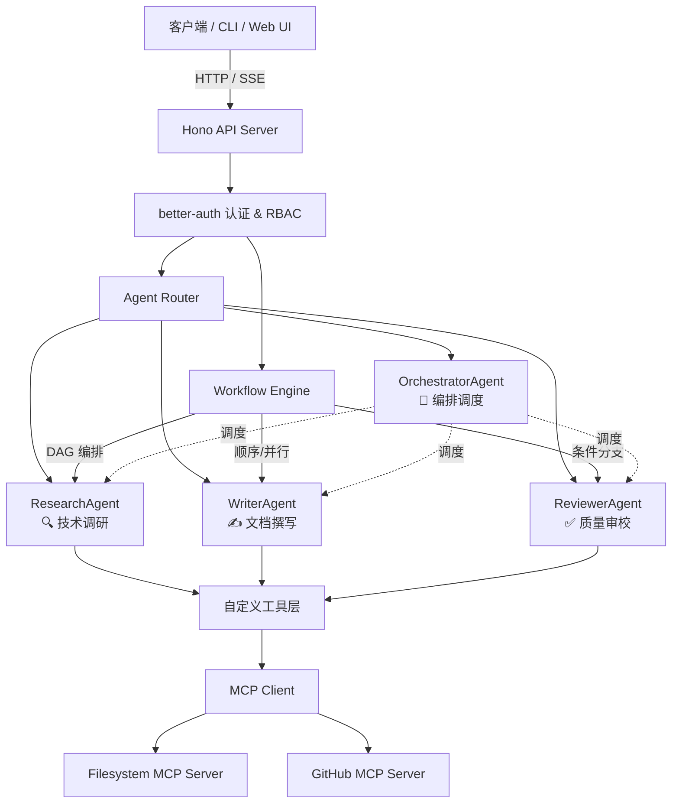

# 🧠 智能研发团队助手

> 基于 **Mastra + Vercel AI SDK v6 + MCP + better-auth + Hono** 的多 Agent 协作系统生产级示例。

---

## 📐 架构图



---

## 🛠 技术栈

| 层级 | 技术 | 版本 | 用途 |
|------|------|------|------|
| **Agent 框架** | Mastra | ^0.6.0 | Agent 定义、工作流引擎、记忆层 |
| **AI SDK** | Vercel AI SDK v6 | ^4.2.0 | 统一模型接入、流式输出、工具调用 |
| **协议** | MCP | ^1.7.0 | 模型上下文协议，工具标准化 |
| **API 框架** | Hono | ^4.7.0 | 边缘运行时友好的 HTTP 框架 |
| **认证** | better-auth | ^1.2.0 | OAuth、Session、RBAC |
| **ORM** | Drizzle ORM | ^0.40.0 | 类型安全的数据库操作 |
| **数据库** | SQLite (开发) / PostgreSQL / D1 (生产) | — | 数据持久化 |
| **测试** | Vitest | ^3.0.0 | 单元测试与集成测试 |
| **部署** | Cloudflare Workers / Node.js / Docker | — | 多平台部署 |

---

## 🚀 快速开始

### 环境要求

- Node.js >= 20.0.0
- npm >= 10.0.0

### 安装

```bash
cd examples/ai-agent-production
npm install
```

### 配置环境变量

```bash
cp .env.example .env
# 编辑 .env，填入至少一个 AI 提供商的 API Key
```

### 初始化数据库

```bash
npm run db:migrate
```

### 启动开发服务器

```bash
# 方式 1：直接启动（同时启动 Hono + MCP Servers）
npm run dev

# 方式 2：分别启动
npm run mcp:filesystem   # 终端 1
npm run mcp:github       # 终端 2
npm run dev              # 终端 3
```

服务启动后访问：

- API 健康检查：`GET http://localhost:3000/health`
- Agent 列表：`GET http://localhost:3000/api/agents`
- 工作流列表：`GET http://localhost:3000/api/workflows`

---

## 📁 项目结构

```
ai-agent-production/
├── src/
│   ├── mastra/
│   │   ├── agents/           # Agent 定义
│   │   │   ├── researcher.ts
│   │   │   ├── writer.ts
│   │   │   ├── reviewer.ts
│   │   │   └── orchestrator.ts
│   │   ├── workflows/        # 工作流定义
│   │   │   ├── tech-doc-workflow.ts
│   │   │   └── code-review-workflow.ts
│   │   └── tools/            # 自定义工具
│   │       ├── file-system.ts
│   │       ├── web-search.ts
│   │       └── code-analyzer.ts
│   ├── server/               # Hono API 服务器
│   │   ├── index.ts
│   │   ├── routes/
│   │   │   ├── agents.ts
│   │   │   ├── workflows.ts
│   │   │   └── mcp.ts
│   │   └── middleware/
│   │       ├── auth.ts
│   │       └── rate-limit.ts
│   └── lib/                  # 共享库
│       ├── ai-sdk.ts
│       ├── auth.ts
│       ├── db.ts
│       └── mcp-client.ts
├── mcp-servers/              # 本地 MCP Server
│   ├── filesystem-server/
│   └── github-server/
├── database/                 # 数据库
│   ├── schema.ts
│   └── migrations/
├── tests/                    # 测试
│   ├── agents/
│   ├── workflows/
│   └── server/
├── docs/                     # 文档
│   ├── ARCHITECTURE.md
│   ├── MILESTONES.md
│   ├── DEPLOYMENT.md
│   └── MCP_INTEGRATION.md
├── package.json
├── tsconfig.json
├── mastra.config.ts
├── .env.example
└── docker-compose.yml
```

---

## 🔌 API 接口概览

### Agent 接口

| 方法 | 路径 | 说明 | 权限 |
|------|------|------|------|
| GET | `/api/agents` | 列出所有 Agent | 公开 |
| POST | `/api/agents/invoke` | 调用 Agent（非流式） | developer+ |
| POST | `/api/agents/invoke/stream` | 调用 Agent（SSE 流式） | developer+ |

### 工作流接口

| 方法 | 路径 | 说明 | 权限 |
|------|------|------|------|
| GET | `/api/workflows` | 列出所有工作流 | 公开 |
| POST | `/api/workflows/:name/start` | 启动工作流 | developer+ |
| GET | `/api/workflows/:name/status/:runId` | 查询工作流状态 | 已登录 |

### MCP 接口

| 方法 | 路径 | 说明 | 权限 |
|------|------|------|------|
| GET | `/api/mcp/servers` | 列出已连接的 Server | 已登录 |
| GET | `/api/mcp/tools` | 列出所有工具 | 已登录 |
| POST | `/api/mcp/tools/:server/:tool` | 调用指定工具 | developer+ |
| POST | `/api/mcp/connect` | 动态连接 Server | admin |

---

## 🧪 运行测试

```bash
# 运行全部测试
npm test

# 监视模式
npm run test:watch

# 单独测试 Agent
npx vitest run tests/agents/researcher.test.ts

# 单独测试工作流
npx vitest run tests/workflows/tech-doc-workflow.test.ts
```

---

## 📚 学习资源

本项目包含 5 个递进式学习里程碑：

1. **Mastra 框架基础与 Agent 定义** → `docs/MILESTONES.md#里程碑-1`
2. **MCP 协议理解与 Server/Client 实现** → `docs/MILESTONES.md#里程碑-2`
3. **多 Agent 工作流编排（DAG + 条件分支）** → `docs/MILESTONES.md#里程碑-3`
4. **认证、授权与 API 安全** → `docs/MILESTONES.md#里程碑-4`
5. **部署到边缘运行时** → `docs/MILESTONES.md#里程碑-5`

更多技术细节请参考：

- [系统架构设计](docs/ARCHITECTURE.md)
- [MCP 协议集成详解](docs/MCP_INTEGRATION.md)
- [部署指南](docs/DEPLOYMENT.md)

---

## 🔗 关联引用

本项目与以下文档/代码库形成完整的学习链路：

- [`docs/categories/28-ai-agent-infrastructure.md`](../../../30-knowledge-base/30.2-categories/28-ai-agent-infrastructure.md) — AI Agent 基础设施生态盘点
- `jsts-code-lab/33-ai-integration/` — AI SDK 集成模式
- `jsts-code-lab/94-ai-agent-lab/` — MCP 协议与多 Agent 工作流基础
- `jsts-code-lab/21-api-security/` — API 安全最佳实践
- `jsts-code-lab/31-serverless/` — Serverless 与边缘计算

---

## 📝 License

MIT
