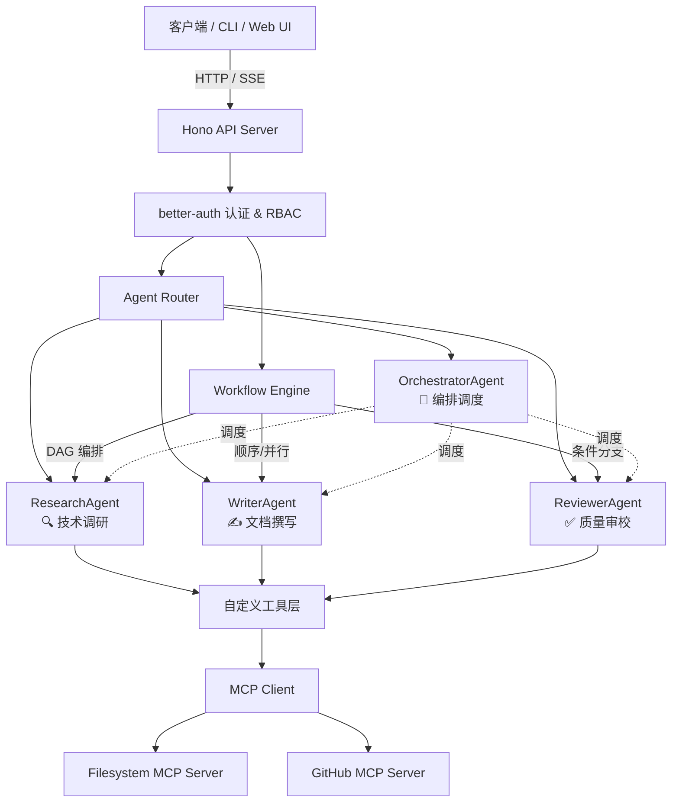

# 🧠 智能研发团队助手 — AI Agent 生产级系统实战教程

> 基于 **Mastra + Vercel AI SDK v6 + MCP + better-auth + Hono** 的多 Agent 协作系统生产级示例。
> 本教程将带你从零搭建一个可部署的 AI Agent 系统。

---

## 📖 第一章：项目概述与 AI Agent 架构说明

### 1.1 项目介绍

本项目是一个**多 Agent 协作系统**，模拟真实研发团队的工作流：研究员收集信息、写手撰写文档、审校员把关质量、编排器协调全局。通过 Mastra 框架与 MCP（Model Context Protocol）协议，实现 Agent 的标准化工具接入与协作编排。

### 1.2 系统架构



### 1.3 技术栈详解

| 层级 | 技术 | 版本 | 用途 |
|------|------|------|------|
| **Agent 框架** | Mastra | ^0.6.0 | Agent 定义、工作流引擎、记忆层 |
| **AI SDK** | Vercel AI SDK v6 | ^4.2.0 | 统一模型接入、流式输出、工具调用 |
| **协议** | MCP | ^1.7.0 | 模型上下文协议，工具标准化 |
| **API 框架** | Hono | ^4.7.0 | 边缘运行时友好的 HTTP 框架 |
| **认证** | better-auth | ^1.2.0 | OAuth、Session、RBAC |
| **ORM** | Drizzle ORM | ^0.40.0 | 类型安全的数据库操作 |
| **数据库** | SQLite (开发) / PostgreSQL / D1 (生产) | — | 数据持久化 |
| **测试** | Vitest | ^3.0.0 | 单元测试与集成测试 |
| **部署** | Cloudflare Workers / Node.js / Docker | — | 多平台部署 |

### 1.4 学习目标

完成本教程后，你将能够：

1. 理解 AI Agent 的基本概念与架构设计
2. 掌握 MCP 协议的原理与实现方式
3. 使用 Mastra 框架定义 Agent、工具与工作流
4. 构建具备认证、限流、错误处理的生产级 API
5. 部署 AI Agent 系统到边缘运行时

---

## 🚀 第二章：环境准备

### 2.1 Node.js 与包管理器

```bash
# 验证 Node.js 版本（>= 20.0.0）
node -v

# 如果不符合，使用 nvm 安装
nvm install 20
nvm use 20
```

### 2.2 安装项目依赖

```bash
cd examples/ai-agent-production
npm install
```

### 2.3 API Key 配置

本项目需要至少一个 AI 提供商的 API Key：

```bash
# 复制环境变量模板
cp .env.example .env
```

编辑 `.env` 文件：

```env
# OpenAI（推荐）
OPENAI_API_KEY=sk-xxxxxxxxxxxxxxxxxxxxxxxx

# Anthropic Claude
ANTHROPIC_API_KEY=sk-ant-xxxxxxxxxxxxxxxx

# DeepSeek
DEEPSEEK_API_KEY=sk-xxxxxxxxxxxxxxxx

# 可选：Langfuse 观测平台
LANGFUSE_PUBLIC_KEY=pk-xxxxxxxx
LANGFUSE_SECRET_KEY=sk-xxxxxxxx
LANGFUSE_BASE_URL=https://cloud.langfuse.com
```

> 💡 **提示**：开发环境可以使用 DeepSeek 等性价比更高的模型，生产环境建议使用 GPT-4o 或 Claude 3.5 Sonnet。

### 2.4 MCP Server 配置

本项目内置两个本地 MCP Server：

- **Filesystem MCP Server**：文件系统读写操作
- **GitHub MCP Server**：GitHub API 调用

在 `.env` 中配置：

```env
# 文件系统安全根目录（MCP Server 只能访问此目录下的文件）
MCP_FS_ROOT=./safe-workspace

# GitHub Token（用于 GitHub MCP Server）
GITHUB_TOKEN=ghp_xxxxxxxxxxxxxxxx
```

### 2.5 初始化数据库

```bash
# 运行数据库迁移
npm run db:migrate

# 可选：启动 Drizzle Studio 查看数据
npm run db:studio
```

---

## 🛠️ 第三章：分步实现指南

### 3.1 第一步：MCP Server 搭建

#### 3.1.1 理解 MCP 协议

**MCP（Model Context Protocol）** 是 Anthropic 推出的开放协议，旨在标准化 AI 模型与外部工具的交互方式。核心概念：

- **Server**：提供工具（Tools）、资源（Resources）、提示（Prompts）的端点
- **Client**：连接到 Server，发现能力并调用工具
- **Transport**：通信传输层，支持 stdio 和 SSE 两种模式

#### 3.1.2 本地 Filesystem MCP Server

```typescript
// mcp-servers/filesystem-server/index.ts
import { Server } from "@modelcontextprotocol/sdk/server/index.js";
import { StdioServerTransport } from "@modelcontextprotocol/sdk/server/stdio.js";

const server = new Server(
  { name: "filesystem-server", version: "1.0.0" },
  { capabilities: { tools: {} } }
);

// 注册工具
server.setRequestHandler("tools/list", async () => {
  return {
    tools: [
      {
        name: "read-file",
        description: "读取文件内容",
        inputSchema: {
          type: "object",
          properties: {
            path: { type: "string", description: "文件路径" },
          },
          required: ["path"],
        },
      },
      {
        name: "write-file",
        description: "写入文件内容",
        inputSchema: {
          type: "object",
          properties: {
            path: { type: "string" },
            content: { type: "string" },
          },
          required: ["path", "content"],
        },
      },
    ],
  };
});

// 处理工具调用
server.setRequestHandler("tools/call", async (request) => {
  const { name, arguments: args } = request.params;

  switch (name) {
    case "read-file": {
      const content = await fs.readFile(args.path, "utf-8");
      return { content: [{ type: "text", text: content }] };
    }
    case "write-file": {
      await fs.writeFile(args.path, args.content);
      return { content: [{ type: "text", text: "写入成功" }] };
    }
    default:
      throw new Error(`未知工具: ${name}`);
  }
});

// 启动 stdio 传输
const transport = new StdioServerTransport();
await server.connect(transport);
```

#### 3.1.3 MCP Client 封装

```typescript
// src/lib/mcp-client.ts
import { Client } from "@modelcontextprotocol/sdk/client/index.js";
import { StdioClientTransport } from "@modelcontextprotocol/sdk/client/stdio.js";
import { SSEClientTransport } from "@modelcontextprotocol/sdk/client/sse.js";

export interface McpServerConfig {
  name: string;
  transport: "stdio" | "sse";
  command?: string;
  args?: string[];
  url?: string;
}

export class McpClientManager {
  private clients = new Map<string, Client>();
  private toolsCache = new Map<string, Tool[]>();

  async connectServer(config: McpServerConfig): Promise<void> {
    let transport: StdioClientTransport | SSEClientTransport;

    if (config.transport === "stdio") {
      transport = new StdioClientTransport({
        command: config.command!,
        args: config.args ?? [],
      });
    } else {
      transport = new SSEClientTransport(new URL(config.url!));
    }

    const client = new Client(
      { name: "ai-agent-client", version: "1.0.0" },
      { capabilities: { tools: {}, resources: {}, prompts: {} } }
    );

    await client.connect(transport);
    this.clients.set(config.name, client);

    // 预加载工具列表
    const tools = await client.listTools().then((r) => r.tools);
    this.toolsCache.set(config.name, tools);

    console.log(`[MCP] 已连接 Server: ${config.name}`);
  }

  async callTool(serverName: string, toolName: string, args: Record<string, unknown>) {
    const client = this.clients.get(serverName);
    if (!client) throw new Error(`MCP Server 未找到: ${serverName}`);
    return client.callTool({ name: toolName, arguments: args });
  }

  getAllTools() {
    const result: Array<{ server: string; tool: Tool }> = [];
    for (const [server, tools] of this.toolsCache) {
      for (const tool of tools) result.push({ server, tool });
    }
    return result;
  }
}

export const mcpManager = new McpClientManager();
```

---

### 3.2 第二步：Agent 定义与编排

#### 3.2.1 研究员 Agent

```typescript
// src/mastra/agents/researcher.ts
import { Agent } from "@mastra/core/agent";
import { getDefaultModelInstance } from "../../lib/ai-sdk.js";
import { webSearchTool, fetchPageTool } from "../tools/web-search.js";

export const researchAgent = new Agent({
  name: "ResearchAgent",
  instructions: `
你是一位资深技术研究员，专注于为研发团队提供高质量的技术调研报告。

## 角色定位
- 深入理解技术主题的背景、原理与生态
- 善于从多个来源交叉验证信息的准确性
- 输出结构化、可引用的调研结果

## 行为准则
1. 每次调研前，先使用 web-search 工具收集最新资料
2. 对关键信息来源使用 fetch-page 工具获取详细内容
3. 调研报告必须包含：背景概述、核心概念、主流方案对比、实践建议
4. 所有结论需标注信息来源（URL）
5. 若信息存在冲突，需列出不同观点并说明倾向性理由

## 输出规范
- 使用 Markdown 格式
- 分节清晰，标题层级不超过 3 级
- 关键术语首次出现时需加粗
- 代码示例使用 TypeScript 语法
`,
  model: getDefaultModelInstance(),
  tools: {
    webSearch: webSearchTool,
    fetchPage: fetchPageTool,
  },
});
```

#### 3.2.2 写手 Agent

```typescript
// src/mastra/agents/writer.ts
import { Agent } from "@mastra/core/agent";
import { getDefaultModelInstance } from "../../lib/ai-sdk.js";
import { writeFileTool } from "../tools/file-system.js";

export const writerAgent = new Agent({
  name: "WriterAgent",
  instructions: `
你是一位技术文档工程师，擅长将复杂的技术概念转化为清晰、准确的文档。

## 角色定位
- 基于研究资料撰写结构化的技术文档
- 确保代码示例可运行、术语使用准确
- 根据目标读者调整文档深度（初学者/进阶/专家）

## 行为准则
1. 收到研究资料后，先梳理文档大纲
2. 使用 write-file 工具将文档写入指定路径
3. 所有代码示例必须经过语法检查
4. 保持一致的术语和格式风格
`,
  model: getDefaultModelInstance(),
  tools: {
    writeFile: writeFileTool,
  },
});
```

#### 3.2.3 审校 Agent

```typescript
// src/mastra/agents/reviewer.ts
import { Agent } from "@mastra/core/agent";
import { getDefaultModelInstance } from "../../lib/ai-sdk.js";
import { readFileTool, analyzeCodeTool } from "../tools/code-analyzer.js";

export const reviewerAgent = new Agent({
  name: "ReviewerAgent",
  instructions: `
你是一位技术文档审校专家，负责把关文档质量。

## 审校维度
1. **准确性**：技术概念、API 用法、版本信息是否正确
2. **完整性**：是否覆盖了必要的背景、步骤、注意事项
3. **可读性**：段落结构、语言风格、代码格式
4. **一致性**：术语统一、格式规范、链接有效性

## 输出格式
使用结构化审查报告，包含：
- 总体评分（1-10）
- 通过项 ✅
- 建议项 💡
- 阻塞项 ❌（必须修复）
`,
  model: getDefaultModelInstance(),
  tools: {
    readFile: readFileTool,
    analyzeCode: analyzeCodeTool,
  },
});
```

#### 3.2.4 编排器 Agent

```typescript
// src/mastra/agents/orchestrator.ts
import { Agent } from "@mastra/core/agent";
import { getDefaultModelInstance } from "../../lib/ai-sdk.js";

export const orchestratorAgent = new Agent({
  name: "OrchestratorAgent",
  instructions: `
你是智能研发团队的「项目经理」，负责协调研究员、写手与审校员之间的高效协作。

## 决策规则
1. **信息收集类任务** → 委派给 ResearchAgent
2. **内容生成类任务** → 委派给 WriterAgent
3. **质量把关类任务** → 委派给 ReviewerAgent
4. **多阶段复杂任务** → 组合为工作流（Research → Write → Review）

## 异常处理策略
| 错误类型 | 处理策略 |
|---------|---------|
| 网络超时 | 指数退避重试，最多 3 次 |
| 工具调用失败 | 记录日志，尝试替代方案 |
| Agent 输出不满足质量阈值 | 打回上游 Agent 重做 |
| 不可恢复错误 | 终止工作流，通知人工 |
`,
  model: getDefaultModelInstance(),
  tools: {}, // 编排器通过工作流引擎间接调度
});
```

#### 3.2.5 Mastra 全局配置

```typescript
// mastra.config.ts
import { Mastra } from "@mastra/core";
import { createLogger } from "@mastra/core/logger";

import { researchAgent } from "./src/mastra/agents/researcher.js";
import { writerAgent } from "./src/mastra/agents/writer.js";
import { reviewerAgent } from "./src/mastra/agents/reviewer.js";
import { orchestratorAgent } from "./src/mastra/agents/orchestrator.js";

import { techDocWorkflow } from "./src/mastra/workflows/tech-doc-workflow.js";
import { codeReviewWorkflow } from "./src/mastra/workflows/code-review-workflow.js";

export const mastra = new Mastra({
  agents: {
    researcher: researchAgent,
    writer: writerAgent,
    reviewer: reviewerAgent,
    orchestrator: orchestratorAgent,
  },
  workflows: {
    techDoc: techDocWorkflow,
    codeReview: codeReviewWorkflow,
  },
  logger: createLogger({
    name: "ai-agent-production",
    level: process.env.NODE_ENV === "production" ? "info" : "debug",
  }),
});

export type MastraInstance = typeof mastra;
```

---

### 3.3 第三步：多 Agent 工作流编排

#### 3.3.1 DAG 工作流设计

```typescript
// src/mastra/workflows/tech-doc-workflow.ts
import { Workflow } from "@mastra/core/workflows";
import { z } from "zod";

export const techDocWorkflow = new Workflow({
  name: "tech-doc-workflow",
  triggerSchema: z.object({
    topic: z.string().describe("技术主题"),
    outputPath: z.string().describe("文档输出路径"),
    maxRetries: z.number().int().min(0).max(3).default(2),
  }),
})
  // 步骤 1: 研究阶段
  .step("research", {
    execute: async ({ context, mastra }) => {
      const agent = mastra.getAgent("researcher");
      const topic = context.triggerData.topic;

      const result = await agent.generate(
        `请对 "${topic}" 进行全面技术调研，输出结构化的调研报告。`
      );

      return {
        researchNotes: result.text,
        topic,
      };
    },
  })

  // 步骤 2: 写作阶段（依赖研究阶段输出）
  .step("write", {
    execute: async ({ context, mastra }) => {
      const agent = mastra.getAgent("writer");
      const researchNotes = context.getStepResult<{ researchNotes: string }>("research")?.researchNotes ?? "";
      const topic = context.triggerData.topic;
      const outputPath = context.triggerData.outputPath;

      const result = await agent.generate(
        `基于以下调研资料，撰写一份关于 "${topic}" 的技术文档。\n\n调研资料:\n${researchNotes}\n\n要求:\n1. 将最终文档写入文件路径: ${outputPath}\n2. 使用 write-file 工具写入`
      );

      return {
        draftContent: result.text,
        outputPath,
      };
    },
  })

  // 步骤 3: 审查阶段
  .step("review", {
    execute: async ({ context, mastra }) => {
      const agent = mastra.getAgent("reviewer");
      const outputPath = context.getStepResult<{ outputPath: string }>("write")?.outputPath ?? "";

      const result = await agent.generate(
        `请审查文件 "${outputPath}" 中的技术文档质量。输出结构化审查报告。`
      );

      const passed = !result.text.includes("❌") && !result.text.includes("阻塞项");

      return {
        reviewReport: result.text,
        passed,
      };
    },
  })

  // 条件分支：审查不通过则重写
  .if(
    ({ context }) => {
      const review = context.getStepResult<{ passed: boolean }>("review");
      return review?.passed === false;
    },
    (workflow) =>
      workflow.step("rewrite", {
        execute: async ({ context, mastra }) => {
          const agent = mastra.getAgent("writer");
          const reviewReport = context.getStepResult<{ reviewReport: string }>("review")?.reviewReport ?? "";

          const result = await agent.generate(
            `根据以下审查意见修改文档:\n\n${reviewReport}`
          );

          return { rewritten: true, draftContent: result.text };
        },
      })
  )

  // 最终聚合
  .step("finalize", {
    execute: async ({ context }) => {
      const review = context.getStepResult<{ reviewReport: string; passed: boolean }>("review");
      return {
        success: review?.passed ?? false,
        topic: context.triggerData.topic,
      };
    },
  });

techDocWorkflow.commit();
```

---

### 3.4 第四步：Hono API 服务器

#### 3.4.1 服务器入口

```typescript
// src/server/index.ts
import { Hono } from "hono";
import { logger } from "hono/logger";
import { cors } from "hono/cors";
import { HTTPException } from "hono/http-exception";

import { authMiddleware } from "./middleware/auth.js";
import { rateLimit } from "./middleware/rate-limit.js";

import agentsRoutes from "./routes/agents.js";
import workflowsRoutes from "./routes/workflows.js";
import mcpRoutes from "./routes/mcp.js";

const app = new Hono();

// 全局中间件
app.use(logger());
app.use(cors({
  origin: process.env.NODE_ENV === "production" ? ["https://your-domain.com"] : "*",
  allowMethods: ["GET", "POST", "PUT", "DELETE", "OPTIONS"],
  allowHeaders: ["Content-Type", "Authorization", "X-Requested-With"],
  credentials: true,
}));
app.use(rateLimit({ windowMs: 60_000, maxRequests: 120 }));
app.use(authMiddleware);

// 健康检查
app.get("/health", (c) => {
  return c.json({
    status: "ok",
    timestamp: new Date().toISOString(),
    version: "1.0.0",
  });
});

// API 路由挂载
app.route("/api/agents", agentsRoutes);
app.route("/api/workflows", workflowsRoutes);
app.route("/api/mcp", mcpRoutes);

// 全局错误处理
app.onError((err, c) => {
  console.error("[Error]", err);

  if (err instanceof HTTPException) {
    return c.json({ success: false, error: err.message, status: err.status }, err.status);
  }

  return c.json(
    { success: false, error: process.env.NODE_ENV === "production" ? "服务器内部错误" : err.message },
    500
  );
});

app.notFound((c) => {
  return c.json({ success: false, error: "接口不存在" }, 404);
});

const port = Number(process.env.PORT ?? 3000);

if (import.meta.url.startsWith("file://") && process.argv[1]) {
  const { serve } = await import("@hono/node-server");
  serve({ fetch: app.fetch, port });
  console.log(`🚀 Server running at http://localhost:${port}`);
}

export default app;
```

#### 3.4.2 Agent 调用路由

```typescript
// src/server/routes/agents.ts
import { Hono } from "hono";
import { zValidator } from "@hono/zod-validator";
import { z } from "zod";
import { mastra } from "../../../mastra.config.js";
import { requireAuth, requireRole } from "../middleware/auth.js";
import { rateLimit } from "../middleware/rate-limit.js";

const app = new Hono();

const invokeSchema = z.object({
  agent: z.enum(["researcher", "writer", "reviewer", "orchestrator"]),
  prompt: z.string().min(1).max(10000),
  stream: z.boolean().default(false),
  options: z.object({
    maxTokens: z.number().int().min(1).max(8192).optional(),
    temperature: z.number().min(0).max(2).optional(),
  }).optional(),
});

// GET /api/agents — 列出所有 Agent
app.get("/", (c) => {
  const agents = [
    { name: "researcher", description: "技术研究员：收集信息、检索数据、分析背景" },
    { name: "writer", description: "技术写手：基于研究资料撰写文档" },
    { name: "reviewer", description: "审校专家：审查文档与代码质量" },
    { name: "orchestrator", description: "编排器：协调多 Agent 协作" },
  ];
  return c.json({ agents });
});

// POST /api/agents/invoke — 非流式调用
app.post(
  "/invoke",
  requireAuth,
  requireRole("admin", "developer"),
  rateLimit({ windowMs: 60_000, maxRequests: 30 }),
  zValidator("json", invokeSchema),
  async (c) => {
    const body = c.req.valid("json");
    const agent = mastra.getAgent(body.agent);

    const start = performance.now();
    const result = await agent.generate(body.prompt, {
      maxTokens: body.options?.maxTokens,
      temperature: body.options?.temperature,
    });
    const latency = Math.round(performance.now() - start);

    return c.json({
      success: true,
      agent: body.agent,
      output: result.text,
      usage: result.usage,
      latencyMs: latency,
    });
  }
);

// POST /api/agents/invoke/stream — SSE 流式调用
app.post(
  "/invoke/stream",
  requireAuth,
  requireRole("admin", "developer"),
  rateLimit({ windowMs: 60_000, maxRequests: 20 }),
  zValidator("json", invokeSchema.omit({ stream: true })),
  async (c) => {
    const body = c.req.valid("json");
    const agent = mastra.getAgent(body.agent);

    const stream = await agent.stream(body.prompt, {
      maxTokens: body.options?.maxTokens,
      temperature: body.options?.temperature,
    });

    c.header("Content-Type", "text/event-stream");
    c.header("Cache-Control", "no-cache");
    c.header("Connection", "keep-alive");

    return new Response(
      new ReadableStream({
        async start(controller) {
          try {
            for await (const chunk of stream.textStream) {
              controller.enqueue(new TextEncoder().encode(`data: ${JSON.stringify({ chunk }) }\n\n`));
            }
            controller.enqueue(new TextEncoder().encode(`data: ${JSON.stringify({ done: true })}\n\n`));
            controller.close();
          } catch (err) {
            const message = err instanceof Error ? err.message : String(err);
            controller.enqueue(new TextEncoder().encode(`data: ${JSON.stringify({ error: message })}\n\n`));
            controller.close();
          }
        },
      })
    );
  }
);

export default app;
```

---

## 🚀 第四章：部署指南

### 4.1 本地部署

#### 4.1.1 单进程启动

```bash
# 方式 1：同时启动 Hono + MCP Servers
npm run dev

# 访问：
# GET http://localhost:3000/health
# GET http://localhost:3000/api/agents
```

#### 4.1.2 多进程分别启动

```bash
# 终端 1：启动 Filesystem MCP Server
npm run mcp:filesystem

# 终端 2：启动 GitHub MCP Server
npm run mcp:github

# 终端 3：启动 Hono API Server
npm run dev
```

### 4.2 Vercel 部署

```bash
# 安装 Vercel CLI
npm i -g vercel

# 登录
vercel login

# 部署（开发环境）
vercel

# 部署（生产环境）
vercel --prod
```

> ⚠️ **注意**：Vercel Serverless Functions 有执行时间限制（免费版 10 秒，Hobby 版 60 秒），长时间运行的 Agent 调用可能需要使用流式输出或迁移到专用服务器。

### 4.3 Docker 部署

```dockerfile
# Dockerfile
FROM node:20-alpine

WORKDIR /app

COPY package*.json ./
RUN npm ci --only=production

COPY . .
RUN npm run build

EXPOSE 3000

CMD ["node", "dist/server/index.js"]
```

```bash
# 构建并运行
docker build -t ai-agent-production .
docker run -p 3000:3000 --env-file .env ai-agent-production
```

### 4.4 Cloudflare Workers 部署

```bash
# 安装 wrangler
npm i -g wrangler

# 登录 Cloudflare
wrangler login

# 部署
wrangler deploy
```

---

## 📊 第五章：监控与调试

### 5.1 Langfuse 集成

Langfuse 是开源的 LLM 可观测性平台，用于追踪 Agent 调用、Token 消耗和延迟。

#### 5.1.1 环境配置

```env
LANGFUSE_PUBLIC_KEY=pk-xxxxxxxx
LANGFUSE_SECRET_KEY=sk-xxxxxxxx
LANGFUSE_BASE_URL=https://cloud.langfuse.com
```

#### 5.1.2 追踪 Agent 调用

```typescript
// src/lib/ai-sdk.ts
import { generateText, streamText } from "ai";
import { openai } from "@ai-sdk/openai";
import { Langfuse } from "langfuse";

const langfuse = new Langfuse({
  publicKey: process.env.LANGFUSE_PUBLIC_KEY,
  secretKey: process.env.LANGFUSE_SECRET_KEY,
  baseUrl: process.env.LANGFUSE_BASE_URL,
});

export async function tracedGenerate(prompt: string, options?: any) {
  const trace = langfuse.trace({ name: "agent-generate", input: prompt });
  const span = trace.span({ name: "llm-call" });

  try {
    const result = await generateText({
      model: openai("gpt-4o"),
      prompt,
      ...options,
    });

    span.end({
      output: result.text,
      usage: result.usage,
    });

    return result;
  } catch (error) {
    span.end({ error: String(error) });
    throw error;
  }
}
```

### 5.2 日志系统

Mastra 内置了结构化日志系统，可通过环境变量控制级别：

```env
# 开发环境：输出 debug 级别
NODE_ENV=development

# 生产环境：只输出 info 及以上
NODE_ENV=production
```

### 5.3 健康检查与指标

```bash
# 健康检查
curl http://localhost:3000/health

# 预期返回
{
  "status": "ok",
  "timestamp": "2024-01-15T08:30:00.000Z",
  "version": "1.0.0"
}
```

### 5.4 调试技巧

1. **开启 MCP Server 调试输出**：设置 `DEBUG=mcp:*` 环境变量
2. **查看 Agent 思考过程**：在 Mastra 配置中启用 `memory` 模块
3. **本地模拟工具调用**：使用 `vitest` 编写单元测试

```bash
# 运行全部测试
npm test

# 单独测试 Agent
npx vitest run tests/agents/researcher.test.ts

# 单独测试工作流
npx vitest run tests/workflows/tech-doc-workflow.test.ts
```

---

## 🎓 第六章：进阶扩展

### 6.1 自定义工具开发

```typescript
// src/mastra/tools/custom-api.ts
import { createTool } from "@mastra/core/tools";
import { z } from "zod";

export const weatherTool = createTool({
  id: "get-weather",
  description: "获取指定城市的天气信息",
  inputSchema: z.object({
    city: z.string().describe("城市名称"),
    date: z.string().optional().describe("日期，格式 YYYY-MM-DD"),
  }),
  execute: async ({ context }) => {
    const response = await fetch(
      `https://api.weather.com/v1/current?city=${encodeURIComponent(context.city)}`
    );
    return response.json();
  },
});
```

### 6.2 记忆层配置

```typescript
// mastra.config.ts
export const mastra = new Mastra({
  agents: { ... },
  workflows: { ... },
  memory: {
    // 开发环境：内存存储
    storage: new MemoryStorage(),
    // 生产环境：PostgreSQL
    // storage: new PostgresStorage({ connectionString: process.env.DATABASE_URL }),
  },
});
```

### 6.3 多模型 fallback

```typescript
// src/lib/ai-sdk.ts
import { openai } from "@ai-sdk/openai";
import { anthropic } from "@ai-sdk/anthropic";

export function getDefaultModelInstance() {
  const provider = process.env.DEFAULT_MODEL_PROVIDER ?? "openai";

  switch (provider) {
    case "anthropic":
      return anthropic("claude-3-5-sonnet-20241022");
    case "openai":
    default:
      return openai("gpt-4o");
  }
}
```

---

## 📚 学习资源

本项目与以下文档/代码库形成完整的学习链路：

- [`docs/categories/28-ai-agent-infrastructure.md`](../../../30-knowledge-base/30.2-categories/28-ai-agent-infrastructure.md) — AI Agent 基础设施生态盘点
- `jsts-code-lab/33-ai-integration/` — AI SDK 集成模式
- `jsts-code-lab/94-ai-agent-lab/` — MCP 协议与多 Agent 工作流基础
- `jsts-code-lab/21-api-security/` — API 安全最佳实践
- `jsts-code-lab/31-serverless/` — Serverless 与边缘计算

---

## 📝 License

MIT
