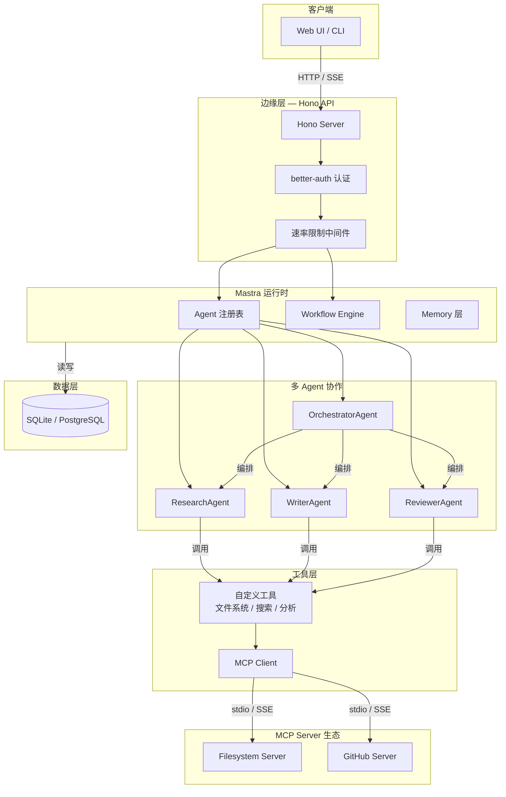
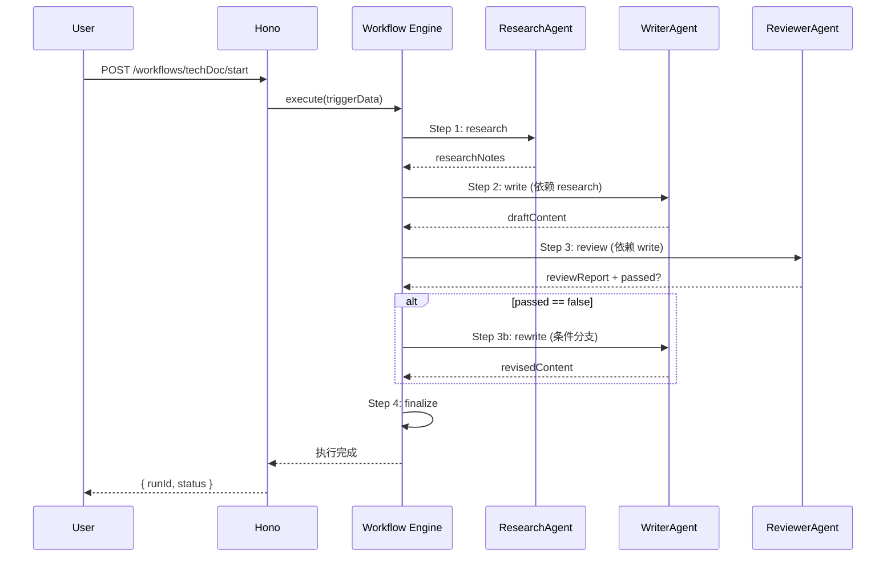
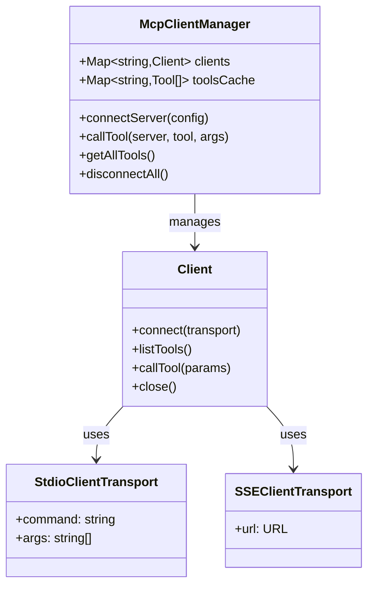
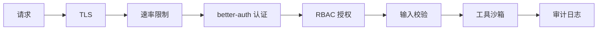

# 系统架构设计

## 1. 整体架构概览



---

## 2. Mastra 工作流引擎

### 2.1 核心概念

| 概念 | 说明 |
|------|------|
| **Agent** | 具备独立人格、系统提示与工具集的 AI 实体 |
| **Workflow** | 声明式的 DAG（有向无环图），定义 Agent 执行顺序与依赖 |
| **Step** | 工作流中的单个执行节点，可包含条件分支与循环 |
| **Trigger** | 唤醒工作流的初始事件与输入数据 |
| **Shared State** | 跨步骤的共享状态对象，Agent 可读取/写入 |

### 2.2 工作流执行模型



### 2.3 错误处理与重试

- **步骤级别重试**：每个 Step 可配置 `retryPolicy`（最大重试次数、退避间隔）
- **工作流级别补偿**：失败时执行清理逻辑，释放资源
- **超时控制**：每个 Step 可设置 `timeoutMs`，防止无限挂起

---

## 3. MCP 协议集成

### 3.1 协议层次

```
┌─────────────────────────────────────┐
│           Application Layer          │  AI Agent / IDE / Chat UI
├─────────────────────────────────────┤
│     Model Context Protocol (MCP)     │  JSON-RPC 2.0 + Schema
├─────────────────────────────────────┤
│         Transport Layer              │  stdio / SSE / HTTP Streamable
├─────────────────────────────────────┤
│           OS / Network               │  Process Pipe / TCP / HTTP
└─────────────────────────────────────┘
```

### 3.2 通信原语

| 原语 | 方向 | 用途 |
|------|------|------|
| **Tools** | Client → Server | LLM 可调用的函数，含输入 Schema |
| **Resources** | Client → Server | 只读数据源（文件、配置、API 响应） |
| **Prompts** | Client → Server | 可复用的提示词模板，支持参数化 |
| **Sampling** | Server → Client | Server 请求 Client 执行 LLM 推理 |

### 3.3 MCP Client 管理器设计



---

## 4. Agent 通信模型

### 4.1 编排模式

本项目采用 **中心化编排** 模式：

- **Orchestrator Agent** 作为中央调度器，负责任务分解与分配
- **Worker Agent**（Research / Write / Review）无状态，接收任务即执行
- 所有状态通过 **Shared State** 传递，Agent 间不直接通信

### 4.2 与 A2A 的关系

> MCP 解决 Agent 如何调用工具，A2A 解决 Agent 如何与其他 Agent 对话。

当前实现中，Agent 间协作通过 Orchestrator 间接完成。未来可引入 A2A 协议实现 Agent 间的对等通信与任务委托。

---

## 5. 安全架构



| 层级 | 机制 |
|------|------|
| 传输层 | TLS 1.3 / HTTPS |
| 接入层 | IP + 用户双重速率限制 |
| 认证层 | OAuth 2.0 + Session Cookie |
| 授权层 | RBAC（admin / developer / viewer） |
| 应用层 | Zod Schema 输入校验 |
| 工具层 | 路径遍历防护、沙箱根目录限制 |
| 观测层 | 完整的 Agent 调用审计日志 |

---

## 6. 代码示例

### Mastra Agent 定义

```typescript
// agents/research-agent.ts
import { Agent } from '@mastra/core/agent'
import { openai } from '@ai-sdk/openai'
import { webSearchTool, fileAnalysisTool } from '../tools'

export const researchAgent = new Agent({
  name: 'ResearchAgent',
  instructions: `
    你是一位技术研究员，擅长深度分析开源项目和技术文档。
    你需要：
    1. 使用 webSearchTool 搜索最新技术资料
    2. 使用 fileAnalysisTool 分析代码仓库结构
    3. 输出结构化的研究报告，包含技术选型建议
  `,
  model: openai('gpt-4o'),
  tools: { webSearchTool, fileAnalysisTool },
})
```

### 工作流声明与执行

```typescript
// workflows/tech-doc-workflow.ts
import { Workflow } from '@mastra/core/workflows'
import { z } from 'zod'
import { researchAgent, writerAgent, reviewerAgent } from '../agents'

const triggerSchema = z.object({
  topic: z.string().describe('技术文档主题'),
  depth: z.enum(['overview', 'detailed']).default('overview'),
})

export const techDocWorkflow = new Workflow({
  name: 'tech-doc-workflow',
  triggerSchema,
})
  .step('research', async ({ context }) => {
    const { topic, depth } = context.triggerData
    const result = await researchAgent.generate(
      `研究主题：${topic}，深度：${depth}`
    )
    return { researchNotes: result.text }
  })
  .step('write', {
    dependsOn: ['research'],
    handler: async ({ context }) => {
      const notes = context.getStepResult('research')?.researchNotes
      const result = await writerAgent.generate(
        `基于以下研究笔记撰写技术文档：\n${notes}`
      )
      return { draftContent: result.text }
    },
  })
  .step('review', {
    dependsOn: ['write'],
    handler: async ({ context }) => {
      const draft = context.getStepResult('write')?.draftContent
      const result = await reviewerAgent.generate(
        `审查以下技术文档并给出评分和改进建议：\n${draft}`
      )
      const scoreMatch = result.text.match(/评分：(\d+)/)
      const passed = scoreMatch ? parseInt(scoreMatch[1]) >= 7 : false
      return { reviewReport: result.text, passed }
    },
  })
  .step('rewrite', {
    dependsOn: ['review'],
    when: async ({ context }) => {
      const review = context.getStepResult('review')
      return review?.passed === false
    },
    handler: async ({ context }) => {
      const draft = context.getStepResult('write')?.draftContent
      const report = context.getStepResult('review')?.reviewReport
      const result = await writerAgent.generate(
        `根据审查意见改进文档：\n审查意见：${report}\n原文：${draft}`
      )
      return { revisedContent: result.text }
    },
  })
  .commit()
```

### Hono API 路由与中间件

```typescript
// server/index.ts
import { Hono } from 'hono'
import { cors } from 'hono/cors'
import { rateLimiter } from 'hono-rate-limiter'
import { authHandler } from './middleware/auth'
import { techDocWorkflow } from '../workflows/tech-doc-workflow'
import { zValidator } from '@hono/zod-validator'
import { z } from 'zod'

const app = new Hono()

// 全局中间件
app.use(cors({ origin: process.env.FRONTEND_URL }))
app.use(rateLimiter({
  windowMs: 60 * 1000,
  max: 30,
  keyGenerator: (c) => c.req.header('x-forwarded-for') || c.req.ip,
}))

// 认证路由
app.use('/api/*', authHandler)

// 工作流触发
app.post('/api/workflows/tech-doc/start',
  zValidator('json', z.object({
    topic: z.string().min(1),
    depth: z.enum(['overview', 'detailed']).optional()
  })),
  async (c) => {
    const body = c.req.valid('json')
    const { runId, start } = techDocWorkflow.createRun()
    const result = await start({ triggerData: body })
    return c.json({ runId, status: result.status, results: result.results })
  }
)

// SSE 实时推送工作流进度
app.get('/api/workflows/:runId/events', async (c) => {
  const runId = c.req.param('runId')
  const stream = new ReadableStream({
    start(controller) {
      const unsubscribe = techDocWorkflow.watch(runId, (event) => {
        controller.enqueue(`data: ${JSON.stringify(event)}\n\n`)
      })
      c.req.raw.signal.addEventListener('abort', () => {
        unsubscribe()
        controller.close()
      })
    },
  })
  return new Response(stream, {
    headers: {
      'Content-Type': 'text/event-stream',
      'Cache-Control': 'no-cache',
    },
  })
})

export default app
```

### MCP Client 工具调用封装

```typescript
// lib/mcp-client.ts
import { Client } from '@modelcontextprotocol/sdk/client/index.js'
import { StdioClientTransport } from '@modelcontextprotocol/sdk/client/stdio.js'
import { SSEClientTransport } from '@modelcontextprotocol/sdk/client/sse.js'
import type { Tool } from '@modelcontextprotocol/sdk/types.js'

interface ServerConfig {
  name: string
  transport: 'stdio' | 'sse'
  command?: string
  args?: string[]
  url?: string
}

export class McpClientManager {
  private clients = new Map<string, Client>()
  private toolsCache = new Map<string, Tool[]>()

  async connectServer(config: ServerConfig) {
    const transport =
      config.transport === 'stdio'
        ? new StdioClientTransport({
            command: config.command!,
            args: config.args || [],
          })
        : new SSEClientTransport(new URL(config.url!))

    const client = new Client({ name: 'app-client', version: '1.0.0' })
    await client.connect(transport)

    const tools = await client.listTools()
    this.clients.set(config.name, client)
    this.toolsCache.set(config.name, tools.tools)

    console.log(`MCP server connected: ${config.name} (${tools.tools.length} tools)`)
  }

  async callTool(serverName: string, toolName: string, args: Record<string, unknown>) {
    const client = this.clients.get(serverName)
    if (!client) throw new Error(`Server ${serverName} not connected`)

    return client.callTool({ name: toolName, arguments: args })
  }

  getAllTools(): { server: string; tools: Tool[] }[] {
    return Array.from(this.toolsCache.entries()).map(([server, tools]) => ({
      server,
      tools,
    }))
  }

  async disconnectAll() {
    for (const [name, client] of this.clients) {
      await client.close()
      console.log(`MCP server disconnected: ${name}`)
    }
    this.clients.clear()
    this.toolsCache.clear()
  }
}

// 初始化配置
export const mcpManager = new McpClientManager()

await mcpManager.connectServer({
  name: 'filesystem',
  transport: 'stdio',
  command: 'npx',
  args: ['-y', '@modelcontextprotocol/server-filesystem', '/allowed/path'],
})

await mcpManager.connectServer({
  name: 'github',
  transport: 'sse',
  url: 'https://mcp-github.example.com/sse',
})
```

### Zod 输入校验与类型推导

```typescript
// schemas/agent-schemas.ts
import { z } from 'zod'

export const ResearchInputSchema = z.object({
  topic: z.string().min(1).max(200),
  sources: z.array(z.enum(['web', 'github', 'docs'])).default(['web']),
  maxResults: z.number().int().min(1).max(50).default(10),
})

export const ReviewOutputSchema = z.object({
  score: z.number().int().min(1).max(10),
  passed: z.boolean(),
  suggestions: z.array(z.string()),
  categoryScores: z.record(z.number().int().min(1).max(10)),
})

export type ResearchInput = z.infer<typeof ResearchInputSchema>
export type ReviewOutput = z.infer<typeof ReviewOutputSchema>

// 在 Agent 中使用
import { zodToJsonSchema } from 'zod-to-json-schema'

const researchTool = {
  name: 'conductResearch',
  description: '执行技术研究',
  parameters: zodToJsonSchema(ResearchInputSchema),
  execute: async (input: ResearchInput) => {
    const validated = ResearchInputSchema.parse(input)
    // ... 执行研究逻辑
    return { summary: '...', sources: [] }
  },
}
```

### 审计日志中间件

```typescript
// middleware/audit-log.ts
import { createMiddleware } from 'hono/factory'
import { db } from '../lib/db'

export const auditLogMiddleware = createMiddleware(async (c, next) => {
  const start = Date.now()
  await next()
  const duration = Date.now() - start

  // 记录 Agent 调用审计日志
  if (c.req.path.startsWith('/api/workflows')) {
    await db.insert('audit_logs').values({
      userId: c.get('userId'),
      action: c.req.path,
      method: c.req.method,
      statusCode: c.res.status,
      duration,
      ip: c.req.header('x-forwarded-for') || c.req.ip,
      userAgent: c.req.header('user-agent'),
      timestamp: new Date().toISOString(),
    })
  }
})
```

---

## 7. 权威外部链接

- [Mastra Documentation](https://mastra.ai/docs) — Mastra AI Agent 框架官方文档
- [Model Context Protocol (MCP) Specification](https://modelcontextprotocol.io/) — MCP 协议规范与 SDK
- [Anthropic — Model Context Protocol Intro](https://www.anthropic.com/news/model-context-protocol) — MCP 协议发布官方博客
- [Hono Documentation](https://hono.dev/) — Hono 边缘优先 Web 框架
- [better-auth Documentation](https://www.better-auth.com/) — 类型安全认证库
- [Google A2A Protocol](https://google.github.io/A2A/) — Agent-to-Agent 通信协议
- [OpenAI API Reference](https://platform.openai.com/docs/api-reference) — LLM API 权威参考
- [Zod Documentation](https://zod.dev/) — TypeScript 模式验证库
- [JSON-RPC 2.0 Specification](https://www.jsonrpc.org/specification) — MCP 底层协议规范
- [OWASP — AI Security](https://owasp.org/www-project-ai-security/) — AI 应用安全指南
- [LangChain Documentation](https://js.langchain.com/) — 替代性 LLM 应用框架
- [AI SDK by Vercel](https://sdk.vercel.ai/docs) — Vercel AI SDK 官方文档
