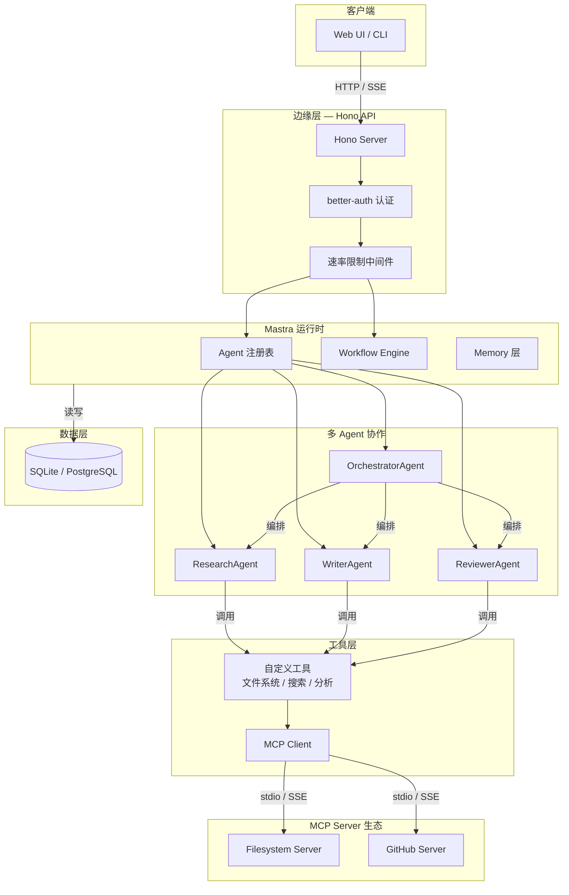
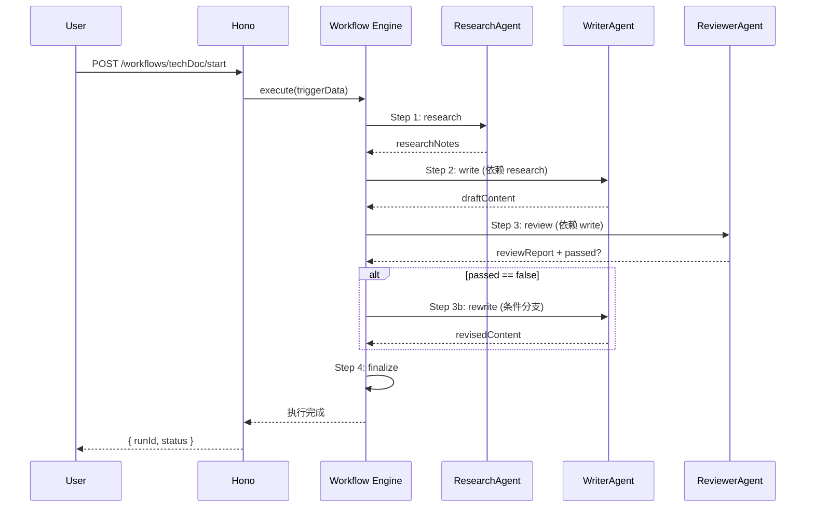
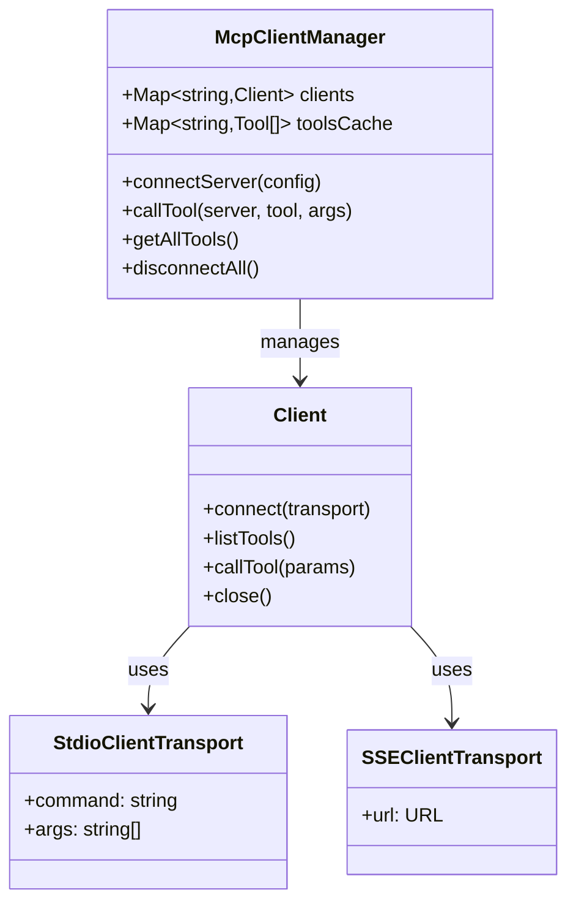
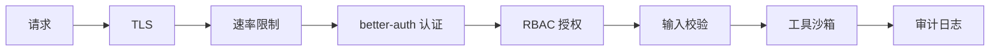

# 系统架构设计

## 1. 整体架构概览



## 2. Mastra 工作流引擎

### 2.1 核心概念

| 概念 | 说明 |
|------|------|
| **Agent** | 具备独立人格、系统提示与工具集的 AI 实体 |
| **Workflow** | 声明式的 DAG（有向无环图），定义 Agent 执行顺序与依赖 |
| **Step** | 工作流中的单个执行节点，可包含条件分支与循环 |
| **Trigger** | 唤醒工作流的初始事件与输入数据 |
| **Shared State** | 跨步骤的共享状态对象，Agent 可读取/写入 |

### 2.2 工作流执行模型



### 2.3 错误处理与重试

- **步骤级别重试**：每个 Step 可配置 `retryPolicy`（最大重试次数、退避间隔）
- **工作流级别补偿**：失败时执行清理逻辑，释放资源
- **超时控制**：每个 Step 可设置 `timeoutMs`，防止无限挂起

## 3. MCP 协议集成

### 3.1 协议层次

```
┌─────────────────────────────────────┐
│           Application Layer          │  AI Agent / IDE / Chat UI
├─────────────────────────────────────┤
│     Model Context Protocol (MCP)     │  JSON-RPC 2.0 + Schema
├─────────────────────────────────────┤
│         Transport Layer              │  stdio / SSE / HTTP Streamable
├─────────────────────────────────────┤
│           OS / Network               │  Process Pipe / TCP / HTTP
└─────────────────────────────────────┘
```

### 3.2 通信原语

| 原语 | 方向 | 用途 |
|------|------|------|
| **Tools** | Client → Server | LLM 可调用的函数，含输入 Schema |
| **Resources** | Client → Server | 只读数据源（文件、配置、API 响应） |
| **Prompts** | Client → Server | 可复用的提示词模板，支持参数化 |
| **Sampling** | Server → Client | Server 请求 Client 执行 LLM 推理 |

### 3.3 MCP Client 管理器设计



## 4. Agent 通信模型

### 4.1 编排模式

本项目采用 **"中心化编排"** 模式：

- **Orchestrator Agent** 作为中央调度器，负责任务分解与分配
- **Worker Agent**（Research / Write / Review）无状态，接收任务即执行
- 所有状态通过 **Shared State** 传递，Agent 间不直接通信

### 4.2 与 A2A 的关系

> MCP 解决 "Agent 如何调用工具"，A2A 解决 "Agent 如何与其他 Agent 对话"。

当前实现中，Agent 间协作通过 Orchestrator 间接完成。未来可引入 A2A 协议实现 Agent 间的对等通信与任务委托。

## 5. 安全架构



| 层级 | 机制 |
|------|------|
| 传输层 | TLS 1.3 / HTTPS |
| 接入层 | IP + 用户双重速率限制 |
| 认证层 | OAuth 2.0 + Session Cookie |
| 授权层 | RBAC（admin / developer / viewer） |
| 应用层 | Zod Schema 输入校验 |
| 工具层 | 路径遍历防护、沙箱根目录限制 |
| 观测层 | 完整的 Agent 调用审计日志 |
