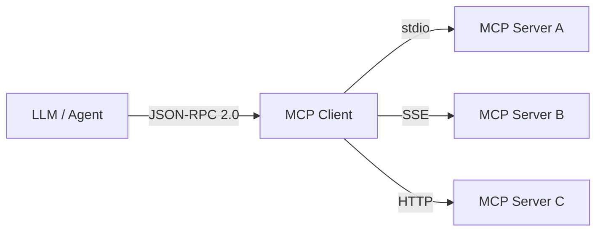
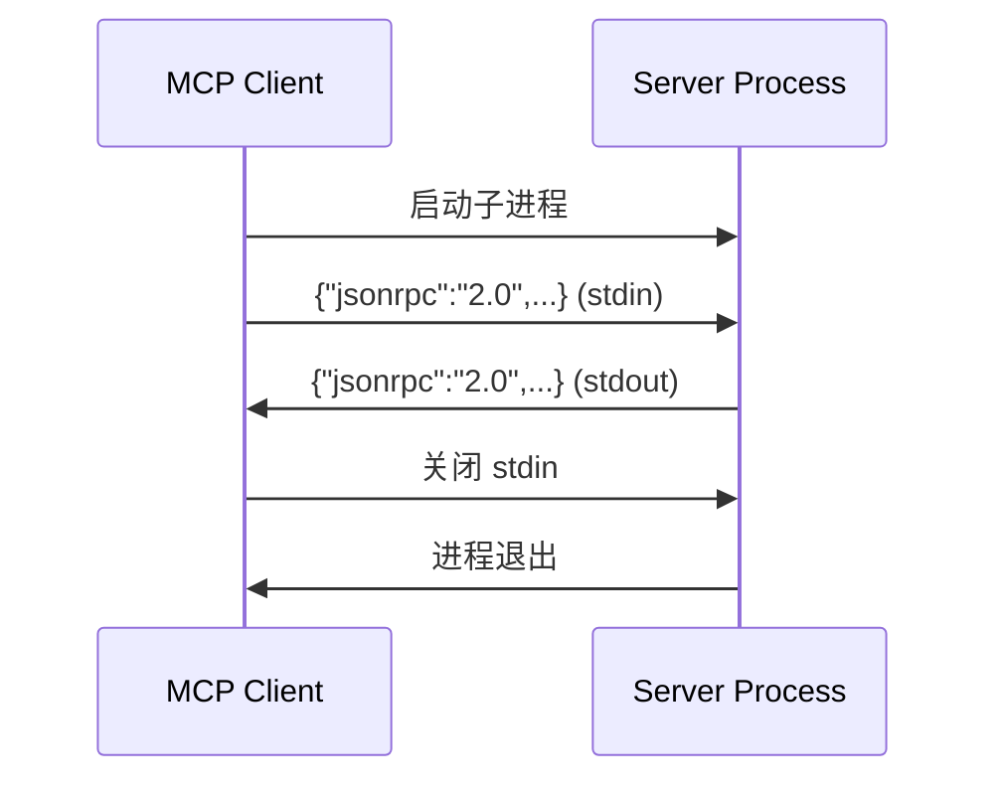
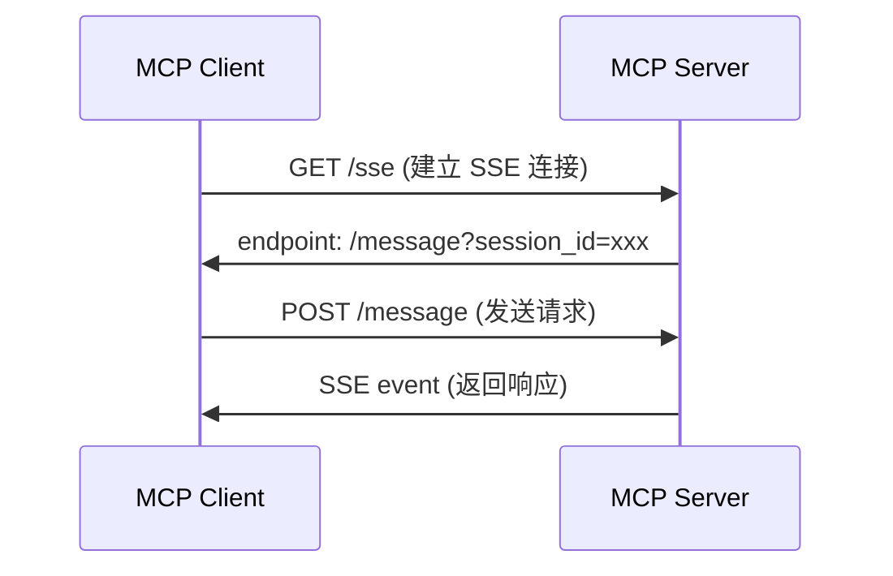
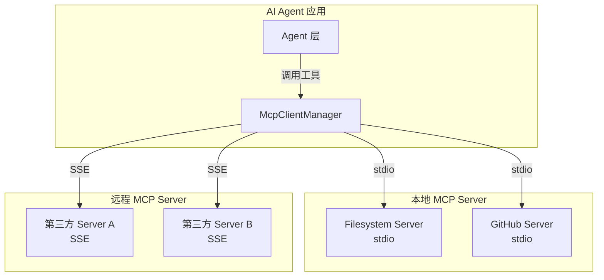

# MCP 协议集成详解

## 1. 什么是 MCP？

**Model Context Protocol（MCP）** 是 AI 时代的 "USB-C" 接口，标准化了 LLM 与外部工具、数据源之间的通信方式。



---

## 2. 协议核心规范

### 2.1 JSON-RPC 2.0 消息格式

**请求**：

```json
{
  "jsonrpc": "2.0",
  "id": 1,
  "method": "tools/call",
  "params": {
    "name": "read_file",
    "arguments": { "path": "docs/readme.md" }
  }
}
```

**响应**：

```json
{
  "jsonrpc": "2.0",
  "id": 1,
  "result": {
    "content": [
      { "type": "text", "text": "文件内容..." }
    ]
  }
}
```

**错误**：

```json
{
  "jsonrpc": "2.0",
  "id": 1,
  "error": {
    "code": -32602,
    "message": "Invalid params: 缺少 path 字段"
  }
}
```

### 2.2 标准错误码

| 错误码 | 含义 | 场景 |
|--------|------|------|
| -32700 | Parse error | JSON 解析失败 |
| -32600 | Invalid Request | 非 JSON-RPC 2.0 格式 |
| -32601 | Method not found | 调用的方法不存在 |
| -32602 | Invalid params | 参数校验失败 |
| -32603 | Internal error | 服务器内部错误 |

---

## 3. 传输层实现

### 3.1 stdio（标准输入输出）

**适用场景**：本地进程间通信、CLI 工具、安全隔离环境。



**优点**：

- 零网络依赖，本地进程间通信
- 天然沙箱隔离（进程边界）
- 适合敏感操作（文件系统访问）

**缺点**：

- 仅支持单 Client
- 进程管理复杂（崩溃检测、重启）

### 3.2 SSE（Server-Sent Events）

**适用场景**：远程服务、Web 环境、多 Client 并发。



**优点**：

- 支持多 Client 并发
- 跨网络、跨机器
- 基于 HTTP，防火墙友好

**缺点**：

- 需要网络基础设施
- 需处理连接保活与重连

#### 代码示例：SSE Transport MCP Server

```typescript
// sse-server.ts — 基于 Express + SSE 的 MCP Server
import express from 'express';
import { Server } from '@modelcontextprotocol/sdk/server/index.js';
import { SSEServerTransport } from '@modelcontextprotocol/sdk/server/sse.js';
import { CallToolRequestSchema, ListToolsRequestSchema } from '@modelcontextprotocol/sdk/types.js';

const app = express();
const server = new Server(
  { name: 'weather-sse-server', version: '1.0.0' },
  { capabilities: { tools: {} } }
);

server.setRequestHandler(ListToolsRequestSchema, async () => ({
  tools: [
    {
      name: 'get_weather',
      description: '获取指定城市的当前天气',
      inputSchema: {
        type: 'object',
        properties: {
          city: { type: 'string', description: '城市名称（如 Beijing）' },
          units: { type: 'string', enum: ['celsius', 'fahrenheit'], default: 'celsius' },
        },
        required: ['city'],
      },
    },
  ],
}));

server.setRequestHandler(CallToolRequestSchema, async (request) => {
  const { name, arguments: args } = request.params;
  if (name === 'get_weather') {
    const { city, units = 'celsius' } = args as { city: string; units?: string };
    // 实际应调用天气 API
    const temp = units === 'celsius' ? 22 : 72;
    return {
      content: [{ type: 'text', text: `${city} 当前温度: ${temp}°${units === 'celsius' ? 'C' : 'F'}` }],
    };
  }
  throw new Error(`Unknown tool: ${name}`);
});

let transport: SSEServerTransport;

app.get('/sse', async (req, res) => {
  transport = new SSEServerTransport('/message', res);
  await server.connect(transport);
});

app.post('/message', async (req, res) => {
  if (transport) {
    await transport.handlePostMessage(req, res);
  } else {
    res.status(400).json({ error: 'No active SSE connection' });
  }
});

app.listen(3000, () => console.log('MCP SSE Server running on http://localhost:3000'));
```

### 3.3 HTTP Streamable（MCP 2025-03 新增）

**适用场景**：无状态 HTTP 服务、Serverless 函数、负载均衡环境。

```typescript
// streamable-server.ts — HTTP Streamable Transport
import { Server } from '@modelcontextprotocol/sdk/server/index.js';
import { StreamableHTTPServerTransport } from '@modelcontextprotocol/sdk/server/streamableHttp.js';
import { CallToolRequestSchema, ListToolsRequestSchema } from '@modelcontextprotocol/sdk/types.js';
import http from 'http';

const server = new Server(
  { name: 'http-server', version: '1.0.0' },
  { capabilities: { tools: {} } }
);

server.setRequestHandler(ListToolsRequestSchema, async () => ({
  tools: [{ name: 'echo', description: 'Echo back the input', inputSchema: { type: 'object', properties: { message: { type: 'string' } }, required: ['message'] } }],
}));

server.setRequestHandler(CallToolRequestSchema, async (request) => {
  const { name, arguments: args } = request.params;
  if (name === 'echo') {
    return { content: [{ type: 'text', text: `Echo: ${(args as { message: string }).message}` }] };
  }
  throw new Error('Unknown tool');
});

const httpServer = http.createServer(async (req, res) => {
  if (req.url === '/mcp' && req.method === 'POST') {
    const transport = new StreamableHTTPServerTransport({ sessionIdGenerator: undefined });
    await server.connect(transport);
    await transport.handleRequest(req, res);
  } else {
    res.writeHead(404).end('Not Found');
  }
});

httpServer.listen(3001, () => console.log('MCP HTTP Server on http://localhost:3001/mcp'));
```

---

## 4. 本项目 MCP 集成架构

### 4.1 组件关系



### 4.2 工具发现流程

```typescript
// 1. 连接 Server
await mcpManager.connectServer({
  name: "filesystem",
  transport: "stdio",
  command: "tsx",
  args: ["mcp-servers/filesystem-server/index.ts"],
});

// 2. 获取所有工具
const tools = mcpManager.getAllTools();
// [
//   { server: "filesystem", tool: { name: "read_file", ... } },
//   { server: "filesystem", tool: { name: "write_file", ... } },
// ]

// 3. 调用工具
const result = await mcpManager.callTool("filesystem", "read_file", {
  path: "docs/readme.md",
});
```

### 4.3 错误处理与重试模式

```typescript
class McpClientManager {
  private servers = new Map<string, Client>();

  async callToolWithRetry(
    serverName: string,
    toolName: string,
    args: Record<string, unknown>,
    options: { retries?: number; delayMs?: number } = {}
  ) {
    const { retries = 3, delayMs = 1000 } = options;
    const client = this.servers.get(serverName);
    if (!client) throw new Error(`Server ${serverName} not connected`);

    let lastError: Error;
    for (let attempt = 0; attempt <= retries; attempt++) {
      try {
        const response = await client.callTool({ name: toolName, arguments: args });
        if (response.isError) {
          throw new Error(`Tool error: ${response.content.map(c => (c as { text: string }).text).join('\n')}`);
        }
        return response;
      } catch (err) {
        lastError = err as Error;
        if (attempt < retries) {
          console.warn(`Attempt ${attempt + 1} failed, retrying in ${delayMs}ms...`);
          await new Promise(r => setTimeout(r, delayMs * (attempt + 1))); // 指数退避
        }
      }
    }
    throw lastError!;
  }
}
```

---

## 5. 开发自定义 MCP Server

### 5.1 最小实现模板

```typescript
import { Server } from "@modelcontextprotocol/sdk/server/index.js";
import { StdioServerTransport } from "@modelcontextprotocol/sdk/server/stdio.js";
import {
  CallToolRequestSchema,
  ListToolsRequestSchema,
} from "@modelcontextprotocol/sdk/types.js";

const server = new Server(
  { name: "my-server", version: "1.0.0" },
  { capabilities: { tools: {} } }
);

server.setRequestHandler(ListToolsRequestSchema, async () => ({
  tools: [
    {
      name: "hello",
      description: "Say hello",
      inputSchema: {
        type: "object",
        properties: { name: { type: "string" } },
        required: ["name"],
      },
    },
  ],
}));

server.setRequestHandler(CallToolRequestSchema, async (request) => {
  const { name, arguments: args } = request.params;
  if (name === "hello") {
    return {
      content: [{ type: "text", text: `Hello, ${(args as { name: string }).name}!` }],
    };
  }
  throw new Error("Unknown tool");
});

const transport = new StdioServerTransport();
await server.connect(transport);
```

### 5.2 Resources 与 Prompts 能力扩展

```typescript
// 除 tools 外，MCP Server 还可暴露资源和提示模板
const server = new Server(
  { name: 'knowledge-base', version: '1.0.0' },
  {
    capabilities: {
      tools: {},
      resources: {},      // 可被客户端订阅/读取的文件/数据
      prompts: {},        // 可复用的提示模板
    },
  }
);

// 暴露资源列表
server.setRequestHandler(ListResourcesRequestSchema, async () => ({
  resources: [
    { uri: 'docs://api-reference', name: 'API Reference', mimeType: 'text/markdown' },
    { uri: 'docs://changelog', name: 'Changelog', mimeType: 'text/markdown' },
  ],
}));

// 读取资源内容
server.setRequestHandler(ReadResourceRequestSchema, async (request) => {
  const { uri } = request.params;
  if (uri === 'docs://api-reference') {
    return {
      contents: [{ uri, mimeType: 'text/markdown', text: '# API Reference\n...' }],
    };
  }
  throw new Error(`Resource not found: ${uri}`);
});

// 暴露提示模板
server.setRequestHandler(ListPromptsRequestSchema, async () => ({
  prompts: [
    {
      name: 'code-review',
      description: '对代码变更进行审查',
      arguments: [
        { name: 'diff', description: 'Git diff 内容', required: true },
        { name: 'language', description: '编程语言', required: false },
      ],
    },
  ],
}));

server.setRequestHandler(GetPromptRequestSchema, async (request) => {
  const { name, arguments: args } = request.params;
  if (name === 'code-review') {
    return {
      messages: [
        {
          role: 'user',
          content: {
            type: 'text',
            text: `请审查以下 ${args?.language || ''} 代码变更：\n\n${args?.diff}`,
          },
        },
      ],
    };
  }
  throw new Error(`Prompt not found: ${name}`);
});
```

### 5.3 安全最佳实践

1. **输入校验**：严格校验工具参数，防止注入攻击
2. **路径沙箱**：文件系统操作限制在安全根目录内
3. **最小权限**：Server 仅暴露必要的工具与资源
4. **错误隐藏**：生产环境不暴露内部错误堆栈
5. **审计日志**：记录所有工具调用与参数

#### 代码示例：路径沙箱实现

```typescript
import { resolve, relative, isAbsolute } from 'path';

class SafeFileSystem {
  private root: string;

  constructor(rootDir: string) {
    this.root = resolve(rootDir);
  }

  private sanitizePath(requestedPath: string): string {
    const target = isAbsolute(requestedPath)
      ? resolve(requestedPath)
      : resolve(this.root, requestedPath);

    // 确保目标路径在沙箱内
    const rel = relative(this.root, target);
    if (rel.startsWith('..') || rel === '..') {
      throw new Error('Access denied: path outside sandbox');
    }
    return target;
  }

  readFile(path: string): string {
    const safePath = this.sanitizePath(path);
    // 实际读取...
    return `Contents of ${safePath}`;
  }
}
```

---

## 6. 调试与测试

### 6.1 使用 MCP Inspector

```bash
npx @modelcontextprotocol/inspector tsx mcp-servers/filesystem-server/index.ts
```

### 6.2 手动测试 stdio Server

```bash
# 启动 Server
echo '{"jsonrpc":"2.0","id":1,"method":"tools/list"}' | \
  tsx mcp-servers/filesystem-server/index.ts

# 测试工具调用
echo '{"jsonrpc":"2.0","id":2,"method":"tools/call","params":{"name":"read_file","arguments":{"path":"package.json"}}}' | \
  tsx mcp-servers/filesystem-server/index.ts
```

### 6.3 日志级别

```bash
# 开发环境开启详细日志
DEBUG=mcp:* npm run dev

# 仅查看 SDK 日志
DEBUG=mcp:sdk npm run dev
```

### 6.4 单元测试 MCP Server

```typescript
// tests/hello-server.test.ts
import { Client } from '@modelcontextprotocol/sdk/client/index.js';
import { InMemoryTransport } from '@modelcontextprotocol/sdk/inMemory.js';
import { createHelloServer } from '../src/hello-server';

describe('Hello MCP Server', () => {
  it('should list available tools', async () => {
    const server = createHelloServer();
    const [clientTransport, serverTransport] = InMemoryTransport.createLinkedPair();

    await Promise.all([
      server.connect(serverTransport),
      new Client({ name: 'test-client', version: '1.0.0' }).connect(clientTransport),
    ]);

    const tools = await client.listTools();
    expect(tools.tools).toHaveLength(1);
    expect(tools.tools[0].name).toBe('hello');
  });
});
```

---

## 参考资源

- [MCP Specification](https://modelcontextprotocol.io/specification/2025-03-26) — 官方协议规范（2025-03-26 版本）
- [MCP SDK for TypeScript](https://github.com/modelcontextprotocol/typescript-sdk) — TypeScript SDK 源码
- [MCP Inspector](https://github.com/modelcontextprotocol/inspector) — 可视化调试工具
- [MCP Server 生态](https://github.com/modelcontextprotocol/servers) — 官方维护的 Server 集合
- [Anthropic MCP 公告](https://www.anthropic.com/news/model-context-protocol) — MCP 最初发布博客
- [MCP on Linux Foundation](https://www.linuxfoundation.org/press/linux-foundation-announces-model-context-protocol-as-a-standards-project) — 进入 Linux Foundation 公告
- [Vercel AI SDK MCP 集成](https://sdk.vercel.ai/docs/ai-sdk-core/tools-and-tool-calling#model-context-protocol-mcp-tools) — AI SDK 中的 MCP 支持
- [JSON-RPC 2.0 Specification](https://www.jsonrpc.org/specification) — 底层通信协议规范
