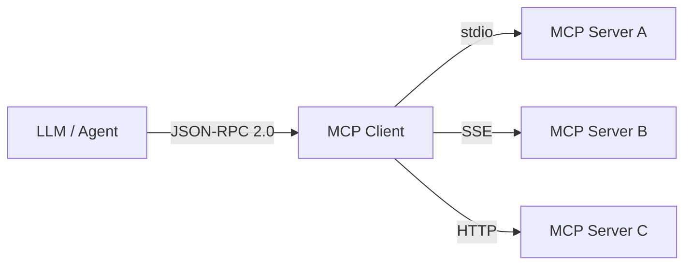
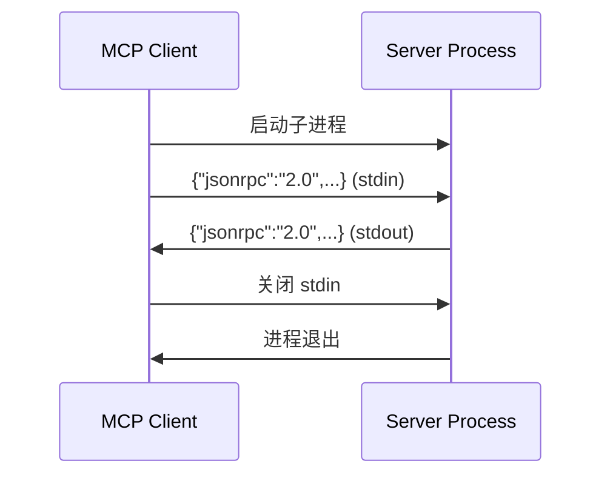
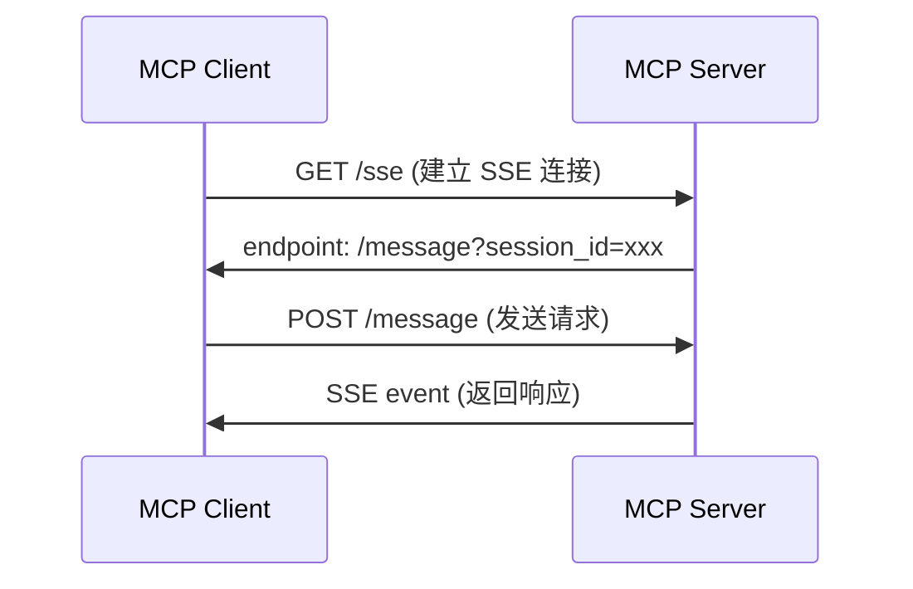
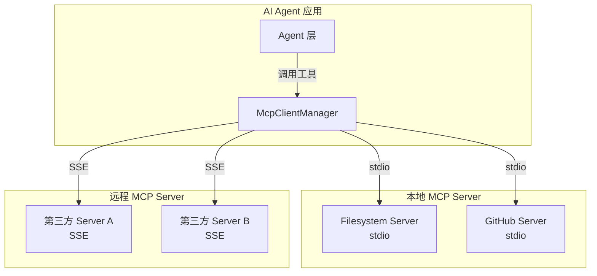

# MCP 协议集成详解

## 1. 什么是 MCP？

**Model Context Protocol（MCP）** 是 AI 时代的 "USB-C" 接口，标准化了 LLM 与外部工具、数据源之间的通信方式。



## 2. 协议核心规范

### 2.1 JSON-RPC 2.0 消息格式

**请求**：

```json
{
  "jsonrpc": "2.0",
  "id": 1,
  "method": "tools/call",
  "params": {
    "name": "read_file",
    "arguments": { "path": "docs/readme.md" }
  }
}
```

**响应**：

```json
{
  "jsonrpc": "2.0",
  "id": 1,
  "result": {
    "content": [
      { "type": "text", "text": "文件内容..." }
    ]
  }
}
```

**错误**：

```json
{
  "jsonrpc": "2.0",
  "id": 1,
  "error": {
    "code": -32602,
    "message": "Invalid params: 缺少 path 字段"
  }
}
```

### 2.2 标准错误码

| 错误码 | 含义 | 场景 |
|--------|------|------|
| -32700 | Parse error | JSON 解析失败 |
| -32600 | Invalid Request | 非 JSON-RPC 2.0 格式 |
| -32601 | Method not found | 调用的方法不存在 |
| -32602 | Invalid params | 参数校验失败 |
| -32603 | Internal error | 服务器内部错误 |

## 3. 传输层实现

### 3.1 stdio（标准输入输出）

**适用场景**：本地进程间通信、CLI 工具、安全隔离环境。



**优点**：

- 零网络依赖，本地进程间通信
- 天然沙箱隔离（进程边界）
- 适合敏感操作（文件系统访问）

**缺点**：

- 仅支持单 Client
- 进程管理复杂（崩溃检测、重启）

### 3.2 SSE（Server-Sent Events）

**适用场景**：远程服务、Web 环境、多 Client 并发。



**优点**：

- 支持多 Client 并发
- 跨网络、跨机器
- 基于 HTTP，防火墙友好

**缺点**：

- 需要网络基础设施
- 需处理连接保活与重连

## 4. 本项目 MCP 集成架构

### 4.1 组件关系



### 4.2 工具发现流程

```typescript
// 1. 连接 Server
await mcpManager.connectServer({
  name: "filesystem",
  transport: "stdio",
  command: "tsx",
  args: ["mcp-servers/filesystem-server/index.ts"],
});

// 2. 获取所有工具
const tools = mcpManager.getAllTools();
// [
//   { server: "filesystem", tool: { name: "read_file", ... } },
//   { server: "filesystem", tool: { name: "write_file", ... } },
// ]

// 3. 调用工具
const result = await mcpManager.callTool("filesystem", "read_file", {
  path: "docs/readme.md",
});
```

## 5. 开发自定义 MCP Server

### 5.1 最小实现模板

```typescript
import { Server } from "@modelcontextprotocol/sdk/server/index.js";
import { StdioServerTransport } from "@modelcontextprotocol/sdk/server/stdio.js";
import {
  CallToolRequestSchema,
  ListToolsRequestSchema,
} from "@modelcontextprotocol/sdk/types.js";

const server = new Server(
  { name: "my-server", version: "1.0.0" },
  { capabilities: { tools: {} } }
);

server.setRequestHandler(ListToolsRequestSchema, async () => ({
  tools: [
    {
      name: "hello",
      description: "Say hello",
      inputSchema: {
        type: "object",
        properties: { name: { type: "string" } },
        required: ["name"],
      },
    },
  ],
}));

server.setRequestHandler(CallToolRequestSchema, async (request) => {
  const { name, arguments: args } = request.params;
  if (name === "hello") {
    return {
      content: [{ type: "text", text: `Hello, ${(args as { name: string }).name}!` }],
    };
  }
  throw new Error("Unknown tool");
});

const transport = new StdioServerTransport();
await server.connect(transport);
```

### 5.2 安全最佳实践

1. **输入校验**：严格校验工具参数，防止注入攻击
2. **路径沙箱**：文件系统操作限制在安全根目录内
3. **最小权限**：Server 仅暴露必要的工具与资源
4. **错误隐藏**：生产环境不暴露内部错误堆栈
5. **审计日志**：记录所有工具调用与参数

## 6. 调试与测试

### 6.1 使用 MCP Inspector

```bash
npx @modelcontextprotocol/inspector tsx mcp-servers/filesystem-server/index.ts
```

### 6.2 手动测试 stdio Server

```bash
# 启动 Server
echo '{"jsonrpc":"2.0","id":1,"method":"tools/list"}' | \
  tsx mcp-servers/filesystem-server/index.ts
```

### 6.3 日志级别

```bash
# 开发环境开启详细日志
DEBUG=mcp:* npm run dev
```
