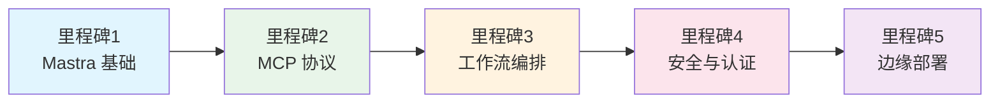

# 学习里程碑

## 里程碑 1：Mastra 框架基础与 Agent 定义

**目标**：理解 Mastra 的核心抽象，能够独立定义 Agent 并配置系统提示与工具。

### 学习内容

- [ ] Agent 的构成要素：name、instructions、model、tools
- [ ] Mastra 实例的创建与 Agent 注册
- [ ] 系统提示词工程（角色定义、行为约束、输出格式）

### 实践任务

1. 修改 `src/mastra/agents/researcher.ts`，为 Research Agent 增加一个新的工具绑定
2. 在 `mastra.config.ts` 中注册一个新的测试 Agent
3. 使用 `mastra.getAgent("researcher").generate("...")` 在本地测试 Agent 输出

### 验证标准

- Agent 能够正确调用绑定的工具
- 系统提示词对输出格式有明显约束效果

---

## 里程碑 2：MCP 协议理解与 Server/Client 实现

**目标**：掌握 MCP 协议的核心原语，能够开发自定义 MCP Server 并在 Client 中消费。

### 学习内容

- [ ] JSON-RPC 2.0 请求/响应格式
- [ ] MCP 三大原语：Tools、Resources、Prompts
- [ ] 传输层差异：stdio vs SSE vs HTTP Streamable

### 实践任务

1. 在 `mcp-servers/` 下新建一个 `weather-server/`，暴露 `get_forecast` 工具
2. 在 `src/lib/mcp-client.ts` 中连接新建的 Weather Server
3. 在 Hono API 中新增 `/api/weather` 路由，通过 MCP Client 调用天气工具

### 验证标准

- 外部 Client（如 Claude Desktop）能够连接并调用你的 MCP Server
- API 路由返回正确的天气数据

---

## 里程碑 3：多 Agent 工作流编排（DAG + 条件分支）

**目标**：掌握声明式工作流定义，实现复杂的多阶段业务自动化。

### 学习内容

- [ ] Workflow 的 Step 定义与依赖关系
- [ ] 并行执行（parallel steps）与顺序执行（sequential steps）
- [ ] 条件分支（if/else）与循环（retry）
- [ ] Shared State 的读取与写入

### 实践任务

1. 修改 `src/mastra/workflows/tech-doc-workflow.ts`，在 Review 步骤后增加 "Publish" 步骤
2. 创建新的工作流 `src/mastra/workflows/bug-fix-workflow.ts`：Research → Reproduce → Fix → Test
3. 实现条件分支：若 Test 失败，则回到 Fix 步骤（最多重试 3 次）

### 验证标准

- 工作流能够按预期顺序执行
- 条件分支在特定输入下正确触发
- 重试机制在模拟失败后生效

---

## 里程碑 4：认证、授权与 API 安全（better-auth + Hono）

**目标**：为 AI Agent 系统构建企业级的安全防线。

### 学习内容

- [ ] better-auth 的配置：OAuth、Session、数据库适配
- [ ] RBAC 插件的角色与权限定义
- [ ] Hono 中间件链的组装顺序与错误处理
- [ ] 速率限制的实现策略（固定窗口 vs 滑动窗口 vs Token Bucket）

### 实践任务

1. 配置 GitHub OAuth，实现完整的登录/登出流程
2. 在 `src/server/middleware/auth.ts` 中新增 `requirePermission` 中间件
3. 将速率限制中间件从内存实现迁移到 Redis 实现
4. 为所有敏感操作添加审计日志（写入 `agent_invocations` 表）

### 验证标准

- 未登录用户访问受保护接口返回 401
- 无权限用户访问管理员接口返回 403
- 超过速率限制的请求返回 429 并携带 Retry-After 头

---

## 里程碑 5：部署到边缘运行时（Cloudflare Workers）

**目标**：理解边缘运行时的特点，将 Mastra + Hono 应用部署到全球边缘节点。

### 学习内容

- [ ] Cloudflare Workers 的执行模型与限制（CPU 时间、内存、Request 大小）
- [ ] Hono 在 Workers 中的适配（不依赖 Node.js 内置模块）
- [ ] D1 数据库替代 SQLite
- [ ] Wrangler CLI 的使用与配置

### 实践任务

1. 安装 Wrangler CLI 并登录 Cloudflare 账号
2. 创建 `wrangler.toml` 配置 Workers 路由与 D1 绑定
3. 修改 `src/lib/db.ts`，在 Workers 环境中使用 D1 适配器
4. 修改 `src/server/index.ts`，移除 Node.js 专属依赖，导出 `fetch` handler
5. 运行 `wrangler deploy` 完成部署

### 验证标准

- `curl https://your-worker.your-subdomain.workers.dev/health` 返回 200
- Agent 调用接口在边缘节点正常工作
- 数据库读写通过 D1 完成

---

## 学习路径图

