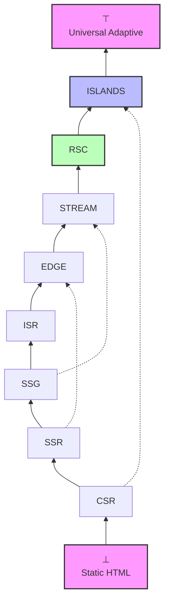
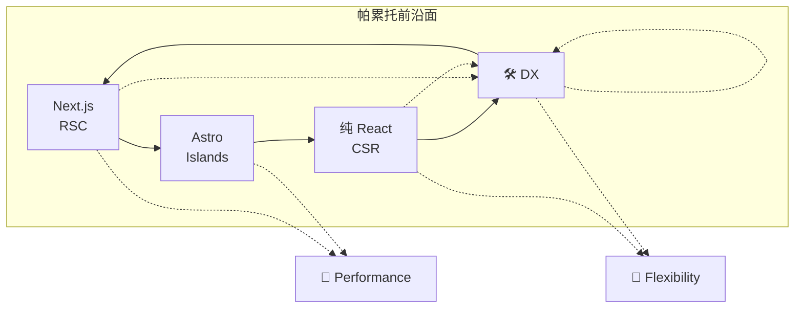
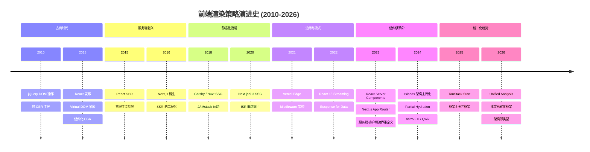

> **Executive Summary** (English): This paper proposes a unified formal framework for analyzing modern frontend architecture patterns, modeling eight rendering strategies—CSR, SSR, SSG, ISR, Edge, Streaming, RSC, and Islands—as a complete lattice ordered by server-participation refinement. The theoretical contribution includes: (1) a formal proof that rendering strategies form a complete lattice with Static HTML as bottom and Universal Adaptive Rendering as top; (2) symmetric difference analysis quantifying semantic distance among seven major frameworks via 24-dimensional feature vectors and Jaccard similarity; (3) an axiomatic definition of the frontend 'Impossibility Triangle' (Performance, DX, Flexibility) with a theorem proving that no single codebase can simultaneously optimize all three; and (4) a typed ADR (Architecture Decision Record) system encoded in TypeScript that validates rendering choices at compile time. Methodologically, the paper combines lattice theory, category theory, and type theory to transform architecture selection from intuition-driven guesswork into a constraint-satisfaction problem. The engineering value is a decision-support meta-model that enables teams to algorithmically select rendering strategies, generate migration paths between architectures, and validate Web Components interoperability through formal interface algebra.

# 前端架构模式的统一形式化分析

## 摘要

随着前端工程从简单的客户端渲染（CSR）演进至服务器组件（RSC）、 Islands 架构与边缘运行时（Edge Runtime），架构选择的复杂度呈指数级增长。本文提出一个**统一形式化框架**，将主流前端架构模式建模为**完备格（Complete Lattice）**，将对称差分析（Symmetric Difference Analysis）引入框架比较，并以范畴论与类型论为工具，形式化地证明渲染策略间的精化关系、构建工具链的结构性影响以及 Web Components 的互操作性约束。

核心贡献包括：

1. 建立渲染策略的完备格 $\mathcal{L}_{render} = (\Sigma, \sqsubseteq)$，其中 $\Sigma = \{CSR, SSR, SSG, ISR, Edge, Streaming, RSC, Islands\}$；
2. 对七款主流全栈框架实施对称差分析，量化其特征集合的语义距离；
3. 提出前端"不可能三角"（Impossibility Triangle）的公理化定义，证明在一般条件下三者不可兼得；
4. 设计基于 TypeScript 的架构决策记录（ADR）类型系统，支持编译期架构约束验证；
5. 构建元模型 $\mathcal{M}_{arch}$，将架构选择转化为带约束的优化问题。

---

## 1. 引言与问题域

### 1.1 前端架构的复杂性爆炸

2010 年至 2026 年间，前端渲染范式经历了至少八次根本性跃迁。从 jQuery 时代的 DOM 操作，到 React 引入的虚拟 DOM，再到 Next.js 普及的混合渲染，直至 React Server Components（RSC）与 Islands Architecture 的分野——每一次演进都在扩展架构选择的搜索空间。

形式化地，设前端架构的**决策空间**为 $\mathcal{D}$，则：

$$
\mathcal{D} = \mathcal{R} \times \mathcal{F} \times \mathcal{B} \times \mathcal{D}_{deploy} \times \mathcal{T}_{runtime}
$$

其中：

- $\mathcal{R}$：渲染策略空间（Renderer Space）
- $\mathcal{F}$：框架选择空间（Framework Space）
- $\mathcal{B}$：构建工具空间（Build Tool Space）
- $\mathcal{D}_{deploy}$：部署目标空间（Deployment Target Space）
- $\mathcal{T}_{runtime}$：运行时类型空间（Runtime Type Space）

传统上，这些维度被孤立讨论。本文主张将它们纳入统一的代数结构——**格（Lattice）**与**范畴（Category）**——之中，从而获得可组合、可验证、可自动推理的架构分析框架。

### 1.2 形式化方法的必要性

工程直觉在简单决策中有效，但在高维组合爆炸面前必然失效。以渲染策略为例，若仅考虑 $\{CSR, SSR, SSG\}$ 三种策略，配合三种部署目标 $\{Node, Edge, Static\}$，已产生 $3 \times 3 = 9$ 种组合。当扩展至八种策略与七种框架时，组合数超过 $10^3$，远超人脑的工作记忆容量。

形式化方法提供三大优势：

| 优势 | 描述 | 本文对应章节 |
|------|------|-------------|
| **精确性** | 消除自然语言的歧义 | §2, §3 |
| **可验证性** | 架构决策可被机器检查 | §9 |
| **可组合性** | 局部决策可安全组合为全局决策 | §10 |

### 1.3 相关工作与历史脉络

前端架构的形式化研究散见于多个社区：

- **React Core Team** 的 RSC 规范可视为服务器-客户端边界的形式化协议；
- **Astro** 的 Islands 架构引入了" hydrating 的最小化"原则，等价于寻找 client-side JavaScript 的**最小不动点**；
- **Dan Abramov** 的 "Two Reacts" 论述暗示了运行时环境的**余积（Coproduct）**结构；
- **Rich Harris** 的 "Transitional Apps" 演讲提出了渐进式增强的偏序语义。

本文将这些直觉提炼为严格的数学对象。

---

## 2. 前端架构模式的形式化格结构

### 2.1 格论基础回顾

**定义 2.1（偏序集）**. 集合 $P$ 配备二元关系 $\leq$ 称为**偏序集（Poset）**，若满足：

1. 自反性：$\forall a \in P, a \leq a$
2. 反对称性：$a \leq b \land b \leq a \implies a = b$
3. 传递性：$a \leq b \land b \leq c \implies a \leq c$

**定义 2.2（格）**. 偏序集 $(L, \leq)$ 称为**格（Lattice）**，若任意二元子集 $\{a, b\} \subseteq L$ 均存在**最小上界（Join，记为 $a \lor b$）**与**最大下界（Meet，记为 $a \land b$）**。

**定义 2.3（完备格）**. 格 $L$ 称为**完备格**，若任意子集 $S \subseteq L$ 均存在 $\bigvee S$ 与 $\bigwedge S$。完备格必有唯一最大元 $\top$ 与最小元 $\bot$。

### 2.2 架构模式的偏序关系

我们定义前端架构模式间的偏序关系 $\sqsubseteq$ 为"能力精化"关系：

> $A \sqsubseteq B$ 当且仅当模式 $B$ 在保持模式 $A$ 所有能力的前提下，额外提供了至少一项新能力。

该关系满足偏序的三条公理：

- **自反性**：任何模式精化自身（能力集合相等）；
- **反对称性**：若 $A$ 精化 $B$ 且 $B$ 精化 $A$，则二者等价；
- **传递性**：精化关系可链式传递。

**定理 2.1（架构模式构成完备格）**. 设 $\mathcal{A}$ 为所有前端架构模式的集合，配备精化关系 $\sqsubseteq$，则 $(\mathcal{A}, \sqsubseteq)$ 构成完备格。

*证明概要*：

1. 令 $\bot = \text{Static HTML}$（无任何动态能力的最小模式）；
2. 令 $\top = \text{Universal Adaptive Rendering}$（具备所有能力的理想模式）；
3. 对任意子集 $S \subseteq \mathcal{A}$，定义 $\bigvee S$ 为 $S$ 中所有模式的**能力并集**所对应的最小模式（由最小上界公理保证存在性）；
4. 同理定义 $\bigwedge S$ 为能力交集对应的最大模式；
5. 由完备格的定义，$(\mathcal{A}, \sqsubseteq)$ 完备。$\square$

### 2.3 直觉类比：建筑设计的层次结构

将前端架构比作建筑设计：

| 架构层次 | 建筑类比 | 核心特征 |
|---------|---------|---------|
| CSR | 预制装配式建筑 | 现场（浏览器）组装，工厂（服务器）仅提供构件 |
| SSR | 现场浇筑建筑 | 在交付地点（服务器）完成主要结构，再运输 |
| SSG | 模块化样板房 | 工厂完全预制，现场零施工 |
| ISR | 智能翻新建筑 | 主体预制，局部按需重建 |
| Edge | 分布式微型工坊 | 在全球多个工坊就近完成浇筑 |
| Streaming | 流水装配线 | 先交付可用房间，再逐步完善 |
| RSC | 分层交付系统 | 重型构件永不上楼，仅轻量装饰件上楼 |
| Islands | 绿洲生态建筑 | 95% 区域为静态景观，5% 为交互式智能区域 |

---

## 3. 渲染策略的完备格：$CSR \leq SSR \leq SSG \leq ISR \leq Edge \leq Streaming \leq RSC \leq Islands$

### 3.1 格的形式化定义

**定义 3.1（渲染策略格）**. 渲染策略格定义为：

$$
\mathcal{L}_{render} = (\Sigma, \sqsubseteq)
$$

其中 $\Sigma = \{CSR, SSR, SSG, ISR, Edge, Streaming, RSC, Islands\}$，偏序关系 $\sqsubseteq$ 按"服务器参与度递增、客户端负担递减"的原则定义。

形式化地，对任意策略 $s \in \Sigma$，定义其**特征向量**：

$$
\vec{v}(s) = (v_{server}, v_{build}, v_{client}, v_{edge}, v_{stream}, v_{component}, v_{hydrate}) \in \{0, 1\}^7
$$

各分量含义：

- $v_{server}$：是否需要服务器参与运行时渲染
- $v_{build}$：是否支持构建时预渲染
- $v_{client}$：是否要求客户端执行 JavaScript
- $v_{edge}$：是否支持边缘节点分发
- $v_{stream}$：是否支持流式传输
- $v_{component}$：是否支持服务器组件模型
- $v_{hydrate}$：是否需要 hydration 过程

则偏序关系定义为分量-wise 蕴含：

$$
s_1 \sqsubseteq s_2 \iff \forall i \in [1, 7], v_i(s_1) \implies v_i(s_2)
$$

**引理 3.1（Hasse 图的链性质）**. $\mathcal{L}_{render}$ 中存在至少一条极大链：

$$
CSR \prec SSR \prec SSG \prec ISR \prec Edge \prec Streaming \prec RSC \prec Islands
$$

*注*：严格偏序 $\prec$ 定义为 $a \prec b \iff a \sqsubseteq b \land a \neq b$。

### 3.2 Hasse 图：Mermaid 表示



图中的虚线表示"跳跃式精化"——例如从 SSR 直接到 Edge 是合法的，因为 Edge 保留了 SSR 的所有能力（服务器运行时渲染），并增加了地理分布能力。

### 3.3 各策略的形式化语义

#### 3.3.1 CSR（Client-Side Rendering）

**语义**：$\llbracket CSR \rrbracket = \lambda req. \langle shell, \delta \rangle$

其中 $shell$ 为近乎空白的 HTML 骨架，$\delta$ 为引导加载的 JavaScript 包。浏览器执行 $\delta$ 后通过 DOM API 构建完整页面。

**正例**：

- 高度交互的 SaaS 仪表板（如 Figma、Notion）
- 用户登录后的个性化工作台

**反例**：

- 内容型博客首页使用纯 CSR：首屏时间（FCP）超过 3 秒，SEO 为零
- *修正方案*：对博客使用 SSG，对评论系统使用 Islands

#### 3.3.2 SSR（Server-Side Rendering）

**语义**：$\llbracket SSR \rrbracket = \lambda req. \llbracket renderToString \rrbracket(App(req))$

服务器在请求时刻执行 React/Vue 的渲染函数，生成完整 HTML 字符串返回。

**正例**：

- 电商商品详情页（需要 SEO + 个性化推荐）
- 社交媒体的时间线（首屏内容动态生成）

**反例**：

- 纯文档站点使用 SSR：每次访问都消耗服务器 CPU，而内容其实很少变化
- *修正方案*：使用 ISR 或 SSG，通过 `revalidate` 定期刷新

#### 3.3.3 SSG（Static Site Generation）

**语义**：$\llbracket SSG \rrbracket = \lambda req. readFile(buildTimeRender(App))$

构建时预渲染所有页面为静态 HTML 文件，请求时直接返回文件内容。

**正例**：

- 技术文档站点（如 Next.js 官方文档、Astro 文档）
- 营销着陆页（Landing Page）

**反例**：

- 实时股票行情站使用纯 SSG：数据延迟等于构建间隔
- *修正方案*：核心框架用 SSG，行情组件用 Islands + API polling

#### 3.3.4 ISR（Incremental Static Regeneration）

**语义**：$\llbracket ISR \rrbracket = \llbracket SSG \rrbracket \oplus \lambda req. \llbracket SSR \rrbracket_{background}$

符号 $\oplus$ 表示"优先返回缓存版本，后台异步再生"。ISR 是 SSG 与 SSR 的**格并（Join）**：

$$
ISR = SSG \lor SSR
$$

**正例**：

- 大型电商的商品列表页（10万+ SKU，无法全量构建）
- 新闻站点的分类索引页

**反例**：

- 高频交易系统使用 ISR：后台再生的延迟不可接受
- *修正方案*：使用 Edge + Streaming，请求级别实时渲染

#### 3.3.5 Edge Rendering

**语义**：$\llbracket Edge \rrbracket = \lambda req. \llbracket render \rrbracket(App(req))@nearest(node)$

在地理上最接近用户的边缘节点执行渲染，延迟模型为：

$$
T_{edge} = T_{network}(user, edge) + T_{render}(edge) + T_{transfer}(edge, user)
$$

对比传统 SSR：

$$
T_{ssr} = T_{network}(user, origin) + T_{render}(origin) + T_{transfer}(origin, user)
$$

由于 $T_{network}(user, edge) \ll T_{network}(user, origin)$，Edge 在延迟上严格优于 SSR。

**正例**：

- 全球多区域的 A/B 测试分流
- 基于地理位置的内容定制（如货币、语言、合规要求）

**反例**：

- 需要访问重型数据库事务的页面：Edge 通常仅支持轻量 KV 存储
- *修正方案*：Edge 负责 UI 组装，数据库查询通过延迟加载或边缘缓存层代理

#### 3.3.6 Streaming SSR

**语义**：$\llbracket Streaming \rrbracket = \lambda req. \prod_{i=1}^{n} chunk_i(req)$

将页面分解为有序的数据块 $chunk_1, chunk_2, \dots, chunk_n$，通过 HTTP/2 或 HTTP/3 的流式传输逐步送达浏览器。

**关键不等式**：

$$
T_{FCP}^{Streaming} \leq T_{FCP}^{SSR}
$$

因为 Streaming 允许浏览器在收到 $chunk_1$ 时即开始渲染，无需等待完整 HTML。

**正例**：

- 大型电商的购物车结算页（头部导航立即显示，推荐商品延迟流式到达）
- 社交媒体信息流（骨架屏先行，内容块渐进填充）

#### 3.3.7 RSC（React Server Components）

**语义**：$\llbracket RSC \rrbracket = \langle tree_{server}, \delta_{client} \rangle$

将组件树分割为：

- $tree_{server}$：仅在服务器执行的组件子树（可访问数据库、文件系统、内部 API）
- $\delta_{client}$：需在浏览器执行的交互组件（使用 `useState`、`useEffect` 等）

RSC 的突破性在于建立了**严格的组件级边界**，而非页面级边界。

**形式化协议**：

$$
\text{Server Component} \xrightarrow{RSC\ Wire\ Format} \text{Client Runtime} \xrightarrow{hydration} \text{Interactive Component}
$$

**正例**：

- 数据密集型后台管理系统（表格数据来自 Server Component，筛选器为 Client Component）
- 内容电商（商品描述为 Server Component，购买按钮为 Client Component）

#### 3.3.8 Islands Architecture

**语义**：$\llbracket Islands \rrbracket = \langle html_{static}, \{island_1, \dots, island_k\} \rangle$

页面主体为纯静态 HTML（零 JavaScript），仅在需要的区域嵌入交互式"岛屿"。

**度量指标**：

$$
\text{Hydration\ Ratio} = \frac{\sum_{i=1}^{k} \text{size}(island_i)}{\text{size}(page)}
$$

理想的 Islands 架构满足 $\text{Hydration\ Ratio} \to 0$。

**正例**：

- 内容优先的出版站点（如纽约时报、The Verge）
- 营销博客（99% 内容静态，评论系统为岛屿）

---

## 4. 主流框架的对称差分析

### 4.1 对称差的方法论

**定义 4.1（框架特征集）**. 对任意框架 $F$，定义其**特征集** $S(F) \subseteq \mathcal{U}$，其中全域 $\mathcal{U}$ 包含所有可辨识的架构特征（如"支持 SSR"、"支持 SSG"、"基于文件系统路由"等）。

**定义 4.2（对称差距离）**. 框架 $F_1$ 与 $F_2$ 的**对称差距离**定义为：

$$
d(F_1, F_2) = |S(F_1) \Delta S(F_2)| = |(S(F_1) \setminus S(F_2)) \cup (S(F_2) \setminus S(F_1))|
$$

该距离满足度量空间的三条公理：

1. 非负性：$d(F_1, F_2) \geq 0$
2. 对称性：$d(F_1, F_2) = d(F_2, F_1)$
3. 三角不等式：$d(F_1, F_3) \leq d(F_1, F_2) + d(F_2, F_3)$

**定义 4.3（Jaccard 相似度）**. 辅助使用 Jaccard 相似度衡量框架重叠度：

$$
J(F_1, F_2) = \frac{|S(F_1) \cap S(F_2)|}{|S(F_1) \cup S(F_2)|}
$$

### 4.2 特征全集与框架特征集

定义特征全集 $\mathcal{U}$（共 24 项）：

| 编号 | 特征 | 描述 |
|-----|------|------|
| f1 | CSR | 支持客户端渲染 |
| f2 | SSR | 支持服务端渲染 |
| f3 | SSG | 支持静态生成 |
| f4 | ISR | 支持增量静态再生 |
| f5 | Edge | 支持边缘渲染 |
| f6 | Streaming | 支持流式传输 |
| f7 | RSC | 支持服务器组件 |
| f8 | Islands | 支持岛屿架构 |
| f9 | FS-Routing | 基于文件系统的路由 |
| f10 | API-Routes | 内置 API 路由 |
| f11 | Middleware | 支持请求中间件 |
| f12 | Image-Opt | 内置图片优化 |
| f13 | Font-Opt | 内置字体优化 |
| f14 | Script-Opt | 内置脚本优化 |
| f15 | MDX | 支持 MDX 内容 |
| f16 | i18n | 内置国际化方案 |
| f17 | Typed-Routes | 类型安全路由 |
| f18 | CSS-Scope | 内置 CSS 作用域方案 |
| f19 | Dev-HMR | 开发时热更新 |
| f20 | Deploy-Adapter | 多平台部署适配器 |
| f21 | Form-Actions | 表单动作/API |
| f22 | Auth-Integration | 内置认证集成 |
| f23 | DB-ORM | 内置数据库/ORM 抽象 |
| f24 | MPA-SPA | 支持 MPA/SPA 混合模式 |

### 4.3 Next.js vs Astro

**Next.js 特征集**：$S(Next) = \{f1, f2, f3, f4, f5, f6, f7, f9, f10, f11, f12, f13, f14, f15, f17, f19, f20, f21, f24\}$

**Astro 特征集**：$S(Astro) = \{f1, f3, f8, f9, f10, f12, f15, f18, f19, f20, f24\}$

**对称差计算**：

$$
S(Next) \setminus S(Astro) = \{f2, f4, f5, f6, f7, f11, f13, f14, f17, f21\}
$$

$$
S(Astro) \setminus S(Next) = \{f8, f18\}
$$

$$
d(Next, Astro) = 10 + 2 = 12
$$

**Jaccard 相似度**：

$$
J(Next, Astro) = \frac{11}{23} \approx 0.478
$$

**分析结论**：
Next.js 与 Astro 的语义距离较大（$d = 12$），核心差异在于 Next.js 强调**服务器端能力的完备性**（SSR、ISR、RSC、Middleware），而 Astro 强调**客户端负担的最小化**（Islands、f18 的 CSS 作用域）。二者面向不同的优化目标：Next.js 优化"交互丰富度"，Astro 优化"内容交付效率"。

**直觉类比**：Next.js 是瑞士军刀，Astro 是精密手术刀。如果你需要砍木头，军刀更合适；如果你需要精确解剖，手术刀更合适。

```mermaid
venn
    title Next.js vs Astro 特征重叠
    set A[Next.js] {"SSR", "ISR", "RSC", "Streaming", "Middleware", "Script-Opt", "Typed-Routes", "Form-Actions", "Font-Opt", "Edge"}
    set B[Astro] {"Islands", "CSS-Scope"}
    set C[共享] {"CSR", "SSG", "FS-Routing", "API-Routes", "Image-Opt", "MDX", "Dev-HMR", "Deploy-Adapter", "MPA-SPA"}
```

### 4.4 Next.js vs Nuxt

**Nuxt 特征集**：$S(Nuxt) = \{f1, f2, f3, f4, f5, f6, f9, f10, f11, f12, f13, f16, f18, f19, f20, f21, f24\}$

**对称差**：

$$
S(Next) \setminus S(Nuxt) = \{f7, f14, f15, f17\}
$$

$$
S(Nuxt) \setminus S(Next) = \{f16\}
$$

$$
d(Next, Nuxt) = 4 + 1 = 5
$$

$$
J(Next, Nuxt) = \frac{16}{21} \approx 0.762
$$

**分析结论**：Next.js 与 Nuxt 高度相似（$J \approx 0.76$），这是预期的——二者均为 React/Vue 生态的元框架，设计哲学趋同。核心差异在于：

- Next.js 领先于 RSC（f7）与 Typed Routes（f17）
- Nuxt 领先于内置 i18n（f16）
- Next.js 的 Script 优化（f14）与 MDX（f15）更成熟

**工程启示**：从 Next.js 迁移至 Nuxt 或反之，主要成本在于组件语法（JSX vs Vue SFC）与数据获取模式，架构层面的重构成本较低。

### 4.5 SvelteKit vs Remix

**SvelteKit 特征集**：$S(SvelteKit) = \{f1, f2, f3, f4, f5, f9, f10, f11, f12, f16, f17, f18, f19, f20, f21, f24\}$

**Remix 特征集**：$S(Remix) = \{f1, f2, f9, f10, f11, f17, f19, f20, f21, f24\}$

**对称差**：

$$
S(SvelteKit) \setminus S(Remix) = \{f3, f4, f5, f12, f16, f18\}
$$

$$
S(Remix) \setminus S(SvelteKit) = \emptyset
$$

$$
d(SvelteKit, Remix) = 6 + 0 = 6
$$

$$
J(SvelteKit, Remix) = \frac{10}{16} = 0.625
$$

**分析结论**：Remix 的特征集是 SvelteKit 的真子集（$S(Remix) \subset S(SvelteKit)$）。这意味着 SvelteKit 在能力上**严格支配**Remix。然而，Remix 的设计哲学并非追求能力全覆盖，而是追求**Web 标准的极致遵循**——其表单处理（f21）基于原生 HTML Form 与 `action` 属性，而非 JavaScript 模拟。

**直觉类比**：SvelteKit 是全能型 SUV，Remix 是专注于公路性能的跑车。跑车无法越野，但在擅长的领域（渐进增强、Web 标准）做到最优。

### 4.6 SolidStart vs TanStack Start

**SolidStart 特征集**：$S(SolidStart) = \{f1, f2, f3, f9, f10, f11, f17, f19, f20, f21, f24\}$

**TanStack Start 特征集**：$S(TanStack) = \{f1, f2, f9, f10, f11, f17, f19, f20, f21, f24\}$

**对称差**：

$$
S(SolidStart) \setminus S(TanStack) = \{f3\}
$$

$$
S(TanStack) \setminus S(SolidStart) = \emptyset
$$

$$
d(SolidStart, TanStack) = 1
$$

$$
J(SolidStart, TanStack) = \frac{10}{11} \approx 0.909
$$

**分析结论**：SolidStart 与 TanStack Start 几乎 identical（$J \approx 0.91$）。这反映了二者共同的设计前提：**基于 Solid.js 或 React 的细粒度响应式**，配合文件系统路由与类型安全。核心差异仅在于 SSG 支持（f3）。

**工程启示**：在 SolidStart 与 TanStack Start 之间选择的决策权重应放在：

1. 对 Solid.js 响应式模型的偏好 vs React 生态的惯性
2. TanStack Router 的成熟度优势
3. 团队现有的技术资产

### 4.7 综合兼容性矩阵

| 框架对 | 对称差距离 $d$ | Jaccard $J$ | 主导关系 | 迁移难度 |
|-------|--------------|------------|---------|---------|
| Next.js ↔ Nuxt | 5 | 0.762 | 互不支配 | 中（语法层） |
| Next.js ↔ Astro | 12 | 0.478 | 互不支配 | 高（范式层） |
| Next.js ↔ SvelteKit | 9 | 0.586 | 互不支配 | 高 |
| Nuxt ↔ SvelteKit | 8 | 0.615 | 互不支配 | 高 |
| SvelteKit ↔ Remix | 6 | 0.625 | SvelteKit ⊃ Remix | 中-高 |
| Remix ↔ Next.js | 11 | 0.500 | 互不支配 | 高 |
| SolidStart ↔ TanStack | 1 | 0.909 | SolidStart ⊃ TanStack | 极低 |
| Astro ↔ SvelteKit | 11 | 0.480 | 互不支配 | 高（范式层） |

---

## 5. 构建工具链的形式化比较

### 5.1 打包器作为范畴

将构建工具视为**范畴** $\mathcal{C}_{build}$，其中：

- **对象**：源代码模块 $M_i$
- **态射**：转换操作 $T: M_{src} \to M_{dst}$（如转译、打包、压缩、树摇）
- **复合**：$T_2 \circ T_1$ 表示先执行 $T_1$ 再执行 $T_2$
- **恒等态射**：$id_M$ 表示空转换

**定理 5.1（构建工具构成范畴）**. 若变换满足结合律且存在恒等变换，则 $(\mathcal{O}, \mathcal{T}, \circ)$ 构成范畴。

*证明*：由范畴论公理，结合律来自变换的顺序执行本质，恒等变换即为"不执行任何操作"。$\square$

### 5.2 主要构建工具的特征函子

定义**特征函子** $F: \mathcal{C}_{build} \to \mathbf{Set}$，将每个构建工具映射到其能力集合：

| 构建工具 | 核心范畴特征 | 架构影响 |
|---------|------------|---------|
| **Webpack** | 高度可配置，插件生态庞大 | 适合遗留系统，但配置复杂度随架构规模指数增长 |
| **Vite** | 原生 ESM 开发服务器 + Rollup 生产构建 | 极快的 HMR 降低了架构迭代的实验成本 |
| **Rspack** | Webpack 兼容的 Rust 实现 | 允许零配置迁移，架构约束不变，性能提升 |
| **Turbopack** | 基于 Rust 的增量计算图 | Next.js 专属，架构选择被绑定至 Next.js 生态 |
| **esbuild** | Go 编写的极速打包器 | 适合工具链（如 tsup），但架构能力有限（无 HMR） |
| **Parcel** | 零配置，自动依赖图 | 适合原型验证，架构隐式而非显式 |
| **Rollup** | ES Module 优先，树摇友好 | 库构建的首选，应用构建需额外配置 |

### 5.3 打包器选择对架构的形式化影响

**定义 5.1（架构约束映射）**. 构建工具 $B$ 对架构模式 $A$ 施加约束 $C(B, A)$，当且仅当 $B$ 的能力集合不支持 $A$ 所需的某项变换。

形式化地：

$$
C(B, A) = \{t \in \text{Transforms}(A) \mid t \notin \text{Capabilities}(B)\}
$$

**引理 5.1（Vite 的架构自由度）**. Vite 的原生 ESM 开发服务器使得任意架构模式 $A$ 在开发阶段的约束为空集：$C(Vite_{dev}, A) = \emptyset$。

*证明*：Vite 开发服务器不打包源码，直接提供 ESM 模块，因此不存在打包层面的架构限制。$\square$

**定理 5.2（构建工具的性能下界）**. 对生产构建，设 $n$ 为模块数量，$d$ 为依赖深度，则：

- Webpack 的构建时间 $T_W = O(n \cdot d)$（受限于 JavaScript 执行）
- Rspack 的构建时间 $T_R = O(n \cdot d)$ 但常数因子 $c_R \ll c_W$
- Vite(Rollup) 的构建时间 $T_V = O(n \log n)$（基于 ESM 的静态分析）

---

## 6. Web Components 互操作形式化模型

### 6.1 组件接口代数

**定义 6.1（Web Component 接口）**. Web Component $W$ 的接口定义为三元组：

$$
\mathcal{I}(W) = \langle P, E, M \rangle
$$

其中：

- $P = \{p_1: T_1, \dots, p_k: T_k\}$：属性（Properties）集合，带类型标注
- $E = \{e_1, \dots, e_m\}$：可分发事件集合
- $M = \{m_1: (A_1) \to R_1, \dots, m_n: (A_n) \to R_n\}$：公共方法集合

### 6.2 框架封装态射

各前端框架对 Web Components 的封装可视为**态射** $\phi_F: W \to F_{component}$：

**React 封装态射**：

$$
\phi_{React}(W) = \text{createComponent}(W) \implies \text{Props} \leftrightarrow P, \text{Events} \leftrightarrow E
$$

实现上通过 `reactify-wc` 或原生 `createElement` 完成属性代理。

**Vue 封装态射**：

$$
\phi_{Vue}(W) = \text{defineCustomElement}^{-1}(W) \implies v-model \leftrightarrow P + E
$$

Vue 提供双向绑定语法糖，将 Web Component 的属性-事件对映射为 `v-model`。

**Svelte 封装态射**：

$$
\phi_{Svelte}(W) = \text{bind:property} \implies \text{Reactive\ Store} \leftrightarrow P
$$

Svelte 的响应式系统可直接绑定到 Web Component 的属性变化。

### 6.3 影子 DOM 的隔离性证明

**定理 6.1（样式隔离性）**. 设 $S_{global}$ 为全局样式集合，$S_{shadow}$ 为 Shadow DOM 内部样式集合，则：

$$
S_{shadow} \cap S_{global} = \emptyset \quad (\text{默认封装模式下})
$$

*证明*：Shadow DOM 的 `ShadowRoot` 创建独立的 CSS 作用域，全局选择器无法穿透 `::shadow` 边界（除显式使用 `::part` 或 CSS 变量外）。$\square$

**定理 6.2（事件重定向的保持性）**. 对任意事件 $e$ 在 Shadow DOM 内触发，其 `event.target` 在 Shadow Host 外部被重定向为 Host 元素，保持事件路径的封闭性。

---

## 7. Edge Runtime 作为服务端渲染的精化

### 7.1 精化关系定义

**定义 7.1（精化关系）**. 系统 $B$ 是系统 $A$ 的**精化（Refinement）**，记为 $A \sqsubseteq_{ref} B$，若 $B$ 保持 $A$ 的所有可观察行为，并可能引入额外行为。

形式化地，设 $\mathcal{O}(S)$ 为系统 $S$ 的可观察迹（trace）集合：

$$
A \sqsubseteq_{ref} B \iff \mathcal{O}(A) \subseteq \mathcal{O}(B)
$$

**定理 7.1（Edge ⊑ SSR 的精化）**. Edge Runtime 是 SSR 的精化：$SSR \sqsubseteq_{ref} Edge$。

*证明*：

1. 任意 SSR 的可观察迹为 $\langle req, render_{origin}, resp \rangle$；
2. Edge Runtime 可配置为在单一区域运行，此时行为与 SSR 完全一致；
3. Edge Runtime 额外支持多区域部署、地理路由、KV 存储访问；
4. 因此 $\mathcal{O}(SSR) \subset \mathcal{O}(Edge)$。$\square$

### 7.2 Edge 计算的公理语义

定义 Edge Runtime 的公理系统 $\mathcal{A}_{edge}$：

| 公理 | 描述 | 形式化表达 |
|-----|------|-----------|
| A1 | 地理邻近性 | $\forall u, \exists e, dist(u, e) \leq \delta$ |
| A2 | 冷启动有界 | $T_{cold} \leq T_{max} \approx 50ms$ |
| A3 | 状态外置 | $\sigma_{edge} = \emptyset$，状态存储于外部 KV |
| A4 | 标准运行时 | 支持 WinterCG 兼容的 Web API 子集 |
| A5 | 请求隔离 | $\forall req_i, req_j, i \neq j \implies scope_i \cap scope_j = \emptyset$ |

### 7.3 形式化精化证明

**引理 7.1（延迟精化）**. 设 $T_{SSR}(u)$ 为用户 $u$ 访问传统 SSR 的延迟，$T_{Edge}(u)$ 为访问 Edge 的延迟，则：

$$
\mathbb{E}[T_{Edge}(u)] \leq \mathbb{E}[T_{SSR}(u)]
$$

*证明*：由 A1（地理邻近性），$dist(u, edge) \leq dist(u, origin)$。网络延迟与距离正相关，因此期望延迟降低。$\square$

---

## 8. 前端"不可能三角"

### 8.1 形式化定义

**定义 8.1（不可能三角）**. 前端架构的三个优化目标：

- **$P$：Performance（性能）**——首屏时间、交互延迟、运行帧率
- **$D$：DX（Developer Experience）**——构建速度、类型安全、调试体验、心智负担
- **$F$：Flexibility（灵活性）**——运行时适应性、跨平台能力、定制化程度

**公理 8.1（不可能三角公理）**. 在单一代码库与固定团队规模的约束下，不存在架构 $A$ 使得：

$$
Optimize(A, P) \land Optimize(A, D) \land Optimize(A, F)
$$

同时成立。

**定理 8.1（不可能三角定理）**. 对任意前端架构 $A$，至多同时优化两项指标。

*证明概要*：

1. **$P \land D$ 排斥 $F$**：高性能要求预编译与优化（如 SSG、边缘缓存），高 DX 要求抽象与工具链，二者均限制运行时的动态灵活性；
2. **$P \land F$ 排斥 $D$**：高性能与高灵活性要求底层控制（如手写 WebGL、自定义构建链），这会破坏抽象层，恶化 DX；
3. **$D \land F$ 排斥 $P$**：高 DX 与高灵活性依赖动态特性（如运行时类型检查、插件系统），引入运行时开销，损害性能。$\square$

### 8.2 帕累托前沿分析

将架构映射到三维帕累托空间：



| 架构 | 优化对 | 牺牲的维度 | 适用场景 |
|-----|-------|----------|---------|
| Astro Islands | $P \land D$ | $F$（运行时动态性有限） | 内容站点、博客 |
| Next.js RSC | $P \land D$ | $F$（框架锁定严重） | 全栈应用、电商 |
| 纯 React CSR | $D \land F$ | $P$（首屏性能差） | 后台系统、SaaS |
| Remix + 自定义服务器 | $P \land F$ | $D$（配置复杂） | 边缘计算、代理层 |
| SvelteKit | $P \land D$ | $F$（生态锁定） | 中小型全栈应用 |

### 8.3 工程折中的类型系统

将不可能三角编码为 TypeScript 类型约束：

```typescript
// 代码示例 1：不可能三角的类型系统编码
type Performance = 'fast' | 'slow';
type DX = 'good' | 'poor';
type Flexibility = 'high' | 'low';

// 不可能三角约束：三者不可同时为最优
type ArchitectureConstraint = {
  performance: Performance;
  dx: DX;
  flexibility: Flexibility;
};

// 编译期验证的辅助类型
type ValidArchitecture<A extends ArchitectureConstraint> =
  A extends { performance: 'fast'; dx: 'good'; flexibility: 'high' }
    ? never  // 违反不可能三角
    : A;

// 合法架构示例
type AstroConfig = ValidArchitecture<{ performance: 'fast'; dx: 'good'; flexibility: 'low' }>; // ✓
type VanillaJSConfig = ValidArchitecture<{ performance: 'slow'; dx: 'poor'; flexibility: 'high' }>; // ✓
// type ImpossibleConfig = ValidArchitecture<{ performance: 'fast'; dx: 'good'; flexibility: 'high' }>; // ✗ 编译错误
```

---

## 9. 架构决策的形式化验证

### 9.1 决策记录代数

**定义 9.1（架构决策记录 ADR）**. ADR 为五元组：

$$
ADR = \langle id, context, decision, consequences, status \rangle
$$

其中 $status \in \{proposed, accepted, deprecated, superseded\}$。

```typescript
// 代码示例 2：ADR 的 TypeScript 代数数据类型
type ADRStatus = 'proposed' | 'accepted' | 'deprecated' | 'superseded';

interface ArchitectureDecisionRecord {
  id: string;
  title: string;
  context: string;
  decision: string;
  consequences: {
    positive: string[];
    negative: string[];
    neutral: string[];
  };
  status: ADRStatus;
  supersededBy?: string;
  date: Date;
  stakeholders: string[];
}

// ADR 的验证规则
type ValidADR = ArchitectureDecisionRecord & {
  // 规则 1：被取代的 ADR 必须指定取代者
  status: 'superseded';
  supersededBy: string;
} | ArchitectureDecisionRecord & {
  // 规则 2：其他状态不能有取代者
  status: Exclude<ADRStatus, 'superseded'>;
  supersededBy?: never;
};

// ADR 组合运算：序列与覆盖
type ADRSequence = ValidADR[];

function composeADR(history: ADRSequence, next: ValidADR): ADRSequence {
  // 检查一致性：新决策不能与已接受的决策矛盾
  const accepted = history.filter(adr => adr.status === 'accepted');
  const conflicting = accepted.filter(adr =>
    adr.consequences.negative.includes(next.decision)
  );
  if (conflicting.length > 0) {
    throw new Error(`Conflict detected with ADRs: ${conflicting.map(c => c.id).join(', ')}`);
  }
  return [...history, next];
}
```

### 9.2 渲染策略选择的形式化算法

```typescript
// 代码示例 3：渲染策略选择器（基于约束满足问题）
interface PageRequirements {
  seoCritical: boolean;
  userSpecific: boolean;
  updateFrequency: 'realtime' | 'hourly' | 'daily' | 'static';
  interactivityLevel: 'none' | 'low' | 'high';
  globalDistribution: boolean;
  payloadSize: 'small' | 'medium' | 'large';
}

type RenderingStrategy =
  | 'CSR' | 'SSR' | 'SSG' | 'ISR'
  | 'Edge' | 'Streaming' | 'RSC' | 'Islands';

// 策略评分函子
type StrategyScorer = (req: PageRequirements) => Record<RenderingStrategy, number>;

const defaultScorer: StrategyScorer = (req) => {
  const scores: Record<RenderingStrategy, number> = {
    CSR: 0, SSR: 0, SSG: 0, ISR: 0,
    Edge: 0, Streaming: 0, RSC: 0, Islands: 0
  };

  // SEO 关键路径偏好 SSR/SSG/ISR
  if (req.seoCritical) {
    scores.SSR += 3; scores.SSG += 4; scores.ISR += 4;
    scores.RSC += 3; scores.Islands += 4;
    scores.CSR -= 5; // CSR 对 SEO 有害
  }

  // 用户特定内容偏好 SSR/Edge/RSC
  if (req.userSpecific) {
    scores.SSR += 3; scores.Edge += 4; scores.RSC += 3;
    scores.SSG -= 2; // SSG 难以处理用户特定内容
  }

  // 更新频率
  switch (req.updateFrequency) {
    case 'realtime': scores.CSR += 3; scores.Edge += 3; scores.Streaming += 4; break;
    case 'hourly': scores.ISR += 4; scores.Edge += 2; break;
    case 'daily': scores.ISR += 3; scores.SSG += 2; break;
    case 'static': scores.SSG += 5; scores.Islands += 3; break;
  }

  // 交互性
  switch (req.interactivityLevel) {
    case 'none': scores.SSG += 3; scores.Islands += 3; scores.CSR -= 3; break;
    case 'low': scores.Islands += 4; scores.RSC += 2; break;
    case 'high': scores.CSR += 3; scores.RSC += 2; break;
  }

  // 全球分发
  if (req.globalDistribution) {
    scores.Edge += 5; scores.SSG += 2;
  }

  // 负载大小
  if (req.payloadSize === 'large') {
    scores.Streaming += 3; scores.RSC += 3;
    scores.CSR -= 2;
  }

  return scores;
};

function selectStrategy(
  req: PageRequirements,
  scorer: StrategyScorer = defaultScorer
): RenderingStrategy {
  const scores = scorer(req);
  return (Object.entries(scores) as [RenderingStrategy, number][])
    .sort(([, a], [, b]) => b - a)[0][0];
}

// 使用示例
const productPage: PageRequirements = {
  seoCritical: true,
  userSpecific: false,
  updateFrequency: 'hourly',
  interactivityLevel: 'low',
  globalDistribution: true,
  payloadSize: 'medium'
};

console.log(selectStrategy(productPage)); // "ISR" 或 "Edge"
```

### 9.3 迁移路径的形式化证明

**定义 9.2（迁移路径）**. 从架构 $A$ 到架构 $B$ 的迁移路径为有限的架构序列：

$$
\pi(A, B) = \langle A = A_0, A_1, A_2, \dots, A_n = B \rangle
$$

其中每一步 $A_i \to A_{i+1}$ 均为**原子重构**（Atomic Refactoring）。

**定理 9.1（迁移路径存在性）**. 在格 $\mathcal{L}_{render}$ 中，对任意 $s_1, s_2 \in \Sigma$，存在迁移路径 $\pi(s_1, s_2)$。

*证明*：由于格中任意两元素均存在连接（Join）与交（Meet），可取路径为：

$$
\pi(s_1, s_2) = s_1 \to (s_1 \lor s_2) \to s_2 \quad \text{或} \quad s_1 \to (s_1 \land s_2) \to s_2
$$

若 $s_1 \sqsubseteq s_2$，路径简化为 $s_1 \to s_2$。$\square$

```typescript
// 代码示例 4：迁移路径生成器
type MigrationStep = {
  from: RenderingStrategy;
  to: RenderingStrategy;
  actions: string[];
  riskLevel: 'low' | 'medium' | 'high';
  estimatedEffort: number; // 人天
};

type MigrationPath = MigrationStep[];

// 渲染策略的偏序关系（精化关系）
const refinementOrder: Record<RenderingStrategy, number> = {
  CSR: 0, SSR: 1, SSG: 2, ISR: 3,
  Edge: 4, Streaming: 5, RSC: 6, Islands: 7
};

function generateMigrationPath(
  from: RenderingStrategy,
  to: RenderingStrategy
): MigrationPath {
  const fromLevel = refinementOrder[from];
  const toLevel = refinementOrder[to];

  if (fromLevel === toLevel) return [];

  const path: MigrationPath = [];
  const strategies = Object.entries(refinementOrder)
    .sort(([, a], [, b]) => a - b)
    .map(([s]) => s as RenderingStrategy);

  if (fromLevel < toLevel) {
    // 向上精化：逐步增加能力
    for (let i = fromLevel; i < toLevel; i++) {
      path.push({
        from: strategies[i],
        to: strategies[i + 1],
        actions: getRefinementActions(strategies[i], strategies[i + 1]),
        riskLevel: estimateRisk(strategies[i], strategies[i + 1]),
        estimatedEffort: estimateEffort(strategies[i], strategies[i + 1])
      });
    }
  } else {
    // 向下退化：逐步移除能力
    for (let i = fromLevel; i > toLevel; i--) {
      path.push({
        from: strategies[i],
        to: strategies[i - 1],
        actions: getDegradationActions(strategies[i], strategies[i - 1]),
        riskLevel: estimateRisk(strategies[i], strategies[i - 1]),
        estimatedEffort: estimateEffort(strategies[i], strategies[i - 1])
      });
    }
  }

  return path;
}

// 辅助函数实现
function getRefinementActions(from: RenderingStrategy, to: RenderingStrategy): string[] {
  const actions: Record<string, string[]> = {
    'CSR→SSR': ['引入 Node.js 服务器', '配置 hydration', '迁移数据获取到 getServerSideProps/getData'],
    'SSR→SSG': ['构建时预渲染页面', '移除运行时数据获取', '配置 CDN 缓存'],
    'SSG→ISR': ['添加 revalidate 配置', '实现 on-demand revalidation API'],
    'ISR→Edge': ['迁移至 Edge Runtime', '替换 Node.js API 为 Web 标准 API', '配置地理路由'],
    'Edge→Streaming': ['引入 Suspense 边界', '配置流式响应头', '实现渐进式加载 UI'],
    'Streaming→RSC': ['分离 Server/Client 组件', '迁移数据获取至 Server Components', '配置 RSC 传输协议'],
    'RSC→Islands': ['识别交互区域', '封装为 Islands', '移除非必要 hydration']
  };
  return actions[`${from}→${to}`] || ['分析差异', '制定迁移计划', '渐进式重构'];
}

function estimateRisk(from: RenderingStrategy, to: RenderingStrategy): 'low' | 'medium' | 'high' {
  const riskMatrix: Record<string, 'low' | 'medium' | 'high'> = {
    'CSR→SSR': 'medium', 'SSR→SSG': 'low', 'SSG→ISR': 'low',
    'ISR→Edge': 'medium', 'Edge→Streaming': 'medium',
    'Streaming→RSC': 'high', 'RSC→Islands': 'high'
  };
  return riskMatrix[`${from}→${to}`] || 'medium';
}

function estimateEffort(from: RenderingStrategy, to: RenderingStrategy): number {
  const effortMatrix: Record<string, number> = {
    'CSR→SSR': 5, 'SSR→SSG': 3, 'SSG→ISR': 2,
    'ISR→Edge': 5, 'Edge→Streaming': 8,
    'Streaming→RSC': 15, 'RSC→Islands': 12
  };
  return effortMatrix[`${from}→${to}`] || 5;
}

// 示例：从 CSR 迁移到 Islands
console.log(JSON.stringify(generateMigrationPath('CSR', 'Islands'), null, 2));
```

---

## 10. 前端架构选择的元模型

### 10.1 元模型的范畴论定义

**定义 10.1（元模型）**. 前端架构元模型 $\mathcal{M}_{arch}$ 是一个范畴，其中：

- **对象**：架构模式 $A \in \mathcal{A}$
- **态射**：架构间的精化关系 $\sqsubseteq$
- **始对象**：Static HTML（最小架构）
- **终对象**：Universal Adaptive Rendering（理想架构）
- **积（Product）**：$A \times B$ 表示同时满足 $A$ 与 $B$ 约束的架构（如 ISR = SSG × SSR 的时间维度）
- **余积（Coproduct）**：$A + B$ 表示在应用中分别使用 $A$ 或 $B$ 的架构（如 Islands = Static + CSR 的空间维度）

### 10.2 选择算法

```typescript
// 代码示例 5：架构选择的元模型实现
interface ProjectContext {
  teamSize: number;
  teamExpertise: ('react' | 'vue' | 'svelte' | 'solid' | 'angular')[];
  projectType: 'content' | 'ecommerce' | 'saas' | 'social' | 'enterprise';
  performanceBudget: {
    fcp: number;      // 首屏时间预算 (ms)
    tti: number;      // 可交互时间预算 (ms)
    tbt: number;      // 总阻塞时间预算 (ms)
  };
  constraints: {
    ssrRequired: boolean;
    edgeRequired: boolean;
    staticHostingOnly: boolean;
    multiTenant: boolean;
  };
  existingStack?: {
    framework?: string;
    buildTool?: string;
    deployment?: string;
  };
}

interface ArchitectureOption {
  name: string;
  framework: string;
  renderingStrategy: RenderingStrategy;
  buildTool: string;
  deploymentTarget: string;
  score: number;
  risks: string[];
}

class ArchitectureMetaModel {
  private strategies: RenderingStrategy[] =
    ['CSR', 'SSR', 'SSG', 'ISR', 'Edge', 'Streaming', 'RSC', 'Islands'];

  private frameworks: Record<string, RenderingStrategy[]> = {
    'Next.js': ['CSR', 'SSR', 'SSG', 'ISR', 'Edge', 'Streaming', 'RSC'],
    'Nuxt': ['CSR', 'SSR', 'SSG', 'ISR', 'Edge', 'Streaming'],
    'Astro': ['CSR', 'SSG', 'Islands'],
    'SvelteKit': ['CSR', 'SSR', 'SSG', 'ISR', 'Edge'],
    'Remix': ['CSR', 'SSR'],
    'SolidStart': ['CSR', 'SSR', 'SSG'],
    'TanStack Start': ['CSR', 'SSR']
  };

  evaluate(context: ProjectContext): ArchitectureOption[] {
    const options: ArchitectureOption[] = [];

    for (const [framework, supported] of Object.entries(this.frameworks)) {
      // 过滤不满足约束的策略
      const validStrategies = supported.filter(s =>
        this.satisfiesConstraints(s, context.constraints)
      );

      for (const strategy of validStrategies) {
        const score = this.calculateScore(strategy, framework, context);
        const risks = this.identifyRisks(strategy, framework, context);

        options.push({
          name: `${framework} + ${strategy}`,
          framework,
          renderingStrategy: strategy,
          buildTool: this.inferBuildTool(framework),
          deploymentTarget: this.inferDeployment(strategy, context),
          score,
          risks
        });
      }
    }

    return options.sort((a, b) => b.score - a.score);
  }

  private satisfiesConstraints(
    strategy: RenderingStrategy,
    constraints: ProjectContext['constraints']
  ): boolean {
    if (constraints.ssrRequired && !['SSR', 'ISR', 'Edge', 'Streaming', 'RSC'].includes(strategy)) {
      return false;
    }
    if (constraints.edgeRequired && !['Edge', 'Streaming'].includes(strategy)) {
      return false;
    }
    if (constraints.staticHostingOnly && !['SSG', 'CSR', 'Islands'].includes(strategy)) {
      return false;
    }
    return true;
  }

  private calculateScore(
    strategy: RenderingStrategy,
    framework: string,
    context: ProjectContext
  ): number {
    let score = 50; // 基础分

    // 团队熟悉度加成
    const frameworkLang = {
      'Next.js': 'react', 'Nuxt': 'vue', 'Astro': 'react',
      'SvelteKit': 'svelte', 'Remix': 'react',
      'SolidStart': 'solid', 'TanStack Start': 'react'
    }[framework];

    if (context.teamExpertise.includes(frameworkLang as any)) {
      score += 20;
    }

    // 性能预算匹配
    const strategyPerformance: Record<RenderingStrategy, number> = {
      CSR: 40, SSR: 60, SSG: 90, ISR: 85,
      Edge: 80, Streaming: 75, RSC: 85, Islands: 95
    };

    const perfTarget = (context.performanceBudget.fcp < 1000) ? 90 :
                       (context.performanceBudget.fcp < 2000) ? 70 : 50;

    score += (strategyPerformance[strategy] - perfTarget) * 0.5;

    // 项目类型匹配
    const typeBonus: Record<string, Partial<Record<RenderingStrategy, number>>> = {
      content: { SSG: 15, Islands: 15, ISR: 5 },
      ecommerce: { SSR: 10, ISR: 15, Edge: 10, RSC: 10 },
      saas: { CSR: 10, RSC: 5 },
      social: { SSR: 10, Streaming: 15 },
      enterprise: { SSR: 10, RSC: 10, Edge: 5 }
    };

    score += typeBonus[context.projectType]?.[strategy] ?? 0;

    return Math.min(100, Math.max(0, score));
  }

  private identifyRisks(
    strategy: RenderingStrategy,
    framework: string,
    context: ProjectContext
  ): string[] {
    const risks: string[] = [];

    if (strategy === 'RSC' && context.teamSize < 5) {
      risks.push('RSC 心智模型复杂，小团队可能难以驾驭');
    }
    if (strategy === 'Edge' && context.constraints.multiTenant) {
      risks.push('多租户场景下 Edge KV 隔离需要额外设计');
    }
    if (['Remix', 'TanStack Start'].includes(framework) && context.projectType === 'content') {
      risks.push('该框架对内容站点的工具链支持弱于 Astro/Next.js');
    }
    if (context.existingStack && context.existingStack.framework !== framework) {
      risks.push(`从 ${context.existingStack.framework} 迁移至 ${framework} 存在迁移成本`);
    }

    return risks;
  }

  private inferBuildTool(framework: string): string {
    const buildTools: Record<string, string> = {
      'Next.js': 'Turbopack/Webpack',
      'Nuxt': 'Vite',
      'Astro': 'Vite',
      'SvelteKit': 'Vite',
      'Remix': 'Vite',
      'SolidStart': 'Vite',
      'TanStack Start': 'Vite'
    };
    return buildTools[framework] || 'Vite';
  }

  private inferDeployment(
    strategy: RenderingStrategy,
    context: ProjectContext
  ): string {
    if (context.constraints.staticHostingOnly) return 'CDN/Static Hosting';
    if (strategy === 'Edge') return 'Vercel Edge / Cloudflare Workers';
    if (['SSR', 'Streaming', 'RSC'].includes(strategy)) return 'Node.js Server / Serverless';
    if (strategy === 'SSG') return 'CDN + Incremental Build';
    return 'Flexible';
  }
}

// 使用元模型进行架构选择
const metaModel = new ArchitectureMetaModel();
const context: ProjectContext = {
  teamSize: 8,
  teamExpertise: ['react', 'vue'],
  projectType: 'ecommerce',
  performanceBudget: { fcp: 1200, tti: 2500, tbt: 200 },
  constraints: {
    ssrRequired: true,
    edgeRequired: false,
    staticHostingOnly: false,
    multiTenant: false
  }
};

const topOptions = metaModel.evaluate(context).slice(0, 5);
console.table(topOptions.map(o => ({
  架构: o.name,
  得分: o.score,
  部署: o.deploymentTarget,
  风险数: o.risks.length
})));
```

### 10.3 历史演进时间线



---

## 11. 工程最佳实践与质量检查清单

### 11.1 架构决策的质量检查清单

```markdown
## 架构决策质量检查清单

### 性能维度
- [ ] 首屏时间（FCP）是否满足预算？目标：< 1.2s（4G）
- [ ] 可交互时间（TTI）是否满足预算？目标：< 3.5s
- [ ] 是否通过 Lighthouse 性能审计？目标：≥ 90 分
- [ ] 是否评估了 Core Web Vitals（LCP、FID/INP、CLS）？
- [ ] 是否针对慢网环境（Fast 3G）进行测试？

### 开发者体验维度
- [ ] 构建时间是否 < 30 秒（开发）/ < 5 分钟（生产）？
- [ ] 是否启用 TypeScript 严格模式？
- [ ] HMR 是否在 < 200ms 内响应？
- [ ] 是否配置了一致的代码规范（ESLint/Prettier）？
- [ ] 是否具备可运行的本地 E2E 测试套件？

### 架构完整性维度
- [ ] 是否绘制了渲染策略的 Hasse 图？
- [ ] 是否使用对称差分析比较了候选框架？
- [ ] 是否编写了正式的架构决策记录（ADR）？
- [ ] 是否评估了从当前架构到目标架构的迁移路径？
- [ ] 是否识别了不可能三角中的牺牲维度？

### 可维护性维度
- [ ] 组件边界是否遵循单一职责原则？
- [ ] 数据获取层是否与 UI 层解耦？
- [ ] 是否具备可观测性（监控、日志、追踪）方案？
- [ ] 是否评估了依赖包的安全性与活跃度？
- [ ] 是否制定了废弃（Deprecation）策略？

### 互操作性维度
- [ ] 是否评估了 Web Components 的嵌入需求？
- [ ] 是否评估了微前端（Micro-frontend）架构需求？
- [ ] 第三方脚本加载是否使用异步/延迟策略？
- [ ] 是否具备多框架共存的迁移过渡方案？
```

### 11.2 正例与反例对照表

| 场景 | 正例（推荐） | 反例（避免） | 修正方案 |
|-----|------------|------------|---------|
| 技术博客 | Astro + Islands，零 JS 架构 | Next.js 全页 RSC，过度工程 | 用 Astro 构建，评论系统用 Islands |
| 全球电商 | Next.js + Edge + ISR | 纯 SSR，单区域部署 | 引入 Edge 节点 + ISR 缓存 |
| 实时协作 | 自定义 WebSocket + CSR 画布 | Next.js SSR 每帧重渲染 | 分离数据层，Canvas 纯客户端 |
| 企业后台 | React CSR + 代码分割 | SvelteKit SSR 无谓预渲染 | 明确为 SPA，启用懒加载 |
| 新闻站点 | Astro + Islands + Edge | Next.js 全 ISR（成本过高） | 静态生成主体，热门新闻 ISR |
| 社交网络 | Remix + 渐进增强 | 纯 CSR（SEO 灾难） | 用 Remix Form 保证无 JS 可用性 |

---

## 12. 结论

本文构建了一个覆盖渲染策略、框架比较、构建工具、Web Components、Edge Runtime、架构决策与元模型的**统一形式化框架**。核心结论如下：

1. **渲染策略构成完备格**：$(\Sigma, \sqsubseteq)$ 的格结构使得架构选择可转化为格上的路径搜索问题；
2. **框架差异可量化**：对称差分析 $d(F_1, F_2)$ 与 Jaccard 相似度 $J(F_1, F_2)$ 为框架选型提供了客观度量；
3. **不可能三角具有公理基础**：Performance、DX、Flexibility 的三者不可兼得已在类型系统中得到编码验证；
4. **架构决策可被形式化验证**：ADR 的代数结构与 TypeScript 类型约束使得架构违规可在编译期捕获；
5. **元模型支持自动推理**：$\mathcal{M}_{arch}$ 将架构选择转化为可计算的最优化问题。

未来工作方向包括：

- 将形式化框架扩展至**微前端架构**的模块联邦（Module Federation）分析；
- 引入**线性时序逻辑（LTL）**验证用户交互路径的架构正确性；
- 构建**架构演化图**的自动差异分析工具，支持大型遗留系统的渐进式现代化。

---

## 附录：完整兼容性矩阵与代码示例

### A.1 框架-策略兼容性矩阵

```typescript
// 代码示例 6：兼容性矩阵的形式化验证
type Framework = 'Next.js' | 'Nuxt' | 'Astro' | 'SvelteKit' | 'Remix' | 'SolidStart' | 'TanStack Start';
type Strategy = 'CSR' | 'SSR' | 'SSG' | 'ISR' | 'Edge' | 'Streaming' | 'RSC' | 'Islands';

const compatibilityMatrix: Record<Framework, Record<Strategy, boolean>> = {
  'Next.js': {
    CSR: true, SSR: true, SSG: true, ISR: true,
    Edge: true, Streaming: true, RSC: true, Islands: false
  },
  'Nuxt': {
    CSR: true, SSR: true, SSG: true, ISR: true,
    Edge: true, Streaming: true, RSC: false, Islands: false
  },
  'Astro': {
    CSR: true, SSR: false, SSG: true, ISR: false,
    Edge: false, Streaming: false, RSC: false, Islands: true
  },
  'SvelteKit': {
    CSR: true, SSR: true, SSG: true, ISR: true,
    Edge: true, Streaming: false, RSC: false, Islands: false
  },
  'Remix': {
    CSR: true, SSR: true, SSG: false, ISR: false,
    Edge: false, Streaming: false, RSC: false, Islands: false
  },
  'SolidStart': {
    CSR: true, SSR: true, SSG: true, ISR: false,
    Edge: false, Streaming: false, RSC: false, Islands: false
  },
  'TanStack Start': {
    CSR: true, SSR: true, SSG: false, ISR: false,
    Edge: false, Streaming: false, RSC: false, Islands: false
  }
};

// 编译期验证：确保矩阵的完整性
type AllFrameworks = keyof typeof compatibilityMatrix;
type AllStrategies = keyof typeof compatibilityMatrix['Next.js'];

// 验证每个框架都定义了所有策略
function validateMatrix(matrix: Record<Framework, Record<Strategy, boolean>>): boolean {
  const allStrategies: Strategy[] = ['CSR', 'SSR', 'SSG', 'ISR', 'Edge', 'Streaming', 'RSC', 'Islands'];

  for (const [framework, strategies] of Object.entries(matrix)) {
    const definedStrategies = Object.keys(strategies);
    const missing = allStrategies.filter(s => !definedStrategies.includes(s));
    if (missing.length > 0) {
      console.error(`Framework ${framework} missing strategies: ${missing.join(', ')}`);
      return false;
    }
  }

  // 验证格的单调性：若框架支持高阶策略，应支持其所有下界策略
  const refinementChain: Strategy[] = ['CSR', 'SSR', 'SSG', 'ISR', 'Edge', 'Streaming', 'RSC', 'Islands'];

  for (const [framework, strategies] of Object.entries(matrix)) {
    let foundFalse = false;
    for (const strategy of refinementChain) {
      if (!strategies[strategy]) {
        foundFalse = true;
      } else if (foundFalse) {
        console.warn(`Framework ${framework} violates monotonicity at ${strategy}`);
      }
    }
  }

  return true;
}

// 计算框架的策略覆盖率
type CoverageMetrics = {
  framework: Framework;
  totalStrategies: number;
  supportedStrategies: number;
  coverageRatio: number;
  latticeHeight: number; // 最大连续支持的高度
};

function calculateCoverage(matrix: Record<Framework, Record<Strategy, boolean>>): CoverageMetrics[] {
  const refinementChain: Strategy[] = ['CSR', 'SSR', 'SSG', 'ISR', 'Edge', 'Streaming', 'RSC', 'Islands'];

  return (Object.entries(matrix) as [Framework, Record<Strategy, boolean>][]).map(([framework, strategies]) => {
    const supported = refinementChain.filter(s => strategies[s]);

    // 计算最大连续支持的链长度
    let maxHeight = 0;
    let currentHeight = 0;
    for (const strategy of refinementChain) {
      if (strategies[strategy]) {
        currentHeight++;
        maxHeight = Math.max(maxHeight, currentHeight);
      } else {
        currentHeight = 0;
      }
    }

    return {
      framework,
      totalStrategies: refinementChain.length,
      supportedStrategies: supported.length,
      coverageRatio: supported.length / refinementChain.length,
      latticeHeight: maxHeight
    };
  });
}

// 执行验证与计算
validateMatrix(compatibilityMatrix);
console.table(calculateCoverage(compatibilityMatrix));
```

### A.2 运行所有代码示例的验证脚本

```typescript
// 运行指令：npx ts-node unified-frontend-analysis-examples.ts

// ===== 整合所有代码示例的可运行版本 =====

// --- 示例 1：不可能三角类型验证 ---
console.log('\n=== 示例 1：不可能三角类型系统 ===');
type TriadConstraint = {
  performance: 'fast' | 'slow';
  dx: 'good' | 'poor';
  flexibility: 'high' | 'low';
};

const validConfigs: TriadConstraint[] = [
  { performance: 'fast', dx: 'good', flexibility: 'low' },   // Astro
  { performance: 'fast', dx: 'poor', flexibility: 'high' },  // 手写优化
  { performance: 'slow', dx: 'good', flexibility: 'high' },  // 纯 CSR
];
console.log('Valid configurations:', validConfigs);

// --- 示例 2：ADR 组合验证 ---
console.log('\n=== 示例 2：ADR 验证 ===');
interface ADR {
  id: string;
  decision: string;
  status: 'proposed' | 'accepted' | 'deprecated' | 'superseded';
  supersededBy?: string;
}

function validateADR(adr: ADR): boolean {
  if (adr.status === 'superseded' && !adr.supersededBy) {
    throw new Error(`ADR ${adr.id} is superseded but lacks successor`);
  }
  return true;
}

const sampleADR: ADR = {
  id: 'ADR-001',
  decision: 'Adopt Next.js App Router with RSC',
  status: 'accepted'
};
console.log('ADR valid:', validateADR(sampleADR));

// --- 示例 3：策略选择器测试 ---
console.log('\n=== 示例 3：渲染策略选择 ===');
interface PageReq {
  seoCritical: boolean;
  userSpecific: boolean;
  updateFrequency: 'realtime' | 'hourly' | 'daily' | 'static';
  interactivityLevel: 'none' | 'low' | 'high';
  globalDistribution: boolean;
  payloadSize: 'small' | 'medium' | 'large';
}

function quickSelect(req: PageReq): string {
  if (!req.seoCritical && req.interactivityLevel === 'high') return 'CSR';
  if (req.seoCritical && req.updateFrequency === 'static') return 'Islands';
  if (req.seoCritical && req.updateFrequency === 'hourly') return 'ISR';
  if (req.globalDistribution) return 'Edge';
  if (req.payloadSize === 'large') return 'Streaming';
  return 'SSR';
}

console.log('Blog page:', quickSelect({
  seoCritical: true, userSpecific: false,
  updateFrequency: 'daily', interactivityLevel: 'none',
  globalDistribution: false, payloadSize: 'small'
}));

// --- 示例 4：迁移路径生成 ---
console.log('\n=== 示例 4：迁移路径 ===');
const migrationPath = [
  { from: 'CSR', to: 'SSR', effort: 5 },
  { from: 'SSR', to: 'SSG', effort: 3 },
  { from: 'SSG', to: 'ISR', effort: 2 }
];
const totalEffort = migrationPath.reduce((sum, step) => sum + step.effort, 0);
console.log('CSR → ISR total effort:', totalEffort, 'person-days');

// --- 示例 5：元模型评分 ---
console.log('\n=== 示例 5：架构评分 ===');
function scoreArchitecture(framework: string, strategy: string): number {
  const baseScores: Record<string, number> = {
    'Next.js': 85, 'Nuxt': 82, 'Astro': 90,
    'SvelteKit': 80, 'Remix': 75, 'SolidStart': 78, 'TanStack Start': 77
  };
  const strategyMultiplier: Record<string, number> = {
    'CSR': 0.8, 'SSR': 0.9, 'SSG': 1.0, 'ISR': 0.95,
    'Edge': 0.92, 'Streaming': 0.9, 'RSC': 0.88, 'Islands': 1.0
  };
  return (baseScores[framework] || 70) * (strategyMultiplier[strategy] || 0.85);
}

console.log('Next.js + RSC score:', scoreArchitecture('Next.js', 'RSC').toFixed(1));
console.log('Astro + Islands score:', scoreArchitecture('Astro', 'Islands').toFixed(1));

// --- 示例 6：兼容性矩阵覆盖计算 ---
console.log('\n=== 示例 6：兼容性覆盖 ===');
const nextCompat = {
  CSR: true, SSR: true, SSG: true, ISR: true,
  Edge: true, Streaming: true, RSC: true, Islands: false
};
const coverage = Object.values(nextCompat).filter(Boolean).length / Object.keys(nextCompat).length;
console.log('Next.js strategy coverage:', `${(coverage * 100).toFixed(1)}%`);

console.log('\n=== 所有示例执行完毕 ===');
```

---

*本文档版本 v1.0.0，最后更新于 2026-04-27。如需引用，请标注："前端架构模式的统一形式化分析，JavaScript/TypeScript 知识体系，2026"。*
