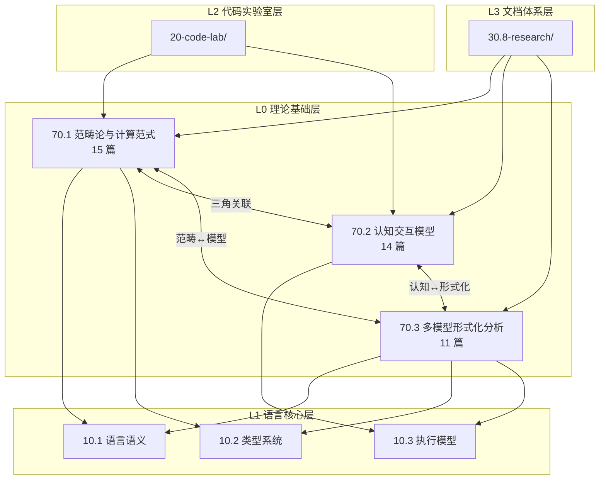
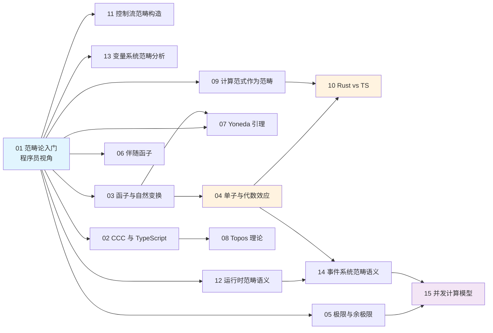
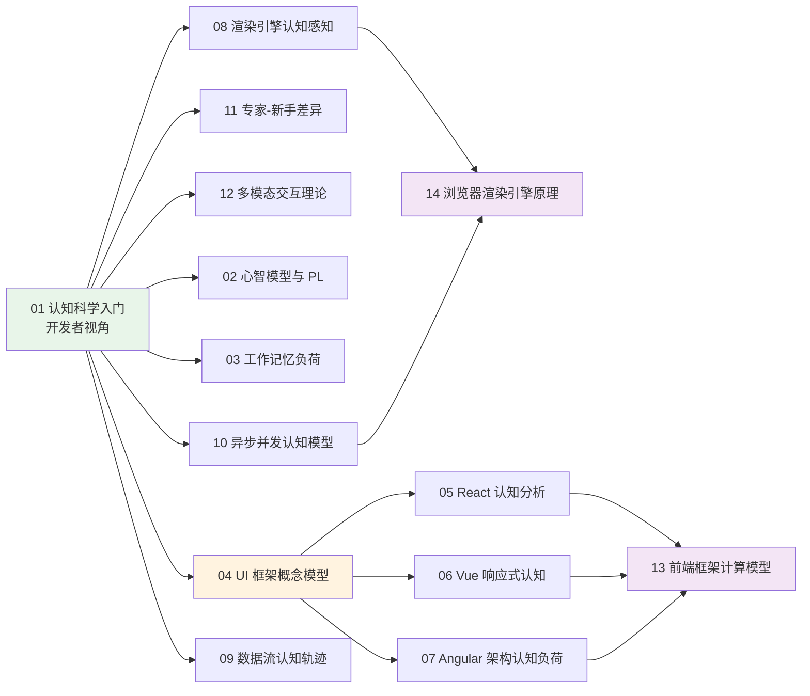
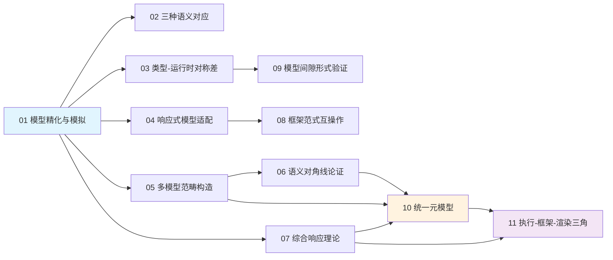
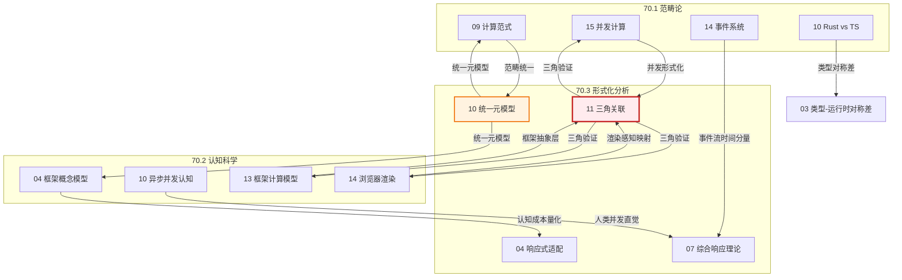
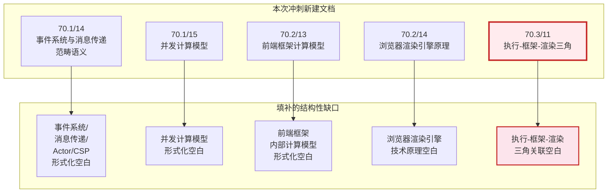

# 70-theoretical-foundations 知识图谱 (Mermaid)

> **用途**: 可视化 40 篇文档之间的理论依赖关系、跨方向引用和阅读路径
> **最后更新**: 2026-04-30

---

## 一、三层架构总览

---

## 二、70.1 范畴论内部依赖图

---

## 三、70.2 认知模型内部依赖图

---

## 四、70.3 多模型分析内部依赖图

---

## 五、跨方向三角关联图（核心创新）

---

## 六、阅读路径图

### 路径 A：从数学到认知（推荐）

### 路径 B：从框架到理论

### 路径 C：形式化方法专项

---

## 七、新增专项文档定位图

---

*本图谱使用 Mermaid 语法，可在支持 Mermaid 的 Markdown 渲染器（如 GitHub、GitLab、VitePress）中直接显示。*
