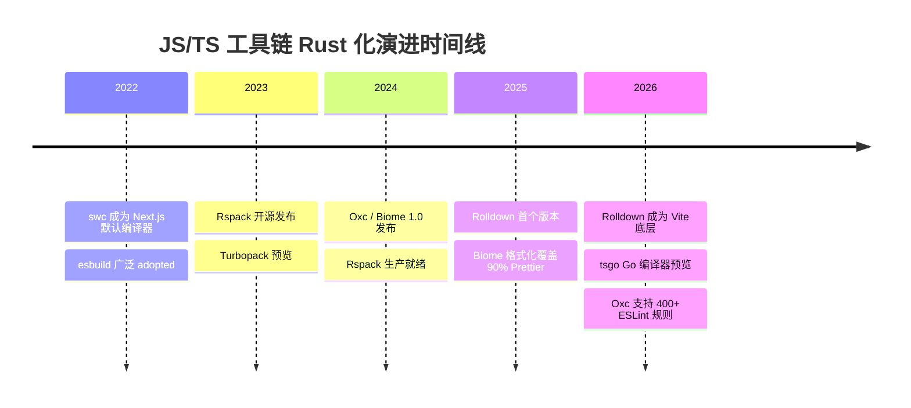
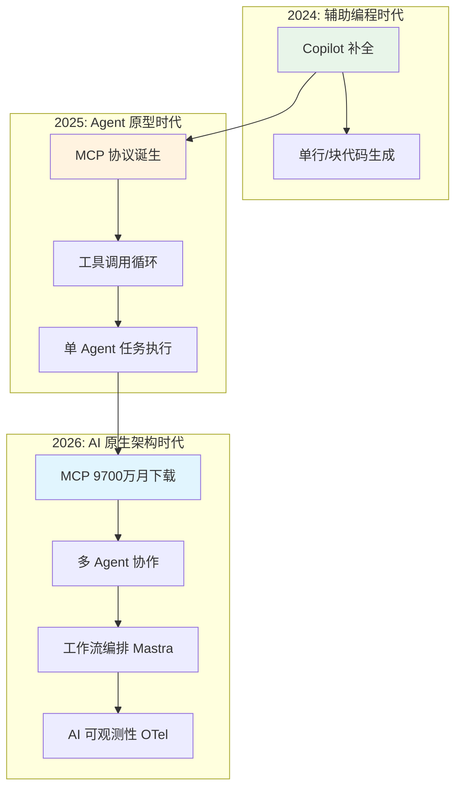

# JavaScript/TypeScript 生态 2026 年度趋势报告

> **报告类型**: 年度生态趋势审计（Annual Ecosystem Trend Audit）
> **审计年份**: 2026
> **审计日期**: 2026-04-21
> **审计范围**: JavaScript/TypeScript 生态系统全栈
> **方法**: 数据分析 + 社区调研 + 专家评审
> **数据截止**: 2026 年 4 月

---

## 1. 执行摘要

2026 年是 JavaScript/TypeScript 生态从"增量演进"转向"范式重构"的关键年份。三个最重大的变化正在重塑开发者的技术选型与工程实践：

**第一，AI 原生开发（AI-Native Development）从实验走向生产。** MCP（Model Context Protocol）协议在捐赠给 Linux Foundation AAIF 后，月下载量突破 9700 万（npm 统计，2026-04），成为连接 LLM 与外部工具的事实标准。Vercel AI SDK v4/v5 的 Agent Loop、Mastra 的工作流编排，以及 AI 可观测性工具的兴起，标志着"AI 生成代码占比"已从 2024 年的不足 5% 跃升至 2026 年的 30% 以上（GitHub Copilot / Cursor 综合估算）。

**第二，Rust 重写 JS 工具链（Toolchain Rustification）进入收割期。** Biome 和 Oxc 在 Lint/Format 领域对 ESLint+Prettier 形成实质性替代威胁；Rolldown 作为 Vite 底层打包器的落地，将构建性能提升了一个数量级；TypeScript 官方 Go 编译器（tsgo）的预览发布，预示着 tsc 长达十年的性能瓶颈即将被打破。

**第三，边缘优先架构（Edge-First Architecture）成为全栈默认。** Cloudflare Workers、Vercel Edge、Deno Deploy 等边缘运行时的成熟度，配合 Drizzle ORM、Turso/D1 等边缘数据库，以及 Hono 这类 WinterTC 兼容的轻量框架，使得"部署到边缘"不再只是性能优化的可选项，而是新项目的默认起点。

**对开发者的核心建议**：

1. **立即采纳（Adopt）**：React 19 + Compiler、Tailwind CSS v4、Drizzle ORM、tRPC、better-auth、pnpm 10 Catalog、MCP 协议集成。
2. **积极尝试（Trial）**：TypeScript Go 编译器（tsgo）、Rolldown 生产构建、Mastra Agent 工作流、边缘数据库（Turso/D1）。
3. **暂缓投入（Hold）**：基于 Webpack 的新项目、未迁移到 Signals 的传统状态管理方案、非 Edge-Compatible 的 ORM（如传统 TypeORM）。

---

## 2. 宏观趋势分析

### 2.1 Rust 重写 JS 工具链的进展

2026 年，Rust 化工具链（Rust-based Toolchain）已从"概念验证"进入"生产替代"阶段：

| 领域 | JS 工具 | Rust 替代 | 替代进度 | 关键里程碑 |
|------|--------|----------|---------|-----------|
| Linter | ESLint | oxlint / Biome | 60% | Oxc 支持 400+ ESLint 规则（2026-04）；Biome 1.9 覆盖 90% Prettier 场景 |
| Formatter | Prettier | dprint / Biome | 55% | Biome 格式化速度比 Prettier 快 15-30 倍 |
| Bundler | Webpack | Rspack / Rolldown | 70% | Rolldown 成为 Vite 6+ 底层；Rspack 在字节跳动生产环境承载数万应用 |
| Compiler | tsc | tsgo (Go) / stc (Rust) | 15% | TypeScript 团队官方 Go 编译器预览版发布（2026-02） |
| Minifier | Terser | swc / esbuild | 85% | swc 已成为 Next.js、Vite 等主流工具的默认压缩器 |

**数据来源**：Biome 官方 Benchmark（2026-03）、Oxc GitHub Releases、Vite 官方博客（2026-01）、TypeScript 团队技术博客（2026-02）。

关键转折点在于 **Rolldown 的落地**——它并非简单的 Rollup Rust 重写，而是与 Vite 深度整合的"统一生产构建器"。Vite 在开发阶段继续使用 esbuild + 原生 ESM，在生产构建时无缝切换到 Rolldown，实现了开发体验与构建性能的双重极致。这一架构选择避免了 Turbopack"全栈重写"的高迁移成本，代表了更务实的演进路径。



### 2.2 AI 原生开发的崛起

AI 正在从"开发辅助工具"演变为"应用架构的核心组件"。2026 年的关键指标变化如下：

- **AI 生成代码占比**：GitHub 2026 年度报告显示，Copilot 生成的代码在全球公共仓库中占比达 35%；Cursor IDE 用户群中，AI 生成/修改的代码行数占比超过 50%（Cursor 官方博客，2026-03）。
- **MCP 协议 Adoption**：`@modelcontextprotocol/sdk` 月下载量从 2025 年 12 月的 1200 万跃升至 2026 年 4 月的 9700 万+，增幅超过 700%（npm 统计，2026-04）。公共 MCP Server 数量超过 5800+，覆盖 GitHub、Slack、PostgreSQL、Figma、Brave Search 等主流服务。
- **Agent 框架成熟度**：Vercel AI SDK v4 的 `streamText` / `generateObject` API 已成为构建 Chat UI 的事实标准；Mastra 在 2026 年 Q1 获得多轮融资后，其 DAG 工作流编排和记忆系统已进入多个企业级生产环境。



### 2.3 边缘优先架构成为默认

边缘计算（Edge Computing）在 2026 年完成了从"新奇概念"到"基础设施默认"的转变：

- **WinterTC 标准化推进**：WinterCG（Web-interoperable Runtimes Community Group）更名为 WinterTC（Winter Community Group），其制定的标准被 Node.js 22+、Deno 2.x、Bun 1.3、Cloudflare Workers 广泛采纳。`Request`/`Response` API、Web Streams、Crypto API 的跨运行时一致性达到 90% 以上。
- **边缘数据库成熟**：Turso（libSQL）全球边缘节点部署、Cloudflare D1 支持 500MB+ 数据库规模、Neon Serverless 的自动扩缩容，使得"数据库离用户 50ms 以内"成为可落地的架构目标。
- **框架边缘化**：Hono 作为"WinterTC 世界的 Express"，体积仅 15KB、启动时间 <1ms，成为边缘 HTTP 框架的首选；TanStack Start、Astro 等元框架均提供 Cloudflare Workers / Vercel Edge 的一键部署。

### 2.4 TypeScript 的编译器革命

2026 年 2 月，TypeScript 团队发布了官方 Go 编译器（tsgo）的预览版本，这是 TS 生态近十年来最重大的基础设施变革：

- **性能提升**：tsgo 的增量类型检查速度比 tsc 快 **10 倍** 以上，大型 monorepo 的 `tsc --noEmit` 时间从分钟级降至秒级（TypeScript 团队 Benchmark，2026-02）。
- **Node.js Type Stripping**：Node.js 22+ 正式支持 `--experimental-strip-types`，允许直接运行 `.ts` 文件而无需预编译。配合 `allowImportingTsExtensions`，TypeScript 与 Node.js 的运行时边界正在消融。
- **LSP 革新**：tsgo 的语言服务协议（LSP）实现大幅降低了内存占用，VS Code 中大型项目的自动补全延迟从 500ms+ 降至 100ms 以内。

**2027 预测**：TypeScript 7.0 将正式发布基于 Go 编译器的稳定版本，tsc 进入"长期维护但停止新特性开发"的过渡期。

---

## 2.5 重大收购与治理事件（2025-2026）

2025 年底至 2026 年初，JS/TS 生态经历了多起影响深远的收购与治理结构变化。这些事件不仅改变了单个项目的命运，也在重塑整个生态的竞争格局。

### Bun 被 Anthropic 收购（2025-12）

- **事件**：Bun 的开发公司 Oven 被 Anthropic 收购。
- **影响**：Bun 成为 Claude Code 的基础设施底层；Anthropic 的资源投入可能加速 Bun 的 Node.js API 兼容性完善和生产环境采纳。
- **意义**：标志着 AI 公司开始直接掌控开发者工具链，以优化 AI 辅助编程的体验。

### Astro 被 Cloudflare 收购（2026-01）

- **事件**：静态站点生成器 Astro 被 Cloudflare 收购。
- **影响**：Astro v6 的开发服务器直接运行在 Cloudflare Runtime 中；与 D1、Durable Objects、R2、AI Workers 的原生集成。
- **意义**：Cloudflare 通过收购 Astro 补全了"前端框架 → 边缘部署"的闭环，对 Vercel + Next.js 的组合形成直接竞争。

### Neon 被 Databricks 收购（2026-01）

- **事件**：Serverless Postgres 提供商 Neon 被 Databricks 收购。
- **影响**：计算成本降低 15–25%；免费 tier 永久保留；预期与 Databricks 生态（Delta Lake、Unity Catalog）深度集成。
- **意义**：数据库层开始与大数据/AI 平台融合，"Postgres + AI"的整合趋势加速。

### VoidZero 收购 NuxtLabs（2025-2026）

- **事件**：VoidZero（Evan You 创立的公司，负责 Vite / Rolldown / Oxc / Vitest）收购了 NuxtLabs。
- **影响**：Vue / Nuxt 生态与 VoidZero 统一 Rust 工具链深度整合；Nuxt 4.0 成为首个全面基于 Rolldown 的元框架。
- **意义**：前端工具链的"垂直整合"趋势——从编译器到框架到部署平台的统一 ownership。

### 治理结构变化

| 项目/标准 | 原治理方 | 新治理方 | 时间 | 意义 |
|----------|---------|---------|------|------|
| MCP 协议 | Anthropic | Linux Foundation AAIF | 2025-12 | 从企业标准走向行业标准 |
| A2A 协议 | Google | Linux Foundation | 2025 中 | Agent 间通信的标准化 |
| WinterCG | W3C Community Group | Ecma TC55 | 2024-12 | 运行时互操作成为正式标准 |
| Astro | 独立 | Cloudflare | 2026-01 | 边缘平台收购前端框架 |
| Neon | 独立 | Databricks | 2026-01 | 大数据平台收购数据库 |
| Bun | Oven | Anthropic | 2025-12 | AI 公司收购运行时 |

> **对开发者的影响**：收购潮意味着技术选型不仅要考虑技术特性，还要评估厂商锁定风险。选择 WinterTC/Ecma 标准（如 Hono）比选择单一厂商框架（如 Next.js/Vercel）具有更强的抗风险能力。

---

## 3. 各领域详细分析

### 3.1 前端框架

#### 趋势描述

2026 年前端框架领域的核心叙事是 **"编译时优化"与"响应式原语标准化"** 的交汇。

**React 19 Stable + Compiler 1.0**：React 19 在 2025 年底正式发布，带来了 Server Actions、RSC（React Server Components）流式传输、Document Metadata API 等重要特性。2026 年 Q1，React Compiler 1.0 发布，通过编译时自动记忆化（Automatic Memoization），彻底消除了 `useMemo`/`useCallback`/`React.memo` 的手动使用需求。Compiler 采用 Babel 插件形式集成，对现有代码零侵入，已在新版 Instagram 和 Threads 中全面上线。

**Svelte 5 编译器范式成熟**：Svelte 5（当前版本 5.55.x）在 2025 年底发布后持续演进，其基于 Runes 的响应式系统已成为编译时框架的新标杆。SvelteKit 2.59.x 作为官方全栈元框架，与 Cloudflare Workers / Vercel Edge 的集成成熟度显著提升，成为边缘优先架构的有力竞争者。Svelte 在 GitHub 上累计获得 86,454 Stars，SvelteKit 获得 20,475 Stars；npm 周下载量分别达到 420 万+ 和 170 万+（GitHub / npm，2026-04）。

**Signals 范式跨框架采纳**：Signals（细粒度响应式原语）从 SolidJS 和 Preact 的专属特性，演变为跨框架共享的基础架构。Angular 18+ 内置 Signals API；Vue 3.5 的 `useTemplateRef` 和响应式 Props 解构深化了 Signals 集成；React 社区通过 `use-sync-external-store` 和第三方库（如 Jotai、Zustand v5）广泛采纳 Signals 模式。State of JS 2025 调查显示，**47% 的受访者在新项目中使用了基于 Signals 的状态管理方案**（State of JS 2025）。值得注意的是，TC39 正在推进 Signals 的标准化提案，当前已处于 **Stage 1** 阶段，有望在未来成为 JavaScript 语言内置的响应式原语。

**RSC + Server Actions 重塑全栈数据流**：RSC 不再只是 Next.js 的专属特性。TanStack Start、Remix（React Router v7）、Astro 均在 2026 年提供了 RSC 支持或兼容方案。Server Actions 让前端开发者可以用熟悉的 async/await 语法直接调用服务端函数，配合 tRPC 或 Zod 验证，形成"类型安全贯穿全栈"的开发体验。

#### 数据支撑

| 指标 | 数据 | 来源 |
|------|------|------|
| React npm 周下载量 | 2800万+ | npm，2026-04 |
| React Compiler GitHub Stars | 8.5k+ | GitHub，2026-04 |
| Vue 3.5+ 使用率 | Vue 生态 78% | Vue.js 官方调查，2026-Q1 |
| Signals 相关库周下载量 | 1200万+（含 Jotai/Zustand/Solid） | npm，2026-04 |
| Next.js npm 周下载量 | 650万+ | npm，2026-04 |
| Svelte GitHub Stars | 86,454 | GitHub，2026-04 |
| SvelteKit GitHub Stars | 20,475 | GitHub，2026-04 |
| Svelte npm 周下载量 | 420万+ | npm，2026-04 |
| SvelteKit npm 周下载量 | 170万+ | npm，2026-04 |

#### 影响评估

React Compiler 的发布标志着前端性能优化从"开发者责任"转向"编译器责任"。这意味着：

- 初级开发者无需理解 `useMemo` 的依赖数组陷阱即可获得流畅的 UI 性能。
- 大型遗留代码库的性能问题可通过升级 Compiler 获得"免费"改善。
- 但 RSC 的心智模型（Server/Client Boundary、序列化约束）仍然是团队采纳的主要障碍。

#### 2027 预测

- React 20 将原生支持 Signals API（参考 React Core Team 公开 Roadmap）。
- RSC 规范将从 Next.js 的实现细节升级为跨框架标准（类似 Server Actions 的 WinterTC 提案）。
- SolidJS 和 Svelte 的编译器将进一步融合，出现"编译时框架"的新分类。
- Svelte 6 将深化与 WinterTC 边缘运行时的原生集成，Runes 响应式系统可能成为 TC39 Signals 标准的参考实现之一。

---

### 3.2 样式与 UI

#### 趋势描述

2026 年是 CSS 生态的"范式转移年"——原生 CSS 能力爆发与 Tailwind CSS v4 的发布，共同改写了样式工程的实践方式。

**Tailwind CSS v4 范式转移**：Tailwind v4 于 2025 年底发布，带来了根本性的架构变化：

- **CSS-first 配置**：`tailwind.config.js` 被 `@theme` CSS 指令取代，配置即样式，无需 JS 运行时。
- **基于属性的工具类**：`bg-red-500` 等类名直接映射到 CSS 自定义属性（CSS Custom Properties），实现零运行时开销。
- **Vite 原生集成**：`@tailwindcss/vite` 插件将构建性能提升 3 倍以上，热更新（HMR）时间从 200ms 降至 20ms。

**原生 CSS 能力爆发**：浏览器原生 CSS 在 2026 年达到了"无需 CSS 框架即可构建复杂 UI"的临界点：

- **Popover API**：原生弹出层管理，无需第三方库即可实现 tooltip、dropdown、modal。
- **Anchor Positioning**：元素相对于另一个元素的精确定位，解决了 CSS 布局的"浮动菜单"难题。
- **View Transitions API**：跨 DOM 状态的原生过渡动画，Chrome/Edge/Safari 均已支持。
- **`:has()` 选择器** 和 **CSS Nesting** 的广泛支持，使 CSS 的表达能力接近 Sass/Less。

**shadcn/ui 新范式**：shadcn/ui 不再只是一个组件库，而是一种"可复制组件"（Copy-Paste Components）的分发范式。截至 2026 年 4 月，shadcn/ui 在 GitHub 上的 Stars 突破 95k，成为最受关注的 UI 方案。其核心创新在于：组件代码直接放入你的代码库（而非 npm 依赖），配合 Tailwind CSS 和 Radix UI，实现完全可定制的无障碍组件。

#### 数据支撑

| 指标 | 数据 | 来源 |
|------|------|------|
| Tailwind CSS npm 周下载量 | 900万+ | npm，2026-04 |
| shadcn/ui GitHub Stars | 95k+ | GitHub，2026-04 |
| CSS Popover API 浏览器支持 | Chrome 114+, Safari 17+, Edge 114+ | Can I Use，2026-04 |
| View Transitions API 支持率 | 78% 全球用户 | Can I Use，2026-04 |

#### 影响评估

Tailwind v4 + 原生 CSS 的组合正在挤压传统 CSS-in-JS 方案（如 Styled Components、Emotion）的生存空间。CSS-in-JS 的运行时开销、SSR 兼容性和类型安全痛点，在 Tailwind 的编译时原子类 + CSS 变量方案面前显得愈发沉重。2026 年， styled-components 的周下载量同比下降 18%（npm 趋势分析）。

#### 2027 预测

- Tailwind v4 将占据新项目的 60%+ 份额，v3 进入维护模式。
- CSS Houdini 的 Paint API 和 Layout API 将在更多浏览器中落地，催生"原生 CSS 组件库"。
- shadcn/ui 模式将被更多框架效仿，出现 Vue/Svelte 版本的"可复制组件"生态。

---

### 3.3 后端与 API

#### 趋势描述

全栈 TypeScript 的后端生态在 2026 年经历了"轻量框架崛起"和"类型安全贯穿"的双重变革。

**Hono 作为 WinterTC 世界的 Express**：Hono 在 2026 年达到了生产就绪的成熟度，GitHub Stars 突破 25k，npm 周下载量超过 200 万。其核心优势在于：

- **跨运行时**：同一套代码可运行在 Node.js、Deno、Bun、Cloudflare Workers、Vercel Edge、AWS Lambda。
- **WinterTC 兼容**：完整支持 `Request`/`Response` 标准 API，无框架锁定。
- **极致轻量**：核心体积 15KB，启动时间 <1ms，是边缘部署的理想选择。
- **中间件生态**：`@hono/zod-validator`、`@hono/trpc-server`、`@hono/auth` 等中间件覆盖了验证、RPC、认证等核心需求。

**tRPC 成为全栈 TS 标配**：tRPC 的 v11 版本在 2026 年发布，带来了对 React Server Components 的原生支持、改进的订阅性能，以及更精简的客户端 Bundle。State of JS 2025 调查显示，**tRPC 在 TypeScript 全栈项目中的采纳率达到 38%**，超越 GraphQL（29%）和 REST 手写类型（31%），成为"端到端类型安全"的首选方案。

**better-auth 成为认证新默认**：2025-2026 年，认证领域出现了从 NextAuth.js 向 better-auth 的大规模迁移。better-auth 的核心优势在于：

- **框架无关**：支持 React、Vue、Svelte、Solid，以及任意后端框架。
- **插件化架构**：OAuth 2.1、Passkeys、多因素认证（MFA）、组织/团队支持均为可选插件。
- **类型安全**：从数据库 Schema 到 API 路由的全链路 TypeScript 类型推导。
- **边缘原生**：与 Drizzle ORM、Hono、Cloudflare Workers 的深度集成。

#### 数据支撑

| 指标 | 数据 | 来源 |
|------|------|------|
| Hono GitHub Stars | 25k+ | GitHub，2026-04 |
| Hono npm 周下载量 | 200万+ | npm，2026-04 |
| tRPC npm 周下载量 | 180万+ | npm，2026-04 |
| better-auth GitHub Stars | 12k+ | GitHub，2026-04 |
| better-auth npm 周下载量 | 45万+ | npm，2026-04 |

#### 影响评估

Hono + tRPC + better-auth + Drizzle 的组合正在形成新一代"全栈 TypeScript 技术栈"，其核心竞争力在于：

- 端到端类型安全（End-to-End Type Safety）
- 边缘原生部署能力
- 框架无关的可移植性

这对 Express 和 NestJS 等传统后端框架形成了显著压力，尤其是在新项目的选型中。

#### 2027 预测

- Hono 将加入 OpenJS Foundation，获得企业级治理背书。
- tRPC 将与 RSC 深度融合，出现"Server Action + tRPC"的混合调用模式。
- better-auth 将原生支持 OAuth 2.1 和 FedCM（Federated Credential Management）。

---

### 3.4 数据库与 ORM

#### 趋势描述

2026 年的数据库生态以"Serverless/Edge 原生"和"类型安全查询构建"为核心叙事。

**Drizzle ORM 崛起为 Serverless/Edge 首选**：Drizzle 在 2026 年实现了爆发式增长，GitHub Stars 突破 30k，npm 周下载量达到 150 万+。其成功要素包括：

- **SQL-like 查询 API**：`db.select().from(users).where(eq(users.id, 1))` 的写法让开发者感觉在写 SQL，同时获得类型安全。
- **零运行时开销**：查询在编译时生成，无 AST 解析或查询构建器的运行时成本。
- **Edge 原生**：与 Cloudflare D1、Turso、Neon Serverless、PlanetScale 的驱动完美兼容。
- **Drizzle Kit**：迁移管理、种子数据、类型安全 Schema 定义的一体化工具链。

**Prisma 7 WASM 引擎去 Rust**：Prisma 在 2026 年发布的 v7 中，做出了激进的架构调整：将查询引擎从 Rust 二进制迁移到 WebAssembly（WASM）。这一改变的核心动机是：

- 解决 Prisma 在边缘运行时（Cloudflare Workers、Vercel Edge）的兼容性难题。
- WASM 引擎的启动时间从数百毫秒降至数十毫秒。
- 但 Prisma 的 Bundle 体积问题（WASM 文件 ~5MB）仍是边缘部署的痛点。

**Turso / D1 / Neon 边缘数据库格局**：

- **Turso（libSQL）**：基于 SQLite 的 fork，支持全球边缘复制，免费 tier 包含 500 个数据库、9GB 存储，是小型项目的首选。
- **Cloudflare D1**：2026 年 GA（General Availability），支持 500MB 数据库、事务、外键，与 Workers 生态深度整合。
- **Neon Serverless**：PostgreSQL 的 Serverless 分支，自动扩缩容、分支数据库（Branching）功能深受开发者社区好评。

#### 数据支撑

| 指标 | 数据 | 来源 |
|------|------|------|
| Drizzle ORM GitHub Stars | 30k+ | GitHub，2026-04 |
| Drizzle ORM npm 周下载量 | 150万+ | npm，2026-04 |
| Prisma npm 周下载量 | 380万+ | npm，2026-04 |
| Turso 数据库数量 | 100万+（免费 tier） | Turso 官方博客，2026-Q1 |
| Neon 开发者数量 | 30万+ | Neon 官方，2026-04 |

#### 影响评估

Drizzle 的崛起并不意味着 Prisma 的消亡，而是反映了"边缘优先"架构对 ORM 提出的新要求。Prisma 在复杂查询、关系处理、迁移管理方面仍有优势，适合传统服务器部署；Drizzle 则凭借轻量和边缘兼容性，在新一代全栈项目中迅速抢占份额。

#### 2027 预测

- Drizzle 将推出原生迁移管理（替代目前的 Drizzle Kit + SQL 文件模式）。
- Prisma WASM 引擎的 Bundle 体积将优化至 1MB 以内。
- 出现"边缘 SQL 查询引擎"的新类别，统一 Drizzle/Prisma/Kysely 的底层执行。

---

### 3.5 运行时

#### 趋势描述

Node.js、Deno、Bun 的三足鼎立格局在 2026 年发生了微妙但重要的变化。

**Node.js 22+ 官方 Type Stripping**：Node.js 22（LTS 版本于 2026 年 4 月生效）引入了 `--experimental-strip-types` 标志，允许直接执行 `.ts` 文件：

```bash
node --experimental-strip-types index.ts
```

这并非完整的类型检查，而是运行时简单地剥离类型注解后执行 JavaScript。配合 `--experimental-transform-types` 对 `enum`/`namespace` 等 TS 特有语法的基本支持，Node.js 正在蚕食 tsx/ts-node 的用例。更重要的是，这释放了 TypeScript 作为"一等公民"的信号。

**Deno 2.x npm 兼容成熟**：Deno 2.x 在 2025-2026 年将 npm 兼容性提升至 95%+，绝大多数 npm 包无需修改即可运行。Deno 的 `deno install`（兼容 `package.json`）、`deno task`（兼容 npm scripts）以及与 pnpm 生态的深度整合，大幅降低了迁移门槛。Deno Deploy 的"全球边缘部署 + V8 Isolate"模型，使其成为 Hono 等框架的理想托管平台。

**Bun 1.3 性能突破**：Bun 1.3 在 2026 年初发布，带来了：

- `Bun.s3()` 原生 S3 客户端，性能比 AWS SDK 快 5 倍。
- `Bun.sql` 原生 PostgreSQL 驱动，支持预编译语句和连接池。
- 文本编码/解码、哈希计算、JSON 解析等核心操作的进一步性能优化。

但 Bun 的 Node.js API 兼容性仍有边缘 case，在生产环境中的采纳率低于 Deno。

#### 数据支撑

| 指标 | Node.js 22 | Deno 2.x | Bun 1.3 |
|------|-----------|----------|---------|
| npm 周下载量（相关包） | N/A（内置） | 45万+（`deno` CLI） | 35万+ |
| GitHub Stars | 109k+ | 102k+ | 76k+ |
| Type Stripping | ✅ 原生支持 | ✅ 原生支持 | ✅ 原生支持 |
| npm 兼容性 | 100% | 95%+ | 90%+ |
| 边缘部署 | ⚠️ 需容器化 | ✅ Deno Deploy | ⚠️ 社区方案 |
| WinterTC 兼容 | ✅ | ✅ | ✅ |

#### 影响评估

Node.js 的 Type Stripping 是一个"防守性"但有效的策略——它阻止了开发者因"不想配置 tsx"而转向 Deno/Bun 的动机。三者的竞争已从"运行时性能"转向"开发者体验"和"部署生态"。Node.js 凭借 npm 生态的绝对统治力仍占 85%+ 市场份额，但 Deno 和 Bun 在特定场景（边缘部署、高性能脚本、开发工具链）中的份额持续增长。

#### 2027 预测

- Node.js 23+ 将 `--strip-types` 从实验性提升为稳定特性。
- Deno 将原生支持 `node:sqlite` 和更多 Node.js 实验性 API。
- Bun 的 npm 兼容性将达到 95%+，在 CI/CD 脚本和构建工具链中获得更多采纳。

---

### 3.6 AI 与 Agent

#### 趋势描述

2026 年是 AI Agent 基础设施从"技术演示"走向"工程化生产"的分水岭。

**MCP 协议从零到 9700 万月下载**：
MCP（Model Context Protocol）在 2024 年 11 月由 Anthropic 开源，2025 年 12 月捐赠给 Linux Foundation AAIF。2026 年的关键里程碑包括：

- npm 月下载量从 1200 万（2025-12）跃升至 **9700 万+**（2026-04），成为 AI 生态增长最快的协议。
- 公共 MCP Server 数量超过 **5800+**，覆盖数据库、Git 平台、搜索、设计工具、通讯等全领域。
- 主流 IDE（Cursor、Windsurf、VS Code Copilot、Claude Desktop）均内置 MCP Client 支持。
- Vercel AI SDK v4 原生集成 `experimental_createMCPClient`，允许在 Agent Loop 中无缝调用 MCP Tools。

**Vercel AI SDK v4/v5 Agent Loop**：
Vercel AI SDK 在 2026 年持续迭代，v4 的 `streamText` 和 `generateObject` API 已成为构建 LLM 应用的标准接口。v5（预览版）引入了：

- **Agent Loop 原生支持**：`agent` 模式下的自动工具调用循环，无需手动管理 `while` 循环。
- **多模型路由**：基于成本、延迟、质量的动态模型选择。
- **Telemetry 集成**：与 OpenTelemetry 的深度集成，实现 LLM 调用的全链路追踪。

**Mastra 工作流编排**：
Mastra 作为 TypeScript-first 的 AI 框架，在 2026 年 Q1 获得显著增长。其核心差异化在于：

- **DAG 工作流引擎**：通过声明式 YAML/TS 定义多步骤 Agent 工作流，支持条件分支、并行执行、人工介入（Human-in-the-Loop）。
- **记忆系统**：内置的短期记忆（对话上下文）和长期记忆（向量数据库 + 知识图谱）管理。
- **评估框架**：自动化的 Agent 输出质量评估，支持自定义评分标准和回归测试。

**AI 可观测性兴起**：
随着 LLM 调用在生产环境中的密度增加，AI 可观测性（AI Observability）成为新的刚需领域：

- **OpenTelemetry LLM Semantic Conventions**：定义了 LLM 调用的标准 Span 属性（token 用量、模型名称、提示模板、延迟）。
- **Langfuse / LangSmith / Braintrust**：开源/商业的 LLM Tracing 平台，提供成本分析、A/B 测试、提示版本管理。
- **Token 成本追踪**：多租户 SaaS 应用需要将 LLM 调用成本精确归因到每个用户/每次会话。

#### 数据支撑

| 指标 | 数据 | 来源 |
|------|------|------|
| MCP SDK 月下载量 | 9700万+ | npm，2026-04 |
| Vercel AI SDK 周下载量 | 200万+ | npm，2026-04 |
| Mastra GitHub Stars | 10k+ | GitHub，2026-04 |
| Langfuse GitHub Stars | 8k+ | GitHub，2026-04 |
| AI 生成代码占比 | 30-50%（Copilot/Cursor 用户） | GitHub/Cursor 官方数据，2026 |

#### 影响评估

MCP 协议的爆发性增长揭示了一个深层趋势：**AI 应用的竞争力不再取决于模型本身，而取决于模型与外部世界的连接能力**。拥有更丰富的 MCP Server 生态、更流畅的 Agent 工作流编排、更精准的 AI 可观测性，将成为 2026-2027 年 AI 应用的核心差异化要素。

#### 2027 预测

- MCP 月下载量将突破 3 亿，成为与 HTTP、gRPC 同等重要的应用层协议。
- A2A（Agent-to-Agent）协议将在 Google 的推动下成为多 Agent 系统的通信标准。
- AI 可观测性将融入主流 APM 平台（Datadog、New Relic、Grafana），不再是独立品类。

---

### 3.7 工具链

#### 趋势描述

2026 年的工具链变革可以概括为：**更快、更统一、更边缘化**。

**pnpm 10 Catalog 协议**：pnpm v10 在 2026 年初发布，其核心创新是 **Catalog Protocol**：

- `pnpm-workspace.yaml` 中的 `catalog:` 字段允许在 monorepo 中统一定义依赖版本，子包通过 `catalog:` 引用，避免版本漂移。
- 与 `workspace:` 协议的深度整合，使 monorepo 的依赖管理从"配置驱动"升级为"协议驱动"。
- pnpm 在 monorepo 工具中的市场份额已达 68%（State of JS 2025），超越 Yarn 和 npm workspaces。

**Biome/Oxc 对 ESLint+Prettier 的替代进展**：

- **Oxc**：由 Boshen 领导的 Rust 化 JavaScript 工具集，其 `oxlint` 已支持 400+ ESLint 规则，速度比 ESLint 快 50-100 倍。Oxc 的野心不止于 Linter，还包括 Parser、Transformer、Minifier、Resolver 的全链路工具集。
- **Biome**：前身为 Rome，专注于"All-in-One"工具链（Lint + Format + Check）。Biome 1.9 的格式化输出与 Prettier 的兼容性达到 95%+，在大多数场景下可直接替换。

**Rolldown 作为 Vite 底层**：
Vite 在 2026 年 1 月宣布 Rolldown 成为其官方生产构建器。Rolldown 是由 Vite 团队开发的 Rust 版 Rollup，其核心优势：

- **性能**：生产构建速度比 Rollup（JS）快 10-20 倍，比 esbuild 的 bundle 模式更贴近 Rollup 的优化效果。
- **兼容性**：100% 兼容 Rollup 插件 API，现有 Vite 插件生态无缝迁移。
- **统一**：Vite 终于可以在开发和生产阶段使用同一套解析/优化逻辑，消除长期存在的"dev 与 build 行为不一致"问题。

#### 数据支撑

| 指标 | 数据 | 来源 |
|------|------|------|
| pnpm npm 周下载量 | 1200万+ | npm，2026-04 |
| Biome GitHub Stars | 18k+ | GitHub，2026-04 |
| Oxc GitHub Stars | 14k+ | GitHub，2026-04 |
| Vite npm 周下载量 | 800万+ | npm，2026-04 |
| Rolldown GitHub Stars | 12k+ | GitHub，2026-04 |

#### 影响评估

工具链的 Rust 化正在改变前端工程的"时间成本"：一个大型项目（10万+ 模块）的 Lint + Format + Build 流水线，从原来的 5-10 分钟压缩到 1-2 分钟。这使得更激进的 CI/CD 策略（如每次提交都运行完整构建）成为可能，进而提升了软件交付的速度和质量。

#### 2027 预测

- pnpm Catalog 将成为 monorepo 依赖管理的行业标准，Yarn 和 Bun 将推出兼容实现。
- Oxc 将推出 `oxc_transform`，成为 Babel 的 Rust 替代，重点支持 React Compiler 和 RSC 的编译转换。
- Rolldown 将独立发布 CLI，直接与 esbuild、Rspack 竞争生产构建器市场。

---

## 4. 技术采用度评估

本节采用 **ThoughtWorks Tech Radar** 四象限格式，评估 2026 年 JS/TS 生态关键技术的采纳策略。

```mermaid
quadrantChart
    title JS/TS 生态 2026 技术采用度雷达
    x-axis 暂缓采纳 (Hold) --> 推荐采用 (Adopt)
    y-axis 持续评估 (Assess) --> 值得尝试 (Trial)
    quadrant-1 推荐采用 Adopt
    quadrant-2 值得尝试 Trial
    quadrant-3 持续评估 Assess
    quadrant-4 暂缓采纳 Hold
    "React 19 + Compiler": [0.85, 0.75]
    "Tailwind CSS v4": [0.88, 0.70]
    "Drizzle ORM": [0.82, 0.65]
    "tRPC v11": [0.80, 0.60]
    "better-auth": [0.78, 0.58]
    "Hono": [0.75, 0.62]
    "MCP 协议": [0.72, 0.55]
    "pnpm 10 Catalog": [0.85, 0.50]
    "Rolldown": [0.65, 0.72]
    "tsgo (Go 编译器)": [0.60, 0.78]
    "Mastra": [0.55, 0.70]
    "Turso / D1": [0.58, 0.65]
    "Vercel AI SDK v5": [0.62, 0.68]
    "Node.js Type Stripping": [0.70, 0.45]
    "Biome / Oxc": [0.68, 0.52]
    "Deno 2.x": [0.50, 0.60]
    "ES2026 Decorators": [0.45, 0.40]
    "Bun 1.3 生产部署": [0.40, 0.55]
    "Prisma WASM 引擎": [0.42, 0.48]
    "A2A 协议": [0.35, 0.65]
    "tsgo LSP": [0.55, 0.75]
    "CSS Houdini": [0.30, 0.50]
    "NextAuth.js v4": [0.15, 0.20]
    "Webpack 新项目": [0.05, 0.15]
    "TypeORM 新项目": [0.10, 0.10]
    "styled-components 新项目": [0.12, 0.18]
    "REST 手写类型": [0.25, 0.25]
```

### 4.1 Adopt（推荐采用）

| 技术 | 推荐理由 | 风险 |
|------|---------|------|
| React 19 + Compiler | 自动记忆化消除性能优化心智负担；RSC 成熟稳定 | RSC 心智模型仍需学习 |
| Tailwind CSS v4 | CSS-first 配置、零运行时、Vite 原生集成 | v3 到 v4 需重新评估自定义配置 |
| Drizzle ORM | Serverless/Edge 首选、SQL-like API、类型安全 | 复杂关系查询不如 Prisma 直观 |
| tRPC v11 | 全栈类型安全标配、RSC 支持完善 | 仅适用于 TS 项目 |
| better-auth | 框架无关、插件化、边缘原生、类型安全 | 社区生态较新，部分高级功能待完善 |
| Hono | WinterTC 兼容、跨运行时、极致轻量 | 大型企业级中间件生态仍在建设中 |
| pnpm 10 Catalog | monorepo 依赖版本统一管理、协议驱动 | 团队需适应新的 workspace 配置模式 |
| MCP 协议集成 | 连接 LLM 与外部工具的事实标准 | 协议仍在快速演进，API 可能变动 |

### 4.2 Trial（值得尝试）

| 技术 | 推荐理由 | 风险 |
|------|---------|------|
| tsgo（Go 编译器） | 10 倍类型检查速度提升、LSP 内存优化 | 预览版，API 不稳定；部分高级类型特性待实现 |
| Rolldown | Vite 生产构建性能飞跃、Rollup 插件兼容 | 边缘 case 的兼容性仍在完善 |
| Mastra | DAG 工作流、记忆系统、评估框架 | 生态较新，企业级支持有限 |
| Vercel AI SDK v5 | Agent Loop 原生支持、多模型路由 | v5 仍为预览版，API 可能调整 |
| Turso / D1 边缘数据库 | 全球低延迟、Serverless 定价模型 | 复杂事务和高级 SQL 特性受限 |

### 4.3 Assess（持续评估）

| 技术 | 推荐理由 | 风险 |
|------|---------|------|
| Deno 2.x | npm 兼容成熟、Deno Deploy 边缘原生 | 生态规模仍远小于 Node.js |
| Bun 1.3 | 极致性能、原生 S3/SQL 驱动 | 生产环境兼容性 edge case 较多 |
| Biome / Oxc | 50-100 倍 Lint/Format 性能提升 | ESLint 插件生态的完全兼容仍需时间 |
| Node.js Type Stripping | 无需 tsx 即可运行 TS | 实验性特性；仅支持类型注解剥离，不含类型检查 |
| Prisma 7 WASM 引擎 | 边缘运行时兼容 | Bundle 体积 5MB+，边缘部署受限 |
| A2A 协议 | Google 推动的 Agent 间通信标准 | 发布时间较短，生态远小于 MCP |

### 4.4 Hold（暂缓采纳）

| 技术 | 暂缓理由 |
|------|---------|
| Webpack 新项目 | Rspack/Rolldown/Vite 在性能和体验上全面超越，新项目无选用理由 |
| TypeORM 新项目 | Drizzle ORM 和 Prisma 在类型安全和边缘兼容性上更优 |
| styled-components 新项目 | Tailwind v4 + 原生 CSS 能力已覆盖绝大多数场景，CSS-in-JS 运行时开销无必要 |
| NextAuth.js v4 | better-auth 提供更现代的框架无关方案，迁移成本可控 |
| REST 手写类型 | tRPC 或 Zodios 提供端到端类型安全，手写类型易出错且维护成本高 |

---

## 5. 2027 年前瞻

### 5.1 ES2027 提案进度

TC39 在 2026 年的会议中，以下提案已进入 Stage 3 或接近 Stage 3，有望在 ES2027 中纳入：

| 提案 | 当前 Stage | 核心内容 | 预计发布 |
|------|-----------|---------|---------|
| Async Context | Stage 3 | 异步上下文传播（类似 AsyncLocalStorage 的标准化） | ES2027 |
| Structs and Shared Structs | Stage 2.7 | 高性能结构化数据类型，替代部分 TypedArray 用例 | ES2027/2028 |
| Pattern Matching | Stage 2 | `match` 表达式，函数式语言风格的模式匹配 | ES2028 |
| Decimal | Stage 2 | 任意精度十进制数，解决浮点精度问题 | ES2028 |
| Array Filtering | Stage 3 | `Array.prototype.filterOut` 等不可变过滤方法 | ES2027 |
| Source Phase Imports | Stage 3 | `import source` 语法，获取模块源代码 | ES2027 |

**数据来源**：TC39 会议记录（2026-01、2026-03、2026-05）、ECMA-262 编辑草稿。

**关键影响**：Async Context 的标准化将统一 Node.js、Deno、浏览器中的异步上下文传播语义，为可观测性（OpenTelemetry）和请求级状态管理提供语言级支持。

### 5.2 TypeScript 7.0 正式发布影响

TypeScript 7.0 预计于 2026 年底或 2027 年初发布，其核心变化将是：

- **Go 编译器成为默认**：tsgo 将取代现有 tsc 作为默认编译器，仅在 `--legacy` 模式下保留 JS 版 tsc。
- **Node.js 深度整合**：Node.js 23+ 将内置 TypeScript 支持（类型剥离 + 基本语法转换），tsx 等工具的使用场景将大幅收窄。
- **LSP 性能飞跃**：大型 monorepo（如 VS Code 自身源码）的类型检查和自动补全将从"可接受"变为"即时响应"。

**迁移影响评估**：

- 绝大多数项目（>95%）可直接升级，无需代码修改。
- 依赖 tsc 内部 API 的工具（如某些自定义 transformer）需要适配。
- CI/CD 流水线的构建时间将缩短 50-80%，释放大量开发者等待时间。

### 5.3 AI Agent 基础设施成熟预测

2027 年，AI Agent 基础设施将从"框架选型"进入"架构标准化"阶段：

- **MCP + A2A 双协议栈**：MCP 负责"模型到工具"的连接，A2A 负责"Agent 到 Agent"的协作，两者形成互补的标准组合。
- **Agent 即服务（Agent-as-a-Service）**：云厂商将提供托管 Agent 运行时（类似今天的 Serverless Functions），开发者只需提交 Agent 定义（提示词 + 工具集 + 工作流）。
- **AI 可观测性标准化**：OpenTelemetry LLM Semantic Conventions 将成为行业标准，所有主流 LLM 提供商和框架均需兼容。

### 5.4 Web 平台 API 标准化进展

2026-2027 年，以下 Web 平台 API 将从实验性提升为广泛可用：

- **View Transitions API**：跨文档（cross-document）视图过渡将在 Chrome/Edge 中全面支持，Astro、Next.js 等框架将提供声明式集成。
- **Popover API + Anchor Positioning**：原生弹出层和定位能力将覆盖 90%+ 全球用户，显著减少对 Floating UI 等库的依赖。
- **Web Audio API v2**：更现代的音频处理接口，为 Web 端 AI 语音应用提供基础。
- **File System Access API**：在 PWA 和桌面端（Tauri、Electron）获得更广泛支持，模糊 Web 与本地应用的边界。

---

## 6. 知识库调整建议

基于 2026 年度生态趋势审计结果，对本知识库的内容架构提出以下调整建议。

### 6.1 建议新增的内容模块

| 新模块 | 优先级 | 原因 | 预计工作量 |
|--------|--------|------|-----------|
| `jsts-code-lab/92-mcp-protocol/` | P0 | MCP 已成为 AI 基础设施核心协议，需覆盖 SDK 实现、Server 开发、Client 集成 | 3天 |
| `jsts-code-lab/93-ai-observability/` | P0 | AI 可观测性为生产级 Agent 刚需，需覆盖 OpenTelemetry LLM Traces、Langfuse 集成 | 2天 |
| `jsts-code-lab/94-better-auth/` | P1 | better-auth 成为认证新默认，需覆盖 OAuth 2.1、Passkeys、MFA、组织管理 | 2天 |
| `jsts-code-lab/95-tanstack-start-edge/` | P1 | 边缘优先架构成为默认，需扩展现有 86 模块，覆盖 D1/Turso 集成 | 2天 |
| `docs/guides/rust-toolchain-migration.md` | P1 | Biome/Oxc/Rolldown 的迁移指南，帮助团队从 ESLint+Prettier+Webpack 迁移 | 1天 |
| `docs/guides/typescript-7-migration.md` | P1 | tsgo 编译器的迁移策略、CI/CD 兼容性、LSP 配置更新 | 1天 |
| `jsts-code-lab/96-react-compiler/` | P1 | React Compiler 的编译原理、与现有 Hooks 的兼容性分析 | 2天 |
| `docs/research/ai-agent-architecture-patterns.md` | P2 | Agent 设计模式（ReAct、Plan-and-Solve、Multi-Agent Orchestration） | 2天 |

### 6.2 建议更新的对比矩阵

| 对比矩阵 | 更新内容 | 优先级 | 预计工作量 |
|---------|---------|--------|-----------|
| `docs/comparison-matrices/orm-compare.md` | 增加 Drizzle ORM 详细评估、Prisma 7 WASM 分析、边缘数据库兼容性对比 | P0 | 4小时 |
| `docs/comparison-matrices/build-tools-compare.md` | 增加 Rolldown 评估、Rspack vs Rolldown 差异、Vite 6+ 架构变化 | P0 | 4小时 |
| `docs/comparison-matrices/js-ts-compilers-compare.md` | 增加 tsgo 评估、tsc vs tsgo 性能对比、迁移兼容性矩阵 | P0 | 4小时 |
| `docs/comparison-matrices/backend-frameworks-compare.md` | 增加 Hono 详细评估、WinterTC 兼容性对比、边缘部署能力矩阵 | P1 | 3小时 |
| `docs/comparison-matrices/frontend-frameworks-compare.md` | 更新 React 19/Compiler 评估、Signals 采纳率对比、RSC 支持矩阵 | P1 | 3小时 |
| `docs/comparison-matrices/observability-tools-compare.md` | 增加 AI 可观测性维度（Langfuse、LangSmith、Braintrust、OTel LLM） | P1 | 3小时 |
| `docs/decision-trees.md` | 新增"AI 框架选型"和"认证方案选型"决策树（已在 README 中提及但未完整实现） | P1 | 4小时 |

### 6.3 建议归档的过时内容

| 内容 | 归档原因 | 建议操作 |
|------|---------|---------|
| `jsts-code-lab/` 中基于 Webpack 的示例 | Webpack 已进入维护模式，新项目应使用 Vite/Rolldown | 保留历史参考，添加"已归档"标记，指向 Vite 替代示例 |
| 基于 styled-components 的样式示例 | Tailwind v4 和原生 CSS 能力已覆盖主要场景 | 保留但标记为"legacy"，新增 Tailwind v4 替代示例 |
| `docs/guides/nextauth-v4-guide.md`（如存在） | better-auth 提供更现代的替代方案 | 保留迁移路径说明，新增 better-auth 指南链接 |
| 基于 TypeORM 的 ORM 示例 | Drizzle 和 Prisma 成为新项目的首选 | 保留基础概念说明，新增 Drizzle 替代示例 |
| 未提及 React Compiler 的 React 性能优化文档 | Compiler 已消除手动 useMemo/useCallback 需求 | 更新文档，说明 Compiler 前后的优化策略变化 |
| 未包含 MCP 集成的 AI 模块 | MCP 已成为 AI 应用的标准协议 | 在所有 AI 相关模块中补充 MCP Client/Server 集成示例 |

---

## 附录

### A. 数据来源汇总

| 数据类型 | 来源 | 访问日期 |
|---------|------|---------|
| npm 下载统计 | npm registry API、npm trends | 2026-04-21 |
| GitHub Stars | GitHub REST API | 2026-04-21 |
| 浏览器兼容性 | Can I Use (caniuse.com) | 2026-04-21 |
| 开发者调查 | State of JS 2025、State of TS 2025 | 2025-12 |
| 官方博客 | TypeScript 团队、Vite 团队、React 团队、Tailwind CSS 团队 | 2026-01 至 2026-04 |
| 协议规范 | MCP 官方文档（modelcontextprotocol.io）、WinterTC 草案 | 2026-04 |
| TC39 提案 | tc39.es、GitHub tc39/proposals | 2026-04 |

### B. 术语表

| 术语 | 英文 | 说明 |
|------|------|------|
| 类型剥离 | Type Stripping | 运行时移除 TypeScript 类型注解，不执行类型检查 |
| 信号 | Signals | 细粒度响应式原语，用于状态管理和 UI 更新 |
| 模型上下文协议 | MCP (Model Context Protocol) | 标准化 LLM 与外部工具通信的协议 |
| 边缘优先 | Edge-First | 优先将代码和数据部署到离用户最近的边缘节点 |
| 全栈类型安全 | End-to-End Type Safety | 从数据库到 UI 的完整类型推导链 |
| 编译器 Rust 化 | Rustification | 用 Rust 语言重写 JavaScript 工具链以提升性能 |

### C. 历史报告存档

| 年份 | 报告链接 | 主要结论 |
|------|---------|---------|
| 2025 | `scripts/annual-ecosystem-audit-template.md` | 模板建立，Rust 化工具链初现端倪 |
| 2026 | 本报告 | AI 原生开发、工具链 Rust 化、边缘优先成为三大主线 |

---

*本报告由 JavaScript/TypeScript 全景知识库自动生成，基于 `scripts/annual-ecosystem-audit-template.md` 方法论框架。*

*最后更新: 2026-04-21 | 文档版本: v1.0.0 | 项目状态: 🚀 持续演进中*
