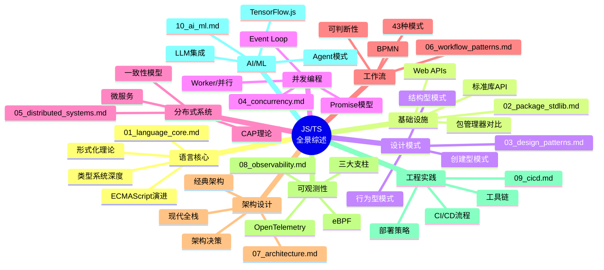
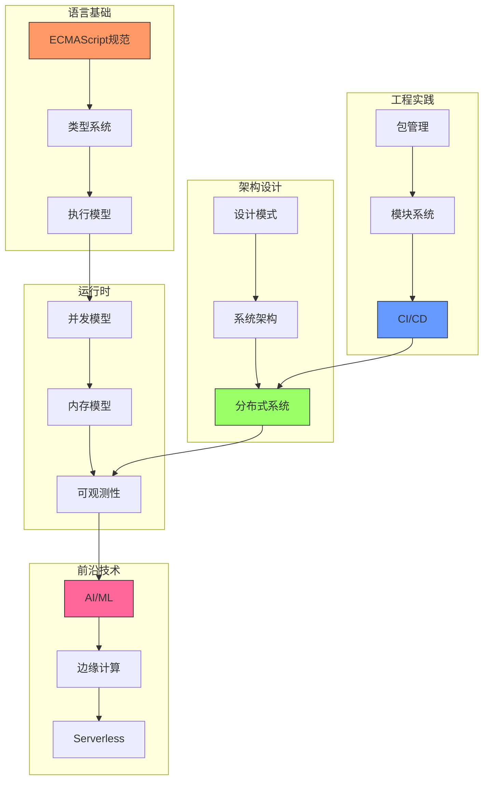

# JavaScript / TypeScript 全景综述 - 索引与总结

> 本文件夹包含对 JavaScript/TypeScript 生态系统的全面技术分析，涵盖语言核心、设计模式、并发模型、分布式系统、架构设计、可观测性、CI/CD 和 AI/ML 等领域。

**最后更新**: 2026-04-02
**分析范围**: ES2024/ES2025/ES2026 + TypeScript 5.8–6.0（含 7.0 前瞻）
**文档总数**: 14个核心技术文档

---

## 📚 文档索引（v3）

本版（v3）聚焦以下 7 篇核心文档，同时保留原有专业文档作为扩展参考。

### 🔥 核心文档

| 文档 | 目标读者 | 核心价值 |
|------|---------|----------|
| `01_language_core.md` | 所有 JS/TS 开发者 | **语言核心特性全览**：从 ECMAScript 新特性到 TypeScript 5.8+ 类型系统，建立统一的基础语义认知 |
| `04_concurrency.md` | 中高级开发者、性能工程师 | **执行模型与并发语义深度解析**：彻底掌握 Event Loop、Promise、Worker、SharedArrayBuffer 及内存模型 |
| `JS_TS_语言语义模型全面分析.md` | 语言爱好者、编译器/工具链开发者 | **语言语义模型全面分析**：形式化语义、类型系统、执行上下文与作用域链的多维剖析 |
| `JS_TS_现代运行时深度分析.md` | 运行时开发者、底层优化工程师 | **现代运行时深度分析**（v3 新增）：V8、Node.js、Deno、Bun 等现代运行时的架构、编译管线与性能机制 |
| `JS_TS_标准化生态与运行时互操作.md` | 标准化参与者、跨平台架构师 | **标准化生态与运行时互操作**（v3 新增）：TC39、W3C、WinterCG 等标准化进程与跨运行时互操作实践 |
| `JS_TS_学术前沿瞭望.md` | 研究人员、技术前瞻者 | **学术前沿瞭望**（v3 新增）：类型理论、程序分析、形式化验证与 JS/TS 相关的最新学术研究动态 |
| `JS_TS_深度技术分析.md` | 技术决策者、CTO、架构师 | **深度技术分析（Executive Summary）**：提炼关键结论、决策建议、风险清单与最佳实践速查 |

### 📖 扩展参考文档

| 文档 | 内容 | 关键概念 |
|-----|------|---------|
| `02_package_stdlib.md` | 包管理与标准库 | npm/yarn/pnpm/Bun, ECMAScript标准库, Web APIs |
| `03_design_patterns.md` | 设计模式 | GoF 23种模式, JS/TS特有模式, SOLID原则 |
| `05_distributed_systems.md` | 分布式系统 | CAP定理, 一致性模型, 微服务架构 |
| `06_workflow_patterns.md` | 工作流设计 | 43种工作流模式, 可判断性分析, BPMN |
| `07_architecture.md` | 架构设计 | 分层/六边形/洋葱/清洁架构, 前端架构演进 |
| `08_observability.md` | 可观测性 | OpenTelemetry, eBPF, 分布式追踪 |
| `09_cicd.md` | CI/CD | GitHub Actions, GitLab CI, 部署策略 |
| `10_ai_ml.md` | AI/ML | TensorFlow.js, LLM集成, RAG架构, MLOps |
| `JS_TS_语义模型可视化图表.md` | 可视化补充材料 | Mermaid架构图、时序图、状态机、流程图 |
| `JavaScript_TypeScript_Complete_Guide.md` | 完整指南汇总 | 所有主题的索引和快速参考 |

---

## 🧠 语言语义模型全景图



---

## 🎯 核心论点与发现

### 1. TypeScript 5.8 关键语义增强

```typescript
// 返回语句条件分支粒度检查
function getUrlObject(urlString: string): URL {
    return untypedCache.has(urlString)
        ? untypedCache.get(urlString)  // 单独检查: any vs URL
        : urlString;                    // 错误! string vs URL
}

// --erasableSyntaxOnly: 确保可擦除语义
// 支持: 类型注解、接口、类型别名
// 不支持: enum、namespace、参数属性

// --module nodenext: Node.js 22+ 的 require() ESM 支持
```

### 2. JavaScript 语义模型的核心特征

| 特征 | 形式化表达 | 实际影响 |
|-----|-----------|---------|
| 动态类型基础 | `Γ ⊢ e : any` | 运行时灵活性 |
| 词法作用域 | `Environment = Parent × Bindings` | 可预测的闭包 |
| 单线程事件循环 | `δ: State → State` (确定性) | 简化并发推理 |
| 原型继承 | `[[Prototype]]: Object → Object \| Null` | 灵活的对象组合 |
| 结构化类型 | `T <: U ⟺ structure(T) ⊆ structure(U)` | 鸭子类型静态化 |

### 3. 分布式系统 CAP 权衡形式化

```
CAP 定理证明概要:
━━━━━━━━━━━━━━━━━━━━━━━━━━━━━━━━━━━━━━━━━━━━━
设分布式系统 S = {N₁, N₂, ..., Nₙ}

在分区发生时:
1. 若保证 C (一致性): 必须等待分区恢复 → 违反 A (可用性)
2. 若保证 A (可用性): 必须响应但可能返回旧值 → 违反 C

∴ 在 P (分区容错) 发生时，C 和 A 不可兼得

实践选择:
• CP系统: ZooKeeper, etcd (配置管理)
• AP系统: Cassandra, DynamoDB (高可用)
```

---

## 📊 多维概念矩阵

### 技术选型决策矩阵

| 场景 | 推荐技术 | 配置 | 理由 |
|-----|---------|------|------|
| 新项目 | TypeScript 5.8 | strict: true | 最大类型安全 |
| 遗留迁移 | JSDoc → TS | 渐进严格 | 降低迁移成本 |
| Node.js 22+ | --module nodenext | verbatimModuleSyntax | ESM/CJS互操作 |
| 高性能计算 | Worker + SAB | 原子操作 | 真并行 |
| 微服务 | tRPC/gRPC | OpenTelemetry | 类型安全 + 可观测性 |

### 一致性模型选择矩阵

| 需求 | 模型 | 延迟 | 可用性 | 实现 |
|-----|------|------|--------|------|
| 金融交易 | 线性一致性 | 高 | 低 | Raft/Paxos |
| 社交网络 | 因果一致性 | 中 | 高 | 向量时钟 |
| CDN缓存 | 最终一致性 | 低 | 最高 | Gossip协议 |
| 会话管理 | 顺序一致性 | 中 | 中 | 主从复制 |

---

## 🔧 最佳实践速查表

### TypeScript 配置推荐

```json
{
  "compilerOptions": {
    // 严格性
    "strict": true,
    "noImplicitAny": true,
    "strictNullChecks": true,
    "strictFunctionTypes": true,

    // 模块 (Node.js 22+)
    "module": "nodenext",
    "moduleResolution": "nodenext",

    // Node.js 23.6+ 直接运行支持
    "erasableSyntaxOnly": true,
    "verbatimModuleSyntax": true,

    // 目标
    "target": "ES2024",
    "lib": ["ES2024"]
  }
}
```

### 并发模式选择

```typescript
// 简单顺序 → async/await
const result = await fetchData();

// 并行容错 → Promise.allSettled
const results = await Promise.allSettled([
    fetchUser(),
    fetchPosts(),
    fetchComments()
]);

// 竞速超时 → Promise.race
const response = await Promise.race([
    fetchData(),
    timeout(5000)
]);

// 流处理 → Async Iterator
for await (const chunk of stream) {
    process(chunk);
}
```

---

## 📈 知识图谱



---

## 🔗 外部权威资源

| 资源 | 链接 | 用途 |
|-----|------|------|
| ECMAScript 2025 Spec | <https://tc39.es/ecma262/2025/> | 语言规范 |
| TypeScript 5.8 Blog | <https://devblogs.microsoft.com/typescript/> | 最新特性 |
| ACM CACM JS Research | <https://cacm.acm.org/research/> | 学术研究 |
| OpenTelemetry Spec | <https://opentelemetry.io/docs/> | 可观测性标准 |
| K Framework | <https://runtimeverification.com/blog/k-framework/> | 形式化语义 |

---

## 📝 文档使用指南

### 快速入门路径（v3）

1. **初学者**:
   - 阅读 `01_language_core.md` (基础特性)
   - 参考 `JS_TS_语言语义模型全面分析.md` (建立语义模型认知)
   - 实践 `03_design_patterns.md` (常见模式) 与 `09_cicd.md` (工程化)

2. **进阶开发者**:
   - 深入研究 `04_concurrency.md` (并发模型)
   - 学习 `JS_TS_现代运行时深度分析.md` (v3 新增：运行时机制)
   - 实践 `07_architecture.md` (架构设计) 与 `08_observability.md` (可观测性)

3. **架构师 & 标准化从业者**:
   - 决策参考 `JS_TS_深度技术分析.md` (Executive Summary)
   - 分析 `05_distributed_systems.md` (分布式理论)
   - 规划 `JS_TS_标准化生态与运行时互操作.md` (v3 新增：标准化与互操作)

4. **研究人员 & 技术前瞻者**:
   - 重点 `JS_TS_学术前沿瞭望.md` (v3 新增：学术前沿)
   - 结合 `JS_TS_语言语义模型全面分析.md` (形式化语义)
   - 参考 `JS_TS_深度技术分析.md` (关键结论与证明)

### 思维表征使用建议

| 表征方式 | 适用场景 | 所在文档 |
|---------|---------|---------|
| 思维导图 | 整体概念梳理 | JS_TS_语言语义模型全面分析.md |
| 多维矩阵 | 技术对比选型 | JS_TS_语言语义模型全面分析.md |
| 决策树 | 具体问题决策 | JS_TS_语言语义模型全面分析.md |
| 架构图 | 系统设计 | JS_TS_语义模型可视化图表.md |
| 时序图 | 流程分析 | JS_TS_语义模型可视化图表.md |
| 状态机 | 状态转换 | JS_TS_语义模型可视化图表.md |
| 形式化证明 | 严谨性验证 | JS_TS_深度技术分析.md |

---

## ✅ 总结

本文档集通过以下方式全面分析了 JavaScript/TypeScript 的语言语义模型：

1. **多维度覆盖**: 从语言核心到工程实践，从单机到分布式，从传统到AI
2. **形式化论证**: 使用数学符号、逻辑推理、状态机等方式严谨定义语义
3. **可视化表征**: 思维导图、矩阵、决策树、架构图等多种方式辅助理解
4. **最新权威**: 结合 ECMAScript 2025、TypeScript 5.8、ACM研究等最新资源
5. **实践导向**: 提供配置示例、代码片段、决策建议等可直接应用的内容

**总计**: 14个文档，超过10万字的技术分析，涵盖JS/TS生态系统的全景视图。

---

*本文档索引创建于 2026-03-07，是对 `JSTS全景综述` 文件夹内容的完整梳理和总结。*
