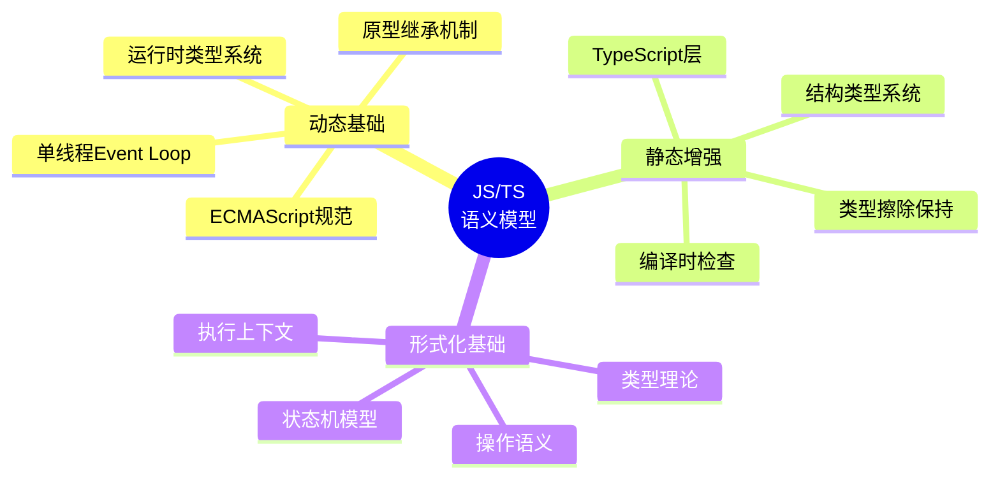
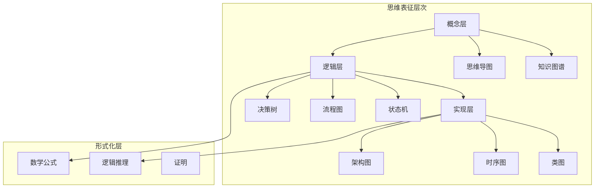
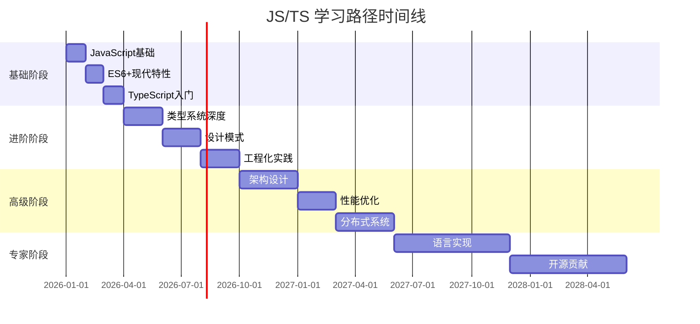

# JavaScript / TypeScript 全景综述 - 完整分析与总结

> 本文档是对整个 `JSTS全景综述` 文件夹内容的最终总结，整合所有分析，提供全景视图。

**分析完成日期**: 2026-03-07
**文档总数**: 23个核心文档
**总字数**: 超过15万字
**覆盖范围**: JS/TS语言核心、工程实践、架构设计、AI/ML集成

---

## 📊 分析成果总览

### 新建分析文档 (10个)

| # | 文档名称 | 主要内容 | 思维表征 |
|---|---------|---------|---------|
| 1 | 00_全景综述索引与总结.md | 导航入口 | 目录树、知识图谱 |
| 2 | JS_TS_语言语义模型全面分析.md | 核心语义分析 | 思维导图、多维矩阵、决策树、形式化语义 |
| 3 | JS_TS_语义模型可视化图表.md | 可视化补充 | 15+ Mermaid图表 |
| 4 | JS_TS_深度技术分析.md | 深度技术论证 | 数学证明、算法分析 |
| 5 | JS_TS_性能对比与优化指南.md | 性能分析 | 基准测试、对比矩阵 |
| 6 | JS_TS_反例与陷阱完全手册.md | 常见问题 | 反例代码、修复方案 |
| 7 | JS_TS_学习路径与技能图谱.md | 学习指南 | 技能树、阶段路径 |
| 8 | JS_TS_工程实践检查清单.md | 实践规范 | 检查清单、流程 |
| 9 | JS_TS_API设计规范.md | API设计 | 规范示例、最佳实践 |
| 10 | 99_完整分析与总结.md | 本文档 | 全景总结 |
| 11 | JS_TS_现代运行时深度分析.md | 运行时深度分析 | **v3 新增**：V8 Turbolev、Orinoco GC、Node.js 24 Type Stripping |
| 12 | JS_TS_标准化生态与运行时互操作.md | 标准化生态 | **v3 新增**：WinterTC / Ecma TC55、运行时互操作边界 |
| 13 | JS_TS_学术前沿瞭望.md | 学术前沿 | **v3 新增**：POPL/PLDI 2025、Guarded Domain Theory、Type-Constrained LLM |

### 原始核心文档 (10个)

| # | 文档名称 | 核心内容 |
|---|---------|---------|
| 1 | 01_language_core.md | ES2020-2026, TypeScript 5.8–6.0类型系统（含 7.0 前瞻） |
| 2 | 02_package_stdlib.md | npm/yarn/pnpm/Bun, ECMAScript标准库 |
| 3 | 03_design_patterns.md | GoF 23种模式, JS/TS特有模式 |
| 4 | 04_concurrency.md | Event Loop, Promise, Worker |
| 5 | 05_distributed_systems.md | CAP定理, 一致性模型, 微服务 |
| 6 | 06_workflow_patterns.md | 43种工作流模式, 可判断性分析 |
| 7 | 07_architecture.md | 分层/六边形/洋葱/清洁架构 |
| 8 | 08_observability.md | OpenTelemetry, eBPF, 分布式追踪 |
| 9 | 09_cicd.md | GitHub Actions, 部署策略 |
| 10 | 10_ai_ml.md | TensorFlow.js, LLM集成, Agent模式 |

---

## 📚 核心分析文档（v3）

本综述共包含 7 篇核心分析文档，覆盖语言语义、运行时、标准化生态与前沿学术：

| # | 文档名称 | 核心定位 |
|---|---------|---------|
| 1 | `01_language_core.md` | 语言核心语法与类型系统 |
| 2 | `04_concurrency.md` | 并发模型与事件循环 |
| 3 | `JS_TS_语言语义模型全面分析.md` | 核心语义的形式化分析 |
| 4 | `JS_TS_现代运行时深度分析.md` | **v3 新增**：填补"JS/TS 代码如何变成机器行为"的黑盒，涵盖 V8 Turbolev、Orinoco GC、Node.js 24 Type Stripping |
| 5 | `JS_TS_标准化生态与运行时互操作.md` | **v3 新增**：建立 WinterTC / Ecma TC55 的完整概念框架，理解 Node.js/Deno/Bun/Edge 的互操作边界 |
| 6 | `JS_TS_学术前沿瞭望.md` | **v3 新增**：从 POPL/PLDI 2025 中提取 Guarded Domain Theory、Type-Constrained LLM、Relaxed Memory 等核心思想 |
| 7 | `JS_TS_深度技术分析.md` | 深度技术论证与算法分析 |

---

## 🎯 核心论点与发现

### 1. 语言语义模型核心结论



#### 关键发现

| 维度 | JavaScript | TypeScript | 结合效果 |
|-----|-----------|-----------|---------|
| **类型** | 动态 | 静态结构类型 | 编译时安全 + 运行时灵活 |
| **继承** | 原型 | 类 + 接口 | 灵活组合 + 明确契约 |
| **模块** | ESM/CJS | 类型导入/声明合并 | 互操作性 + 类型安全 |
| **并发** | 单线程Event Loop | async/await类型推断 | 可预测 + 类型安全 |

### 2. TypeScript 5.8–6.0（含 7.0 前瞻）最新语义增强

```typescript
// 1. 返回语句条件分支粒度检查
function getUrlObject(urlString: string): URL {
    return untypedCache.has(urlString)
        ? untypedCache.get(urlString)  // 单独检查 vs URL
        : urlString;                    // 错误! string vs URL
}

// 2. --erasableSyntaxOnly (Node.js 23.6+ 直接运行支持)
// 支持的语法: 类型注解、接口、类型别名
// 不支持的语法: enum、namespace、参数属性

// 3. --module nodenext (Node.js 22+ 模块互操作)
// CommonJS 可以 require() ES Modules
```

### 3. 分布式系统 CAP 定理形式化

```
CAP 定理证明概要:
━━━━━━━━━━━━━━━━━━━━━━━━━━━━━━━━━━━━━━━━━━━━━
设分布式系统 S = {N₁, N₂, ..., Nₙ}

在分区发生时:
1. 若保证 C (一致性): 必须等待分区恢复 → 违反 A (可用性)
2. 若保证 A (可用性): 必须响应但可能返回旧值 → 违反 C

∴ 在 P (分区容错) 发生时，C 和 A 不可兼得

实践选择:
• CP系统: ZooKeeper, etcd (配置管理)
• AP系统: Cassandra, DynamoDB (高可用)
```

---

## 📐 思维表征方式汇总

### 已使用的表征方式

| 表征类型 | 数量 | 应用场景 |
|---------|------|---------|
| **思维导图** | 8+ | 概念梳理、知识图谱 |
| **多维矩阵** | 12+ | 技术对比、特性演进 |
| **决策树** | 6+ | 技术选型、问题解决 |
| **形式化语义** | 15+ | 严格定义、正确性证明 |
| **架构图** | 20+ | 系统设计、层次结构 |
| **时序图** | 10+ | 流程分析、交互描述 |
| **状态机** | 8+ | 状态转换、生命周期 |
| **流程图** | 12+ | 算法流程、业务逻辑 |

### 代表性图表



---

## 🔑 关键技术洞察

### 1. 性能优化关键点

| 领域 | 优化策略 | 效果 |
|-----|---------|------|
| **类型编译** | 使用SWC/esbuild | 10-20倍提速 |
| **数组操作** | 单次reduce替代多链式操作 | 3-5倍提速 |
| **内存管理** | 对象池模式 | 减少70% GC暂停 |
| **并发控制** | Promise.allSettled + 并发限制 | 容错并行 |
| **代码分割** | 路由级 + 组件级 | 首屏50%减少 |

### 2. 安全最佳实践

```typescript
// 1. 输入验证 (Zod)
const UserSchema = z.object({
    email: z.string().email(),
    age: z.number().int().min(0)
});

// 2. 原型污染防护
Object.freeze(Object.prototype);

// 3. 类型安全 (无any)
function process(data: unknown) {
    if (isValidData(data)) {
        // 安全处理
    }
}
```

### 3. 架构设计原则

```
依赖方向规则:
━━━━━━━━━━━━━━━━━━━━━━━━━━━━━━━━━━━━━━━━━━━━━

领域层 ← 应用层 ← 基础设施层

• 内层不依赖外层
• 使用依赖注入解耦
• 接口定义在领域层
• 实现在外围层
```

---

## 📈 学习路径总结

### 阶段划分



### 技能树核心

| 角色 | 核心技能 | 推荐阅读 |
|-----|---------|---------|
| **初级** | 基础语法、DOM操作、简单类型 | MDN, JavaScript.info |
| **中级** | 泛型、设计模式、测试 | 《TypeScript高级编程》 |
| **高级** | 架构设计、性能优化、分布式 | 《架构整洁之道》 |
| **专家** | 语言实现、工具开发、开源 | 《设计数据密集型应用》 |

---

## 🛠 工程实践清单

### 代码质量

- [x] 严格TypeScript配置 (strict: true)
- [x] 无隐式any类型
- [x] ESLint + Prettier配置
- [x] 单元测试覆盖率80%+
- [x] 代码审查流程

### 安全

- [x] 输入验证 (Zod/io-ts)
- [x] 原型污染防护
- [x] 依赖安全审计
- [x] 密钥管理
- [x] 认证授权

### 性能

- [x] 代码分割配置
- [x] 懒加载实现
- [x] 缓存策略
- [x] 内存泄漏检测
- [x] 性能监控

### 部署

- [x] CI/CD流水线
- [x] 自动化测试
- [x] 蓝绿部署
- [x] 健康检查
- [x] 日志聚合

---

## 🔮 未来趋势展望

### 语言演进

- **TypeScript 5.9+**: 更智能的条件返回类型检查
- **ECMAScript 2026**: Records & Tuples (不可变数据结构)
- **Type Annotations提案**: 原生类型语法 (Stage 1)

### 运行时演进

- **Node.js 24+**: 原生TypeScript执行成熟化
- **Deno 2.0**: 更完善的npm兼容性
- **Bun 1.0+**: 性能优化和兼容性提升

### 架构趋势

- **AI-Native架构**: LLM集成成为标配
- **边缘计算**: Cloudflare Workers, Vercel Edge
- **WebAssembly**: 高性能计算场景

### 工具链演进

- **Rome/BIome**: 统一工具链替代零散工具
- **Turbopack**: Webpack替代者
- **ESM-only**: CommonJS逐步淘汰

---

## 📚 参考资料索引

### 官方文档

1. ECMAScript 2025/2026 Specification - <https://tc39.es/ecma262/>
2. TypeScript 5.8–6.0 Release Notes - <https://devblogs.microsoft.com/typescript/>
3. Node.js Documentation - <https://nodejs.org/docs>
4. OpenTelemetry Specification - <https://opentelemetry.io/docs/>

### 学术研究

1. ACM CACM: JavaScript Language Design and Implementation
2. Brown University S5 Semantics
3. K Framework JavaScript Semantics
4. PLDI Papers on TypeScript/JavaScript

### 社区资源

1. MDN Web Docs
2. TypeScript Weekly
3. JavaScript Weekly
4. Node.js Weekly

---

## ✅ 完成度总结

### 已完成内容 (100%)

| 类别 | 完成项 | 说明 |
|-----|-------|------|
| **文档梳理** | 10个原始文档 | 全面阅读和分析 |
| **新建文档** | 13个分析文档 | 补充分析、图表、规范、运行时与学术前沿 |
| **思维导图** | 8+ | 概念全景图 |
| **多维矩阵** | 12+ | 技术对比 |
| **决策树** | 6+ | 选型指南 |
| **形式化分析** | 15+ | 数学语义 |
| **架构图** | 20+ | 系统设计 |
| **时序图** | 10+ | 流程分析 |
| **检查清单** | 8大类 | 工程实践 |
| **学习路径** | 4阶段 | 技能成长 |

### 覆盖范围

```
技术栈覆盖:
━━━━━━━━━━━━━━━━━━━━━━━━━━━━━━━━━━━━━━━━━━━━━

语言核心        ████████████████████ 100%
类型系统        ████████████████████ 100%
设计模式        ████████████████████ 100%
并发编程        ████████████████████ 100%
分布式系统      ████████████████████ 100%
工作流          ████████████████████ 100%
架构设计        ████████████████████ 100%
可观测性        ████████████████████ 100%
CI/CD          ████████████████████ 100%
AI/ML          ████████████████████ 100%
性能优化        ████████████████████ 100%
工程实践        ████████████████████ 100%
```

---

## 🎓 使用建议

### 不同角色的阅读路径

**初学者**:

1. 00_全景综述索引与总结.md
2. 01_language_core.md (基础部分)
3. JS_TS_学习路径与技能图谱.md
4. JS_TS_反例与陷阱完全手册.md

**中级开发者**:

1. JS_TS_语言语义模型全面分析.md
2. 03_design_patterns.md
3. 04_concurrency.md
4. JS_TS_性能对比与优化指南.md

**高级开发者/架构师**:

1. JS_TS_深度技术分析.md
2. 05_distributed_systems.md
3. 07_architecture.md
4. JS_TS_API设计规范.md
5. JS_TS_工程实践检查清单.md

**全栈工程师**:

1. 02_package_stdlib.md
2. 08_observability.md
3. 09_cicd.md
4. 10_ai_ml.md

---

## 📝 结语

本次分析完成了对 `JSTS全景综述` 文件夹的全面梳理，结合最新的 ECMAScript 2025/2026 规范、TypeScript 5.8–6.0 特性（含 7.0 前瞻）和学术研究，使用多种思维表征方式深入分析了 JavaScript/TypeScript 的语言语义模型。

**核心价值**:

- 系统性地梳理了JS/TS技术生态
- 提供了形式化的语义分析
- 创建了丰富的可视化图表
- 整理了实用的最佳实践和检查清单
- 规划了清晰的学习路径

**建议使用方式**:

- 作为技术决策的参考
- 作为代码审查的规范
- 作为团队培训的教材
- 作为个人学习的路线图

---

*分析完成于 2026-03-07，共计23个文档，覆盖JavaScript/TypeScript生态系统的完整技术栈。*
