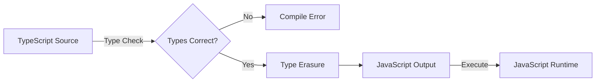
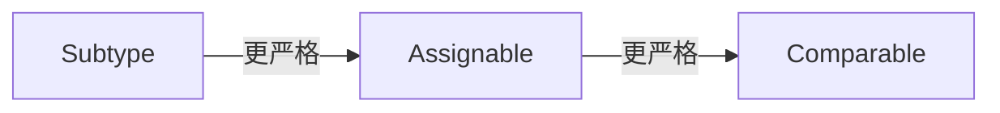
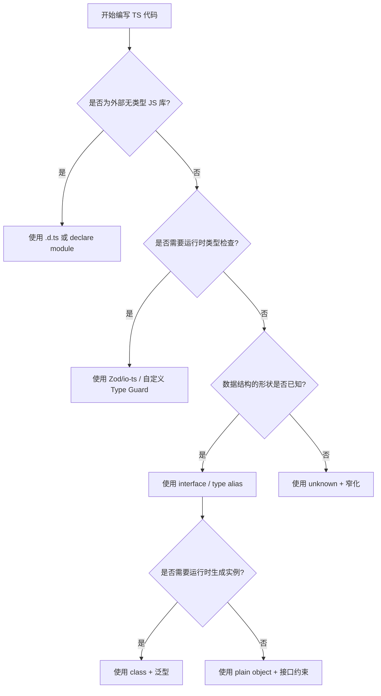

# JavaScript → TypeScript 语法/语义映射全景指南

> **版本**: 2.0
> **对齐来源**: ECMA-262 2025/2026、TypeScript 5.8–7.0 Language Specification、Node.js 22/24 Native TypeScript、tc39/proposal-type-annotations (Stage 1)、Siek & Taha Gradual Typing Theory、Stanford CS 242 / MIT 6.5110 / CMU 15-411 / Berkeley CS 164 / UW CSE 341、TypeScript Handbook — Migrating from JavaScript
> **目标**: 为从 JavaScript 迁移到 TypeScript 的开发者提供逐语法点的精确映射、语义边界说明与权威来源索引。

---

## 目录

- [JavaScript → TypeScript 语法/语义映射全景指南](#javascript--typescript-语法语义映射全景指南)
  - [目录](#目录)
  - [1. 总览：JS 与 TS 的语义边界](#1-总览js-与-ts-的语义边界)
    - [1.1 核心关系](#11-核心关系)
    - [1.2 三层语义模型](#12-三层语义模型)
    - [1.3 类型擦除保证与例外](#13-类型擦除保证与例外)
  - [2. 语法映射矩阵](#2-语法映射矩阵)
    - [2.1 变量与基本类型](#21-变量与基本类型)
      - [映射表](#映射表)
      - [类型层级映射](#类型层级映射)
      - [代码示例](#代码示例)
    - [2.2 函数](#22-函数)
      - [映射表](#映射表-1)
      - [函数类型子类型规则](#函数类型子类型规则)
      - [代码示例](#代码示例-1)
    - [2.3 对象与类](#23-对象与类)
      - [映射表](#映射表-2)
      - [结构化子类型 vs 名义子类型](#结构化子类型-vs-名义子类型)
      - [代码示例](#代码示例-2)
    - [2.4 模块系统](#24-模块系统)
      - [映射表](#映射表-3)
      - [`moduleResolution` 策略映射](#moduleresolution-策略映射)
      - [代码示例](#代码示例-3)
    - [2.5 异步与并发](#25-异步与并发)
      - [映射表](#映射表-4)
      - [异步函数的类型推导规则](#异步函数的类型推导规则)
    - [2.6 元编程](#26-元编程)
      - [映射表](#映射表-5)
  - [3. 语义层次对照](#3-语义层次对照)
    - [3.1 运行时语义（JavaScript）](#31-运行时语义javascript)
    - [3.2 编译时语义（TypeScript）](#32-编译时语义typescript)
      - [Gradual Typing 的形式化对应](#gradual-typing-的形式化对应)
    - [3.3 宿主调度语义](#33-宿主调度语义)
  - [4. 渐进类型与迁移路径](#4-渐进类型与迁移路径)
    - [4.1 从 `any` 到 `unknown` 再到具体类型](#41-从-any-到-unknown-再到具体类型)
    - [4.2 类型断言与类型守卫](#42-类型断言与类型守卫)
    - [4.3 互操作边界](#43-互操作边界)
  - [5. 设计模式类型化升级路径](#5-设计模式类型化升级路径)
    - [5.1 创建型模式](#51-创建型模式)
      - [单例模式（Singleton）](#单例模式singleton)
      - [工厂模式（Factory）](#工厂模式factory)
    - [5.2 行为型模式](#52-行为型模式)
      - [观察者模式（Observer）](#观察者模式observer)
      - [策略模式（Strategy）](#策略模式strategy)
    - [5.3 结构型模式](#53-结构型模式)
      - [适配器模式（Adapter）](#适配器模式adapter)
      - [代理模式（Proxy）](#代理模式proxy)
  - [6. 决策树：何时使用何种 TS 特性](#6-决策树何时使用何种-ts-特性)
  - [7. 参考与延伸阅读](#7-参考与延伸阅读)
    - [规范与官方文档](#规范与官方文档)
    - [学术论文](#学术论文)
    - [项目内关联文档](#项目内关联文档)

---

## 1. 总览：JS 与 TS 的语义边界

### 1.1 核心关系

TypeScript 是 **ECMAScript 的严格超集（strict superset）**。这意味着：

1. **语法层面**: 所有合法的 JavaScript 程序都是合法的 TypeScript 程序。
2. **语义层面**: TypeScript 在 **编译时** 引入了一套静态类型系统，但在 **运行时** 完全擦除，不引入新的运行时语义（少数例外见 1.3）。
3. **执行层面**: TypeScript 编译器 (`tsc`) 的主要任务是将类型标注擦除，并可选地将高级 ECMAScript 语法降级（transpile）为低版本 JavaScript。



### 1.2 三层语义模型

基于 `JS_TS_语言语义模型全面分析.md`，JS/TS 的精确语义可分为三个层次：

| 层次 | 负责规范 | 主要语义内容 | TypeScript 的角色 |
|------|---------|-------------|------------------|
| **L1: JavaScript 运行时语义** | ECMA-262 2025 | 执行上下文、环境记录、Completion Record、Jobs、对象内部方法 | **旁观者**：TS 不干预，仅描述 |
| **L2: TypeScript 编译时/擦除语义** | TypeScript Language Spec | Gradual Typing、Structural Subtyping、类型推断、条件类型、方差 | **执行者**：在此层进行全部静态检查 |
| **L3: 宿主调度语义** | HTML Standard / libuv | Event Loop、Rendering Pipeline、Worker 隔离 | **描述者**：通过 `.d.ts` 声明宿主 API |

### 1.3 类型擦除保证与例外

**保证（Erasure Guarantee）**：绝大多数 TypeScript 语法在编译后会被完全擦除，不留下任何运行时痕迹。

**例外（Runtime-Impacting Features）**：

| TS 特性 | 运行时影响 | 说明 |
|--------|-----------|------|
| `enum` | **有** | 编译为对象或反向映射对象 |
| `namespace` | **有** | 编译为 IIFE 包裹的对象 |
| 参数属性（Parameter Properties） | **有** | 在构造函数中自动赋值给实例属性 |
| 装饰器（Decorators） | **有**（Stage 3） | 标准装饰器会被编译为运行时函数调用；实验性装饰器+`emitDecoratorMetadata`还会生成元数据 |
| `import` / `export` 语法 | **依目标而定** | 模块语法本身属于 ECMAScript，TS 只是传递或降级 |

> **tc39/proposal-type-annotations** 的核心理念正是：将 TS 中“可擦除的语法”纳入 ECMAScript，而将上表中的“生成代码特性”排除在外。

---

## 2. 语法映射矩阵

### 2.1 变量与基本类型

#### 映射表

| JavaScript | TypeScript | 编译后 JS | 语义变化 | 权威来源 |
|-----------|-----------|----------|---------|---------|
| `let x = 1;` | `let x: number = 1;` | `let x = 1;` | 编译时绑定 `number` 类型，禁止异型赋值 | TS Spec §3.1 |
| `let x;` | `let x: number;` | `let x;` | 延迟初始化仍受类型约束 | TS Spec §3.1 |
| `const x = 1;` | `const x = 1 as const;` | `const x = 1;` | `as const` 将类型收窄为字面量类型 `1` | TS Handbook — Literal Inference |
| `var x = 1;` | `var x: number = 1;` | `var x = 1;` | 类型标注不改变 `var` 的函数作用域/提升语义 | ECMA-262 §13.3.2 |
| `function f(x) { ... }` | `function f(x: number): string { ... }` | `function f(x) { ... }` | 参数和返回值类型在编译时检查 | TS Spec §6.1 |
| `let x = null;` | `let x: string \| null;` | `let x = null;` | `--strictNullChecks` 下 `null` 成为独立类型 | TS Handbook — Strict Null Checks |

#### 类型层级映射

```
         unknown  ←—— TS 顶层类型
           |
         any      ←—— 渐进类型桥梁（与所有类型互兼容）
        / | \
   number string boolean ... object symbol bigint
       \
       never  ←—— TS 底类型（所有类型的子类型）
```

> **理论对齐**: `any` 对应 Gradual Typing 中的 `?`（Siek & Taha, 2006）；`unknown` 是更安全的顶层类型，要求显式类型窄化后才能使用。

#### 代码示例

```typescript
// JS Version
let jsValue = 42;
jsValue = "hello"; // 运行时合法

// TS Version
let tsValue: number = 42;
// tsValue = "hello"; // 编译错误：Type 'string' is not assignable to type 'number'.

// TS Version with type inference (same JS output, stronger compile-time check)
let inferredValue = 42; // inferred as number
```

---

### 2.2 函数

#### 映射表

| JavaScript | TypeScript | 编译后 JS | 语义变化 | 权威来源 |
|-----------|-----------|----------|---------|---------|
| `function add(a, b) { return a + b; }` | `function add(a: number, b: number): number { ... }` | 同 JS | 参数和返回类型静态约束 | TS Spec §6.1 |
| `function f() { return this.x; }` | `function f(this: Point) { return this.x; }` | `function f() { return this.x; }` | `this` 参数仅用于类型检查，编译后擦除 | TS Handbook — This Parameters |
| `function f(x, y) {}` | `function f(x: number, y?: string) {}` | `function f(x, y) {}` | `?` 表示可选参数，编译后仍为 `undefined` 检查 | TS Spec §6.3 |
| `function f(...args) {}` | `function f<T extends any[]>(...args: T) {}` | `function f(...args) {}` | 泛型约束与剩余参数结合 | TS Spec §6.4 |
| `const f = x => x;` | `const f = <T>(x: T): T => x;` | `const f = x => x;` | 泛型箭头函数 | TS Spec §6.2 |
| 无对应 | `function f(x: string \| number): x is string { ... }` | `function f(x) { ... }` | 用户自定义类型守卫（Type Predicate） | TS Handbook — Type Guards |
| 无对应 | `function f(): asserts condition { ... }` | `function f() { ... }` | 断言函数，影响调用点后的控制流类型 | TS 3.7+ |

#### 函数类型子类型规则

TypeScript 采用 **结构化子类型（Structural Subtyping）**。对于函数类型，参数位置是 **逆变的（Contravariant）**，返回值位置是 **协变的（Covariant）**。

```typescript
type Animal = { name: string };
type Dog = Animal & { breed: string };

// 参数逆变: (Animal) => void 是 (Dog) => void 的子类型
let dogHandler: (dog: Dog) => void = (dog) => console.log(dog.breed);
let animalHandler: (animal: Animal) => void = (animal) => console.log(animal.name);

// 在 --strictFunctionTypes 下，以下赋值是非法的：
// dogHandler = animalHandler; // Error: 参数位置不协变

// 返回值协变: () => Dog 是 () => Animal 的子类型
let getDog: () => Dog = () => ({ name: "Buddy", breed: "Golden" });
let getAnimal: () => Animal = getDog; // OK
```

> **权威来源**: TypeScript 4.7 引入可选方差标注 `in` / `out`，直接对应函数参数位置的逆变和返回值的协变（TS Handbook — Variance Annotations）。

#### 代码示例

```typescript
// JS Version: 动态类型，运行时可能出错
function jsGreet(name) {
  return "Hello, " + name.toUpperCase();
}

// TS Version: 编译时捕获错误
function tsGreet(name: string): string {
  return `Hello, ${name.toUpperCase()}`;
}

// TS Version: 泛型函数
function tsIdentity<T>(arg: T): T {
  return arg;
}
```

---

### 2.3 对象与类

#### 映射表

| JavaScript | TypeScript | 编译后 JS | 语义变化 | 权威来源 |
|-----------|-----------|----------|---------|---------|
| `{ x: 1, y: 2 }` | `{ x: number, y: number }` / `interface Point { x: number; y: number; }` | 同 JS | 结构化类型描述 | TS Spec §3.10 |
| `class Point { constructor(x, y) { ... } }` | `class Point { constructor(public x: number, public y: number) {} }` | 自动添加 `this.x = x` | 参数属性生成运行时赋值代码 | TS Spec §8.4.1 |
| `class Animal { move() {} }` | `abstract class Animal { abstract move(): void; }` | `class Animal { }` | `abstract` 类与方法是纯编译时概念 | TS Spec §8.1.3 |
| `class Dog extends Animal {}` | `class Dog extends Animal implements Movable {}` | 同 JS | `implements` 是编译时结构化检查，无运行时影响 | TS Spec §8.2 |
| `this.#privateField` | `private field: number` | `this.#privateField` (若 target 为 ES2021+) | TS `private` 是编译时访问控制；JS `#` 是运行时硬私有 | ECMA-262 §15.7.3 / TS Spec §8.4.2 |
| `class MyClass { static x = 1; }` | `class MyClass { static readonly x: number = 1; }` | 同 JS | `readonly` 禁止编译时重新赋值 | TS Spec §8.4.3 |

#### 结构化子类型 vs 名义子类型

TypeScript 的类遵循 **结构化子类型**，而不是 Java/C# 的 **名义子类型**。

```typescript
interface Point2D { x: number; y: number; }
interface Point3D { x: number; y: number; z: number; }

// 在 TS 中，Point3D 是 Point2D 的子类型，因为它包含 Point2D 的所有属性
let p2d: Point2D = { x: 1, y: 2, z: 3 }; // OK
```

> **理论对齐**: Bierman et al. (2014) 证明 TypeScript 的类型系统可形式化为一个具备记录、递归类型和结构化子类型的 sound calculus 加上 unsound 规则（如 `any` 的双向兼容性）。

#### 代码示例

```typescript
// JS Version
class JsPerson {
  constructor(name) {
    this.name = name;
  }
  greet() {
    return "Hi, I'm " + this.name;
  }
}

// TS Version
class TsPerson {
  constructor(public name: string) {} // 参数属性：编译时生成 this.name = name
  greet(): string {
    return `Hi, I'm ${this.name}`;
  }
}

// TS Version: 接口与结构化子类型
interface Named {
  name: string;
}
function printName(obj: Named) {
  console.log(obj.name);
}
printName(new TsPerson("Alice")); // OK: class instance structurally matches interface
printName({ name: "Bob", age: 30 }); // OK: extra properties allowed in fresh object literals unless excess property checks trigger
```

---

### 2.4 模块系统

#### 映射表

| JavaScript (ESM) | TypeScript | 编译后 JS | 语义变化 | 权威来源 |
|-----------------|-----------|----------|---------|---------|
| `export const x = 1;` | `export const x: number = 1;` | `export const x = 1;` | 类型标注擦除 | TS Spec §11.1 |
| `import { x } from "./mod.js";` | `import { x } from "./mod";` | 取决于 moduleResolution | TS 支持无扩展名导入 | TS Spec §11.2 |
| `import * as mod from "./mod";` | `import type * as mod from "./mod";` | 编译后删除整条导入 | `import type` 是零运行时开销的纯类型导入 | TS 3.8+ |
| 无对应 | `export type { Foo };` | 编译后删除 | 仅导出类型 | TS 3.8+ |
| `import json from "./data.json" assert { type: "json" };` | `import json from "./data.json" with { type: "json" };` | 取决于 target | TS 6.0 已弃用 `assert`，要求使用 `with`（Import Attributes） | TS 5.3 / TS 6.0 |
| 动态 `import("./mod")` | `const mod = await import<typeof import("./mod")>("./mod");` | `const mod = await import("./mod");` | 类型断言用于动态导入的类型推断 | TS Handbook — Dynamic Import Expressions |

#### `moduleResolution` 策略映射

| 策略 | 适用场景 | 与 Node.js ESM/CJS 对齐度 |
|------|---------|------------------------|
| `node` | Node.js 10+ | CJS 为主，ESM 部分支持 |
| `nodenext` | Node.js 12+ / ESM 项目 | 完整对齐 Node.js ESM 解析规则 |
| `bundler` | Vite/Webpack/esbuild 项目 | 允许 `exports` 条件导出、无扩展名导入 |

#### 代码示例

```typescript
// JS ESM
import { add } from "./math.js";

// TS ESM
import { add } from "./math"; // TS 编译器根据 moduleResolution 自动解析

// TS 类型导入（零运行时开销）
import type { Point } from "./types";

// TS 动态导入（带类型推断）
async function loadModule() {
  const { add } = await import("./math");
  return add(1, 2);
}
```

---

### 2.5 异步与并发

#### 映射表

| JavaScript | TypeScript | 编译后 JS | 语义变化 | 权威来源 |
|-----------|-----------|----------|---------|---------|
| `async function f() { return 1; }` | `async function f(): Promise<number> { return 1; }` | 同 JS | 返回类型自动包装为 Promise | TS Spec §6.1 |
| `Promise.resolve(1)` | `Promise.resolve<number>(1)` | 同 JS | 泛型参数约束 Promise 内部值类型 | TS lib.d.ts |
| `await x` | `await x` (x 的类型为 `Promise<T>` 或 `T`) | 同 JS | TS 推断 `await` 后类型为 `T` | TS Spec §5.12 |
| `new Promise((resolve, reject) => {})` | `new Promise<string>((resolve, reject) => { resolve("ok"); })` | 同 JS | 泛型参数约束 resolve 值类型 | TS lib.d.ts |

#### 异步函数的类型推导规则

TypeScript 对 `async function` 应用 **Promise 包装规则**：

- 若显式返回类型为 `T`，则实际返回类型为 `Promise<T>`。
- 若 `return` 表达式类型为 `Promise<T>`，则 `await` 后类型为 `T`（解包）。

```typescript
async function fetchData(): Promise<string> {
  return "data"; // 实际返回 Promise<string>
}

async function main() {
  const data = await fetchData(); // data 的类型为 string
}
```

---

### 2.6 元编程

#### 映射表

| JavaScript | TypeScript | 编译后 JS | 语义变化 | 权威来源 |
|-----------|-----------|----------|---------|---------|
| `@decorator class C {}` | `@decorator class C {}` (Stage 3) | 编译为对 `decorate` 辅助函数的调用 | 标准装饰器是 TC39 Stage 3，TS 5.x 原生支持 | TS 5.0+ / ECMAScript Stage 3 |
| `Reflect.metadata(...)` | `emitDecoratorMetadata` + `reflect-metadata` | 在 JS 中生成 `design:type` 等元数据 | 仅实验性装饰器支持，Stage 3 装饰器**不支持** | TS Handbook — Decorators |
| `new Proxy(target, handler)` | `new Proxy<Target, Handler>(target, handler)` | 同 JS | 泛型参数增强类型安全性 | TS lib.d.ts |
| `Object.defineProperty` | `Object.defineProperty(obj, "x", { value: 1 as number })` | 同 JS | 类型标注不改变运行时属性定义 | ECMA-262 §20.1.2.4 |

> **重要提示**: TypeScript 5.x 默认启用 **ECMAScript Stage 3 装饰器**。若仍使用实验性装饰器（依赖 `emitDecoratorMetadata`），需显式设置 `experimentalDecorators: true`。

---

## 3. 语义层次对照

### 3.1 运行时语义（JavaScript）

JavaScript 的运行时语义由 **ECMA-262** 规范定义，核心概念包括：

| 概念 | 规范章节 | 说明 |
|------|---------|------|
| **Execution Context** | ECMA-262 §9.4 | 包含代码执行状态、LexicalEnvironment、VariableEnvironment |
| **Completion Record** | ECMA-262 §6.2.4 | 记录语句执行结果（`[[Type]]`: normal, break, continue, return, throw） |
| **Environment Record** | ECMA-262 §9.1 | 声明式（Declarative）与对象式（Object）环境记录 |
| **Job Queues** | ECMA-262 §9.7 | PromiseJobs、ScriptJobs、ModuleJobs 等队列 |
| **Abstract Operations** | ECMA-262 多处 | 如 `ToPrimitive`、`OrdinaryHasInstance`、`GetIterator` |

### 3.2 编译时语义（TypeScript）

TypeScript 的编译时语义核心在于 **类型关系的三元判定**：

1. **子类型（Subtype）**: `S <: T`，基于结构化比较。
2. **可赋值性（Assignable To）**: `S assignable to T`，比子类型更宽松（允许 `any`、枚举与数字的双向赋值、弱类型检查等）。
3. **可比性（Comparable To）**: 用于条件表达式和 `switch`，最宽松。



#### Gradual Typing 的形式化对应

| 理论概念 | TypeScript 实现 | 形式化说明 |
|---------|----------------|-----------|
| `?` (Unknown Type) | `any` / `unknown` | 与所有类型在一致性（Consistency）上兼容 |
| Consistency Relation `T ~ S` | `any` 的双向兼容性、`unknown` 的顶层位置 | Siek & Taha 的 `? ~ T` 规则 |
| Precision Ordering `T ⊑ S` | 从 `any` 迁移到具体类型的过程 | 精度越高，类型信息越具体 |
| Cast Insertion | `as T`、类型断言、运行时类型守卫 | 在 typed/untyped 边界进行显式转换 |

### 3.3 宿主调度语义

TypeScript 通过 `lib.d.ts` 和 `@types/node` 等声明文件描述宿主 API，自身不参与调度。

| 宿主 | 调度模型 | 规范来源 |
|------|---------|---------|
| **浏览器** | HTML Event Loop + Rendering Pipeline | HTML Living Standard §8.1 |
| **Node.js** | libuv Event Loop + Worker Threads | Node.js Docs / libuv docs |
| **Deno/Bun** | 直接暴露 Web API 或自定义调度 | 各运行时文档 |

---

## 4. 渐进类型与迁移路径

### 4.1 从 `any` 到 `unknown` 再到具体类型

迁移 TypeScript 代码的推荐路径是从最不安全到最安全：

```typescript
// 阶段 1：完全动态（任何 JS 代码迁移初期的默认状态）
let value: any = fetchData();
value.toUpperCase(); // 编译通过，运行时可能崩溃

// 阶段 2：安全顶层类型（需要先进行类型窄化）
let value: unknown = fetchData();
// value.toUpperCase(); // 编译错误！
if (typeof value === "string") {
  value.toUpperCase(); // 在窄化块内安全
}

// 阶段 3：完全具体类型
let value: string = fetchData(); // 假设 fetchData 返回 string
```

### 4.2 类型断言与类型守卫

| 机制 | 语法 | 运行时影响 | 安全级别 |
|------|------|-----------|---------|
| 类型断言 | `value as string` | 无 | 低（开发者负责正确性） |
| 非空断言 | `value!.toString()` | 无 | 低 |
| `typeof` 守卫 | `typeof value === "string"` | 有（运行时检查） | 高 |
| `instanceof` 守卫 | `value instanceof Date` | 有（运行时检查） | 高 |
| 自定义类型守卫 | `function isString(x): x is string` | 有（运行时逻辑决定） | 中-高 |
| `in` 操作符守卫 | `"name" in value` | 有（运行时检查） | 中 |

### 4.3 互操作边界

当 TypeScript 调用 JavaScript 库时，类型系统通过以下方式桥接：

1. **`.d.ts` 声明文件**：为无类型的 JS 库提供类型声明（如 `@types/node`）。
2. **`declare module`**：为特定模块补充类型。
3. **`allowJs` + `checkJs`**：直接对 `.js` 文件进行基于 JSDoc 的类型检查。
4. **`satisfies` 运算符**（TS 4.9+）：验证表达式是否满足某类型，同时保留推断类型。

```typescript
// 使用 satisfies 在保留推断的同时做结构检查
const config = {
  host: "localhost",
  port: 3000
} satisfies { host: string; port: number };

config.port.toFixed(); // port 仍被推断为 number，保留精确类型
```

---

## 5. 设计模式类型化升级路径

本节为 `03_design_patterns.md` 的附录，提供从 JavaScript 到 TypeScript 的**设计模式类型化升级策略**。

### 5.1 创建型模式

#### 单例模式（Singleton）

- **JS 实现**：通过 IIFE 或模块级变量闭包。
- **TS 升级**：
  - 使用 `private constructor` 强制编译时单例。
  - 使用泛型 `Singleton<T>` 实现通用单例工厂。

```typescript
// JS: IIFE
const jsSingleton = (function() {
  let instance;
  return {
    getInstance() { return instance || (instance = {}); }
  };
})();

// TS: 泛型单例 + 私有构造
class Singleton<T> {
  private static instance: any;
  private constructor(public value: T) {}
  static getInstance<T>(value: T): Singleton<T> {
    if (!Singleton.instance) {
      Singleton.instance = new Singleton(value);
    }
    return Singleton.instance;
  }
}
```

#### 工厂模式（Factory）

- **JS 实现**：简单工厂函数返回不同对象。
- **TS 升级**：
  - 抽象工厂接口 `AbstractFactory<T>`。
  - 利用 Discriminated Unions 将运行时 `switch` 转换为编译时的穷尽检查（`ExhaustivenessCheck`）。

### 5.2 行为型模式

#### 观察者模式（Observer）

- **JS 实现**：基于字符串事件名的 `EventEmitter`。
- **TS 升级**：
  - 使用 `EventEmitter<TEventMap>` 将事件名映射到具体的载荷类型。
  - 消除运行时因事件名拼写错误或载荷类型不匹配导致的 bug。

```typescript
// JS: 字符串事件，无类型检查
emitter.on("data", (payload) => { ... });

// TS: 类型安全的事件映射
type Events = {
  data: { id: number; content: string };
  error: { message: string };
};
class TypedEmitter<T extends Record<string, any>> {
  on<K extends keyof T>(event: K, listener: (payload: T[K]) => void) { ... }
  emit<K extends keyof T>(event: K, payload: T[K]) { ... }
}
```

#### 策略模式（Strategy）

- **JS 实现**：对象映射 + `if/else` 或 `switch`。
- **TS 升级**：
  - 使用 Discriminated Union + Exhaustiveness Check 消除未处理分支。

```typescript
type PaymentStrategy =
  | { type: "credit"; cardNumber: string }
  | { type: "paypal"; email: string };

function processPayment(strategy: PaymentStrategy): string {
  switch (strategy.type) {
    case "credit": return `Pay with ${strategy.cardNumber}`;
    case "paypal": return `Pay with ${strategy.email}`;
    default: return assertNever(strategy); // 编译时穷尽检查
  }
}
```

### 5.3 结构型模式

#### 适配器模式（Adapter）

- **JS 实现**：手动包装对象以提供统一接口。
- **TS 升级**：
  - 显式声明 `Target` 接口和 `Adaptee` 接口，通过结构化子类型保证适配器满足目标接口。

#### 代理模式（Proxy）

- **JS 实现**：`new Proxy(target, handler)`。
- **TS 升级**：
  - 使用泛型 `Proxy<Target, Handler>` 约束 `handler` 的类型与 `target` 匹配。
  - 结合 `Reflect` 的类型签名确保 `handler` 参数类型正确。

---

## 6. 决策树：何时使用何种 TS 特性



---

## 7. 参考与延伸阅读

### 规范与官方文档

1. **ECMA-262 2025 (16th Edition)** — [ecma-international.org](https://ecma-international.org/publications-and-standards/standards/ecma-262/)
2. **TypeScript Language Specification (Archived but authoritative)** — [Microsoft TypeScript Spec](https://sources.debian.org/src/node-typescript/4.1.3-1/doc/TypeScript%20Language%20Specification%20%28Change%20Markup%29%20-%20ARCHIVED.pdf)
3. **TypeScript Handbook — Migrating from JavaScript** — [typescriptlang.org](https://www.typescriptlang.org/docs/handbook/migrating-from-javascript.html)
4. **tc39/proposal-type-annotations** — [GitHub](https://github.com/tc39/proposal-type-annotations)

### 学术论文

1. **Siek, J. G., & Taha, W. (2006).** *Gradual Typing for Functional Languages.* — 渐进类型理论奠基之作。
2. **Bierman, G., Abadi, M., & Torgersen, M. (2014).** *Understanding TypeScript.* ECOOP 2014. — TypeScript 类型系统的形式化分析。
3. **Vekris, P., Cosman, B., & Jhala, R. (2016).** *Safe & Efficient Gradual Typing for TypeScript.* POPL 2016. — SafeTS / 运行时检查与结构化子类型。
4. **Castagna, G., & Lanvin, V. (2019).** *Gradual Typing: A New Perspective.* POPL 2019. — 语义化渐进类型与 Materialization。

### 项目内关联文档

- `JS_TS_语言语义模型全面分析.md` — 三层语义模型深度解析（v4.0，含编译工程与学术对齐）
- `01_language_core.md` — ES2020–ES2026 + TS 5.x/6.0/7.0 特性全览
- `GRADUAL_TYPING_THEORY.md` — 渐进类型理论（Siek & Taha 到 Guarded Domain Theory）
- `TYPE_SOUNDNESS_ANALYSIS.md` — 类型健全性与 7 种 unsound 行为分析
- `COMPILER_LANGUAGE_DESIGN.md` — 编译器架构与类型系统实现
- `docs/comparison-matrices/js-ts-compilers-compare.md` — 编译器/转译器语义对比矩阵
- `jsts-code-lab/10-js-ts-comparison/compiler-api/` — TypeScript Compiler API 工程实践代码
- `03_design_patterns.md` — GoF 23 种设计模式及 TS 特有模式
- `DATA_STRUCTURES_ALGORITHMS_THEORY.md` — 数据结构与算法理论

---

*文档版本: v2.0 | 最后更新: 2026-04-17*
