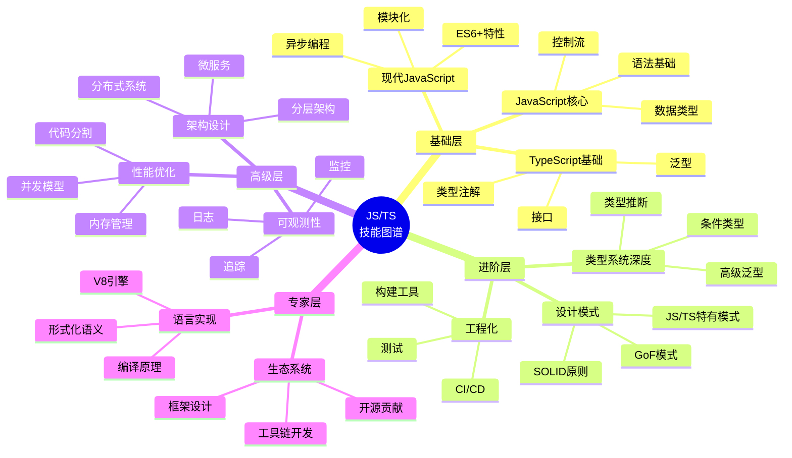
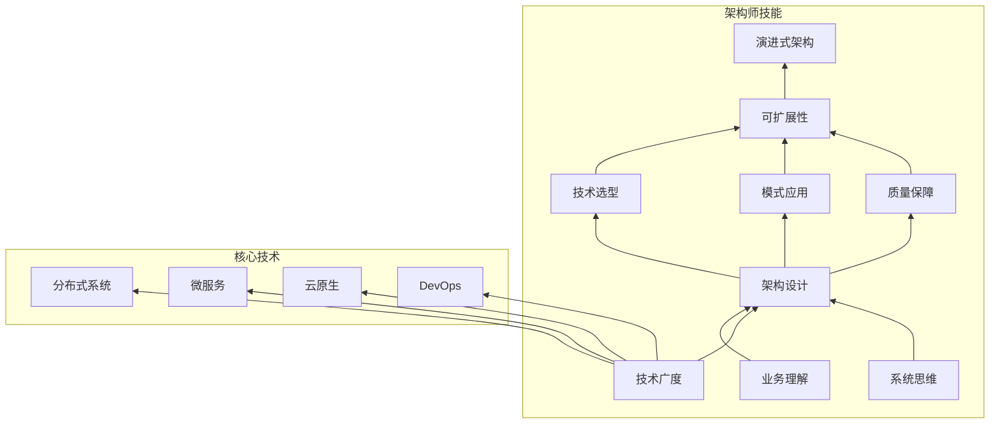

# JavaScript / TypeScript 学习路径与技能图谱

> 从初学者到专家的学习路径，包含技能图谱和推荐资源

---

## 目录

- [JavaScript / TypeScript 学习路径与技能图谱](#javascript--typescript-学习路径与技能图谱)
  - [目录](#目录)
  - [1. 技能图谱总览](#1-技能图谱总览)
  - [2. 学习路径阶段](#2-学习路径阶段)
    - [Stage 1: 基础入门 (0-3个月)](#stage-1-基础入门-0-3个月)
      - [目标能力](#目标能力)
      - [学习主题](#学习主题)
      - [实践项目](#实践项目)
      - [推荐资源](#推荐资源)
    - [Stage 2: 进阶提高 (3-6个月)](#stage-2-进阶提高-3-6个月)
      - [目标能力](#目标能力-1)
      - [学习主题](#学习主题-1)
      - [实践项目](#实践项目-1)
      - [推荐资源](#推荐资源-1)
    - [Stage 3: 高级应用 (6-12个月)](#stage-3-高级应用-6-12个月)
      - [目标能力](#目标能力-2)
      - [学习主题](#学习主题-2)
      - [实践项目](#实践项目-2)
      - [推荐资源](#推荐资源-2)
    - [Stage 4: 专家精通 (12-24个月)](#stage-4-专家精通-12-24个月)
      - [目标能力](#目标能力-3)
      - [学习主题](#学习主题-3)
      - [实践项目](#实践项目-3)
      - [推荐资源](#推荐资源-3)
  - [3. 专项技能图谱](#3-专项技能图谱)
    - [3.1 类型系统专家路径](#31-类型系统专家路径)
      - [关键技能点](#关键技能点)
      - [类型体操练习](#类型体操练习)
    - [3.2 性能优化专家路径](#32-性能优化专家路径)
    - [3.3 架构师技能路径](#33-架构师技能路径)
  - [4. 学习资源库](#4-学习资源库)
    - [4.1 官方文档](#41-官方文档)
    - [4.2 推荐书籍](#42-推荐书籍)
    - [4.3 在线课程](#43-在线课程)
    - [4.4 社区和资源](#44-社区和资源)
  - [5. 技能评估标准](#5-技能评估标准)
    - [初级开发者 (Junior)](#初级开发者-junior)
    - [中级开发者 (Mid-level)](#中级开发者-mid-level)
    - [高级开发者 (Senior)](#高级开发者-senior)
    - [技术专家 (Expert)](#技术专家-expert)
  - [6. 持续学习计划](#6-持续学习计划)
    - [每日](#每日)
    - [每周](#每周)
    - [每月](#每月)
    - [每季度](#每季度)

## 1. 技能图谱总览



---

## 2. 学习路径阶段

### Stage 1: 基础入门 (0-3个月)

#### 目标能力

- 理解 JavaScript 基础语法和概念
- 能够编写简单的交互式网页
- 理解基本的类型概念

#### 学习主题

```
JavaScript 基础:
├── 变量和数据类型 (string, number, boolean, null, undefined)
├── 运算符和表达式
├── 控制流 (if/else, switch, for, while)
├── 函数 (声明、表达式、箭头函数)
├── 数组和对象操作
├── DOM 操作基础
└── 事件处理

现代 JavaScript (ES6+):
├── let/const vs var
├── 模板字符串
├── 解构赋值
├── 展开运算符
├── 默认参数
├── Promise 基础
└── async/await 基础

TypeScript 入门:
├── 类型注解 (string, number, boolean, any)
├── 接口 (interface)
├── 类型别名 (type)
├── 函数类型
└── tsconfig.json 基础配置
```

#### 实践项目

- [ ] Todo List 应用
- [ ] 计算器
- [ ] 天气查询应用 (使用 fetch API)

#### 推荐资源

- MDN Web Docs (<https://developer.mozilla.org>)
- JavaScript.info (<https://javascript.info>)
- TypeScript Handbook (<https://www.typescriptlang.org/docs/>)

---

### Stage 2: 进阶提高 (3-6个月)

#### 目标能力

- 深入理解类型系统
- 掌握常见设计模式
- 能够构建完整的前端应用

#### 学习主题

```
TypeScript 进阶:
├── 泛型 (Generics)
├── 类型约束和默认值
├── 条件类型 (Conditional Types)
├── 映射类型 (Mapped Types)
├── 类型守卫和类型收窄
├── 实用工具类型 (Partial, Required, Pick, Omit)
├── 命名空间和模块
└── 声明文件 (.d.ts)

设计模式:
├── SOLID 原则
├── 创建型模式
│   ├── 单例模式
│   ├── 工厂模式
│   └── 建造者模式
├── 结构型模式
│   ├── 适配器模式
│   ├── 装饰器模式
│   └── 代理模式
└── 行为型模式
    ├── 观察者模式
    ├── 策略模式
    └── 命令模式

工程化:
├── 构建工具 (Vite, Webpack)
├── 包管理器 (npm, pnpm)
├── 代码规范 (ESLint, Prettier)
├── 测试基础 (Jest, Vitest)
└── Git 工作流
```

#### 实践项目

- [ ] 电商购物车系统
- [ ] 博客平台前端
- [ ] 实时聊天应用

#### 推荐资源

- 《TypeScript 高级编程》
- 《JavaScript 设计模式》
- Refactoring Guru (<https://refactoring.guru>)

---

### Stage 3: 高级应用 (6-12个月)

#### 目标能力

- 能够设计复杂系统架构
- 掌握性能优化技术
- 理解并发和异步编程深入概念

#### 学习主题

```
架构设计:
├── 分层架构 (Layered)
├── MVC / MVVM / MVP
├── 六边形架构 (Ports and Adapters)
├── 洋葱架构 (Onion Architecture)
├── 清洁架构 (Clean Architecture)
├── 微前端架构
└── 状态管理 (Redux, Zustand, Signals)

并发编程:
├── Event Loop 深入
├── 宏任务与微任务
├── Web Workers
├── Service Workers
├── SharedArrayBuffer
├── Atomics API
└── 异步迭代器

性能优化:
├── 内存管理和垃圾回收
├── 代码分割和懒加载
├── 虚拟列表和窗口化
├── 缓存策略
├── Web 性能指标 (Core Web Vitals)
└── 性能分析工具

分布式基础:
├── RESTful API 设计
├── GraphQL
├── WebSocket
├── 认证和授权 (JWT, OAuth)
└── 基础消息队列概念
```

#### 实践项目

- [ ] 企业级管理系统
- [ ] 实时协作编辑器
- [ ] 微前端架构应用

#### 推荐资源

- 《架构整洁之道》
- 《JavaScript 并发编程》
- Web.dev 性能指南 (<https://web.dev/performance-scoring/>)

---

### Stage 4: 专家精通 (12-24个月)

#### 目标能力

- 能够设计大型分布式系统
- 深入理解语言实现原理
- 能够开发工具和框架

#### 学习主题

```
分布式系统:
├── CAP 定理和 BASE 理论
├── 一致性模型
├── 分布式事务
├── 微服务架构
├── 服务网格 (Service Mesh)
├── 事件驱动架构 (EDA)
├── CQRS 和 Event Sourcing
└── 分布式追踪

可观测性:
├── 指标收集 (Metrics)
├── 日志聚合 (Logging)
├── 分布式追踪 (Tracing)
├── OpenTelemetry
├── 告警和监控
└── 性能分析

AI/ML 集成:
├── TensorFlow.js
├── 大语言模型集成
├── RAG 架构
├── 向量数据库
└── Agent 模式

语言深入:
├── V8 引擎原理
├── 编译器前端 (Parser, AST)
├── 类型系统理论
├── 形式化语义
└── 语言设计
```

#### 实践项目

- [ ] 分布式电商平台
- [ ] AI 驱动的应用
- [ ] 开源工具贡献

#### 推荐资源

- 《设计数据密集型应用》(DDIA)
- 《JavaScript 语言精髓与编程实践》
- ECMA-262 规范
- V8 博客 (<https://v8.dev/blog>)

---

## 3. 专项技能图谱

### 3.1 类型系统专家路径

```mermaid
graph LR
    A[基础类型] --> B[泛型]
    B --> C[条件类型]
    C --> D[类型推断]
    D --> E[类型编程]
    E --> F[编译器插件开发]

    A -.-> A1[string number boolean]
    B -.-> B1<T extends U>
    C -.-> C1[extends ? : ]
    D -.-> D1[infer 关键字]
    E -.-> E1[类型体操]
    F -.-> F1[TS Compiler API]
```

#### 关键技能点

1. **基础类型**: 理解原始类型、字面量类型、联合/交叉类型
2. **泛型**: 能够编写泛型函数和类，理解约束
3. **条件类型**: 掌握 extends 条件类型、分布式条件类型
4. **类型推断**: 理解 infer 关键字，能够编写类型推断工具
5. **类型编程**: 实现复杂类型转换工具
6. **编译器插件**: 使用 TS Compiler API 开发自定义工具

#### 类型体操练习

```typescript
// 练习 1: 实现 DeepReadonly
type DeepReadonly<T> = {
    readonly [K in keyof T]: T[K] extends object
        ? DeepReadonly<T[K]>
        : T[K];
};

// 练习 2: 实现 Tuple to Union
type TupleToUnion<T extends readonly any[]> = T[number];

// 练习 3: 实现 CapitalizeKeys
type CapitalizeKeys<T> = {
    [K in keyof T as Capitalize<string & K>]: T[K];
};

// 练习 4: 实现 Flatten
type Flatten<T extends any[]> = T extends [infer F, ...infer R]
    ? F extends any[]
        ? [...Flatten<F>, ...Flatten<R>]
        : [F, ...Flatten<R>]
    : [];
```

---

### 3.2 性能优化专家路径

```
性能优化技能树:
━━━━━━━━━━━━━━━━━━━━━━━━━━━━━━━━━━━━━━━━━━━━━

前端性能
├── 加载性能
│   ├── 代码分割
│   ├── 懒加载
│   ├── 预加载/预获取
│   └── 资源压缩
├── 渲染性能
│   ├── 虚拟DOM优化
│   ├── 列表虚拟化
│   ├── 防抖/节流
│   └── 动画优化
└── 运行时性能
    ├── 内存泄漏排查
    ├── 长任务优化
    └── 垃圾回收调优

后端性能
├── I/O优化
│   ├── 数据库查询优化
│   ├── 缓存策略
│   └── 连接池管理
├── 并发优化
│   ├── 异步处理
│   ├── Worker线程
│   └── 流式处理
└── 内存优化
    ├── 对象池
    ├── 内存分析
    └── 泄漏检测
```

---

### 3.3 架构师技能路径



---

## 4. 学习资源库

### 4.1 官方文档

| 资源 | 链接 | 用途 |
|-----|------|------|
| MDN Web Docs | developer.mozilla.org | Web技术参考 |
| TypeScript官方 | typescriptlang.org | TS语言和编译器 |
| Node.js文档 | nodejs.org/docs | 运行时API |
| ECMAScript规范 | tc39.es/ecma262/ | 语言规范 |
| Web.dev | web.dev | 现代Web开发 |

### 4.2 推荐书籍

| 书名 | 作者 | 难度 | 主题 |
|-----|------|------|------|
| 《JavaScript高级程序设计》 | Matt Frisbie | 中级 | JS核心 |
| 《深入理解TypeScript》 | Basarat Ali Syed | 中级 | TS深入 |
| 《JavaScript设计模式》 | Addy Osmani | 中级 | 设计模式 |
| 《架构整洁之道》 | Robert C. Martin | 高级 | 软件架构 |
| 《设计数据密集型应用》 | Martin Kleppmann | 高级 | 分布式系统 |
| 《JavaScript语言精髓与编程实践》 | 周爱民 | 专家 | 语言实现 |

### 4.3 在线课程

| 平台 | 课程 | 级别 |
|-----|------|------|
| Frontend Masters | TypeScript Fundamentals | 入门 |
| Egghead.io | Advanced TypeScript | 进阶 |
| Udemy | Node.js Microservices | 高级 |
| Coursera | Cloud Computing Specialization | 高级 |

### 4.4 社区和资源

- **GitHub**: 阅读优秀开源项目源码
- **Dev.to / Medium**: 技术博客
- **TypeScript Weekly**: 每周TS资讯
- **JavaScript Weekly**: JS生态动态

---

## 5. 技能评估标准

### 初级开发者 (Junior)

- [ ] 能够独立完成简单功能模块
- [ ] 理解基本的设计模式
- [ ] 能够编写单元测试
- [ ] 熟悉Git基本操作

### 中级开发者 (Mid-level)

- [ ] 能够设计复杂组件和模块
- [ ] 掌握TypeScript高级类型
- [ ] 能够进行性能优化
- [ ] 理解并实践代码审查

### 高级开发者 (Senior)

- [ ] 能够设计系统架构
- [ ] 掌握分布式系统概念
- [ ] 能够指导和培养团队成员
- [ ] 能够解决复杂技术难题

### 技术专家 (Expert)

- [ ] 在特定领域有深入研究
- [ ] 能够开发工具和框架
- [ ] 能够进行技术演讲和写作
- [ ] 对技术选型有决策能力

---

## 6. 持续学习计划

### 每日

- 阅读技术文章 (30分钟)
- 代码审查和学习 (30分钟)

### 每周

- 深入学习一个概念
- 完成一个小项目或练习
- 参与技术讨论

### 每月

- 阅读一本书的一个章节
- 学习一个新工具或库
- 写技术博客或笔记

### 每季度

- 完成一个综合项目
- 参加技术会议或Meetup
- 回顾和调整学习计划

---

*本文档提供了从初学者到专家的学习路径，建议根据个人情况调整学习节奏，理论与实践相结合。*
