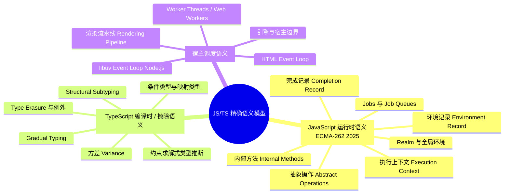
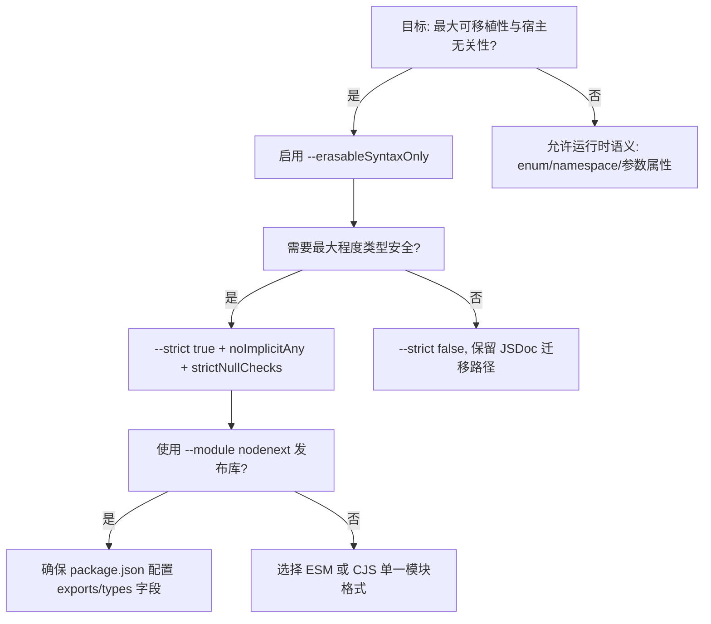
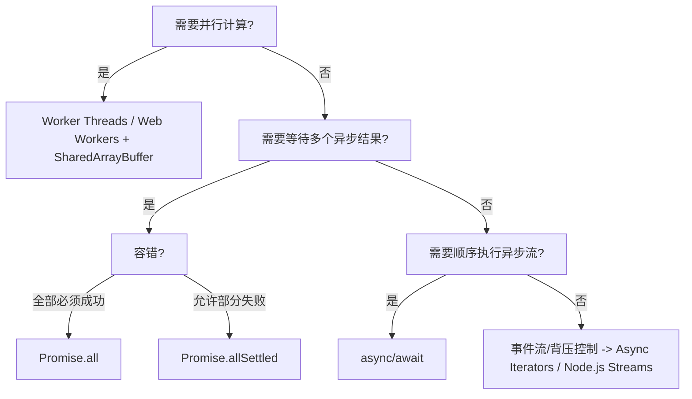
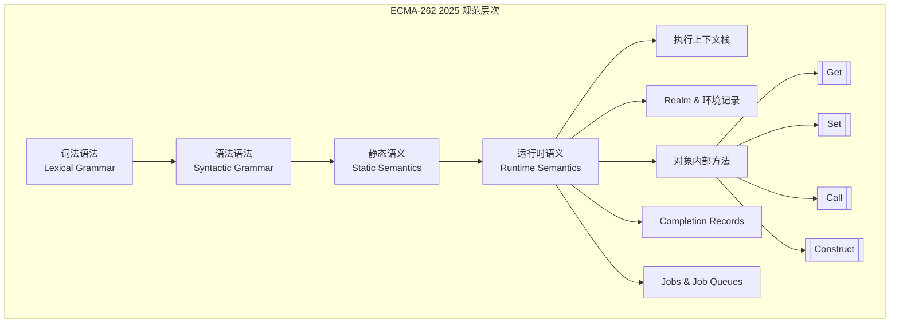
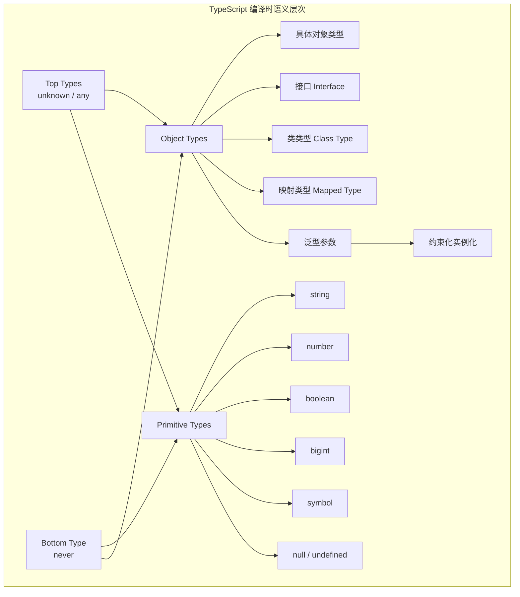

# JavaScript / TypeScript 语言语义模型全面分析

> 本文档基于 ECMA-262 2025、TypeScript 5.8–6.0 规范、HTML Living Standard、Node.js 文档及 PL 学术前沿，建立 JS/TS 的精确概念语义模型。面向研究者与高级开发者，强调规范引用与学术概念的准确性，摒弃不可执行的玩具代码与伪形式化表述。

**分析日期**: 2026-04-02
**TypeScript 版本**: 5.8–6.0
**ECMAScript 版本**: 2025 (ES16) [ECMA-262 2025]

---

## 目录

- [JavaScript / TypeScript 语言语义模型全面分析](#javascript--typescript-语言语义模型全面分析)
  - [目录](#目录)
  - [1. 三层语义模型总览](#1-三层语义模型总览)
  - [2. 核心概念规范对照](#2-核心概念规范对照)
    - [2.1 语义层次与规范来源](#21-语义层次与规范来源)
    - [2.2 JS vs TS 语义边界矩阵](#22-js-vs-ts-语义边界矩阵)
    - [2.3 执行环境调度矩阵](#23-执行环境调度矩阵)
  - [3. 决策树：技术语义选型](#3-决策树技术语义选型)
    - [3.1 类型系统严格度决策](#31-类型系统严格度决策)
    - [3.2 异步并发模式决策](#32-异步并发模式决策)
    - [3.3 模块解析策略决策](#33-模块解析策略决策)
  - [4. 基于规范的精确语义模型](#4-基于规范的精确语义模型)
    - [4.1 JavaScript 运行时语义（ECMA-262 2025）](#41-javascript-运行时语义ecma-262-2025)
      - [4.1.1 执行上下文（Execution Context）](#411-执行上下文execution-context)
      - [4.1.2 完成记录（Completion Record）](#412-完成记录completion-record)
      - [4.1.3 环境记录（Environment Record）](#413-环境记录environment-record)
      - [4.1.4 对象内部方法（Internal Methods）](#414-对象内部方法internal-methods)
      - [4.1.5 Jobs 与 Job Queues（规范层面并发）](#415-jobs-与-job-queues规范层面并发)
    - [4.2 TypeScript 编译时 / 擦除语义](#42-typescript-编译时--擦除语义)
      - [4.2.1 编译时语义的本质](#421-编译时语义的本质)
      - [4.2.2 类型关系的三元判定](#422-类型关系的三元判定)
    - [4.3 宿主调度语义：浏览器与 Node.js](#43-宿主调度语义浏览器与-nodejs)
      - [4.3.1 引擎与宿主的边界](#431-引擎与宿主的边界)
      - [4.3.2 浏览器调度语义](#432-浏览器调度语义)
      - [4.3.3 Node.js 调度语义](#433-nodejs-调度语义)
  - [5. 语言层次与语义边界](#5-语言层次与语义边界)
    - [5.1 ECMAScript 规范内部层次](#51-ecmascript-规范内部层次)
    - [5.2 TypeScript 的编译时语义层次](#52-typescript-的编译时语义层次)
    - [5.3 引擎 - 宿主 - 运行时分界](#53-引擎---宿主---运行时分界)
  - [6. 类型系统深度语义](#6-类型系统深度语义)
    - [6.1 Gradual Typing 与一致性关系](#61-gradual-typing-与一致性关系)
    - [6.2 Structural Subtyping 的本质](#62-structural-subtyping-的本质)
    - [6.3 约束求解式类型推断](#63-约束求解式类型推断)
    - [6.4 类型擦除：保证与例外](#64-类型擦除保证与例外)
    - [6.5 方差与位置敏感性](#65-方差与位置敏感性)
    - [6.6 条件类型分发语义](#66-条件类型分发语义)
  - [7. 执行与调度模型语义](#7-执行与调度模型语义)
    - [7.1 ECMA-262 层面的 Jobs 与队列](#71-ecma-262-层面的-jobs-与队列)
    - [7.2 HTML 标准：浏览器 Event Loop](#72-html-标准浏览器-event-loop)
    - [7.3 Node.js：libuv Event Loop](#73-nodejslibuv-event-loop)
    - [7.4 Worker 的隔离语义](#74-worker-的隔离语义)
  - [8. 前沿特性语义分析](#8-前沿特性语义分析)
    - [8.1 `--erasableSyntaxOnly` 的语义意义](#81---erasablesyntaxonly-的语义意义)
    - [8.2 `--module nodenext` 与 ESM/CJS 互操作](#82---module-nodenext-与-esmcjs-互操作)
    - [8.3 `NoInfer<T>` 的约束语义](#83-noinfert-的约束语义)
    - [8.4 `using` 声明与显式资源管理](#84-using-声明与显式资源管理)
    - [8.5 `import defer` 的延迟求值语义](#85-import-defer-的延迟求值语义)
    - [8.6 TypeScript 7.0 / Go 重写对语义层的影响](#86-typescript-70--go-重写对语义层的影响)
  - [9. 综合论证与结论](#9-综合论证与结论)
    - [9.1 JS/TS 语义模型的核心特征](#91-jsts-语义模型的核心特征)
    - [9.2 学术概念与工程实践的对照](#92-学术概念与工程实践的对照)
    - [9.3 实践建议](#93-实践建议)
  - [参考资源](#参考资源)

---

## 1. 三层语义模型总览



**核心立场**：JS/TS 的完整语义不能被单一规范涵盖。必须区分：

1. **ECMA-262** 定义的引擎级运行时语义；
2. **TypeScript 编译器** 实现的静态分析语义（不保证运行时类型安全）；
3. **宿主环境**（浏览器/Node.js）提供的调度、I/O 与并发语义 [ECMA-262 §2]。

---

## 2. 核心概念规范对照

### 2.1 语义层次与规范来源

| 语义层次 | 权威规范 | 关键抽象 | 与代码的关联阶段 |
|---------|---------|---------|----------------|
| **JavaScript 运行时** | ECMA-262 2025 | Execution Context, Environment Record, Completion Record, Job | 运行时 |
| **TypeScript 静态分析** | TypeScript 5.8 Language Specification / Compiler API | Type, Type Relationship, Constraint, Erasure | 编译时 |
| **浏览器调度** | HTML Living Standard §8.1 | Event Loop, Task Queue, Microtask, Rendering | 运行时 |
| **Node.js 调度** | Node.js Documentation / libuv | Event Loop Phases, `nextTick`, `setImmediate` | 运行时 |

### 2.2 JS vs TS 语义边界矩阵

| 维度 | JavaScript (ECMA-262) | TypeScript (编译时) | 关键差异 |
|------|----------------------|---------------------|---------|
| **类型系统** | 动态类型，运行时标签检查 | 静态类型，结构化子类型 | TS 类型信息在擦除后不可见 [TS Handbook: Type Erasure] |
| **类型推断** | 无（运行时求值） | 基于约束求解（constraint-based），**非 Hindley-Milner** | HM 要求全称量词与无子类型；TS 支持子类型与重载 [TS Deep Dive: Inference] |
| **类型兼容性** | 运行时鸭子类型 | 编译时 Structural Subtyping | 不依赖声明名称，而依赖成员结构 [TS Spec §3.11] |
| **泛型** | 无（对象仅携带原型） | 参数多态，编译后完全擦除 | 除 `enum`、`namespace`、参数属性等例外 |
| **Gradual Typing** | `any` 即为无约束动态值 | `any` 与 `unknown` 构成渐进类型边界 | `any` 与所有类型满足一致性关系 `~` [Siek & Taha 2006] |
| **模块语义** | ESM/CJS 运行时加载与链接 | 编译时模块解析、路径映射、声明合并 | TS 不执行模块加载，仅做类型检查与转译 |

### 2.3 执行环境调度矩阵

| 执行环境 | 调度模型 | 并发原语 | 与 V8 引擎的关系 |
|---------|---------|---------|----------------|
| **浏览器主线程** | HTML Event Loop + 渲染流水线 | Web Workers, Service Workers | V8 嵌入 Blink，由宿主控制 Job 入队 [HTML Standard §8.1] |
| **Node.js 主线程** | libuv Event Loop (7 phases) | Worker Threads, `cluster` | V8 与 libuv 协同，`nextTick` 为 Node.js 特有扩展 [Node.js Docs: Event Loop] |
| **Web Worker** | 独立 HTML Event Loop | `MessageChannel`, `Atomics` | 独立 V8 Isolate，无 DOM [HTML Standard §11] |
| **Service Worker** | 独立 Event Loop + 生命周期管理 | `fetch` 拦截、缓存 API | 受浏览器生命周期管理，不保证常驻 |

---

## 3. 决策树：技术语义选型

### 3.1 类型系统严格度决策



### 3.2 异步并发模式决策



### 3.3 模块解析策略决策

```mermaid
flowchart TD
    A[运行时为 Node.js 22+?] -->|是| B[--module nodenext + --moduleResolution nodenext]
    A -->|否| C[--module esnext / commonjs]
    B --> D[需要 CJS 消费者 require() ESM?]
    D -->|是| E[Node.js 22+ 支持 require(esm) 但有限制]
    D -->|否| F[纯 ESM 输出]
    C --> G[浏览器环境?]
    G -->|是| H[ESM + importmap]
    G -->|否| I[根据 Node.js 版本选择 CJS 或 ESM]
```

---

## 4. 基于规范的精确语义模型

### 4.1 JavaScript 运行时语义（ECMA-262 2025）

#### 4.1.1 执行上下文（Execution Context）

ECMA-262 将执行上下文定义为运行时追踪代码执行的规范设备 [ECMA-262 §8.1]。一个执行上下文并非普通对象，而是一个包含以下字段的规范结构：

- **codeEvaluationState**：恢复该上下文执行所需的Continuation。
- **Function**：若该上下文正在执行函数代码，则为该函数对象；否则为 **null**。
- **Realm**：关联的 Realm Record，决定可用的内置对象与全局环境。
- **ScriptOrModule**：关联的 Script Record 或 Module Record。
- **LexicalEnvironment**：用于解析标识符词法绑定的环境记录。
- **VariableEnvironment**：用于解析 `var` 绑定的环境记录。
- **PrivateEnvironment**：用于解析私有标识符的私有环境记录。

> **规范说明**：执行上下文栈（Execution Context Stack）是严格的后进先出结构，但 Generator 和 async 函数通过挂起（suspend）与恢复（resume）机制，允许其执行上下文在栈中保留并在未来恢复 [ECMA-262 §8.1.3]。

#### 4.1.2 完成记录（Completion Record）

ECMA-262 的所有运行时求值都产生 Completion Record，这是一个规范类型 [ECMA-262 §6.2.4]：

```
Completion Record 结构:
  [[Type]]  ∈ { normal, break, continue, return, throw }
  [[Value]] ∈ any ECMAScript language value | empty
  [[Target]]∈ string | empty
```

控制流语义可通过以下说明性规则描述：

- 若表达式 `e` 求值为 `ReturnCompletion(v)`，则包含 `e` 的函数体立即以 `v` 返回。
- 若 `throw e` 求值为 `ThrowCompletion(err)`，则引擎沿执行上下文栈搜索最近的 `catch` 或异常处理器（通过 **RunJobs** 机制将其转化为 rejection）。

#### 4.1.3 环境记录（Environment Record）

环境记录是规范层面的抽象，用于建模作用域链 [ECMA-262 §9.1]：

| 环境记录类型 | 语义功能 |
|-------------|---------|
| **Declarative Environment Record** | 绑定 `let`、`const`、`class`、`function` 等声明 |
| **Object Environment Record** | 将 `with` 语句的对象属性映射为绑定（严格模式禁用） |
| **Function Environment Record** | 额外包含 `this` 绑定、 `new.target`、参数对象 |
| **Global Environment Record** | 复合记录，包含对象环境记录（全局对象）+ 声明性环境记录 |
| **Module Environment Record** | 包含显式导入/导出绑定，支持不可变间接绑定 |

**闭包语义**：当一个函数对象被创建时，其 `[[Environment]]` 内部槽被设置为当前执行上下文的词法环境。这意味着闭包捕获的是环境记录的引用，而非静态作用域的文本拷贝 [ECMA-262 §10.2.11]。

#### 4.1.4 对象内部方法（Internal Methods）

对象在 ECMA-262 中的行为由一组必需内部方法定义 [ECMA-262 §6.1.7.2]：

- `[[GetPrototypeOf]]()` → Object | Null
- `[[SetPrototypeOf]](V)` → Boolean
- `[[IsExtensible]]()` → Boolean
- `[[PreventExtensions]]()` → Boolean
- `[[GetOwnProperty]](P)` → Property Descriptor | Undefined
- `[[DefineOwnProperty]](P, Desc)` → Boolean
- `[[HasProperty]](P)` → Boolean
- `[[Get]](P, Receiver)` → ECMAScript value
- `[[Set]](P, V, Receiver)` → Boolean
- `[[Delete]](P)` → Boolean
- `[[OwnPropertyKeys]]()` → List of property keys

普通对象（ordinary object）使用规范定义的默认算法实现这些方法；异质对象（exotic object）如 `Proxy` 可覆盖这些行为。这构成了 JavaScript 对象模型的真正“形式化接口”。

#### 4.1.5 Jobs 与 Job Queues（规范层面并发）

ECMA-262 不定义完整的 Event Loop，而是定义了 **Job** 和 **Job Queue** 抽象 [ECMA-262 §9.5]。

- **Job**：一个抽象闭包，无参数，当调用时执行某些规范步骤。Job 的创建与执行之间存在 happen-before 关系。
- **Job Queue**：FIFO 队列，存放待执行的 Job。

规范要求存在至少两个队列 [ECMA-262 §9.5]：

1. **ScriptJobs**：用于初始脚本求值。
2. **PromiseJobs**：用于 Promise 的 resolution/rejection 处理。

**宿主的责任**：具体的 Event Loop 实现（如浏览器或 Node.js）负责从队列中取出 Job 并推入引擎执行。微任务（microtask）在规范中通常对应 PromiseJobs 队列的执行，但宿主可能扩展更多队列（如 Node.js 的 `nextTickQueue`）。

### 4.2 TypeScript 编译时 / 擦除语义

#### 4.2.1 编译时语义的本质

TypeScript 是一种 **编译时静态类型层**，它在 ECMA-262 运行时语义之上添加了类型判断与类型转换规则 [TS Handbook: TypeScript's Type System]。TypeScript 不引入新的运行时值语义（除擦除例外），而是：

1. **类型检查**：在编译时验证程序是否满足类型规则。
2. **擦除（Erasure）**：将类型注解、接口、泛型参数、类型别名等从源代码中移除，生成纯 ECMAScript 代码。
3. **代码生成**：在某些情况下（如 `enum`、`namespace`、装饰器元数据）生成额外的运行时结构。

#### 4.2.2 类型关系的三元判定

TypeScript 的类型检查核心可概括为三个判断：

1. **可赋值性（Assignable）**：`S` 可赋值给 `T`，记作 `S ≲ T`。这是 TypeScript 最常用的类型关系，比严格子类型稍宽（允许某些双变场景）。
2. **子类型（Subtype）**：`S` 是 `T` 的子类型，基于 Structural Subtyping。
3. **一致性（Consistent）**：在 Gradual Typing 框架下，`any` 与所有类型相互一致（见 §6.1）。

TypeScript 编译器在检查函数调用、变量赋值、返回值时，主要使用 **可赋值性** 判断。

### 4.3 宿主调度语义：浏览器与 Node.js

#### 4.3.1 引擎与宿主的边界

**V8 引擎** 负责：

- 解析 ECMAScript 源代码；
- 执行抽象操作与内部方法；
- 管理堆内存与垃圾回收；
- 执行 Job Queue 中的 Job（当被宿主调用时）。

**宿主环境** 负责：

- 提供全局对象（`window`、`global`、`process`）；
- 管理 I/O、定时器、网络请求；
- 实现 Event Loop，决定何时将任务推入 V8；
- 管理多线程 Worker 的生命周期。

这一边界至关重要：ECMA-262 规范中的 `HostEnqueuePromiseJob` 是一个宿主钩子（host hook），浏览器和 Node.js 以不同方式实现它，导致微任务优先级与执行时机的差异 [ECMA-262 §9.5]。

#### 4.3.2 浏览器调度语义

浏览器遵循 **HTML Living Standard** §8.1 的 Event Loop 定义：

- 一个浏览上下文（browsing context）通常有一个 Event Loop。
- Event Loop 维护多个 **task queues**（如 DOM 事件队列、网络事件队列、定时器队列）。
- 每个循环迭代执行：
  1. 从 task queue 中取出一个 **oldest task** 执行。
  2. 执行 **microtask checkpoint**：清空 microtask queue（包括 Promise callbacks 和 `queueMicrotask` 注册的回调）。
  3. 若必要，执行 **update the rendering**（样式计算、布局、绘制、`requestAnimationFrame`）。

> **规范要点**：在浏览器中，一个 task 执行完毕后必须清空所有 microtasks，然后才能执行渲染或下一个 task [HTML Standard §8.1.6.3]。

#### 4.3.3 Node.js 调度语义

Node.js 使用 **libuv** 实现 Event Loop，包含 7 个阶段（phase） [Node.js Docs: The Node.js Event Loop]：

1. **timers**：执行 `setTimeout` / `setInterval` 回调。
2. **pending callbacks**：执行系统操作（如 TCP 错误）的延迟回调。
3. **idle, prepare**：Node.js 内部使用。
4. **poll**：检索新的 I/O 事件；执行 I/O 回调；适当阻塞等待。
5. **check**：执行 `setImmediate` 回调。
6. **close callbacks**：执行 `close` 事件回调。

**Node.js 特有语义**：

- `process.nextTick` 回调在 **当前操作完成后、Event Loop 进入下一阶段前** 立即执行。从规范视角看，`nextTick` 队列的优先级高于 Promise microtask，但这并非 ECMA-262 规范的一部分，而是 Node.js 宿主扩展 [Node.js Docs: process.nextTick]。

---

## 5. 语言层次与语义边界

### 5.1 ECMAScript 规范内部层次



### 5.2 TypeScript 的编译时语义层次



### 5.3 引擎 - 宿主 - 运行时分界

| 责任域 | 规范/实现 | 控制范围 |
|-------|----------|---------|
| **引擎（V8/SpiderMonkey/JavaScriptCore）** | ECMA-262 | 执行抽象操作、内存管理、JIT 编译、Job 执行 |
| **宿主（浏览器/Node.js）** | HTML / libuv / 自定义 | Event Loop、I/O、定时器、Worker 生命周期、全局对象 |
| **TypeScript 编译器（tsc）** | TypeScript 语言规范 | 静态类型检查、擦除、模块解析、声明合并 |

**关键边界示例**：`Promise.then` 的回调注册由引擎的 Promise 内部方法处理，但回调何时被推入执行上下文栈由宿主的 `HostEnqueuePromiseJob` 实现决定 [ECMA-262 §26.2.5.3]。

---

## 6. 类型系统深度语义

### 6.1 Gradual Typing 与一致性关系

TypeScript 的类型系统属于 **Gradual Typing** 家族，其标志性特征是 `any` 类型 [Siek & Taha 2006]。Gradual Typing 的核心语义设备是 **一致性关系（consistency relation）**，记作 `~`：

**一致性规则（说明性）**：

- `T ~ T`  （自反性）
- `any ~ T` （`any` 与任何类型一致）
- `T ~ any` （对称性）
- 若 `S1 ~ T1` 且 `S2 ~ T2`，则 `{ x: S1, y: S2 } ~ { x: T1, y: T2 }`（结构一致性）

与标准子类型不同的是：一致性允许 `any` 出现在任何位置，而不破坏类型的整体一致性。这意味着 TypeScript 的 `any` 不仅是“关闭类型检查”的逃逸口，它在学术上被理解为 **动态类型与静态类型之间的渐近边界**。

**精度序（Precision Ordering）**：

Gradual Typing 还定义了精度序 `⊑`，表示一个类型比另一个类型“更精确”（包含更少的 `any`）：

- `any ⊑ T`（`any` 是最不精确的类型）
- 若 `S1 ⊑ T1` 且 `S2 ⊑ T2`，则 `{ x: S1 } ⊑ { x: T1 }`
- 若 `S ⊑ T`，则 `S` 是 `T` 的更精确近似

TypeScript 的 `unknown` 可被视为 `any` 的安全对偶：它是最顶端的静态类型，必须通过类型断言或窄化（narrowing）才能使用，因此不破坏静态类型保证。

### 6.2 Structural Subtyping 的本质

TypeScript 使用 **Structural Subtyping**（结构子类型），这与 Java、C# 的 **Nominal Subtyping**（名义子类型）形成根本对比 [Pierce 2002, TS Spec §3.11]。

**核心差异**：

| 特性 | Nominal Subtyping | Structural Subtyping |
|------|------------------|---------------------|
| 子类型判定依据 | 显式声明的继承/实现关系（`extends`/`implements`） | 类型的成员结构兼容性 |
| 跨模块/声明兼容性 | 要求同一声明来源（名称+位置） | 仅要求结构形状匹配 |
| 密封性（Sealedness） | 编译器可假设无额外子类型 | 任何时候都可能出现结构匹配的新类型 |
| 语义表达 | 类型即契约+身份 | 类型即契约 |

**TypeScript 的结构子类型规则（说明性）**：

对于对象类型，若 `S` 是 `T` 的子类型（`S <: T`），则：

- **宽度子类型（Width Subtyping）**：`S` 必须至少包含 `T` 的所有必需属性（`S` 可以有更多属性）。
- **深度子类型（Depth Subtyping）**：对于 `S` 和 `T` 的同名属性，该属性在 `S` 中的类型必须是其在 `T` 中类型的子类型。
- **函数子类型**：参数类型逆变（contravariant），返回类型协变（covariant）。在 `--strictFunctionTypes` 启用时，TypeScript 对函数参数使用严格的逆变检查。

**关键工程影响**：

- 在 TypeScript 中，两个从未互相引用的接口如果结构相同，即被视为兼容。这支持了鸭子类型的编译时表达，但也意味着**不存在真正的密封类型**（即无法阻止外部构造出结构匹配的类型）。
- `private` 和 `protected` 修饰符仅在类类型比较时引入名义化成分：当比较两个类类型时，如果一方包含 `private` 或 `protected` 成员，则另一方必须是同一类（或继承链上的类）的实例才被视为了兼容 [TS Handbook: Classes]。

### 6.3 约束求解式类型推断

**TypeScript 不使用 Hindley-Milner（HM）算法**。HM 算法适用于无子类型系统、无重载、无泛型约束的语言（如 ML、Haskell）。TypeScript 的类型推断是 **基于约束求解（constraint-based inference）** 的 [TS Compiler Internals, TS Deep Dive]。

**推断过程可概念性地描述为**：

1. **收集阶段**：编译器遍历 AST，为泛型参数和待推断类型生成一组 **约束（constraints）**。例如，对于 `function f<T>(x: T) { return x }`，调用 `f(42)` 会产生约束 `T = number`。
2. **求解阶段**：编译器求解约束系统，为每个类型参数选择 **最佳公共类型（best common type）** 或根据上下文类型（contextual type）进行推断。
3. **上下文敏感性**：TypeScript 大量依赖 **上下文类型推断（contextual typing）**。例如，在 `const arr: number[] = [1, 2, 3]` 中，数组字面量的元素类型从左侧的 `number[]` 获得上下文约束。

**与 HM 的关键差异**：

| 特性 | Hindley-Milner | TypeScript 约束推断 |
|------|---------------|---------------------|
| 子类型支持 | 不支持 | 核心机制 |
| 泛型约束 | 无（通过类型类间接实现） | 直接支持 `T extends U` |
| 重载解析 | 不支持 | 支持函数重载 |
| 错误定位 | 全局统一类型（最一般化类型） | 局部约束失败报告 |
| 全称量词 | 隐式 `∀`（let-polymorphism） | 显式泛型参数声明 |

**协变返回值与逆变参数推断**：

在函数类型推断中，TypeScript 遵循标准 PL 原则：

- 返回类型位置：协变（covariant）
- 参数类型位置：逆变（contravariant，在 `--strictFunctionTypes` 下）
- 泛型参数本身：默认双变（bivariant），但在严格模式下对读写位置分别检查 [TS Handbook: Type Compatibility]。

### 6.4 类型擦除：保证与例外

TypeScript 的核心设计承诺是 **Type Erasure**：类型注解、接口、类型别名、泛型参数在编译后完全消失，不生成任何运行时结构 [TS Handbook: Type Erasure]。

**完全擦除的构造**：

- 类型注解（`: Type`）
- 接口声明（`interface`）
- 类型别名（`type`）
- 泛型参数与约束
- `as` 类型断言

**有运行时语义的例外（擦除不彻底）**：

1. **`enum` 声明**：编译为对象和反向映射（reverse mapping）。`enum Color { Red }` 生成运行时对象 `Color` [TS Handbook: Enums]。
2. **`namespace` / `module` 声明**：编译为立即执行函数表达式（IIFE）以创建运行时命名空间对象 [TS Handbook: Namespaces]。
3. **参数属性（Parameter Properties）**：`constructor(public x: number)` 在编译后成为显式的属性赋值 `this.x = x`，这改变了构造函数的运行时行为 [TS Handbook: Classes]。
4. **装饰器元数据（Experimental Decorators）**：当启用 `emitDecoratorMetadata` 时，编译器注入 `Reflect.metadata` 调用，产生运行时类型信息 [TS Handbook: Decorators]。
5. **`import()` 类型与模块加载**：虽然类型 `import("mod")` 被擦除，但编译为动态 `import()` 表达式时保留模块加载的副作用 [TS Spec §2.4.1]。

**`--erasableSyntaxOnly` 的语义意义**：

TypeScript 5.8 引入 `--erasableSyntaxOnly`，该标志强制要求所有 TypeScript 专有语法必须能被完全擦除为纯 ECMAScript，不生成任何额外的运行时结构 [TS 5.8 Release Notes]。启用后，以下代码将报错：

- `enum` 声明
- `namespace` / `module` 声明
- 参数属性（parameter properties）
- `import alias = require()` 语法

该选项的目标是确保 TypeScript 代码可以无需转译器（transpiler）直接由支持 TypeScript 语法的运行时（如 Deno、Bun、Node.js 22+（Node.js 24 默认启用）的 `--experimental-strip-types`）执行。

### 6.5 方差与位置敏感性

TypeScript 的方差（variance）由类型参数在结构中的出现位置决定 [TS Handbook: Type Compatibility]：

| 位置 | 方差 | 说明 |
|------|------|------|
| 只读属性值 | 协变（Covariant） | `readonly x: T` |
| 函数参数 | 逆变（Contravariant，严格模式） | `(x: T) => void` |
| 可写属性值 | 不变（Invariant） | `x: T` 且同时可读可写 |
| 函数返回值 | 协变（Covariant） | `() => T` |
| 泛型参数（无修饰符） | 默认双变（Bivariant） | 可通过 `--strictFunctionTypes` 和 `--strictPropertyInitialization` 收紧 |

**说明性规则**：

若 `Cat <: Animal`，则：

- `() => Cat <: () => Animal` （返回类型协变）
- `(x: Animal) => void <: (x: Cat) => void` （参数类型逆变）
- `{ value: Cat }` **不是** `{ value: Animal }` 的子类型（若可写），因为可以写入 `Animal` 类型的值到期望 `Cat` 的容器中，导致类型不安全。

### 6.6 条件类型分发语义

条件类型 `T extends U ? X : Y` 在 TypeScript 中具有 **分发性（distributivity）** [TS Handbook: Conditional Types]：

**分发规则（说明性）**：

若 `T` 是裸类型参数（naked type parameter）且为联合类型 `A | B | C`，则：

```
(A | B | C) extends U ? X : Y  ≡  (A extends U ? X : Y) | (B extends U ? X : Y) | (C extends U ? X : Y)
```

**防止分发**：将类型参数包装为元组类型（tuple type）可阻止分发：

```
[T] extends [U] ? X : Y   // 不分发，整体判断
```

**never 的语义**：在条件类型分发中，`never` 作为空联合类型，分发后结果仍为 `never`。这是 `Exclude<T, U>` 和 `Extract<T, U>` 实现的基础：

```typescript
type Exclude<T, U> = T extends U ? never : T;
```

---

## 7. 执行与调度模型语义

### 7.1 ECMA-262 层面的 Jobs 与队列

ECMA-262 将异步操作的最小单位定义为 **Job** [ECMA-262 §9.5]。Promise 的 `then` 回调不直接执行，而是被包装为 Job 并推入 Job Queue。规范中的 `EnqueueJob(queueName, job, arguments)` 操作定义了这一过程。

**关键抽象**：

- `HostEnqueuePromiseJob(job, realm)`：宿主必须提供的钩子，用于将 Promise 相关的 Job 入队。
- 规范保证：如果 Job A 在 Job B 之前入队，则 A 必须在 B 之前执行（FIFO）。

> **注意**：ECMA-262 不定义 Job 与 UI 渲染、I/O 事件之间的相对顺序，这完全由宿主决定。

### 7.2 HTML 标准：浏览器 Event Loop

浏览器的 Event Loop 由 HTML Living Standard 精确定义 [HTML Standard §8.1]。一个 Event Loop 包含：

1. **Task Queue（任务队列）**：多个，如用户交互事件队列、网络事件队列、定时器队列。
2. **Microtask Queue（微任务队列）**：单一队列，包含 Promise callbacks 和 `MutationObserver` 回调、`queueMicrotask()` 注册的回调。

**每次循环迭代的规范步骤**：

1. 令 **oldestTask** 为 task queues 中最早进入的 task。
2. 设置 Event Loop 的 **currently running task** 为 oldestTask 并执行。
3. 执行完毕后，执行 **microtask checkpoint**：
   a. 当 microtask queue 非空时，出队并执行最老的 microtask。
   b. 若 microtask 执行过程中又产生了新 microtask，继续处理，直到队列为空。
4. 执行 **Update the rendering**（如果需要）。

**渲染时机**：浏览器在一次 task 和随后的所有 microtasks 执行完毕后，才进行渲染。因此，长时间运行的同步代码或密集的 microtask 链会阻塞渲染，导致 UI 卡顿 [HTML Standard §8.1.6.3]。

### 7.3 Node.js：libuv Event Loop

Node.js 的 Event Loop 基于 libuv，包含 7 个阶段。与浏览器不同的是，Node.js 的 `process.nextTick` 和 `Promise` microtask 有优先级差异 [Node.js Docs: Event Loop]：

**执行顺序（同一阶段内）**：

1. 执行当前阶段的回调（如 timer 回调）。
2. 清空 `nextTickQueue`（所有 `process.nextTick` 回调，包括递归产生的）。
3. 清空 microtask queue（Promise callbacks，包括递归产生的）。
4. 进入下一个 Event Loop 阶段。

**`setImmediate` vs `setTimeout(0)`**：

- `setImmediate` 在 check 阶段执行。
- `setTimeout(0)` 在 timers 阶段执行。
- 当两者在主模块中直接使用时，执行顺序取决于机器性能和当前 Event Loop 状态，通常 `setTimeout` 可能因最小阈值（约 1ms）而稍慢于 `setImmediate`。

### 7.4 Worker 的隔离语义

**Web Worker**（浏览器）和 **Worker Threads**（Node.js）都提供了与主线程隔离的执行环境，但语义有重要差异：

| 特性 | Web Worker | Node.js Worker Threads |
|------|-----------|----------------------|
| **规范** | HTML Living Standard §11 | Node.js `worker_threads` API |
| **全局对象** | `DedicatedWorkerGlobalScope` | `worker.MessagePort` + 自定义上下文 |
| **共享内存** | `SharedArrayBuffer` + `Atomics` | `SharedArrayBuffer` + `Atomics` + `MessageChannel` |
| **DOM 访问** | 无 | 无 |
| **模块系统** | ESM（`type: module`）或经典脚本 | 支持 ESM 和 CJS |
| **V8 关系** | 独立的 V8 Isolate，独立的 Event Loop | 独立的 V8 Isolate，但共享 libuv 线程池 |

> **隔离保证**：每个 Worker 运行在自己的 V8 Isolate 中，拥有独立的堆内存和垃圾回收器。它们不共享执行上下文栈或全局环境记录 [HTML Standard §11.1.1]。

---

## 8. 前沿特性语义分析

### 8.1 `--erasableSyntaxOnly` 的语义意义

`--erasableSyntaxOnly` 是 TypeScript 5.8 引入的编译选项 [TS 5.8 Release Notes]。其语义核心是：

> 拒绝任何无法被纯粹擦除为 ECMAScript 语法的 TypeScript 特性。

**被禁止的构造**：

| 构造 | 被禁止的原因 |
|------|-------------|
| `enum` | 生成运行时对象和反向映射 |
| `namespace` / `module` | 生成 IIFE 运行时命名空间对象 |
| 参数属性（Parameter Properties） | 在构造函数体内生成 `this.prop = param` |
| `import foo = require("mod")` | 非标准 ECMAScript 导入语法 |

**工程意义**：

- 确保 `.ts` 文件可以直接被现代运行时（Node.js 22+ `--experimental-strip-types`、Deno、Bun）加载，无需 `tsc` 转译。
- 标志着 TypeScript 向“纯注释型类型系统”的进一步收敛。

### 8.2 `--module nodenext` 与 ESM/CJS 互操作

`--module nodenext` 和 `--moduleResolution nodenext` 是 TypeScript 对 Node.js ESM/CJS 互操作规范的完整建模 [TS 5.8 Release Notes, Node.js Docs: ESM]。

**关键语义**：

1. **文件扩展名强制**：在 ESM 上下文中，相对导入必须包含 `.js` 扩展名（即使源文件是 `.ts`）。这直接映射到 Node.js ESM 加载器的行为。
2. **`__dirname` / `__filename` 不可用**：在 `.mts` 文件或 `"type": "module"` 的 `.ts` 文件中，这些 CJS 全局变量不存在。
3. **`require(esm)` 支持**：Node.js 22+ 开始支持 `require()` 加载 ESM 模块（带有异步边界限制）。TypeScript 5.8 的 `--module nodenext` 允许在 `.cts` 文件中对 ESM 模块使用 `require()`，前提是运行时支持 [Node.js Docs: require(esm)]。
4. **`exports` 字段解析**：类型解析严格遵循 Node.js `package.json` 的 `exports` 和 `types` 条件导出规则。

### 8.3 `NoInfer<T>` 的约束语义

TypeScript 5.8 引入内置工具类型 `NoInfer<T>` [TS 5.8 Release Notes]。其语义是：

> 在类型推断过程中，`NoInfer<T>` 包装的位置不参与最佳公共类型的推断，仅作为候选类型的消费侧使用。

**语义模型**：

假设函数签名 `declare function f<T>(arg: T, defaultValue: NoInfer<T>): T;`

- 调用 `f(1, 2)` 时，`T` 从第一个参数 `arg` 推断为 `number`。
- 第二个参数 `defaultValue` 的 `NoInfer<T>` 仅检查 `2` 是否可赋值给 `number`，不参与 `T` 的推断。

这解决了以下经典问题：当多个参数共同推断一个泛型参数时，编译器可能将它们的类型合并为过于宽泛的联合类型。`NoInfer<T>` 允许开发者明确指定“哪一侧应该主导推断，哪一侧只应接受推断结果”。

### 8.4 `using` 声明与显式资源管理

`using` 声明是 ECMAScript 显式资源管理（Explicit Resource Management）的 Stage 4 / ECMAScript 2025 标准实现，TypeScript 5.2+ 已支持 [TS 5.2 Release Notes, ECMA-262 2025]。

**语义核心**：

```typescript
{
  using file = await openFile("path");
  // ... 使用 file
} // 此处自动调用 file[Symbol.dispose]()
```

1. **同步 `using`**：绑定变量的作用域结束时，调用 `value[Symbol.dispose]()`。
2. **异步 `await using`**：绑定变量的作用域结束时，调用 `await value[Symbol.asyncDispose]()`。
3. **异常安全**：无论块内是否正常退出（return、throw、break），`dispose` 方法都会被调用，语义上类似于 RAII（Resource Acquisition Is Initialization）。

**规范语义**：

ECMA-262 标准定义了新的抽象操作 `DisposeResources`，它收集作用域内所有 `using` 声明的资源，在作用域退出时按 **后进先出（LIFO）** 顺序释放。如果某个 `dispose` 调用抛出异常，后续资源仍会被释放（best-effort），且原始异常（如果有）会被优先抛出 [ECMA-262 2025]。

### 8.5 `import defer` 的延迟求值语义

`import defer` 是 TC39 `import-defer` 提案的 Stage 3 语义，TypeScript 6.0 已提供完整支持 [TC39 Proposals: import-defer, TS 6.0 Release Notes]。该提案引入了模块加载的**延迟求值（lazy evaluation）**机制。

**语法形式**：

```typescript
import defer * as mod from './heavy-module';
```

**核心语义**：

`import defer * as mod from './module'` 在**语法层面保持同步**：它声明了一个局部常量绑定 `mod`，类型为模块命名空间对象。然而，被导入模块的**求值（evaluation）**被推迟到**首次访问 `mod` 的命名空间属性时**才发生 [The New Stack: ES2026]。

这意味着：

1. **声明同步**：`import defer` 不返回 Promise，不改变调用链的同步/异步性质。
2. **延迟求值**：模块的 `Evaluation` 抽象操作（ECMA-262 定义的四阶段加载流程中的第三阶段）被延迟执行，直到对 `mod.foo` 或类似属性的首次访问触发它。
3. **单次求值**：一旦触发求值，模块按 ECMA-262 的模块记录（Module Record）语义仅求值一次，后续访问直接使用已求值结果 [ECMA-262 §16.2.2]。

与 `dynamic import()` 的本质区别：

| 特性 | `import defer` | `dynamic import()` |
|------|----------------|-------------------|
| **语法性质** | 同步声明语句 | 异步表达式，返回 `Promise` |
| **对调用链的影响** | 无需 async/await | 需要 async 上下文或 Promise 链 |
| **求值时机** | 首次访问命名空间属性 | Promise 解决时 |
| **适用场景** | 大型代码库中"声明了但不一定使用"的模块 | 按需异步加载，运行时条件分支 |

TC39 联合主席 Rob Palmer 对此的解释是："首次访问模块命名空间属性时才是加载点" [The New Stack: ES2026]。这一语义使得开发者可以在顶层同步地声明模块依赖关系，同时避免在冷启动路径上支付不必要的模块初始化开销。

**类型系统语义**：

TypeScript 6.0 对 `import defer` 的类型检查将其视为普通的命名空间导入：命名空间对象 `mod` 的类型与 `import * as mod from './module'` 完全一致。编译器仅在生成的 JavaScript 中保留 `import defer` 语法本身，不改变类型擦除的语义模型 [TS 6.0 Release Notes]。

### 8.6 TypeScript 7.0 / Go 重写对语义层的影响

Microsoft 于 2024-2025 年宣布对 TypeScript 编译器进行原生（Native）重写，即 TypeScript 7.0 将基于 Go 语言实现新的编译器核心 [Microsoft Blog: TypeScript Native Port]。从语义学视角看，这一变革需要从两个层面理解：

**1. 语言语义不变**

Go 重写改变的是**编译器实现架构**和**增量检查模型**，并不改变 JavaScript 或 TypeScript 的**语言语义**。

- 类型擦除（Type Erasure）的语义保证不变：所有类型注解、接口、泛型参数在编译后仍然被完全擦除，不生成运行时结构 [TS Handbook: Type Erasure]。
- 类型关系的三元判定（可赋值性、子类型、一致性）的规则集保持不变。
- ECMAScript 语义映射不变：TypeScript 编译器仍然只是 ECMA-262 运行时语义的静态检查层，不引入新的运行时值语义。

**2. 编译器实现层面的变化**

- **性能提升**：Go 实现的目标是将编译速度提升约 10 倍，使得大规模项目中的完整类型检查和增量检查在工程上变得可行 [Microsoft Blog: TypeScript Native Port]。
- **增量检查模型**：原生编译器将采用更激进的增量分析与缓存策略，这意味着跨文件类型推断和复杂控制流分析的工程成本大幅降低。

**3. 对类型系统检查强度的长期影响**

编译速度的提升使得 TypeScript 团队可以在未来的 TS 7.x 版本中引入**更激进的控制流分析**和**更严格的跨文件类型推断**。这些变化是**检查强度的增强**，而非**语言语义的变更**。例如：

- 更精确的空值分析（nullability analysis）；
- 更严格的泛型参数上下文推断；
- 更激进的 `--strict` 模式扩展。

**4. 对 `--erasableSyntaxOnly` 的长期影响**

原生编译器可能更严格地执行**可擦除语义**（erasable semantics）：

- 更快的编译速度降低了拒绝非擦除语法（如 `enum`、`namespace`）所带来的工程阻力。
- 这意味着 `--erasableSyntaxOnly` 在未来可能从"可选严格标志"演变为更受推荐的默认行为，进一步推动 TypeScript 向纯注释型类型系统收敛 [Microsoft Blog: TypeScript Native Port]。

综上，TypeScript 7.0 的 Go 重写是一场**编译器工程革命**，而非**类型理论革命**。对于语义分析而言，三层语义模型（ECMA-262 运行时 / TS 编译时 / 宿主调度）的框架依然稳固。

---

## 9. 综合论证与结论

### 9.1 JS/TS 语义模型的核心特征

| 特征 | 规范论证 | 工程影响 |
|------|---------|---------|
| **动态类型基础** | ECMA-262 所有值在运行时携带类型标签（Type Tag） | 运行时高度灵活，但无法静态保证无类型错误 |
| **Gradual Typing 层** | TypeScript 通过 `any` 和 `unknown` 实现渐进类型边界 | 允许大型项目逐步迁移，但 `any` 会破坏类型安全保证 |
| **Structural Subtyping** | 类型兼容性基于成员结构而非声明身份 [TS Spec §3.11] | 支持接口演化和跨模块兼容，但无法创建真正的密封类型 |
| **单线程并发调度** | ECMA-262 Jobs + 宿主 Event Loop | 消除了数据竞争，但 I/O 密集任务需借助 Worker |
| **类型擦除为主** | 绝大多数 TS 语法无运行时残留 [TS Handbook] | 零运行时开销，但调试时丢失类型信息 |

### 9.2 学术概念与工程实践的对照

**Hindley-Milner 的澄清**：TypeScript 的类型推断在学术界和工程社区常被误称为 HM。实际上，由于 TS 支持子类型、泛型约束、函数重载和上下文敏感推断，其推断引擎是 **基于约束求解** 的专用实现，与 HM 的 let-polymorphism 和无子类型假设有本质区别。

**Event Loop 的澄清**：JS 的并发模型不能被简单概括为“宏任务 → 微任务 → 渲染”。准确的表述是：

- ECMA-262 定义了 Jobs 和 Job Queues；
- HTML 标准定义了浏览器的 Task Queue 和 Microtask Queue 及其与渲染的交互；
- Node.js 的 libuv 定义了 7 阶段 Event Loop 和 `nextTick` 扩展。

V8 引擎本身不负责调度，它只负责执行被推入的 Job。

### 9.3 实践建议

| 场景 | 推荐语义配置 | 理由 |
|------|-------------|------|
| **新启动项目** | TypeScript 5.8 + `--strict` + `--erasableSyntaxOnly` | 最大类型安全，兼容现代直接执行引擎 |
| **库开发（npm 发布）** | `--erasableSyntaxOnly` + `--verbatimModuleSyntax` + `--module nodenext` | 确保消费者无运行时副作用，支持 ESM/CJS 双模式 |
| **遗留项目迁移** | 渐进式启用 `--strictNullChecks` → `--strict` | 避免一次性引入大量类型错误 |
| **Node.js 22+ 服务端** | `--module nodenext` + `--moduleResolution nodenext` | 精确匹配 Node.js ESM/CJS 互操作语义 |
| **需要资源确定性释放** | `using` / `await using` | 提供异常安全的 RAII 语义 |
| **泛型推断失控** | 使用 `NoInfer<T>` 约束辅助参数 | 明确区分推断源与消费侧 |

---

## 参考资源

1. **ECMAScript 2025 Language Specification** - <https://tc39.es/ecma262/2025/> [ECMA-262 2025]
2. **TypeScript 5.8 Release Notes** - <https://devblogs.microsoft.com/typescript/announcing-typescript-5-8/> [TS 5.8 Release Notes]
3. **TypeScript 5.2 Release Notes (using)** - <https://devblogs.microsoft.com/typescript/announcing-typescript-5-2/> [TS 5.2 Release Notes]
4. **HTML Living Standard: Event Loops** - <https://html.spec.whatwg.org/multipage/webappapis.html#event-loops> [HTML Standard §8.1]
5. **Node.js Documentation: The Event Loop** - <https://nodejs.org/en/docs/guides/event-loop-timers-and-nexttick/> [Node.js Docs: Event Loop]
6. **Node.js Documentation: require(esm)** - <https://nodejs.org/api/modules.html#loading-ecmascript-modules-using-require> [Node.js Docs: require(esm)]
7. **Siek, J. G., & Taha, W. (2006).** *Gradual Typing for Functional Languages.* Scheme and Functional Programming Workshop. [Siek & Taha 2006]
8. **Pierce, B. C. (2002).** *Types and Programming Languages.* MIT Press. [Pierce 2002]
9. **TypeScript Language Specification** - <https://github.com/microsoft/TypeScript/blob/main/doc/spec-ARCHIVED.md> [TS Spec]
10. **TypeScript Handbook: Type Erasure** - <https://www.typescriptlang.org/docs/handbook/2/basic-types.html#erased-types> [TS Handbook: Type Erasure]
11. **TypeScript 6.0 Release Notes** - <https://devblogs.microsoft.com/typescript/announcing-typescript-6-0/> [TS 6.0 Release Notes]
12. **TC39 Proposals: import-defer** - <https://github.com/tc39/proposal-import-defer> [TC39 Proposals: import-defer]
13. **The New Stack: ES2026** - <https://thenewstack.io/javascript-what-to-expect-from-es2026/> [The New Stack: ES2026]
14. **Microsoft Blog: TypeScript Native Port** - <https://devblogs.microsoft.com/typescript/typescript-native-port/> [Microsoft Blog: TypeScript Native Port]

---

*本文档基于 ECMA-262 2025、TypeScript 5.8–6.0、HTML Living Standard 及 PL 学术文献建立精确概念模型，摒弃伪形式化与玩具代码，面向研究者与高级开发者提供规范级语义分析。*
