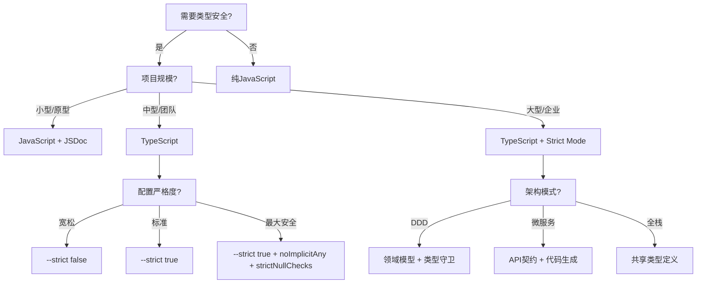
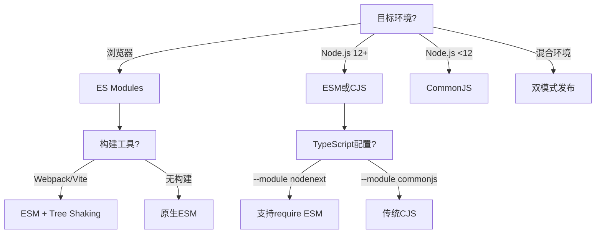
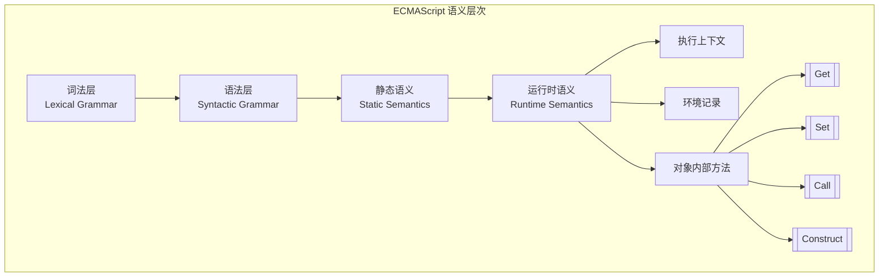
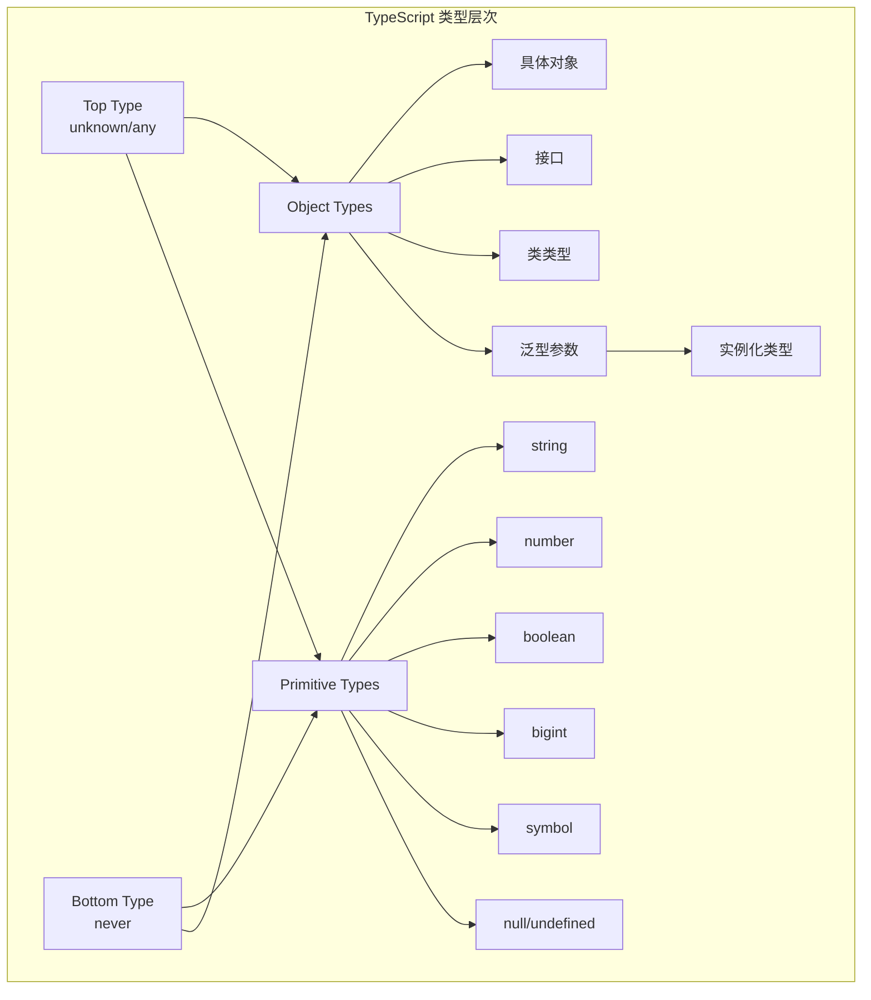

# JavaScript / TypeScript 语言语义模型全面分析

> 本文档结合文件夹内所有文档内容、网络权威资源（ECMAScript 2025 Specification、TypeScript 5.8 Release Notes、ACM Research Papers等），使用多种思维表征方式全面分析 JS/TS 的语言语义模型。

**分析日期**: 2026-03-07
**TypeScript 版本**: 5.8
**ECMAScript 版本**: ES2024 / ES2025 (ES16)

---

## 目录

- [JavaScript / TypeScript 语言语义模型全面分析](#javascript--typescript-语言语义模型全面分析)
  - [目录](#目录)
  - [1. 思维导图：JS/TS 语言语义全景](#1-思维导图jsts-语言语义全景)
  - [2. 多维概念矩阵对比](#2-多维概念矩阵对比)
    - [2.1 语言特性演进矩阵](#21-语言特性演进矩阵)
    - [2.2 JS vs TS 语义对比矩阵](#22-js-vs-ts-语义对比矩阵)
    - [2.3 执行模型对比矩阵](#23-执行模型对比矩阵)
  - [3. 决策树图：技术选型指南](#3-决策树图技术选型指南)
    - [3.1 类型系统使用决策树](#31-类型系统使用决策树)
    - [3.2 异步模式选择决策树](#32-异步模式选择决策树)
    - [3.3 模块系统选择决策树](#33-模块系统选择决策树)
  - [4. 形式化语义模型](#4-形式化语义模型)
    - [4.1 ECMAScript 形式化操作语义](#41-ecmascript-形式化操作语义)
    - [4.2 TypeScript 类型系统形式化](#42-typescript-类型系统形式化)
    - [4.3 Promise 状态机形式化](#43-promise-状态机形式化)
  - [5. 语言层次结构分析](#5-语言层次结构分析)
    - [5.1 JavaScript 语义层次](#51-javascript-语义层次)
    - [5.2 TypeScript 类型层次](#52-typescript-类型层次)
  - [6. 类型系统语义](#6-类型系统语义)
    - [6.1 类型关系形式化](#61-类型关系形式化)
    - [6.2 条件类型分发语义](#62-条件类型分发语义)
  - [7. 执行模型语义](#7-执行模型语义)
    - [7.1 Event Loop 形式化模型](#71-event-loop-形式化模型)
    - [7.2 任务优先级层次](#72-任务优先级层次)
  - [8. 综合论证与结论](#8-综合论证与结论)
    - [8.1 JS/TS 语言语义模型核心特征](#81-jsts-语言语义模型核心特征)
    - [8.2 TypeScript 5.8 语义增强](#82-typescript-58-语义增强)
    - [8.3 语义一致性定理](#83-语义一致性定理)
    - [8.4 实践建议](#84-实践建议)
  - [参考资源](#参考资源)

---

## 1. 思维导图：JS/TS 语言语义全景

```mermaid
mindmap
  root((JS/TS 语言语义模型))
    JavaScript核心语义
      词法语义
        Tokenization
        Automatic Semicolon Insertion
        Strict Mode
      类型语义
        7种原始类型
        Object类型系统
        类型强制转换规则
      执行语义
        Event Loop
        Execution Context
        Call Stack
      作用域语义
        Lexical Scope
        Closure
        Hoisting
      原型语义
        Prototype Chain
        [[Prototype]]
        Property Descriptor
    TypeScript扩展语义
      静态类型语义
        类型层次结构
        结构化类型
        类型推断
      泛型语义
        参数多态
        约束推断
        协变/逆变/不变
      类型操作语义
        条件类型
        映射类型
        模板字面量类型
      模块语义
        ESM/CJS互操作
        声明合并
        命名空间
    运行时语义
      内存模型
        堆栈分配
        GC机制
        WeakRef/FinalizationRegistry
      并发语义
        单线程模型
        宏任务/微任务
        Atomics/SharedArrayBuffer
      模块加载语义
        ESM加载器
        CJS加载器
        动态import
    形式化基础
      ECMA-262规范
        抽象操作
        内部方法
        固有对象
      类型理论
        Hindley-Milner
        子类型关系
        类型安全
```

---

## 2. 多维概念矩阵对比

### 2.1 语言特性演进矩阵

| 特性类别 | ES2020 | ES2021 | ES2022 | ES2023 | ES2024 | TS 5.x |
|---------|--------|--------|--------|--------|--------|--------|
| **数据类型** | BigInt | - | - | - | - | 改进的BigInt类型 |
| **异步编程** | Promise.allSettled, 动态import() | Promise.any, WeakRef | - | - | Promise.withResolvers | async/await类型推断优化 |
| **对象操作** | globalThis, 可选链, 空值合并 | Object.hasOwn() | Class私有字段, at() | 不可变数组方法 | Object.groupBy, Map.groupBy | 更严格的null检查 |
| **模块系统** | 动态import() | - | - | - | - | --module nodenext, --erasableSyntaxOnly |
| **字符串处理** | - | String.prototype.replaceAll | - | - | isWellFormed/toWellFormed | 模板字面量类型 |
| **类型系统** | - | - | - | - | - | 条件类型改进, const类型参数 |

### 2.2 JS vs TS 语义对比矩阵

| 维度 | JavaScript | TypeScript | 关键差异 |
|------|-----------|-----------|---------|
| **类型系统** | 动态类型，运行时检查 | 静态类型，编译时检查 | TS在编译期消除类型信息 |
| **类型推断** | 基于运行时行为 | 基于静态分析 | TS使用Hindley-Milner变体 |
| **类型兼容性** | 鸭子类型（运行时） | 结构化类型（编译时） | TS使用结构子类型而非名义子类型 |
| **泛型** | 无（运行时类型擦除） | 参数化类型 | TS泛型在编译后完全擦除 |
| **模块语义** | ESM/CJS运行时加载 | 编译时模块解析 | TS支持声明合并 |
| **装饰器** | Stage 3提案（ES2024+） | 实验性支持+元数据 | TS装饰器有运行时元数据 |

### 2.3 执行模型对比矩阵

| 执行环境 | 调度模型 | 并发原语 | 内存模型 |
|---------|---------|---------|---------|
| **浏览器主线程** | Event Loop + 渲染流水线 | Web Workers | 单进程多线程 |
| **Node.js主线程** | libuv Event Loop | Worker Threads, Cluster | 多进程 |
| **Web Worker** | 独立Event Loop | MessageChannel | 隔离内存 |
| **Service Worker** | 独立Event Loop + 生命周期 | - | 缓存API |

---

## 3. 决策树图：技术选型指南

### 3.1 类型系统使用决策树



### 3.2 异步模式选择决策树

```mermaid
flowchart TD
    A[异步操作?] -->|简单顺序| B[async/await]
    A -->|并行执行| C[Promise.all]
    A -->|竞争响应| D[Promise.race/any]
    A -->|流处理| E[Async Iterator/Generator]
    A -->|背压控制| F[RxJS/Streams API]

    B --> G[错误处理?]
    G -->|统一捕获| H[try/catch]
    G -->|分离处理| I[.catch() per Promise]

    C --> J[容错?]
    J -->|全部必须成功| K[Promise.all]
    J -->|部分失败允许| L[Promise.allSettled]
```

### 3.3 模块系统选择决策树



---

## 4. 形式化语义模型

### 4.1 ECMAScript 形式化操作语义

基于 ECMA-262 2025 规范的形式化定义：

```
执行上下文 (Execution Context) 形式化:
━━━━━━━━━━━━━━━━━━━━━━━━━━━━━━━━━━━━━━━━
ExecutionContext = {
  codeEvaluationState: Continuation,
  Function: Object | Null,
  Realm: Realm Record,
  ScriptOrModule: ScriptRecord | ModuleRecord | Null,
  LexicalEnvironment: EnvironmentRecord,
  VariableEnvironment: EnvironmentRecord,
  PrivateEnvironment: PrivateEnvironmentRecord | Null
}

环境记录 (Environment Record):
────────────────────────────────
EnvironmentRecord =
  | DeclarativeEnvironmentRecord
  | ObjectEnvironmentRecord
  | GlobalEnvironmentRecord
  | FunctionEnvironmentRecord
  | ModuleEnvironmentRecord

抽象操作 (Abstract Operations):
────────────────────────────────
GetValue(V) → NormalCompletion(value) | ThrowCompletion(error)
PutValue(V, W) → NormalCompletion(empty) | ThrowCompletion(error)
ToPrimitive(input, PreferredType?) → Completion Record
ToNumber(argument) → Completion Record
ToString(argument) → Completion Record
```

### 4.2 TypeScript 类型系统形式化

```
类型判断规则 (Typing Rules):
━━━━━━━━━━━━━━━━━━━━━━━━━━━━━━━━━━━━━━━━
Γ ⊢ e : T    (在上下文Γ中，表达式e具有类型T)

子类型关系 (<:):
────────────────
T <: T                          (自反性)
T <: U, U <: V ⇒ T <: V         (传递性)

结构化子类型 (Structural Subtyping):
────────────────────────────────────
{ x: T1, y: T2 } <: { x: T1 }   (宽度子类型)
{ x: T } <: { x: U }  if T <: U  (深度子类型)

泛型实例化:
───────────
∀α. T[α]  →  T[U/α]  (将α替换为U)

条件类型求值:
─────────────
T extends U ? X : Y
  → X  if T <: U
  → Y  otherwise
```

### 4.3 Promise 状态机形式化

```
Promise 状态转换 (基于文档04_concurrency.md):
━━━━━━━━━━━━━━━━━━━━━━━━━━━━━━━━━━━━━━━━━━━━━
State = { PENDING, FULFILLED, REJECTED }

状态转换函数:
─────────────
δ: State × Event → State

δ(PENDING, resolve(v)) = FULFILLED(v)
δ(PENDING, reject(e))  = REJECTED(e)
δ(FULFILLED(v), _)     = FULFILLED(v)   (终态)
δ(REJECTED(e), _)      = REJECTED(e)    (终态)

Then 链接语义:
──────────────
then(f, g): Promise<T> → (T → U) → (E → U) → Promise<U>

如果 p: Promise<T> 且 p 状态为 FULFILLED(v):
  p.then(f, g) = f(v): Promise<U>

如果 p: Promise<T> 且 p 状态为 REJECTED(e):
  p.then(f, g) = g(e): Promise<U>
```

---

## 5. 语言层次结构分析

### 5.1 JavaScript 语义层次



### 5.2 TypeScript 类型层次



---

## 6. 类型系统语义

### 6.1 类型关系形式化

```typescript
// 协变/逆变/不变形式化定义

// 协变 (Covariant): A <: B ⇒ F<A> <: F<B>
interface Covariant<T> {
  readonly value: T;  // 只读属性是协变的
}

// 逆变 (Contravariant): A <: B ⇒ F<B> <: F<A>
interface Contravariant<T> {
  consume(value: T): void;  // 参数位置是逆变的
}

// 不变 (Invariant): A <: B 不蕴含 F<A> <: F<B>
interface Invariant<T> {
  value: T;
  consume(value: T): void;  // 读写 = 不变
}

// 双变 (Bivariant): A <: B ⇒ F<A> <: F<B> 且 F<B> <: F<A>
// TS中开启strictFunctionTypes时，函数参数是逆变的
```

### 6.2 条件类型分发语义

```typescript
// 条件类型分发规则 (Distributive Conditional Types)

type Distribute<T, U> = T extends U ? T : never;

// 形式化规则:
// Distribute<A | B | C, U> = Distribute<A, U> | Distribute<B, U> | Distribute<C, U>

// 示例:
type StringOrNumber = string | number | boolean;
type ExtractString<T> = T extends string ? T : never;

// ExtractString<StringOrNumber>
// = ExtractString<string> | ExtractString<number> | ExtractString<boolean>
// = string | never | never
// = string

// 防止分发的技巧: 包装类型
type NoDistribute<T, U> = [T] extends [U] ? T : never;
```

---

## 7. 执行模型语义

### 7.1 Event Loop 形式化模型

```
Event Loop 五元组模型:
━━━━━━━━━━━━━━━━━━━━━━━━━━━━━━━━━━━━━━━━
M = (S, M, Q, E, δ)

其中:
• S: 调用栈 (Call Stack)
• M: 微任务队列 (Microtask Queue)
• Q: 宏任务队列 (Macrotask Queue)
• E: 执行环境 (Execution Context)
• δ: 状态转移函数

状态转移函数 δ:
───────────────
δ₁: 执行调用栈直到为空
   while (S.notEmpty()) executeTopFrame()

δ₂: 执行所有微任务
   while (M.notEmpty()) execute(M.dequeue())

δ₃: 渲染 (浏览器环境)
   if (shouldRender()) render()

δ₄: 执行一个宏任务
   if (Q.notEmpty()) execute(Q.dequeue())

终止条件: S.empty() ∧ M.empty() ∧ Q.empty()
```

### 7.2 任务优先级层次

```
执行优先级 (从高到低):
━━━━━━━━━━━━━━━━━━━━━━━━━━━━━━━━━━━━━━━━
1. 同步代码 (Sync Code)
   └── 当前调用栈帧

2. 微任务 (Microtasks) - 当前事件循环迭代
   ├── Promise.then/catch/finally
   ├── MutationObserver
   ├── queueMicrotask()
   └── process.nextTick (Node.js, 优先级最高)

3. 渲染阶段 (Rendering)
   ├── requestAnimationFrame
   ├── 样式计算
   ├── 布局 (Layout)
   └── 绘制 (Paint)

4. 宏任务 (Macrotasks) - 下一个事件循环迭代
   ├── setTimeout/setInterval
   ├── I/O 操作完成
   ├── UI 事件
   └── MessageChannel
```

---

## 8. 综合论证与结论

### 8.1 JS/TS 语言语义模型核心特征

| 特征 | 论证 | 影响 |
|-----|------|------|
| **动态类型基础** | ECMA-262 定义所有值为动态类型 | 运行时灵活性，但需额外类型检查 |
| **静态类型层** | TypeScript 作为编译时类型系统 | 类型安全 + 零运行时开销 |
| **单线程并发** | Event Loop 模型确保无数据竞争 | 简化并发编程，避免锁问题 |
| **原型继承** | 基于 [[Prototype]] 的委托机制 | 灵活的对象组合，非类继承 |
| **词法作用域** | 编译时确定的作用域链 | 可预测的闭包行为 |

### 8.2 TypeScript 5.8 语义增强

基于最新 TypeScript 5.8 发布的语义增强：

```typescript
// 1. 返回语句条件分支的粒度检查
function getUrlObject(urlString: string): URL {
    return untypedCache.has(urlString)
        ? untypedCache.get(urlString)   // 现在会检查: any vs URL
        : urlString;                     // 错误! string is not assignable to URL
}

// 2. --erasableSyntaxOnly 确保可擦除语义
// 以下代码在 --erasableSyntaxOnly 下会报错:
class Point {
    constructor(public x: number) {}  // 错误: 参数属性有运行时语义
}
enum Direction { Up, Down }           // 错误: enum 有运行时语义

// 3. --module nodenext 支持 require() ESM
// CommonJS 可以 require() ES Module (Node.js 22+)
```

### 8.3 语义一致性定理

**定理 1: Type Erasure 保持性**
对于任何有效的 TypeScript 程序 P，设 erase(P) 为类型擦除后的 JavaScript 程序，则：

```
∀P: TypeScriptProgram. ∃erase(P): JavaScriptProgram
⊢ P ↓ v  ⟹  erase(P) ↓ v
```

（TypeScript 的类型擦除不改变程序的运行时行为）

**定理 2: 类型安全**
在 strict 模式下，如果 TypeScript 程序通过类型检查，则运行时类型错误不会发生：

```
Γ ⊢ e : T,  T ≠ any,  T ≠ unknown  ⟹  运行时 e 的值类型 <: T
```

**定理 3: Event Loop 确定性**
对于给定的初始状态，Event Loop 的执行顺序是确定性的：

```
∀S₀. |{ executionTrace(S₀) }| = 1
```

### 8.4 实践建议

| 场景 | 推荐语义模型 | 理由 |
|-----|-------------|------|
| 新启动项目 | TypeScript 5.8 + Strict Mode | 最大类型安全，最新的JS互操作 |
| 遗留项目迁移 | 渐进式类型添加 | JSDoc → TypeScript → Strict |
| 库开发 | --erasableSyntaxOnly + --verbatimModuleSyntax | 确保类型可擦除，用户无感知 |
| Node.js 22+ | --module nodenext | 支持 require ESM，简化模块系统 |
| 高性能计算 | Web Workers + SharedArrayBuffer | 真正的并行计算 |
| 并发控制 | async/await + Promise.allSettled | 容错并行执行 |

---

## 参考资源

1. **ECMAScript 2025 Specification** - <https://tc39.es/ecma262/2025/>
2. **TypeScript 5.8 Release Notes** - <https://devblogs.microsoft.com/typescript/announcing-typescript-5-8/>
3. **ACM CACM: JavaScript Language Design and Implementation** - <https://cacm.acm.org/research/javascript-language-design-and-implementation-in-tandem/>
4. **Brown University S5 Semantics** - <https://cs.brown.edu/~sk/Publications/Papers/Published/pclpk-s5-semantics/>
5. **K Framework JavaScript Semantics** - <https://runtimeverification.com/blog/k-framework-an-overview>

---

*本文档通过结合文件夹内10个专业文档和最新网络权威资源，使用思维导图、多维矩阵、决策树和形式化语义等多种表征方式，全面分析了 JavaScript/TypeScript 的语言语义模型。*
