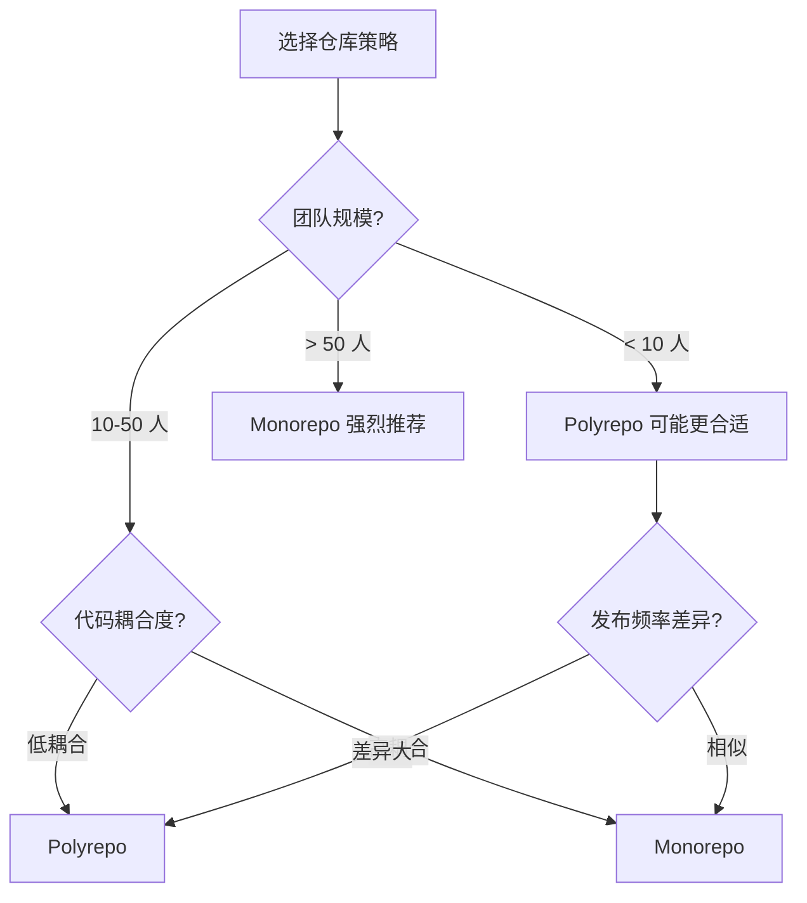

# Monorepo 架构设计与边界划分

> 分析日期: 2026-04-21
> 目标读者: 架构师、技术负责人、Monorepo 维护者
> 前置知识: 包管理、CI/CD、软件架构基础

---

## 目录

- [Monorepo 架构设计与边界划分](#monorepo-架构设计与边界划分)
  - [目录](#目录)
  - [1. Monorepo 与 Polyrepo 的抉择](#1-monorepo-与-polyrepo-的抉择)
    - [1.1 决策框架](#11-决策框架)
    - [1.2 对比矩阵](#12-对比矩阵)
  - [2. Monorepo 的分层架构模型](#2-monorepo-的分层架构模型)
    - [2.1 推荐的目录结构](#21-推荐的目录结构)
    - [2.2 分层依赖规则](#22-分层依赖规则)
  - [3. 边界划分原则](#3-边界划分原则)
    - [3.1 按业务领域划分（DDD）](#31-按业务领域划分ddd)
    - [3.2 按技术层划分](#32-按技术层划分)
    - [3.3 混合划分（推荐）](#33-混合划分推荐)
  - [4. 依赖关系管理](#4-依赖关系管理)
    - [4.1 依赖可视化](#41-依赖可视化)
    - [4.2 循环依赖检测](#42-循环依赖检测)
    - [4.3 版本管理策略](#43-版本管理策略)
  - [5. 变更影响分析](#5-变更影响分析)
    - [5.1 依赖图分析](#51-依赖图分析)
    - [5.2 CI 中的增量构建](#52-ci-中的增量构建)
  - [6. 发布策略](#6-发布策略)
    - [6.1 语义化版本自动化](#61-语义化版本自动化)
    - [6.2 金丝雀发布](#62-金丝雀发布)
  - [7. 规模化挑战与解决方案](#7-规模化挑战与解决方案)
    - [7.1 构建时间过长](#71-构建时间过长)
    - [7.2 权限管理](#72-权限管理)
    - [7.3 代码膨胀](#73-代码膨胀)
  - [8. 总结](#8-总结)
  - [参考资源](#参考资源)

---

## 1. Monorepo 与 Polyrepo 的抉择

### 1.1 决策框架



### 1.2 对比矩阵

| 维度 | Monorepo | Polyrepo |
|------|---------|---------|
| **代码共享** | ✅ 直接引用 | ⚠️ 需发布包 |
| **原子重构** | ✅ 一次提交修改多个包 | ❌ 需协调多个 PR |
| **依赖管理** | ✅ 统一版本 | ⚠️ 版本漂移风险 |
| **构建时间** | ❌ 随规模增长 | ✅ 独立构建 |
| **权限控制** | ⚠️ 需额外配置 | ✅ 天然隔离 |
| **CI 复杂度** | ⚠️ 需依赖图分析 | ✅ 简单直接 |
| **学习曲线** | ⚠️ 需了解工具链 | ✅ 标准 Git 流程 |

---

## 2. Monorepo 的分层架构模型

### 2.1 推荐的目录结构

```
monorepo/
├── apps/                    # 应用层（部署单元）
│   ├── web/                 # Web 应用
│   ├── mobile/              # 移动应用
│   ├── api/                 # API 服务
│   └── admin/               # 管理后台
│
├── packages/                # 共享包（库）
│   ├── ui/                  # UI 组件库
│   ├── utils/               # 工具函数
│   ├── types/               # 共享类型定义
│   ├── config/              # 共享配置（ESLint、TS、Tailwind）
│   └── api-client/          # API 客户端
│
├── tools/                   # 内部工具
│   ├── scripts/             # 构建/发布脚本
│   ├── generators/          # 代码生成器
│   └── plugins/             # 自定义构建插件
│
├── docs/                    # 文档
├── .github/                 # CI/CD 工作流
├── pnpm-workspace.yaml      # Workspace 定义
├── turbo.json               # 构建管道配置
└── package.json             # 根配置
```

### 2.2 分层依赖规则

```
依赖方向（只允许从上到下依赖）：

apps/          ← 可以依赖所有下层
  ↓
packages/      ← 可以依赖 tools/ 和同层其他包
  ↓
tools/         ← 只能依赖外部工具

禁止：
  - 下层依赖上层（tools/ 依赖 apps/）
  - 同层循环依赖（ui/ ↔ utils/）
```

---

## 3. 边界划分原则

### 3.1 按业务领域划分（DDD）

```
packages/
├── @acme/user-domain/       # 用户领域
│   ├── entities/            # 用户实体
│   ├── repositories/        # 用户仓储接口
│   └── usecases/            # 用户用例
│
├── @acme/order-domain/      # 订单领域
│   ├── entities/
│   ├── repositories/
│   └── usecases/
│
├── @acme/payment-domain/    # 支付领域
│   ├── entities/
│   ├── repositories/
│   └── usecases/
```

**边界规则**：

- 每个领域包是自包含的（不依赖其他领域包）
- 领域间通信通过明确的接口或事件
- 领域内部可以自由重构，不影响外部

### 3.2 按技术层划分

```
packages/
├── @acme/ui/                # 技术层：UI
├── @acme/api/               # 技术层：API 客户端
├── @acme/db/                # 技术层：数据库
└── @acme/logger/            # 技术层：日志
```

**适用场景**：

- 技术栈频繁变更（如 UI 框架从 React 迁移到 Vue）
- 多技术栈共存（Web 用 React，Mobile 用 React Native）

### 3.3 混合划分（推荐）

```
packages/
├── foundation/              # 最底层：无内部依赖
│   ├── @acme/types/
│   ├── @acme/utils/
│   └── @acme/config/
│
├── domains/                 # 业务领域层
│   ├── @acme/user-domain/
│   ├── @acme/order-domain/
│   └── @acme/payment-domain/
│
├── platforms/               # 平台适配层
│   ├── @acme/ui/           # UI 组件（依赖 domains）
│   ├── @acme/api-client/   # API 客户端
│   └── @acme/db-client/    # 数据库客户端
│
└── apps/                    # 应用层（组合所有下层）
    ├── @acme/web-app/
    └── @acme/mobile-app/
```

---

## 4. 依赖关系管理

### 4.1 依赖可视化

使用工具生成依赖图：

```bash
# Nx
nx graph

# Turborepo + pnpm
pnpm nx graph

# 通用工具
npx monorepo-graph
```

### 4.2 循环依赖检测

```bash
# 使用 madge 检测循环依赖
npx madge --circular packages/

# Nx 内置检测
nx lint --rule cyclic-deps
```

### 4.3 版本管理策略

**独立版本（Independent Versioning）**：

```
每个包有自己的版本号
├── @acme/ui@2.1.0
├── @acme/utils@1.5.2
└── @acme/api@3.0.0
```

- 适用：包间耦合度低、发布节奏不同
- 工具：Changesets, Lerna (独立模式)

**固定版本（Fixed Versioning）**：

```
所有包共享同一版本号
├── @acme/ui@1.0.0
├── @acme/utils@1.0.0
└── @acme/api@1.0.0
```

- 适用：包间高度耦合、同时发布
- 工具：Lerna (固定模式), Nx Release

**混合版本（推荐）**：

```
核心包固定版本，工具包独立版本
├── @acme/ui@2.0.0        (固定)
├── @acme/utils@2.0.0     (固定)
└── @acme/scripts@1.2.0   (独立)
```

---

## 5. 变更影响分析

### 5.1 依赖图分析

当修改一个包时，哪些包会受影响？

```typescript
// 伪代码：影响分析算法
function getAffectedPackages(
  changedPackages: string[],
  dependencyGraph: Map<string, string[]>
): string[] {
  const affected = new Set<string>();
  const queue = [...changedPackages];

  while (queue.length > 0) {
    const pkg = queue.shift()!;
    if (affected.has(pkg)) continue;
    affected.add(pkg);

    // 找到所有依赖此包的包
    for (const [dependent, dependencies] of dependencyGraph) {
      if (dependencies.includes(pkg) && !affected.has(dependent)) {
        queue.push(dependent);
      }
    }
  }

  return Array.from(affected);
}
```

### 5.2 CI 中的增量构建

```yaml
# .github/workflows/ci.yml
jobs:
  build:
    steps:
      - uses: actions/checkout@v4

      # 检测变更的包
      - name: Detect changed packages
        run: |
          # Nx: 自动检测 affected projects
          npx nx affected:build --base=origin/main

          # Turborepo: 使用 --filter
          pnpm turbo run build --filter=[origin/main...HEAD]
```

---

## 6. 发布策略

### 6.1 语义化版本自动化

```
变更类型 → 版本号变化：
  fix:     1.0.0 → 1.0.1  (patch)
  feat:    1.0.0 → 1.1.0  (minor)
  BREAKING: 1.0.0 → 2.0.0 (major)
```

**工具链**：

1. Changesets：开发者提交时添加 changeset 文件
2. CI 中聚合 changeset，自动生成版本号和 CHANGELOG
3. 自动发布到 npm

### 6.2 金丝雀发布

```bash
# 发布预览版本
pnpm publish --tag canary

# 用户安装预览版
npm install @acme/ui@canary
```

---

## 7. 规模化挑战与解决方案

### 7.1 构建时间过长

**问题**：Monorepo 规模增大后，全量构建时间呈指数增长。

**解决方案**：

| 方案 | 原理 | 效果 |
|------|------|------|
| **增量构建** | 只构建变更的包及其依赖 | 减少 70-90% 构建时间 |
| **远程缓存** | Turborepo/Nx 远程缓存 | CI 构建从 10min → 2min |
| **分布式构建** | Nx Cloud 分布式任务 | 并行执行，线性加速 |
| **代码分割** | 将超大包拆分为子包 | 减少单次构建范围 |

### 7.2 权限管理

**问题**：不同团队需要访问不同目录的权限。

**解决方案**：

```yaml
# CODEOWNERS 文件
/apps/web/           @frontend-team
/apps/api/           @backend-team
/packages/ui/        @design-system-team
/packages/payment/   @payment-team
```

### 7.3 代码膨胀

**问题**：历史代码堆积，Monorepo 体积过大。

**解决方案**：

1. 定期归档废弃包（移动到 `archive/` 目录）
2. Git LFS 管理大文件
3. shallow clone + sparse checkout 优化开发者体验

---

## 8. 总结

Monorepo 的成功关键在于**边界清晰**和**工具到位**：

1. **边界清晰**：按领域/技术层划分，避免循环依赖
2. **工具到位**：pnpm + Turborepo/Nx + Changesets 是 2026 年的黄金组合
3. **渐进采纳**：从小型 Monorepo 开始，逐步扩展
4. **文档驱动**：每个包必须有 README 和 API 文档
5. **自动化**：CI/CD 管道必须支持增量构建和自动发布

---

## 参考资源

- [Nx Monorepo](https://nx.dev/)
- [Turborepo](https://turbo.build/)
- [pnpm Workspaces](https://pnpm.io/workspaces)
- [Changesets](https://github.com/changesets/changesets)
- [Monorepo.tools](https://monorepo.tools/)
