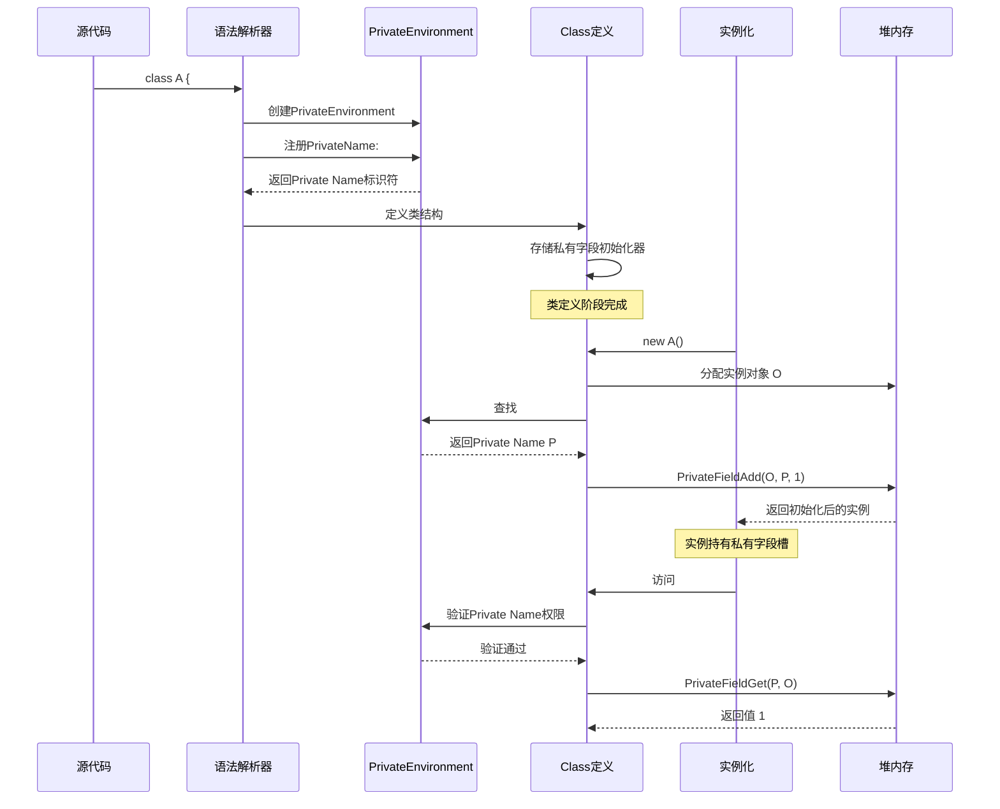
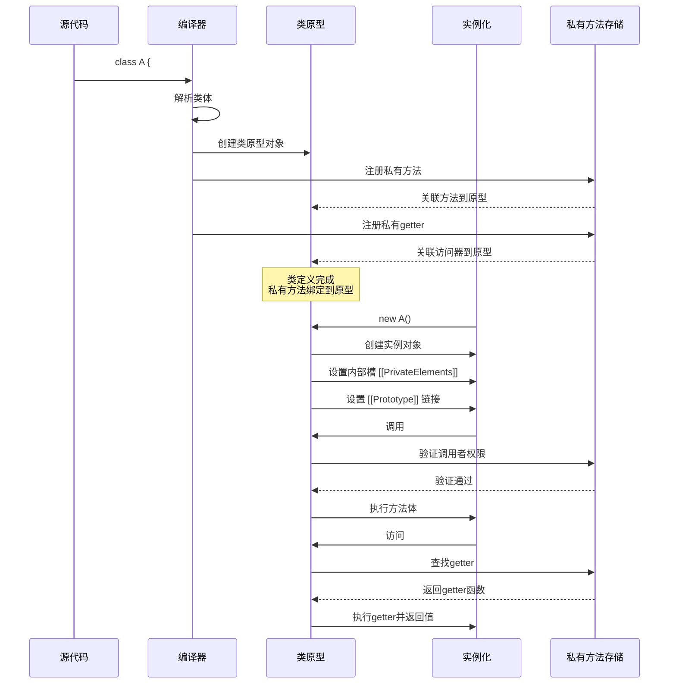
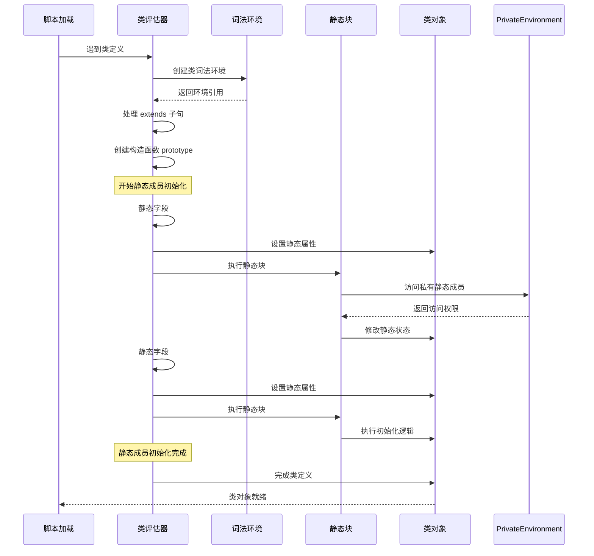
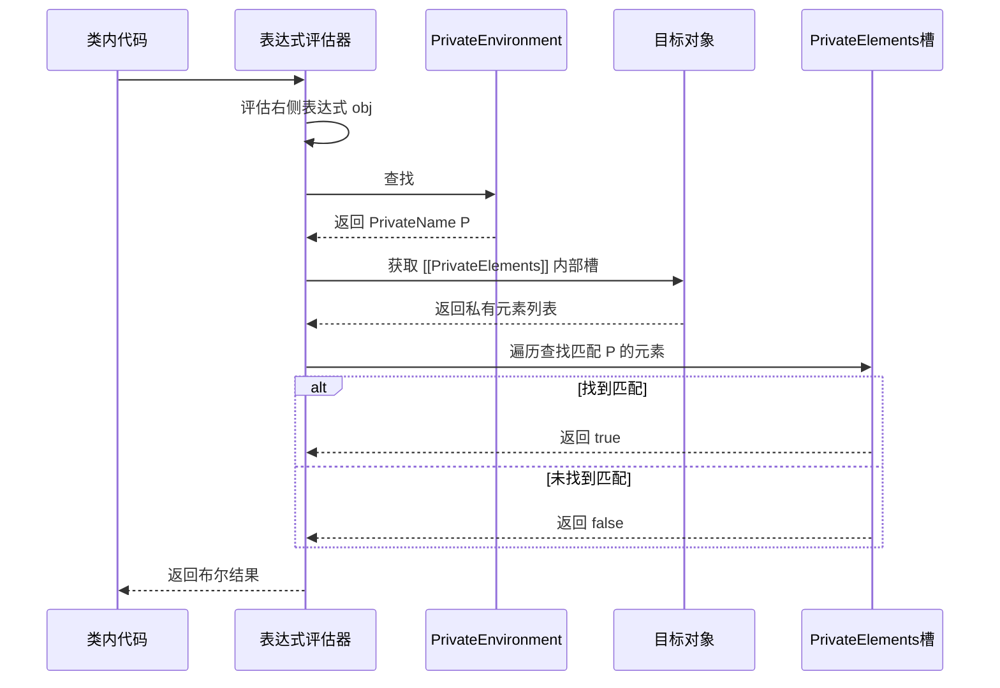
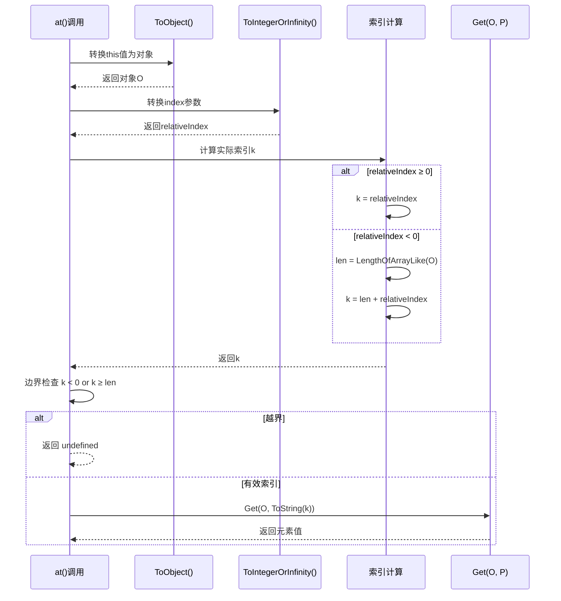
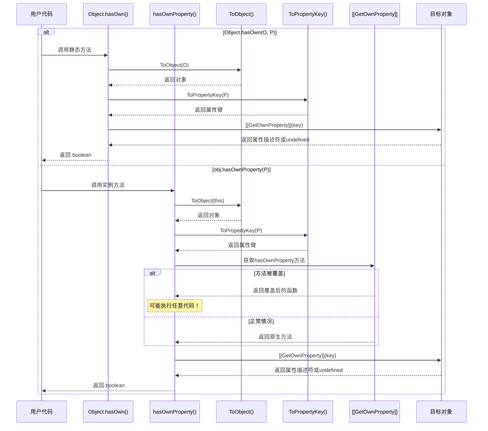
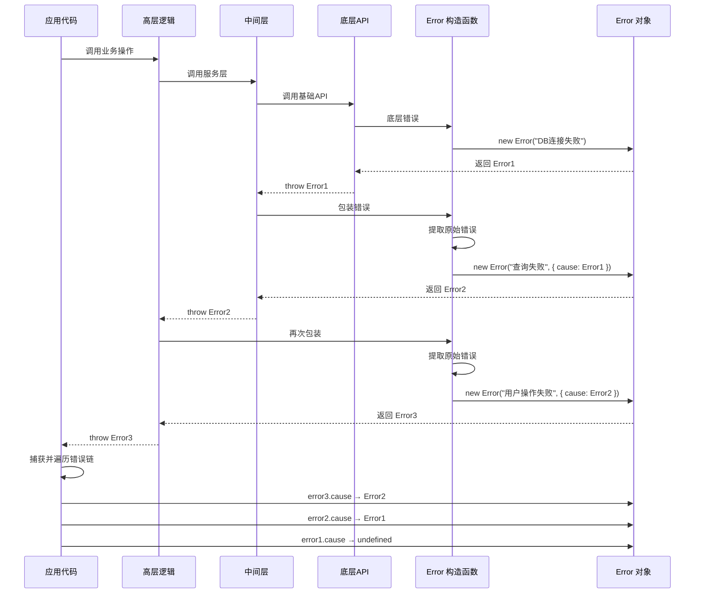

# ES2022 Class Fields & Private Methods 语义详解

> 本文档深入解析 ES2022 中类私有字段、私有方法、静态块等特性的语义模型，包含 ECMA-262 规范引用与执行时序分析。

---

## 目录

- [ES2022 Class Fields \& Private Methods 语义详解](#es2022-class-fields--private-methods-语义详解)
  - [目录](#目录)
  - [1. Class 私有字段 (#field) 的语义模型](#1-class-私有字段-field-的语义模型)
    - [1.1 概念定义](#11-概念定义)
    - [1.2 ECMA-262 规范引用](#12-ecma-262-规范引用)
    - [1.3 WeakMap 实现原理](#13-weakmap-实现原理)
    - [1.4 执行时序图](#14-执行时序图)
    - [1.5 代码示例](#15-代码示例)
  - [2. 私有方法与访问器的形式化定义](#2-私有方法与访问器的形式化定义)
    - [2.1 概念定义](#21-概念定义)
    - [2.2 ECMA-262 规范引用](#22-ecma-262-规范引用)
    - [2.3 执行时序图](#23-执行时序图)
    - [2.4 代码示例](#24-代码示例)
  - [3. 静态块 (Static Block) 的执行语义](#3-静态块-static-block-的执行语义)
    - [3.1 概念定义](#31-概念定义)
    - [3.2 ECMA-262 规范引用](#32-ecma-262-规范引用)
    - [3.3 执行时序图](#33-执行时序图)
    - [3.4 代码示例](#34-代码示例)
  - [4. in 操作符检测私有字段的语义](#4-in-操作符检测私有字段的语义)
    - [4.1 概念定义](#41-概念定义)
    - [4.2 ECMA-262 规范引用](#42-ecma-262-规范引用)
    - [4.3 执行时序图](#43-执行时序图)
    - [4.4 代码示例](#44-代码示例)
  - [5. at() 方法的索引语义（负索引处理）](#5-at-方法的索引语义负索引处理)
    - [5.1 概念定义](#51-概念定义)
    - [5.2 ECMA-262 规范引用](#52-ecma-262-规范引用)
    - [5.3 索引计算语义](#53-索引计算语义)
    - [5.4 执行时序图](#54-执行时序图)
    - [5.5 代码示例](#55-代码示例)
  - [6. Object.hasOwn() 与 hasOwnProperty 的语义差异](#6-objecthasown-与-hasownproperty-的语义差异)
    - [6.1 概念定义](#61-概念定义)
    - [6.2 ECMA-262 规范引用](#62-ecma-262-规范引用)
    - [6.3 语义对比](#63-语义对比)
    - [6.4 执行时序图](#64-执行时序图)
    - [6.5 代码示例](#65-代码示例)
  - [7. Error Cause 的错误链形式化](#7-error-cause-的错误链形式化)
    - [7.1 概念定义](#71-概念定义)
    - [7.2 ECMA-262 规范引用](#72-ecma-262-规范引用)
    - [7.3 错误链语义模型](#73-错误链语义模型)
    - [7.4 执行时序图](#74-执行时序图)
    - [7.5 代码示例](#75-代码示例)
  - [附录：ES2022 特性速查表](#附录es2022-特性速查表)
  - [参考资源](#参考资源)

## 1. Class 私有字段 (#field) 的语义模型

### 1.1 概念定义

私有字段（Private Fields）是 ES2022 引入的类成员封装机制，使用 `#` 前缀标识。与公共字段不同，私有字段具有以下核心特性：

- **词法作用域访问**：仅在类体内部可访问
- **不可枚举**：不会出现在 `Object.keys()` 或 `for...in` 循环中
- **不可删除**：无法通过 `delete` 操作符移除
- **唯一性保证**：子类无法覆盖父类的私有字段

### 1.2 ECMA-262 规范引用

**规范章节**: [ECMA-262 §16.2.10.3 PrivateEnvironment Records](https://tc39.es/ecma262/#sec-privateenvironment-records)

私有字段的语义基于 **PrivateEnvironment Record** 和 **Private Name** 抽象类型：

```
PrivateName :: # IdentifierName

PrivateFieldDefinition:
  # IdentifierName Initializer_opt

PrivateEnvironment Record:
  - [[OuterPrivateEnvironment]]: PrivateEnvironment | null
  - [[Names]]: List of Private Name
```

**关键抽象操作**：

- `PrivateFieldAdd(O, P, V)` - 向对象添加私有字段
- `PrivateFieldGet(P, O)` - 获取私有字段值
- `PrivateFieldSet(P, O, V)` - 设置私有字段值
- `PrivateNameBindingInstantiation` - 实例化私有名称绑定

### 1.3 WeakMap 实现原理

虽然规范使用抽象模型，但 JavaScript 引擎通常使用 **WeakMap 语义** 实现私有字段：

```javascript
// 概念性实现（非实际代码）
const _privateFields = new WeakMap();

class ConceptualImplementation {
  constructor() {
    // 每个实例关联一个私有字段存储
    _privateFields.set(this, {
      '#count': 0,
      '#name': 'default'
    });
  }

  getCount() {
    return _privateFields.get(this)['#count'];
  }
}
```

**WeakMap 语义特性**：

1. **键的弱引用**：实例被垃圾回收时，私有字段自动释放
2. **不可外部访问**：无法通过反射或代理获取 WeakMap 引用
3. **封装保证**：私有字段完全隐藏在词法闭包中

### 1.4 执行时序图



### 1.5 代码示例

```javascript
class Counter {
  // 私有字段声明
  #count = 0;
  #name;

  constructor(name) {
    this.#name = name; // 初始化私有字段
  }

  increment() {
    this.#count++;
    return this;
  }

  get count() {
    return this.#count;
  }

  get name() {
    return this.#name;
  }
}

const counter = new Counter('myCounter');
console.log(counter.count); // 0
console.log(counter.#count); // SyntaxError: Private field must be declared in an enclosing class

// 继承场景：子类无法访问父类私有字段
class AdvancedCounter extends Counter {
  reset() {
    // this.#count = 0; // SyntaxError: Private field '#count' must be declared in an enclosing class
    // 子类可以声明自己的#count
    this.#localCount = 0;
  }

  #localCount = 0;
}
```

---

## 2. 私有方法与访问器的形式化定义

### 2.1 概念定义

ES2022 扩展了私有成员的语义，支持私有方法和私有访问器（getter/setter）：

- **私有方法**：`#method() { ... }`
- **私有 getter**：`get #prop() { ... }`
- **私有 setter**：`set #prop(v) { ... }`

私有方法与私有字段共享相同的访问控制语义，但存储在类的原型而非实例上。

### 2.2 ECMA-262 规范引用

**规范章节**: [ECMA-262 §15.7.3 Class Definitions - Private Methods and Accessors](https://tc39.es/ecma262/#sec-runtime-semantics-classdefinitionevaluation)

```
MethodDefinition:
  # ClassElementName ( UniqueFormalParameters ) { FunctionBody }
  get # ClassElementName ( ) { FunctionBody }
  set # ClassElementName ( PropertySetParameterList ) { FunctionBody }

PrivateMethodOrAccessor:
  - [[Type]]: method | getter | setter
  - [[Brand]]: 类原型对象
  - [[Value]]: 函数对象
```

**关键差异**：

- 私有字段：存储在实例的 **PrivateElements** 槽中
- 私有方法：存储在类原型的 **PrivateMethods** 列表中

### 2.3 执行时序图



### 2.4 代码示例

```javascript
class SecureData {
  // 私有字段
  #data = new Map();
  #checksum = null;

  // 私有方法
  #validate(key, value) {
    if (typeof key !== 'string') {
      throw new TypeError('Key must be a string');
    }
    if (value == null) {
      throw new TypeError('Value cannot be null/undefined');
    }
    return true;
  }

  #updateChecksum() {
    const entries = Array.from(this.#data.entries());
    this.#checksum = entries.length;
  }

  // 私有访问器
  get #size() {
    return this.#data.size;
  }

  set #metadata(meta) {
    this.#data.set('__meta__', meta);
    this.#updateChecksum();
  }

  // 公共API
  set(key, value) {
    this.#validate(key, value);
    this.#data.set(key, value);
    this.#updateChecksum();
  }

  get(key) {
    return this.#data.get(key);
  }

  get entryCount() {
    return this.#size; // 通过私有getter访问
  }
}

const store = new SecureData();
store.set('user', { name: 'Alice' });
console.log(store.entryCount); // 1

// 以下均会报错：
// store.#validate('x', 1); // SyntaxError
// store.#size; // SyntaxError
```

---

## 3. 静态块 (Static Block) 的执行语义

### 3.1 概念定义

静态块（Static Initialization Blocks）允许在类定义中包含任意初始化代码，在类评估时执行一次：

```javascript
class A {
  static {
    // 静态初始化代码
  }
}
```

**核心特性**：

- 在类定义评估时执行（类似静态字段初始化器）
- 可以访问类内部的私有成员
- 支持多个静态块，按声明顺序执行
- 拥有独立的词法作用域

### 3.2 ECMA-262 规范引用

**规范章节**: [ECMA-262 §15.7.3 ClassElement - StaticBlock](https://tc39.es/ecma262/#prod-StaticBlock)

```
ClassElement:
  static { ClassStaticBlockBody }

ClassStaticBlockBody:
  ClassStaticBlockStatementList

运行时语义：
1. 创建新的词法环境
2. 将类作为该环境的绑定
3. 按顺序执行 ClassStaticBlockStatementList
```

**执行顺序规则**：

1. 类继承关系解析（`extends` 子句）
2. 类原型创建
3. 静态成员按声明顺序初始化（静态字段 + 静态块）
4. 构造函数定义

### 3.3 执行时序图



### 3.4 代码示例

```javascript
class DatabaseConnection {
  // 静态私有字段
  static #connections = new Map();
  static #instanceCount = 0;

  // 静态字段
  static defaultConfig = { timeout: 5000 };

  // 静态块 #1：初始化连接池
  static {
    console.log('静态块 #1: 初始化连接池');
    this.#initializePool();
  }

  // 静态块 #2：验证配置
  static {
    console.log('静态块 #2: 验证配置');
    if (!this.defaultConfig.timeout || this.defaultConfig.timeout < 1000) {
      throw new Error('Invalid timeout configuration');
    }
  }

  // 私有静态方法
  static #initializePool() {
    this.#instanceCount = 0;
    // 可以访问静态私有字段
  }

  constructor(name) {
    this.name = name;
    DatabaseConnection.#instanceCount++;
    DatabaseConnection.#connections.set(name, this);
  }

  static get connectionCount() {
    return this.#instanceCount;
  }
}

// 输出:
// 静态块 #1: 初始化连接池
// 静态块 #2: 验证配置

const conn1 = new DatabaseConnection('main');
console.log(DatabaseConnection.connectionCount); // 1

// 静态块的应用：枚举式静态初始化
class ColorPalette {
  static RED = '#FF0000';
  static GREEN = '#00FF00';
  static BLUE = '#0000FF';

  static colors = [];

  static {
    // 在静态块中构建派生数据结构
    this.colors = [
      { name: 'RED', value: this.RED },
      { name: 'GREEN', value: this.GREEN },
      { name: 'BLUE', value: this.BLUE }
    ];
  }
}

console.log(ColorPalette.colors);
// [{ name: 'RED', value: '#FF0000' }, ...]
```

---

## 4. in 操作符检测私有字段的语义

### 4.1 概念定义

ES2022 引入了 `in` 操作符检测私有字段的能力，允许检查对象是否包含特定的私有字段：

```javascript
#field in object
```

**语义**：

- 返回布尔值，指示对象是否包含指定的私有字段
- 仅在类体内部有效
- 可用于区分不同类的实例
- 支持 Brand Check 模式

### 4.2 ECMA-262 规范引用

**规范章节**: [ECMA-262 §13.10 Relational Operators - PrivateIdentifier in ShiftExpression](https://tc39.es/ecma262/#sec-relational-operators)

```
RelationalExpression:
  PrivateIdentifier in ShiftExpression

运行时语义：
1. 将 ShiftExpression 求值为对象 O
2. 获取 PrivateIdentifier 对应的 PrivateName P
3. 调用 PrivateFieldFind(O, P)
4. 若找到返回 true，否则返回 false
```

**关键抽象操作**：

```
PrivateFieldFind(O, P):
  1. 遍历 O.[[PrivateElements]]
  2. 若存在元素其 [[Key]] 等于 P，返回该元素
  3. 否则返回 empty
```

### 4.3 执行时序图



### 4.4 代码示例

```javascript
class Stack {
  #items = [];
  #maxSize;

  constructor(maxSize = 100) {
    this.#maxSize = maxSize;
  }

  push(item) {
    if (this.#items.length >= this.#maxSize) {
      throw new Error('Stack overflow');
    }
    this.#items.push(item);
  }

  // 使用 in 操作符进行 Brand Check
  static isStack(obj) {
    return #items in obj;
  }

  // 安全地操作另一个 Stack 实例
  merge(other) {
    // 验证 other 也是 Stack 实例（具有相同的私有字段）
    if (!(#items in other)) {
      throw new TypeError('Can only merge with another Stack');
    }

    // 可以访问 other 的私有字段
    // 因为它们是同一类的实例
    for (const item of other.#items) {
      this.push(item);
    }
  }

  get size() {
    return this.#items.length;
  }
}

class Queue {
  #items = [];

  enqueue(item) {
    this.#items.push(item);
  }
}

const stack = new Stack();
const queue = new Queue();

console.log(Stack.isStack(stack));  // true
console.log(Stack.isStack(queue));  // false
console.log(#items in stack);       // true（在类内部）

stack.push(1);
stack.push(2);

const stack2 = new Stack();
stack2.push(3);

stack.merge(stack2);
console.log(stack.size); // 3

// stack.merge(queue); // TypeError: Can only merge with another Stack

// 应用于混入模式 (Mixin Pattern)
const WithLogging = (Base) => class extends Base {
  #log = [];

  log(action) {
    this.#log.push({ action, time: Date.now() });
  }

  getLogs() {
    return [...this.#log];
  }

  static hasLogging(obj) {
    return #log in obj;
  }
};

class Service extends WithLogging(Object) {
  execute() {
    this.log('execute');
    // 执行操作
  }
}

const svc = new Service();
console.log(Service.hasLogging(svc)); // true
```

---

## 5. at() 方法的索引语义（负索引处理）

### 5.1 概念定义

`at()` 方法为字符串、数组和 TypedArray 提供了支持负索引的统一访问方式：

```javascript
arr.at(index)
str.at(index)
```

**语义特性**：

- 正索引：从头部开始（0-based，与 `[]` 相同）
- 负索引：从尾部开始（-1 表示最后一个元素）
- 越界访问：返回 `undefined`（数组）或空字符串（字符串）

### 5.2 ECMA-262 规范引用

**规范章节**: [ECMA-262 §23.1.3.1 Array.prototype.at](https://tc39.es/ecma262/#sec-array.prototype.at)

```
Array.prototype.at ( index )

步骤：
1. 令 O 为 ToObject(this value)
2. 令 len 为 LengthOfArrayLike(O)
3. 令 relativeIndex 为 ToIntegerOrInfinity(index)
4. 若 relativeIndex ≥ 0:
   a. 令 k 为 relativeIndex
5. 否则：
   a. 令 k 为 len + relativeIndex
6. 若 k < 0 或 k ≥ len，返回 undefined
7. 返回 Get(O, ToString(k))
```

### 5.3 索引计算语义

| 索引值 | 数组长度 | 计算后位置 | 结果 |
|--------|----------|------------|------|
| 0 | 5 | 0 | 第1个元素 |
| 2 | 5 | 2 | 第3个元素 |
| -1 | 5 | 5 + (-1) = 4 | 最后1个元素 |
| -2 | 5 | 5 + (-2) = 3 | 倒数第2个元素 |
| 5 | 5 | 5 | undefined（越界） |
| -6 | 5 | 5 + (-6) = -1 | undefined（越界） |

### 5.4 执行时序图



### 5.5 代码示例

```javascript
// 数组的 at() 方法
const arr = ['a', 'b', 'c', 'd', 'e'];

// 正索引访问
console.log(arr.at(0));   // 'a'（等同于 arr[0]）
console.log(arr.at(2));   // 'c'（等同于 arr[2]）

// 负索引访问
console.log(arr.at(-1));  // 'e'（最后一个）
console.log(arr.at(-2));  // 'd'（倒数第二个）

// 传统方式 vs at()
console.log(arr[arr.length - 1]);  // 'e'
console.log(arr.at(-1));            // 'e'（更简洁）

// 越界处理
console.log(arr.at(10));   // undefined
console.log(arr.at(-10));  // undefined

// 字符串的 at() 方法
const str = 'Hello';
console.log(str.at(0));    // 'H'
console.log(str.at(-1));   // 'o'
console.log(str.at(-2));   // 'l'

// TypedArray 的 at() 方法
const uint8 = new Uint8Array([10, 20, 30, 40, 50]);
console.log(uint8.at(-1));  // 50
console.log(uint8.at(-3));  // 30

// 实际应用：获取文件扩展名
function getExtension(filename) {
  const parts = filename.split('.');
  return parts.at(-1); // 安全获取最后一个部分
}

console.log(getExtension('document.pdf'));      // 'pdf'
console.log(getExtension('archive.tar.gz'));    // 'gz'
console.log(getExtension('Makefile'));          // 'Makefile'（无扩展名）

// 实际应用：获取路径最后一部分
function getLastPathSegment(path) {
  const segments = path.split('/').filter(Boolean);
  return segments.at(-1);
}

console.log(getLastPathSegment('/home/user/docs/file.txt')); // 'file.txt'
console.log(getLastPathSegment('/')); // undefined

// 与 slice 的区别
const nums = [1, 2, 3, 4, 5];
console.log(nums.at(-2));       // 4（单个元素）
console.log(nums.slice(-2));    // [4, 5]（数组）
console.log(nums.slice(-2)[0]); // 4（需要额外索引）
```

---

## 6. Object.hasOwn() 与 hasOwnProperty 的语义差异

### 6.1 概念定义

`Object.hasOwn()` 是 `Object.prototype.hasOwnProperty()` 的静态方法替代：

```javascript
Object.hasOwn(obj, prop)
obj.hasOwnProperty(prop)
```

**核心差异**：

- `hasOwnProperty` 可以被对象覆盖或继承链拦截
- `Object.hasOwn()` 是静态方法，不受对象状态影响
- 两者在功能上等价，但 `Object.hasOwn()` 更可靠

### 6.2 ECMA-262 规范引用

**规范章节**: [ECMA-262 §20.1.2.2 Object.hasOwn](https://tc39.es/ecma262/#sec-object.hasown)

```
Object.hasOwn ( O, P )

步骤：
1. 令 obj 为 ToObject(O)
2. 令 key 为 ToPropertyKey(P)
3. 返回 HasOwnProperty(obj, key)
```

**HasOwnProperty 抽象操作**：

```
HasOwnProperty(O, P):
1. 令 desc 为 O.[[GetOwnProperty]](P)
2. 若 desc 是 undefined，返回 false
3. 返回 true
```

### 6.3 语义对比

| 特性 | Object.hasOwn() | hasOwnProperty() |
|------|-----------------|------------------|
| 调用方式 | 静态方法 | 实例方法 |
| null/undefined 处理 | 抛出 TypeError | 抛出 TypeError |
| 对象覆盖风险 | 无 | 可能被覆盖 |
| 继承链影响 | 无 | 可能被删除 |
| Symbol 属性 | 支持 | 支持 |
| 规范版本 | ES2022 | ES3 |

### 6.4 执行时序图



### 6.5 代码示例

```javascript
// 基本用法对比
const obj = { foo: 1 };

console.log(Object.hasOwn(obj, 'foo'));      // true
console.log(obj.hasOwnProperty('foo'));      // true

console.log(Object.hasOwn(obj, 'toString')); // false（继承自原型）
console.log(obj.hasOwnProperty('toString')); // false

// hasOwnProperty 的安全隐患：被覆盖
const malicious = {
  hasOwnProperty() {
    console.log('恶意代码执行！');
    return false;
  },
  foo: 1
};

// 使用 hasOwnProperty 有风险
console.log(malicious.hasOwnProperty('foo')); // 输出恶意信息，返回 false

// 使用 Object.hasOwn() 安全
console.log(Object.hasOwn(malicious, 'foo')); // true（不会调用被覆盖的方法）

// 使用 Object.create(null) 创建的对象
const dict = Object.create(null);
dict.foo = 1;

// 没有原型链，hasOwnProperty 不存在
// dict.hasOwnProperty('foo'); // TypeError: dict.hasOwnProperty is not a function

// Object.hasOwn() 可以正常工作
console.log(Object.hasOwn(dict, 'foo')); // true

// null 原型对象的实际应用
const frequencyMap = Object.create(null);
const words = ['apple', 'banana', 'apple', 'cherry', 'banana', 'apple'];

for (const word of words) {
  if (Object.hasOwn(frequencyMap, word)) {
    frequencyMap[word]++;
  } else {
    frequencyMap[word] = 1;
  }
}

console.log(frequencyMap); // { apple: 3, banana: 2, cherry: 1 }

// 检测属性包括 Symbol
const sym = Symbol('private');
const objWithSymbol = {
  [sym]: 'secret',
  public: 'visible'
};

console.log(Object.hasOwn(objWithSymbol, sym));      // true
console.log(Object.hasOwn(objWithSymbol, 'public')); // true

// for...in 循环中的安全检查
function getOwnProps(obj) {
  const props = [];
  for (const key in obj) {
    if (Object.hasOwn(obj, key)) {
      props.push(key);
    }
  }
  return props;
}

const parent = { inherited: 1 };
const child = Object.create(parent);
child.own = 2;

console.log(getOwnProps(child)); // ['own']
console.log(Object.keys(child)); // ['own']（与Object.keys等价）
```

---

## 7. Error Cause 的错误链形式化

### 7.1 概念定义

ES2022 为 Error 构造函数增加了 `cause` 选项，允许在抛出错误时保留原始错误信息：

```javascript
new Error(message, { cause: originalError })
```

**核心特性**：

- 通过 `error.cause` 访问原始错误
- 构建错误链（Error Chain）
- 支持所有 Error 子类
- 错误堆栈包含完整上下文

### 7.2 ECMA-262 规范引用

**规范章节**: [ECMA-262 §20.5.1.1 Error Constructor](https://tc39.es/ecma262/#sec-error-constructor)

```
Error ( message [ , options ] )

步骤：
1. 令 O 为 OrdinaryCreateFromConstructor(...)
2. 若 message 不是 undefined:
   a. 设置 O.[[ErrorData]]
3. 若 options 是 Object 且 HasProperty(options, "cause"):
   a. 令 cause 为 Get(options, "cause")
   b. 执行 CreateNonEnumerableDataProperty(O, "cause", cause)
4. 返回 O
```

### 7.3 错误链语义模型

```
Error Chain:
  - Error (Layer N)
    - message: 当前层错误描述
    - cause: → Error (Layer N-1)
      - message: 下层错误描述
      - cause: → Error (Layer N-2)
        - ...
```

### 7.4 执行时序图



### 7.5 代码示例

```javascript
// 基础用法：保留原始错误
function readConfigFile(path) {
  try {
    return JSON.parse(fs.readFileSync(path, 'utf8'));
  } catch (cause) {
    throw new Error(`无法读取配置文件: ${path}`, { cause });
  }
}

try {
  const config = readConfigFile('./config.json');
} catch (error) {
  console.log(error.message); // 无法读取配置文件: ./config.json
  console.log(error.cause);   // 原始错误（文件不存在或JSON解析错误）
}

// 多层错误链
class DataService {
  async fetchUser(id) {
    try {
      const response = await fetch(`/api/users/${id}`);
      if (!response.ok) {
        throw new Error(`HTTP ${response.status}`);
      }
      return await response.json();
    } catch (cause) {
      throw new Error(`获取用户数据失败 (id=${id})`, { cause });
    }
  }
}

class UserController {
  constructor(service) {
    this.service = service;
  }

  async getUserProfile(id) {
    try {
      const user = await this.service.fetchUser(id);
      return this.enrichProfile(user);
    } catch (cause) {
      throw new Error(`加载用户档案失败`, { cause });
    }
  }

  enrichProfile(user) {
    // 处理数据
    return user;
  }
}

// 遍历错误链的工具函数
function walkErrorChain(error, handler) {
  let current = error;
  let depth = 0;

  while (current) {
    handler(current, depth);
    current = current.cause;
    depth++;
  }
}

function formatErrorChain(error) {
  const lines = [];
  walkErrorChain(error, (err, depth) => {
    const indent = '  '.repeat(depth);
    lines.push(`${indent}[${depth}] ${err.name}: ${err.message}`);
  });
  return lines.join('\n');
}

// 使用示例
async function demo() {
  const controller = new UserController(new DataService());

  try {
    await controller.getUserProfile(999);
  } catch (error) {
    console.log(formatErrorChain(error));
    // 输出:
    // [0] Error: 加载用户档案失败
    //   [1] Error: 获取用户数据失败 (id=999)
    //     [2] Error: HTTP 404
  }
}

// 特定错误类型与 cause
class NetworkError extends Error {
  constructor(message, { url, cause }) {
    super(message, { cause });
    this.url = url;
  }
}

class ValidationError extends Error {
  constructor(message, { field, cause }) {
    super(message, { cause });
    this.field = field;
  }
}

async function robustFetch(url) {
  try {
    return await fetch(url);
  } catch (cause) {
    throw new NetworkError(`请求失败: ${url}`, { url, cause });
  }
}

// 错误链中的类型检查
function findCauseByType(error, ErrorClass) {
  let current = error;
  while (current) {
    if (current instanceof ErrorClass) {
      return current;
    }
    current = current.cause;
  }
  return null;
}

// AggregateError 与 cause 结合
async function fetchMultiple(urls) {
  const errors = [];
  const results = [];

  for (const url of urls) {
    try {
      results.push(await robustFetch(url));
    } catch (error) {
      errors.push(error);
    }
  }

  if (errors.length > 0) {
    throw new AggregateError(
      errors,
      `${errors.length}/${urls.length} 个请求失败`,
      { cause: { attempted: urls.length, failed: errors.length } }
    );
  }

  return results;
}

// 在测试中验证错误链
function assertErrorChain(error, expectedMessages) {
  const messages = [];
  walkErrorChain(error, (err) => messages.push(err.message));

  if (messages.length !== expectedMessages.length) {
    throw new Error(`错误链长度不匹配: ${messages.length} vs ${expectedMessages.length}`);
  }

  for (let i = 0; i < messages.length; i++) {
    if (!messages[i].includes(expectedMessages[i])) {
      throw new Error(`第${i}层错误不匹配: "${messages[i]}" 不包含 "${expectedMessages[i]}"`);
    }
  }

  return true;
}

// 示例测试
try {
  throw new Error('深层错误', {
    cause: new Error('中层错误', {
      cause: new Error('表层错误')
    })
  });
} catch (e) {
  assertErrorChain(e, ['深层错误', '中层错误', '表层错误']);
  console.log('错误链验证通过！');
}
```

---

## 附录：ES2022 特性速查表

| 特性 | 语法 | 主要用途 |
|------|------|----------|
| 私有字段 | `#field` | 实例数据封装 |
| 私有方法 | `#method()` | 内部逻辑封装 |
| 私有访问器 | `get #prop()` | 受控属性访问 |
| 静态块 | `static { ... }` | 复杂静态初始化 |
| in 检测私有字段 | `#field in obj` | Brand Check |
| at() 方法 | `arr.at(-1)` | 负索引访问 |
| Object.hasOwn() | `Object.hasOwn(obj, prop)` | 安全的属性检测 |
| Error Cause | `new Error(msg, { cause })` | 错误链构建 |

---

## 参考资源

1. [ECMA-262 Specification](https://tc39.es/ecma262/)
2. [ES2022 Feature Proposals](https://github.com/tc39/proposals/blob/main/finished-proposals.md)
3. [MDN Web Docs - ES2022](https://developer.mozilla.org/en-US/docs/Web/JavaScript/New_in_JavaScript/ECMAScript_2022)
