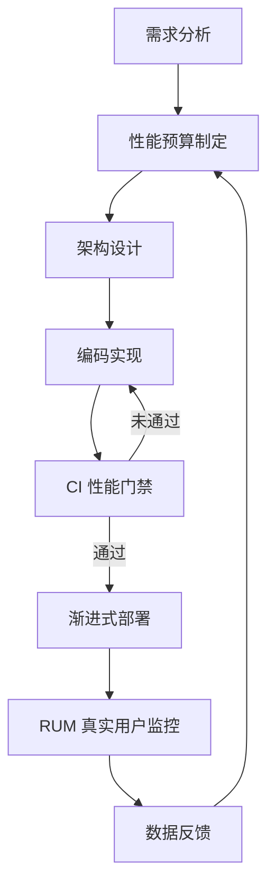
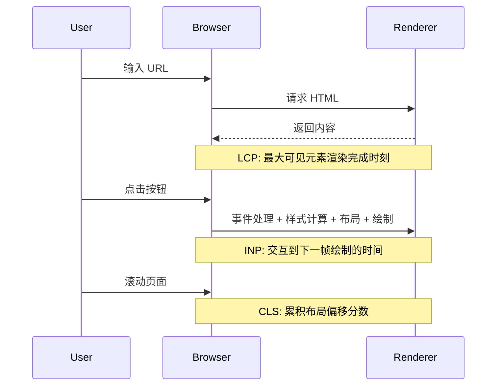
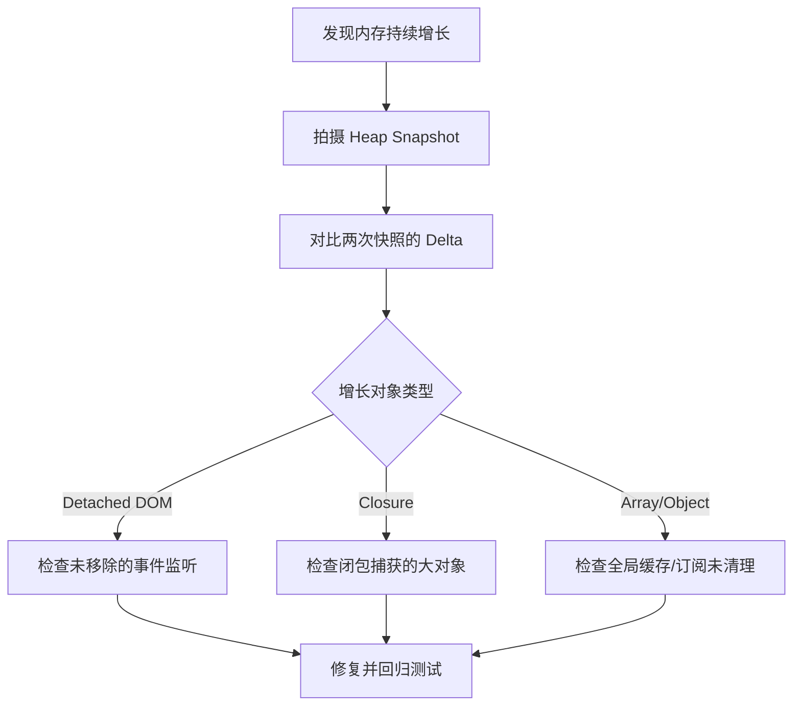
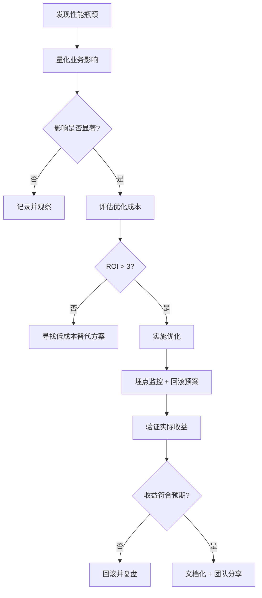

# 性能工程方法论

> 文档级别: 旗舰级 (Flagship)
> 目标读者: 高级前端/全栈工程师、性能工程师、技术架构师
> 关联实践: [`jsts-code-lab/08-performance/`](../jsts-code-lab/08-performance/) — 从理论到落地的完整闭环

---

## 1. 性能工程的定义：超越"优化"的系统工程

传统观念将"性能"视为开发流程末端的调优环节——功能完成后再压缩图片、再分包加载、再降低主线程阻塞。这种**事后补救式**思维在当代 Web 应用中已严重过时。

**性能工程 (Performance Engineering)** 是一套贯穿软件全生命周期的系统工程，其核心特征可概括为三个"可"：

| 维度 | 传统性能优化 | 现代性能工程 |
|------|-------------|-------------|
| 度量 (Measurable) | 凭感觉、看控制台 | 建立量化指标体系，每个改动可计算 ROI |
| 预算 (Budgetable) | 无约束地堆砌资源 | 像管理财务预算一样管理字节数和毫秒数 |
| 回退 (Reversible) | 优化代码与业务逻辑纠缠 | 优化策略可开关、可降级、可 A/B 测试 |

> **关键洞察**：性能工程不是让应用"更快"，而是在**业务约束、用户体验、维护成本**三者之间寻找最优均衡点。一个未经度量的"优化"，本质上是一次不可控的技术债务注入。



上图展示了性能工程的闭环：预算指导设计，门禁拦截回归，监控反哺预算修正。这与 [`jsts-code-lab/08-performance/`](../jsts-code-lab/08-performance/) 中涵盖的优化模式、构建优化、内存管理、网络优化、渲染优化五大模块形成**理论→实践**的完整闭环。

---

## 2. 性能预算模型 (Performance Budget)

### 2.1 预算的设定方法论

性能预算不是技术团队的"自嗨"，而是基于外部基准与内部目标的严格约束。设定预算需经过三层校准：

**第一层：竞品对标 (Competitive Benchmarking)**

使用 [WebPageTest](https://www.webpagetest.org/) 对直接竞品进行 3G/4G 慢速网络下的测试，取第 75 百分位 (p75) 作为基准线。例如：

| 指标 | 竞品 A | 竞品 B | 竞品 C | 建议预算 |
|------|--------|--------|--------|----------|
| LCP | 2.1s | 2.8s | 1.9s | **≤ 2.0s** |
| TTI | 4.5s | 5.2s | 3.8s | **≤ 4.0s** |
| JS 体积 (gzip) | 180KB | 250KB | 160KB | **≤ 170KB** |

**第二层：用户研究 (User Research)**

Google 的研究表明，页面加载时间从 1s 增加到 3s，跳出率上升 32%；从 1s 增加到 5s，跳出率上升 90%。将业务转化率数据与加载时间做回归分析，可以算出**每个毫秒的商业价值**。例如，某电商平台发现 LCP 每降低 100ms，转化率提升 0.5%，即可将预算与收入指标直接挂钩。这种量化关联是争取技术团队资源投入最有力的论据。

**第三层：技术可行性评估**

预算必须考虑现有架构的物理极限。一个依赖 30 个第三方追踪脚本的首页，不可能设定 100KB 的 JS 预算。此时需要先做**预算分配谈判**：业务方削减脚本数量，技术方承诺核心路径优化。

预算设定应遵循"先紧后松"原则。初始阶段设定略激进的目标（如首包 150KB），团队在 2-3 个迭代周期内适应后，再根据实际情况微调。过于宽松的预算（如 500KB）将失去约束力，而过于激进的预算（如 50KB）可能导致团队频繁绕过规则，同样失效。

### 2.2 预算分配矩阵

总预算确定后，需按资源类型拆解。以下是一个典型中大型 SPA 的预算分配（首屏）：

| 资源类型 | 预算 (gzip) | 占比 | 监控工具 | 超限策略 |
|---------|------------|------|---------|---------|
| JavaScript | 180 KB | 45% | `bundlesize` / `size-limit` | 代码分割、动态导入、Tree-shaking |
| CSS | 35 KB | 9% | `bundlesize` | 关键 CSS 内联、未使用样式剔除 |
| 图片 | 200 KB | 50% | `lighthouse` | WebP/AVIF 自适应、响应式图片 |
| 字体 | 40 KB | 10% | `lighthouse` | `font-display: swap`、子集化 |
| 第三方脚本 | 50 KB | 12% | 自定义审计 | 延迟加载、预连接 DNS |

> 注：占比总和可超过 100%，因为预算是并行约束而非互斥分配。例如 JS + CSS + 图片 + 字体 + 第三方 = 505 KB 总网络传输预算。

### 2.3 CI 中的预算监控

预算一旦制定，必须进入持续集成流水线作为**硬门禁**。以下是推荐的 CI 配置策略：

```yaml
# .github/workflows/performance-budget.yml
- name: Bundle Size Check
  run: npx bundlesize

- name: Lighthouse CI
  run: |
    npm install -g @lhci/cli
    lhci autorun --config=lighthouserc.js
```

`lighthouserc.js` 示例：

```javascript
module.exports = {
  ci: {
    assert: {
      preset: 'lighthouse:recommended',
      assertions: {
        'categories:performance': ['error', { minScore: 0.9 }],
        'resource-summary:script:size': ['error', { maxNumericValue: 180000 }],
        'largest-contentful-paint': ['error', { maxNumericValue: 2500 }]
      }
    }
  }
};
```

当 PR 引入超出预算的资源时，CI 直接失败，迫使开发者在合并前做出权衡：**是削减其他资源，还是提升预算并经过审批？**

---

## 3. Core Web Vitals 深度解析

Core Web Vitals 是 Google 提出的以用户为中心的性能指标体系，2024 年 INP (Interaction to Next Paint) 正式取代 FID 成为三大核心指标之一。理解其测量原理是进行针对性优化的前提。

### 3.1 指标测量原理



**LCP (Largest Contentful Paint)**

- **测量对象**：视口内最大图像或文本块的渲染时间
- **触发元素**：``、`<video>` 海报、CSS `url()` 背景图、块级文本节点
- **关键路径**：TTFB → 资源加载 → 解码 → 绘制
- **优化杠杆**：
  - 服务端渲染 (SSR) 减少 TTFB
  - `<link rel="preload">` 预加载 LCP 图像
  - 图片 CDN + 自适应格式 (AVIF/WebP)
  - 避免在 LCP 元素上方插入动态内容

**INP (Interaction to Next Paint)**

- **测量对象**：用户交互（点击、触摸、键盘）到浏览器绘制下一帧的完整耗时
- **包含阶段**：事件回调执行 + 样式重新计算 (Recalculate Style) + 布局 (Layout) + 绘制 (Paint) + 合成 (Composite)
- **致命陷阱**：主线程被长任务 (>50ms) 阻塞，导致交互排队等待
- **与 FID 的区别**：FID 仅测量"首次输入延迟"（事件被接收的时间），而 INP 测量的是"从交互到下一帧渲染完成的完整周期"。INP 更能反映用户的真实感知——即使事件回调很快，如果后续样式计算和布局重排耗时过长，INP 依然会很差。
- **优化杠杆**：
  - 将长任务拆分为 `< 50ms` 的微任务（`scheduler.yield()`）
  - 使用 Web Worker  offload 复杂计算
  - 虚拟列表减少 DOM 规模
  - 防抖/节流高频事件处理器
  - 减少 DOM 深度，降低布局计算复杂度

**CLS (Cumulative Layout Shift)**

- **测量对象**：整个页面生命周期中，可见元素位置偏移的累积分数
- **计算公式**：`CLS = Σ (影响比例 × 距离比例)`
- **常见元凶**：
  - 无尺寸预留的图片/广告位 (`width`/`height` 未设置)
  - 异步加载字体导致的 FOIT/FOUT
  - 动态注入的第三方脚本（聊天 widget、Cookie banner）
- **优化杠杆**：
  - 所有媒体元素显式声明 `aspect-ratio` 或 `width` + `height`
  - 为动态内容预留占位空间 (`min-height`)
  - 使用 `font-display: optional` 或预加载字体

### 3.2 优化策略矩阵

| 指标 | 预算阈值 | 主要瓶颈 | 快速修复 | 根治方案 |
|------|---------|---------|---------|---------|
| LCP | < 2.5s | 图片加载、服务端延迟 | preload + 压缩 | SSR/Edge Rendering + 图片 CDN |
| INP | < 200ms | 主线程长任务、布局抖动 | 防抖/节流 | 架构重构 (Worker、虚拟列表) |
| CLS | < 0.1 | 无尺寸媒体、动态插入 | 固定占位尺寸 | 设计系统级布局约束规范 |

---

## 4. Profiling 方法论

没有 Profiling 的性能优化是盲目的。本节覆盖浏览器端与 Node.js 端的系统级分析方法。

### 4.1 Chrome DevTools Performance 面板解读

Performance 面板是前端性能分析的首要工具。一次完整的录制应包含：页面加载、用户交互、空闲状态。


**关键观察区域**：

1. **Frames 轨道**：绿色表示 60fps，红色表示掉帧。红色区块需展开 Main 轨道定位长任务。
2. **Main 轨道 (火焰图)**：自上而下表示调用栈，宽度表示耗时。寻找**宽而深的塔**——这通常是优化靶点。
3. **Interactions 轨道**：标注每次用户交互的响应时间，直接与 INP 关联。
4. **GPU 轨道**：检查是否存在过量的图层提升 (`will-change` 滥用) 或合成器线程压力。
5. **Timings 轨道**：LCP、FCP、DCL、Load 事件的时间戳锚点。

**分析口诀**：

> 先看 Frames 找红帧，再看 Main 找宽塔；<br/>
> Network 找长瀑布，GPU 看是否合成卡；<br/>
> 交互轨道对 INP，内存趋势看泄漏。

**高级技巧**：在 Performance 面板中启用 "CPU throttling"（4x/6x slowdown）可以模拟中低端设备，更容易暴露性能问题。同时结合 "Screenshots" 选项，可以将每一帧的屏幕截图与时间轴对齐，直观定位"用户看到了什么"以及"何时看到"。对于复杂的 React/Vue 应用，建议安装对应的 DevTools 扩展，在火焰图中标注组件更新边界，快速定位不必要的重渲染。

### 4.2 Node.js `--prof` + 火焰图分析

Node.js 服务端性能分析依赖 V8 内置采样分析器：

```bash
# 1. 生成 V8 日志
node --prof server.js

# 2. 处理日志为可读格式
node --prof-process isolate-0x*-v8.log > profile.txt

# 3. 或使用 0x 生成交互式火焰图
npx 0x server.js
```

`profile.txt` 中的关键区块：

- **[Summary]**：C++ 层 vs JS 层 vs GC 层的耗时占比。若 GC 占比 > 10%，需审视对象分配模式。
- **[JavaScript]**：按耗时排序的函数列表。关注**自身耗时 (Self Time)** 高的函数。
- **[C++]**：文件系统、网络、加密等底层操作的耗时。

对于生成火焰图，更推荐使用 `0x` 或 ` clinic.js `：

```bash
# clinic.js 医生套件 — 包含 doctor、bubbleprof、flame 三种模式
npx clinic doctor -- node server.js    # 诊断事件循环延迟、CPU、内存
npx clinic flame -- node server.js     # 生成与 DevTools 类似的火焰图
```

### 4.3 Memory Heap Snapshot 分析

内存泄漏是大型 SPA 的慢性毒药。Chrome DevTools 的 Memory 面板提供三种核心工具：

**Heap Snapshot (堆快照)**

- **使用时机**：页面加载后、用户操作序列后、疑似泄漏点后分别拍摄，对比对象增长。
- **分析技巧**：
  - 在 Class filter 中搜索业务对象构造函数名
  - 查看 Retainers 链，定位"谁持有引用导致无法回收"
  - 关注 `(array)`、`(closure)`、`Detached HTML*Element` 三类隐形大户

**Allocation Timeline (分配时间轴)**

- 录制一段时间内的内存分配，直观展示"哪些函数在持续分配内存"。
- 蓝色柱表示仍在存活的对象，灰色表示已回收。持续的蓝色柱状图 = 泄漏。

**Allocation Sampling (分配采样)**

- 低开销的采样方式，适合生产环境或长时间录制。按函数聚合内存分配量。



> **实战技巧**：在 Node.js 中可使用 [`jsts-code-lab/08-performance/memory-management.ts`](../jsts-code-lab/08-performance/memory-management.ts) 中的 `MemoryLeakDetector` 类做自动化内存趋势检测，辅助判断是否存在泄漏风险。

对于更底层的内存分析，可以在 Node.js 启动参数中加入 `--expose-gc`，在测试脚本中手动触发 `global.gc()` 后再拍摄快照，这样可以排除浮动垃圾的干扰，精确定位真正存活的对象。Chrome DevTools 的 Memory 面板同样支持加载 Node.js 生成的 `.heapsnapshot` 文件，实现前后端分析工具的统一。

---

## 5. 真实案例研究

### 5.1 案例一：电商首页 LCP 从 4.2s 优化到 1.8s

**背景**：某跨境电商首页，首屏包含大幅 Banner 图、商品瀑布流、促销倒计时。LCP 持续在 4s 以上，严重影响转化率。

**诊断过程**：

1. WebPageTest 瀑布流显示，Banner 图（2.1MB PNG）在 `document.parse` 后 2.3s 才开始下载
2. Lighthouse 报告提示：LCP 元素为 Banner ``，但无 `preload`、无 `fetchpriority`
3. 服务端为 PHP 渲染，TTFB 高达 1.2s

**优化措施与结果**：

| 优化项 | 实施前 | 实施后 | 收益 |
|--------|--------|--------|------|
| 图片格式 | 2.1MB PNG | 180KB AVIF + 220KB WebP fallback | -2.1s 下载 |
| 图片预加载 | 无 | `<link rel="preload" as="image" fetchpriority="high">` | -0.8s 发现时间 |
| 关键 CSS | 内联 15KB | 内联 8KB（剔除未使用样式） | -0.2s 渲染阻塞 |
| 服务端缓存 | 无 | Redis 页面缓存 + Edge HTML 流式传输 | -0.9s TTFB |
| **LCP 总计** | **4.2s** | **1.8s** | **-2.4s** |

**关键教训**：LCP 优化不是单一措施，而是 TTFB、资源发现、下载、解码、渲染全链路的系统性工作。

### 5.2 案例二：大型 SPA 内存泄漏治理

**背景**：企业级后台管理系统（React + Ant Design），用户反馈页面运行 2 小时后明显卡顿，需强制刷新。

**诊断过程**：

1. Chrome DevTools Performance Monitor 显示 JS 堆内存从 80MB 持续增长到 400MB+
2. Heap Snapshot 对比发现：`Detached HTMLDivElement` 增长 12,000+，Retainers 链指向一个全局的 `EventBus`
3. 代码审查：组件卸载时未调用 `EventBus.off()`，且闭包中持有了整个组件实例引用
4. 第三方库 `react-virtualized` 的旧版本存在已知泄漏：滚动事件监听未清理

**修复措施**：

```typescript
// 修复前：泄漏代码
useEffect(() => {
  eventBus.on('data-update', handleUpdate);
  // 缺少 cleanup！
}, []);

// 修复后：严格清理
useEffect(() => {
  const handler = (data: Data) => handleUpdate(data);
  eventBus.on('data-update', handler);
  return () => eventBus.off('data-update', handler);
}, []);
```

**架构级改进**：

- 引入 [`jsts-code-lab/08-performance/memory-management.ts`](../jsts-code-lab/08-performance/memory-management.ts) 中的 `AutoCleanupEventEmitter`，限制最大监听器数量
- 组件级别使用 `WeakMap` 存储 DOM 元数据，避免 Detached DOM  retention
- E2E 测试中加入内存基线断言：运行 30 分钟操作序列后，堆增长 < 20%

**结果**：长时间运行后内存稳定在 120MB 左右，彻底消除强制刷新需求。

**关键教训**：内存泄漏往往不是单一 bug，而是"架构缺失 + 代码疏忽 + 第三方依赖"的叠加效应。建立系统级的监听器生命周期管理规范，比逐个修复泄漏点更有效。

### 5.3 案例三：API 响应时间从 800ms 优化到 120ms

**背景**：Node.js BFF (Backend for Frontend) 层，聚合 6 个下游微服务的数据，P99 响应时间 800ms。

**诊断过程**：

1. `clinic doctor` 显示事件循环延迟峰值 600ms，CPU 占用仅 15%——典型的 I/O 阻塞型问题
2. 代码审查：使用 `await` 串行调用 6 个下游服务
3. 部分下游服务无缓存，重复查询相同数据

**优化措施**：

```typescript
// 优化前：串行调用 (最坏情况延迟 = 6 × 150ms = 900ms)
const a = await fetchServiceA();
const b = await fetchServiceB();
// ...

// 优化后：并行 + 缓存 + 超时降级
const [a, b, c, d, e, f] = await Promise.all([
  cache.getOrSet('service:a', () => fetchWithTimeout(serviceA, 100)),
  cache.getOrSet('service:b', () => fetchWithTimeout(serviceB, 100)),
  // ...
]);
```

| 优化项 | 策略 | P99 收益 |
|--------|------|---------|
| 并行化 | `Promise.all` 替代串行 `await` | -500ms |
| 内存缓存 | LRU 缓存热点数据（5s TTL） | -120ms |
| 超时降级 | 超时时返回兜底数据而非一直等待 | -40ms 长尾 |
| 连接池 | `keep-alive` + HTTP/2 多路复用 | -20ms |
| **P99 总计** | | **800ms → 120ms** |

---

## 6. 性能与体验的平衡：何时不该优化

性能工程的最高境界，是知道**何时停止优化**。盲目追求极限指标往往带来过度工程化 (Over-engineering) 的恶果。

### 6.1 过早优化的陷阱

> "Premature optimization is the root of all evil." — Donald Knuth

Knuth 的警告并非反对优化，而是反对**在缺乏数据支撑的情况下，为想象中的瓶颈牺牲代码清晰度**。

**判断标准**：

| 场景 | 建议 |
|------|------|
| 功能尚未上线，用户量为 0 | 先实现，后测量，再优化 |
| 优化代码使单元测试难以编写 | 拒绝，可维护性 > 未验证的性能 |
| 优化收益 < 1ms，但代码复杂度翻倍 | 拒绝，ROI 为负 |
| 团队多人无法理解优化逻辑 | 拒绝，知识孤岛是更大的风险 |

### 6.2 维护成本的隐性账单

每一项性能优化都是一笔**技术债务**，需要持续付息：

- **自定义构建脚本**：升级构建工具时需要同步适配
- **极端的代码分割策略**：增加运行时模块加载的复杂度，可能提升 INP
- **底层内存操作**（如 TypedArray 替代对象）：降低可读性，增加 bug 概率
- **服务端缓存层**：引入数据一致性、缓存穿透、雪崩等额外风险域

**决策框架**：



### 6.3 体验优先的"反优化"场景

某些情况下，**刻意牺牲性能以换取体验**是正确的工程决策：

1. **骨架屏 vs 真实内容**：骨架屏增加了总渲染工作量，但降低了感知等待时间
2. **客户端预渲染**：SSR 或 SSG 增加了服务器成本，但消除了白屏焦虑
3. **更大的初始 Bundle**：将预测用户下一步需要的代码预加载，增加首包但降低后续交互延迟
4. **高清图片**：在电商场景下，略微增加 LCP 以展示更高质量的商品图，可能提升转化率

> **核心原则**：性能指标是手段，用户价值和业务价值才是目的。当指标与价值冲突时，价值优先。

此外，性能工程需要建立**回滚预案**。任何优化改动都应在 Feature Flag 或 A/B 测试框架下发布，一旦监控显示转化率下降（即使性能指标改善），应在分钟级回滚。性能团队必须与业务团队共享同一套成功指标，避免"为了指标而指标"的局部最优陷阱。

---

## 7. 总结：从优化到工程化

性能工程不是一系列孤立的技巧，而是一种**系统化的思维方式**：

1. **以预算约束设计**，而非事后补救
2. **以数据驱动决策**，而非直觉猜测
3. **以监控闭环验证**，而非一次性发布
4. **以成本意识权衡**，而非无脑追求极限

本文所述的理论框架与 [`jsts-code-lab/08-performance/`](../jsts-code-lab/08-performance/) 中的代码实践（优化模式、内存管理、网络优化、渲染优化、Bundle 优化）共同构成了完整的性能知识体系：**理论指导实践，实践反哺理论**。

---

## 参考资源

- [Web Vitals](https://web.dev/vitals/) — Google 官方文档
- [Lighthouse CI](https://github.com/GoogleChrome/lighthouse-ci) — 自动化性能门禁
- [WebPageTest](https://www.webpagetest.org/) — 多地域/多网络条件下的真实测试
- [V8 博客](https://v8.dev/blog) — JS 引擎层面的性能洞察
- [W3C Performance Timeline](https://www.w3.org/TR/performance-timeline/) — 标准化性能 API 规范
