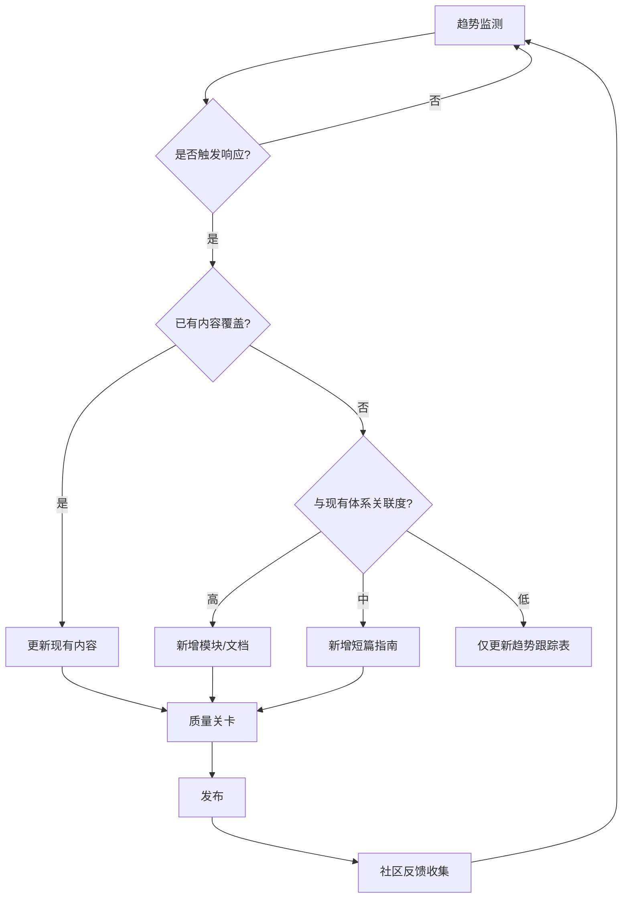

# JS/TS 全景知识库 — 趋势驱动型动态改进计划

> 策略: 按需推进（C）
> 核心原则: 网络趋势驱动 > 固定时间表 | 质量 > 数量 | 深度 > 广度
> 更新日期: 2026-04-21

---

## 一、策略调整说明

### 为什么选"按需推进"？

JS/TS 生态的特殊性：

- **变化速度极快**: 框架/工具每 3-6 个月有重大更新
- **趋势不可预测**: 2025 年初无人预料到 MCP 会爆发
- **内容过时风险**: 固定时间表可能导致内容发布时已过时

### 新模式: 趋势驱动型响应

```
传统模式（固定时间表）          新模式（趋势驱动）
    ↓                               ↓
[Q1 做 A] → [Q2 做 B]      [监测趋势] → [识别热点] → [快速响应]
    ↓                               ↓
可能过时                        始终前沿
```

---

## 二、动态响应机制

### 2.1 趋势监测雷达（持续运行）

| 监测源 | 频率 | 负责人 | 触发条件 |
|--------|------|--------|---------|
| **GitHub Trending** | 每周 30min | 自动化脚本 | 新工具进入 Top 10 |
| **npm 下载趋势** | 每周 30min | 自动化脚本 | 周下载量增长 > 50% |
| **State of JS/TS** | 年度 | 人工 | 报告发布 |
| **TC39 会议记录** | 双月 | 人工 | Stage 3+ 新提案 |
| **Hacker News 热帖** | 每日 15min | 人工 | 前端相关帖子上首页 |
| **技术博客聚合** | 每周 1h | 人工 | 3+ 篇同类主题文章 |

### 2.2 响应触发器与行动矩阵

当监测到以下信号时，自动触发内容生产：

| 信号等级 | 触发条件 | 响应时间 | 行动 |
|---------|---------|---------|------|
| 🔴 **紧急** | 技术被主流框架采纳（如 React 19 正式发布） | 1-2 周 | 立即更新相关文档 |
| 🟠 **重要** | 周下载量增长 > 100% 或 Stars 增长 > 50% | 2-4 周 | 评估并新增/更新内容 |
| 🟡 **关注** | 社区讨论热度上升（HN/Reddit 多帖讨论） | 1-2 月 | 纳入待办队列 |
| 🟢 **跟踪** | 学术前沿新论文或新提案 Stage 2 | 季度回顾 | 更新学术跟踪文档 |

### 2.3 内容生产决策流程



---

## 三、核心任务池（按优先级排序，非时间顺序）

以下任务按**当前网络趋势重要性 × 项目缺口严重性**排序，**不绑定具体时间**，由趋势信号触发执行：

### 🔴 池 A：最高响应优先级（信号触发后 1-2 周执行）

| # | 任务 | 触发信号 | 预估工作量 |
|---|------|---------|-----------|
| A1 | **CI 集成** | 任何新内容提交前必须完成 | 3 人日 |
| A2 | **React 19 稳定版跟进** | React 19.x 发布新特性 | 2 人日 |
| A3 | **TypeScript 7.0 / tsgo 发布** | tsgo 进入 Beta/RC | 3 人日 |
| A4 | **Next.js 重大更新** | Next.js 16+ 发布 | 2 人日 |
| A5 | **主流框架安全漏洞** | CVE 发布影响 React/Vue/Angular | 1-2 人日 |

### 🟠 池 B：高响应优先级（信号触发后 2-4 周执行）

| # | 任务 | 触发信号 | 预估工作量 |
|---|------|---------|-----------|
| B1 | **对比矩阵数据刷新** | 任何矩阵中工具的 Stars/下载量变化 > 30% | 1 人日 |
| B2 | **新工具入库评估** | 新工具周下载量突破 10 万或进入 GitHub Trending | 2 人日 |
| B3 | **示例项目教程化** | 示例项目被学习者频繁提问（Issue/讨论区） | 3 人日/项目 |
| B4 | **学习路径 Checkpoint 项目补充** | 学习者反馈某阶段缺乏实践验证 | 2-4 人日/路径 |
| B5 | **年度生态审计** | 每年 Q4 固定执行（唯一固定时间任务） | 3 人日 |

### 🟡 池 C：中响应优先级（信号触发后 1-2 月执行）

| # | 任务 | 触发信号 | 预估工作量 |
|---|------|---------|-----------|
| C1 | **薄弱模块增强** | 社区 Issue 中提到某模块内容不足 | 3-5 人日 |
| C2 | **新专题新增** | 新趋势形成共识（如 2025 年的 MCP） | 5-10 人日 |
| C3 | **英文版扩展** | 英文用户增长或外部贡献者出现 | 5 人日/批 |
| C4 | **学术前沿更新** | PLDI/POPL/OOPSLA 新论文与 JS/TS 相关 | 3 人日 |
| C5 | **性能基准刷新** | 新 Benchmark 数据颠覆现有认知 | 2 人日 |

### 🟢 池 D：低响应优先级（季度回顾时处理）

| # | 任务 | 触发信号 | 预估工作量 |
|---|------|---------|-----------|
| D1 | **全文检索优化** | 用户反馈找不到内容 | 3 人日 |
| D2 | **社区贡献模板优化** | 外部贡献者提出流程问题 | 1-2 人日 |
| D3 | **历史文档归档** | 某技术被官方废弃（如 Recoil） | 1 人日 |
| D4 | **视觉/排版改进** | 累积足够多的 UI 反馈 | 2-3 人日 |

---

## 四、即时可执行的任务（无需等待趋势信号）

以下任务是**基础设施性质**，与网络趋势无关，建议**立即启动**：

### 4.1 CI/CD 基础设施（最高优先级）

```yaml
# 建议立即配置
on: [push, pull_request]

jobs:
  lint-and-test:
    runs-on: ubuntu-latest
    steps:
      - uses: actions/checkout@v4
      - uses: pnpm/action-setup@v4
      - run: pnpm install
      - run: pnpm lint        # oxlint + biome
      - run: pnpm test        # vitest 全部模块
      - run: pnpm typecheck   # tsc --noEmit
```

**工作量**: 3 人日 | **阻塞**: 其他所有代码类任务

### 4.2 自动化监测脚本

```javascript
// scripts/trend-monitor.js
// 每周自动运行，检测以下内容变化：
// - GitHub Stars 增速 > 20%
// - npm 周下载量变化 > 30%
// - 新工具进入 Trending
// 输出：Markdown 趋势报告，供人工决策
```

**工作量**: 2 人日 | **频率**: 每周自动运行

### 4.3 内容过时标记机制

为所有文档添加 `last-updated` 元数据：

```markdown
---
last-updated: 2026-04-21
review-cycle: 6 months
next-review: 2026-10-21
status: current | needs-update | deprecated
---
```

**工作量**: 2 人日（批量添加）+ 持续维护

---

## 五、趋势驱动的内容生产案例

### 案例 1：MCP 爆发（2025 年 11 月 → 2026 年 4 月）

```
11/2024: MCP 开源（Anthropic）
   ↓ 监测到社区讨论热度上升
12/2024: 评估 → 纳入池 C
   ↓ 下载量持续增长
01/2025: 升级至池 B
   ↓ 主流 IDE 原生支持
02/2025: 升级至池 A → 2 周内完成：
         - 新增 `docs/categories/28-ai-agent-infrastructure.md`
         - 新增 `jsts-code-lab/94-ai-agent-lab/`
03/2025: 持续跟踪 → 更新 A2A 协议对比
04/2025: 稳定期 → 移至池 D（仅数据刷新）
```

### 案例 2：Tailwind CSS v4 发布（2025 年 1 月）

```
01/2025: v4 发布
   ↓ 监测到重大架构变化（Oxide 引擎）
01/2025: 池 A 响应 → 1 周内完成：
         - 更新 `docs/categories/10-styling.md`
         - 新增 v4 配置示例
         - 更新对比矩阵
02/2025: 社区反馈 → 补充迁移指南
03/2025: 稳定期 → 仅数据刷新
```

---

## 六、质量保障（不随策略改变）

无论"固定推进"还是"按需推进"，以下质量关卡**永不妥协**：

| 关卡 | 标准 | 检查方式 |
|------|------|---------|
| **技术准确性** | 与官方文档一致 | 交叉验证 |
| **可运行性** | 所有代码通过 CI 测试 | GitHub Actions |
| **时效性** | 数据标注日期，6 个月回顾 | 元数据 + 日历提醒 |
| **关联性** | 理论 ↔ 实践 ↔ 示例互相引用 | 人工检查 |
| **完整性** | 新增内容必须含 THEORY + 实践 + 测试 | PR 检查清单 |

---

## 七、总结：新模式的运作方式

### 日常节奏

```
每周一: 运行趋势监测脚本（10 分钟）
每周五: 人工扫描 HN/Reddit/博客（30 分钟）
发现信号: 按响应矩阵评估优先级
决定行动: 从任务池中选择对应任务
执行: 按质量关卡完成内容生产
发布: 更新文档 + 记录变更日志
```

### 唯一定期任务

- **年度生态审计**: 每年 Q4 固定执行（无法按需，因为是总结性质）

---

*本计划已从"时间表驱动"全面转为"趋势驱动"。所有任务按优先级排序，等待网络趋势信号触发执行。基础设施类任务（CI、监测脚本）建议立即启动，不等待信号。*
