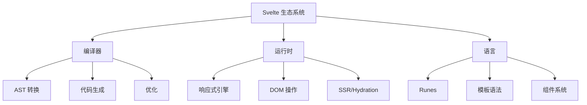
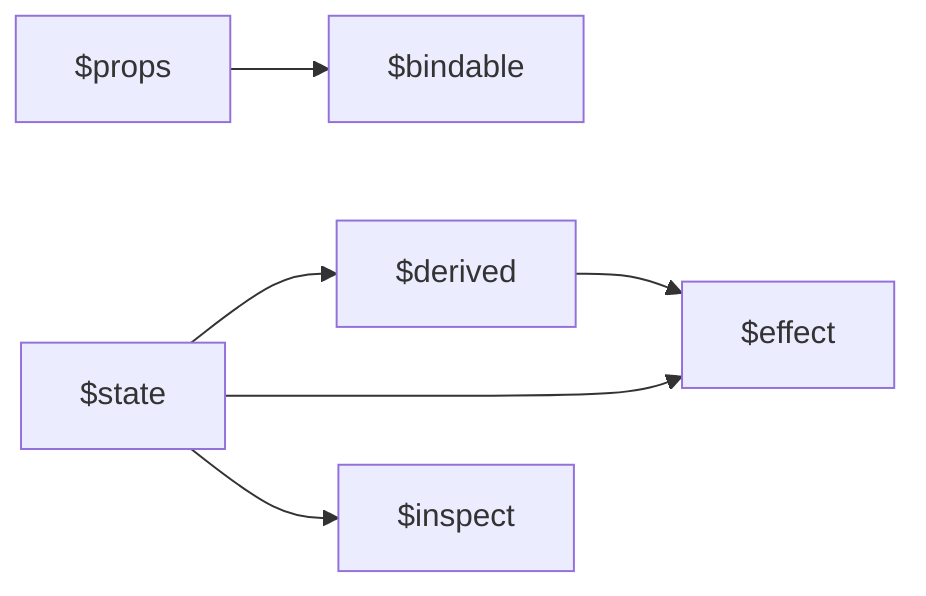

# Svelte Signals 编译器生态专题 — 全面重构计划

> 制定时间: 2026-05-01 | 计划版本: v1.0 | 状态: 待确认

---

## 一、现状诊断（六维度评估）

基于用户反馈和现有 12 个文件（~410KB）的深度审视：

| 维度 | 评分 | 核心问题 |
|------|:----:|----------|
| **语法与语义模型** | ⭐⭐☆☆☆ 2/5 | 语法散落在各专题中，无系统语法大全；语义定义不形式化；缺少"什么是/不是什么"的精确界定 |
| **知识学习体系** | ⭐⭐⭐☆☆ 3/5 | 有学习路径但缺少渐进式知识点拆解；组件开发知识点分散；缺少"从入门到精通"的阶梯式结构 |
| **原理深度** | ⭐⭐⭐☆☆ 3/5 | 编译器原理有覆盖，但响应式调度、Hydration、作用域链等缺乏形式化解释 |
| **应用领域与场景** | ⭐☆☆☆☆ 1/5 | **完全缺失** — 无适用/不适用场景分析；无垂直行业案例；无项目规模适配指南 |
| **教学方法论** | ⭐⭐☆☆☆ 2/5 | 有代码示例但缺少：概念定义→属性→关系→解释→论证→证明→实例→反例的完整链条 |
| **思维表征方式** | ⭐⭐☆☆☆ 2/5 | 有 ASCII 架构图和表格，但缺少：思维导图、决策树、推理判断树、多维矩阵、状态转换图 |

**总体评价**: 当前专题是"技术栈集成指南"导向，适合有基础的开发者快速上手。但缺少"系统化知识教材"导向的内容，无法支撑初学者从零建立完整认知结构，也无法支撑架构师进行严谨的选型论证。

---

## 二、重构目标

将专题从 **"技术栈集成指南"** 升级为 **"系统化知识教材 + 工程实践手册 + 选型决策工具"** 的三位一体结构。

具体目标：

1. **建立完整的 Svelte 知识本体** — 概念、属性、关系、公理、定理、证明、实例、反例
2. **覆盖全场景应用决策** — 什么场景用、什么场景不用、为什么、替代方案
3. **引入多种思维表征** — 思维导图、决策树、推理树、多维矩阵、流程图、状态机
4. **构建渐进式学习阶梯** — 从"第一次写 Svelte"到"设计 Svelte 编译器插件"

---

## 三、补充方案：新增 7 个文件 + 重构 2 个现有文件

### 方案 A：保守增量（推荐）

在现有 12 个文件基础上，**新增 7 个文件**，**重构 2 个现有文件**，总计 19 个文件，目标总大小 ~800KB。

---

### 📘 新增文件 1: `12-svelte-language-complete.md`（Svelte 语言完全参考）

**定位**: 系统化的语法大全 + 语义模型
**目标大小**: 40KB+
**覆盖内容**:

```
## 1. 模板语法体系
### 1.1 表达式语义
- {expression} 的求值规则、作用域、副作用边界
- @const 的编译时语义
- 文本插值的转义规则

### 1.2 指令语义模型
| 指令 | 语法形式 | 语义定义 | 编译输出 | 常见错误 |
|------|----------|----------|----------|----------|
| bind: | bind:prop={var} | 双向绑定语义：建立变量与DOM属性的同步通道 | addEventListener('input') + 赋值 | 绑定到非响应式变量 |
| on: | on:event={handler} | 事件委托语义：编译器决定委托或直连 | addEventListener / 委托表 | 忘记移除导致内存泄漏 |
| use: | use:action | Action 语义：DOM挂载生命周期钩子 | 编译为 mount 回调 | 与 use 指令混淆 |
| transition: | transition:fn | 过渡语义： enter/leave 状态机 | CSS animation + JS 钩子 | SSR 时过渡不触发 |
| animate: | animate:fn | FLIP 动画语义：布局变化插值 | getBoundingClientRect 差值 | 容器尺寸变化时失效 |
| class: | class:name | 条件类名语义：布尔映射到类存在性 | 编译为三元类名赋值 | 与全局 class 冲突 |
| style: | style:prop | 内联样式语义：直接样式属性绑定 | element.style.setProperty | 优先级低于 !important |

### 1.3 控制流语义
- {#if} 的条件渲染语义（与 React 条件渲染对比）
- {#each} 的列表渲染语义（key 算法、就地更新 vs 重建）
- {#await} 的异步渲染语义（状态机：pending/fulfilled/rejected）
- {#key} 的强制重建语义

### 1.4 特殊语法元素
- <svelte:self> 递归语义
- <svelte:component> 动态组件语义（is 属性的编译处理）
- <svelte:element> 动态标签语义
- <svelte:window> / <svelte:document> / <svelte:body> 全局事件语义
- <svelte:head> SSR 头部注入语义
- <svelte:options> 编译选项语义
- <svelte:fragment> / {@render} Snippet 调用语义

## 2. Runes 语义模型（形式化）
### 2.1 语义公理
- Axiom 1: $state 创建响应式信号
- Axiom 2: $derived 建立依赖图边
- Axiom 3: $effect 注册副作用回调
- Axiom 4: $props 声明外部输入接口

### 2.2 语义规则与推导
- Rule 1: 依赖追踪规则（读取即依赖）
- Rule 2: 更新传播规则（脏检查 → 调度 → 执行）
- Rule 3: Effect 执行顺序规则（拓扑排序）
- Rule 4: 清理规则（$effect.pre / $effect 返回 cleanup）

### 2.3 反模式与反例
- ❌ 在 $effect 中同步修改被依赖的 $state → 无限循环
- ❌ $derived 中执行副作用 → 破坏纯函数语义
- ❌ 解构 $state 对象后期望响应式 → Proxy 引用丢失
- ❌ $state([]) 直接用 index 赋值 → 不触发更新

## 3. 组件接口语义
### 3.1 Props 语义
- 什么是 Props：组件的外部契约接口
- Props 不是什么：不是全局状态、不是双向绑定默认
- $props() vs $bindable() vs $props<T>() 的语义差异

### 3.2 Events 语义
- DOM 事件委托机制
- 组件自定义事件（EventDispatcher 已弃用 → 回调 Props 模式）
- 事件修饰符语义（preventDefault, stopPropagation, once, self, trusted）

### 3.3 Slots → Snippets 语义演进
- Svelte 4 Slot 语义 vs Svelte 5 Snippet 语义
- Snippet 的作用域规则、参数传递、类型约束
- Snippet vs Render Props vs Vue 插槽 的语义对比

## 4. Store 语义模型
### 4.1 可写 Store (writable)
- 语义：持有值 + 订阅机制 + set/update 操作
- 与 $state 的关系：Store 是运行时对象，$state 是编译器原语

### 4.2 可读 Store (readable)
- 语义：只读订阅 + 内部 start/stop 生命周期

### 4.3 派生 Store (derived)
- 语义：函数依赖图 + 懒求值 + 缓存

### 4.4 自动订阅前缀 ($)
- 语义：编译时转换 $store → store.subscribe
```

---

### 📘 新增文件 2: `13-component-patterns.md`（组件开发模式大全）

**定位**: 从"写组件"到"设计组件体系"的完整指南
**目标大小**: 35KB+
**覆盖内容**:

```
## 1. 组件基础模式
### 1.1 组件定义模式
- 函数式组件思维（Svelte 的"编译器组件"本质）
- 组件文件结构约定（.svelte / .svelte.ts / .svelte.js）

### 1.2 Props 设计模式
- 受控组件模式（Props + onChange 回调）
- 非受控组件模式（bind: + 内部 $state）
- 复合 Props 模式（对象解构 + 默认值）
- 泛型组件模式（$props<T>() + TypeScript）

### 1.3 状态提升与下沉模式
- 本地状态（$state）
- 兄弟组件状态共享（.svelte.ts 共享模块）
- 跨层级状态（Context API vs Store vs URL state）

## 2. 高级组件模式
### 2.1 组合模式（Composition）
- Snippet 组合（{@render}）
- 多 Snippet 接口设计（header/body/footer）
- 条件 Snippet（可选内容区）

### 2.2 高阶组件模式（HOC）
- Svelte 中 HOC 的替代方案（Wrapper 组件 + Snippet）
- 行为注入模式（Action + Snippet）

### 2.3 渲染控制模式
- 条件渲染（{#if} vs 短路求值）
- 列表渲染优化（{#each key} vs 索引赋值）
- 懒加载组件（<svelte:component> + dynamic import）

### 2.4 表单组件模式
- 受控表单模式（bind:value + 验证）
- 表单库集成模式（Superforms 的表单组件抽象）
- 复合表单字段模式

## 3. Action 设计模式
### 3.1 Action 语义与生命周期
- mount → update → destroy 三阶段
- 参数传递与响应式更新

### 3.2 常见 Action 实现
- 点击外部检测（clickOutside）
- Intersection Observer（viewportEnter）
- 键盘快捷键（shortcut）
- 拖拽（draggable）
- 自动聚焦（autoFocus）

### 3.3 Action vs Web Components 对比

## 4. 组件库设计体系
### 4.1 设计令牌（Design Tokens）
### 4.2 主题系统（CSS Custom Properties + class strategy）
### 4.3 无障碍模式（ARIA、键盘导航、焦点管理）
### 4.4 组件文档自动生成（Storybook / Svelte Press）
```

---

### 📘 新增文件 3: `14-reactivity-deep-dive.md`（响应式系统深度原理）

**定位**: 从"会用 Runes"到"理解响应式引擎"
**目标大小**: 35KB+
**覆盖内容**:

```
## 1. 响应式范式对比（定理式表述）

### Theorem 1: 三种响应式模型的等价性局限
> Push (Signals) ≠ Pull (VDOM) ≠ Reactive (Proxy)
> 在细粒度更新场景下，Push 模型的时间复杂度为 O(受影响的节点数)
> Pull 模型的时间复杂度为 O(组件树遍历)

### 证明思路
- 构造一个 N 层嵌套、M 个叶节点的组件树
- 修改一个底层状态，统计各框架的更新操作次数
- Svelte/Solid: O(M_leaf_affected)
- React/Vue(VDOM): O(N_components_traversed)

## 2. Svelte 5 响应式引擎架构

### 2.1 运行时数据结构
```

Source → [Signal] → { value, version, consumers: Set<Effect> }
Effect → { fn, dependencies: Set<Signal>, cleanup? }
Derived → { fn, source: Signal, cached? }

```

### 2.2 依赖追踪算法（伪代码）
```

function track(source) {
  if (activeEffect) {
    source.consumers.add(activeEffect);
    activeEffect.dependencies.add(source);
  }
}

```

### 2.3 更新调度算法
- 微任务批量（microtask batching）
- 拓扑排序执行（避免重复计算）
- 清理函数注册与调用顺序

### 2.4 与 React 调度对比
| 维度 | Svelte 5 | React 18 |
|------|----------|----------|
| 调度粒度 | 信号级 | 组件级 |
| 优先级 | 无（同步执行） | 有（Lane 优先级） |
| 中断 | 不支持 | 支持（Concurrent） |
| 批量 | 自动微任务 | 自动 + 手动 flushSync |

## 3. 编译器如何生成响应式代码

### 3.1 $state 编译转换示例
```svelte
<!-- 源码 -->
<script>
  let count = $state(0);
</script>
<p>{count}</p>
```

```js
// 编译输出（简化）
import { state } from 'svelte/internal';
let count = state(0);
// 模板中: p.textContent = get(count);
// count 变化时: set(count, newVal) → 通知依赖 → 更新 p.textContent
```

### 3.2 $effect 编译转换示例

```svelte
<script>
  let count = $state(0);
  $effect(() => {
    console.log(count);
  });
</script>
```

```js
// 编译输出（简化）
import { effect, get } from 'svelte/internal';
effect(() => {
  console.log(get(count)); // 读取时建立依赖
});
```

## 4. 内存模型与生命周期

### 4.1 Signal 生命周期图

```
创建 → 被读取 → 建立依赖 → 被更新 → 通知消费者 → 消费者执行 → 清理
  ↑                                              |
  └──────────────────────────────────────────────┘
```

### 4.2 常见内存泄漏模式

- 忘记清理的 $effect
- 全局 Store 持有已销毁组件的闭包
- 循环引用（Signal ↔ Effect）

## 5. 性能分析方法论

### 5.1 如何测量响应式性能

### 5.2 依赖图可视化（dev tool 扩展）

### 5.3 优化策略

- 避免不必要的 $derived
- 使用 $state.snapshot 进行引用比较
- 批量更新策略

```

---

### 📘 新增文件 4: `15-application-scenarios.md`（应用领域与场景决策）

**定位**: "什么场景用 Svelte / 什么场景不用 / 为什么"
**目标大小**: 30KB+
**覆盖内容**:

```

## 1. 适用场景决策矩阵

### 1.1 按项目类型

| 项目类型 | 适合度 | 理由 | 典型案例 | 关键成功因素 |
|----------|:------:|------|----------|-------------|
| 营销/Landing Page | ⭐⭐⭐⭐⭐ | 极小的 bundle、出色的首屏性能 | SaaS 官网、产品发布页 | 静态生成 + CDN |
| Dashboard/Admin | ⭐⭐⭐⭐⭐ | 实时数据更新、丰富的交互 | 数据分析平台、CMS 后台 | SvelteKit + API |
| 内容/博客 | ⭐⭐⭐⭐⭐ | SSR + 静态生成、SEO 友好 | 技术博客、新闻站 | SvelteKit adapter-static |
| 电商前端 | ⭐⭐⭐⭐☆ | 性能敏感、需要 SSR | 产品列表、购物车 | SvelteKit + 无头电商 API |
| 实时协作应用 | ⭐⭐⭐⭐☆ | 细粒度更新适合实时同步 | 在线白板、协作文档 | Yjs + Svelte $state |
| 数据可视化 | ⭐⭐⭐⭐☆ | 轻量运行时、流畅动画 | 图表仪表盘、地图 | D3 + Svelte Action |
| 嵌入式组件 | ⭐⭐⭐⭐⭐ | 运行时极小、可编译为 WC | 第三方插件、微前端 | customElement |
| 移动应用 | ⭐⭐☆☆☆ | 无原生方案、依赖 WebView | - | Capacitor/Tauri |
| 大型复杂表单 | ⭐⭐⭐☆☆ | 生态表单库较少 | 企业 ERP、调查问卷 | Superforms + 自定义 |
| 跨平台桌面 | ⭐⭐⭐☆☆ | Tauri 可行但生态较小 | 小型工具应用 | Tauri + Svelte |

### 1.2 按团队规模

| 团队规模 | 适合度 | 挑战 | 建议 |
|----------|:------:|------|------|
| 1-3 人 | ⭐⭐⭐⭐⭐ | 学习曲线低、开发速度快 | 首选 Svelte |
| 4-10 人 | ⭐⭐⭐⭐⭐ | 需要建立组件规范 | SvelteKit + shadcn-svelte |
| 10-50 人 | ⭐⭐⭐⭐☆ | 招聘难度、生态一致性 | 需评估人才市场 |
| 50+ 人 | ⭐⭐⭐☆☆ | 大规模协调、长期维护 | 需要强技术领导力 |

### 1.3 按性能要求

| 性能指标 | Svelte 表现 | 对比 | 适用场景 |
|----------|------------|------|----------|
| 首屏加载 | 极好 (~2KB) | 优于 React 20x | 移动端、弱网环境 |
| 运行时更新 | 极好 (250ms/10k) | 与 Solid 同级 | 大数据表格、实时列表 |
| 内存占用 | 低 (~2MB) | 优于 React 50% | 低端设备、嵌入式 |
| 构建速度 | 快 (~100ms/组件) | 与 Vite 同级 | 大型项目开发体验 |

## 2. 不适用场景与替代方案

### 2.1 不适用场景分析

| 场景 | 为什么不太适合 | 替代方案 | 如果坚持用 Svelte |
|------|--------------|----------|-----------------|
| 需要 React Native | Svelte 无原生移动端方案 | React Native / Flutter / Expo | Capacitor（WebView 方案）|
| 重度依赖 React 生态 | 缺少对等库 | React | 逐步迁移或 iframe 嵌入 |
| 超大型企业（500+ 前端）| 招聘池小、培训成本高 | React / Vue | 内部培养 + 高薪资 |
| 需要复杂状态机 | Store 生态较简单 | XState + React | XState 也可用（框架无关）|
| 实时游戏渲染 | 需要直接 Canvas/WebGL 控制 | 原生 Canvas / Three.js | 可以，但框架帮助有限 |

### 2.2 决策树

```
新项目选型?
├── 需要原生移动应用?
│   └── 否 → 继续
│   └── 是 → React Native / Flutter
├── 团队 > 50 人且招聘困难?
│   └── 是 → React（安全选择）
│   └── 否 → 继续
├── 性能/体积极度敏感?
│   └── 是 → Svelte 5 / Solid
│   └── 否 → 继续
├── 需要丰富 UI 组件库?
│   └── 是 → React（最强）/ Vue（次强）
│   └── 否 → 继续
├── 全栈 TypeScript + Edge?
│   └── 是 → SvelteKit（最优）/ Next.js
│   └── 否 → 继续
└── 开发速度优先?
    └── 是 → Vue 3 / Svelte 5
    └── 否 → 根据其他因素
```

## 3. 垂直行业案例

### 3.1 SaaS 产品

- 案例: [某 CRM 平台] — SvelteKit + Turso + Lucia Auth
- 架构: Edge SSR → 静态缓存 → 增量更新
- 关键决策: 为什么选 SvelteKit 而不是 Next.js

### 3.2 电商

- 案例: [某 DTC 品牌站] — SvelteKit + Shopify Storefront API
- 架构: 静态产品页 + 动态购物车
- 关键决策: bundle 大小对转化率的影响

### 3.3 内容/媒体

- 案例: [某技术出版物] — SvelteKit + MDsveX + Cloudflare
- 架构: 静态生成 + 边缘缓存
- 关键决策: 构建速度对内容发布流程的影响

### 3.4 实时应用

- 案例: [某协作白板] — Svelte 5 + Yjs + WebRTC
- 架构: 本地优先 + 实时同步
- 关键决策: $state 与 Yjs 的集成模式

## 4. 项目规模适配指南

| 规模 | 技术栈 | 架构模式 | 团队配置 |
|------|--------|----------|----------|
| 原型/MVP | Svelte 5 + Vite | SPA | 1-2 人 |
| 小型产品 | SvelteKit + SQLite | SSR + 静态 | 2-4 人 |
| 中型 SaaS | SvelteKit + PostgreSQL + Drizzle | SSR + Edge | 4-8 人 |
| 大型平台 | SvelteKit + Microservices | SSR + BFF | 8+ 人 |

```

---

### 📘 新增文件 5: `16-learning-ladder.md`（渐进式学习阶梯）

**定位**: "从第一天到第一百天"的完整学习路径
**目标大小**: 30KB+
**覆盖内容**:

```

## Level 0: 预备知识（第 0 天）

- HTML/CSS/JS 基础
- 现代 JS: 模块、箭头函数、解构、Promise
- TypeScript 基础类型
- 前置概念: DOM、事件、HTTP

## Level 1: 初识 Svelte（第 1-3 天）

### 学习目标

- 能创建并运行一个 Svelte 项目
- 理解"编译器框架"的基本概念

### 知识点

- 项目创建: npm create sv@latest
- 第一个组件: 模板 + 脚本 + 样式
- $state 基础: 计数器
- 事件处理: onclick
- 条件渲染: {#if}
- 列表渲染: {#each}

### 练习项目

- Todo List（基础版）

## Level 2: 组件交互（第 4-7 天）

### 学习目标

- 掌握组件间通信
- 理解 Props 和 Events

### 知识点

- $props: 父子组件传值
- 回调 Props: 子传父
- Snippets: 内容分发
- $bindable: 双向绑定
- 组件生命周期: $effect

### 练习项目

- 可复用 Modal 组件
- 表单验证组件

## Level 3: 状态管理（第 8-14 天）

### 学习目标

- 掌握不同范围的状态管理

### 知识点

- 本地状态: $state
- 共享状态: .svelte.ts 模块
- 全局状态: Svelte Store
- 派生状态: $derived
- 副作用: $effect

### 练习项目

- 购物车状态管理
- 主题切换（全局）

## Level 4: SvelteKit 全栈（第 15-30 天）

### 学习目标

- 能开发完整的全栈应用

### 知识点

- 文件系统路由
- load 函数
- Form Actions
- API 路由
- 适配器与部署
- 错误处理

### 练习项目

- 全栈博客系统
- REST API + 前端 CRUD

## Level 5: 工程化（第 31-45 天）

### 学习目标

- 能配置生产级开发环境

### 知识点

- TypeScript 严格模式
- 测试: Vitest + Playwright
- CI/CD: GitHub Actions
- Docker 部署
- 性能优化

### 练习项目

- 完整的 SaaS 项目骨架

## Level 6: 高级模式（第 46-60 天）

### 学习目标

- 掌握高级设计模式

### 知识点

- Action 开发
- 泛型组件
- 编译器插件
- 自定义预处理器
- 微前端集成

### 练习项目

- 组件库开发
- 开源贡献

## Level 7: 架构设计（第 61-90 天）

### 学习目标

- 能设计大型 Svelte 应用架构

### 知识点

- 领域驱动设计
- 微前端架构
- 状态架构模式
- 性能架构
- 可访问性架构

### 练习项目

- 设计一个大型应用架构
- 技术选型论证文档

## Level 8: 源码与生态（第 91-100 天）

### 学习目标

- 深入理解 Svelte 内部

### 知识点

- 编译器源码导读
- 响应式引擎源码
- 贡献开源
- 社区参与

### 练习项目

- 修复一个 Svelte bug
- 发布一个开源库

```

---

### 📘 新增文件 6: `17-knowledge-graph.md`（知识图谱与思维表征）

**定位**: 多种思维表征方式的集合页面
**目标大小**: 25KB+
**覆盖内容**:

```

## 1. Svelte 知识图谱（Mermaid 图）

### 1.1 概念层次结构



### 1.2 Runes 关系图谱



## 2. 决策树集合

### 2.1 状态管理选型决策树

```
状态范围?
├── 单个组件内部
│   └── $state（本地）
├── 几个相关组件
│   ├── 父子关系
│   │   └── Props + 回调
│   └── 兄弟/跨层级
│       └── .svelte.ts 共享模块
├── 应用全局
│   ├── 简单全局
│   │   └── Svelte Store
│   └── 复杂全局（派生、异步）
│       └── Store + derived
├── 服务器状态
│   └── SvelteKit load + $derived
└── URL 状态
    └── SvelteKit $page.url
```

### 2.2 部署平台决策树

```
部署需求?
├── 需要 Edge 部署?
│   ├── 需要 D1/Turso?
│   │   └── Cloudflare Workers
│   └── 需要 Vercel 生态?
│       └── Vercel Edge
├── 传统 Node.js?
│   ├── 需要 serverless?
│   │   └── Vercel / Netlify
│   └── 需要长连接?
│       └── VPS / Docker
└── 纯静态?
    └── Cloudflare Pages / Netlify
```

## 3. 多维对比矩阵

### 3.1 状态管理方案矩阵

| 方案 | 学习成本 | 类型安全 | 调试难度 | 性能 | 适用规模 |
|------|:--------:|:--------:|:--------:|:----:|:--------:|
| $state (本地) | 低 | 高 | 低 | 最优 | 组件级 |
| .svelte.ts 共享 | 低 | 高 | 中 | 优 | 模块级 |
| Svelte Store | 中 | 中 | 中 | 良 | 应用级 |
| Context API | 中 | 低 | 高 | 良 | 树级 |

### 3.2 渲染策略矩阵

| 策略 | 首屏速度 | 交互性 | SEO | 服务器负载 | 适用场景 |
|------|:--------:|:------:|:---:|:----------:|----------|
| CSR | 慢 | 高 | 差 | 低 | Dashboard |
| SSR | 快 | 高 | 好 | 高 | 内容站 |
| SSG | 极快 | 中 | 极好 | 无 | 博客/文档 |
| ISR | 快 | 高 | 好 | 中 | 电商 |
| Streaming | 快 | 高 | 好 | 中 | 大型应用 |

## 4. 推理判断树

### 4.1 "为什么我的组件不更新？"诊断树

```
组件不更新?
├── 状态是 $state 声明的吗?
│   └── 否 → 改为 $state
│   └── 是 → 继续
├── 状态是在 $derived 中被读取的吗?
│   └── 是 → 检查依赖是否完整
│   └── 否 → 继续
├── 状态被解构/重新赋值了吗?
│   └── 是 → 使用 getter 或保持引用
│   └── 否 → 继续
├── 是在 $effect 中修改了依赖状态吗?
│   └── 是 → 添加条件或改用 $derived
│   └── 否 → 继续
└── 检查 SSR 环境?
    └── 是 → 确保代码在浏览器环境执行
    └── 否 → 可能是编译器 bug，报告 issue
```

### 4.2 "选 CSR 还是 SSR？"判断树

```
内容更新频率?
├── 极少更新（博客/文档）
│   └── SSG（静态生成）
├── 定期更新（电商/新闻）
│   ├── 更新后需要立即生效?
│   │   └── 是 → ISR（增量静态再生）
│   │   └── 否 → SSG + 手动重建
├── 实时更新（社交/协作）
│   ├── 首屏 SEO 重要?
│   │   └── 是 → SSR + CSR hydrate
│   │   └── 否 → CSR
└── 用户特定内容（Dashboard）
    └── SSR（或 CSR + loading）
```

## 5. 定理与规则卡片

### Theorem: 响应式传播的最小性
>
> 在 Svelte 5 中，状态变更只触发直接依赖该状态的 Effect 和 Derived，不会触发无关组件。

**证明**: 依赖图是有向无环图（DAG），更新从 Source 节点开始，只遍历出边指向的节点。

### Rule: Effect 纯净性
>
> $effect 回调函数应该是"观察 + 副作用"，不应该修改被观察的状态。

**反例**:

```svelte
<script>
  let count = $state(0);
  $effect(() => {
    count = count + 1; // ❌ 无限循环
  });
</script>
```

### Rule: Props 单向性
>
> Props 是自上而下的数据流。子组件不应直接修改 Props。

**正确模式**:

```svelte
<script>
  let { value, onChange } = $props();
</script>
<input {value} oninput={(e) => onChange(e.target.value)} />
```

## 6. 可视化速查表

### 6.1 生命周期对比图

| 阶段 | Svelte 4 | Svelte 5 | 说明 |
|------|----------|----------|------|
| 创建 | onMount | $effect.pre | DOM 挂载后 |
| 更新 | beforeUpdate/afterUpdate | $effect | 依赖变化时 |
| 销毁 | onDestroy | $effect cleanup | 组件卸载时 |

### 6.2 语法演进对照表

| 场景 | Svelte 4 | Svelte 5 | 迁移难度 |
|------|----------|----------|:--------:|
| 状态 | let count = 0 | let count = $state(0) | 低 |
| 派生 | $: doubled = count * 2 | let doubled = $derived(count * 2) | 低 |
| Props | export let prop | let { prop } = $props() | 中 |
| 事件 | createEventDispatcher | 回调 Props | 中 |
| 插槽 | <slot /> | {@render children()} | 中 |

```

---

### 📘 新增文件 7: `18-ssr-hydration-internals.md`（SSR 与 Hydration 深度原理）

**定位**: 填补现有 SSR 内容的原理深度
**目标大小**: 25KB+
**覆盖内容**:

```

## 1. SSR 渲染流水线

### 1.1 完整流程图

```
浏览器请求
    → SvelteKit 路由匹配
    → load 函数执行（数据获取）
    → 组件树渲染为 HTML 字符串
    → HTML 响应 + 序列化数据（__sveltekit_data）
    → 浏览器接收 HTML（首屏显示）
    → 加载 JavaScript bundle
    → Hydration：恢复组件状态、绑定事件
    → 应用变为可交互
```

### 1.2 序列化与反序列化

- $state 如何在服务端 → 客户端传递
- 循环引用处理
- 自定义类实例的序列化

## 2. Hydration 原理

### 2.1 什么是 Hydration
>
> 定义: Hydration 是在客户端"复活"服务端渲染的 DOM 的过程，包括：状态恢复、事件绑定、Effect 注册。

### 2.2 Svelte 的 Hydration 策略

- Progressive Enhancement（渐进增强）
- 无 VDOM diff 的直接绑定
- 编译器生成 hydration 锚点

### 2.3 与 React Hydration 对比

| 维度 | SvelteKit | Next.js |
|------|-----------|---------|
| Hydration 方式 | 直接绑定 | VDOM diff |
| 失败恢复 | 优雅降级 | hydrateRoot 错误 |
| 选择性 Hydration | Islands（实验性） | Server Components |
| 水合错误检测 | 编译时 | 运行时 |

## 3. Streaming SSR

### 3.1 工作原理

- 渐进式 HTML 流
- Suspense 边界
- 占位符 → 内容替换机制

### 3.2 SvelteKit 实现

- await 块的流式处理
- 错误边界

## 4. 常见 SSR 问题诊断

| 问题 | 症状 | 原因 | 解决方案 |
|------|------|------|----------|
| Hydration mismatch | 控制台警告 | 服务端/客户端渲染结果不同 | 检查 window/document 使用 |
| 服务端访问 window | 500 错误 | 服务端没有 window 对象 | 使用 $app/environment |
| 数据闪烁 | 先显示空态再显示内容 | load 数据未正确传递 | 检查 +page.server.ts |
| 内存泄漏 | 服务器内存持续增长 | 全局状态未清理 | 避免模块级 $state |

```

---

## 四、现有文件增强计划

### 文件 `02-svelte-5-runes.md` 增强

**当前问题**: 语法覆盖较全但缺少形式化语义定义和反例

**增强内容**:
- 每个 Runes 增加"语义定义"小节（是什么/不是什么）
- 增加"形式化规则"（公理/定理风格）
- 增加"反例集合"（常见错误代码 + 错误原因 + 修复方案）
- 增加"Runes 关系图"（依赖关系可视化）

### 文件 `index.md` 增强

**当前问题**: 导航功能强但知识图谱和思维表征不足

**增强内容**:
- 增加"知识图谱"Mermaid 图
- 增加"学习路径决策树"
- 增加"适用场景快速判断"
- 增加"核心概念索引表"

---

## 五、思维表征方式清单（全专题覆盖）

| 表征方式 | 覆盖文件 | 数量 |
|----------|----------|:----:|
| **思维导图/知识图谱** | 17-knowledge-graph.md, index.md | 5+ |
| **决策树** | 15-application-scenarios.md, 17-knowledge-graph.md | 8+ |
| **推理判断树** | 17-knowledge-graph.md, 14-reactivity-deep-dive.md | 4+ |
| **多维对比矩阵** | 10-framework-comparison.md, 17-knowledge-graph.md | 10+ |
| **流程图** | 03-sveltekit-fullstack.md, 18-ssr-hydration-internals.md | 6+ |
| **状态转换图** | 12-svelte-language-complete.md, 14-reactivity-deep-dive.md | 4+ |
| **层次结构图** | index.md, 07-ecosystem-tools.md | 4+ |
| **定理/规则卡片** | 14-reactivity-deep-dive.md, 17-knowledge-graph.md | 10+ |
| **代码对比表** | 09-migration-guide.md, 12-svelte-language-complete.md | 15+ |
| **生命周期图** | 12-svelte-language-complete.md, 17-knowledge-graph.md | 3+ |

---

## 六、实施批次

### Phase 1: 基础语法与语义（高优先级）
- `12-svelte-language-complete.md` — 系统语法大全
- `13-component-patterns.md` — 组件开发模式
- 增强 `02-svelte-5-runes.md` — 形式化语义

**预计**: 3 个文件, ~110KB, 3-4 天

### Phase 2: 原理深度（高优先级）
- `14-reactivity-deep-dive.md` — 响应式引擎原理
- `18-ssr-hydration-internals.md` — SSR/Hydration 原理

**预计**: 2 个文件, ~60KB, 2-3 天

### Phase 3: 应用与决策（中优先级）
- `15-application-scenarios.md` — 应用场景决策
- `16-learning-ladder.md` — 渐进式学习阶梯

**预计**: 2 个文件, ~60KB, 2-3 天

### Phase 4: 思维表征（中优先级）
- `17-knowledge-graph.md` — 知识图谱与思维工具
- 增强 `index.md` — 新增图谱和决策工具

**预计**: 1 个文件 + 增强, ~40KB, 1-2 天

### 总计
- **新增**: 7 个文件, ~215KB
- **增强**: 2 个现有文件, ~+30KB
- **专题总计**: 19 个文件, ~650KB
- **时间**: 8-12 天（按 4 Agent 并行 + 手动编辑模式）

---

## 七、质量检查清单

每个新增文件必须包含：

- [ ] **概念定义**: 每个核心概念有"是什么"和"不是什么"的界定
- [ ] **属性与关系**: 概念间的关联、相似、差异明确说明
- [ ] **解释与论证**: 不只给结论，还给推理过程
- [ ] **实例与示例**: 每个概念/模式有 runnable 代码示例
- [ ] **反例与陷阱**: 常见错误 + 错误原因 + 修复方案
- [ ] **思维表征**: 至少包含 2 种可视化方式（表格/图/树/矩阵）
- [ ] **数据来源**: 性能数据标注来源和时间
- [ ] **交叉引用**: 链接到专题内其他相关章节
- [ ] **构建验证**: 无 dead links，无 HTML 标签错误

---

> **等待用户确认后执行。可选择：**
> - **A. 完整执行**（全部 4 Phase）
> - **B. 分阶段执行**（先 Phase 1-2，确认后再 Phase 3-4）
> - **C. 精简执行**（只选 3-4 个最高优先级文件）
