# 理论体系架构建设总计划

> 目标：构建覆盖「编程原理 → UI原理 → 编程模型 → 框架模型 → 应用设计」五大理论支柱的完整知识体系，建立L0-L5形式化层次模型及层间关联映射，对齐ACM/IEEE/PL顶会等国际化权威内容。

---

## 一、现状诊断

### 1.1 已有理论资产（≈2.5MB）

| 目录 | 文件数 | 体积 | 覆盖域 |
|------|--------|------|--------|
| `70-theoretical-foundations/70.1-category-theory/` | 20 | 820KB | 范畴论、CCC、Monad、Yoneda、Topos |
| `70-theoretical-foundations/70.2-cognitive-interaction/` | 16 | 730KB | 认知负荷、心智模型、UI框架认知分析 |
| `70-theoretical-foundations/70.3-multi-model-formal/` | 13 | 540KB | 操作/指称/公理化语义对应、模型精化 |
| `10-fundamentals/` | 60+ | 800KB+ | 语言语义、类型系统、执行模型、模块系统、对象模型、ECMA规范 |
| `30-knowledge-base/30.8-research/` | 25+ | 1.8MB+ | 函数式、并发模型、架构模式、API设计、V8运行时、安全模型 |
| `website/*` 6大专题 | 71 | 1.8MB | Svelte/TS类型/模块/AI编码/移动/对象模型 |

### 1.2 结构性缺口

```
┌─────────────────────────────────────────────────────────────────────────┐
│  需求5大支柱 vs 现有覆盖                                                  │
├─────────────────────────────────────────────────────────────────────────┤
│  ★ 编程原理    │ λ演算缺失、形式语义不完整、Hoare逻辑缺失、类型论不完整     │
│  ★ UI原理      │ 几乎空白：无HCI基础、无视觉感知、无设计系统理论            │
│  ★ 编程模型    │ 有范畴论视角，但缺命令式/逻辑式/面向对象的形式化对比        │
│  ★ 框架模型    │ 缺组件模型理论、缺渲染模型形式化、缺控制反转/依赖注入体系   │
│  ★ 应用设计    │ 缺DDD完整理论、缺微服务形式化、缺Clean Architecture/六边形│
│  ★ 层次关联    │ 完全空白：无L0-L5映射、无演化路径、无技术选型决策形式化    │
└─────────────────────────────────────────────────────────────────────────┘
```

---

## 二、目标架构：L0-L5 理论层次模型

```mermaid
flowchart TB
    subgraph L0["L0 数学基础层 (Mathematical Foundation)"]
        L0A[集合论与数理逻辑]
        L0B[λ演算 λ-Calculus]
        L0C[范畴论 Category Theory]
        L0D[类型论 Type Theory]
    end

    subgraph L1["L1 计算理论层 (Theory of Computation)"]
        L1A[形式语言与自动机]
        L1B[可计算性理论]
        L1C[计算复杂度]
        L1D[形式语义学基础]
    end

    subgraph L2["L2 编程原理层 (Programming Principles)"]
        L2A[操作/指称/公理化语义]
        L2B[类型系统与类型安全]
        L2C[内存模型与指针理论]
        L2D[并发计算模型]
    end

    subgraph L3["L3 编程范式层 (Programming Paradigms)"]
        L3A[命令式范式]
        L3B[函数式范式]
        L3C[面向对象范式]
        L3D[逻辑式与约束式]
        L3E[反应式与流式]
    end

    subgraph L4["L4 框架架构层 (Framework Architecture)"]
        L4A[组件模型理论]
        L4B[状态管理理论]
        L4C[渲染模型与调度]
        L4D[控制反转与依赖注入]
        L4E[元框架与混合架构]
    end

    subgraph L5["L5 应用设计层 (Application Design)"]
        L5A[架构模式与风格]
        L5B[领域驱动设计 DDD]
        L5C[微服务与分布式架构]
        L5D[事件驱动与CQRS]
        L5E[设计系统与工程化]
    end

    subgraph L6["L6 UI/UX原理层 (横向贯穿)"]
        L6A[人机交互基础]
        L6B[视觉感知与认知负荷]
        L6C[交互设计理论]
        L6D[设计系统与原子设计]
    end

    L0 --> L1 --> L2 --> L3 --> L4 --> L5
    L2 -.-> L6
    L4 -.-> L6
    L5 -.-> L6

    style L0 fill:#e1f5fe
    style L1 fill:#e8f5e9
    style L2 fill:#fff3e0
    style L3 fill:#fce4ec
    style L4 fill:#f3e5f5
    style L5 fill:#e0f2f1
    style L6 fill:#fff8e1
```



---

## 三、五大专题详细规划

### 3.1 专题A：编程原理 (`website/programming-principles/`)

> 对齐：TAPL (Pierce)、SF (Software Foundations)、PLFA、ECMA-262规范

| # | 文件名 | 主题 | 估算KB |
|---|--------|------|--------|
| 00 | `index.md` | 专题首页：编程原理全景图 | 30 |
| 01 | `01-computational-thinking.md` | 计算思维：从问题到算法 | 20 |
| 02 | `02-lambda-calculus.md` | λ演算：函数的本质 | 25 |
| 03 | `03-type-theory-fundamentals.md` | 类型论基础：从简单类型到依赖类型 | 25 |
| 04 | `04-operational-semantics.md` | 操作语义：语言的执行含义 | 20 |
| 05 | `05-denotational-semantics.md` | 指称语义：数学含义的映射 | 20 |
| 06 | `06-axiomatic-semantics.md` | 公理化语义：Hoare逻辑与程序验证 | 20 |
| 07 | `07-abstract-interpretation.md` | 抽象解释：静态分析的理论基础 | 20 |
| 08 | `08-memory-models.md` | 内存模型：从顺序一致性到弱内存 | 20 |
| 09 | `09-concurrency-models.md` | 并发模型：CSP/Actor/π演算 | 22 |
| 10 | `10-algebraic-effects.md` | 代数效应：控制流的代数理论 | 20 |
| 11 | `11-linear-logic-ownership.md` | 线性逻辑与所有权：Rust与Move语义 | 18 |
| 12 | `12-continuation-semantics.md` | 续体语义：控制流的统一理论 | 18 |
| 13 | `13-gradual-typing-theory.md` | 渐进类型：动态与静态的桥梁 | 20 |
| 14 | `14-dependent-types-future.md` | 依赖类型：形式化验证的前沿 | 18 |
| 15 | `15-principles-to-practice.md` | 从原理到实践：理论如何指导工程 | 20 |
| **小计** | | **16篇** | **≈316KB** |

### 3.2 专题B：UI原理 (`website/ui-principles/`)

> 对齐：Norman《设计心理学》、Fitts定律、Hick定律、WCAG 2.2、Material Design Theory

| # | 文件名 | 主题 | 估算KB |
|---|--------|------|--------|
| 00 | `index.md` | 专题首页：UI原理全景图 | 25 |
| 01 | `01-hci-foundations.md` | 人机交互基础：从心理学到设计 | 20 |
| 02 | `02-visual-perception.md` | 视觉感知：格式塔原理与色彩理论 | 20 |
| 03 | `03-cognitive-load-theory.md` | 认知负荷理论：信息架构与心智模型 | 20 |
| 04 | `04-interaction-design-laws.md` | 交互设计定律：Fitts/Hick/Miller/Steering | 18 |
| 05 | `05-design-systems-theory.md` | 设计系统理论：从原子设计到Tokens | 22 |
| 06 | `06-typography-layout-grid.md` | 排版与布局：网格系统与可读性 | 18 |
| 07 | `07-motion-animation-principles.md` | 动效原理：从迪士尼到Web动画 | 18 |
| 08 | `08-accessibility-theory.md` | 可访问性理论：包容式设计模型 | 20 |
| 09 | `09-responsive-adaptive-theory.md` | 响应式与自适应：多设备设计理论 | 18 |
| 10 | `10-ui-state-models.md` | UI状态模型：从有限状态机到状态图 | 18 |
| 11 | `11-feedback-loops-ux.md` | 反馈循环：用户体验的认知闭环 | 16 |
| 12 | `12-cross-cultural-ui.md` | 跨文化UI：国际化与本地化设计 | 16 |
| **小计** | | **13篇** | **≈249KB** |

### 3.3 专题C：编程模型与范式 (`website/programming-paradigms/`)

> 对齐：SICP、CTFP、Concepts Techniques Models (Van Roy)、Paradigms of AI Programming

| # | 文件名 | 主题 | 估算KB |
|---|--------|------|--------|
| 00 | `index.md` | 专题首页：编程范式全景图 | 25 |
| 01 | `01-paradigm-overview.md` | 范式总论：维度的定义与分类 | 22 |
| 02 | `02-imperative-paradigm.md` | 命令式范式：状态与控制的本质 | 20 |
| 03 | `03-structured-programming.md` | 结构化编程：Dijkstra与Goto之争 | 18 |
| 04 | `04-functional-paradigm.md` | 函数式范式：不可变性与组合 | 22 |
| 05 | `05-oop-paradigm.md` | 面向对象范式：封装继承多态的本质 | 22 |
| 06 | `06-logic-constraint-paradigm.md` | 逻辑与约束式：声明式编程的极限 | 18 |
| 07 | `07-reactive-paradigm.md` | 反应式范式：数据流与传播的语义 | 20 |
| 08 | `08-concurrent-paradigm.md` | 并发范式：共享内存与消息传递 | 20 |
| 09 | `09-dataflow-paradigm.md` | 数据流范式：从Spreadsheet到FBP | 18 |
| 10 | `10-metaprogramming-paradigm.md` | 元编程范式：代码生成代码 | 18 |
| 11 | `11-multi-paradigm-design.md` | 多范式设计：如何选择与混合范式 | 20 |
| 12 | `12-paradigm-formal-comparison.md` | 范式形式化对比：表达能力等价性 | 20 |
| 13 | `13-paradigm-evolution-timeline.md` | 范式演化史：从Fortran到现代语言 | 20 |
| 14 | `14-paradigm-and-language-design.md` | 范式如何塑造语言设计 | 18 |
| **小计** | | **15篇** | **≈301KB** |

### 3.4 专题D：框架模型 (`website/framework-models/`)

> 对齐：React Fiber Architecture、Vue Reactivity、Svelte Compiler、Angular Ivy、Solid.js

| # | 文件名 | 主题 | 估算KB |
|---|--------|------|--------|
| 00 | `index.md` | 专题首页：框架模型全景图 | 25 |
| 01 | `01-component-model-theory.md` | 组件模型理论：从函数到组件 | 22 |
| 02 | `02-virtual-dom-theory.md` | 虚拟DOM理论：Diff算法的形式化 | 20 |
| 03 | `03-reactivity-signals-theory.md` | 响应式与信号：从Push到Pull | 22 |
| 04 | `04-state-management-theory.md` | 状态管理理论：Flux/Redux/MobX/XState | 22 |
| 05 | `05-rendering-models.md` | 渲染模型：CSR/SSR/SSG/Islands | 20 |
| 06 | `06-control-inversion-theory.md` | 控制反转与依赖注入：框架的生命线 | 18 |
| 07 | `07-templating-theory.md` | 模板引擎理论：从字符串到AST | 18 |
| 08 | `08-compiler-as-framework.md` | 编译器即框架：Svelte/Astro模式 | 20 |
| 09 | `09-meta-framework-theory.md` | 元框架理论：Next/Nuxt/SvelteKit | 20 |
| 10 | `10-server-client-boundary.md` | 服务端客户端边界：RPC/Server Actions | 18 |
| 11 | `11-routing-navigation-theory.md` | 路由与导航：SPA路由的形式化 | 18 |
| 12 | `12-framework-performance-models.md` | 框架性能模型：启动/运行时/内存 | 18 |
| 13 | `13-framework-selection-theory.md` | 框架选型理论：决策模型与权衡 | 18 |
| 14 | `14-framework-evolution-patterns.md` | 框架演化模式：从jQuery到现代 | 18 |
| **小计** | | **15篇** | **≈297KB** |

### 3.5 专题E：应用设计 (`website/application-design/`)

> 对齐：Clean Architecture (Uncle Bob)、DDD (Evans)、Building Microservices (Newman)、PoEAA (Fowler)

| # | 文件名 | 主题 | 估算KB |
|---|--------|------|--------|
| 00 | `index.md` | 专题首页：应用设计全景图 | 25 |
| 01 | `01-architecture-patterns-overview.md` | 架构模式总览：从MVC到六边形 | 22 |
| 02 | `02-layered-architecture.md` | 分层架构：经典与变体 | 18 |
| 03 | `03-domain-driven-design.md` | 领域驱动设计：战略与战术模式 | 25 |
| 04 | `04-clean-architecture.md` | 整洁架构与六边形架构 | 20 |
| 05 | `05-microservices-design.md` | 微服务设计：拆分与集成 | 22 |
| 06 | `06-event-driven-architecture.md` | 事件驱动架构：EDA与CQRS | 22 |
| 07 | `07-api-design-patterns.md` | API设计模式：REST/GraphQL/gRPC | 20 |
| 08 | `08-data-management-patterns.md` | 数据管理模式：CQRS/Event Sourcing | 20 |
| 09 | `09-security-by-design.md` | 安全设计：纵深防御与零信任 | 18 |
| 10 | `10-observability-design.md` | 可观测性设计：Metrics/Logs/Traces | 18 |
| 11 | `11-testability-design.md` | 可测试性设计：TDD与测试金字塔 | 18 |
| 12 | `12-evolutionary-architecture.md` | 演进式架构：康威定律与逆康威 | 18 |
| 13 | `13-design-systems-engineering.md` | 设计系统工程化：从Figma到代码 | 18 |
| 14 | `14-trade-off-analysis-framework.md` | 权衡分析框架：CAP/PACELC/取舍 | 20 |
| **小计** | | **15篇** | **≈294KB** |

### 3.6 专题F：层次关联总论 (`website/theoretical-hierarchy/`)

| # | 文件名 | 主题 | 估算KB |
|---|--------|------|--------|
| 00 | `index.md` | 理论层次总论：L0-L5映射全景 | 25 |
| 01 | `01-math-to-computation.md` | L0→L1：数学如何定义计算 | 18 |
| 02 | `02-computation-to-language.md` | L1→L2：计算理论到编程语言 | 18 |
| 03 | `03-language-to-paradigm.md` | L2→L3：语言特性如何孕育范式 | 18 |
| 04 | `04-paradigm-to-framework.md` | L3→L4：范式如何决定框架形态 | 18 |
| 05 | `05-framework-to-application.md` | L4→L5：框架如何约束应用设计 | 18 |
| 06 | `06-ui-cross-layer-theory.md` | L6横向贯穿：UI原理在各层的映射 | 18 |
| 07 | `07-evolution-pathways.md` | 演化路径：从汇编到AI辅助编程 | 20 |
| 08 | `08-decision-framework.md` | 技术选型决策框架：形式化方法 | 18 |
| **小计** | | **9篇** | **≈171KB** |

---

## 四、国际化权威内容对齐矩阵

| 专题 | 核心对齐来源 | 次要来源 | 论文/规范来源 |
|------|-------------|---------|--------------|
| **编程原理** | Pierce《TAPL》、Harper《PFPL》、SF (Coq) | PFPL、EOPL | POPL/PLDI/ICFP论文、ECMA-262 |
| **UI原理** | Norman《Design of Everyday Things》、Nielsen可用性启发式 | Material Design、Apple HIG | CHI/UIST论文、WCAG 2.2规范 |
| **编程范式** | SICP、CTFP、Van Roy《Concepts, Techniques, Models》 | PAIP、EOPL | OOPSLA/ECOOP论文 |
| **框架模型** | React/Angular/Vue/Svelte官方架构文档 | Solid.js、Astro、Qwik论文 | 框架RFC文档、性能基准研究 |
| **应用设计** | Evans《DDD》、Martin《Clean Architecture》、Newman《Building Microservices》 | Fowler《PoEAA》、Hohpe《EIP》 | IEEE Software、ACM Queue |
| **层次关联** | Shaw《Software Architecture》、Garlan & Shaw | Brooks《No Silver Bullet》 | 软件工程经典论文 |

---

## 五、与现有内容的关联映射

```
新建专题                    现有内容关联
─────────────────────────────────────────────────────────
programming-principles   →  10-fundamentals/ 理论深化
                         →  70.3-multi-model-formal/ 语义对应
                         →  website/typescript-type-system/ 类型论实践
                         →  website/module-system/ 模块语义

ui-principles            →  70.2-cognitive-interaction/ 认知基础
                         →  website/mobile-development/ 多设备设计
                         →  website/svelte-signals-stack/ 渲染感知

programming-paradigms    →  70.1-category-theory/ 范式范畴论视角
                         →  30-knowledge-base/ FUNCTIONAL_PROGRAMMING_THEORY
                         →  website/object-model/ OOP实践
                         →  10-fundamentals/ 语言语义

framework-models         →  website/svelte-signals-stack/ 编译器框架
                         →  website/object-model/ 组件模型
                         →  30-knowledge-base/ FRONTEND_FRAMEWORK_THEORY
                         →  70.2/ 框架认知分析

application-design       →  30-knowledge-base/ ARCHITECTURE_PATTERNS_THEORY
                         →  30-knowledge-base/ API_DESIGN_THEORY
                         →  website/ai-coding-workflow/ 工具化设计
                         →  comparison-matrices/ 矩阵对比实践

theoretical-hierarchy    →  70-theoretical-foundations/ 全部
                         →  全部专题 交叉引用枢纽
```

---

## 六、实施计划（分3个波次）

### 波次1：基础层建设（Week 1-2）

**目标**：完成L0-L2 + 层次总论（编程原理 + 层次关联 + UI基础）

```
批次1a（4 Agent并行）：programming-principles/ 01-05（λ演算、类型论、语义学）
批次1b（4 Agent并行）：programming-principles/ 06-10（抽象解释、内存模型、并发、代数效应）
批次1c（4 Agent并行）：programming-principles/ 11-15 + index（线性逻辑、续体、渐进类型、依赖类型、总结）
批次1d（4 Agent并行）：theoretical-hierarchy/ 00-04（总论 + L0→L1→L2→L3映射）
批次1e（2 Agent并行）：ui-principles/ 01-04（HCI、视觉感知、认知负荷、交互定律）
```

### 波次2：范式与框架层（Week 3-4）

**目标**：完成L3-L4（编程范式 + 框架模型）

```
批次2a（4 Agent并行）：programming-paradigms/ 00-05（总论 + 命令式/结构化/函数式/OOP）
批次2b（4 Agent并行）：programming-paradigms/ 06-10（逻辑式/反应式/并发/数据流/元编程）
批次2c（4 Agent并行）：programming-paradigms/ 11-14 + theoretical-hierarchy/ 05（多范式/L4映射）
批次2d（4 Agent并行）：framework-models/ 00-05（组件模型/虚拟DOM/信号/状态管理/渲染）
批次2e（4 Agent并行）：framework-models/ 06-10（IoC/模板/编译器框架/元框架/边界）
批次2f（3 Agent并行）：framework-models/ 11-14 + theoretical-hierarchy/ 06（路由/性能/选型/演化/UI映射）
```

### 波次3：应用层与总论（Week 5-6）

**目标**：完成L5 + UI完整层 + 层次总论收尾 + 构建验证

```
批次3a（4 Agent并行）：application-design/ 00-05（总论/分层/DDD/Clean/微服务）
批次3b（4 Agent并行）：application-design/ 06-10（EDA/API/数据/安全/可观测性）
批次3c（4 Agent并行）：application-design/ 11-14 + index（测试/演进/设计系统/权衡）
批次3d（3 Agent并行）：ui-principles/ 05-08（设计系统/排版/动效/可访问性）
批次3e（3 Agent并行）：ui-principles/ 09-12 + index（响应式/状态模型/反馈/跨文化）
批次3f（手动）：theoretical-hierarchy/ 07-08（演化路径/决策框架）+ 构建验证 + 交叉引用补全
```

---

## 七、质量基线（与6大旗舰专题保持一致）

1. **每文件 ≥ 15KB**（理论文件需要更高密度）
2. **Frontmatter完整**：`title`、`description`、`date`、`tags`、`category`
3. **Mermaid图表**：每篇至少1个理论模型图
4. **总结段**：每篇末尾有"理论要点总结"
5. **参考资源**：每篇含3-5个权威引用（书籍/论文/规范）
6. **交叉引用**：引用相关专题和现有内容
7. **数据标注**：引用版本、规范版本、论文年份
8. **形式化记号**：统一使用项目NOTATION_GUIDE.md规范

---

## 八、预期产出

| 指标 | 数值 |
|------|------|
| 新增专题数 | 6个（含层次总论） |
| 新增文件数 | **83篇**（16+13+15+15+15+9） |
| 新增内容量 | **≈1.63 MB** |
| 新增Mermaid图表 | **≈150+** |
| 理论层次覆盖 | **L0-L6完整** |
| 国际化权威对齐 | **30+ 核心来源** |
| 构建验证目标 | **0 dead links, <120s** |

---

## 九、风险与缓解

| 风险 | 缓解措施 |
|------|---------|
| 理论内容过深导致可读性差 | 每层配备"工程师视角"段落，用JS/TS示例说明 |
| 形式化记号不一致 | 严格遵循NOTATION_GUIDE.md，增加符号速查表 |
| 引用来源权威性不足 | 每个引用标注出处、年份、DOI/ISBN |
| 与现有70-theoretical-foundations/重复 | 新建website专题面向工程实践视角，70.x保持学术深度 |
| 构建超时（当前80s→可能120s+） | 继续优化chunkSizeWarningLimit，必要时拆分配置 |
| Agent大文件超时 | 理论文件拆分≤20KB/篇，单批次≤5篇 |

---

> **下一步动作**：等待用户确认计划后，按波次1→2→3顺序启动并行Agent批量建设。
