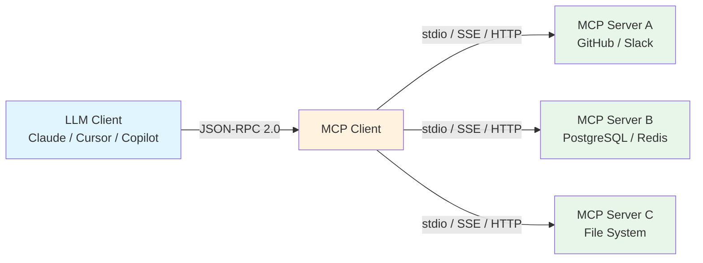
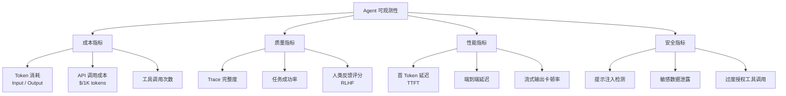
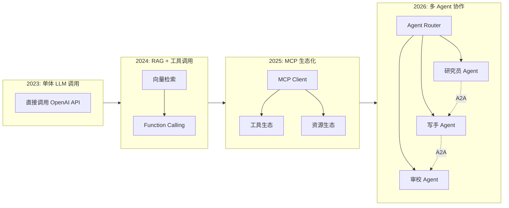

# AI Agent 基础设施生态

> 本文档系统盘点 2025-2026 年 JavaScript/TypeScript 生态中 AI Agent 基础设施的关键协议、框架与工具。覆盖 MCP（Model Context Protocol）、A2A（Agent-to-Agent）、主流 Agent 框架、可观测性与安全等维度。数据参考自 npm 下载趋势、GitHub Stars 及社区调研。

---

## 📊 整体概览

| 技术/框架 | 定位 | 维护方 | Stars / 下载量 | TS 支持 |
|-----------|------|--------|----------------|---------|
| MCP (Model Context Protocol) | 上下文协议标准 | Linux Foundation AAIF | 9700万+ 月下载 | ✅ 原生 |
| A2A (Agent-to-Agent) | Agent 间通信协议 | Google | 新兴标准 | ✅ 原生 |
| Vercel AI SDK v5/v6 | 统一模型接入 + Agent 编排 | Vercel | 200万+ 周下载 | ✅ 原生 |
| Mastra | TypeScript-first AI 框架 | Mastra Inc. | 快速增长 | ✅ 原生 |
| LangChain.js | 复杂 RAG / Agent 工作流 | LangChain Inc. | 成熟生态 | ✅ 官方 |
| OpenAI Agents SDK | ChatKit + 类型安全 Agent | OpenAI | 官方出品 | ✅ 原生 |
| Cloudflare Agents SDK | 边缘原生 Agent 运行时 | Cloudflare | 边缘场景 | ✅ 原生 |
| Langfuse | 开源 AI 可观测性 | Langfuse | 开源热门 | ✅ 原生 |
| Helicone | Gateway + 可观测性 | Helicone | 快速增长 | ✅ 原生 |

---

## 1. MCP（Model Context Protocol）

### 1.1 协议概述

| 属性 | 详情 |
|------|------|
| **名称** | MCP（Model Context Protocol） |
| **发布时间** | 2024.11 开源（Anthropic），2025.12 捐给 Linux Foundation AAIF |
| **核心定位** | 标准化 LLM 与外部工具、数据源、上下文之间的通信协议 |
| **传输层** | stdio、SSE（Server-Sent Events）、HTTP Streamable |
| **通信协议** | JSON-RPC 2.0 |

**一句话描述**：MCP 是 AI 时代的 "USB-C"，为 LLM 提供统一的接口来连接外部世界，解决了每个模型与每个工具之间都需要定制集成的问题。

**核心原语（Primitives）**：

- **Tools（工具）**：可被 LLM 调用的函数，支持 schema 描述与权限控制
- **Resources（资源）**：只读的数据源，如文件、数据库记录、API 响应
- **Prompts（提示模板）**：可复用的提示词模板，支持参数化
- **Sampling（采样）**：允许 Server 请求 Client 进行 LLM 推理（反向调用）

**2026 年生态现状**：

- 月下载量突破 **9700 万**，成为 AI 基础设施中增长最快的协议之一
- 公共 Server 数量超过 **5800+**，覆盖 GitHub、Slack、PostgreSQL、Figma 等主流服务
- 主流 IDE（Cursor、Windsurf、VS Code Copilot）已原生集成 MCP Client

### 1.2 MCP vs A2A 定位差异

| 维度 | MCP | A2A |
|------|-----|-----|
| **通信方向** | Client → Server（LLM 调用工具） | Agent ↔ Agent（对等通信） |
| **设计目标** | 工具与上下文的标准化接入 | Agent 间的协作与任务委托 |
| **协议层级** | 应用层协议（JSON-RPC） | 应用层协议（HTTP + JSON） |
| **状态管理** | 无状态（每次调用独立） | 支持长会话与状态协商 |
| **互补关系** | 解决 "Agent 如何调用工具" | 解决 "Agent 如何与其他 Agent 对话" |

> 💡 **关键洞察**：MCP 与 A2A 并非竞争关系，而是互补。MCP 让单个 Agent 获得能力，A2A 让多个 Agent 协同工作。

---

## 2. 主流 Agent 开发框架

### 2.1 Vercel AI SDK v5/v6

| 属性 | 详情 |
|------|------|
| **名称** | Vercel AI SDK |
| **版本** | v5（稳定）/ v6（预览） |
| **周下载量** | 200万+ |
| **GitHub** | [vercel/ai](https://github.com/vercel/ai) |

**一句话描述**：统一 100+ 模型的 API 抽象层，内置 Agentic Control、原生 MCP 集成与 AI Gateway，是 2025-2026 年 JS/TS 生态中最流行的 AI 开发工具包。

**核心特点**：

- **Unified API**：一套代码切换 OpenAI、Anthropic、Google、Mistral、DeepSeek 等 100+ 模型
- **Agentic Control**：`stopWhen`、`prepareStep` 等原语实现细粒度 Agent 行为控制
- **原生 MCP 集成**：内置 MCP Client，可直接消费 MCP Server 的 Tools 和 Resources
- **AI Gateway**：sub-20ms 的智能路由，自动故障转移与重试
- **Streaming 优先**：原生支持 SSE 流式输出，UI 集成零成本
- **Edge Runtime**：完美适配 Vercel Edge、Cloudflare Workers、Deno Deploy

**适用场景**：

- 快速构建 Chat UI 与对话式应用
- 需要多模型切换或模型路由的项目
- Next.js / React 全栈项目
- 需要 MCP 工具集成的 Agent 应用

### 2.2 Mastra

| 属性 | 详情 |
|------|------|
| **名称** | Mastra |
| **定位** | TypeScript-first AI 框架 |
| **核心能力** | Workflow Engine、Memory、Multi-Agent |

**一句话描述**：专为 TypeScript 开发者设计的 AI 应用框架，内置工作流引擎、持久化记忆与多 Agent 编排，填补了 Vercel AI SDK 在企业级编排层面的空白。

**核心特点**：

- **Workflow Engine**：声明式 DAG / 状态机工作流，支持分支、循环、重试
- **Memory 层**：对话历史、知识图谱、向量检索一体化存储
- **Multi-Agent**：内置 Agent Router，支持层级式与对等式多 Agent 协作
- **Type Safety**：全链路 TypeScript 类型推导，从模型输入到工具输出
- **部署灵活**：支持 Node.js、Bun、Cloudflare Workers、Docker

**适用场景**：

- 复杂业务流程自动化（审批、分析、生成）
- 需要长期记忆的个人助手
- 多角色协作系统（研究员 → 写手 → 审校）

### 2.3 LangChain.js

| 属性 | 详情 |
|------|------|
| **名称** | LangChain.js |
| **定位** | 复杂 RAG / Agent 工作流编排 |
| **生态** | LangChain、LangGraph、LangServe |

**一句话描述**：最成熟的 JS/TS AI 编排框架，提供从文档加载、向量存储、链式调用到 Agent 决策的完整工具箱，但 bundle 体积较大，学习曲线陡峭。

**核心特点**：

- **完整的 RAG Pipeline**：文档解析 → 分块 → Embedding → 向量检索 → 重排序
- **Agent 框架**：ReAct、Plan-and-Execute、Self-Ask 等多种 Agent 架构
- **LangGraph**：基于图的状态机 Agent 编排，支持循环与人机交互
- **生态最广**：与 500+ 工具和 50+ 向量数据库集成

**Bundle Size 注意**：

- `langchain` 核心包约 **~400KB**（gzip）
- 实际项目常因依赖膨胀达到 **1MB+**
- 建议通过 `@langchain/core` + 按需导入控制体积

**适用场景**：

- 复杂文档问答（RAG）系统
- 需要精细控制推理链的研究型 Agent
- 已有 Python LangChain 生态的团队迁移

### 2.4 OpenAI Agents SDK

| 属性 | 详情 |
|------|------|
| **名称** | OpenAI Agents SDK |
| **维护方** | OpenAI |
| **绑定性** | 主要面向 OpenAI 模型优化 |

**一句话描述**：OpenAI 官方推出的类型安全 Agent 工具包，提供 ChatKit 模式与内置的工具调用、上下文管理，是构建 OpenAI 原生 Agent 的最直接选择。

**核心特点**：

- **ChatKit 模式**：对话即代码，每个消息都是类型安全的对象
- **内置 Tool Calling**：函数定义、执行、结果回传全封装
- **Handoffs**：Agent 间任务交接原语
- **Guardrails**：内置输入/输出校验与安全防护

**适用场景**：

- 深度绑定 OpenAI 生态的项目
- 需要快速验证 Agent 概念的原型
- 对类型安全要求极高的团队

### 2.5 Cloudflare Agents SDK

| 属性 | 详情 |
|------|------|
| **名称** | Cloudflare Agents SDK |
| **运行时** | Cloudflare Durable Objects |
| **定位** | 边缘原生 Agent 运行时 |

**一句话描述**：在 Cloudflare 边缘节点上运行的 Agent 框架，利用 Durable Objects 实现有状态、长连接的 AI Agent，延迟低至几十毫秒。

**核心特点**：

- **边缘原生**：全球 300+ 节点就近运行，无需中心化服务器
- **Durable Objects**：有状态 WebSocket 连接，支持长时间运行的 Agent 会话
- **AI Gateway 集成**：内置缓存、速率限制与模型路由
- **Bindings**：与 Workers KV、D1、R2 无缝集成

**适用场景**：

- 全球低延迟的实时 AI 应用
- 需要长连接（WebSocket）的协作 Agent
- 已有 Cloudflare 生态的基础设施

---

## 3. 框架对比矩阵

| 维度 | Vercel AI SDK | Mastra | LangChain.js | OpenAI Agents SDK | Cloudflare Agents SDK |
|------|---------------|--------|--------------|-------------------|----------------------|
| **Bundle Size** | ~25KB（核心） | ~80KB | ~400KB+ | ~60KB | 边缘运行时 |
| **Provider Support** | 100+ 模型 | 20+ 模型 | 100+ 模型 | OpenAI 为主 | 通过 Gateway |
| **Edge Runtime** | ✅ 完美支持 | ✅ 支持 | ⚠️ 需配置 | ❌ 不支持 | ✅ 原生 |
| **UI Integration** | ✅ React/Next 原生 | ⚠️ 需适配 | ⚠️ 需适配 | ⚠️ 需适配 | ⚠️ 需适配 |
| **Observability** | ✅ AI Gateway 内置 | ⚠️ 集成第三方 | ✅ LangSmith | ⚠️ 基础日志 | ✅ Gateway 指标 |
| **MCP Support** | ✅ 原生 Client | ⚠️ 社区适配 | ⚠️ 社区适配 | ⚠️ 需桥接 | ⚠️ 需桥接 |
| **Workflow Engine** | ⚠️ 基础循环 | ✅ 内置 DAG | ✅ LangGraph | ⚠️ Handoffs | ❌ 无 |
| **Memory / 持久化** | ⚠️ 需自行实现 | ✅ 内置 | ✅ 内置 | ⚠️ 基础 | ✅ Durable Objects |
| **Multi-Agent** | ⚠️ 需自行编排 | ✅ 内置 Router | ✅ LangGraph | ✅ Handoffs | ⚠️ 需自行实现 |
| **学习曲线** | 低 | 中 | 高 | 低 | 中 |

---

## 4. Agent 可观测性（Observability）

AI Agent 的可观测性比传统应用更复杂：不仅需要追踪请求延迟与错误率，还需要记录 Token 消耗、工具调用链、模型决策轨迹（Trace）与反馈循环。

### 4.1 主流工具对比

| 工具 | 定位 | 开源 | 核心能力 | 部署方式 |
|------|------|------|----------|----------|
| **Langfuse** | 开源 LLM 可观测性 | ✅ MIT | Traces、Evaluations、Prompt Management、Metrics | 自托管 / 云 |
| **Helicone** | Gateway + 可观测性 | ⚠️ 部分 | 请求代理、缓存、成本追踪、实验管理 | 云 / 自建 Gateway |
| **Weave** | W&B 出品 | ⚠️ 部分 | 实验追踪、模型评估、数据版本 | 云 |
| **Traceloop** | OpenTelemetry 原生 | ✅ | 自动 Instrumentation、分布式追踪 | 自托管 / 云 |
| **Axiom** | 无限制日志分析 | ⚠️ 部分 | 高基数查询、实时仪表盘、低成本存储 | 云 |

### 4.2 可观测性关键指标

---

## 5. AI Agent 安全

### 5.1 主要风险

| 风险类型 | 描述 | 防护策略 |
|----------|------|----------|
| **Prompt Injection（提示注入）** | 攻击者通过用户输入覆盖系统提示，劫持 Agent 行为 | 输入校验、权限隔离、Human-in-the-loop |
| **Tool Poisoning（工具投毒）** | 恶意 MCP Server 或工具定义诱导 Agent 执行危险操作 | 工具白名单、Schema 校验、沙箱执行 |
| **过度授权（Over-privileging）** | Agent 拥有超出任务所需的工具权限 | 最小权限原则（PoLP）、动态权限范围 |
| **数据泄露** | Agent 将敏感上下文发送到不可信的模型或工具 | 数据分类、本地模型、PII 脱敏 |
| **无限循环 / 资源耗尽** | Agent 在工具调用间陷入循环，导致 Token 与成本失控 | 最大步数限制、超时机制、预算上限 |

### 5.2 安全最佳实践

1. **输入隔离**：将用户输入与系统提示严格分离，使用结构化模板（如 MCP Prompts）
2. **工具最小化**：仅暴露当前任务必需的工具，使用动态工具注册
3. **Human Approval**：对高风险操作（写入、删除、转账）实施人工确认
4. **沙箱执行**：工具代码在隔离环境（如 WebAssembly、Deno Sandbox）中运行
5. **审计日志**：完整记录每次 Agent 决策的工具调用链与上下文快照

---

## 6. 架构演进趋势

---

## 7. 选型建议速查

| 场景 | 首选框架 | 备选方案 | 关键理由 |
|------|----------|----------|----------|
| Next.js 全栈 Chat 应用 | **Vercel AI SDK** | Mastra | UI 集成零成本，Streaming 原生 |
| 复杂业务流程自动化 | **Mastra** | LangChain.js | 工作流引擎 + 记忆 + 多 Agent |
| 深度 RAG 系统 | **LangChain.js** | Vercel AI SDK + 自建 | 生态最全，Pipeline 成熟 |
| OpenAI 原生 Agent | **OpenAI Agents SDK** | Vercel AI SDK | 官方优化，类型安全 |
| 全球边缘低延迟 Agent | **Cloudflare Agents SDK** | Vercel AI SDK + Edge | Durable Objects 有状态会话 |
| 快速原型 / MVP | **Vercel AI SDK** | OpenAI Agents SDK | 学习曲线最低，社区资源最多 |
| 企业级多 Agent 平台 | **Mastra + Langfuse** | LangChain.js + LangSmith | 编排能力 + 可观测性完备 |

---

> 💡 **提示**：AI Agent 基础设施在 2025-2026 年处于快速迭代期，MCP 已成为工具集事实标准，Vercel AI SDK 在开发者体验上领先，而 Mastra 在企业级编排方面迅速崛起。选型时需综合考虑团队现有技术栈、部署环境与长期可维护性。
