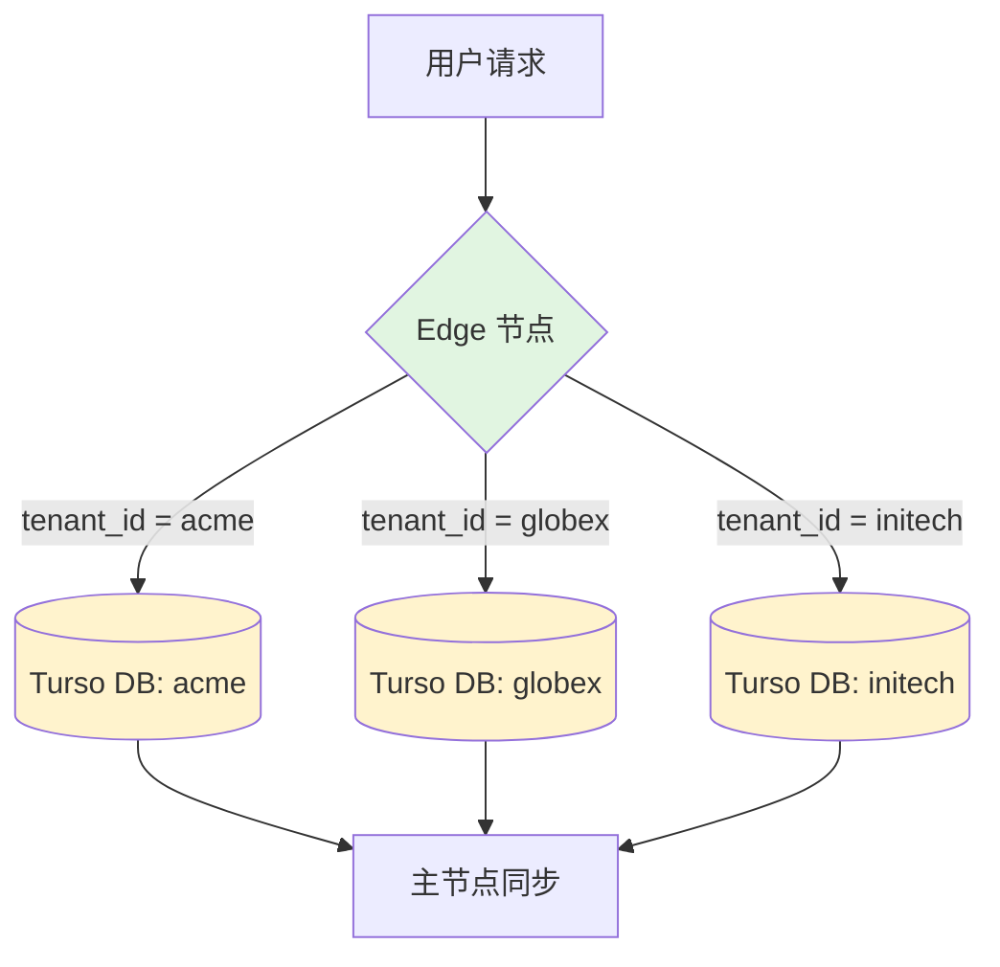
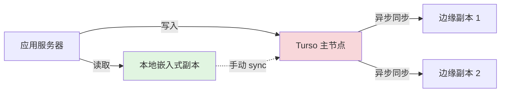
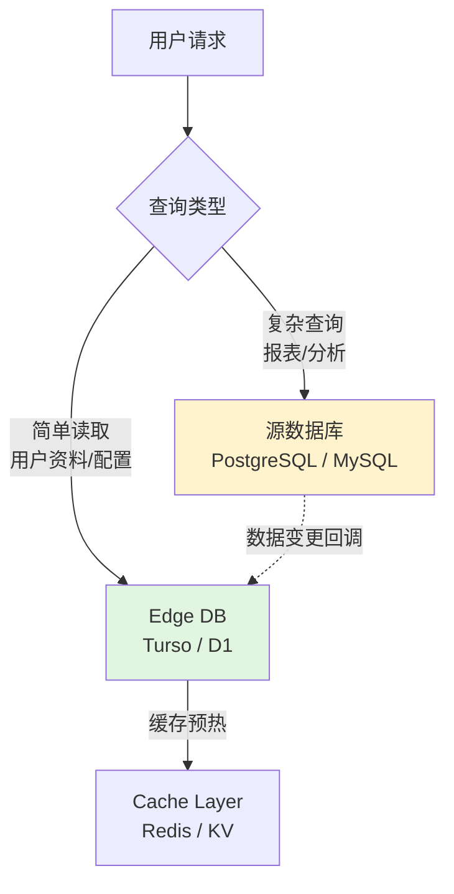
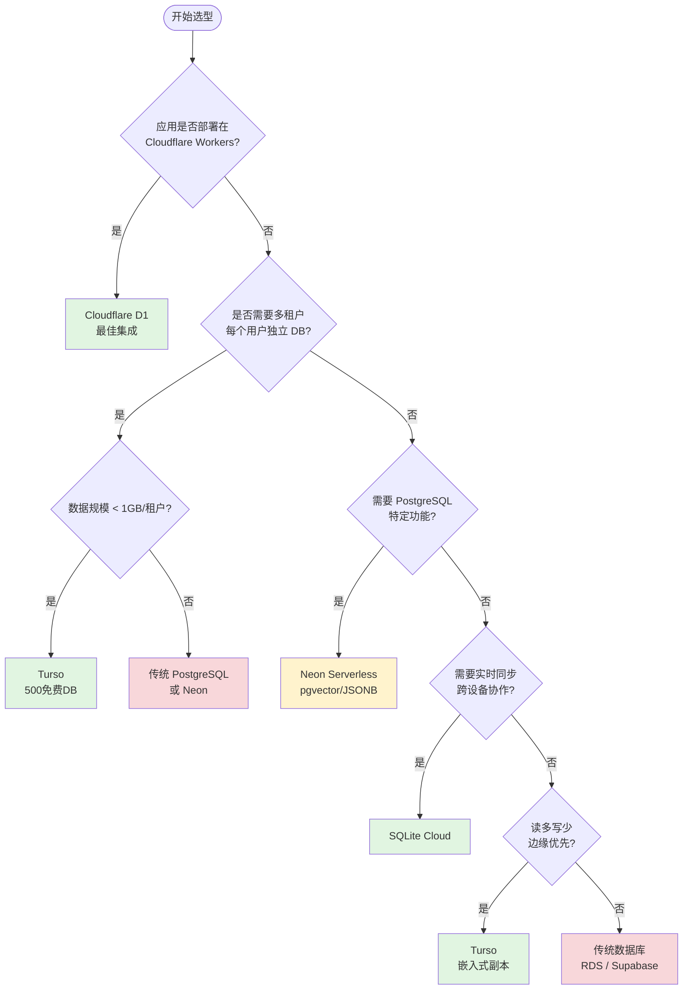

# Edge Databases（边缘数据库）

> 本文档系统梳理 SQLite at the Edge 这一新兴生产级数据库类别，涵盖 Turso、Cloudflare D1、SQLite Cloud 及 Neon Serverless 等主流方案。数据参考自官方文档及 GitHub Stars（2026年4月）。

---

## 📊 整体概览

| 服务 | 引擎 | 架构 | 免费额度 | Edge 原生 | 最佳场景 |
|------|------|------|:--------:|:---------:|----------|
| **Turso** | libSQL (SQLite fork) | 全球复制，写主读副 | 500 数据库 / 9GB 存储 | ⭐⭐⭐⭐⭐ | 多租户 SaaS、IoT、读多写少 |
| **Cloudflare D1** | SQLite | Workers 绑定，全球分布 | 5GB / 2500 万行 | ⭐⭐⭐⭐⭐ | Cloudflare 生态、轻量 CRUD |
| **SQLite Cloud** | SQLite | 托管 + 实时同步 | 1 项目 / 100MB | ⭐⭐⭐⭐ | 实时协作、移动/Web 同步 |
| **Neon Serverless** | PostgreSQL | 存储计算分离，Serverless | 10 个项目 / 500MB | ⭐⭐⭐⭐ | 全栈应用、向量/AI 扩展 |
| **Supabase** | PostgreSQL | 开源 Firebase 替代 | 500MB / 无限项目 | ⭐⭐⭐ | 实时应用、Auth + Storage |

---

## 1. 什么是"Edge Database"？

**边缘数据库（Edge Database）** 是一类专为边缘计算（Edge Computing）和 Serverless 环境设计的数据库服务。它们通常具备以下核心特征：

### 1.1 核心定义

| 特征 | 说明 |
|------|------|
| **全球分布式** | 数据自动复制到全球多个边缘节点，用户始终连接最近的数据中心 |
| **低延迟优先** | 读操作延迟通常 < 50ms，写操作通过主节点同步 |
| **Serverless 定价** | 按请求/存储计费，无服务器预留成本，零连接池开销 |
| **SQLite 基础** | 绝大多数边缘数据库基于 SQLite 或兼容 SQLite 协议（单文件、零配置、嵌入式） |
| **HTTP 协议** | 通过 HTTP/HTTPS 而非 TCP 连接，天然适配 Serverless 无状态模型 |

### 1.2 为什么 SQLite 成为边缘数据库的首选引擎？

```
┌─────────────────────────────────────────────────────────────┐
│                     SQLite at the Edge                      │
├─────────────────────────────────────────────────────────────┤
│  单文件数据库      →  天然适合复制到边缘节点                   │
│  零配置启动        →  无需复杂初始化，毫秒级就绪               │
│  极小资源占用      →  嵌入式设备、WASM、V8 Isolate 均可运行    │
│  事务完整支持      →  ACID 保证，数据可靠性不妥协             │
│  无连接池需求      →  每次请求直接打开/关闭，Serverless 友好   │
│  公共领域许可      →  无商业授权风险，可自由 fork（如 libSQL） │
└─────────────────────────────────────────────────────────────┘
```

---

## 2. SQLite at the Edge：范式转变

### 2.1 反转"Postgres by Default"趋势

过去十年，JavaScript/TypeScript 生态的默认选择是 **PostgreSQL**：

- Prisma 默认推荐 PostgreSQL
- Next.js 全栈教程普遍使用 Postgres
- Supabase、Neon、Vercel Postgres 等托管服务降低了上手门槛

但 **边缘数据库正在逆转这一趋势**，原因如下：

| 维度 | 传统 Postgres 部署 | Edge Database (SQLite) |
|------|-------------------|----------------------|
| **连接模型** | 长期 TCP 连接，需连接池 | HTTP 请求/响应，无连接状态 |
| **部署位置** | 单区域 / 多区域需手动配置 | 自动全球边缘复制 |
| **冷启动** | 连接建立 + 连接池预热 | 直接读取本地 SQLite 文件 |
| **多租户成本** | 每个租户一个 Schema / 数据库，成本高 | 每个租户一个 SQLite 文件，几乎零成本 |
| **Bundle 体积** | pg 驱动 + 连接池 ≈ 数百 KB | libsql 客户端 ≈ 几十 KB |
| **本地开发** | 需 Docker 运行 Postgres | 直接文件读写，无需容器 |
| **运维复杂度** | 备份、升级、扩缩容需 DBA | 托管服务自动处理 |

### 2.2 范式转变的驱动力

1. **Serverless 普及**：Cloudflare Workers、Vercel Edge、AWS Lambda 的爆发式增长，要求数据库也能以"函数"模型运行
2. **多租户 SaaS 需求**：每个用户/团队独立数据库成为默认架构，SQLite 的单文件特性完美匹配
3. **边缘计算成熟**：全球 CDN 不再只分发静态内容，也开始运行数据库查询
4. **ORM 进化**：Drizzle ORM 等工具让 SQLite 开发体验媲美 Postgres

---

## 3. 主流 Edge Database 深度对比

### 3.1 Turso（libSQL）

| 属性 | 详情 |
|------|------|
| **名称** | Turso |
| **底层引擎** | libSQL（SQLite 分支） |
| **GitHub** | [tursodatabase/libsql](https://github.com/tursodatabase/libsql) |
| **官网** | [turso.tech](https://turso.tech) |
| **npm** | `@libsql/client` |
| **Stars** | ⭐ 3,000+ (libSQL) |
| **许可证** | MIT |

**一句话描述**：基于 libSQL 的全球分布式 SQLite 平台，提供 35+ 边缘区域、嵌入式副本和 generous 免费 tier，是多租户 SaaS 的首选边缘数据库。

**核心特点**：

- **35+ 全球区域**：数据自动复制到全球边缘节点，读操作本地完成
- **500 个免费数据库**：免费 tier 支持 500 个独立数据库，9GB 总存储，适合多租户架构
- **嵌入式副本（Embedded Replicas）**：可在应用服务器本地缓存只读副本，实现亚毫秒级读取
- **libSQL 扩展**：在 SQLite 基础上增加 WASM 用户自定义函数、加密、原生 ALTER TABLE 等
- **Drizzle ORM 原生支持**：官方 Drizzle 集成体验最佳
- **多语言 SDK**：TypeScript、Go、Rust、Python、PHP 等
- **WASM 兼容**：libSQL 可编译为 WASM，在浏览器中运行

**定价模型**（2026年4月参考）：

| 层级 | 费用 | 包含 |
|------|------|------|
| Starter | 免费 | 500 数据库，9GB 存储，10 亿行读取/月 |
| Scaler | $29/月 | 10,000 数据库，100GB 存储，优先支持 |
| Enterprise | 定制 | 无限数据库，专用集群，SLA |

**适用场景**：

- 多租户 SaaS（每个租户一个数据库）
- IoT 设备数据汇聚
- 边缘缓存层
- 需要嵌入式副本的读密集型应用

**示例代码**：

```typescript
import { createClient } from '@libsql/client'

const client = createClient({
  url: 'libsql://your-database.turso.io',
  authToken: process.env.TURSO_AUTH_TOKEN
})

// 参数化查询
const result = await client.execute({
  sql: 'SELECT * FROM users WHERE tenant_id = ? AND active = ?',
  args: ['tenant_123', true]
})

console.log(result.rows)
```

**嵌入式副本模式**：

```typescript
import { createClient } from '@libsql/client'

const client = createClient({
  url: 'file:local.db',           // 本地 SQLite 文件
  syncUrl: 'libsql://...turso.io', // 远程同步源
  authToken: process.env.TURSO_AUTH_TOKEN
})

await client.sync() // 将远程数据同步到本地
const result = await client.execute('SELECT * FROM posts')
```

---

### 3.2 Cloudflare D1

| 属性 | 详情 |
|------|------|
| **名称** | Cloudflare D1 |
| **底层引擎** | SQLite |
| **官网** | [developers.cloudflare.com/d1](https://developers.cloudflare.com/d1) |
| **集成方式** | Workers Binding（非网络连接） |
| **GA 时间** | 2026年（正式商用） |
| **许可证** | 闭源托管服务 |

**一句话描述**：Cloudflare 官方提供的全球分布式 SQLite 数据库，与 Workers 深度绑定（非 HTTP 连接），2026年正式 GA，是 Cloudflare 生态内成本最低的 Edge 数据库。

**核心特点**：

- **Workers 原生绑定**：通过 `env.DB` 直接访问，无需网络连接字符串，延迟极低
- **全球分布**：自动复制到 Cloudflare 全球 300+ 节点
- **5GB 免费存储**：免费 tier 提供 5GB 存储和 2500 万行读取/天
- **Drizzle ORM 支持**：通过 `drizzle-orm/d1` 驱动完美集成
- **SQL 兼容性**：支持标准 SQLite 语法，包括事务、索引、外键
- **wrangler CLI**：完善的本地开发和部署工具链
- **与 R2/KV 协同**：与 Cloudflare R2（对象存储）、KV（键值存储）无缝配合

**定价模型**（2026年4月参考）：

| 层级 | 费用 | 包含 |
|------|------|------|
| Free | 免费 | 5GB 存储，2500 万行读取/天，10 万次写入/天 |
| Paid | $5/月 + 按量 | 25GB 存储，更高读写限额 |

**适用场景**：

- Cloudflare Workers / Pages 生态内的全栈应用
- 需要极低延迟的轻量 CRUD 应用
- 边缘配置存储、会话管理
- 与 R2 配合的元数据管理

**示例代码**：

```typescript
// wrangler.toml
// [[d1_databases]]
// binding = "DB"
// database_name = "my-db"
// database_id = "..."

import { drizzle } from 'drizzle-orm/d1'
import { eq } from 'drizzle-orm'

export default {
  async fetch(request: Request, env: { DB: D1Database }) {
    const db = drizzle(env.DB)

    const users = await db.select().from(usersTable)
      .where(eq(usersTable.active, true))

    return Response.json(users)
  }
}
```

---

### 3.3 SQLite Cloud

| 属性 | 详情 |
|------|------|
| **名称** | SQLite Cloud |
| **底层引擎** | SQLite |
| **官网** | [sqlitecloud.io](https://sqlitecloud.io) |
| **特点** | 托管 SQLite + 实时同步 |
| **协议** | WebSocket / HTTP / 原生 TCP |

**一句话描述**：提供托管 SQLite 服务，主打实时数据同步功能，适合需要多端实时协作的应用场景。

**核心特点**：

- **实时同步**：内置 Pub/Sub 机制，数据库变更自动推送到所有连接的客户端
- **托管 SQLite**：无需自行运维 SQLite 实例
- **多协议支持**：WebSocket、HTTP REST、原生 TCP 协议
- **边缘部署**：可在多个区域部署读副本
- **SDK 支持**：JavaScript、React Native、Flutter、Swift 等

**适用场景**：

- 实时协作应用（如 Notion 类工具）
- 跨设备数据同步（移动端 ↔ Web）
- 需要实时更新的仪表盘
- 离线优先（Offline-first）应用的数据同步层

**定价模型**（2026年4月参考）：

| 层级 | 费用 | 包含 |
|------|------|------|
| Free | 免费 | 1 项目，100MB 存储 |
| Pro | $15/月 | 无限项目，1GB 存储，优先支持 |
| Enterprise | 定制 | 自定义存储，SLA，专属节点 |

---

### 3.4 Neon Serverless

| 属性 | 详情 |
|------|------|
| **名称** | Neon |
| **底层引擎** | PostgreSQL |
| **GitHub** | [neondatabase/neon](https://github.com/neondatabase/neon) |
| **官网** | [neon.tech](https://neon.tech) |
| **npm** | `@neondatabase/serverless` |
| **Stars** | ⭐ 15,000+ |
| **收购信息** | 2026年1月被 Databricks 收购 |

**一句话描述**：存储计算分离的 Serverless PostgreSQL，虽非 SQLite 但具备边缘部署能力，适合需要 Postgres 生态又追求 Serverless 体验的全栈应用。

**核心特点**：

- **存储计算分离**：计算节点按需启停，存储层独立扩缩容
- **Serverless 驱动**：`@neondatabase/serverless` 专为 Edge 优化
- **分支即数据库**：基于写时复制（COW）的即时数据库分支，适合 CI/CD 和预览环境
- **Postgres 完全兼容**：支持所有 Postgres 扩展（PostGIS、pgvector 等）
- **自动休眠**：无流量时自动休眠，零成本空闲期
- **Databricks 生态**：被收购后将深度整合 Databricks 的数据+AI 平台

> ⚠️ **注意**：Neon 不是 SQLite，而是 PostgreSQL。它出现在本文档中是因为它是"边缘兼容"的 Serverless 数据库，与 Turso/D1 在部分场景形成竞争关系。

**定价模型**（2026年4月参考）：

| 层级 | 费用 | 包含 |
|------|------|------|
| Free | 免费 | 10 个项目，500MB 存储，190 小时计算/月 |
| Launch | $19/月 | 10GB 存储，无限制计算 |
| Scale | $59/月 | 50GB 存储，更多并发连接 |

**适用场景**：

- 需要 PostgreSQL 特定功能（如 JSONB、数组类型、复杂聚合）
- AI/向量搜索（pgvector 扩展）
- 已有 Postgres 生态依赖的迁移项目
- 需要数据库分支功能的 CI/CD 工作流

**示例代码**：

```typescript
import { neon } from '@neondatabase/serverless'

const sql = neon(process.env.DATABASE_URL!)

// 类型安全的查询
const posts = await sql`
  SELECT * FROM posts
  WHERE published = true
  ORDER BY created_at DESC
  LIMIT 10
`
```

---

## 4. Edge Database vs 传统数据库

### 4.1 对比矩阵

| 维度 | Turso / D1 / SQLite Cloud | PostgreSQL (Neon) | 传统 MySQL / Postgres |
|------|--------------------------|-------------------|---------------------|
| **部署模型** | 全球边缘，自动复制 | Serverless，单区域存储 | 单区域 / 手动多区域 |
| **连接方式** | HTTP / Workers Binding | HTTP (serverless driver) | TCP + 连接池 |
| **冷启动** | 0ms（本地读取） | 10-100ms（计算节点唤醒） | 依赖连接池状态 |
| **多租户成本** | 极低（单文件/数据库） | 中（分支或 Schema） | 高（独立实例或 Schema） |
| **事务能力** | 单节点 ACID | 完整 ACID | 完整 ACID |
| **分布式事务** | ❌ 不支持 | ⚠️ 有限支持 | ✅ 成熟方案 |
| **复杂 JOIN** | ⚠️ 性能受限（SQLite） | ✅ 优秀查询优化器 | ✅ 优秀 |
| **存储过程** | ❌ 不支持 | ✅ 支持 | ✅ 支持 |
| **JSON 操作** | ⚠️ SQLite JSON1 扩展 | ✅ JSONB 原生支持 | ⚠️ MySQL JSON / ✅ Postgres JSONB |
| **向量搜索** | ❌ 不支持 | ✅ pgvector | ⚠️ 需扩展 |
| **扩展生态** | 有限 | 丰富（Postgres 扩展） | 丰富 |
| **最大数据规模** | ~TB 级（单文件限制） | 无限（存储分离） | TB-PB 级 |
| **供应商锁定** | 中（libSQL/D1 特定 API） | 中（Neon 分支功能） | 低（标准 SQL） |

### 4.2 PlanetScale 的退出

> 📌 **关键事件**：PlanetScale 于 2024年取消了免费 tier，最低付费门槛提升至 **$39/月**。这促使大量开发者转向 Turso、D1 等免费 tier 更 generous 的边缘数据库。

| 服务 | 最低付费门槛 | 免费 tier 状态 |
|------|:-----------:|:-------------:|
| Turso | $29/月 | 500 数据库，9GB |
| Cloudflare D1 | $5/月 | 5GB，慷慨的读写限额 |
| Neon | $19/月 | 500MB |
| PlanetScale | $39/月 | ❌ 已取消 |

---

## 5. ORM 兼容性矩阵

### 5.1 Edge Database ORM 对比

| ORM | Turso (libSQL) | Cloudflare D1 | SQLite Cloud | Neon | Bundle 大小 | 推荐度 |
|-----|:-------------:|:-------------:|:------------:|:----:|:----------:|:------:|
| **Drizzle ORM** | ✅ 原生支持 | ✅ 原生支持 | ✅ HTTP 适配 | ✅ | ~7KB | ⭐⭐⭐⭐⭐ |
| **Prisma 7 (WASM)** | ✅ WASM 引擎 | ✅ WASM 引擎 | ⚠️ 实验性 | ✅ | ~5MB | ⭐⭐⭐ |
| **Kysely** | ✅ libsql 方言 | ⚠️ 需适配 | ✅ HTTP 驱动 | ✅ neon 方言 | ~15KB | ⭐⭐⭐⭐ |
| **MikroORM** | ✅ 原生 libSQL | ❌ 不支持 | ❌ 不支持 | ⚠️ 需配置 | ~50KB | ⭐⭐⭐ |
| **Better-sqlite3** | ✅ 本地模式 | ❌ 不支持 | ❌ 不支持 | ❌ | ~1MB | ⭐⭐ (仅本地) |

### 5.2 Drizzle ORM：Edge Database 的最佳拍档

**一句话描述**：Drizzle ORM 凭借 ~7KB 的极小体积、零生成步骤和 SQL-like API，成为 Edge Database 生态的首选 ORM。

**核心优势**：

- **体积优势**：7KB gzipped，对比 Prisma 7 WASM 的 ~5MB，在 Workers 的 1MB 免费限制内游刃有余
- **零原生依赖**：纯 TypeScript/JavaScript，无 Rust/Go 二进制，无 WASM 加载开销
- **多驱动统一 API**：同一套 Drizzle API 可驱动 libSQL、D1、Postgres、MySQL
- **Serverless 原生**：无需数据代理，直接连接数据库
- **Drizzle Kit**：开源迁移工具，支持生成、推送、同步 schema

**Drizzle + Turso 示例**：

```typescript
import { drizzle } from 'drizzle-orm/libsql'
import { createClient } from '@libsql/client'
import { integer, sqliteTable, text } from 'drizzle-orm/sqlite-core'

// Schema 定义（零生成，纯 TypeScript）
export const users = sqliteTable('users', {
  id: integer('id', { mode: 'number' }).primaryKey({ autoIncrement: true }),
  email: text('email').notNull().unique(),
  name: text('name'),
  tenantId: text('tenant_id').notNull()
})

// 客户端连接
const client = createClient({
  url: process.env.TURSO_DATABASE_URL!,
  authToken: process.env.TURSO_AUTH_TOKEN
})

const db = drizzle(client)

// SQL-like 查询
const tenantUsers = await db
  .select()
  .from(users)
  .where(eq(users.tenantId, 'tenant_abc'))
```

### 5.3 Prisma 7 WASM 引擎的局限性

Prisma 7 的重大升级是将 Rust Query Engine 迁移到 TypeScript/WASM，实现了原生 Edge 支持。但存在以下问题：

| 问题 | 详情 |
|------|------|
| **Bundle 体积** | WASM 引擎约 ~5MB，在 Cloudflare Workers 免费 tier（1MB 限制）下无法使用 |
| **冷启动延迟** | WASM 实例化需要额外 100-500ms |
| **内存占用** | WASM 运行时内存开销较高 |
| **适用场景** | 付费 Workers、Vercel Edge（无严格体积限制）、传统 Node.js 环境 |

**结论**：在严格的 Edge/Workers 环境中，**Drizzle ORM 是更优选择**；Prisma 7 适合对开发体验要求极高且不受体积限制的项目。

---

## 6. 架构模式

### 6.1 多租户 SaaS 架构（Database-per-Tenant）

边缘数据库的单文件特性使"每个租户一个数据库"模式成本极低：



**Turso 多租户实现**：

```typescript
// 动态连接到租户数据库
function getTenantDb(tenantId: string) {
  return createClient({
    url: `libsql://${tenantId}-db.turso.io`,
    authToken: process.env.TURSO_AUTH_TOKEN
  })
}

// 中间件中解析 tenant
const db = getTenantDb(context.tenantId)
const data = await db.execute('SELECT * FROM orders')
```

### 6.2 嵌入式副本 + 写主读副模式



**适用场景**：

- 读操作占 90% 以上的应用
- 可接受写入后短暂不一致（最终一致性）
- 需要亚毫秒级读取延迟

### 6.3 边缘缓存 + 源数据库混合架构

对于需要复杂查询但希望加速常见读取的场景：



---

## 7. 选型决策树

### 7.1 Edge DB vs 传统 DB 决策流程



### 7.2 按场景快速选型

| 场景 | 首选 | 备选 | 理由 |
|------|------|------|------|
| Cloudflare Workers 全栈 | **D1** | Turso | 原生绑定，零网络开销 |
| 多租户 SaaS (< 500 租户) | **Turso** | D1 | 免费 500 DB，libSQL 扩展 |
| 实时协作 / 多端同步 | **SQLite Cloud** | Supabase | 内置 Pub/Sub 实时同步 |
| AI/向量搜索 / 复杂 SQL | **Neon** | Supabase | pgvector，Postgres 完整生态 |
| Next.js + Vercel Edge | **Turso** | Neon | Drizzle 集成最佳 |
| 离线优先应用 | **Turso** | SQLite Cloud | 嵌入式副本支持本地运行 |
| 已有复杂 Postgres 依赖 | **Neon** | Supabase | 零迁移成本 |
| 超低成本原型 /  side project | **D1** | Turso Free | 最慷慨的免费 tier |

---

## 8. 局限性与注意事项

### 8.1 Edge Database 的共同限制

| 限制 | 说明 | 影响 |
|------|------|------|
| **复杂事务** | SQLite 支持单文件 ACID，但跨数据库/跨区域事务受限 | 金融转账、库存扣减等强一致场景需谨慎 |
| **高级 SQL 特性** | 缺少窗口函数的部分高级用法、CTE 递归限制、存储过程 | 复杂报表查询可能需要预处理 |
| **数据规模上限** | SQLite 单文件理论上限 ~281TB，但实践中 > 100GB 性能下降 | 大数据量场景需分片或选 Postgres |
| **并发写入** | SQLite 写锁是文件级的，高并发写入会串行化 | 写密集型应用需评估 |
| **供应商锁定** | libSQL 扩展、D1 Workers Binding 非标准 | 迁移成本需纳入考量 |
| **备份与恢复** | 托管服务自动备份，但单文件恢复粒度有限 | 多租户场景下恢复单个租户数据较复杂 |

### 8.2 不应使用 Edge Database 的场景

- **高频交易系统**：需要亚毫秒级事务提交的金融场景
- **复杂 OLAP 分析**：大量 JOIN、聚合、窗口函数的数据仓库查询
- **超大规模数据集**：单表数亿行以上的数据（考虑 ClickHouse、BigQuery）
- **强跨区域一致性需求**：需要同步多主写入的全球分布式事务
- **遗留系统迁移**：依赖存储过程、触发器、自定义 Postgres 扩展的系统

### 8.3 迁移检查清单

```markdown
□ 评估当前数据库的写/读比例（读多写少适合 Edge DB）
□ 检查 SQL 兼容性（是否有 SQLite 不支持的语法）
□ 评估多租户需求（是否需要每个用户独立数据库）
□ 确认 ORM 支持（Drizzle ORM 是否满足需求）
□ 测试 Bundle 体积（Prisma 5MB 是否在 Workers 限制内）
□ 制定回滚策略（保留原数据库作为灾备）
□ 监控边缘节点数据一致性延迟
```

---

## 9. 生态趋势与展望

### 9.1 2026 年关键事件

| 时间 | 事件 | 影响 |
|------|------|------|
| 2026年1月 | Neon 被 Databricks 收购 | Serverless Postgres 进入数据+AI 平台整合阶段 |
| 2026年 | Cloudflare D1 GA | 边缘 SQLite 正式商用，Workers 生态数据库选择明确 |
| 2024年 | PlanetScale 取消免费 tier | 开发者大量转向 Turso、D1、Neon |
| 2025-2026 | libSQL 生态扩展 | Turso 推出嵌入式副本、WASM UDF 等创新功能 |

### 9.2 未来趋势

1. **SQLite 标准化**：libSQL 与 SQLite 的分歧可能推动 SQLite 核心加入更多边缘友好特性
2. **边缘数据库网关**：可能出现统一网关层，同时对接 D1、Turso、SQLite Cloud
3. **AI 推理下沉**：边缘数据库将整合轻量级向量搜索（如 SQLite 上的 sqlite-vec 扩展）
4. **多模态边缘存储**：数据库与对象存储（R2）、KV（Workers KV）的边界模糊化

---

## 10. 最佳实践

1. **选择 Drizzle ORM**：在 Edge 环境中优先使用 Drizzle，避免 Prisma WASM 的体积问题
2. **读主写副分离**：利用 Turso 嵌入式副本将读取放到本地，写入集中处理
3. **数据库即租户**：多租户场景下为每个租户创建独立数据库，而非共享表加 tenant_id
4. **缓存层配合**：Edge DB + Redis/Workers KV 构建分层缓存，避免热点查询压力
5. **监控一致性延迟**：使用 Turso 的同步指标或 D1 的分析工具监控副本延迟
6. **Schema 版本控制**：使用 Drizzle Kit 或自定义迁移脚本管理多租户数据库 schema 变更
7. **本地开发一致**：开发环境使用 `libsql://` 本地文件模式，与生产环境行为一致

---

## 📖 References

### 官方文档

- [Turso 官方文档](https://docs.turso.tech)
- [libSQL GitHub](https://github.com/tursodatabase/libsql)
- [Cloudflare D1 文档](https://developers.cloudflare.com/d1)
- [SQLite Cloud 文档](https://docs.sqlitecloud.io)
- [Neon 官方文档](https://neon.tech/docs)
- [Drizzle ORM 文档](https://orm.drizzle.team/docs/overview)
- [Prisma 7 Edge 支持](https://www.prisma.io/docs/accelerate)

### 文章与演讲

- [SQLite at the Edge: The Paradigm Shift](https://turso.tech/blog) — Turso 官方博客
- [Cloudflare D1 GA Announcement](https://blog.cloudflare.com/) — Cloudflare 官方博客
- [Neon Acquisition by Databricks](https://neon.tech/blog) — Neon 官方公告
- [The Edge Database Landscape 2026](https://risingstars.js.org/2025/en) — JavaScript Rising Stars
- [Drizzle ORM + Turso Guide](https://orm.drizzle.team/docs/get-started-sqlite#turso) — Drizzle 官方教程

### 社区资源

- [Awesome SQLite](https://github.com/nalgeon/awesome-sqlite) — SQLite 生态精选
- [Edge Database Reddit 讨论](https://reddit.com/r/SQLite) — 社区实践分享
- [Hono + D1 + Drizzle 示例](https://github.com/honojs/examples) — Hono 框架示例仓库

---

> 📅 本文档最后更新：2026年4月
>
> 💡 提示：Edge Database 领域发展迅速，Turso、D1 和 Neon 的功能与定价变化较快，建议查看各平台官网获取最新信息。PlanetScale 已取消免费 tier，新项目请优先考虑 Turso、D1 或 Neon。
