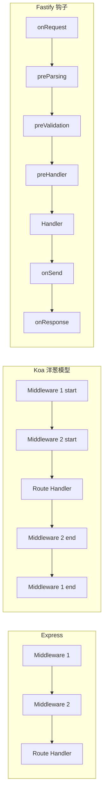
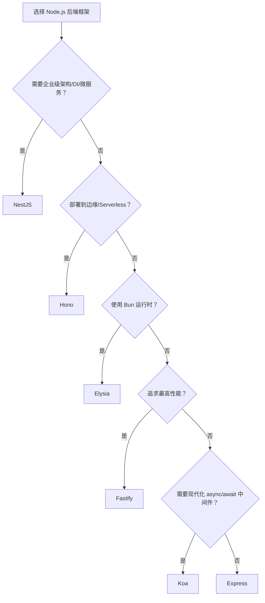

# 后端框架对比矩阵

> 系统对比 Node.js 主流后端框架（Express、Fastify、NestJS、Koa、Hono、Elysia）的性能、架构模式、TypeScript 支持与适用场景。
>
> **最后更新：2026-04**

---

## 核心指标对比

| 指标 | Express | Fastify | NestJS | Koa | Hono | Elysia |
|------|---------|---------|--------|-----|------|--------|
| **发布年份** | 2010 | 2017 | 2017 | 2013 | 2022 | 2023 |
| **维护方** | OpenJS | OpenJS | 社区 (Kamil Myśliwiec) | Koajs | HonoJS | Elysiajs |
| **设计哲学** | 极简中间件 | 高性能 + 插件 | 企业级架构 | 下一代中间件 | 超轻量跨运行时 | Bun 原生端到端类型 |
| **性能 (req/s)** | ~15K | ~50K | ~35K | ~25K | ~70K (Node) / 840K (Cloudflare Workers) | ~100K+ |
| **TypeScript 支持** | 需手动配置 | 极佳（原生） | 极佳（原生） | 需手动配置 | 极佳 | 极佳 |
| **依赖注入 (DI)** | ❌ | ❌ | ✅ 内置 | ❌ | ❌ | ✅ 轻量 |
| **装饰器支持** | ❌ | ❌ | ✅ 核心 | ❌ | ❌ | ✅ 核心 |
| **JSON Schema 验证** | ❌ (需外部) | ✅ 原生 | ⚠️ (需集成) | ❌ | ⚠️ (中间件) | ✅ 原生 |
| **WebSocket 支持** | ❌ (需 Socket.io) | ⚠️ (插件) | ⚠️ (Gateway) | ❌ | ✅ 原生 | ⚠️ (插件) |
| **多运行时支持** | Node.js | Node.js | Node.js | Node.js | Node/Bun/Deno/Edge | Bun/Node.js |
| **学习曲线** | 平缓 | 平缓 | 陡峭 | 中等 | 极平缓 | 平缓 |
| **企业级采用度** | 极高 | 高 | 高 | 中等 | 快速增长 | 早期采用 |

---

## 架构模式与中间件模型

| 特性 | Express | Fastify | NestJS | Koa | Hono | Elysia |
|------|---------|---------|--------|-----|------|--------|
| **中间件模型** | 回调函数 `(req, res, next)` | 钩子 (Hooks) + 插件 | Express 兼容 + 模块化 | 洋葱模型 (async/await) | 标准 Web API (Request/Response) | 类型推导路由 |
| **模块化组织** | 手动 Router | 插件封装 | Module + Controller + Service | 手动 Router | 轻量 Router | 类型推导模块 |
| **ORM 集成** | 任意 | 任意 | Prisma/TypeORM 官方示例 | 任意 | 任意 | 内置类型推导 |
| **微服务支持** | ❌ | ❌ | ✅ RabbitMQ/Kafka/gRPC | ❌ | ❌ | ❌ |
| **GraphQL 集成** | ❌ | ❌ | ✅ @nestjs/graphql | ❌ | ❌ | ⚠️ (插件) |
| **OpenAPI/Swagger** | ❌ (需外部) | ⚠️ (插件) | ✅ @nestjs/swagger | ❌ | ⚠️ (中间件) | ⚠️ (插件) |

---

## 适用场景推荐

| 场景 | 首选 | 次选 | 理由 |
|------|------|------|------|
| 企业级大型后端系统 | **NestJS** | Fastify | 依赖注入、模块化、微服务、GraphQL 一站式支持 |
| 极致性能 API | **Elysia** | Fastify / Hono | Bun 运行时 + 编译时优化带来最高吞吐 |
| 快速原型 / 小型服务 | **Fastify** | Express | 零配置 TS，原生 JSON Schema，开发体验极佳 |
| 边缘计算 / Serverless | **Hono** | Fastify | 超小包体积，多运行时兼容，Cloudflare Workers 首选；840K req/s，WinterTC 合规 |
| 传统项目维护 / 招聘友好 | **Express** | Fastify | 生态最成熟，人才储备最大，中间件最多 |
| 现代化中间件链式控制 | **Koa** | Fastify | 洋葱模型 async/await，错误处理更优雅 |
| 全栈 TypeScript (Bun 生态) | **Elysia** | Hono | Eden Treaty 实现端到端类型安全 API 调用 |

---

## 运行时与部署对比

| 框架 | Node.js | Bun | Deno | Cloudflare Workers | AWS Lambda | Docker |
|------|---------|-----|------|-------------------|------------|--------|
| **Express** | ✅ | ✅ | ⚠️ | ❌ | ✅ | ✅ |
| **Fastify** | ✅ | ✅ | ⚠️ | ❌ | ✅ | ✅ |
| **NestJS** | ✅ | ⚠️ | ❌ | ❌ | ✅ | ✅ |
| **Koa** | ✅ | ✅ | ⚠️ | ❌ | ✅ | ✅ |
| **Hono** | ✅ | ✅ | ✅ | ✅ | ✅ | ✅ |
| **Elysia** | ✅ | ✅ **首选** | ❌ | ⚠️ | ⚠️ | ✅ |

---

## 中间件执行模型对比

---

## 2026 后端生态更新

| 技术 / 框架 | 2026 关键更新 |
|-------------|---------------|
| **Hono** | GitHub Stars 突破 28K，周下载量超 9M；通过 WinterTC / Ecma TC55 合规认证；在 Cloudflare Workers 上可达 **840K req/s**。 |
| **tRPC v11** | 稳定版发布；新增 `httpSubscription` 链接（基于 SSE 的流式传输）、`useSuspenseQuery` Hook、面向 Next.js App Router RSC 的 `createCaller`。 |
| **WinterTC** | 原 WinterCG 于 2024 年 12 月正式升格为 Ecma TC55，成为边缘运行时标准化组织。 |
| **better-auth** | v1.6.x 稳定；框架无关的认证方案，支持多运行时与多种 OAuth 提供商。 |

---

## 决策建议

---

> **关联文档**
>
> - [ORM 对比](./orm-compare.md)
> - [测试框架对比](./testing-compare.md)
> - `docs/categories/14-backend-frameworks.md` — 后端框架生态导航
> - `jsts-code-lab/19-backend-development/` — 后端开发模式实现
