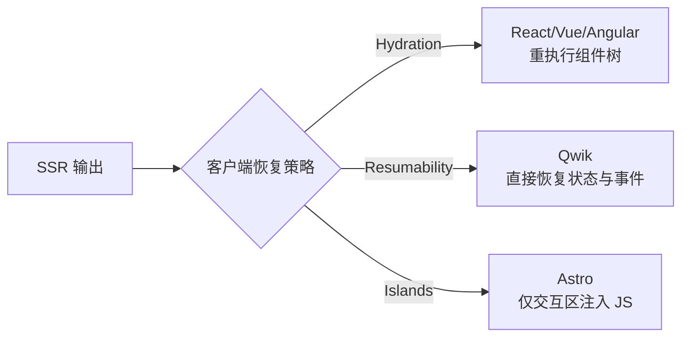
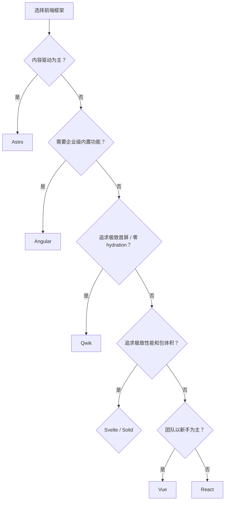

# 前端框架对比矩阵

> 系统对比主流前端框架的核心特性、学习曲线、生态成熟度与适用场景，帮助你为项目选择最合适的 UI 框架。
>
> **最后更新：2026-04**

---

## 核心指标对比

| 指标 | React | Vue | Svelte | Solid | Angular | Qwik | Astro |
|------|-------|-----|--------|-------|---------|------|-------|
| **发布年份** | 2013 | 2014 | 2016 | 2021 | 2010 (AngularJS) / 2016 | 2022 | 2021 |
| **维护方** | Meta | 社区 (Evan You) | 社区 (Rich Harris) | 社区 (Ryan Carniato) | Google | Builder.io | 社区 (Fred K. Schott) |
| **编程范式** | 声明式 UI | 渐进式框架 | 编译时优化 | 细粒度响应式 | 企业级 MVC | 可恢复性 (Resumability) | 内容驱动 / Islands |
| **响应式模型** | 虚拟 DOM + 协调 | 虚拟 DOM + 响应式 | 编译时无虚拟 DOM | 细粒度信号 (Signals) | Zone.js + 变更检测 | 细粒度懒加载 + Signals | 群岛架构 (Islands) |
| **模板语法** | JSX | 单文件组件 (SFC) | 类 HTML + `{#if}` | JSX | 模板 + TypeScript | JSX | Astro 模板 + 框架 Islands |
| **包体积 (gzip)** | ~40KB | ~34KB | ~4KB (运行时) | ~7KB | ~130KB+ | ~1KB (Qwikloader) | ~0KB (默认无 JS) |
| **TypeScript 支持** | 极佳 | 优秀 | 良好 | 良好 | 原生内置 | 官方支持 | 原生内置 |
| **学习曲线** | 中等 | 平缓 | 平缓 | 中等 | 陡峭 | 中等 | 平缓 |
| **企业级生态** | 极强 | 强 | 中等 | 弱 | 极强 | 弱 | 中等 |
| **中文社区活跃度** | 极高 | 极高 | 中等 | 低 | 中等 | 低 | 中等 |

---

## 性能与特性矩阵

| 特性 | React | Vue | Svelte | Solid | Angular | Qwik | Astro |
|------|-------|-----|--------|-------|---------|------|-------|
| **并发渲染** | ✅ (Fiber) | ⚠️ (实验性) | ❌ (不需要) | ❌ (不需要) | ❌ | ❌ (不需要) | ❌ (不需要) |
| **自动 Memoization** | ✅ (React Compiler 1.0) | ⚠️ (Vapor Mode Alpha/Beta) | ✅ 编译时自动 | ✅ 信号级自动 | ❌ (不需要) | ✅ 懒加载自动 | ❌ (不需要) |
| **服务端渲染 (SSR)** | ✅ Next.js (v16) | ✅ Nuxt 4.0 | ✅ SvelteKit | ✅ SolidStart | ✅ Angular Universal | ✅ Qwik City | ✅ 核心设计 |
| **编译时优化** | ✅ (React Compiler 1.0) | ⚠️ (Vapor Mode Alpha/Beta) | ✅ 核心设计 | ✅ 核心设计 | ❌ | ✅ 核心设计 | ✅ 静态编译 |
| **内置状态管理** | ❌ (需外部) | ✅ (Composition API) | ✅ (Stores) | ✅ (Signals) | ✅ (RxJS + Services) | ✅ (Signals) | ❌ (框架 Island 自带) |
| **官方路由** | ❌ (React Router) | ✅ Vue Router | ❌ (SvelteKit 内置) | ❌ (Solid Router) | ✅ Angular Router | ✅ Qwik City | ❌ (文件路由内置) |
| **表单处理** | ❌ (React Hook Form 等) | ❌ (VeeValidate) | ❌ (外部库) | ❌ (外部库) | ✅ (Reactive Forms) | ❌ (外部库) | ❌ (外部库) |
| **移动端方案** | React Native | UniApp / NativeScript | NativeScript | NativeScript | Ionic | N/A | N/A |
| **零/低 Hydration** | ⚠️ (RSC 部分) | ❌ | ❌ | ❌ | ❌ | ✅ Resumability | ✅ Islands |
| **Server Islands** | ⚠️ (Next.js 部分支持) | ❌ | ❌ | ❌ | ❌ | ❌ | ✅ 原生支持 |
| **View Transitions** | ✅ (React 19.2) | ⚠️ (实验性) | ✅ SvelteKit 内置 | ⚠️ (社区) | ❌ | ⚠️ (社区) | ✅ 原生支持 |

---

## 框架维度深度对比

### React Compiler vs. 传统手动优化

| 维度 | React (手动优化) | React (Compiler 1.0) | Solid | Svelte |
|------|-----------------|----------------------|-------|--------|
| **优化方式** | `useMemo` / `useCallback` 手动声明 | 构建时自动推导依赖并插入缓存 | 信号级自动追踪 | 编译时自动生成响应式代码 |
| **开发者负担** | 高（需正确维护依赖数组） | 低（编译器自动处理） | 低 | 低 |
| **性能提升** | 依赖开发者水平 | 35%–60% 减少不必要 re-render | 基准测试领先 | 极小运行时开销 |
| **约束条件** | 需遵循 React Rules | 更严格（Rules of React） | 信号读取规则 | 编译器透明 |

### Resumability vs. Hydration vs. Islands

| 特性 | Hydration (传统) | Resumability (Qwik) | Islands (Astro) |
|------|-----------------|---------------------|-----------------|
| **首屏 JS 执行** | 全量执行组件逻辑 | 接近零（仅 1KB loader） | 零（纯 HTML） |
| **交互延迟** | 需等待 hydration 完成 | 事件触发时懒加载处理器 | 仅 Islands 区域需加载 |
| **状态恢复** | 重新创建 + 注水 | 从服务端序列化状态直接恢复 | 静态页面无状态恢复 |
| **适用场景** | 通用 Web 应用 | 内容型 / 电商 / 营销页 | 博客 / 文档 / 营销页 |

---

## 适用场景推荐

| 场景 | 首选 | 次选 | 理由 |
|------|------|------|------|
| 大型企业级应用 | **Angular** | React | 内置路由、表单、依赖注入、强类型约束 |
| 超大型生态/招聘友好 | **React** | Vue | 人才储备最多，第三方库最全 |
| 快速开发/中小型项目 | **Vue** | React | 学习成本低，文档友好，SFC 开发效率高 |
| 极致性能/小型应用 | **Svelte** | Solid | 编译时优化带来最小运行时开销 |
| 高交互/复杂状态管理 | **Solid** | React | Signals 模型提供最优的细粒度更新 |
| 全栈 TypeScript | **Angular** / **Next.js** | Nuxt | 端到端类型安全与规范约束 |
| 首屏极致 / Core Web Vitals | **Qwik** | Astro | Resumability 零 hydration， instantly interactive |
| 内容驱动型网站 | **Astro** | Next.js | Islands 架构默认零 JS，SEO 与性能最优 |
| 渐进增强现有站点 | **Astro** | htmx | 静态外壳 + 局部交互，最小侵入 |

---

## 2026 生态重大更新

| 框架 / 技术 | 2026 关键更新 |
|-------------|---------------|
| **React 19.2** | 2026 年初稳定发布；引入 Activity 组件、`useEffectEvent`、PPR（Partial Prerendering）、Performance Tracks。React Compiler 1.0 已于 2025 年 10 月达到稳定。 |
| **Vue 3.6** | 当前处于 Alpha/Beta 阶段；Vapor Mode 编译为直接 DOM 操作，基线包体积 <10KB。Nuxt 4.0 已正式发布。 |
| **Svelte 5** | Runes 成为标准语法；在 js-framework-benchmark 中比 React 19 快 39%。 |
| **Astro v6** | Beta 阶段；2026 年 1 月被 Cloudflare 收购；开发服务器直接在 Cloudflare Runtime 中运行。 |
| **Next.js v16** | 稳定版发布；Turbopack 成为生产环境默认打包工具。 |
| **TanStack Start** | v1.16x；通过 `@tanstack/react-start-rsc` 实验性支持 React Server Components (RSC)。 |
| **Signals 范式** | State of JS 2025 调查显示，47% 的受访者使用基于 Signals 的状态管理方案。 |
| **React 20** | ⚠️ 截至 2026 年 4 月，React 20 **不存在**，请勿轻信谣言。 |

---

## 决策建议

---

> **关联文档**
>
> - [前端框架生态库](../categories/01-frontend-frameworks.md)
> - [UI 组件库对比](./ui-libraries-compare.md)
> - [状态管理对比](./state-management-compare.md)
> - `jsts-code-lab/18-frontend-frameworks/` — 框架实现原理与示例代码
