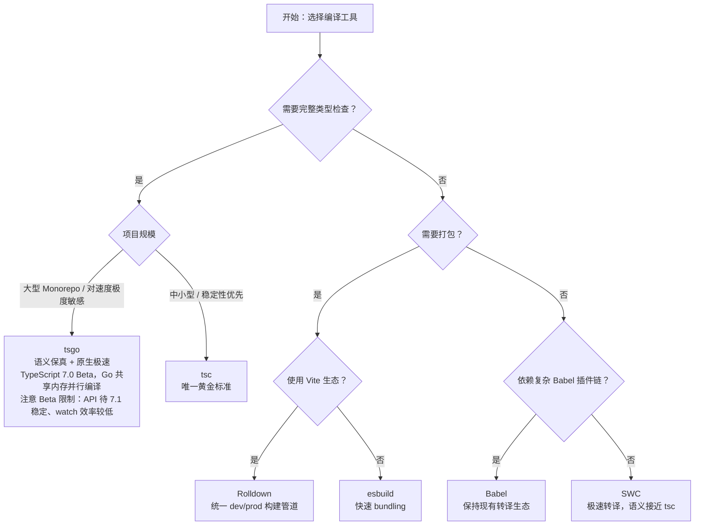

# JavaScript / TypeScript 编译器与转译器对比矩阵

> 最后更新：2026-04
> 本次更新：补充 TypeScript 6.0 正式发布、TypeScript 7.0 Beta（tsgo）最新状态，新增运行时生态（Node.js 24、Deno 2.7、Bun 1.3.x）更新。

## 引言

本矩阵聚焦**编译语义**维度，而非单纯的功能罗列。开发者在使用 TypeScript 时，往往面临"转译结果是否 100% 等价于 `tsc`"的隐性问题。不同工具对类型擦除、装饰器展开、模块降级等关键语义的处理存在差异，这些差异会直接影响运行时行为与调试体验。本文通过 6 款主流工具的横向对比，帮助你在速度与语义保真度之间做出理性权衡。

## 核心对比表

| 维度 | tsc | Babel | SWC | esbuild | Rolldown | tsgo (TypeScript 7.0 Beta) |
|------|-----|-------|-----|---------|----------|----------------------|
| **类型擦除策略** | 🟢 100% 标准语义 | 🟡 高度兼容，存在 `const enum` / `namespace` 等 edge cases | 🟡 高度兼容，极少数枚举 / `using` 差异 | 🟡 基本兼容，`enum` 与命名空间处理有差异 | 🟢 基于 Oxc，Rust 实现，Vite 6+ 生产级底层；装饰器与 TS 语义已完整 | 🟢 与 tsc 100% 语义一致；Go 共享内存并行编译，10× 性能提升 |
| **装饰器支持** | 🟢 Legacy + Stage 3 双模式 | 🟢 通过插件分别支持两种模式 | 🟢 Legacy + Stage 3 | 🟡 Stage 3 为主，legacy 支持有限 | 🟢 Stage 3 装饰器 lowering 已达生产水准 | 🟢 与 tsc 完全一致 |
| **模块语法降级** | 🟢 ESM→CJS / UMD / AMD | 🟢 高度可定制的 CJS 转换 | 🟢 ESM→CJS 等 | 🟢 内置多 format 输出 | 🟢 Bundler 级别，format 丰富 | 🟢 完整支持 |
| **Source Map 生成质量** | 🟢 列级精确 | 🟢 高质量，支持 inputSourceMap 链式 | 🟢 高质量 | 🟡 快但部分场景精度略低 | 🟢 Rust 实现，列级精确，与 Rollup 生态一致 | 🟢 与 tsc 一致的列级精确 source map |
| **增量编译 / 并行构建** | 🟡 增量编译（单线程） | 🔵 依赖外部构建工具缓存 | 🟢 原生并行 | 🟢 Go goroutine 原生并行 | 🟢 Rust 多线程并行 | 🟢 Go 共享内存并行 + 增量构建 |
| **与 `isolatedDeclarations` 兼容性** | 🟢 原生支持并强制执行 | ⚪ 不适用（不生成 .d.ts） | 🟡 实验性 .d.ts 生成支持 | ⚪ 不适用（不生成 .d.ts） | ⚪ 需插件生成 .d.ts | 🟢 原生支持 |
| **与 Node.js native TS (type stripping) 兼容性** | 🟢 可通过 `verbatimModuleSyntax` 严格限定 | 🟢 本质上处理 erasable syntax | 🟢 兼容 | 🟢 兼容 | 🟢 兼容 | 🟢 兼容 |
| **类型检查能力** | 🟢 完整类型检查 | 🔴 仅转译 | 🔴 仅转译 | 🔴 仅转译 | 🔴 仅转译 / 打包 | 🟢 完整类型检查（Go 原生实现） |
| **典型适用场景** | 库开发、语义敏感型项目 | 遗留项目、复杂插件链 | Next.js、大型应用 | 快速 bundling、工具链内部 | Vite 生态、现代 Web 应用 | 超大型 Monorepo、追求速度且不愿牺牲语义（Beta 阶段谨慎评估限制） |

## 逐工具语义分析

### tsc

作为 TypeScript 的参考实现，`tsc` 是语义保真度的唯一黄金标准。它同时负责类型检查与代码生成，因此在类型擦除、装饰器展开、模块降级等所有环节都保持绝对一致。对于需要发布 npm 库或运行时有严格语义要求的项目，`tsc` 仍是不二之选；其唯一的短板是大型项目下的单线程编译速度。

### TypeScript 6.0（2026年3月23日发布）

TypeScript 6.0 是当前的稳定版本，带来了若干影响深远的语言与配置变更：
- **`--strict` 默认启用**：新项目初始化时严格模式自动开启，减少潜在类型漏洞
- **移除 `baseUrl`**：长期废弃的 `baseUrl` 配置被正式删除，项目需迁移至 `paths` 映射或 Node.js 子路径导入
- **新增内置类型**：`Map.prototype.emplace` 与 `WeakMap.prototype.emplace`（Upsert 方法）的类型定义；Temporal API 类型支持进入稳定阶段
- 此版本为 TypeScript 7.0（tsgo）的并行开发提供了语义基准

### Babel

`@babel/preset-typescript` 使 Babel 能够以极低的接入成本处理 `.ts` 文件，但它的定位是"JavaScript 转译器 + 类型语法剥离"。由于 Babel 不解析类型语义，`const enum` 的常量内联、命名空间合并等需要类型系统辅助的擦除行为，其结果可能与 `tsc` 存在细微差异；若项目中已经深度依赖 Babel 插件生态，建议搭配 `tsc --noEmit` 做独立类型检查。

### SWC

用 Rust 重写的 SWC 是目前生产环境中最成熟的"tsc 极速替代品"，在 Next.js 等框架中已默认采用。SWC 的类型擦除语义非常接近 `tsc`，日常开发中几乎不会遇到差异；但它仍然是一个纯转译器，不提供类型检查能力，因此需要与 `tsc` 或编辑器 LSP 配合工作。

### esbuild

esbuild 以 Go 语言实现了极快的解析与打包流水线，其类型擦除实现追求"足够好且足够快"。这意味着在 `enum` 常量折叠、`namespace` 合并、`export =` 等边缘语法上，esbuild 的输出可能与 `tsc` 不一致。它最适合作为构建工具链的内部依赖（如 Vite 的依赖预编译）或原型开发，而不推荐直接用于发布 TypeScript 库的编译。

### Rolldown

Rolldown 是 Vite 生态向 Rust 统一工具链迈进的关键成果，底层依托 Oxc（Rust 实现的 JS/TS 解析器与转译器）完成解析、转译与打包。作为 bundler，它的核心优势在于用**单一 Rust 引擎**替代了 esbuild + Rollup 的双引擎架构，彻底消除了 dev/prod 构建行为的差异：开发时无需 esbuild 预编译依赖，生产构建直接由 Rolldown 完成 Tree Shaking 与代码分割。

截至 2026 年 4 月，Rolldown 的 Stage 3 装饰器 lowering、类型擦除语义与 Source Map 生成已达到生产可用水准，成为 **Vite 6+ 的默认底层打包器**。对于追求极致构建速度且深度绑定 Vite 生态的项目，Rolldown 是当前最优的 bundler 选择；其唯一的限制是与纯 Rollup 插件生态的 100% 兼容性仍在持续完善中。

### tsgo（TypeScript 7.0 Beta，2026年4月21日发布）

代号 Project Corsa 的 `tsgo` 是微软对 TypeScript 编译器的 Go 语言原生重写，采用共享内存并行编译（Shared-Memory Parallel Compilation）与扁平化 AST 内存布局。

TypeScript 7.0 目前处于 **Beta 阶段**（2026 年 4 月 21 日发布），尚未达到生产环境 GA 标准：
- **性能**：VS Code 代码库（约 150 万行）类型检查从 **89s 降至 8.7s**，提升约 **10 倍**；内存占用大致减半
- **`--incremental` 与 `--build` 模式**：完整移植，Monorepo 场景受益显著
- **当前限制（Beta 阶段）**：
  - 稳定的程序化 API（Compiler API）推迟至 **7.1** 版本，目前工具链作者需等待或使用实验性绑定
  - JavaScript 文件输出（JS emit）尚未完整，部分边缘场景可能存在差异
  - `--watch` 模式效率低于 tsc，增量监视性能仍在优化中
- 适合愿意承担 Beta 风险的超大型 Monorepo 项目，或用于 CI 构建场景的性能验证

## 运行时与原生 TypeScript 执行生态

除传统的"转译 → 运行"模式外，2026 年运行时原生支持 TypeScript 的趋势持续深化：

### Node.js 24 LTS（Type Stripping 转正）

Node.js 24 进入 LTS 周期，`--experimental-strip-types` 标志正式毕业为**稳定功能**：
- 运行时直接执行 `.ts` 文件，Node 在内部剥离类型注解后交由 V8 执行
- 无需外部转译器即可运行简单 TypeScript 脚本，降低入门门槛
- 适用于 CLI 工具、服务端脚本等不需要复杂类型检查的场景

### Deno 2.7

Deno 持续强化其"原生 TypeScript 运行时"定位：
- **内置 KV 存储**：`Deno.Kv` 正式内置，提供轻量级持久化方案
- **`deno audit`**：新增依赖安全审计命令，直接扫描已知漏洞
- **Deno Deploy GA**：边缘部署平台正式商用
- **Temporal API 稳定化**：时间处理 API 达到稳定状态

### Bun 1.3.x

Bun 在运行时性能与 Node.js 兼容性上持续突破：
- **原生驱动**：内置 S3 与 SQL 驱动，减少外部依赖
- **兼容性**：宣称达到 **99.7%** Node.js API 兼容度
- **生态变动**：Bun 所属公司 Oven 于 **2025 年底被 Anthropic 收购**，未来发展方向与 AI 工具链深度整合值得关注

## 编译速度对比数据（2026-04）

以下数据基于 VS Code 代码库（约 150 万行 TypeScript）实测：

| 工具 | 冷构建时间 | 增量构建 | 并行能力 | 类型检查 |
|------|-----------|---------|---------|---------|
| **tsc (TS 6.0)** | ~89s | ~15s | ❌ 单线程 | 🟢 完整 |
| **tsgo (TS 7.0 Beta)** | **~8.7s** | **~2s** | 🟢 Go 共享内存并行 | 🟢 完整 |
| **SWC** | ~3s | ~1s | 🟢 Rust 多线程 | 🔴 无 |
| **esbuild** | ~2.5s | ~0.8s | 🟢 Go goroutine | 🔴 无 |
| **Rolldown (Oxc)** | ~4s | ~1.2s | 🟢 Rust 多线程 | 🔴 无 |
| **Babel** | ~45s | ~12s | 🔵 依赖外部缓存 | 🔴 无 |

> **关键结论**：tsgo 在保持 100% tsc 语义一致的前提下，实现了约 **10 倍** 的构建速度提升；SWC/esbuild/Rolldown 等转译器在纯转译场景下速度更快，但不提供类型检查。

## 工程选型决策树

## 参考资源

- [TypeScript 官方文档](https://www.typescriptlang.org/docs/)
- [Babel TypeScript Preset](https://babeljs.io/docs/babel-preset-typescript)
- [SWC 文档](https://swc.rs/docs/)
- [esbuild 文档](https://esbuild.github.io/)
- [Rolldown 文档](https://rolldown.rs/)
- [TypeScript 7.0 / Project Corsa 公告](https://devblogs.microsoft.com/typescript/)
- [Node.js TypeScript Type Stripping 文档](https://nodejs.org/api/typescript.html)
